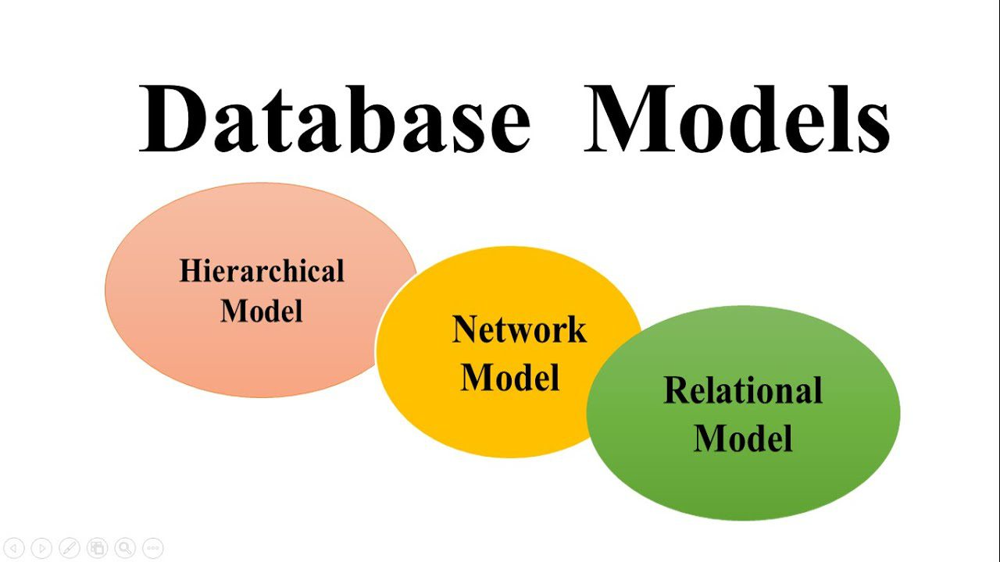
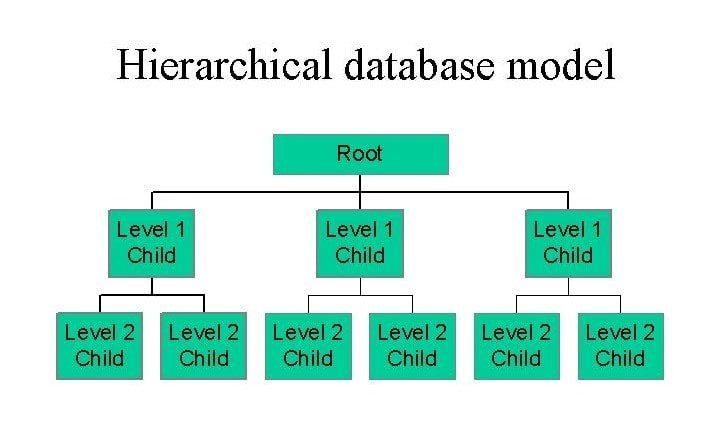
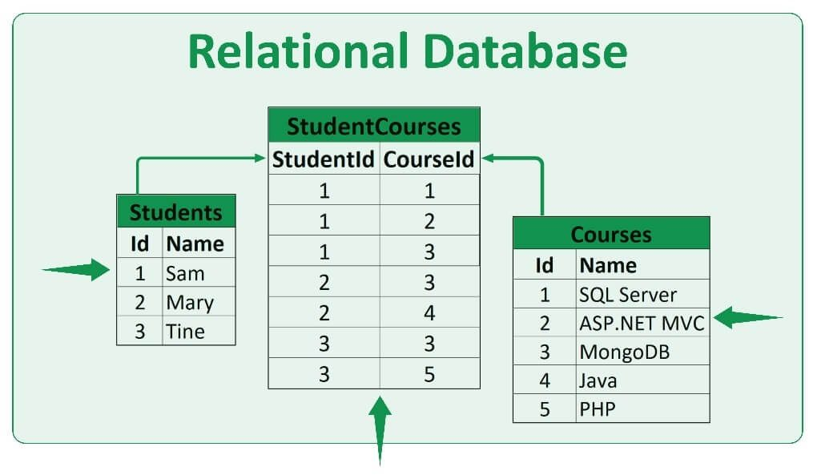
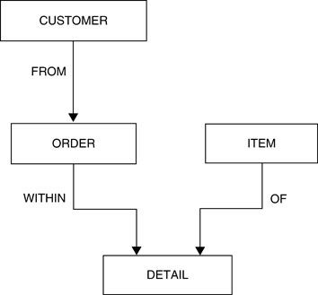
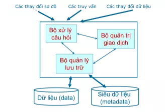
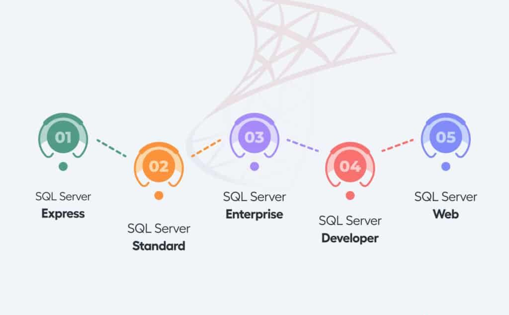
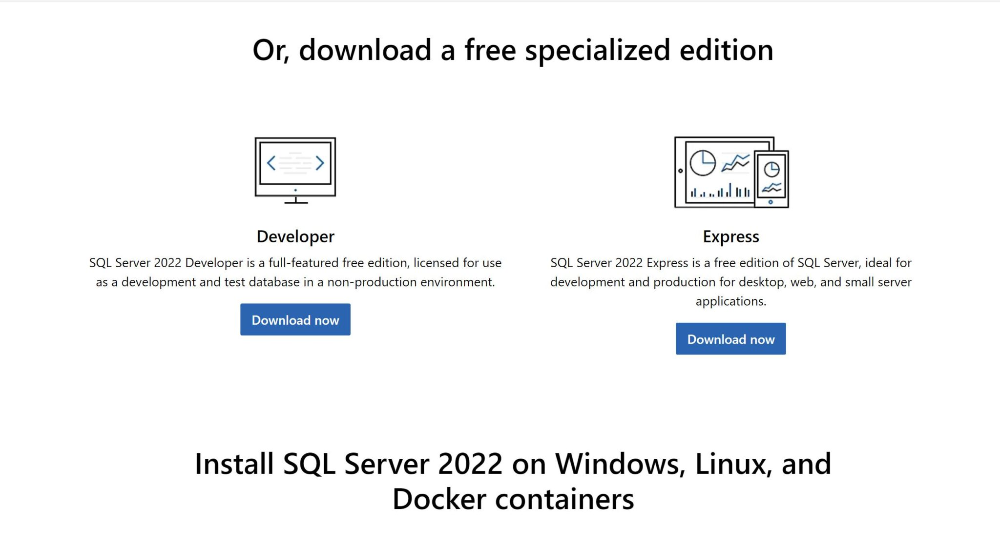

# [Buổi 1] Nhập môn CSDL
# - Nội dung cần chuẩn bị
# + CSDL là gì ?
## Khái niệm
- **Cơ sở dữ liệu (database)** là một tập hợp các dữ liệu **rời rạc** được tổ chức, lưu trữ và quản lý theo hệ thống để có thể dễ dàng truy xuất, chỉnh sửa và cập nhật. Chúng thường được sử dụng để lưu trữ thông tin trong các hệ thống phần mềm và ứng dụng, từ dữ liệu cá nhân cho đến thông tin doanh nghiệp quan trọng. Cơ sở dữ liệu giúp các tổ chức và cá nhân tổ chức dữ liệu một cách có cấu trúc, nhằm mục đích quản lý và xử lý dữ liệu hiệu quả hơn.
VD: Trong cuộc sống bạn có thể thấy rất nhiều cơ sở dữ liệu đó, nếu bạn vào thư viện thì ở trên đó là một cơ sở dữ liệu, phân loại sách theo chủ đề: xã hội, tự nhiên, khoa học … đó cũng là một dạng cở sở dữ liệu đơn giản.

**Mục đích ta sử dụng CSDL** là vì cho dễ quản lý và tìm kiếm, thống nhất việc lưu trữ thông tin. Có thể tìm kiếm một cách nhanh chóng khi cần thông tin nào đó và cũng có thể lôi các thông tin liên quan với thông tin đó ra luôn.

## Đặc điểm của Cơ sở dữ liệu
Cơ sở dữ liệu (CSDL) có nhiều đặc điểm quan trọng giúp quản lý, tổ chức và xử lý dữ liệu một cách hiệu quả. Những đặc điểm này đảm bảo rằng dữ liệu được lưu trữ, truy xuất và bảo mật một cách tối ưu, đồng thời hỗ trợ các ứng dụng và hệ thống trong việc quản lý thông tin. Dưới đây là các đặc điểm chính của cơ sở dữ liệu:

**1. Tính tổ chức và cấu trúc**: CSDL tổ chức dữ liệu theo một cấu trúc có hệ thống, thường được thiết kế dưới dạng bảng, đối tượng hoặc mô hình dữ liệu khác. Cấu trúc này giúp dữ liệu được tổ chức một cách hợp lý, dễ dàng truy cập và quản lý.
**2. Khả năng truy xuất và tìm kiếm**: CSDL cho phép người dùng truy xuất và tìm kiếm dữ liệu nhanh chóng và hiệu quả thông qua các truy vấn. Các hệ quản trị cơ sở dữ liệu (DBMS) cung cấp ngôn ngữ truy vấn, chẳng hạn như SQL, để thực hiện các thao tác này.
**3. Tính nhất quán và toàn vẹn**: CSDL đảm bảo rằng dữ liệu luôn được duy trì một cách chính xác và nhất quán thông qua các ràng buộc toàn vẹn. Các quy tắc này bao gồm khóa chính, khóa ngoại và các hạn chế khác để bảo vệ dữ liệu khỏi lỗi và mất mát.
**4. Khả năng mở rộng**: CSDL có thể mở rộng để xử lý khối lượng dữ liệu ngày càng tăng và đáp ứng nhu cầu của ứng dụng. Điều này có thể được thực hiện thông qua việc thêm phần cứng hoặc sử dụng các kỹ thuật phân tán và phân mảnh dữ liệu.
**5. Bảo mật và quyền truy cập**: CSDL cung cấp các cơ chế bảo mật để bảo vệ dữ liệu khỏi các truy cập trái phép. Điều này bao gồm việc thiết lập quyền truy cập, mã hóa dữ liệu và theo dõi các hoạt động của người dùng.
**6. Khả năng sao lưu và phục hồi**: CSDL hỗ trợ sao lưu dữ liệu định kỳ và phục hồi dữ liệu khi xảy ra sự cố. Các chức năng này giúp đảm bảo rằng dữ liệu có thể được khôi phục về trạng thái trước đó trong trường hợp mất mát hoặc hỏng hóc.
**7. Quản lý giao dịch**: CSDL hỗ trợ quản lý giao dịch, đảm bảo rằng các thao tác trên dữ liệu được thực hiện một cách nguyên tử, nhất quán, tách biệt và bền vững. Điều này giúp duy trì tính toàn vẹn của dữ liệu ngay cả khi xảy ra lỗi hệ thống.
**8. Khả năng hỗ trợ đồng thời**: CSDL có khả năng xử lý nhiều yêu cầu và giao dịch đồng thời từ nhiều người dùng mà không làm giảm hiệu suất hoặc làm mất dữ liệu. Điều này được thực hiện thông qua các cơ chế khóa và quản lý đồng thời.
**9. Tính tương thích**: CSDL có thể tương thích với các ứng dụng và hệ thống khác thông qua các giao thức và giao diện chuẩn. Điều này cho phép tích hợp dữ liệu từ nhiều nguồn khác nhau và hỗ trợ các quy trình doanh nghiệp.
## Phân loại DataBase
### Phân loại theo loại dữ liệu
- **Cơ sở dữ liệu có cấu trúc** (Structured Database): Dữ liệu được tổ chức theo cấu trúc cố định, thường là các bảng với hàng và cột. Ví dụ: **Cơ sở dữ liệu quan hệ (RD**BMS) như MySQL, PostgreSQL.
- **Cơ sở dữ liệu phi cấu trú**c (Unstructured Database): Dữ liệu không có cấu trúc cố định, chẳng hạn như văn bản tự do, email, hình ảnh. Ví dụ: Dữ liệu trong các hệ thống lưu trữ đám mây.
- **Cơ sở dữ liệu bán cấu trúc** (Semi-Structured Database): Dữ liệu có cấu trúc nhưng không hoàn toàn theo quy tắc cố định. Ví dụ: Dữ liệu JSON, XML.
### Phân loại theo mô hình tổ chức và lưu trữ
- **Cơ sở dữ liệu quan hệ** (Relational Database): Dữ liệu được lưu trữ trong các bảng và có thể được liên kết với nhau thông qua các khóa. Ví dụ: MySQL, Oracle, SQL Server.
- **Cơ sở dữ liệu phân cấp** (Hierarchical Database): Dữ liệu được tổ chức theo cấu trúc cây với các mối quan hệ cha-con. Ví dụ: IBM Information Management System (IMS).
- **Cơ sở dữ liệu mạng** (Network Database): Dữ liệu được tổ chức theo mạng lưới với các mối quan hệ linh hoạt hơn giữa các bản ghi. Ví dụ: Integrated Data Store (IDS).
- **Cơ sở dữ liệu hướng đối tượng** (Object-Oriented Database): Dữ liệu được lưu trữ dưới dạng các đối tượng, tương tự như lập trình hướng đối tượng. Ví dụ: ObjectDB, db4o.
- **Cơ sở dữ liệu NoSQL** (Not Only SQL): Dữ liệu được lưu trữ theo nhiều mô hình khác nhau không phải là bảng. Ví dụ: MongoDB (dữ liệu tài liệu), Cassandra (dữ liệu cột), Redis (dữ liệu key-value).
### Phân loại theo mô hình triển khai
- **Cơ sở dữ liệu tập trung** (Centralized Database): Được lưu trữ và quản lý tại một địa điểm duy nhất. Ví dụ: Cơ sở dữ liệu trong các hệ thống máy chủ trung tâm.
- **Cơ sở dữ liệu phân tán**(Distributed Database): Dữ liệu được lưu trữ và xử lý tại nhiều địa điểm khác nhau, kết nối qua mạng. Ví dụ: Google Cloud Spanner, Apache Cassandra.
- **Cơ sở dữ liệu tập trung có bản sao** (Centralized with Replica Database): Kết hợp giữa cơ sở dữ liệu tập trung và phân tán, với một cơ sở dữ liệu chính và các bản sao ở các địa điểm khác. Ví dụ: Hệ thống sao lưu dữ liệu trong các dịch vụ đám mây.
## Mô hình cơ sở dữ liệu
Cơ sở dữ liệu là phần quan trọng trong việc tổ chức và quản lý dữ liệu. Các mô hình cơ sở dữ liệu khác nhau cung cấp cách tiếp cận khác nhau để lưu trữ, truy xuất, và quản lý thông tin. Dưới đây là ba mô hình cơ sở dữ liệu phổ biến: phân cấp, quan hệ và mạng.

### Mô Hình Cơ Sở Dữ Liệu Phân Cấp (Hierarchical Database)
Mô hình cơ sở dữ liệu phân cấp (Hierarchical Database) tổ chức dữ liệu theo cấu trúc cây, nơi các bản ghi dữ liệu được sắp xếp theo mối quan hệ cha-con. Đây là mô hình cơ sở dữ liệu đầu tiên được phát triển và đã được sử dụng rộng rãi trong những năm 1960 và 1970.

Trong mô hình phân cấp, mỗi bản ghi (hoặc nút) có thể có một số bản ghi con, nhưng mỗi bản ghi con chỉ có một bản ghi cha. Cấu trúc này giống như một cây gia đình hoặc một danh mục thư viện, nơi các mục lục con nằm dưới các mục lục lớn hơn. Ví dụ, một cơ sở dữ liệu phân cấp có thể tổ chức thông tin nhân viên trong một công ty, với các phòng ban là các nút cha và các nhân viên là các nút con.


**Ưu điểm:**
- Dễ dàng và trực quan trong việc mô hình hóa các mối quan hệ có cấu trúc rõ ràng.
- Hiệu suất tốt với các truy vấn theo cấu trúc cây.

**Nhược điểm:**
- Kém linh hoạt trong việc xử lý các mối quan hệ phức tạp hoặc nhiều cấp độ.
- Khó khăn trong việc thực hiện các thao tác thay đổi cấu trúc dữ liệu.
### Cơ Sở Dữ Liệu Quan Hệ (Relational Database)
Mô hình cơ sở dữ liệu quan hệ (Relational Database) là mô hình phổ biến nhất hiện nay. Dữ liệu được tổ chức trong các bảng (hay còn gọi là thực thể), mỗi bảng bao gồm các hàng và cột. Các bảng có thể liên kết với nhau thông qua các khóa (keys), chẳng hạn như khóa chính (primary key) và khóa ngoại (foreign key).

Trong mô hình quan hệ, dữ liệu được lưu trữ trong các bảng với định dạng cấu trúc rõ ràng, và các mối quan hệ giữa các bảng được quản lý thông qua các thuộc tính chung. Ví dụ, một cơ sở dữ liệu quan hệ có thể có một bảng lưu thông tin về khách hàng và một bảng khác lưu thông tin về đơn hàng, với khóa ngoại liên kết đơn hàng với khách hàng.

Cơ Sở Dữ Liệu Quan Hệ (Relational Database)
**Ưu điểm:**
- Tính linh hoạt cao trong việc quản lý và truy xuất dữ liệu nhờ vào các mối quan hệ giữa các bảng.
Dễ dàng thực hiện các truy vấn phức tạp bằng cách sử dụng ngôn ngữ truy vấn SQL (Structured Query Language).

**Nhược điểm:**
- Có thể gặp khó khăn với hiệu suất khi làm việc với khối lượng dữ liệu rất lớn hoặc cấu trúc dữ liệu phức tạp.
Đòi hỏi phải quản lý cấu trúc dữ liệu và các mối quan hệ một cách chặt chẽ.
### Cơ Sở Dữ Liệu Mạng (Network Database)
Mô hình cơ sở dữ liệu mạng (Network Database) là một mô hình tiến hóa từ mô hình phân cấp, cung cấp sự linh hoạt cao hơn trong việc tổ chức dữ liệu. Trong mô hình mạng, dữ liệu được lưu trữ theo dạng mạng lưới, cho phép các bản ghi có thể có nhiều mối quan hệ cha-con, không bị giới hạn như trong mô hình phân cấp.

Mô hình mạng sử dụng các liên kết để kết nối các bản ghi với nhau, cho phép một bản ghi có thể liên kết với nhiều bản ghi khác. Điều này làm cho mô hình mạng phù hợp với các ứng dụng có yêu cầu xử lý mối quan hệ phức tạp giữa các phần tử dữ liệu.

**Ưu điểm:**

- Linh hoạt trong việc xử lý các mối quan hệ phức tạp và đa chiều giữa các bản ghi.
- Có thể cải thiện hiệu suất khi xử lý các truy vấn yêu cầu liên kết dữ liệu từ nhiều nguồn.
**Nhược điểm:**

- Cấu trúc dữ liệu có thể trở nên phức tạp và khó quản lý, đặc biệt là khi mở rộng hệ thống.
- Cần có sự hiểu biết sâu về mô hình mạng để thiết kế và duy trì cơ sở dữ liệu hiệu quả.
## Ứng Dụng Của Cơ Sở Dữ Liệu
Cơ sở dữ liệu (CSDL) là công cụ quan trọng trong việc quản lý và tổ chức thông tin, cung cấp các lợi ích và ứng dụng rộng rãi trong nhiều lĩnh vực khác nhau. Dưới đây là các ứng dụng tiêu biểu của cơ sở dữ liệu

### Quản lý doanh nghiệp
Trong môi trường doanh nghiệp, cơ sở dữ liệu được sử dụng để quản lý thông tin khách hàng, đơn hàng, hàng tồn kho và các quy trình kinh doanh khác. Ví dụ, hệ thống ERP (Enterprise Resource Planning) sử dụng cơ sở dữ liệu để tích hợp và quản lý các chức năng kinh doanh như tài chính, nhân sự và sản xuất.

### Ngành ngân hàng và tài chính
Ngành ngân hàng sử dụng cơ sở dữ liệu để quản lý tài khoản khách hàng, giao dịch, báo cáo tài chính và các hoạt động ngân hàng khác. Hệ thống cơ sở dữ liệu giúp theo dõi các giao dịch trong thời gian thực và đảm bảo tính chính xác của thông tin tài chính.

### Ngành y tế
Trong ngành y tế, cơ sở dữ liệu được sử dụng để lưu trữ hồ sơ bệnh nhân, kết quả xét nghiệm, lịch sử điều trị và thông tin y tế khác. Cơ sở dữ liệu giúp cải thiện khả năng truy cập và chia sẻ thông tin giữa các cơ sở y tế, hỗ trợ trong việc chẩn đoán và điều trị bệnh.

### Ngành giáo dục
Các tổ chức giáo dục sử dụng cơ sở dữ liệu để quản lý thông tin sinh viên, điểm số, lịch học và tài nguyên học tập. Hệ thống quản lý học tập (LMS) thường sử dụng cơ sở dữ liệu để cung cấp các công cụ hỗ trợ học tập và quản lý lớp học.

### Thương mại điện tử
Trong thương mại điện tử, cơ sở dữ liệu được sử dụng để lưu trữ thông tin sản phẩm, đơn hàng, khách hàng và giao dịch. Các hệ thống cơ sở dữ liệu giúp quản lý các hoạt động kinh doanh trực tuyến và cung cấp trải nghiệm mua sắm hiệu quả cho người tiêu dùng.

### Khoa học và nghiên cứu
Cơ sở dữ liệu được sử dụng trong các lĩnh vực khoa học và nghiên cứu để lưu trữ và phân tích dữ liệu thí nghiệm, nghiên cứu và các thông tin liên quan khác. Các cơ sở dữ liệu khoa học hỗ trợ việc lưu trữ dữ liệu lớn và cung cấp công cụ phân tích mạnh mẽ.
# + Hệ quản trị CSDL là gì ?
Hệ quản trị cơ sở dữ liệu (DBMS) là một phần mềm cho phép tạo lập các CSDL cho các ứng dụng khác nhau và điều khiển mọi truy cập tới các CSDL đó. Nghĩa là, hệ quản trị CSDL cho phép định nghĩa (xác định kiểu, cấu trúc, ràng buộc dữ liệu), tạo lập (lưu trữ dữ liệu trên các thiết bị nhớ) và thao tác (truy vấn, cập nhật, kết xuất, ...) các CSDL cho các ứng dụng khác nhau. Ví dụ: MS. Access, MS. SQL Server, ORACLE, IBM DB2, ...


**Bộ Quản lý lưu trữ**

- Lưu trữ và truy xuất dữ liệu trên các thiết bị nhớ.
- Tổ chức tối ưu dữ liệu trên thiết bị nhớ.
- Tương tác hiệu quả với bộ quản lý tệp.

**Bộ xử lý câu hỏi**

- Tìm kiếm dữ liệu trả lời cho một yêu cầu truy vấn.
- Biến đổi truy vấn ở mức cao thành các yêu cầu có thể hiểu được bởi hệ CSDL.
- Lựa chọn một kế hoạch tốt nhất để trả lời truy vấn này.

**Bộ Quản trị giao dịch**

- Định nghĩa giao dịch: một tập các thao tác được xử lý như một đơn vị không chia căt được.
- Đảm bảo tính đúng đắn và tính nhất quán của dữ liệu.
- Quản lý điều khiển tương tranh.
- Phát hiện lỗi và phục hồi CSDL
- Một số hệ quản trị CSDL

Dưới đây là bản trình bày lại phần bạn đưa với định dạng **Markdown** rõ ràng, dễ đọc và hệ thống hơn:

---

# Một số hệ quản trị CSDL

## 1. MySQL

MySQL là hệ quản trị cơ sở dữ liệu tự do nguồn mở phổ biến nhất thế giới, được các nhà phát triển rất ưa chuộng trong quá trình phát triển ứng dụng.

* **Ưu điểm**:

  * Tốc độ cao, ổn định, dễ sử dụng.
  * Khả chuyển, hoạt động trên nhiều hệ điều hành (Windows, Linux, Mac OS X, Unix, FreeBSD, NetBSD, Solaris, ...).
  * Hỗ trợ nhiều ngôn ngữ lập trình (PHP, Perl, ...).
  * Hệ thống phân quyền người dùng riêng.
  * Bảo mật tốt, phù hợp cho ứng dụng web.

* **Phiên bản**:

  * **Community Server** (miễn phí).
  * **Enterprise Server** (có phí).

* **Đặc điểm**:

  * Dữ liệu được quản lý qua các **CSDL** → mỗi CSDL có nhiều **bảng quan hệ**.
  * Mỗi người dùng có **username** và **password** riêng để truy xuất CSDL.
  * Bắt buộc phải xác thực khi truy vấn (giống SQL Server).

---

## 2. SQL Server

Microsoft SQL Server là hệ quản trị cơ sở dữ liệu quan hệ do Microsoft phát triển.

* **Đặc điểm**:

  * Lưu trữ dữ liệu trong các **bảng**.
  * Hỗ trợ **quan hệ giữa các bảng**.
  * Có khả năng **mở rộng**, lưu trữ lượng dữ liệu lớn.
  * Cho phép **nhiều người dùng truy cập đồng thời**.
  * Cung cấp công cụ quản trị và bảo trì CSDL.

* **Các phiên bản phổ biến**: SQL Server 7.0, 2000, 2005, 2008, …

* **Một số bản phát hành chính**:

  * **Enterprise**: đầy đủ tính năng, hỗ trợ tới 32 CPU và 64GB RAM, có dịch vụ Analysis Service.
  * **Standard**: giống Enterprise nhưng hạn chế tính năng cao cấp, chạy trên 2 CPU và 4GB RAM.
  * **Personal**: dùng trên PC, hỗ trợ Windows 9x, XP, 2000, 2003.
  * **Desktop Engine**: engine nhỏ gọn, không có GUI, giới hạn 2GB dữ liệu.
  * **Win CE**: cho ứng dụng chạy trên Windows CE.
  * **Trial**: dùng thử, giới hạn thời gian.
  * **SQL Client**: dành cho máy khách, cung cấp GUI để khai thác dữ liệu.
  * **SQL Connectivity Only**: chỉ hỗ trợ kết nối, không có GUI.

---

## 3. DB2 (IBM)

DB2 là hệ quản trị cơ sở dữ liệu quan hệ của IBM, ra đời năm 1982.

* **Hỗ trợ hệ điều hành**: Unix (AIX), Linux, IBM i (OS/400), z/OS, Windows Server.

* **Ngôn ngữ chính**: SQL.

* **Các phiên bản**:

  * **DB2 for Z/OS**: cho hệ thống mainframe.
  * **DB2 Personal Edition**: cho người dùng cá nhân.
  * **DB2 Enterprise Server Edition (ESE)**: bản đầy đủ với mô hình client/server.
  * **DB2 Workgroup Server Edition (WSE)**: dành cho doanh nghiệp nhỏ và vừa, tương tự ESE nhưng không kết nối máy tính lớn.

---

## 4. Oracle Database

Oracle là hệ quản trị cơ sở dữ liệu phổ biến nhất thế giới, ra đời năm 1979.

* **Đặc trưng**:

  * Mạnh mẽ nhưng phức tạp.
  * Luôn đi đầu trong xu hướng (ví dụ: **Oracle 12c** hướng đến mô hình đám mây).
  * Quản lý cơ sở dữ liệu như dịch vụ cloud.

* **Lịch sử phát hành nổi bật**:

  * 1977: Phiên bản 1
  * 1979: Phiên bản 2
  * 1983–1984: Phiên bản 3 & 4
  * 1985: Phiên bản 5 (SQLNet – Client/Server)
  * 1988: Phiên bản 6 (Sequence, ghi trễ)
  * 1992: Oracle7 (SQL*DBA)
  * 1999: Oracle8i (i = Internet)
  * 2001–2002: Oracle9i
  * 2004–2005: Oracle10g (g = Grid)
  * 2007–2009: Oracle11g
  * 2013–2017: Oracle12c (c = Cloud)
  * 2018: Oracle18c

* **Các phiên bản phổ biến**:

  * **Express Edition (XE)**: đơn giản nhất, miễn phí, dễ cài đặt.
  * **Standard Edition One**.
  * **Standard Edition**.
  * **Enterprise Edition**: mạnh mẽ nhất, nhiều tính năng bảo mật cao cấp.
  * **Personal Edition**: giống Enterprise nhưng dành cho 1 người dùng, không có RAC.

---


# + Cài đặt MS SQL Server
## SQL Server là gì?
SQL Server là gì? SQL Server hay Microsoft SQL Server là một hệ thống quản trị cơ sở dữ liệu quan hệ (Relational Database Management System – RDBMS) được phát triển bởi Microsoft vào năm 1988. Nó được sử dụng để tạo, duy trì, quản lý và triển khai hệ thống RDBMS. 

Được thiết kế để quản lý và lưu trữ dữ liệu, SQL Server cho phép người dùng truy vấn, thao tác và quản lý dữ liệu một cách hiệu quả và an toàn. SQL Server là một trong những hệ quản trị cơ sở dữ liệu phổ biến nhất trên thế giới và được sử dụng rộng rãi trong các doanh nghiệp.

Phần mềm SQL Server được sử dụng khá rộng rãi vì nó được tối ưu để có thể chạy trên môi trường cơ sở dữ liệu rất lớn lên đến Tera – Byte cùng lúc phục vụ cho hàng ngàn user. Bên cạnh đó, ứng dụng này cung cấp đa dạng kiểu lập trình SQL từ ANSI SQL (SQL truyền thống) đến SQL và cả T-SQL (Transaction-SQL) được sử dụng cho cơ sở dữ liệu quan hệ nâng cao.

T-SQL là một ngôn ngữ mở rộng của SQL với các tính năng bổ sung như biến, điều kiện, vòng lặp và xử lý ngoại lệ, giúp người dùng viết các đoạn mã SQL mạnh mẽ và linh hoạt hơn.
## Cấu trúc của SQL Sever

###  Các thành phần chính của SQL Server

SQL Server là một hệ quản trị cơ sở dữ liệu phức tạp với nhiều thành phần cấu thành giúp nó hoạt động hiệu quả và đáng tin cậy. Trong đó, SQL Server gồm ba thành phần quan trọng: **Database Engine**, **SQLOS** và **External Protocols**.

---

## 1. Database Engine
Database Engine là thành phần chính của MS SQL Server, chịu trách nhiệm quản lý và xử lý dữ liệu. Nó bao gồm các thành phần con quan trọng sau:

### 1.1 Storage Engine
- **File Storage**: Quản lý các tệp dữ liệu và tệp nhật ký giao dịch.  
  - Tệp dữ liệu: `.mdf`, `.ndf`  
  - Tệp nhật ký giao dịch: `.ldf`
- **Buffer Manager**: Quản lý bộ nhớ đệm (buffer pool), lưu trữ các trang dữ liệu được truy cập gần đây để tăng tốc độ truy vấn.
- **Transaction Log**: Ghi lại mọi thay đổi dữ liệu để đảm bảo tính toàn vẹn và khả năng phục hồi của cơ sở dữ liệu.

### 1.2 Query Processor
- **Parser**: Phân tích cú pháp các câu lệnh SQL và chuyển chúng thành cây cú pháp (syntax tree).
- **Optimizer**: Tối ưu hóa các kế hoạch thực hiện truy vấn dựa trên thống kê và chi phí ước tính.
- **Executor**: Thực hiện các kế hoạch truy vấn đã được tối ưu hóa và trả về kết quả.

### 1.3 Relational Engine
- **Metadata Manager**: Quản lý thông tin về cấu trúc cơ sở dữ liệu như bảng, chỉ mục, ràng buộc và các đối tượng khác.
- **Transaction Manager**: Quản lý các giao dịch, đảm bảo tính nhất quán, cách ly và độ bền của giao dịch (ACID).
- **Concurrency Control**: Điều khiển đồng thời, sử dụng **locking** và **versioning** để quản lý truy cập song song.

---

## 2. SQLOS (SQL Server Operating System)
SQLOS là lớp trừu tượng phần cứng và hệ điều hành, cung cấp dịch vụ nền tảng cho Database Engine. Nó chịu trách nhiệm quản lý tài nguyên hệ thống như **bộ nhớ, CPU và I/O**.

### 2.1 Memory Management
- **Memory Allocation**: Quản lý phân bổ và giải phóng bộ nhớ.  
- **Buffer Pool**: Lưu trữ các trang dữ liệu được truy cập gần đây để giảm truy cập đĩa.

### 2.2 Scheduler
- **Task Management**: Quản lý các tác vụ và luồng, đảm bảo phân bổ hiệu quả.  
- **Worker Threads**: Các luồng công việc xử lý truy vấn và thao tác khác.

### 2.3 I/O Management
- **I/O Requests**: Quản lý yêu cầu đọc/ghi dữ liệu từ đĩa.  
- **Async I/O**: Hỗ trợ I/O bất đồng bộ để tăng hiệu suất.

### 2.4 Synchronization
- **Lock Manager**: Quản lý các khóa để kiểm soát truy cập đồng thời.  
- **Latches và Spinlocks**: Cơ chế khóa nhẹ để bảo vệ cấu trúc dữ liệu nội bộ.

---

## 3. External Protocols
External Protocol bao gồm các giao thức giúp SQL Server tương tác với hệ thống/ứng dụng bên ngoài.

- **TDS (Tabular Data Stream)**: Giao thức chính để trao đổi dữ liệu giữa SQL Server và ứng dụng khách (SSMS, ứng dụng web, …).  
- **ODBC & OLE DB**: Chuẩn kết nối dữ liệu cho các ứng dụng ngoài SQL Server.  
- **JDBC**: Giao thức chuẩn cho ứng dụng Java kết nối SQL Server.  
- **HTTP/HTTPS**: Hỗ trợ dịch vụ web (SSRS, SSIS) để SQL Server cung cấp dữ liệu qua web.

---
## # SQL Server dùng để làm gì?

**SQL Server** là một hệ quản trị cơ sở dữ liệu mạnh mẽ và linh hoạt do Microsoft phát triển, được sử dụng rộng rãi trong nhiều lĩnh vực khác nhau. Các chức năng chính của SQL Server bao gồm **tạo và duy trì cơ sở dữ liệu, phân tích dữ liệu và tạo báo cáo**.  

Dưới đây là các ứng dụng cụ thể của SQL Server:

---

## 1. Tạo và duy trì cơ sở dữ liệu
SQL Server được sử dụng để tạo và duy trì các cơ sở dữ liệu quan hệ, cung cấp nền tảng vững chắc cho việc lưu trữ và quản lý dữ liệu.  

### Các chức năng chính:
- **Quản lý dữ liệu**:  
  SQL Server cho phép người dùng tạo, sửa đổi và xóa các bảng dữ liệu, chỉ mục, và các mối quan hệ giữa các bảng.  
  Hệ thống quản lý dữ liệu của SQL Server hỗ trợ các thao tác **CRUD** (Create, Read, Update, Delete), giúp quản lý dữ liệu một cách hiệu quả.

- **Bảo mật dữ liệu**:  
  SQL Server cung cấp các tính năng bảo mật mạnh mẽ như mã hóa dữ liệu, kiểm soát truy cập dựa trên vai trò và xác thực người dùng.  
  Các biện pháp bảo mật này đảm bảo rằng dữ liệu được bảo vệ khỏi các mối đe dọa và truy cập trái phép.

- **Quản lý giao dịch**:  
  SQL Server hỗ trợ các tính năng quản lý giao dịch theo nguyên tắc **ACID** (Atomicity, Consistency, Isolation, Durability),  
  đảm bảo các thay đổi trong cơ sở dữ liệu được thực hiện một cách nhất quán và an toàn.  
  Điều này đặc biệt quan trọng với các ứng dụng yêu cầu độ tin cậy cao như **tài chính, ngân hàng và thương mại điện tử**.

- **Sao lưu và phục hồi**:  
  SQL Server cung cấp các tính năng sao lưu và phục hồi dữ liệu (toàn bộ, gia tăng, khác biệt).  
  Giúp bảo vệ dữ liệu khỏi mất mát do **lỗi phần cứng, phần mềm hoặc lỗi con người**, đảm bảo dữ liệu có thể được phục hồi nhanh chóng.

---

## 2. Phân tích dữ liệu và tạo báo cáo
SQL Server không chỉ là công cụ quản lý dữ liệu mà còn tích hợp các tính năng phân tích mạnh mẽ, hỗ trợ đưa ra quyết định dựa trên dữ liệu.

### Các chức năng chính:
- **Phân tích dữ liệu (Analysis Services - SSAS)**:  
  Cho phép xây dựng mô hình dữ liệu phức tạp, phân tích sâu, tạo báo cáo phân tích, biểu đồ và dashboard.  
  Hỗ trợ người dùng hiểu rõ dữ liệu và xu hướng.

- **Tạo báo cáo (Reporting Services - SSRS)**:  
  Công cụ tạo, quản lý và triển khai báo cáo.  
  Hỗ trợ nhiều định dạng như **PDF, Excel, HTML**, dễ chia sẻ và trình bày.  
  Báo cáo có thể được tùy chỉnh cho nhu cầu cụ thể của doanh nghiệp (ví dụ: báo cáo tài chính, hiệu suất kinh doanh).

- **Khai thác dữ liệu (Data Mining)**:  
  Hỗ trợ phát hiện các **mẫu và xu hướng ẩn** trong dữ liệu lớn.  
  Giúp doanh nghiệp **dự đoán và ra quyết định** dựa trên dữ liệu, cải thiện hiệu suất và tăng cường cạnh tranh.

- **Tích hợp dữ liệu (Integration Services - SSIS)**:  
  Công cụ tích hợp dữ liệu từ nhiều nguồn khác nhau vào một cơ sở dữ liệu duy nhất.  
  Hỗ trợ quy trình **ETL (Extract – Transform – Load)**: làm sạch, chuyển đổi và tải dữ liệu.  
  Giúp đảm bảo dữ liệu **luôn được cập nhật và nhất quán**.

## Các ấn bản SQL Server


SQL Server có bốn phiên bản chính với những dịch vụ khác nhau:

- Developer: sử dụng cho việc phát triển và thử nghiệm cơ sở dữ liệu.
- Expression: dành cho lượng cơ sở dữ liệu nhỏ, dung lượng lưu trữ trên đĩa không quá 10GB.
- Enterprise: sử dụng cho những ứng dụng lớn hơn và quan trọng hơn, phiên bản này bao gồm tất cả các tính năng của SQL Server.
- Standard: ở ấn bản này chứa một phần tính năng của ấn bản Enterprise và giới hạn về cấu hình số lượng lõi bộ xử lý và bộ nhớ trên máy chủ.
---
## Cách cài đặt
### Bước 1: Tải SQL Server
1. **Truy cập trang tải SQL Server**: Truy cập trang web chính thức của Microsoft để tải SQL Server Express: SQL Server Express
2. **Chọn phiên bản SQL Server Express**: Tại trang tải xuống, bạn sẽ thấy các tùy chọn tải về. Chọn phiên bản SQL Server 2022 Express và nhấn nút **Download now**.

### Bước 2: Cài đặt SQL Server
1. **Khởi chạy file cài đặt**: Sau khi tải về, chạy file cài đặt `SQL2022-SSEI-Expr.exe`.
2. **Chọn kiểu cài đặt**: Trong cửa sổ cài đặt, chọn `Basic` để thực hiện cài đặt cơ bản.
3. **Chấp nhận điều khoản**: Đọc và chấp nhận các điều khoản sử dụng của Microsoft. Nhấn `Accept` để tiếp tục.
4. **Chọn thư mục cài đặt**: Chọn thư mục để cài đặt SQL Server hoặc giữ mặc định. Nhấn `Install` để bắt đầu quá trình cài đặt.
5. **Chờ quá trình cài đặt hoàn tất**: Quá trình cài đặt có thể mất vài phút. Đợi cho đến khi cài đặt hoàn tất.
6. **Hoàn thành cài đặt**: Khi cài đặt hoàn tất, bạn sẽ thấy màn hình xác nhận. Nhấn `Close` để hoàn thành quá trình cài đặt SQL Server.
### Bước 3: Cài đặt SQL Server Management Studio (SSMS)

**SQL Server Management Studio (SSMS)** là công cụ quản lý và phát triển SQL Server. Dưới đây là các bước để cài đặt:

1. **Truy cập trang tải SSMS**  
   - Vào trang web chính thức của Microsoft để tải SQL Server Management Studio: [Download SSMS](https://aka.ms/ssmsfullsetup).

2. **Tải SSMS**  
   - Nhấn vào liên kết tải xuống để tải file cài đặt SSMS.

3. **Khởi chạy file cài đặt**  
   - Sau khi tải về, chạy file **SSMS-Setup-ENU.exe**.

4. **Chọn thư mục cài đặt**  
   - Chọn thư mục để cài đặt SSMS hoặc giữ mặc định.  
   - Nhấn **Install** để bắt đầu quá trình cài đặt.

5. **Chờ quá trình cài đặt hoàn tất**  
   - Quá trình cài đặt có thể mất vài phút.  
   - Đợi cho đến khi cài đặt hoàn tất.

6. **Hoàn thành cài đặt**  
   - Khi cài đặt hoàn tất, bạn sẽ thấy màn hình xác nhận.  
   - Nhấn **Close** để hoàn tất quá trình cài đặt SSMS.

---

### Bước 4: Kết nối với SQL Server bằng SSMS

1. **Khởi chạy SSMS**  
   - Mở **SQL Server Management Studio** từ menu **Start** hoặc gõ "SSMS" trong tìm kiếm.

2. **Kết nối với SQL Server**  
   Trong cửa sổ **Connect to Server**, nhập thông tin kết nối:
   - **Server type**: Chọn *Database Engine*.  
   - **Server name**: Nhập tên máy chủ (ví dụ: `localhost` cho cài đặt cục bộ).  
   - **Authentication**:  
     - *Windows Authentication*: dùng tài khoản Windows hiện tại.  
     - *SQL Server Authentication*: nhập *Login* và *Password* (ví dụ: `sa`).  

3. **Nhấn Connect** để kết nối với SQL Server.

---

# + Câu lệnh tạo database, table trong MS SQL Server

---

# Database trong SQL

Database SQL Server bao gồm một tập hợp các bảng lưu trữ một tập hợp dữ liệu có cấu trúc cụ thể. Một bảng chứa một tập hợp các hàng, còn được gọi là bản ghi hoặc bộ dữ liệu, và các cột, còn được gọi là thuộc tính. Mỗi cột trong bảng được thiết kế để lưu trữ một loại thông tin nhất định.

**DATABASE của SQL Server được lưu trữ dưới 3 loại tập tin:**

* **Tập tin dữ liệu chính (.mdf):** Chứa dữ liệu và cấu trúc chính của cơ sở dữ liệu.
* **Tập tin dữ liệu phụ (.ndf):** Chứa dữ liệu bổ sung, giúp phân phối dữ liệu trên nhiều ổ đĩa.
* **Tập tin nhật ký giao dịch (.ldf):** Lưu trữ các giao dịch, đảm bảo khả năng khôi phục và tính nhất quán của dữ liệu.

---

# Các thành phần chính của Database SQL

* **Bảng (Table):** Là thành phần cơ bản trong cơ sở dữ liệu SQL, chứa các dữ liệu được tổ chức dưới dạng hàng và cột. Mỗi bảng lưu trữ thông tin về một đối tượng cụ thể.
* **Hàng (Row):** Còn được gọi là bản ghi (record), mỗi hàng trong bảng chứa dữ liệu về một thực thể đơn lẻ.
* **Cột (Column):** Đại diện cho các thuộc tính (field) của dữ liệu trong bảng, mỗi cột lưu trữ một loại thông tin cụ thể.
* **Khóa chính (Primary Key):** Là một hoặc nhiều cột trong bảng dùng để xác định duy nhất mỗi hàng trong bảng đó.
* **Khóa ngoại (Foreign Key):** Là một hoặc nhiều cột trong bảng này tham chiếu đến khóa chính của bảng khác, tạo liên kết giữa các bảng.
* **Chỉ mục (Index):** Giúp tăng tốc độ truy vấn và truy xuất dữ liệu trong cơ sở dữ liệu.

# Tổng hợp kiến thức về SQL Server

---

## 1) Trên cơ sở dữ liệu (Database)

### Các phiên bản của SQL Server
- Enterprise  
- Personal  
- Desktop  
- Developer  

### Các bộ phận của SQL Server
- Enterprise Manager  
- Query Analyzer  
- Books Online  

### Các loại tập tin của SQL Server
- **Data file**: Primary (.mdf), Secondary (.ndf)  
- **Log file**: Transaction log (.ldf)  

### Các loại cơ sở dữ liệu của SQL Server
- **System database**  
- **User database**  

### Các lệnh cơ bản
- **Tạo cơ sở dữ liệu**
```sql
create database HoSoSinhVien
on (name='HSSV_data', filename='c:HSSV_data.mdf')
log on (name='HSSV_log', filename='c:HSSV_log.ldf')
```

- **Xóa cơ sở dữ liệu**
```sql
drop database HoSoSinhVien
```

- **Sửa thông tin cơ sở dữ liệu**
```sql
alter database HoSoSinhVien
modify name = HSSV
```

- **Sử dụng sp_dboption**
```sql
exec sp_dboption HoSoSinhVien, 'read only', 'true'
exec sp_dboption HoSoSinhVien, 'autoshrink', 'true'
exec sp_dboption HoSoSinhVien, 'single_user'
```

- **DBCC**
```sql
dbcc shrinkdatabase(HoSoSinhVien, 10)
```

---

## 2) Trên bảng (Table)

### Các kiểu số liệu
- text  
- binary  
- numeric  
- money  
- datetime  
- bit  
- variant  

### Các ràng buộc
- default  
- check  
- unique  
- foreign  
- primary  

### Các kiểu toàn vẹn
- entity  
- domain  
- referential  
- user  

### Các thuộc tính bổ trợ
- identity  
- null  

### Các lệnh cơ bản
- **Tạo bảng**
```sql
create table SinhVien (MaSV int, TenSV nchar(50))
```

- **Tạo bảng với ràng buộc**
```sql
create table SinhVien (
  MaSV int primary key,
  TenSV nvarchar(50) not null,
  QueQuan int references DiaPhuong(MaDP)
)
```

- **Xóa bảng**
```sql
drop table SinhVien
```

- **Thêm cột**
```sql
alter table SinhVien add QueQuan int
```

- **Xóa cột**
```sql
alter table SinhVien drop column QueQuan
```

- **Thêm thuộc tính not null**
```sql
alter table SinhVien alter column TenSV nchar(50) not null
```

- **Thêm khóa chính**
```sql
alter table SinhVien alter column MaSV int not null
go
alter table SinhVien add primary key (MaSV)
```

- **Thêm khóa ngoại**
```sql
alter table SinhVien add foreign key (QueQuan) references DiaPhuong(MaDP)
```

- **Thêm mặc định**
```sql
alter table SinhVien add default 'khong ten' for TenSV
```

- **Xem thông tin bảng**
```sql
exec sp_help SinhVien
```

---

## 3) Trên bản ghi (Record)

### Các lệnh cơ bản
- **Thêm bản ghi**
```sql
insert into SinhVien (MaSV, TenSV, QueQuan)
values (1, N'Nguyễn Văn A', 1)
```

- **Thêm bản ghi từ bảng khác**
```sql
insert into DocGia
select MaSV, TenSV, QueQuan from SinhVien
```

- **Select vào bảng mới**
```sql
select MaSV, TenSV, Diem
into SinhVienKha
from SinhVien
where Diem > 7.0
```

- **Xóa bản ghi**
```sql
delete from SinhVien where MaSV=1234
```

- **Xóa toàn bộ bản ghi**
```sql
truncate table SinhVien
```

- **Cập nhật bản ghi**
```sql
update SinhVien set NhomTruong = 1 where MaSV < 4
update SinhVien set NhomTruong = 4 where (MaSV > 3 and MaSV < 8)
```

---

## 4) Truy vấn (Query)

### Hỗ trợ truy vấn
- distinct  
- top  
- as  
- identity  

### Phép toán tập hợp
- in  
- like  
- between  

### Các hàm tổng nhóm
- sum  
- max  
- min  
- avg  

---

### 4.1 Truy vấn đơn giản
- **Hiện tất cả bảng**
```sql
select * from SinhVien
```

- **Hiện một số cột**
```sql
select TenSV, DiemTB from SinhVien
```

- **Có điều kiện where**
```sql
select TenSV, DiemTB
from SinhVien
where DiemTB > 6.0
```

- **Sắp xếp**
```sql
select TenSV, DiemTB
from SinhVien
order by DiemTB desc, TenSV asc
```

- **Distinct**
```sql
select distinct QueQuan from SinhVien
```

- **Top**
```sql
select top 3 TenSV, DiemTB
from SinhVien
order by DiemTB desc, TenSV asc
```

---

### 4.2 Truy vấn lồng nhau
- **Subquery trong where**
```sql
select TenNV, Luong
from NhanVien
where Luong = (select max(Luong) from NhanVien)
```

- **Sử dụng in**
```sql
select TenNV, Luong
from NhanVien
where Luong in (select top 2 Luong from NhanVien order by Luong)
```

- **So sánh theo phòng**
```sql
select nv1.TenNV, nv1.Luong
from NhanVien as nv1
where nv1.Luong = (
  select max(Luong)
  from NhanVien
  where Phong = nv1.Phong
)
```

---

### 4.3 Truy vấn tổng nhóm
- **Group by**
```sql
select QueQuan, count(*)
from NhanVien
group by QueQuan
```

- **Having**
```sql
select Phong, sum(Luong)
from NhanVien
group by Phong
having sum(Luong) > 5000000
```

---

### 4.4 Truy vấn liên bảng (Join)
- **Inner join**
```sql
select NhanVien.TenNV, DiaPhuong.TenDP
from NhanVien
inner join DiaPhuong on NhanVien.QueQuan = DiaPhuong.MaDP
```

- **Left join**
```sql
select NhanVien.TenNV, DiaPhuong.TenDP
from NhanVien
left outer join DiaPhuong on NhanVien.QueQuan = DiaPhuong.MaDP
```

- **Right join**
```sql
select NhanVien.TenNV, DiaPhuong.TenDP
from NhanVien
right outer join DiaPhuong on NhanVien.QueQuan = DiaPhuong.MaDP
```

- **Full join**
```sql
select NhanVien.TenNV, DiaPhuong.TenDP
from NhanVien
full outer join DiaPhuong on NhanVien.QueQuan = DiaPhuong.MaDP
```

- **Cross join**
```sql
select NhanVien.TenNV, DiaPhuong.TenDP
from NhanVien
cross join DiaPhuong
```

---

## Tham khảo thêm

### Xem tất cả cơ sở dữ liệu
```sql
select * from master.dbo.sysdatabases where sid <> 1
```

### Xem tất cả bảng trong cơ sở dữ liệu
```sql
select * from Northwind.dbo.sysobjects where xtype='U'
```

### Xem tất cả cột trong bảng
```sql
declare @x int
set @x = (select id from sysobjects where name='Employees')
select * from syscolumns where id = @x
```

### Bảng tạm
```sql
declare @x table(MaSV int, TenSV nvarchar(20))
insert into @x values(1, N'Thưởng')
insert into @x values(2, N'Yến')
select * from @x
```

### Biến tạm
```sql
declare @t money
set @t = (select max(UnitPrice) from Northwind.dbo.products)
select * from Northwind.dbo.products where UnitPrice >= @t
```

---

## Các khái niệm cơ bản của cơ sở dữ liệu

### Các mô hình dữ liệu
- Mô hình thứ bậc (Hierarchical)  
- Mô hình mạng lưới (Network)  
- Mô hình quan hệ (Relational)  

### Các vấn đề của lưu trữ
- Sự dư thừa (Redundance)  
- Sự nhất quán (Consistence)  
- Tính toàn vẹn (Integrity)  
- Sự an toàn (Security)  
- Sự chia sẻ (Sharing)  

### Các khái niệm cơ bản
- Cơ sở dữ liệu (Database)  
- Bảng (Table) / Quan hệ (Relation)  
- Bản ghi (Record) / Dòng (Row) / Bộ (Tuple)  
- Trường (Field) / Cột (Column)  
- Mối quan hệ (Relationship)  

---

## Vấn đề toàn vẹn dữ liệu

### Toàn vẹn dữ liệu
- **Thực thể (Entity integrity)**: primary key, unique, identity  
- **Tham chiếu (Referential integrity)**: foreign key, check  
- **Miền dữ liệu (Domain integrity)**: default, foreign key, check, not null  
- **Người dùng (User integrity)**: rules, stored procedures, triggers  

### Các hỗ trợ toàn vẹn
- Check constraint  
- Default constraint  
- Unique constraint  
- Foreign key constraint  
- Primary key constraint  
- Identity property  
- Not null property  

---

## Các kiểu dữ liệu

- **Giá trị nhị phân**: bit  
- **Số nguyên**: bigint, int, smallint, tinyint  
- **Số thực xấp xỉ**: float, real  
- **Số thực chính xác**: decimal, numeric  
- **Tiền tệ**: money, smallmoney  
- **Thời gian**: datetime, smalldatetime  
- **Chuỗi**: char, varchar, text, nchar, nvarchar, ntext  
- **Chuỗi nhị phân**: binary, varbinary, image  
- **Kiểu khác**: cursor, table, variant, timestamp, uniqueidentifier  

---

## Ghi chú

### Trong SQL, `##` nghĩa là gì?
- `##` được dùng để khai báo **Global Temporary Table**.  
  - `#TableName`: Bảng tạm cục bộ (Local Temporary Table) – chỉ tồn tại trong session hiện tại.  
  - `##TableName`: Bảng tạm toàn cục (Global Temporary Table) – tồn tại cho đến khi tất cả session sử dụng nó đóng lại.

### Cài đặt MySQL Community Server trên macOS
- Tải từ trang chính thức [MySQL Downloads](https://dev.mysql.com/downloads/).  
- Cài đặt bằng file `.dmg`.  
- Khởi động bằng MySQL Workbench hoặc Terminal.  

---