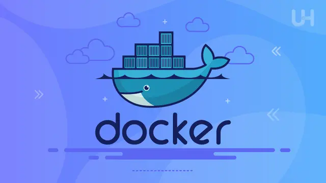
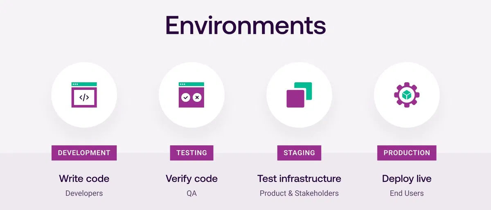
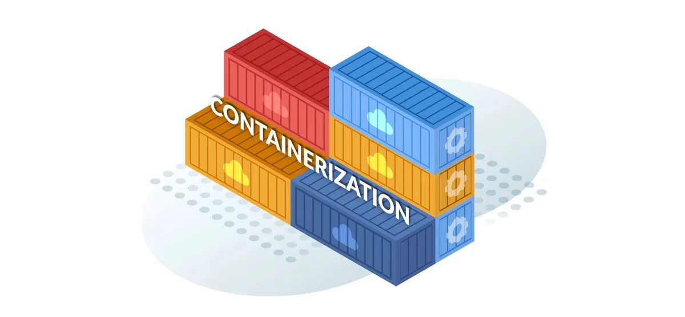
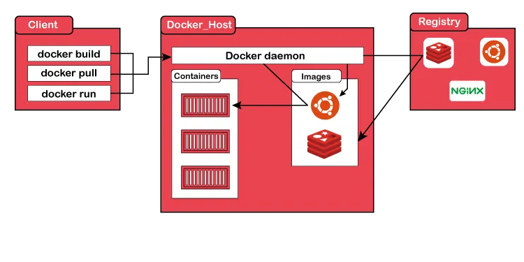
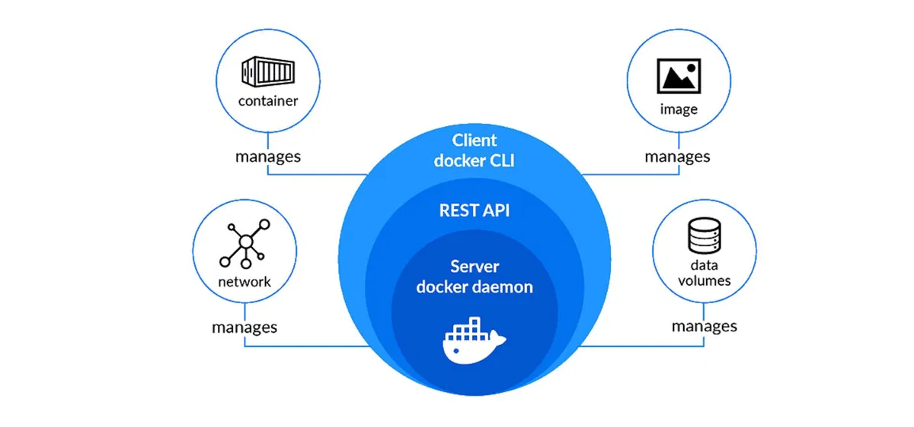
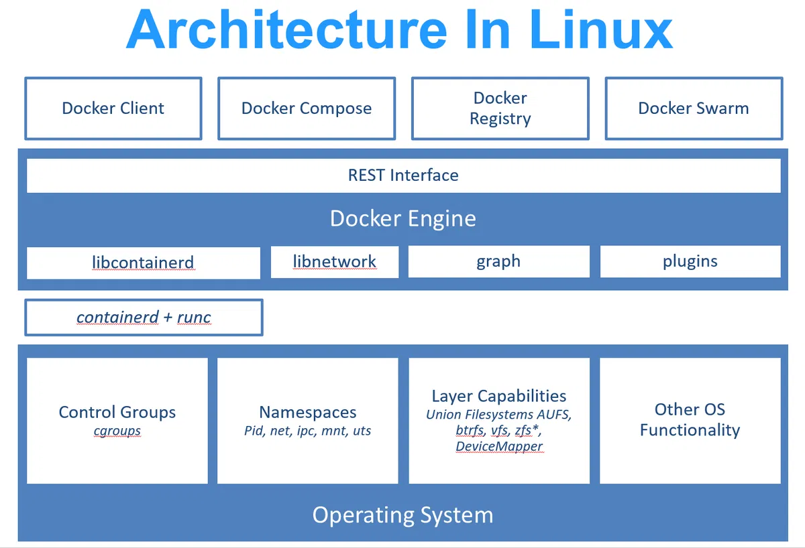
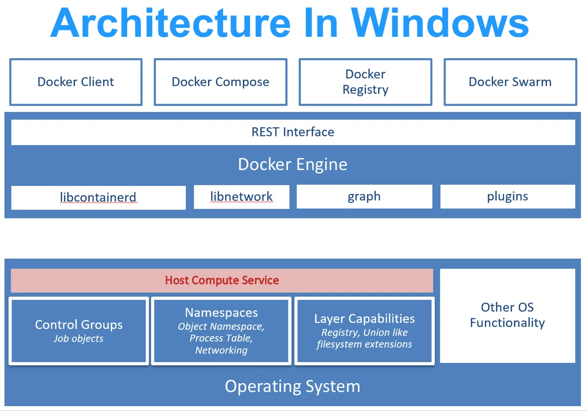

Triển khai (Deploy) một dự án phần mềm là quá trình đưa mã nguồn từ máy cá nhân (Local) lên môi trường server để người dùng cuối có thể truy cập được.

Dưới đây là quy trình chuẩn chung cho hầu hết các dự án web/app hiện nay (từ Front-end, Back-end đến Database):

### 1. Giai đoạn Chuẩn bị (Preparation)

Trước khi đưa code lên server, bạn cần đảm bảo mã nguồn đã sẵn sàng và môi trường được cấu hình đúng.

* **Kiểm tra Code (Code Review & Clean up):** Đảm bảo không còn các dòng `console.log` thừa, code rác hoặc các dữ liệu fix cứng (hard-coded) dùng cho debug.
* **Quản lý biến môi trường (Environment Variables):**
* Tách biệt các cấu hình giữa Local và Production (ví dụ: DB host, API Key, JWT Secret).
* Sử dụng file `.env` nhưng **không** được commit file này lên Git. Thay vào đó, hãy chuẩn bị file `.env.example`.


* **Versioning:** Đánh dấu phiên bản (Tagging) cho bản build (ví dụ: `v1.0.0`) để dễ dàng rollback nếu có lỗi.

### 2. Giai đoạn Đóng gói (Build & Packaging)

Server thường không chạy trực tiếp source code thô mà chạy bản đã được tối ưu.

* **Front-end (React, Vue, Angular):**
* Chạy lệnh build (vd: `npm run build`) để nén code, minify CSS/JS thành các file tĩnh (HTML, CSS, JS) trong thư mục `dist` hoặc `build`.


* **Back-end (Java, Go, .NET):**
* Biên dịch mã nguồn thành file thực thi (ví dụ: `.jar` cho Java Spring Boot, binary file cho Go).
* Với Node.js hoặc Python, bước này có thể bỏ qua hoặc chỉ là cài đặt dependencies (`npm install`, `pip install`).


* **Containerization (Khuyên dùng):**
* Đóng gói ứng dụng vào **Docker Image**. Điều này đảm bảo code chạy trên server y hệt như trên máy bạn, tránh lỗi "works on my machine".


### 3. Chuẩn bị Hạ tầng (Infrastructure & Database)

* **Chọn Server:** Mua VPS (Ubuntu/CentOS) hoặc dùng Cloud Services (AWS EC2, Google Cloud) hoặc PaaS (Vercel, Heroku, Render).
* **Cài đặt môi trường (Runtime Environment):**
* Cài đặt Node.js, JDK, Python, Docker... tương ứng trên server.


* **Database Migration:**
* Tạo database trên server (MySQL, PostgreSQL...).
* Chạy lệnh migration để đồng bộ cấu trúc bảng (Table schema) từ code vào database thật.


### 4. Giai đoạn Deploy (Triển khai)

Có 2 cách phổ biến:

**Cách 1: Deploy thủ công (Manual - Cho dự án nhỏ)**

1. Truy cập server qua SSH.
2. `git pull` code mới nhất về.
3. Chạy lại lệnh build (nếu cần).
4. Khởi động lại service (dùng PM2 cho Node.js, Systemd cho Java/Python).

**Cách 2: Tự động hóa (CI/CD - Cho dự án chuyên nghiệp)**
Sử dụng GitHub Actions, GitLab CI hoặc Jenkins:

1. **CI (Continuous Integration):** Khi bạn push code lên GitHub, hệ thống tự động chạy test, nếu pass sẽ tự động build ra Docker Image.
2. **CD (Continuous Deployment):** Hệ thống tự động SSH vào server, pull Image mới về và khởi động lại container mà không cần con người can thiệp.

### 5. Cấu hình Web Server & Domain (Post-Deployment)

Sau khi ứng dụng đã chạy ở `localhost:3000` hay `localhost:8080` trên server, bạn cần mở nó ra internet.

* **Reverse Proxy (Nginx/Apache):** Cấu hình Nginx đứng trước ứng dụng để nhận request từ người dùng (cổng 80/443) và chuyển tiếp vào ứng dụng của bạn.
* **Trỏ Domain:** Vào trang quản lý tên miền (DNS Management), trỏ bản ghi A (A Record) về địa chỉ IP của server.
* **SSL/HTTPS:** Cài đặt chứng chỉ bảo mật (có thể dùng **Certbot** Let's Encrypt miễn phí) để web có biểu tượng "ổ khóa" an toàn.

### 6. Giám sát (Monitoring)

* **Logs:** Thiết lập lưu log để kiểm tra khi có lỗi (xem access log, error log).
* **Health Check:** Đảm bảo server tự khởi động lại nếu ứng dụng bị crash (dùng Docker restart policy hoặc PM2).

---

**Bạn có muốn tôi hướng dẫn chi tiết (kèm lệnh mẫu) cho một trường hợp cụ thể nào không? (Ví dụ: Deploy React lên Vercel, hay Deploy Spring Boot + MySQL lên VPS Linux?)**

# Docker là gì? Nguyên tắc hoạt động của Docker trên Linux và Windows

## 1. Containerization là gì?

### 1.1 Khái niệm

Trước khi có container, các Developer thường gặp phải vấn đề là phần mềm họ viết và kiểm thử trên máy tính cá nhân vẫn chạy được bình thường nhưng khi đưa lên Production thì lại lỗi. Điều này xảy ra do sự khác biệt giữa môi trường phát triển (local) và môi trường sản xuất (production), gây ra sự không nhất quán và khó khăn trong việc khắc phục lỗi.



**Containerization** là một công nghệ ảo hoá, giúp giải quyết vấn đề này bằng cách đóng gói ứng dụng và tất cả các phụ thuộc (dependencies) của nó (như thư viện, cấu hình) vào một đơn vị độc lập gọi là **container**. Container này đảm bảo rằng phần mềm sẽ chạy ổn định và nhất quán trên bất kỳ môi trường nào, dù là trên máy tính cá nhân của Developer, Test Server, hay môi trường Production trên cloud.



* **Trước khi có container:** Developer viết một ứng dụng trên máy tính cá nhân sử dụng thư viện Python phiên bản 3.6. Sau khi kiểm thử thành công, anh ấy triển khai ứng dụng này lên máy chủ Production, nhưng máy chủ này lại đang chạy Python phiên bản 3.7. Sự khác biệt nhỏ này đã gây ra lỗi do một số thư viện không tương thích với Python 3.7.
* **Với container:** Developer có thể đóng gói ứng dụng của mình cùng với tất cả các thư viện, bao gồm phiên bản Python 3.6 mà ứng dụng cần, vào một container. Khi container này được triển khai trên bất kỳ môi trường nào (local, test, production), ứng dụng vẫn sẽ hoạt động chính xác như khi nó được kiểm thử trên máy tính cá nhân.

> Hãy tưởng tượng bạn có một chiếc hộp đặc biệt, và bất kỳ thứ gì bạn đặt vào trong chiếc hộp này sẽ hoạt động giống hệt nhau bất kể bạn mang nó đi đâu. Đó chính là những gì container mang lại cho phần mềm. Container đóng gói phần mềm trong một môi trường nhất quán, tách nó ra khỏi các sự khác biệt về hệ thống và cơ sở hạ tầng bên dưới.

### 1.2 Vai trò của Containerization

Những lợi ích mà containerization mang lại trong phát triển và triển khai phần mềm:

* **Consistency (Nhất quán):** Đảm bảo rằng ứng dụng được đóng gói trong container sẽ hoạt động giống nhau trên mọi môi trường, dù là trên máy tính của developer, test server, hay môi trường production.
* **Portability (Di động):** Container là các gói phần mềm nhẹ có thể dễ dàng chuyển từ hệ thống này sang hệ thống khác mà không gặp vấn đề về tương thích.
* **Scalability (Khả năng mở rộng):** Containers có thể được khởi động hoặc dừng nhanh chóng, cho phép các ứng dụng dễ dàng mở rộng hoặc thu hẹp tùy theo nhu cầu sử dụng thực tế.
* **Efficiency (Hiệu quả):** Container chia sẻ kernel của hệ điều hành chủ, không giống như các máy ảo truyền thống phải có một hệ điều hành đầy đủ riêng. Điều này làm cho container tốn ít tài nguyên hơn, khởi động nhanh hơn và có ít chi phí quản lý hơn.
* **Isolation (Cô lập):** Container đảm bảo rằng các ứng dụng được cô lập với nhau, tăng cường bảo mật. Nếu một ứng dụng bị tấn công, sự cố này không ảnh hưởng đến các ứng dụng khác.

---

## 2. Docker là gì?

**Docker** là một nền tảng mã nguồn mở được thiết kế để đơn giản hóa việc phát triển, triển khai và chạy các ứng dụng bên trong các container. Container là các đơn vị phần mềm nhẹ, độc lập và có thể thực thi được, nó đóng gói tất cả các thành phần cần thiết để chạy một ứng dụng, bao gồm mã nguồn, thư viện, và các cài đặt hệ thống.

Các công nghệ container trước Docker (containerization không phải do Docker phát minh mà có từ lâu trước đó) như LXC (Linux Containers), Solaris Zones, và OpenVZ, đã có khả năng tạo và quản lý các container. Nhưng những công nghệ này yêu cầu kiến thức sâu về hệ điều hành và cần nhiều cấu hình thủ công, không có giao diện người dùng đơn giản để quản lý các container. Việc di chuyển các container giữa các hệ thống hoặc môi trường khác nhau thường gặp khó khăn.

Docker ra đời đã cung cấp một giao diện dòng lệnh đơn giản và trực quan, dễ sử dụng ngay cả với những người không có kinh nghiệm sâu về hệ điều hành, cho phép Docker container có thể chạy trên bất kỳ hệ thống nào có Docker.

### 2.1 Các thành phần chính của Docker

Để hiểu rõ cách thức hoạt động của Docker, bạn cần làm quen với các thành phần chính của nó:



#### 2.1.1 Docker Engine

Đây là trung tâm của hệ thống Docker. Nó là một runtime (môi trường thực thi) quản lý các container Docker trên một hệ thống. Docker Engine là một ứng dụng client-server với ba thành phần chính: Docker CLI, Docker API, và Docker Daemon.

* **Docker CLI:** Là giao diện dòng lệnh mà các nhà phát triển và quản trị viên hệ thống sử dụng để tương tác với Docker. Các lệnh như `docker build`, `docker run`, và `docker push`.
* **Docker API:** Trong khi CLI là giao diện dành cho người dùng cuối, Docker API là giao diện dành cho các ứng dụng. Các giải pháp phần mềm có thể tương tác với Docker Engine, điều khiển hoạt động của nó và truy xuất thông tin thông qua API này.
* **Docker Daemon:** Thường được gọi tắt là **Dockerd**, Daemon chạy trên máy chủ và thực hiện các công việc chính như build, chạy và quản lý các container. Dockerd có thể giao tiếp với các Docker Daemons khác để đồng bộ hóa dịch vụ container trên nhiều máy.


#### 2.1.2 Docker Images

Docker Images là các bản thiết kế (blueprints) cho container. Một image định nghĩa tất cả những gì một ứng dụng cần để chạy. Sau khi một image được tạo ra, nó không thể thay đổi (immutable). Bạn có thể chạy các instance của image này, được gọi là các container.

#### 2.1.3 Docker Containers

Đây là các instance đang chạy của Docker images. Container đóng gói một ứng dụng và tất cả các thành phần phụ thuộc của nó. Containers cô lập phần mềm khỏi sự ảnh hưởng của môi trường và đảm bảo rằng nó vẫn hoạt động bất kể sự khác biệt (staging vs production).

#### 2.1.4 Docker Hub

Là một registry service phổ biến nhất cung cấp bởi Docker. Đây là nơi bạn có thể tải lên (push) các Docker images của mình, chia sẻ chúng với cộng đồng hoặc đồng nghiệp, và tải xuống (pull) các images từ cộng đồng hoặc từ các nguồn đáng tin cậy khác.

---

## 3. Nguyên tắc hoạt động của Docker

### 3.1 Trên Linux




Docker dựa vào các tính năng của Linux kernel như namespaces, cgroups, và UnionFS để thực hiện containerization.

* **Namespaces:** Cô lập các tài nguyên như tiến trình (PID), mạng (NET), hệ thống file (MNT), và các yếu tố khác để mỗi container có một môi trường riêng.
* *PID Namespace:* Tạo một không gian riêng cho các tiến trình trong container, nghĩa là các tiến trình này không thể nhìn thấy hoặc tương tác với các tiến trình bên ngoài container, và ngược lại, các tiến trình trên hệ điều hành chủ cũng không thể nhìn thấy tiến trình bên trong container.
* *Network Namespace:* Cung cấp một network stack riêng biệt cho mỗi container, bao gồm các network interface, route tables và firewall rules.
* *Mount Namespace:* Cung cấp một hệ thống file độc lập cho mỗi container. Nó giúp Docker cô lập hệ thống file của container khỏi hệ thống file của host (hệ điều hành chủ), cho phép mỗi container có một hệ thống file riêng, chỉ chứa các file và thư mục mà nó cần.
* *IPC Namespace:* Giúp cô lập cơ chế giao tiếp giữa các tiến trình (processes) bên trong container khỏi các tiến trình bên ngoài container, đảm bảo rằng các tiến trình trong container chỉ có thể giao tiếp với nhau mà không ảnh hưởng hoặc bị ảnh hưởng bởi các tiến trình khác trên hệ thống.


* **Cgroups:** Containerd cũng sử dụng cgroups để quản lý và giới hạn tài nguyên hệ thống (như CPU, RAM, I/O) mà container có thể sử dụng, đảm bảo container không tiêu tốn quá nhiều tài nguyên và ảnh hưởng đến hệ thống chủ.
* **UnionFS:** Hỗ trợ các hệ thống file nhiều lớp, cho phép Docker image được xây dựng từ nhiều lớp khác nhau.

**Quy trình chi tiết khi khởi chạy một container:**

```bash
docker run -d --name my_nginx nginx

```

1. Docker CLI gửi lệnh đến Docker Daemon.
2. Docker Daemon tương tác với Containerd.
3. Containerd tạo ra Container.
4. Runc khởi chạy container.
5. Container hoạt động (running).

### 3.2 Trên Windows



Docker trên Windows sẽ có cách hoạt động khác với Docker trên Linux do sự khác biệt cơ bản giữa hai hệ điều hành, đặc biệt là trong cách quản lý tài nguyên và thực hiện containerization.

Docker trên Windows có thể hoạt động ở hai chế độ chính:

* **Windows Containers (Windows-native Containers):** Chạy các ứng dụng Windows bên trong containers. Các containers này sử dụng Windows kernel và chạy trực tiếp trên hệ điều hành Windows. Đây là chế độ mặc định khi chạy các ứng dụng Windows.
* **Linux Containers on Windows (LCOW):** Chạy các containers Linux trên hệ điều hành Windows. Docker sử dụng một lớp ảo hóa để cung cấp một môi trường Linux trên Windows. Ban đầu, Docker sử dụng Hyper-V để tạo ra một máy ảo Linux nhỏ gọn, nhưng hiện nay, Docker cũng có thể sử dụng WSL 2 (Windows Subsystem for Linux 2) để cung cấp một kernel Linux đầy đủ.
* *Hyper-V:* Công nghệ ảo hóa của Microsoft, được sử dụng để tạo ra các máy ảo nhỏ gọn cho việc chạy containers. Khi Docker được cấu hình để sử dụng Hyper-V, mỗi container sẽ được chạy trong một máy ảo riêng, đảm bảo tính cô lập cao giữa container và hệ điều hành chủ.
* *WSL 2:* Đây là một cải tiến lớn từ WSL ban đầu, WSL 2 cung cấp một kernel Linux thực sự chạy bên trong Windows thông qua một máy ảo Hyper-V nhẹ. Docker có thể tích hợp với WSL 2 để chạy các containers Linux một cách trực tiếp và hiệu quả hơn so với các phương pháp trước đó.


**Quy trình chi tiết khi khởi chạy một container:**

```bash
docker run -d --name my_nginx nginx

```

1. Docker CLI gửi lệnh đến Docker Daemon.
2. Docker Daemon chọn chế độ hoạt động: Nếu bạn chạy một container Linux như `nginx`, Docker sẽ sử dụng chế độ LCOW (Linux Containers on Windows).
3. Sử dụng WSL 2 Hoặc Hyper-V để tạo môi trường Linux: Nếu Docker được cấu hình để sử dụng WSL 2, nó sẽ khởi tạo một instance WSL 2, nơi Docker daemon có thể chạy các containers Linux. Nếu WSL 2 không được kích hoạt, Docker có thể sử dụng Hyper-V để tạo ra một máy ảo nhỏ chạy một hệ điều hành Linux tối giản.
4. Khởi tạo và quản lý container.
5. Container hoạt động (running).

---

## 4. Kết luận

Docker là một công nghệ containerization phổ biến nhất hiện tại, giúp đóng gói các thành phần cần thiết để chạy một ứng dụng vào trong các container, tạo ra một môi trường tách biệt khỏi hệ điều hành chủ. Điều này giúp đảm bảo các ứng dụng có thể chạy một cách nhất quán trên mọi môi trường, từ phát triển đến production, giảm thiểu rủi ro lỗi và rút ngắn thời gian triển khai.
Việc hiểu về các **Port (Cổng mạng)** là cực kỳ quan trọng trong DevOps và lập trình Backend. Một server có 65.535 cổng, nhưng chúng ta chỉ quan tâm đến các nhóm cổng phổ biến được quy ước cho các dịch vụ cụ thể.

Dưới đây là danh sách chi tiết đầy đủ các port thường dùng trong dự án, chia theo từng nhóm chức năng:

### 1. Nhóm Web & Truy cập Công khai (Public Access)

Đây là các cổng **bắt buộc phải mở** (Allow inbound) để người dùng có thể truy cập vào website hoặc ứng dụng của bạn từ internet.

| Port | Dịch vụ (Service) | Giao thức | Mô tả chi tiết |
| --- | --- | --- | --- |
| **80** | **HTTP** | TCP | Cổng mặc định cho giao diện web không bảo mật. Khi bạn gõ `http://website.com`, nó tự động vào cổng 80. |
| **443** | **HTTPS** | TCP | Cổng mặc định cho giao diện web **bảo mật** (có SSL/TLS). Khi gõ `https://`, nó vào cổng 443. Đây là tiêu chuẩn bắt buộc hiện nay. |

---

### 2. Nhóm Quản trị Server (Admin/Remote Access)

Đây là "cửa hậu" để admin truy cập vào server cấu hình. **Cực kỳ nhạy cảm**, cần bảo mật kỹ.

| Port | Dịch vụ (Service) | Mô tả chi tiết | Lưu ý bảo mật |
| --- | --- | --- | --- |
| **22** | **SSH / SFTP** | Dùng để remote vào Linux server (dòng lệnh) hoặc truyền file an toàn. | **Rất hay bị tấn công.** Nên đổi port mặc định (vd: đổi sang 2222) hoặc chỉ cho phép IP cụ thể truy cập. |
| **21** | **FTP** | Truyền file (File Transfer Protocol). | Kém bảo mật hơn SFTP (port 22). Ít dùng trong dự án hiện đại. |
| **3389** | **RDP** | Remote Desktop Protocol. | Dùng để remote vào **Windows Server** (giao diện đồ họa). |

---

### 3. Nhóm Cơ sở dữ liệu (Database)

Các cổng này dùng để ứng dụng (Backend) kết nối với Database.
**Quy tắc vàng:** Chỉ mở cho `localhost` (127.0.0.1) hoặc trong mạng nội bộ (LAN/VPC). **TUYỆT ĐỐI KHÔNG** mở public ra toàn bộ internet (0.0.0.0) trừ khi có whitelist IP cực chặt chẽ.

| Port | Database | Mô tả |
| --- | --- | --- |
| **3306** | **MySQL / MariaDB** | Cổng mặc định của MySQL. Phổ biến nhất thế giới Web. |
| **5432** | **PostgreSQL** | Cổng mặc định của Postgres. |
| **27017** | **MongoDB** | Cổng mặc định của NoSQL MongoDB. |
| **1433** | **SQL Server (MSSQL)** | Cổng của Microsoft SQL Server. |
| **6379** | **Redis** | Dùng cho Caching/Message Broker. |
| **9200** | **Elasticsearch** | Dùng cho Search Engine (kết nối qua HTTP RESTful). |
| **5672** | **RabbitMQ** | Dùng cho Message Queue (AMQP protocol). |

---

### 4. Nhóm Backend & Application Framework

Đây là các cổng mặc định khi bạn chạy code ở môi trường Dev (Local) hoặc khi chưa cấu hình Reverse Proxy (Nginx).

| Port | Framework/Tech | Mô tả |
| --- | --- | --- |
| **8080** | **Java / General** | Thường dùng cho Spring Boot, Apache Tomcat, Jenkins, hoặc làm cổng thay thế cho port 80. |
| **3000** | **Node.js / React** | Mặc định của ReactJS, ExpressJS, NestJS, Grafana. |
| **5000** | **Python / .NET** | Mặc định của Flask (Python), ASP.NET Core. |
| **8000** | **Python / PHP** | Mặc định của Django (Python), Laravel (`php artisan serve`). |
| **4200** | **Angular** | Mặc định của Angular framework. |
| **5173** | **Vite** | Mặc định của các dự án Vue 3 / React dùng Vite mới. |

---

### 5. Nhóm Email (Mail Server)

Nếu dự án của bạn có chức năng tự gửi mail (SMTP) hoặc nhận mail.

| Port | Giao thức | Mô tả |
| --- | --- | --- |
| **25** | SMTP (Non-secure) | Cổng gửi mail cổ điển. Thường bị các nhà cung cấp Cloud (Google, AWS) chặn để chống spam. |
| **587** | **SMTP (TLS)** | Cổng gửi mail chuẩn hiện nay (Submission port). |
| **465** | **SMTPS (SSL)** | Cổng gửi mail bảo mật cũ (nhưng vẫn còn dùng). |
| **110** | POP3 | Nhận mail (tải về máy). |
| **143** | IMAP | Nhận mail (đồng bộ trên server). |

---

### 6. Nhóm Hạ tầng & DevOps (Infrastructure)

| Port | Dịch vụ | Mô tả |
| --- | --- | --- |
| **53** | **DNS** | (UDP/TCP) Dịch vụ phân giải tên miền. |
| **123** | **NTP** | (UDP) Đồng bộ thời gian hệ thống. |
| **9090** | **Prometheus** | Hệ thống monitoring (giám sát) server. |
| **2375** | Docker API | Cổng API của Docker (Không bảo mật - Không nên mở public). |
| **8081** | Nexus/Artifactory | Kho chứa thư viện (Maven/NPM private repo). |

---

### 7. Cách kiểm tra các Port đang mở trên máy

Nếu bạn muốn biết máy tính hoặc server của bạn đang mở cổng nào, hãy dùng các lệnh sau:

**Trên Windows (PowerShell/CMD):**

```powershell
netstat -an | findstr "LISTENING"

```

*(Lệnh này liệt kê tất cả các cổng đang ở trạng thái chờ kết nối)*

**Trên Linux/MacOS (Terminal):**

```bash
# Cách 1: Dùng netstat
netstat -tuln

# Cách 2: Dùng lsof (Chi tiết hơn, hiện tên tiến trình đang giữ port)
sudo lsof -i -P -n | grep LISTEN

```

* `-t`: TCP
* `-u`: UDP
* `-l`: Listening (đang lắng nghe)
* `-n`: Hiển thị số (không dịch ra tên miền)

### Tóm tắt chiến lược mở Port an toàn (Best Practice)

1. **Public (Mở cho cả thế giới):** Chỉ mở port **80** và **443**.
2. **Management (Quản lý):** Chỉ mở port **22** (SSH) cho IP của bạn (VPN hoặc IP tĩnh công ty).
3. **Private (Nội bộ):** Các port Database (**3306, 5432, 6379**) và Application (**3000, 8080**) nên chặn tuyệt đối từ bên ngoài (Firewall/Security Group), chỉ cho phép `localhost` hoặc các server trong cùng mạng LAN kết nối với nhau.