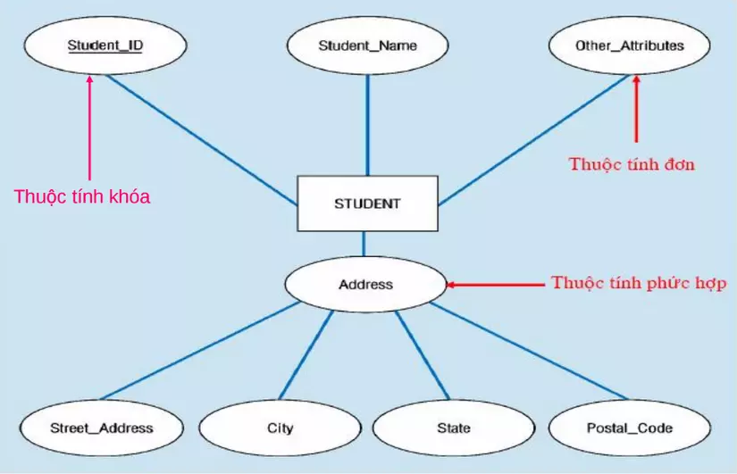
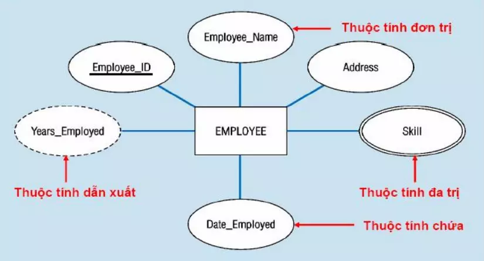
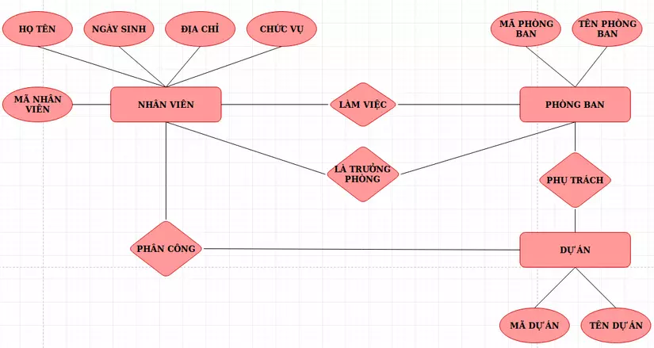
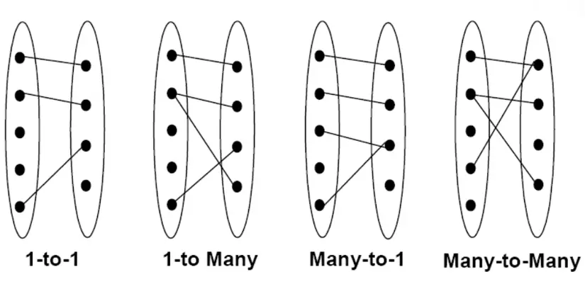
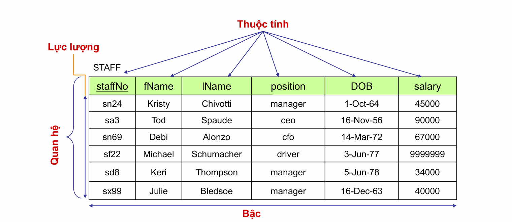
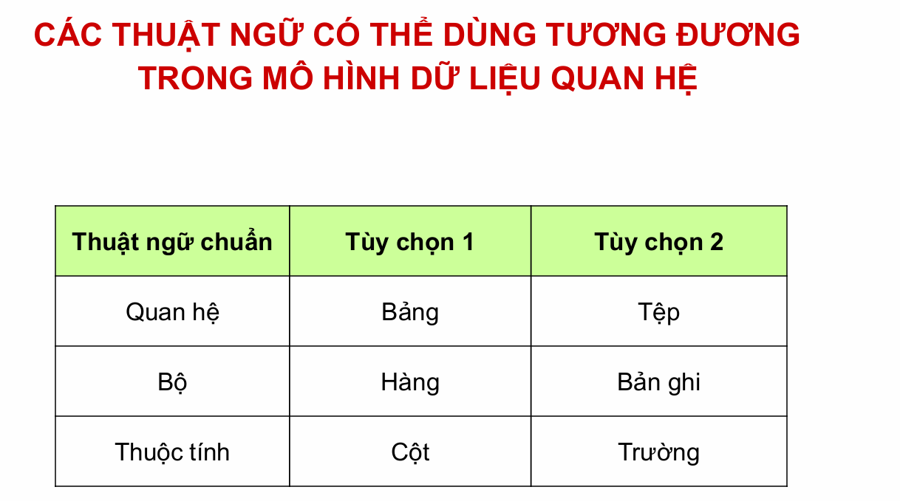

- [\[BACKEND - KHÓA CSDL CƠ BẢN\]](#backend---khóa-csdl-cơ-bản)
- [\[BUỔI 2\] CƠ BẢN VỀ THIẾT KẾ CƠ SỞ DỮ LIỆU](#buổi-2-cơ-bản-về-thiết-kế-cơ-sở-dữ-liệu)
- [🎯 Nội dung cần chuẩn bị.](#-nội-dung-cần-chuẩn-bị)
- [- Lý thuyết về thiết kế cơ sở dữ liệu.](#--lý-thuyết-về-thiết-kế-cơ-sở-dữ-liệu)
  - [Thiết kế cơ sở dữ liệu là gì?](#thiết-kế-cơ-sở-dữ-liệu-là-gì)
  - [Tầm quan trọng của việc thiết kế cơ sở dữ liệu hiệu quả](#tầm-quan-trọng-của-việc-thiết-kế-cơ-sở-dữ-liệu-hiệu-quả)
  - [Như thế nào là một thiết kế cơ sở dữ liệu tốt?](#như-thế-nào-là-một-thiết-kế-cơ-sở-dữ-liệu-tốt)
  - [Quy trình thiết kế cơ sở dữ liệu](#quy-trình-thiết-kế-cơ-sở-dữ-liệu)
    - [Xác định mục đích của cơ sở dữ liệu](#xác-định-mục-đích-của-cơ-sở-dữ-liệu)
    - [Tổ chức thông tin](#tổ-chức-thông-tin)
    - [Thiết kế cơ sở dữ liệu phần logic](#thiết-kế-cơ-sở-dữ-liệu-phần-logic)
- [Lược đồ quan hệ E-R.](#lược-đồ-quan-hệ-e-r)
  - [1. Khái niệm](#1-khái-niệm)
  - [2. Các thành phần cơ bản](#2-các-thành-phần-cơ-bản)
    - [a - Thực thể và tập thực thể](#a---thực-thể-và-tập-thực-thể)
  - [b - Thuộc tính](#b---thuộc-tính)
  - [c - Mối quan hệ giữa các tập thực thể:](#c---mối-quan-hệ-giữa-các-tập-thực-thể)
  - [d - Lược đồ E-R:](#d---lược-đồ-e-r)
    - [e - Các kiểu liên kết trong lược đồ E-R:](#e---các-kiểu-liên-kết-trong-lược-đồ-e-r)
- [Mô hình dữ liệu quan hệ.](#mô-hình-dữ-liệu-quan-hệ)
  - [Mô hình dữ liệu quan hệ là gì?](#mô-hình-dữ-liệu-quan-hệ-là-gì)
  - [Qui ước ký hiệu](#qui-ước-ký-hiệu)
- [Chuẩn hóa dữ liệu: 1NF, 2NF, 3NF.](#chuẩn-hóa-dữ-liệu-1nf-2nf-3nf)
  - [1. Chuẩn hoá 1NF (First Normal Form)](#1-chuẩn-hoá-1nf-first-normal-form)
  - [2. Chuẩn hóa 2NF (Second Normal Form)](#2-chuẩn-hóa-2nf-second-normal-form)
  - [3. Chuẩn hoá 3NF (Third Normal Form)](#3-chuẩn-hoá-3nf-third-normal-form)
# [BACKEND - KHÓA CSDL CƠ BẢN]
# [BUỔI 2] CƠ BẢN VỀ THIẾT KẾ CƠ SỞ DỮ LIỆU
# 🎯 Nội dung cần chuẩn bị.
# - Lý thuyết về thiết kế cơ sở dữ liệu.
## Thiết kế cơ sở dữ liệu là gì?
Thiết kế cơ sở dữ liệu là quá trình xây dựng cấu trúc cho một CSDL nhằm xác định cách thức lưu trữ, tổ chức và truy cập dữ liệu. Quá trình này bao gồm: 

- Xác định các yêu cầu của hệ thống
- Định nghĩa lược đồ CSDL
- Phân tích các thực thể và mối quan hệ giữa chúng
- Xác định các kiểu dữ liệu và phương thức lưu trữ tối ưu nhất.   
## Tầm quan trọng của việc thiết kế cơ sở dữ liệu hiệu quả
Thiết kế cơ sở dữ liệu giữ vai trò quan trọng đối với nhiều hoạt động của doanh nghiệp vì nó đảm bảo rằng dữ liệu được quản lý một cách hiệu quả, chính xác và an toàn. Các doanh nghiệp phụ thuộc rất nhiều vào dữ liệu để vận hành và đưa ra các quyết định, do đó thiết kế cơ sở dữ liệu tốt là yếu tố then chốt để đạt được điều này. 

Dưới đây là một số lợi ích mà một CSDL hiệu quả đem lại: 

- **Tối ưu hóa hiệu suất**: Thiết kế cơ sở dữ liệu hiệu quả sẽ giúp cải thiện khả năng truy cập, tăng tốc độ xử lý và rút ngắn thời gian phản hồi đến máy chủ, giúp giảm thiểu tình trạng tắc nghẽn hệ thống do xử lý chậm, đảm bảo hoạt động kinh doanh diễn ra suôn sẻ.

- **Đảm bảo tính toàn vẹn dữ liệu**: Thiết kế cơ sở dữ liệu chuẩn sẽ giúp đảm bảo sự nhất quán của dữ liệu, tránh tình trạng lưu trữ những dữ liệu bị dư thừa. Điều này giúp đảm bảo tuân thủ các ràng buộc dữ liệu, duy trì tính chính xác và đáng tin cậy của thông tin.

- **Dễ dàng bảo trì và mở rộng**: Một cơ sở dữ liệu được thiết kế tốt sẽ dễ dàng bảo trì, giúp tiết kiệm thời gian và công sức cho việc cập nhật và sửa chữa. Thiết kế linh hoạt cũng cho phép mở rộng cơ sở dữ liệu một cách dễ dàng khi nhu cầu của doanh nghiệp tăng lên.

- **Tiết kiệm tài nguyên**: Thiết kế hiệu quả giúp sử dụng tài nguyên hệ thống một cách tối ưu, giảm chi phí phần cứng và phần mềm. Việc loại bỏ dữ liệu trùng lặp và không cần thiết cũng giảm yêu cầu về bộ nhớ và không gian lưu trữ.

- **Nâng cao bảo mật**: Một cơ sở dữ liệu được thiết kế tốt sẽ có các cơ chế bảo mật mạnh mẽ, bảo vệ dữ liệu khỏi các mối đe dọa và truy cập trái phép. Áp dụng các quyền truy cập và kiểm soát dữ liệu giúp đảm bảo rằng chỉ những người có thẩm quyền mới có thể truy cập và chỉnh sửa dữ liệu.

- **Hỗ trợ việc đưa ra quyết định**: Dữ liệu được tổ chức và lưu trữ một cách khoa học sẽ giúp việc phân tích và khai thác dữ liệu hiệu quả hơn. Điều này đảm bảo dữ liệu luôn được cung cấp một cách chính xác, hỗ trợ cho việc đưa ra các quyết định kinh doanh của doanh nghiệp.

Tóm lại, việc đầu tư vào thiết kế cơ sở dữ liệu một cách cẩn thận và chuyên nghiệp là sẽ giúp doanh nghiệp có thể tận dụng tối đa giá trị của dữ liệu, đảm bảo sự thành công và bền vững của doanh nghiệp. Một thiết kế cơ sở dữ liệu kém có thể dẫn đến nhiều vấn đề như dữ liệu bị lặp, không nhất quán, khó truy xuất và bảo mật. 

## Như thế nào là một thiết kế cơ sở dữ liệu tốt?
Một thiết kế CSDL tốt cần phải có cấu trúc rõ ràng, hiệu quả và linh hoạt để đáp ứng nhu cầu của tổ chức. Cụ thể:

- **Được chuẩn hóa**: Nghĩa là dữ liệu được phân chia thành các bảng nhỏ có quan hệ với nhau, giúp loại bỏ sự dư thừa và cải thiện tính toàn vẹn, hiệu quả của dữ liệu.

- **Có tính hiệu quả**: Đảm bảo sử dụng tối ưu các nguồn lực như dung lượng lưu trữ và công suất xử lý, để các truy vấn được thực hiện nhanh chóng. 

- **Có tính linh hoạt**: Có thể thích ứng với các yêu cầu và dữ liệu mới mà không cần thiết kế lại toàn bộ hệ thống.

- **Có khả năng mở rộng**: Để xử lý lượng dữ liệu và truy vấn ngày càng tăng mà không làm giảm hiệu suất. 

- **Đảm bảo an toàn**: Có các biện pháp bảo vệ dữ liệu khỏi truy cập và thao tác trái phép, duy trì tính bảo mật và toàn vẹn của dữ liệu.
## Quy trình thiết kế cơ sở dữ liệu
### Xác định mục đích của cơ sở dữ liệu
Để xác định mục đích của CSDL, bạn có thể làm theo các bước nhỏ sau:

- **Thu thập và phân tích yêu cầu**: Bạn cần tìm hiểu kỹ lư ỡng về những gì người dùng mong muốn và cần thiết từ cơ sở dữ liệu. Việc này có thể thực hiện thông qua các cuộc khảo sát, phỏng vấn để đảm bảo rằng bạn hiểu rõ nhu cầu và mong đợi của họ.

- **Xác định mục tiêu cụ thể**: Sau khi đã thu thập và phân tích yêu cầu, bạn nên xác định mục tiêu cụ thể của cơ sở dữ liệu. Mục tiêu này phải rõ ràng, chi tiết và phù hợp với nhu cầu sử dụng. Ví dụ, đối với một cơ sở dữ liệu nhỏ dành cho doanh nghiệp tại nhà, mục tiêu có thể đơn giản là “Cơ sở dữ liệu khách hàng lưu giữ thông tin khách hàng để phục vụ cho việc gửi thư và lập báo cáo.”

- **Xác định phạm vi**: Tiếp theo, bạn cần xác định phạm vi của cơ sở dữ liệu. Phạm vi này bao gồm việc xác định các chức năng chính mà cơ sở dữ liệu sẽ thực hiện, loại dữ liệu nào sẽ được lưu trữ và ai sẽ có quyền truy cập vào dữ liệu đó. Đối với cơ sở dữ liệu phức tạp hơn hoặc được sử dụng bởi nhiều người, việc mô tả chi tiết cách và thời điểm mỗi người sử dụng cơ sở dữ liệu cũng rất quan trọng.

Việc xác định nhiệm vụ rõ ràng và phạm vi cụ thể sẽ giúp bạn tập trung vào các mục tiêu của mình, từ đó đưa ra các quyết định thiết kế phù hợp và hiệu quả hơn.

### Tổ chức thông tin
Trong bước này, chúng ta sẽ tìm kiếm và sắp xếp thông tin cần thiết, sau đó xác định các thực thể và mối liên hệ giữa chúng để dễ quản lý và tránh sự trùng lặp dữ liệu. Điều này giúp chúng ta tổ chức cơ sở dữ liệu một cách có cấu trúc và hệ thống.

Ví dụ, khi xây dựng một cơ sở dữ liệu cho một cửa hàng trực tuyến, chúng ta có thể nhận thấy rằng thông tin về sản phẩm, đơn đặt hàng và thông tin khách hàng là ba loại thông tin cơ bản mà chúng ta cần quản lý. Tuy nhiên, để giữ cho mọi thứ đơn giản và dễ quản lý hơn, chúng ta có thể tạm thời nhóm chúng lại thành các nhóm riêng biệt, chẳng hạn:

- **Nhóm Thông tin Sản phẩm (Product)**: Bao gồm tất cả thông tin về sản phẩm như tên sản phẩm, mô tả, giá cả, số lượng trong kho,…
- **Nhóm Thông tin Đơn đặt hàng (Order)**: Bao gồm các chi tiết về đơn đặt hàng như ngày đặt hàng, sản phẩm được đặt mua, số lượng, địa chỉ giao hàng,…
- **Nhóm Thông tin Khách hàng (Customer)**: Bao gồm thông tin cá nhân về khách hàng như tên, địa chỉ, số điện thoại, địa chỉ email,….
Trong bước này, có thể sử dụng sơ đồ ERD (Entity-Relationship Diagram) để biểu diễn trực quan các thực thể chính, thuộc tính của từng thực thể và các mối quan hệ giữa các thực thể. 

Trong bước này, có thể sử dụng sơ đồ **ERD (Entity-Relationship Diagram)** để biểu diễn trực quan các thực thể chính, thuộc tính của từng thực thể và các mối quan hệ giữa các thực thể. 

Quay lại với ví dụ trên: Trong cửa hàng trực tuyến, thực thể “Order” có các thuộc tính như OrderID (mã đơn hàng), Date (ngày đặt hàng) và TotalPrice (giá trị đơn hàng); thực thể “Customer” có các thuộc tính như CustomerID (mã khách hàng), PhoneNum (số điện thoại) và Email. Mối quan hệ giữa “Customer” và “Order” có thể là một đơn đặt hàng thì thuộc về một khách hàng.

Việc sử dụng sơ đồ ERD giúp chúng ta nhìn thấy toàn cảnh cấu trúc cơ sở dữ liệu, đảm bảo rằng mọi yếu tố quan trọng đều được xem xét, mọi mối quan hệ giữa các thực thể được xác định rõ ràng và tổ chức một cách hợp lý và dễ quản lý. Điều này không chỉ làm rõ ràng hơn cho người thiết kế mà còn giúp những thành viên trong nhóm dễ dàng hiểu và phân tích dữ liệu.

### Thiết kế cơ sở dữ liệu phần logic
Ở bước này, đầu tiên chúng ta sẽ chuyển đổi sơ đồ ERD từ bước trước thành một mô hình dữ liệu logic cụ thể và có tổ chức. Để đảm bảo cấu trúc dữ liệu được tổ chức hợp lý và dễ quản lý, cần thực hiện một số bước sau:

- **Xác định các bảng và thuộc tính**: Dựa trên các thực thể và mối quan hệ trong mô hình ERD, xác định rõ các bảng và các thuộc tính (hay các cột) của mỗi bảng. Việc này bao gồm liệt kê các thuộc tính quan trọng và cần thiết cho từng bảng, đảm bảo mỗi bảng phản ánh chính xác thông tin cần lưu trữ. Ví dụ, bảng Customer có các thuộc tính như CustomerID (khoá chính), Name, PhoneNum và Email. Đảm bảo các thuộc tính này đủ chi tiết để phục vụ cho các yêu cầu kinh doanh.

- **Xác định khóa chính (Primary Key)**: Khóa chính là trường dữ liệu duy nhất đại diện cho mỗi hàng trong bảng, đảm bảo tính duy nhất và không thay đổi theo thời gian. Trong trường hợp không có một trường dữ liệu nào tự nhiên có thể làm khóa chính, có thể sử dụng cột được tạo tự động với giá trị tự động tăng (AutoNumber) để đảm bảo tính duy nhất. Ví dụ, trong bảng Order có thể tạo một cột “OrderID” với giá trị tự động tăng để đại diện cho khóa chính.

- **Xác định khóa ngoại (Foreign Key)**: Khóa ngoại là trường dữ liệu trong một bảng tham chiếu đến khóa chính của một bảng khác, giúp thiết lập mối quan hệ giữa các bảng. Ví dụ, trong bảng Order, có thể có cột “CustomerID” là khóa ngoại tham chiếu đến khóa chính “CustomerID” trong bảng Customer.

Việc thiết kế logic cơ sở dữ liệu là bước quan trọng trong quy trình xây dựng cơ sở dữ liệu, đảm bảo rằng mọi thông tin cần thiết được tổ chức một cách hợp lý và dễ dàng truy xuất.
# Lược đồ quan hệ E-R.
## 1. Khái niệm
**❖ Lược đồ thực thể liên kết** (The Entity-Relationship Diagram) gồm 3 khái niệm cơ bản: tập thực thể, tập quan hệ và thuộc tính.
 **❖ Thực thể** là một đối tượng trong thế giới thực và có thể phân biệt được với các đối tượng khác. Thực thể có thể cụ thể (một người, một quyển sách, …) hoặc cũng có thể trừu tượng (một khoản vay ngân hàng, một khái niệm, …).
 **❖ Thực thể** được biểu diễn bởi một tập các thuộc tính (là các thuộc tính mô tả hoặc các đặc tính của thực thể). 
## 2. Các thành phần cơ bản
### a - Thực thể và tập thực thể
Thực thể là một đối tượng trong thế giới thực.

Một nhóm bao gồm các thực thể tương tự nhau tạo thành một tập thực thể

Việc lựa chọn các tập thực thể là một bước vô cùng quan trọng trong việc xây dựng sơ đồ về mối quan hệ thực thể

Ví dụ: “Quản lý các dự án của công ty”

Một nhân viên là một thực thể
- Tập hợp các nhân viên là tập thực thể
- Một dự án là một thực thể
- Tập hợp các dự án là tập thực thể
- Một phòng ban là một thực thể
- Tập hợp các phòng ban là tập thực thể
## b - Thuộc tính

Mỗi tập thực thể có một tập các tính chất đặc trưng, mỗi tính chất đặc trưng này gọi là thuộc tính của tập thực thể. Ứng với mỗi thuộc tính có một tập các giá trị cho thuộc tính đó gọi là miền giá trị.

**Miền giá trị của thuộc tính gồm các loại giá trị như sau:**
- Kiểu chuỗi (string)
- Kiểu số nguyên (integer)
- Kiểu số thực (real)
...

Ví dụ tập thực thể NHANVIEN có các thuộc tính

- Họ tên (hoten: string[20])
- Ngày sinh (ns: date)
- Điểm TB (DTB:float)
…
**Thuộc tính bao gồm các loại như sau:**

- Thuộc tính đơn – không thể tách nhỏ ra được
- Thuộc tính phức hợp – có thể tách ra thành các thành phần nhỏ hơn

**Các loại giá trị của thuộc tính:**

- **Đơn trị**: các thuộc tính có giá trị duy nhất cho một thực thể (VD: số CMND, …)
- **Đa trị**: các thuộc tính có một tập giá trị cho cùng một thực thể (VD: bằng cấp, …)
- **Suy diễn được** (năm sinh <----> tuổi)
Mỗi thực thể đều được phân biệt bởi thuộc tính **khóa**

**Ví dụ 1**: tập thực thể NHANVIEN có các thuộc tính

- Mã NV (MaNV: integer)
- Họ tên (Hoten: string[50])
- Ngày sinh (ns:date)
- Địa chỉ (diachi:string[100])
- Quê quán (quequan:string[30])
- Hệ số lương (hsluong:float)
- Hệ số phụ cấp (hsphucap:float)
- Tổng lương (tongluong:float)

**Ví dụ 2:**

**Ví dụ 3:**

## c - Mối quan hệ giữa các tập thực thể:

Quan hệ là sự liên kết giữa hai hay nhiều tập thực thể

Ví dụ giữa tập thực thể NHANVIEN và PHONGBAN có các liên kết như sau:

- Một nhân viên thuộc một phòng ban nào đó
- Một phòng ban có một nhân viên làm trưởng phòng
Tập quan hệ là tập hợp các mối quan hệ giống nhau
## d - Lược đồ E-R:
Là đồ thị biểu diễn các tập thực thể, thuộc tính và mối quan hệ

Các ký hiệu trong lược đồ E-R

- Đỉnh:

- Cung: là đường nối giữa tập thực thể và thuộc tính, mối quan hệ và tập thực thể
Ví dụ lược đồ E-R:

### e - Các kiểu liên kết trong lược đồ E-R:

# Mô hình dữ liệu quan hệ.
## Mô hình dữ liệu quan hệ là gì?
Mô hình dữ liệu quan hệ bao gồm nhiều quan hệ (Relation). Các thực thể và thuộc tính trong mô hình ERD sẽ được chuyển đổi thành quan hệ và thuộc tính của chúng. Các mối quan hệ sẽ được biểu diễn bằng khoá ngoại.

Ví dụ: 

## Qui ước ký hiệu

- Quan hệ: quy ước bởi các ký tự in hoa Q, R, S.
- Quan hệ Q có tập thuộc tính là: {A1,A2,..,An}: Q(A1,A2,..,An)
# Chuẩn hóa dữ liệu: 1NF, 2NF, 3NF. 

Chuẩn hoá là quá trình tối ưu hóa cấu trúc của cơ sở dữ liệu để đạt được hiệu suất tốt nhất và giảm thiểu sự dư thừa dữ liệu. Có ba cấp độ chuẩn hoá chính, được gọi là NF (Normal Forms):

---

## 1. Chuẩn hoá 1NF (First Normal Form)

Đảm bảo rằng mỗi ô trong bảng chỉ chứa một giá trị nguyên tử (tức là không thể tách nhỏ thành các giá trị con) và không có tập hợp giá trị. Điều này đảm bảo rằng dữ liệu trong bảng không có sự trùng lặp và dễ dàng quản lý.

**Ví dụ:** Trong bảng “Product”, mỗi sản phẩm có một ID duy nhất, tên sản phẩm và một mô tả. Mỗi ô trong cột ID sản phẩm chỉ chứa một giá trị duy nhất, không có nhiều giá trị.

---

## 2. Chuẩn hóa 2NF (Second Normal Form)

Đầu tiên, bảng phải thỏa mãn chuẩn hóa 1NF, đồng thời nếu mỗi cột không phải là một phần của khóa chính thì phải hoàn toàn phụ thuộc vào toàn bộ khóa chính (áp dụng cho bảng có khóa chính được tạo từ 2 cột trở lên). Điều này loại bỏ sự phụ thuộc chức năng giữa các cột và giúp giảm thiểu sự dư thừa.

**Bảng OrderDetails:**

| OrderID | ProductID | Quantity | ProductPrice |
| ------- | --------- | -------- | ------------ |
| 1       | A01       | 5        | 10           |
| 1       | A02       | 2        | 5            |
| 2       | B01       | 3        | 15           |
| 2       | A02       | 1        | 5            |

Ví dụ trên ta có bảng OrderDetails với các cột OrderID, ProductID (cả hai tạo thành khóa chính), Quantity và ProductPrice. Ở đây, ProductPrice có thể chỉ phụ thuộc vào ProductID và không phụ thuộc vào OrderID. Điều này vi phạm 2NF vì ProductPrice là phụ thuộc chức năng riêng của Product mà không phụ thuộc vào toàn bộ khóa chính. Do đó, việc lưu trữ ProductPrice trong bảng OrderDetails là không cần thiết và gây ra sự trùng lặp dữ liệu.

Để đạt được 2NF, bạn cần tách ProductPrice ra khỏi bảng OrderDetails và đặt nó trong một bảng Product như sau:

**Bảng Product:**

| ProductID | ProductName | ProductPrice |
| --------- | ----------- | ------------ |
| M11       | Pencil      | 10           |
| M12       | Notebook    | 15           |
| M13       | Eraser      | 3            |

**Cập nhật bảng OrderDetails:**

| OrderID | ProductID | Quantity |
| ------- | --------- | -------- |
| A01     | M11       | 5        |
| A01     | M12       | 2        |
| A02     | M13       | 3        |
| A02     | M12       | 1        |

---

## 3. Chuẩn hoá 3NF (Third Normal Form)

Bảng phải ở dạng 2NF và không có sự phụ thuộc chức năng giữa các cột phi khóa chính. Các cột phi khóa chính phải phụ thuộc duy nhất vào khóa chính, không phụ thuộc vào các cột phi khóa chính khác. Điều này giúp loại bỏ sự dư thừa và đảm bảo tính nhất quán của dữ liệu.

**Bảng Customer:**

| CustomerID | CustomerName | Address                         | PhoneNum |
| ---------- | ------------ | ------------------------------- | -------- |
| 1          | Nguyen A     | 123 Main St, Ward 1, District 1 | 0123     |
| 2          | Tran B       | 456 Side St, Ward 2, District 2 | 1234     |

Ví dụ: Trong bảng “Customer”, nếu thông tin về địa chỉ (tên đường, phường/xã, quận/huyện của khách hàng được lưu trữ trong cùng một bảng, điều này dẫn đến vi phạm 3NF vì 3 giá trị này đều phụ thuộc vào nhau. Để tuân thủ 3NF, các thông tin về địa chỉ nên được tách riêng thành 1 bảng “Address”.

**Bảng Address:**

| CustomerID | StreetName  | Ward   | District   |
| ---------- | ----------- | ------ | ---------- |
| 1          | 123 Main St | Ward 1 | District 1 |
| 2          | 456 Side St | Ward 2 | District 2 |

---
