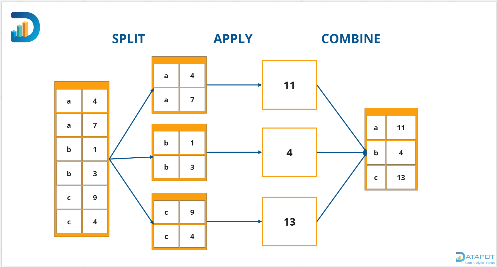
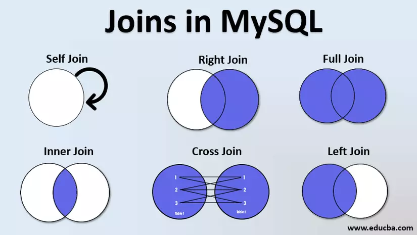

- [\[BUỔI 3\] SQL cơ bản](#buổi-3-sql-cơ-bản)
- [🌈 Nội dung cần chuẩn bị.](#-nội-dung-cần-chuẩn-bị)
- [Các thao tác cơ bản: SELECT, INSERT, UPDATE, DELETE, từ khóa AS, DISTINCT](#các-thao-tác-cơ-bản-select-insert-update-delete-từ-khóa-as-distinct)
  - [Lọc dữ liệu: WHERE, HAVING](#lọc-dữ-liệu-where-having)
  - [Kết hợp bảng và kết quả: JOIN, UNION](#kết-hợp-bảng-và-kết-quả-join-union)
  - [Tổng hợp và nhóm dữ liệu: COUNT, SUM, AVG, GROUP BY](#tổng-hợp-và-nhóm-dữ-liệu-count-sum-avg-group-by)
  - [Truy vấn con: Subquery](#truy-vấn-con-subquery)
  - [Thứ tự thực thi logic của truy vấn](#thứ-tự-thực-thi-logic-của-truy-vấn)
- [⭐️ Bài tập trước buổi học](#️-bài-tập-trước-buổi-học)
  - [Leetcode - 584](#leetcode---584)
  - [Leetcode - 1378](#leetcode---1378)
  - [Leetcode - 1141](#leetcode---1141)

# [BUỔI 3] SQL cơ bản

# 🌈 Nội dung cần chuẩn bị.
### Các lệnh cơ bản
- **Tạo cơ sở dữ liệu**
```sql
create database HoSoSinhVien
on (name='HSSV_data', filename='c:HSSV_data.mdf')
log on (name='HSSV_log', filename='c:HSSV_log.ldf')
```

- **Xóa cơ sở dữ liệu**
```sql
drop database HoSoSinhVien
```

- **Sửa thông tin cơ sở dữ liệu**
```sql
alter database HoSoSinhVien
modify name = HSSV
```

- **Sử dụng sp_dboption**
```sql
exec sp_dboption HoSoSinhVien, 'read only', 'true'
exec sp_dboption HoSoSinhVien, 'autoshrink', 'true'
exec sp_dboption HoSoSinhVien, 'single_user'
```

- **DBCC**
```sql
dbcc shrinkdatabase(HoSoSinhVien, 10)
```

---

## 2) Trên bảng (Table)

### Các kiểu số liệu
- text  
- binary  
- numeric  
- money  
- datetime  
- bit  
- variant  

### Các ràng buộc
- default  
- check  
- unique  
- foreign  
- primary  

### Các kiểu toàn vẹn
- entity  
- domain  
- referential  
- user  

### Các thuộc tính bổ trợ
- identity  
- null  

### Các lệnh cơ bản
- **Tạo bảng**
```sql
create table SinhVien (MaSV int, TenSV nchar(50))
```

- **Tạo bảng với ràng buộc**
```sql
create table SinhVien (
  MaSV int primary key,
  TenSV nvarchar(50) not null,
  QueQuan int references DiaPhuong(MaDP)
)
```

- **Xóa bảng**
```sql
drop table SinhVien
```

- **Thêm cột**
```sql
alter table SinhVien add QueQuan int
```

- **Xóa cột**
```sql
alter table SinhVien drop column QueQuan
```

- **Thêm thuộc tính not null**
```sql
alter table SinhVien alter column TenSV nchar(50) not null
```

- **Thêm khóa chính**
```sql
alter table SinhVien alter column MaSV int not null
go
alter table SinhVien add primary key (MaSV)
```

- **Thêm khóa ngoại**
```sql
alter table SinhVien add foreign key (QueQuan) references DiaPhuong(MaDP)
```

- **Thêm mặc định**
```sql
alter table SinhVien add default 'khong ten' for TenSV
```

- **Xem thông tin bảng**
```sql
exec sp_help SinhVien
```

---

## 3) Trên bản ghi (Record)

### Các lệnh cơ bản
- **Thêm bản ghi**
```sql
insert into SinhVien (MaSV, TenSV, QueQuan)
values (1, N'Nguyễn Văn A', 1)
```

- **Thêm bản ghi từ bảng khác**
```sql
insert into DocGia
select MaSV, TenSV, QueQuan from SinhVien
```

- **Select vào bảng mới**
```sql
select MaSV, TenSV, Diem
into SinhVienKha
from SinhVien
where Diem > 7.0
```

- **Xóa bản ghi**
```sql
delete from SinhVien where MaSV=1234
```

- **Xóa toàn bộ bản ghi**
```sql
truncate table SinhVien
```

- **Cập nhật bản ghi**
```sql
update SinhVien set NhomTruong = 1 where MaSV < 4
update SinhVien set NhomTruong = 4 where (MaSV > 3 and MaSV < 8)
```

---

## 4) Truy vấn (Query)

### Hỗ trợ truy vấn
- distinct  
- top  
- as  
- identity  

### Phép toán tập hợp
- in  
- like  
- between  

### Các hàm tổng nhóm
- sum  
- max  
- min  
- avg  

---

### 4.1 Truy vấn đơn giản
- **Hiện tất cả bảng**
```sql
select * from SinhVien
```

- **Hiện một số cột**
```sql
select TenSV, DiemTB from SinhVien
```

- **Có điều kiện where**
```sql
select TenSV, DiemTB
from SinhVien
where DiemTB > 6.0
```

- **Sắp xếp**
```sql
select TenSV, DiemTB
from SinhVien
order by DiemTB desc, TenSV asc
```

- **Distinct**
```sql
select distinct QueQuan from SinhVien
```

- **Top**
```sql
select top 3 TenSV, DiemTB
from SinhVien
order by DiemTB desc, TenSV asc
```

---

### 4.2 Truy vấn lồng nhau
- **Subquery trong where**
```sql
select TenNV, Luong
from NhanVien
where Luong = (select max(Luong) from NhanVien)
```

- **Sử dụng in**
```sql
select TenNV, Luong
from NhanVien
where Luong in (select top 2 Luong from NhanVien order by Luong)
```

- **So sánh theo phòng**
```sql
select nv1.TenNV, nv1.Luong
from NhanVien as nv1
where nv1.Luong = (
  select max(Luong)
  from NhanVien
  where Phong = nv1.Phong
)
```

---

### 4.3 Truy vấn tổng nhóm

- **Group by**
```sql
select QueQuan, count(*)
from NhanVien
group by QueQuan
```

- **Having**
```sql
select Phong, sum(Luong)
from NhanVien
group by Phong
having sum(Luong) > 5000000
```

---

### 4.4 Truy vấn liên bảng (Join)

- **Inner join**
```sql
select NhanVien.TenNV, DiaPhuong.TenDP
from NhanVien
inner join DiaPhuong on NhanVien.QueQuan = DiaPhuong.MaDP
```

- **Left join**
```sql
select NhanVien.TenNV, DiaPhuong.TenDP
from NhanVien
left outer join DiaPhuong on NhanVien.QueQuan = DiaPhuong.MaDP
```

- **Right join**
```sql
select NhanVien.TenNV, DiaPhuong.TenDP
from NhanVien
right outer join DiaPhuong on NhanVien.QueQuan = DiaPhuong.MaDP
```

- **Full join**
```sql
select NhanVien.TenNV, DiaPhuong.TenDP
from NhanVien
full outer join DiaPhuong on NhanVien.QueQuan = DiaPhuong.MaDP
```

- **Cross join**
```sql
select NhanVien.TenNV, DiaPhuong.TenDP
from NhanVien
cross join DiaPhuong
```

---

## Tham khảo thêm

### Xem tất cả cơ sở dữ liệu
```sql
select * from master.dbo.sysdatabases where sid <> 1
```

### Xem tất cả bảng trong cơ sở dữ liệu
```sql
select * from Northwind.dbo.sysobjects where xtype='U'
```

### Xem tất cả cột trong bảng
```sql
declare @x int
set @x = (select id from sysobjects where name='Employees')
select * from syscolumns where id = @x
```

### Bảng tạm
```sql
declare @x table(MaSV int, TenSV nvarchar(20))
insert into @x values(1, N'Thưởng')
insert into @x values(2, N'Yến')
select * from @x
```

### Biến tạm
```sql
declare @t money
set @t = (select max(UnitPrice) from Northwind.dbo.products)
select * from Northwind.dbo.products where UnitPrice >= @t
```

---

## Các khái niệm cơ bản của cơ sở dữ liệu

### Các mô hình dữ liệu
- Mô hình thứ bậc (Hierarchical)  
- Mô hình mạng lưới (Network)  
- Mô hình quan hệ (Relational)  

### Các vấn đề của lưu trữ
- Sự dư thừa (Redundance)  
- Sự nhất quán (Consistence)  
- Tính toàn vẹn (Integrity)  
- Sự an toàn (Security)  
- Sự chia sẻ (Sharing)  

### Các khái niệm cơ bản
- Cơ sở dữ liệu (Database)  
- Bảng (Table) / Quan hệ (Relation)  
- Bản ghi (Record) / Dòng (Row) / Bộ (Tuple)  
- Trường (Field) / Cột (Column)  
- Mối quan hệ (Relationship)  

---

## Vấn đề toàn vẹn dữ liệu

### Toàn vẹn dữ liệu
- **Thực thể (Entity integrity)**: primary key, unique, identity  
- **Tham chiếu (Referential integrity)**: foreign key, check  
- **Miền dữ liệu (Domain integrity)**: default, foreign key, check, not null  
- **Người dùng (User integrity)**: rules, stored procedures, triggers  

### Các hỗ trợ toàn vẹn
- Check constraint  
- Default constraint  
- Unique constraint  
- Foreign key constraint  
- Primary key constraint  
- Identity property  
- Not null property  

---

## Các kiểu dữ liệu

- **Giá trị nhị phân**: bit  
- **Số nguyên**: bigint, int, smallint, tinyint  
- **Số thực xấp xỉ**: float, real  
- **Số thực chính xác**: decimal, numeric  
- **Tiền tệ**: money, smallmoney  
- **Thời gian**: datetime, smalldatetime  
- **Chuỗi**: char, varchar, text, nchar, nvarchar, ntext  
- **Chuỗi nhị phân**: binary, varbinary, image  
- **Kiểu khác**: cursor, table, variant, timestamp, uniqueidentifier  

---
# Các thao tác cơ bản: SELECT, INSERT, UPDATE, DELETE, từ khóa AS, DISTINCT

## Lọc dữ liệu: WHERE, HAVING

## Kết hợp bảng và kết quả: JOIN, UNION

## Tổng hợp và nhóm dữ liệu: COUNT, SUM, AVG, GROUP BY

## Truy vấn con: Subquery

## Thứ tự thực thi logic của truy vấn
# Thứ Tự Thực Thi Trong SQL (SQL Order of Execution)

**Thứ tự thực thi trong SQL** (SQL order of execution) là trình tự mà các mệnh đề khác nhau trong một truy vấn được đánh giá. Điều này đáng để hiểu vì thứ tự thực thi thường **khác** với cách chúng ta **viết** câu lệnh SQL. Lấy ví dụ đơn giản: bạn có thể nghĩ rằng với `SELECT * FROM database`, mệnh đề `SELECT` được thực thi trước; nhưng thực tế, thứ tự thực thi **bắt đầu** từ mệnh đề `FROM`.

Dưới đây là **thứ tự thực thi** trong SQL. Ở phần tiếp theo, chúng ta sẽ đi chi tiết từng bước.

* **FROM/JOIN:** Chỉ định bảng dữ liệu cần truy xuất.
* **WHERE:** Lọc các hàng thỏa điều kiện trước khi nhóm.
* **GROUP BY:** Nhóm các hàng có chung một thuộc tính.
* **HAVING:** Lọc các nhóm dựa trên điều kiện, áp dụng sau khi đã nhóm.
* **SELECT:** Chỉ định các cột cần truy xuất hoặc tính toán.
* **DISTINCT:** Loại bỏ các dòng trùng lặp khỏi tập kết quả.
* **ORDER BY:** Sắp xếp tập kết quả theo các cột chỉ định.
* **LIMIT:** Giới hạn số lượng hàng trả về tối đa.
* **OFFSET:** Bỏ qua một số lượng hàng trước khi bắt đầu trả về kết quả.

Trong truy vấn sau, tôi đã thêm chú thích để chỉ ra mệnh đề nào được đánh giá trước.

```sql
-- #6+7   SELECT DISTINCT department_id                                 
-- #1     FROM employees                                                 
-- #2     JOIN orders ON customers.customer_id = orders.customer_id     
-- #3     WHERE salary > 3000                                          
-- #4     GROUP BY department 
-- #5     HAVING AVG(salary) > 5000 
-- #8     ORDER BY department 
-- #9     LIMIT 10 OFFSET 5 
-- #10    OFFSET 5 ROWS FETCH NEXT 10 ROWS ONLY; 
```

**Powered By**
Tôi cũng tạo một câu **acrostic** để dễ nhớ: *For Work Goals and Hurdles Search DataCamp's Organized Learning Opportunities.*

---

## Các Giai Đoạn Thực Thi Truy Vấn SQL

Mặc dù hầu hết truy vấn SQL chúng ta viết **bắt đầu bằng** mệnh đề `SELECT`, nhưng **thứ tự thực thi logic** bắt đầu với mệnh đề `FROM`. Ở đây, tôi sẽ viết một số truy vấn để minh họa thứ tự thực thi. Lưu ý: các truy vấn sau **chưa đầy đủ** nên sẽ **không** biên dịch.

### Mệnh đề FROM

Truy vấn SQL bắt đầu quá trình thực thi với mệnh đề `FROM`. Đây thường là giai đoạn đầu tiên vì hệ quản trị cơ sở dữ liệu xác định **nguồn dữ liệu/bảng**. Khi có nhiều bảng, truy vấn sẽ đánh giá điều kiện `JOIN` để kết hợp các bảng đã chỉ định làm nguồn dữ liệu.

Truy vấn chưa đầy đủ dưới đây trước hết sẽ chọn dữ liệu từ bảng `customers` bằng `FROM`, và bảng `orders` bằng `JOIN`.

```sql
FROM customers
JOIN orders ON customers.customer_id = orders.customer_id;
```

**Powered By**

### Mệnh đề WHERE

`WHERE` được thực thi **sau** `FROM` và `JOIN` nhằm lọc các hàng theo điều kiện cụ thể. Quan trọng: **không thể** tham chiếu trực tiếp các **bí danh cột** (alias) được định nghĩa ở `SELECT` trong `WHERE`, vì `WHERE` được xử lý **trước** `SELECT`.

Truy vấn dưới đây dùng `WHERE` để lọc các bản ghi nhân viên có tiền thưởng lớn hơn 5000.

```sql
FROM employees
JOIN departments ON employees.employee_id = departments.department_id
WHERE salary * 0.1 > 5000;
```

**Powered By**

### Mệnh đề GROUP BY

Sau khi lọc hàng, SQL thực thi `GROUP BY` để nhóm kết quả theo các cột chỉ định. Bước này thường dùng với các hàm tổng hợp như `COUNT()`, `SUM()`, `AVG()` để tính toán trên các cột.

Truy vấn dưới đây trước hết lọc nhân viên có lương > 3.000, sau đó **nhóm theo phòng ban** và tính lương trung bình cho mỗi nhóm.

```sql
FROM employees e
JOIN departments d ON e.employee_id = d.department_id
WHERE e.salary > 3000
GROUP BY e.name, d.department_name;
```

**Powered By**

### Mệnh đề HAVING

`HAVING` giống `WHERE` nhưng dùng để **lọc dữ liệu đã nhóm** sau `GROUP BY`. Trong truy vấn dưới đây, SQL nhóm nhân viên theo phòng ban, tính lương trung bình cho mỗi nhóm, rồi loại các nhóm có lương trung bình ≤ 5.000.

```sql
FROM employees
JOIN departments ON employees.employee_id = departments.department_id
WHERE salary > 3000
GROUP BY department_name
HAVING AVG(salary) > 5000;
```

**Powered By**

### Mệnh đề SELECT

`SELECT` là nơi SQL xác định các cột hoặc biểu thức sẽ trả về sau khi các bước trước đó đã thực thi. Bạn có thể áp dụng phép toán, alias, và hàm tổng hợp trong `SELECT`.

Truy vấn sau lấy `name` và `bonus` (tính bằng `salary * 0.1`) từ bảng `employees`.

```sql
SELECT name, salary * 0.1 AS bonus
FROM employees
JOIN orders ON customers.customer_id = orders.customer_id
WHERE salary > 3000
GROUP BY name
HAVING AVG(salary) > 5000;
```

**Powered By**

### Mệnh đề DISTINCT

`DISTINCT` được đánh giá sau `SELECT`. Nó hữu ích để loại bỏ các bản ghi trùng bằng cách trả về các dòng **duy nhất**. Truy vấn dưới đây trả về từng `department_id` duy nhất, loại các giá trị trùng.

```sql
SELECT DISTINCT department_id
FROM employees
JOIN orders ON customers.customer_id = orders.customer_id
WHERE salary > 3000
GROUP BY department
HAVING AVG(salary) > 5000;
```

**Powered By**

### Mệnh đề ORDER BY

`ORDER BY` sắp xếp tập kết quả theo các cột/biểu thức. Không giống `WHERE`, `ORDER BY` **có thể dùng alias** đã định nghĩa trong `SELECT`.

Truy vấn dưới đây sắp xếp cột `bonus` giảm dần. Lưu ý `bonus` là alias được định nghĩa ở `SELECT`.

```sql
SELECT DISTINCT department_id
FROM employees
JOIN orders ON customers.customer_id = orders.customer_id
WHERE salary > 3000
GROUP BY department
HAVING AVG(salary) > 5000
ORDER BY bonus DESC;
```

**Powered By**

### Mệnh đề LIMIT/OFFSET

`LIMIT` và `OFFSET` thường là các bước **cuối cùng** nhằm giới hạn số hàng trả về. `LIMIT` đặt số hàng tối đa, còn `OFFSET` chỉ số hàng cần **bỏ qua** trước khi bắt đầu trả về.

Truy vấn dưới đây lấy tên và lương nhân viên, sắp xếp theo lương giảm dần, giới hạn kết quả 10 dòng và bỏ qua 5 dòng đầu tiên.

```sql
SELECT DISTINCT department_id
FROM employees
JOIN orders ON customers.customer_id = orders.customer_id
WHERE salary > 3000
GROUP BY department
HAVING AVG(salary) > 5000
ORDER BY bonus DESC
LIMIT 10 OFFSET 5;
-- OFFSET 5 ROWS FETCH NEXT 10 ROWS ONLY --SQL SERVER / ORACLE
```

**Powered By**
`LIMIT` và `OFFSET` được hỗ trợ trong MySQL và PostgreSQL. Với SQL Server và Oracle, hãy dùng `OFFSET`, `ROWS FETCH`, và `ROWS ONLY` để giới hạn số hàng trả về.

Xem thêm bài hướng dẫn **How to Use SQL OFFSET** để tìm hiểu phân trang dữ liệu và hỗ trợ cụ thể theo từng hệ quản trị (OFFSET, LIMIT).

---

## Thứ Tự Thực Thi vs. Thứ Tự Viết Truy Vấn

SQL là ngôn ngữ **khai báo** (declarative), nghĩa là **thứ tự thực thi** khác **thứ tự viết**. Thay vì chỉ rõ cách thực hiện từng bước, bạn **mô tả điều bạn muốn**, còn hệ quản trị CSDL quyết định cách tối ưu để đạt được. Điều này khác với các ngôn ngữ **mệnh lệnh** (imperative) như Python hoặc Java, nơi bạn viết tuần tự các bước thực thi.

Hiểu thứ tự thực thi giúp bạn thay đổi cách tư duy khi viết truy vấn. Ví dụ, hãy tưởng tượng bạn viết truy vấn lọc theo một **alias** tạo ở `SELECT`:

```sql
SELECT price * 0.9 AS discounted_price
FROM products
WHERE discounted_price > 100;
```

**Powered By**
Nhìn qua thì hợp lý, nhưng truy vấn này sẽ **lỗi**. Tại sao? Vì `WHERE` được đánh giá **trước** `SELECT`. Để sửa, bạn cần dùng **subquery** hoặc `HAVING`:

```sql
SELECT price * 0.9 AS discounted_price
FROM products
HAVING discounted_price > 100;
```

**Powered By**
Để tìm hiểu thêm về `WHERE` và `HAVING`, hãy xem bài: **The Difference Between WHERE and HAVING in SQL**.

---

## Lỗi Phổ Biến & Thực Hành Tốt

Dù thứ tự viết không ảnh hưởng trực tiếp đến thứ tự thực thi, hiểu **luồng thực thi** là chìa khóa để tránh lỗi và cải thiện hiệu năng. Các lỗi sau thường bắt nguồn từ việc hiểu sai thứ tự thực thi:

### Các lỗi thường gặp

Những lỗi sau có thể làm giảm hiệu suất truy vấn của bạn:

* **Dùng alias cột trong WHERE:** Vì `WHERE` chạy **trước** `SELECT`, dùng alias trong `WHERE` sẽ gây lỗi. Hãy lặp lại **biểu thức đầy đủ** thay vì dựa vào alias.
* **Dùng HAVING để lọc từng hàng thay cho WHERE:** `HAVING` chạy **sau** `GROUP BY` và thiết kế để lọc **dữ liệu đã tổng hợp**. Nếu lọc trên dữ liệu **chưa tổng hợp**, hãy dùng `WHERE`.
* **Dùng hàm tổng hợp trong SELECT mà không có GROUP BY:** Vì `GROUP BY` chạy **trước** `HAVING/SELECT`, không nhóm dữ liệu trước khi áp dụng hàm tổng hợp sẽ tạo kết quả sai hoặc lỗi.
* **Không dùng alias đúng cách trong ORDER BY:** Không như `WHERE`, `ORDER BY` chạy **sau** `SELECT`, nên bạn **có thể** dùng alias để sắp xếp. Biết thời điểm alias khả dụng giúp tránh nhầm lẫn.

Dưới đây là **các loại hàm trong SQL** (tổng quát, áp dụng cho MySQL/SQL Server/Postgres; tên cụ thể có thể khác đôi chút giữa hệ):

# 1) Hàm tổng hợp (Aggregate)

Gộp **nhiều hàng → 1 giá trị** cho mỗi nhóm.

* `COUNT(*)|col`, `SUM(col)`, `AVG(col)`, `MIN(col)`, `MAX(col)`
* MySQL: `GROUP_CONCAT(col SEPARATOR ',')`
* Postgres/SQL Server: `STRING_AGG(col, ',')`

```sql
SELECT customer_id, COUNT(*) AS order_count, SUM(total) AS revenue
FROM orders
GROUP BY customer_id
HAVING SUM(total) > 1000;
```

**Lưu ý:** `COUNT(col)` không đếm `NULL`; `SUM/AVG` bỏ qua `NULL`.

# 2) Hàm cửa sổ (Window / Analytic)

Tính trên “cửa sổ” hàng có liên quan, **không** làm mất hàng; cần `OVER(...)`.

* So sánh liên hàng: `LAG()`, `LEAD()`
* Xếp hạng: `ROW_NUMBER()`, `RANK()`, `DENSE_RANK()`, `NTILE()`
* Tổng hợp theo cửa sổ: `SUM()/AVG()/... OVER(...)`

```sql
SELECT
  order_id, customer_id, total,
  SUM(total) OVER (PARTITION BY customer_id ORDER BY order_date) AS running_total
FROM orders;
```

> Không dùng trực tiếp trong `WHERE`; bọc subquery/CTE.

# 3) Hàm vô hướng / đơn trị (Scalar)

Áp dụng **từng hàng**, trả về 1 giá trị.

* **Chuỗi:** `LOWER/UPPER`, `TRIM`, `SUBSTRING`, `REPLACE`, `CONCAT`, `LEFT/RIGHT`, `LENGTH/CHAR_LENGTH`
* **Số:** `ABS`, `ROUND`, `CEIL/FLOOR`, `POWER`, `MOD`
* **Ngày giờ:**

  * MySQL: `NOW()`, `CURDATE()`, `DATE_ADD/SUB`, `DATEDIFF`, `TIMESTAMPDIFF`, `EXTRACT(...)`
  * SQL Server: `GETDATE()`, `DATEADD`, `DATEDIFF`, `DATEPART`, `FORMAT`
* **Điều kiện:** `CASE WHEN ... THEN ... ELSE ... END`, `COALESCE`, `NULLIF`, (MySQL có `IF(cond,a,b)`, SQL Server có `ISNULL`)
* **Chuyển kiểu:** `CAST(expr AS TYPE)`, `CONVERT(...)`

# 4) Hàm tập hợp trả về bảng (Table-valued / Set-returning)

Trả về **tập bản ghi** (phổ biến ở SQL Server/Postgres).

* SQL Server: **TVF** (Inline/Multistatement), `OPENJSON(...)`, `STRING_SPLIT(...)`
* Postgres: `unnest(...)`, `generate_series(...)`

```sql
-- SQL Server: tách chuỗi thành bảng hàng
SELECT value FROM STRING_SPLIT('a,b,c', ',');
```

# 5) Hàm JSON / XML / bán cấu trúc

* MySQL: `JSON_EXTRACT`, `JSON_UNQUOTE`, `JSON_SET`, `JSON_ARRAYAGG`
* SQL Server: `JSON_VALUE`, `JSON_QUERY`, `OPENJSON`
* Postgres: `->`, `->>`, `jsonb_extract_path_text`, `jsonb_agg`

# 6) Hàm không gian (Spatial / GIS)

* MySQL/SQL Server/Postgres: họ `ST_...` (ví dụ `ST_Distance`, `ST_Contains`, `ST_AsText`)
* Làm việc với `POINT`, `POLYGON`, `GEOGRAPHY/GEOMETRY`.

# 7) Hàm mã hoá/Hash & tiện ích hệ thống

* Hash/mã hoá: `MD5`, `SHA1/SHA2`, `PGP_SYM_ENCRYPT` (Postgres extensions)
* Hệ thống/phiên bản/người dùng: MySQL `VERSION()`, `USER()`, `DATABASE()`
* Băm/uuid: Postgres `gen_random_uuid()`, SQL Server `NEWID()`

# 8) Hàm do người dùng định nghĩa (UDF)

* **Scalar UDF**: nhận tham số → trả về 1 giá trị.
* **Table-valued function (TVF)**: trả về bảng (SQL Server/Postgres).

> Dùng khi cần tái sử dụng logic, nhưng chú ý hiệu năng/khả năng tối ưu của bộ máy SQL.

---

## Mẹo thực chiến

* **SARGable**: tránh bọc cột bằng hàm trong `WHERE` nếu muốn dùng index (ví dụ, thay `WHERE DATE(order_date)=...` bằng `WHERE order_date >= ... AND order_date < ...`).
* **NULL**: hiểu rõ cách từng hàm xử lý `NULL` để tránh sai số.
* **Window vs Aggregate**: Window giữ nguyên số hàng; Aggregate rút gọn số hàng.
* **MySQL 5.7** không có window functions → cân nhắc `JOIN`/biến user hoặc nâng phiên bản.

Nếu bạn cho mình DBMS bạn dùng (MySQL hay SQL Server) + tác vụ cụ thể, mình sẽ liệt kê chính xác bộ hàm kèm snippet cho đúng hệ đó nhé.
