# [BUỔI 4] SQL nâng cao-
 [\[BUỔI 4\] SQL nâng cao](#buổi-4-sql-nâng-cao)
- [\[BUỔI 4\] SQL nâng cao-](#buổi-4-sql-nâng-cao-)
- [Tối ưu truy vấn](#tối-ưu-truy-vấn)
- [1. Use Proper Indexing](#1-use-proper-indexing)
  - [How indexes work](#how-indexes-work)
- [2. Avoid SELECT \*](#2-avoid-select-)
- [3. Avoid Redundant or Unnecessary Data Retrieval](#3-avoid-redundant-or-unnecessary-data-retrieval)
- [4. Use Joins Efficiently](#4-use-joins-efficiently)
    - [Tips for efficient joins:](#tips-for-efficient-joins)
- [5. Analyze Query Execution Plans](#5-analyze-query-execution-plans)
- [6. Optimize WHERE Clauses](#6-optimize-where-clauses)
- [7. Optimize Subqueries](#7-optimize-subqueries)
- [8. Use EXISTS Instead of IN for Subqueries](#8-use-exists-instead-of-in-for-subqueries)
- [9. Limit the use of DISTINCT](#9-limit-the-use-of-distinct)
- [10. Leverage Database-Specific Features](#10-leverage-database-specific-features)
- [11. Monitor and Optimize Database Statistics](#11-monitor-and-optimize-database-statistics)
- [12. Utilize stored procedures](#12-utilize-stored-procedures)
- [13. Avoid Unnecessary Ordering and Grouping](#13-avoid-unnecessary-ordering-and-grouping)
- [14. Use UNION ALL Instead of UNION](#14-use-union-all-instead-of-union)
- [15. Break Down Complex Queries](#15-break-down-complex-queries)
- [Sử dụng index](#sử-dụng-index)
  - [Index trong Database](#index-trong-database)
  - [Các loại indexes](#các-loại-indexes)
  - [B-tree indexes](#b-tree-indexes)
  - [Adaptive hash index](#adaptive-hash-index)
  - [Cách hoạt động của index](#cách-hoạt-động-của-index)
  - [B-Tree vs Binary Tree](#b-tree-vs-binary-tree)
  - [Một số hạn chế của B-Tree](#một-số-hạn-chế-của-b-tree)
- [Sử dụng INDEX (chỉ mục) trong MySQL giúp tăng tốc độ truy vấn bằng cách tạo một cấu trúc dữ liệu cho phép tìm kiếm các hàng dữ liệu nhanh hơn, thay vì phải quét toàn bộ bảng.](#sử-dụng-index-chỉ-mục-trong-mysql-giúp-tăng-tốc-độ-truy-vấn-bằng-cách-tạo-một-cấu-trúc-dữ-liệu-cho-phép-tìm-kiếm-các-hàng-dữ-liệu-nhanh-hơn-thay-vì-phải-quét-toàn-bộ-bảng)
- [Khái niệm Transaction, ACID, dirty read, dirty write](#khái-niệm-transaction-acid-dirty-read-dirty-write)
- [1. Transaction](#1-transaction)
- [2. ACID là gì?​](#2-acid-là-gì)
- [3. Tính chất của ACID​](#3-tính-chất-của-acid)
  - [3.1. Atomicity (A)](#31-atomicity-a)
    - [3.1.1. Atomicity là gì?​](#311-atomicity-là-gì)
    - [3.1.2. Ví dụ về Atomicity](#312-ví-dụ-về-atomicity)
  - [](#)
    - [3.1.3. Làm sao giúp hệ thống đảm bảo Atomicity?](#313-làm-sao-giúp-hệ-thống-đảm-bảo-atomicity)
  - [3.2. Consistency (C)](#32-consistency-c)
    - [3.2.1. Consistency là gì?​](#321-consistency-là-gì)
    - [3.2.2. Ví dụ về Consistency](#322-ví-dụ-về-consistency)
  - [](#-1)
    - [3.2.3. Làm sao giúp hệ thống đảm bảo Consistency?](#323-làm-sao-giúp-hệ-thống-đảm-bảo-consistency)
  - [3.3. Isolation (I)](#33-isolation-i)
    - [3.3.1. Isolation là gì?​](#331-isolation-là-gì)
    - [3.3.2. Read phenomena (Hiện tượng đọc)​](#332-read-phenomena-hiện-tượng-đọc)
  - [](#-2)
    - [3.3.3. Isolation levels (Cấp độ cô lập)​](#333-isolation-levels-cấp-độ-cô-lập)
    - [3.3.4. Làm sao giúp hệ thống đảm bảo Isolation?](#334-làm-sao-giúp-hệ-thống-đảm-bảo-isolation)
  - [3.4. Durability (D)](#34-durability-d)
    - [3.4.1. Durability là gì?​](#341-durability-là-gì)
    - [3.4.2. Ví dụ về Durability](#342-ví-dụ-về-durability)
    - [3.4.3. Làm sao giúp hệ thống đảm bảo Durability?](#343-làm-sao-giúp-hệ-thống-đảm-bảo-durability)
- [4. Tóm tắt​](#4-tóm-tắt)

# Tối ưu truy vấn


---

# 1. Use Proper Indexing

Hãy tưởng tượng chúng ta đang tìm một cuốn sách trong thư viện mà không có catalog. Chúng ta sẽ phải kiểm tra từng kệ và từng hàng cho đến khi cuối cùng tìm thấy nó. **Indexes** trong cơ sở dữ liệu tương tự như các catalog. Chúng giúp chúng ta nhanh chóng định vị dữ liệu cần thiết mà không cần quét toàn bộ bảng.

## How indexes work

**Indexes** là các cấu trúc dữ liệu giúp cải thiện tốc độ truy xuất dữ liệu. Chúng hoạt động bằng cách tạo một bản sao đã được sắp xếp của các cột được lập chỉ mục, cho phép cơ sở dữ liệu nhanh chóng xác định các hàng khớp với truy vấn của chúng ta, tiết kiệm rất nhiều thời gian.

Có ba loại **indexes** chính trong cơ sở dữ liệu:

* **Clustered indexes** – Sắp xếp dữ liệu một cách vật lý dựa trên giá trị cột và phù hợp nhất cho dữ liệu tuần tự hoặc đã sắp xếp không có trùng lặp, như **primary keys**.
* **Non-clustered indexes** – Tạo hai cột riêng biệt, phù hợp cho **mapping tables** hoặc **glossaries**.
* **Full-text indexes** – Dùng để tìm kiếm các trường văn bản lớn, như bài viết hoặc email, bằng cách lưu trữ vị trí của các thuật ngữ trong văn bản.

Vậy, làm thế nào chúng ta có thể sử dụng **indexes** để cải thiện hiệu suất của **SQL queries**? Hãy xem một số **best practices**:

* **Index** các cột được truy vấn thường xuyên. Nếu chúng ta thường tìm kiếm một bảng bằng **customer_id** hoặc **item_id**, lập chỉ mục các cột đó sẽ tác động rất lớn đến tốc độ. Xem cách tạo một **index** dưới đây:

```sql
CREATE INDEX index_customer_id ON customers (customer_id);
```


* Tránh sử dụng **indexes** không cần thiết. Mặc dù **indexes** rất hữu ích để tăng tốc **SELECT queries**, chúng có thể làm chậm một chút các thao tác **INSERT, UPDATE,** và **DELETE**. Điều này là do **index** cần được cập nhật mỗi khi bạn sửa đổi dữ liệu. Vì vậy, quá nhiều **indexes** có thể làm chậm hệ thống bằng cách tăng overhead cho các thao tác sửa đổi dữ liệu.
* Chọn đúng loại **index**. Các cơ sở dữ liệu khác nhau cung cấp nhiều loại **index**. Chúng ta nên chọn loại phù hợp nhất với dữ liệu và mẫu truy vấn của mình. Ví dụ, **B-tree index** là lựa chọn phù hợp nếu chúng ta thường tìm kiếm theo khoảng giá trị (**ranges**).

---

# 2. Avoid SELECT *

Đôi khi, chúng ta có xu hướng dùng **SELECT *** để lấy tất cả các cột, ngay cả những cột không liên quan đến phân tích của mình. Mặc dù điều này có vẻ tiện lợi, nó dẫn đến các truy vấn rất kém hiệu quả có thể làm chậm hiệu năng.

Cơ sở dữ liệu phải đọc và truyền nhiều dữ liệu hơn mức cần thiết, yêu cầu sử dụng bộ nhớ cao hơn vì server phải xử lý và lưu trữ nhiều thông tin hơn cần thiết.

Theo **best practice** chung, chúng ta chỉ nên chọn các cột cụ thể cần thiết. Việc giảm thiểu dữ liệu không cần thiết không chỉ giúp code gọn gàng và dễ hiểu mà còn giúp tối ưu hiệu năng.

Vì vậy, thay vì viết:

```sql
SELECT * 
FROM products;
```


Chúng ta nên viết:

```sql
SELECT product_id, product_name, product_price 
FROM products;
```


---

# 3. Avoid Redundant or Unnecessary Data Retrieval

Chúng ta vừa thảo luận rằng chỉ chọn các cột liên quan được xem là **best practice** để tối ưu **SQL queries**. Tuy nhiên, việc giới hạn số lượng **rows** mà chúng ta truy xuất cũng quan trọng, không chỉ các cột. Các truy vấn thường chậm khi số lượng **rows** tăng lên.

Chúng ta có thể dùng **LIMIT** để giảm số lượng **rows** trả về. Tính năng này giúp ngăn việc vô tình truy xuất hàng nghìn **rows** dữ liệu khi chúng ta chỉ cần làm việc với một vài **rows**.

**LIMIT** đặc biệt hữu ích cho các truy vấn xác thực hoặc kiểm tra đầu ra của một **transformation** chúng ta đang làm. Nó lý tưởng cho việc thử nghiệm và hiểu cách code hoạt động. Tuy nhiên, nó có thể không phù hợp cho các **automated data models**, nơi chúng ta cần trả về toàn bộ dữ liệu.

Dưới đây là ví dụ về cách **LIMIT** hoạt động:

```sql
SELECT name 
FROM customers 
ORDER BY customer_group DESC 
LIMIT 100;
```


---

# 4. Use Joins Efficiently

Khi làm việc với **relational databases**, dữ liệu thường được tổ chức thành các bảng riêng biệt để tránh dư thừa và nâng cao hiệu quả. Tuy nhiên, điều này có nghĩa là chúng ta cần truy xuất dữ liệu từ các nơi khác nhau và “ghép” chúng lại để có tất cả thông tin cần thiết.

**Joins** cho phép chúng ta kết hợp các **rows** từ hai hoặc nhiều bảng dựa trên một cột liên quan giữa chúng trong một truy vấn duy nhất, giúp thực hiện các phân tích phức tạp hơn.

Có các loại **join** khác nhau và chúng ta cần hiểu cách sử dụng chúng. Sử dụng sai loại **join** có thể tạo ra dữ liệu trùng lặp trong tập kết quả và làm chậm hiệu năng.

* **An inner join** trả về chỉ những **rows** có **match** ở cả hai bảng. Nếu một bản ghi tồn tại trong một bảng nhưng không tồn tại ở bảng kia, bản ghi đó sẽ bị loại khỏi kết quả.

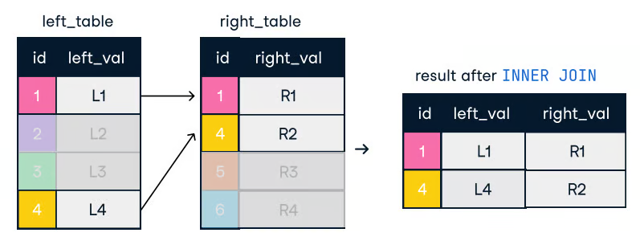

```sql
SELECT o.order_id, c.name
FROM orders o
INNER JOIN customers c ON o.customer_id = c.customer_id;
```


* **An outer join** trả về tất cả **rows** từ một bảng và các **matching rows** từ bảng khác. Nếu không có **match**, các giá trị **NULL** được trả về cho các cột từ bảng không có hàng khớp.


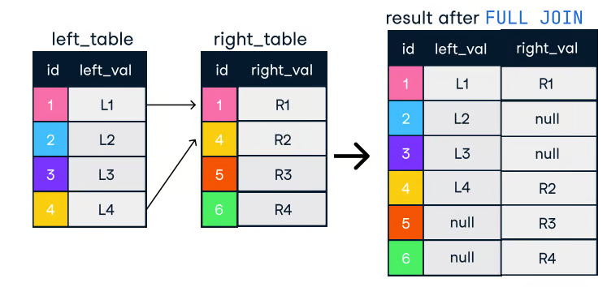
```sql
SELECT o.order_id, c.name
FROM orders o
FULL OUTER JOIN customers c ON o.customer_id = c.customer_id;
```


* **A left join** bao gồm tất cả **rows** từ **left table** và các **matched rows** từ **right table**. Nếu không có **match**, các giá trị **NULL** được trả về cho các cột của **right table**.
  Tương tự, **a right join** bao gồm tất cả **rows** từ **right table**, với các **matching rows** từ **left**, điền **NULLs** nơi không có **match**.

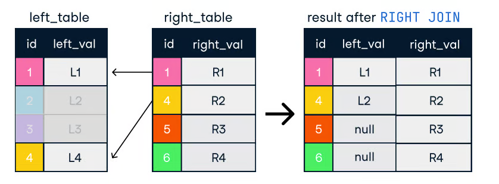
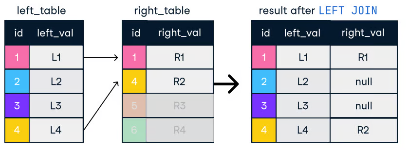
```sql
SELECT c.name, o.order_id
FROM customers c
LEFT JOIN orders o ON c.customer_id = o.customer_id;
```


### Tips for efficient joins:

* **Order joins logically.** Chúng ta nên bắt đầu với các bảng trả về ít **rows** nhất. Điều này giảm lượng dữ liệu cần xử lý trong các **join** tiếp theo.
* **Use indexes on join columns.** Một lần nữa, **indexes** là đồng minh của chúng ta. Sử dụng **indexes** giúp cơ sở dữ liệu nhanh chóng tìm các **matching rows**.
* **Consider using subqueries or CTEs (Common Table Expressions)** để đơn giản hóa các **joins** phức tạp:

```sql
WITH RecentOrders AS (
    SELECT customer_id, order_id
    FROM orders
    WHERE order_date >= DATE('now', '-30 days') 
)
SELECT c.customer_name, ro.order_id
FROM customers c
INNER JOIN RecentOrders ro ON c.customer_id = ro.customer_id;
```


---

# 5. Analyze Query Execution Plans

Hầu hết thời gian, chúng ta chạy **SQL queries** và chỉ kiểm tra xem **output** hoặc kết quả truy xuất có đúng như mong đợi không. Tuy nhiên, chúng ta hiếm khi tự hỏi điều gì diễn ra bên trong khi chúng ta thực thi một **SQL query**.

Hầu hết các cơ sở dữ liệu cung cấp các chức năng như **EXPLAIN** hoặc **EXPLAIN PLAN** để trực quan hóa quá trình này. Các **plans** này cung cấp một bản phân tích từng bước về cách cơ sở dữ liệu sẽ truy xuất dữ liệu. Chúng ta có thể dùng tính năng này để xác định nơi có **performance bottlenecks** và đưa ra quyết định sáng suốt về việc tối ưu hóa truy vấn.

Hãy xem cách chúng ta có thể sử dụng **EXPLAIN** để xác định **bottlenecks**. Chúng ta sẽ chạy đoạn code sau:

```sql
EXPLAIN SELECT f.title, a.actor_name
FROM film f, film_actor fa,  actor a
WHERE f.film_id = fa.film_id and fa.actor_id = a.id 
```


Sau đó, chúng ta có thể xem xét kết quả:


Dưới đây là hướng dẫn chung về cách diễn giải kết quả:

* **Full table scan:** Nếu **plan** hiển thị **full table scan**, cơ sở dữ liệu quét mọi **row** trong bảng, điều này có thể cực kỳ chậm. Điều này thường cho thấy thiếu **index** hoặc **WHERE clause** kém hiệu quả.
* **Inefficient join strategies:** **Plan** có thể cho biết cơ sở dữ liệu đang sử dụng một thuật toán **join** kém tối ưu.
* **Other potential issues:** **Explain plans** có thể làm nổi bật các vấn đề khác, như chi phí **sort** cao hoặc sử dụng quá nhiều **temporary table**.

**Associate Data Engineer in SQL**
Gain practical knowledge in ETL, SQL, and data warehousing for data engineering.

---

# 6. Optimize WHERE Clauses

**WHERE clause** là thành phần thiết yếu trong **SQL queries** vì nó cho phép chúng ta lọc dữ liệu dựa trên các điều kiện cụ thể, đảm bảo chỉ trả về các bản ghi liên quan. Nó cải thiện hiệu quả truy vấn bằng cách giảm lượng dữ liệu được xử lý, điều này rất quan trọng khi làm việc với tập dữ liệu lớn.

Vì vậy, một **WHERE clause** đúng có thể là đồng minh mạnh mẽ khi chúng ta tối ưu hiệu năng của **SQL query**. Hãy xem một số cách mà chúng ta có thể tận dụng **clause** này:

* **Add proper filtering conditions early.** Đôi khi, có một **WHERE clause** là tốt nhưng chưa đủ. Chúng ta phải cẩn thận về vị trí đặt **clause**. Lọc bỏ càng nhiều **rows** càng sớm trong **WHERE clause** có thể giúp tối ưu truy vấn.
* **Avoid using functions on columns in the WHERE clause.** Khi chúng ta áp dụng một **function** lên cột, cơ sở dữ liệu phải áp dụng **function** đó lên mọi **row** trong bảng trước khi lọc kết quả. Điều này ngăn cơ sở dữ liệu sử dụng **indexes** hiệu quả.

Ví dụ, thay vì:

```sql
SELECT * 
FROM employees WHERE 
YEAR(hire_date) = 2020;
```


Chúng ta nên dùng:

```sql
SELECT * 
FROM employees 
WHERE hire_date >= '2020-01-01' AND hire_date < '2021-01-01';
```


* **Use appropriate operators.** Chúng ta nên chọn các **operators** hiệu quả nhất đáp ứng nhu cầu. Ví dụ, `=` thường nhanh hơn **LIKE**, và sử dụng **specific date ranges** nhanh hơn dùng các **functions** như `MONTH(order_date)`.

Vì vậy, ví dụ, thay vì thực hiện truy vấn:

```sql
SELECT * 
FROM orders 
WHERE MONTH(order_date) = 12 AND YEAR(order_date) = 2023;
```


Chúng ta có thể thực hiện truy vấn sau:

```sql
SELECT * 
FROM orders 
WHERE order_date >= '2023-12-01' AND order_date < '2024-01-01';
```


---

# 7. Optimize Subqueries

Trong một số trường hợp, chúng ta đang viết một truy vấn và cảm thấy cần phải động thực hiện một số **filtering**, **aggregation**, hoặc **joins** dữ liệu. Chúng ta không muốn thực hiện nhiều truy vấn; thay vào đó, chúng ta muốn giữ nó trong một truy vấn duy nhất.

Cho những trường hợp đó, chúng ta có thể sử dụng **subqueries**. **Subqueries** trong SQL là các truy vấn lồng bên trong một truy vấn khác, thường nằm trong các câu lệnh **SELECT, INSERT, UPDATE,** hoặc **DELETE**.

**Subqueries** có thể mạnh mẽ và nhanh, nhưng cũng có thể gây ra vấn đề về hiệu năng nếu không sử dụng cẩn thận. Theo nguyên tắc, chúng ta nên **giảm thiểu** việc sử dụng **subqueries** và tuân theo một bộ **best practices**:

* **Replace subqueries with joins when possible.** **Joins** thường nhanh và hiệu quả hơn **subqueries**.
* **Use common table expressions (CTEs) instead.** **CTEs** tách code của chúng ta thành một vài phần nhỏ hơn thay vì một truy vấn lớn, giúp dễ đọc hơn.

```sql
WITH SalesCTE AS ( 
             SELECT salesperson_id, SUM(sales_amount) AS total_sales 
             FROM sales GROUP BY salesperson_id ) 

SELECT salesperson_id, total_sales 
FROM SalesCTE WHERE total_sales > 5000;
```


* **Use uncorrelated subqueries.** **Uncorrelated subqueries** độc lập với truy vấn bên ngoài và có thể thực thi một lần, trong khi **correlated subqueries** được thực thi cho mỗi **row** của truy vấn bên ngoài.

---

# 8. Use EXISTS Instead of IN for Subqueries

Khi làm việc với **subqueries**, chúng ta thường cần kiểm tra xem một giá trị có tồn tại trong một tập kết quả không. Chúng ta có thể làm việc này bằng **IN** hoặc **EXISTS**, nhưng **EXISTS** thường hiệu quả hơn, đặc biệt với tập dữ liệu lớn.

**IN clause** đọc toàn bộ **subquery result set** vào bộ nhớ trước khi so sánh. Ngược lại, **EXISTS clause** dừng xử lý **subquery** ngay khi tìm thấy **match**.

Dưới đây là ví dụ cách sử dụng **clause** này:

```sql
SELECT * 
FROM orders o
WHERE EXISTS (SELECT 1 FROM customers c WHERE c.customer_id = o.customer_id AND c.country = 'USA');
```


---

# 9. Limit the use of DISTINCT

Hãy tưởng tượng chúng ta đang làm một phân tích để gửi ưu đãi khuyến mãi cho khách hàng từ các thành phố **unique**. Cơ sở dữ liệu có nhiều đơn hàng từ cùng một khách hàng. Ý nghĩ đầu tiên xuất hiện là sử dụng **DISTINCT clause**.

Tính năng này hữu ích trong một số trường hợp nhưng có thể tốn tài nguyên, đặc biệt trên các tập dữ liệu lớn. Có một vài **alternatives** cho **DISTINCT**:

* Xác định và loại bỏ dữ liệu trùng lặp trong các quy trình **data cleaning**. Điều này ngăn **duplicates** len lỏi vào cơ sở dữ liệu ngay từ đầu.
* Sử dụng **GROUP BY** thay vì **DISTINCT** khi có thể. **GROUP BY** có thể hiệu quả hơn, đặc biệt khi kết hợp với các **aggregate functions**.

Vì vậy, thay vì thực hiện:

```sql
SELECT DISTINCT city FROM customers;
```


Chúng ta có thể dùng:

```sql
SELECT city FROM customers GROUP BY city;
```


* Sử dụng **window functions**. Các **window functions** như **ROW_NUMBER** có thể giúp chúng ta xác định **duplicates** và lọc chúng mà không cần dùng **DISTINCT**.

---

# 10. Leverage Database-Specific Features

Khi làm việc với dữ liệu, chúng ta tương tác với nó bằng **SQL** thông qua một **Database Management System (DBMS)**. **DBMS** xử lý các lệnh **SQL**, quản lý cơ sở dữ liệu và đảm bảo tính toàn vẹn cũng như bảo mật dữ liệu. Các hệ thống cơ sở dữ liệu khác nhau cung cấp các tính năng độc đáo có thể giúp tối ưu **queries**.

**Database hints** là các chỉ dẫn đặc biệt mà chúng ta có thể thêm vào **queries** để thực thi một truy vấn hiệu quả hơn. Chúng là công cụ hữu ích, nhưng nên dùng thận trọng.

Ví dụ, trong **MySQL**, **USE INDEX hint** có thể ép sử dụng một **index** cụ thể:

```sql
SELECT * FROM employees USE INDEX (idx_salary) WHERE salary > 50000;
```


Trong **SQL Server**, **OPTION (LOOP JOIN) hint** chỉ định phương thức **join**:

```sql
SELECT * 
FROM orders 
INNER JOIN customers ON orders.customer_id = customers.id OPTION (LOOP JOIN); 
```


Những **hints** này ghi đè **default query optimization**, cải thiện hiệu năng trong các kịch bản cụ thể.

Mặt khác, **partitioning** và **sharding** là hai kỹ thuật để phân phối dữ liệu trên **cloud**.

Với **partitioning**, chúng ta chia một bảng lớn thành nhiều bảng nhỏ hơn, mỗi bảng có **partition key**. **Partition keys** thường dựa trên **timestamps** khi các **rows** được tạo hoặc các giá trị **integer** mà chúng chứa. Khi chúng ta thực thi truy vấn trên bảng này, **server** sẽ tự động định tuyến đến **partitioned table** phù hợp với truy vấn.

**Sharding** khá giống, ngoại trừ việc thay vì chia một bảng lớn thành các bảng nhỏ hơn, nó chia một **database** lớn thành các **databases** nhỏ hơn. Mỗi **database** này nằm trên một **server** khác nhau. Thay vì **partition key**, một **sharding key** chuyển hướng **queries** để chạy trên **database** phù hợp. **Sharding** tăng tốc độ xử lý vì tải được chia trên các **servers** khác nhau.

---

# 11. Monitor and Optimize Database Statistics

Giữ **database statistics** luôn cập nhật là quan trọng để đảm bảo **query optimizer** có thể đưa ra các quyết định chính xác và sáng suốt về cách thực thi truy vấn hiệu quả nhất.

**Statistics** mô tả phân phối dữ liệu trong một bảng (ví dụ: số lượng **rows**, tần suất các giá trị, và phạm vi giá trị trên các cột), và **optimizer** dựa vào thông tin này để ước lượng chi phí thực thi truy vấn. Nếu **statistics** lỗi thời, **optimizer** có thể chọn các **execution plans** kém hiệu quả, như sử dụng sai **indexes** hoặc chọn **full table scan** thay vì **index scan** hiệu quả hơn, dẫn đến hiệu năng truy vấn kém.

Các cơ sở dữ liệu thường hỗ trợ **automatic updates** để duy trì **statistics** chính xác. Ví dụ, trong **SQL Server**, cấu hình mặc định tự động cập nhật **statistics** khi một lượng dữ liệu đáng kể thay đổi. Tương tự, **PostgreSQL** có **auto-analyze feature**, tính năng này cập nhật **statistics** sau một ngưỡng thay đổi dữ liệu nhất định.

Tuy nhiên, chúng ta có thể **manually update statistics** trong các trường hợp mà **automatic updates** là không đủ hoặc cần can thiệp thủ công. Trong **SQL Server**, chúng ta có thể sử dụng lệnh **UPDATE STATISTICS** để làm mới **statistics** cho một bảng hoặc **index** cụ thể, trong khi ở **PostgreSQL**, lệnh **ANALYZE** có thể được chạy để cập nhật **statistics** cho một hoặc nhiều bảng.

```sql
-- Update statistics for all tables in the current database
ANALYZE;

-- Update statistics for a specific table
ANALYZE my_table;
```


---

# 12. Utilize stored procedures

**A stored procedure** là một tập lệnh **SQL** mà chúng ta lưu trong cơ sở dữ liệu để không phải viết đi viết lại cùng một **SQL**. Chúng ta có thể coi nó như một **reusable script**.

Khi cần thực hiện một tác vụ nhất định, như cập nhật bản ghi hoặc tính toán giá trị, chúng ta chỉ cần gọi **stored procedure**. Nó có thể nhận **input**, thực hiện một số công việc như truy vấn hoặc sửa đổi dữ liệu, và thậm chí trả về kết quả. **Stored procedures** giúp tăng tốc vì **SQL** được **precompiled**, khiến code của bạn sạch hơn và dễ quản lý hơn.

Chúng ta có thể tạo một **stored procedure** trong **PostgreSQL** như sau:

```sql
CREATE OR REPLACE PROCEDURE insert_employee(
    emp_id INT,
    emp_first_name VARCHAR,
    emp_last_name VARCHAR
)
LANGUAGE plpgsql
AS $
BEGIN
    -- Insert a new employee into the employees table
    INSERT INTO employees (employee_id, first_name, last_name)
    VALUES (emp_id, emp_first_name, emp_last_name);
END;
$;

-- call the procedure
CALL insert_employee(101, 'John', 'Doe');
```


---

# 13. Avoid Unnecessary Ordering and Grouping

Là những người làm dữ liệu, chúng ta thích dữ liệu của mình được **ordered** và **grouped** để có thể rút ra insights dễ dàng hơn. Chúng ta thường dùng **ORDER BY** và **GROUP BY** trong các **SQL queries**.

Tuy nhiên, cả hai **clauses** có thể tốn tài nguyên tính toán, đặc biệt khi xử lý các tập dữ liệu lớn. Khi **sorting** hoặc **aggregating** dữ liệu, **database engine** thường phải thực hiện **full scan** dữ liệu và sau đó sắp xếp, xác định **groups**, và/hoặc áp dụng các **aggregate functions**, thường sử dụng các thuật toán tốn tài nguyên.

Để tối ưu **queries**, chúng ta có thể làm theo một số mẹo sau:

* **Minimize sorting.** Chúng ta chỉ nên dùng **ORDER BY** khi thực sự cần thiết. Nếu **sorting** không thiết yếu, bỏ qua **clause** này có thể giúp giảm đáng kể thời gian xử lý.
* **Use indexes.** Khi có thể, hãy đảm bảo rằng các cột tham gia **ORDER BY** và **GROUP BY** được **indexed**.
* **Push sorting to the application layer.** Nếu có thể, chúng ta nên đẩy thao tác **sorting** lên **application layer** thay vì để **database** thực hiện.
* **Pre-aggregate data.** Với các truy vấn phức tạp có **GROUP BY**, chúng ta có thể **pre-aggregate** dữ liệu ở giai đoạn sớm hơn hoặc trong một **materialized view**, để cơ sở dữ liệu không phải tính toán lại các **aggregates** lặp đi lặp lại.

---

# 14. Use UNION ALL Instead of UNION

Khi chúng ta muốn kết hợp kết quả từ nhiều truy vấn thành một danh sách, chúng ta có thể sử dụng **UNION** và **UNION ALL**. Cả hai kết hợp kết quả của hai hoặc nhiều **SELECT statements** khi chúng có cùng tên cột. Tuy nhiên, chúng không giống nhau, và sự khác biệt khiến chúng phù hợp cho các trường hợp sử dụng khác nhau.

**UNION** loại bỏ các **duplicate rows**, điều này yêu cầu thời gian xử lý nhiều hơn.

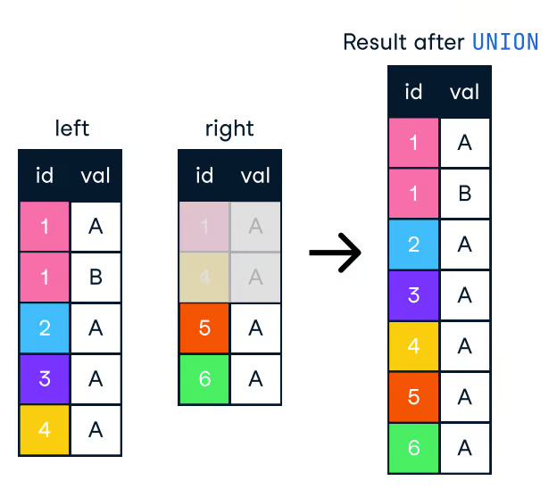

Ngược lại, **UNION ALL** kết hợp kết quả nhưng giữ tất cả các hàng, bao gồm cả **duplicates**. Vì vậy, nếu chúng ta không cần loại bỏ **duplicates**, chúng ta nên dùng **UNION ALL** để có hiệu năng tốt hơn.

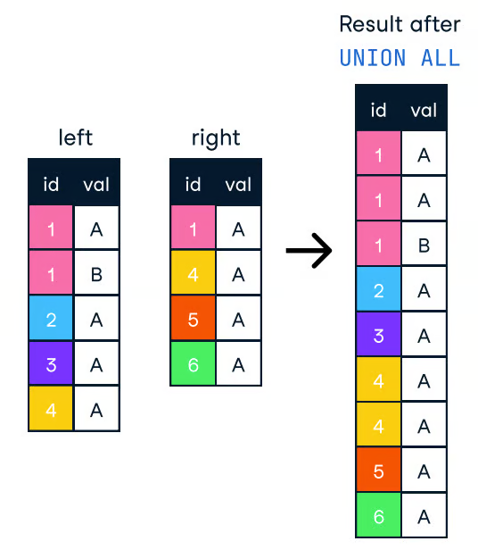

```sql
-- Potentially slower
SELECT product_id FROM products WHERE category = 'Electronics'
UNION
SELECT product_id FROM products WHERE category = 'Books';

-- Potentially faster
SELECT product_id FROM products WHERE category = 'Electronics'
UNION ALL
SELECT product_id FROM products WHERE category = 'Books';
```


---

# 15. Break Down Complex Queries

Làm việc với các tập dữ liệu lớn đồng nghĩa với việc chúng ta sẽ thường xuyên gặp các **complex queries** khó hiểu và khó tối ưu. Chúng ta có thể cố gắng xử lý những trường hợp này bằng cách **break down** chúng thành các **queries** nhỏ và đơn giản hơn. Theo cách này, chúng ta có thể dễ dàng xác định **performance bottlenecks** và áp dụng các kỹ thuật tối ưu hóa.

Một trong những chiến lược thường dùng để **break down queries** là **materialized views**. Đây là các kết quả truy vấn được **precomputed** và lưu trữ để có thể truy cập nhanh, thay vì tính toán lại mỗi khi được tham chiếu. Khi dữ liệu nền thay đổi, **materialized view** phải được **manually** hoặc **automatically refreshed**.

Dưới đây là ví dụ về cách tạo và truy vấn một **materialized view**:

```sql
-- Create a materialized view
CREATE MATERIALIZED VIEW daily_sales AS
SELECT product_id, SUM(quantity) AS total_quantity
FROM order_items
GROUP BY product_id;

-- Query the materialized view
SELECT * FROM daily_sales;
```

---

# Sử dụng index

## Index trong Database
    

- Indexes (hay còn được gọi là keys trong MySQL) là một cấu trúc dữ liệu mà MySQL sẽ sử dụng để có thể tìm kiếm một row nào đó nhanh chóng. Index là một phần cực kỳ quan trọng trong việc tối ưu hiệu năng của CSDL, nhất là khi dữ liệu của bạn ngày càng tăng lên nhiều hơn.
- Với một CSDL nhỏ, chỉ khoảng 100-200 row thì ta không cần tới index làm gì cả. Nhưng khi dữ liệu ngày càng tăng lên, hiệu năng có thể sụt giảm nhanh chóng nếu không có index.

## Các loại indexes
- Có nhiều loại indexes khác nhau, mỗi kiểu được thiết kế phục vụ cho những mục đích khác nhau. Indexes thường được triển khai ở tầng storage engine, chứ không phải tầng server. Index cũng không được chuẩn hoá, điều này có nghĩa là trên các engine khác nhau, cách hoạt động của chúng cũng sẽ khác nhau.
- Ở bài viết, ta sẽ tìm hiểu theo engine InnoDB
## B-tree indexes
- Đây là kiểu indexes thường được nhắc đến phổ biến nhất, khi người ta nói về đánh index database mà không nhắc chính xác là loại index nào, thì khả năng cao đó là B-tree indexes
- Ý tưởng đơn giản của B-Tree là toàn bộ dữ liệu sẽ được lưu theo thứ tự sắp xếp.
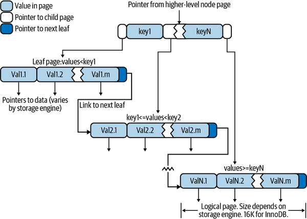

- B-Tree tăng tốc độ tìm kiếm dữ liệu vì ta sẽ không cần đi qua cả một bảng để tìm kiếm dữ liệu đang search. Ta sẽ bắt đầu từ node root trên cùng, ở trên root sẽ chứa con trỏ tới các node con theo một quy luật, ví dụ toàn bộ cây bên trái sẽ là những node có giá trị nhỏ hơn node root, còn bên phải thì lớn hơn.


## Adaptive hash index
- Engine InnoDB có một cơ chế được gọi là Adaptive hash index. Cơ chế này hoạt động khi nó tự phát hiện một dữ liệu nào đó được truy cập rất nhiều, lúc này dữ liệu đó sẽ được đặt bên trên cả index của cây B-Tree, dạng như cache. GIúp cho dữ liệu này còn có tốc độ truy vấn cao hơn bình thường.
- Tuy nhiên cơ chế này không thể tắt đi, hay điều chỉnh thông số.
## Cách hoạt động của index
## B-Tree vs Binary Tree
- Có thể bạn sẽ thấy B-Tree khá giống cây nhị phân tìm kiếm, tuy nhiên không hẳn vậy. Cây nhi jphaan tìm kiếm chỉ có một dữ liệu tại một node, trong khi đó B-Tree sử dụng một mảng dữ liệu tại một node và có con trỏ tới các node con ở từng dữ liệu trong mảng.
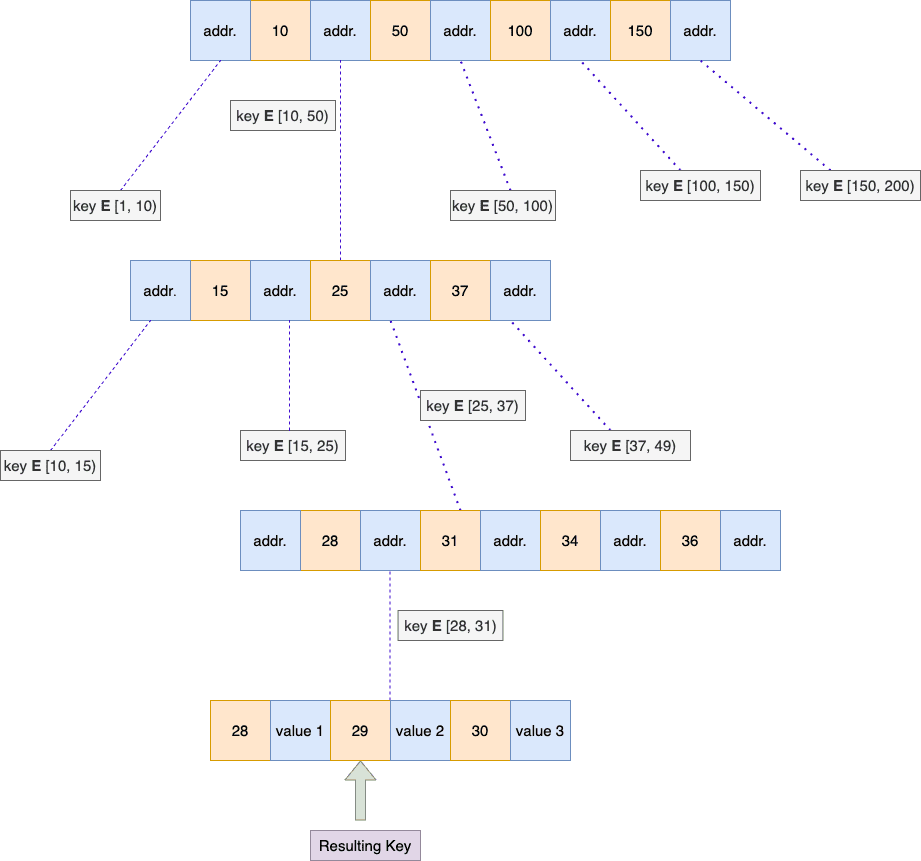
- Giả sử, ta muốn tìm kiếm một dữ liệu giá trị = 29 trong cây
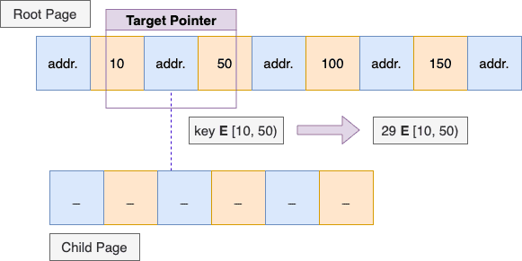
- Ở node đầu, ta thấy dữ liệu sẽ nằm trong khoảng 10-50, lúc này ta sẽ đi tới node con qua con trỏ lưu từ 10-50
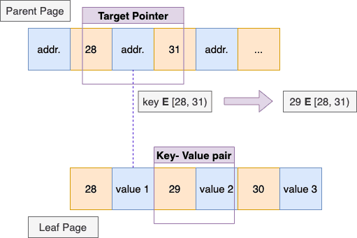
- Tiếp tục lặp lại như vậy cho đến khi ta tìm đến node lá ở dưới cùng chứa dữ liệu thực sự
## Một số hạn chế của B-Tree
# Sử dụng INDEX (chỉ mục) trong MySQL giúp tăng tốc độ truy vấn bằng cách tạo một cấu trúc dữ liệu cho phép tìm kiếm các hàng dữ liệu nhanh hơn, thay vì phải quét toàn bộ bảng.
1. Cách tạo và quản lý INDEX
1.1. Tạo INDEX khi tạo bảng
Bạn có thể định nghĩa chỉ mục ngay trong câu lệnh CREATE TABLE.
Cú pháp:
sql
CREATE TABLE ten_bang (
    cot1 kieu_du_lieu,
    cot2 kieu_du_lieu,
    ...
    INDEX ten_chi_muc (cot_index)
);
Hãy thận trọng khi sử dụng mã.

Ví dụ:
sql
CREATE TABLE NhanVien (
    id INT PRIMARY KEY AUTO_INCREMENT,
    ho_ten VARCHAR(100),
    email VARCHAR(100),
    ngay_sinh DATE,
    INDEX idx_ho_ten (ho_ten)
);
Hãy thận trọng khi sử dụng mã.

1.2. Tạo INDEX trên bảng đã tồn tại
Sử dụng câu lệnh CREATE INDEX để thêm chỉ mục vào một bảng hiện có.
Cú pháp:
sql
CREATE INDEX ten_chi_muc ON ten_bang (cot_index);
Hãy thận trọng khi sử dụng mã.

Ví dụ:
sql
CREATE INDEX idx_email ON NhanVien (email);
Hãy thận trọng khi sử dụng mã.

1.3. Tạo INDEX duy nhất (UNIQUE)
Loại chỉ mục này đảm bảo rằng tất cả các giá trị trong cột được lập chỉ mục là duy nhất.
Cú pháp:
sql
CREATE UNIQUE INDEX ten_chi_muc ON ten_bang (cot_unique);
Hãy thận trọng khi sử dụng mã.

Ví dụ:
sql
CREATE UNIQUE INDEX idx_unique_email ON NhanVien (email);
Hãy thận trọng khi sử dụng mã.

1.4. Tạo INDEX cho nhiều cột (Composite Index)
Tạo chỉ mục trên nhiều cột để tối ưu hóa các truy vấn sử dụng nhiều điều kiện trong mệnh đề WHERE.
Cú pháp:
sql
CREATE INDEX ten_chi_muc ON ten_bang (cot1, cot2);
Hãy thận trọng khi sử dụng mã.

Ví dụ:
sql
CREATE INDEX idx_ho_ten_ngay_sinh ON NhanVien (ho_ten, ngay_sinh);
Hãy thận trọng khi sử dụng mã.

1.5. Xóa INDEX
Sử dụng câu lệnh DROP INDEX để xóa một chỉ mục không còn cần thiết.
Cú pháp:
sql
DROP INDEX ten_chi_muc ON ten_bang;
Hãy thận trọng khi sử dụng mã.

Ví dụ:
sql
DROP INDEX idx_ho_ten ON NhanVien;
Hãy thận trọng khi sử dụng mã.

1.6. Xem thông tin INDEX
Sử dụng câu lệnh SHOW INDEX để xem tất cả các chỉ mục đã tạo trên một bảng.
Cú pháp:
sql
SHOW INDEX FROM ten_bang;
Hãy thận trọng khi sử dụng mã.

2. Nguyên tắc sử dụng INDEX hiệu quả
Tạo chỉ mục trên các cột được dùng trong mệnh đề WHERE, JOIN và ORDER BY.
Mệnh đề WHERE: Các cột thường được sử dụng để lọc dữ liệu là ứng cử viên lý tưởng cho việc tạo chỉ mục.
Mệnh đề JOIN: Các cột được sử dụng để nối các bảng với nhau sẽ giúp tăng tốc các thao tác JOIN.
Mệnh đề ORDER BY: Chỉ mục có thể giúp sắp xếp kết quả nhanh hơn mà không cần tạo bảng tạm.
Tránh lạm dụng INDEX.
Việc tạo quá nhiều chỉ mục sẽ làm tăng chi phí cho các thao tác INSERT, UPDATE và DELETE.
Hãy tìm sự cân bằng phù hợp giữa hiệu suất truy vấn và chi phí bảo trì.
Sử dụng INDEX trên các cột có độ chọn lọc cao (high cardinality).
Các cột có nhiều giá trị khác nhau, ví dụ như email hoặc mã sản phẩm, sẽ mang lại hiệu quả cao hơn so với các cột có ít giá trị trùng lặp.
Sử dụng INDEX có gợi ý (Index Hints).
Trong một số trường hợp, bạn có thể hướng dẫn trình tối ưu hóa truy vấn của MySQL sử dụng một chỉ mục cụ thể để đảm bảo hiệu suất tốt nhất.
Cú pháp: SELECT * FROM ten_bang USE INDEX (ten_chi_muc) WHERE ....
# Khái niệm Transaction, ACID, dirty read, dirty write
# 1. Transaction

Vì ACID là thuộc tính của transaction nên chúng ta cần hiểu khái niệm transaction là gì trước.​ Một transaction đề cập đến một đơn vị logic của công việc bao gồm một hoặc nhiều hoạt động của cơ sở dữ liệu.

⇒ Như vậy, chúng ta có thể coi một transaction là một tập hợp các câu query trong cơ sở dữ liệu.

Sau đây là ví dụ của một transaction trong lĩnh vực tài chính:

**Chuyển $100 từ Account 1 tới Account 2.**

Transaction này bao gồm các hoạt động của cơ sở dữ liệu như sau:

- Tạo một record để chuyển 100 từ tài khoản A tới tài khoản B. Đây thường được coi là **BEGIN** của transaction.
- Đọc số dư của tài khoản 1.
- Nếu số dư của tài khoản 1 ≥ 100, trừ tài khoản 1 đi 100.
- Đọc số dư của tài khoản 2.
- Cộng 100 vào số dư của tài khoản 2.
- Nếu mọi thứ thành công, transaction sẽ được **COMMIT** để đánh dấu sự thay đổi trong cơ sở dữ liệu là vĩnh viễn. Nếu có lỗi xảy ra thì transaction sẽ được **ROLLBACK**, tức mọi thay đổi sẽ trở về trạng thái ban đầu.

---

# 2. ACID là gì?​

Năm 1983, hai giáo sư Khoa học máy tính là **Theo Härder** (Theo Har-der) và **Andreas Reuter** (An-drei-as Rao-tờ) đã xuất bản một bài báo chuyên đề có tiêu đề *Principles of transaction-oriented database recovery* (Nguyên tắc phục hồi cơ sở dữ liệu hướng giao dịch) trên tạp chí **Khảo sát điện toán ACM**. Bài báo này phác thảo các nguyên tắc cơ bản đảm bảo xử lý giao dịch đáng tin cậy trong các hệ thống quản trị cơ sở dữ liệu, sau này được gọi là các thuộc tính **ACID**.

**ACID** là một bộ các thuộc tính của transaction trong hệ quản trị cơ sở dữ liệu (DBMS) nhằm đảm bảo tính hợp lệ của dữ liệu trong trường hợp có lỗi, mất điện và các rủi ro khác.

---

# 3. Tính chất của ACID​

ACID bao gồm bộ 4 thuộc tính, viết tắt tương ứng với các chữ cái:

- **A (Atomicity - Tính nguyên tử)**
- **C (Consistency - Tính nhất quán)**
- **I (Isolation - Tính cô lập)**
- **D (Durability - Tính bền vững)**

---

## 3.1. Atomicity (A)

### 3.1.1. Atomicity là gì?​

**Atomicity (Tính nguyên tử)** là chuỗi hoạt động của database không thể phân chia và không thể rút gọn, sao cho tất cả các bước đều xảy ra hoặc là không gì xảy ra.

> Atomicity is an indivisible and irreducible series of database operations such that either all occurs, or nothing occurs.  
> *Nguồn: Wikipedia*

Nếu có một transaction bị lỗi thì transaction đó sẽ được **ROLLBACK**, dữ liệu sẽ không thay đổi, còn nếu không xảy ra lỗi thì transaction sẽ được **COMMIT**, dữ liệu trong cơ sở dữ liệu sẽ được cập nhật thành công.

Dân gian có một câu thành ngữ rất hay mô tả ngắn gọn tính nguyên tử là *"Được ăn cả, ngã về không".*

---

### 3.1.2. Ví dụ về Atomicity

Tôi có ví dụ sau: **Chuyển 100 đô la từ Account 1 sang Account 2**

- **Trường hợp 1 tuân thủ tính nguyên tử:** Transaction thành công, mọi thứ êm đẹp.  
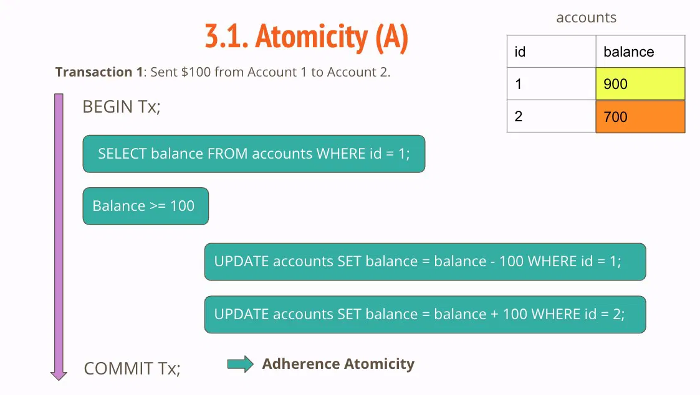

- **Trường hợp 2 không tuân thủ tính nguyên tử:** Số balance của Account 1 thay đổi nhưng số balance của Account 2 vẫn giữ nguyên.  
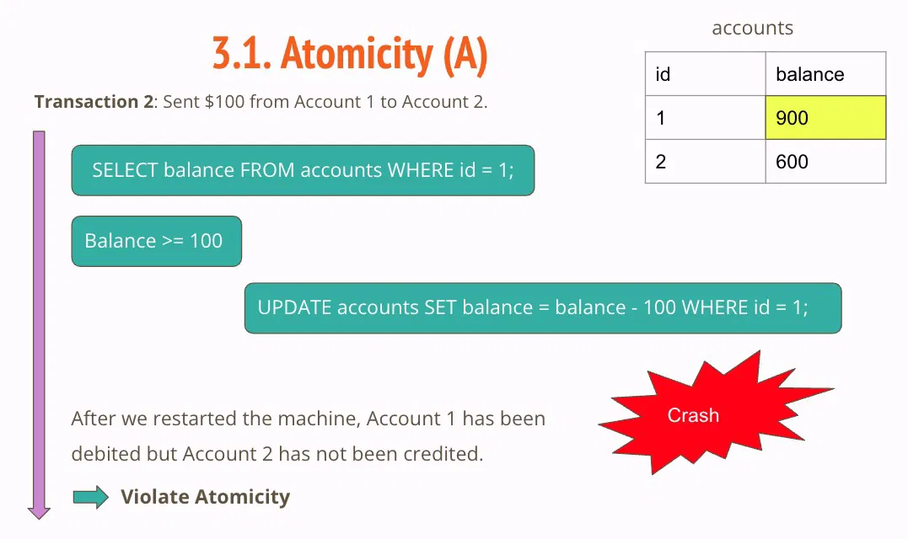
---

### 3.1.3. Làm sao giúp hệ thống đảm bảo Atomicity?

Có nhiều cách để đảm bảo tính nguyên tử trong cơ sở dữ liệu, sau đây, tôi xin liệt kê một vài cách:

- **Sử dụng hệ thống quản trị cơ sở dữ liệu (DBMS) tuân thủ ACID:**  
  DBMS tuân thủ ACID có các cơ chế tích hợp sẵn để đảm bảo tính nguyên tử. Đây thường là cách đơn giản nhất vì DBMS sẽ tự động xử lý giúp bạn.
  
- **Triển khai Two-Phase Commit (2PC):**  
  Đây là một giao thức được sử dụng trong các hệ thống phân tán để đảm bảo rằng một transaction chỉ được cam kết nếu tất cả các nút tham gia đồng ý. Điều này đảm bảo rằng một transaction chỉ được cam kết khi tất cả các nút có dữ liệu được cập nhật và đồng bộ hóa.
  
- **Sử dụng transaction Logs:**  
  Cơ sở dữ liệu duy trì các transaction log ghi lại tất cả các hành động được thực hiện trong suốt giao dịch. Trong trường hợp xảy ra lỗi, nhật ký có thể được **ROLLBACK** để giúp hệ thống trở về trạng thái trước khi bắt đầu transaction.

---

## 3.2. Consistency (C)

### 3.2.1. Consistency là gì?​

**Consistency (Tính nhất quán)** yêu cầu rằng tất cả transaction chỉ có thể thay đổi dữ liệu theo những cách được cho phép.

> Consistency (or correctness) refers to the requirement that any given database transaction must change affected data only in allowed ways. Any data written to the database must be valid according to all defined rules, including constraints, cascades, triggers, and any combination thereof.  
> *Nguồn: Wikipedia*

Sau khi thực hiện một transaction, tất cả các ràng buộc của cơ sở dữ liệu phải được duy trì. Nếu một transaction vi phạm bất kỳ ràng buộc nào, nó phải bị huỷ bỏ và hệ thống phải quay trở lại trạng thái trước khi transaction diễn ra.

---

### 3.2.2. Ví dụ về Consistency

Tôi có ví dụ về **không tuân thủ tính nhất quán** do không tuân thủ ràng buộc về **foreign key** (khoá ngoài) giữa hai bảng **customers** và **accounts** như sau:

- Bạn có 2 bảng **customers** và **accounts**.  
- Bảng **customers** có khoá ngoài **account_id** trỏ tới **id** của bảng **accounts** như hình.  
- **accounts** không có record với `id = 3` nhưng bảng **customers** lại có 1 record có `account_id = 3`.

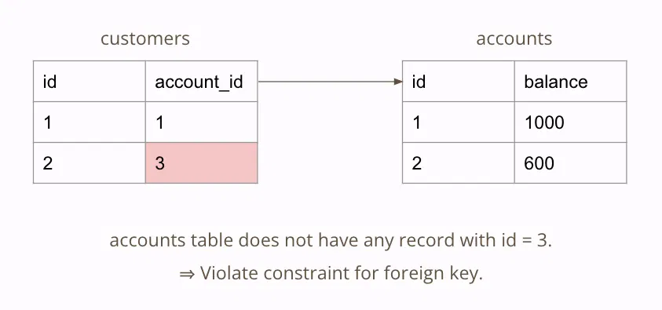
---

### 3.2.3. Làm sao giúp hệ thống đảm bảo Consistency?

Có nhiều cách để đảm bảo tính nhất quán trong cơ sở dữ liệu, sau đây, tôi xin liệt kê một vài cách:

- **Sử dụng hệ thống quản trị cơ sở dữ liệu (DBMS) tuân thủ ACID**
- **Kiểm tra tính hợp lệ của dữ liệu**: Trước và sau khi thực hiện một transaction, kiểm tra tính hợp lệ của dữ liệu để đảm bảo rằng nó thỏa mãn tất cả các ràng buộc và quy tắc của hệ thống.
- **Rollback và Recovery**
- **Sử dụng database versioning (quản lý phiên bản)**
- **Đảm bảo tính cô lập và tính nguyên tử của transaction**
- **Triển khai Two-Phase Commit (2PC)**

Tùy thuộc vào yêu cầu và đặc điểm cụ thể của từng hệ thống, một hoặc nhiều cách tiếp cận này có thể được sử dụng để đảm bảo tính nhất quán.

---

## 3.3. Isolation (I)

### 3.3.1. Isolation là gì?​

**Isolation (Tính cô lập)** đảm bảo các transaction được thực thi một cách độc lập, không phụ thuộc lẫn nhau.

> Isolation: Events within a transaction must be hidden from other transactions running concurrently.  
> *Trích: Principles of transaction-oriented database recovery*

Trong tính cô lập, chúng ta có hai khái niệm quan trọng là:

- **Read phenomena (Hiện tượng đọc)**
- **Isolation levels (Cấp độ cô lập)**

---

### 3.3.2. Read phenomena (Hiện tượng đọc)​

**Read phenomena (Hiện tượng đọc)** là tất cả những lỗi có thể xuất hiện khi nhiều người đọc và ghi vào cùng một dòng.

Chúng ta có 3 loại lỗi khi đọc phổ biến:

- **Dirty reads:** lỗi khi đọc những thay đổi chưa được commit.  
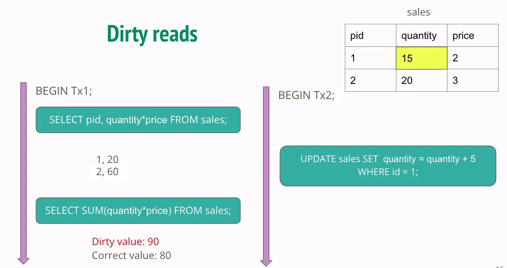

- **Non-repeatable reads:** lỗi khi đọc thay đổi đã được commit.  
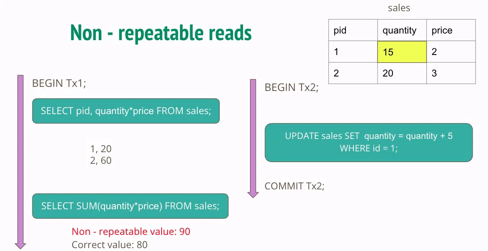

- **Phantom reads:** lỗi đọc khi thêm record mới vào bảng.  

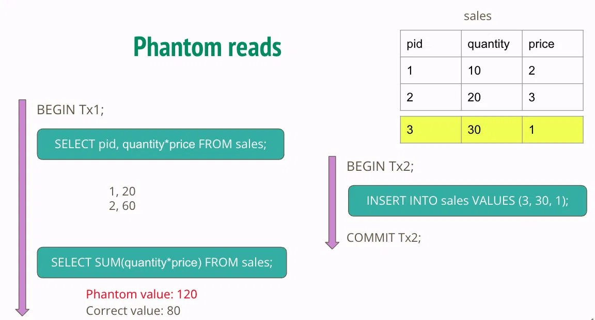
---

### 3.3.3. Isolation levels (Cấp độ cô lập)​

**Isolation levels (Cấp độ cô lập)** chỉ các cấp độ cô lập trong một transaction nhằm khắc phục hiện tượng đọc gây lỗi (Read phenomena).

Chúng ta có 4 cấp độ cô lập xếp theo thứ tự mức cô lập cao nhất tới thấp nhất. Mức cô lập càng cao thì hiệu năng lại càng giảm.

| Cấp độ | Mô tả |
|--------|--------|
| **Serializable** | Các transaction được thực hiện tuần tự. Đây là cấp độ cô lập cao nhất và có tính concurrency thấp nhất. |
| **Repeatable read** | Mỗi query trong 1 transaction chỉ nhìn thấy các thay đổi đã được commit trước khi transaction đó bắt đầu. |
| **Read committed** | Mỗi query trong 1 transaction chỉ nhìn thấy các thay đổi đã được commit trước khi query bắt đầu. |
| **Read uncommitted** | Transaction có thể đọc những thay đổi chưa được commit hoặc đã được commit bởi những transaction khác. Đây là cấp độ cô lập thấp nhất và có tính concurrency cao nhất. |

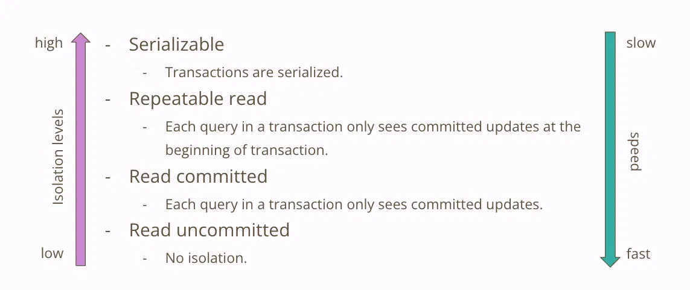
*Mối tương quan giữa hiện tượng đọc và cấp độ cô lập:*

- Mức cô lập càng cao thì các lỗi đọc càng ít xảy ra.
- Ở mức độ cô lập cao nhất **Serializable**, không có lỗi đọc nào.
- Ở mức độ thấp nhất **Read uncommitted**, xuất hiện tất cả các lỗi đọc.
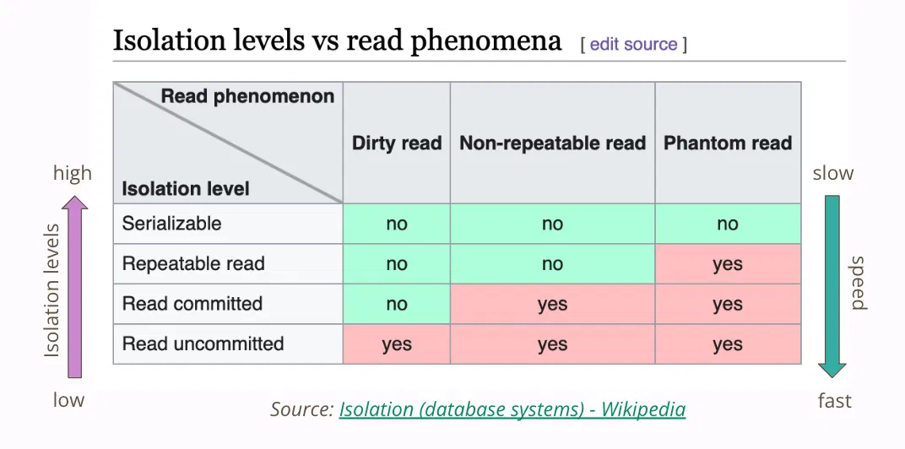
**Mức cô lập mặc định:**

- Ở **Postgres 15** là *Read committed*  
- Ở **MySQL 8** là *Repeatable read*

⇒ **Postgres 15 chạy nhanh hơn MySQL 8** vì có mức độ cô lập thấp hơn.

---

### 3.3.4. Làm sao giúp hệ thống đảm bảo Isolation?

Có nhiều kỹ thuật để đảm bảo tính cô lập trong cơ sở dữ liệu, sau đây, tôi xin liệt kê một vài kỹ thuật:

- **Sử dụng DBMS tuân thủ ACID**
- **Triển khai Two-Phase Commit (2PC)**

Bạn cần lưu ý rằng tuỳ vào từng trường hợp cụ thể, chúng ta có thể áp dụng linh hoạt một hay nhiều kỹ thuật.

---

## 3.4. Durability (D)

### 3.4.1. Durability là gì?​

**Durability (Tính bền vững)** đảm bảo rằng những transaction đã commit, kết quả của nó sẽ được lưu trữ vĩnh viễn và không thể thay đổi hoặc mất mát, ngay cả trong trường hợp có lỗi hệ thống, cúp điện hoặc các sự cố khác.

> Durability: Once a transaction has been completed and has committed its results to the database, the system must guarantee that these results survive any subsequent malfunctions.  
> *Trích: Principles of transaction-oriented database recovery*

---

### 3.4.2. Ví dụ về Durability

Giả sử bạn đang thực hiện một giao dịch trực tuyến để chuyển **1000 đô la** từ tài khoản ngân hàng của bạn sang tài khoản của một người thân. Đây coi như một transaction được thực hiện qua Internet và bao gồm nhiều bước như sau:

1. **BEGIN transaction**
2. Xác nhận số dư hiện tại
3. Giảm 1000 đô la từ tài khoản của bạn
4. Tăng 1000 đô la vào tài khoản của người thân
5. Cập nhật các bản ghi tương ứng
6. **COMMIT transaction**

Khi tất cả các bước này đã được hoàn thành và transaction đã được commit, **tính bền vững** đảm bảo rằng các thay đổi đó sẽ được lưu trữ vĩnh viễn trong cơ sở dữ liệu của ngân hàng.

Ngay cả nếu ngay sau đó xảy ra một lỗi hệ thống hoặc cúp điện, các thay đổi đã được thực hiện sẽ không bị mất.

---

### 3.4.3. Làm sao giúp hệ thống đảm bảo Durability?

Để đảm bảo tính bền vững trong một cơ sở dữ liệu, chúng ta có thể sử dụng một số cách tiếp cận và kỹ thuật sau:

- **Sử dụng transaction logs**
- **Sử dụng hệ thống lưu trữ dự phòng**
- **Sử dụng distributed database (cơ sở dữ liệu phân tán)**
- **Sử dụng Write-Ahead Logging (WAL)**
- **Triển khai Two-Phase Commit (2PC)**

Bạn cần lưu ý rằng không có cách tiếp cận duy nhất nào để đảm bảo tính bền vững mà cần kết hợp nhiều phương pháp, phụ thuộc vào cấu trúc hệ thống, yêu cầu về performance và ngân sách.

---

# 4. Tóm tắt​

- **Transaction** là một tập hợp các câu query.
- **ACID** là thuộc tính của transaction, bao gồm 4 tính chất:
  - **A:** Tính nguyên tử (Atomicity)
  - **C:** Tính nhất quán (Consistency)
  - **I:** Tính cô lập (Isolation)
  - **D:** Tính bền vững (Durability)
- Có 3 **hiện tượng đọc (Read phenomenon)** phổ biến:
  - **Dirty reads:** đọc thay đổi chưa được commit  
  - **Repeatable reads:** đọc thay đổi đã được commit  
  - **Phantom reads:** đọc thay đổi khi đang có record mới thêm vào cơ sở dữ liệu
- Có 4 **mức độ cô lập (Isolation levels)**:
  1. **Serializable:** tuần tự, cao nhất  
  2. **Repeatable read:** chỉ thấy dữ liệu commit trước BEGIN  
  3. **Read committed:** chỉ thấy dữ liệu commit trước query  
  4. **Read uncommitted:** có thể đọc dữ liệu chưa commit

*Mức cô lập càng cao thì hiệu suất càng giảm, và ngược lại.*

Bài tập: SQL 50 - LeetCode
