- [\[BACKEND - KHÓA SPRING BOOT CƠ BẢN\]](#backend---khóa-spring-boot-cơ-bản)
- [\[BUỔI 5\] CÁC KIẾN THỨC CƠ BẢN](#buổi-5-các-kiến-thức-cơ-bản)
- [🎯 Nội dung cần chuẩn bị.](#-nội-dung-cần-chuẩn-bị)
- [HTTP là gì ?](#http-là-gì-)
  - [1. HTTP là gì ?](#1-http-là-gì-)
  - [2. Khía cạnh cơ bản của HTTP](#2-khía-cạnh-cơ-bản-của-http)
    - [2.1 HTTP đơn giản:](#21-http-đơn-giản)
    - [2.2 HTTP có thể mở rộng:](#22-http-có-thể-mở-rộng)
    - [2.3 HTTP là stateless, nhưng không sessionless:](#23-http-là-stateless-nhưng-không-sessionless)
    - [2.4 Kết nối liên tục và không liên tục](#24-kết-nối-liên-tục-và-không-liên-tục)
  - [3. Cấu trúc cơ bản của HTTP](#3-cấu-trúc-cơ-bản-của-http)
  - [4. Kết nối của HTTP](#4-kết-nối-của-http)
  - [5. Tóm tắt qua thời kì phát triển của HTTP](#5-tóm-tắt-qua-thời-kì-phát-triển-của-http)
- [Các method trong HTTP](#các-method-trong-http)
- [HTTP Methods — Nền tảng của RESTful APIs](#http-methods--nền-tảng-của-restful-apis)
  - [1. HTTP Methods trong API là gì?](#1-http-methods-trong-api-là-gì)
  - [2. Tại sao HTTP Methods lại quan trọng?](#2-tại-sao-http-methods-lại-quan-trọng)
    - [2.1 Chuẩn hóa và rõ ràng (Standardization and Clarity)](#21-chuẩn-hóa-và-rõ-ràng-standardization-and-clarity)
    - [2.2 Quản lý tài nguyên (Resource Management)](#22-quản-lý-tài-nguyên-resource-management)
    - [2.3 Khả năng mở rộng và bảo trì (Scalability and Maintainability)](#23-khả-năng-mở-rộng-và-bảo-trì-scalability-and-maintainability)
  - [3. Cách sử dụng hiệu quả các HTTP Methods trong API](#3-cách-sử-dụng-hiệu-quả-các-http-methods-trong-api)
    - [3.1 GET — Retrieve Data (Lấy dữ liệu)](#31-get--retrieve-data-lấy-dữ-liệu)
    - [3.2 POST — Create or Submit Data (Tạo hoặc gửi dữ liệu)](#32-post--create-or-submit-data-tạo-hoặc-gửi-dữ-liệu)
    - [3.3 PUT — Update or Replace Resource (Cập nhật hoặc thay thế)](#33-put--update-or-replace-resource-cập-nhật-hoặc-thay-thế)
    - [3.3 DELETE — Remove Resource (Xóa tài nguyên)](#33-delete--remove-resource-xóa-tài-nguyên)
  - [Tóm tắt nhanh](#tóm-tắt-nhanh)
- [Response là gì, Request là gì ?](#response-là-gì-request-là-gì-)
  - [1. HTTP Request](#1-http-request)
    - [1.1 Request-Line](#11-request-line)
    - [1.2 Request-header](#12-request-header)
    - [1.3 Request-body](#13-request-body)
  - [2. HTTP Respone](#2-http-respone)
    - [2.1 HTTP Status Codes](#21-http-status-codes)
- [API là gì, RestAPI là gì ?](#api-là-gì-restapi-là-gì-)
  - [1. REST API là gì ?](#1-rest-api-là-gì-)
    - [1.1 Hai thành phần trong RESTful API](#11-hai-thành-phần-trong-restful-api)
  - [2. Request và Response trong REST API](#2-request-và-response-trong-rest-api)
    - [2.1 Methods: Phương thức](#21-methods-phương-thức)
    - [2.2 Header: Authentication và quy định kiểu dữ liệu trả về](#22-header-authentication-và-quy-định-kiểu-dữ-liệu-trả-về)
    - [2.3  Status Code trong RESTful API](#23--status-code-trong-restful-api)
    - [2.4 Hỗ trợ version của REST API](#24-hỗ-trợ-version-của-rest-api)
  - [3. Cách thiết kế REST API theo convention](#3-cách-thiết-kế-rest-api-theo-convention)
    - [3.1 Thiết kế REST API URI](#31-thiết-kế-rest-api-uri)
    - [3.2 Các quy ước khác bạn cần chú ý](#32-các-quy-ước-khác-bạn-cần-chú-ý)
- [Design pattern : DI, IOC](#design-pattern--di-ioc)
  - [1. DI](#1-di)
    - [1.1 Quản lý phụ thuộc hiệu quả (Effective Dependency Management)](#11-quản-lý-phụ-thuộc-hiệu-quả-effective-dependency-management)
    - [1.2 Dependency Injection Design Pattern là gì?](#12-dependency-injection-design-pattern-là-gì)
    - [1.3 Bốn vai trò của Dependency Injection](#13-bốn-vai-trò-của-dependency-injection)
      - [1️⃣ Client](#1️⃣-client)
      - [2️⃣ Service](#2️⃣-service)
      - [3️⃣ Injector](#3️⃣-injector)
      - [4️⃣ Interface](#4️⃣-interface)
    - [1.4 Khi nào nên dùng Dependency Injection Design Pattern?](#14-khi-nào-nên-dùng-dependency-injection-design-pattern)
    - [1.5 Khi nào **không nên** dùng Dependency Injection Design Pattern?](#15-khi-nào-không-nên-dùng-dependency-injection-design-pattern)
    - [1.6. Ví dụ về Dependency Injection Design Pattern](#16-ví-dụ-về-dependency-injection-design-pattern)
      - [❌ Mã **không sử dụng DI:**](#-mã-không-sử-dụng-di)
      - [✅ Mã **sử dụng DI:**](#-mã-sử-dụng-di)
    - [1.7 Các loại Dependency Injection](#17-các-loại-dependency-injection)
      - [🔹 1.7.1 Constructor Injection](#-171-constructor-injection)
    - [🔹 1.7.2 Setter Injection](#-172-setter-injection)
    - [🔹 1.7.3 Interface Injection](#-173-interface-injection)
    - [1.8 Lợi ích của Dependency Injection Design Pattern](#18-lợi-ích-của-dependency-injection-design-pattern)
    - [1.9. Thách thức khi sử dụng Dependency Injection](#19-thách-thức-khi-sử-dụng-dependency-injection)
  - [2. IOC(Inversion of Control)](#2-iocinversion-of-control)
    - [2.1 Giới thiệu](#21-giới-thiệu)
    - [2.2 Types of IoC Containers (Các loại IoC Container)](#22-types-of-ioc-containers-các-loại-ioc-container)
      - [1️⃣ BeanFactory](#1️⃣-beanfactory)
      - [2️⃣ ApplicationContext](#2️⃣-applicationcontext)
    - [2.3 🔑 Key Features of IoC Container (Các tính năng chính của IoC Container)](#23--key-features-of-ioc-container-các-tính-năng-chính-của-ioc-container)
  - [3. So sánh Spring IoC và Spring DI](#3-so-sánh-spring-ioc-và-spring-di)

# [BACKEND - KHÓA SPRING BOOT CƠ BẢN]
# [BUỔI 5] CÁC KIẾN THỨC CƠ BẢN
# 🎯 Nội dung cần chuẩn bị.
# HTTP là gì ?
## 1. HTTP là gì ?
HTTP là từ viết tắt của **Hyper Text Transfer Protocol** nghĩa là **Giao thức Truyền tải Siêu Văn Bản** được sử dụng trong **www**. HTTP là 1 giao thức cho phép tìm nạp tài nguyên, chẳng hạn như HTML doc.

Nó là nền tảng của bất kỳ sự trao đổi dữ liệu nào trên Web và cũng là giao thức giữa client (thường là các trình duyệt hay bất kỳ loại thiết bị, chương trình nào) và server (thường là các máy tính trên đám mây). 1 doc hoàn chỉnh được tái tạo từ các doc con khác nhau được fetch – tìm nạp, chẳng hạn như văn bản, mô tả layout, hình ảnh, video, script v..v..
## 2. Khía cạnh cơ bản của HTTP

### 2.1 HTTP đơn giản:
HTTP thường được thiết kế để trở nên đơn giản và thân thiện để con người có thể đọc được, ngay cả khi có thêm sự phức tạp được giới thiệu trong HTTP/2 bằng cách đóng gói các HTTP message thành các frame. Với các HTTP message, chúng ta có thể được đọc và hiểu được, cung cấp khả năng testing hơn cho các dev và giảm thiểu độ phức tạp cho bất cứ người mới nào.

### 2.2 HTTP có thể mở rộng:
Được giới thiệu trong HTTP/1.0, các header HTTP làm cho giao thức này dễ dàng mở rộng và thử nghiệm hơn nữa. Chức năng mới thậm chí có thể được giới thiệu bằng 1 thỏa thuận đơn giản giữa 1 client và 1 máy chủ về ngữ nghĩa của 1 header mới.

### 2.3 HTTP là stateless, nhưng không sessionless:
Không có liên kết giữa 2 yêu cầu được thực hiện liên tiếp trên cùng 1 kết nối. Điều này ngay lập tức có khả năng trở thành vấn để với người dùng cố gắng tương tác với các trang nhất định 1 cách mạch lạc, chẳng hạn như sử dụng shopping cart trên các trang e-commerce, tức thương mại điện tử.

Nhưng trong khi cốt lõi bản thân HTTP là stateless, các cookie HTTP cho phép sử dụng các session trạng thái. Sử dụng khả năng mở rộng header, các cookie HTTP được thêm vào quy trình vận hành, cho phép tạo các session trên mỗi yêu cầu HTTP để chia sẻ cùng 1 ngữ cảnh hay cùng 1 trạng thái.

### 2.4 Kết nối liên tục và không liên tục
Giao thức HTTP hỗ trợ cả hai cách kết nối liên tục và không liên tục, phiên bản HTTP 1.0 sử dụng kết nối không liên tục, chế độ mặc định của HTTP 1.1 là kết nối liên tục.
## 3. Cấu trúc cơ bản của HTTP
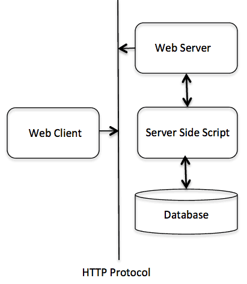

Giao thức HTTP là gì? HTTP còn là 1 giao thức **Yêu cầu – Phản hồi** dựa trên cấu trúc **Client – Server**. Client và Server giao tiếp với nhau bằng cách trao đổi các message độc lập (trái ngược với 1 luồng dữ liệu). Các message được gửi bởi client, thông thường là 1 trình duyệt web, được gọi là các **yêu cầu** và message được gửi bởi server như 1 sự trả lời, được gọi là **phản hồi**.
## 4. Kết nối của HTTP
1 kết nối được kiểm soát tại layer truyền tải, do đó về cơ bản nằm ngoài phạm vi của HTTP. Dù HTTP không yêu cầu giao thức truyền tải cơ bản phải dựa trên sự kết nối, vì chỉ yêu cầu nó đáng tin cậy hoặc không bị mất message (ít nhất là trình báo 1 lỗi). Trong số hai giao thức truyền tải phổ biến nhất trên Internet, TCP thì đáng tin cậy còn UDP thì không. HTTP do đó dựa vào tiêu chuẩn TCP vốn là connection-based (dựa trên sự kết nối).
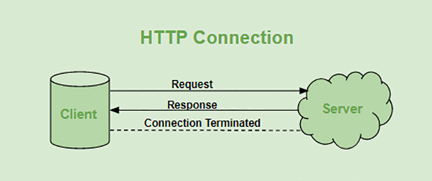

Trước khi 1 client và server có thể trao đổi 1 cặp yêu cầu – phản hồi HTTP, chúng phải thiết lập 1 kết nối TCP, 1 quá trình vốn yêu cầu 1 số vòng lặp. Hoạt động mặc định của HTTP/1.0 là mở 1 kết nối TCP riêng biệt cho từng cặp yêu cầu – phản hồi HTTP. Điều này làm nó kém hiệu quả hơn việc chia sẻ 1 kết nối TCP đơn lẻ khi nhiều yêu cầu được gửi liên tiếp.

Để giảm thiểu lỗ hỏng này, HTTP/1.1 đã giới thiệu pipelining (nhưng được chứng minh là khá khó để thực hiện) và kết nối liên tục: kết nối TCP bên dưới có thể được kiểm soát 1 phần bằng cách sử dụng tiêu đề Connection. HTTP/2 đã tiến 1 bước xa hơn bằng cách ghép các thông báo qua 1 kết nối duy nhất, giúp giữ cho kết nối ổn định và hiệu quả hơn.
## 5. Tóm tắt qua thời kì phát triển của HTTP
- **HTTP/0.9 (1991)** – “one-line protocol”: chỉ có phương thức GET, không có header; dùng để tải một tài liệu HTML rồi đóng kết nối. Rất tối giản và nay đã lỗi thời. 


- **HTTP/1.0 (1996)** – mở rộng phương thức (GET/POST/HEAD), giới thiệu headers, mã trạng thái, loại nội dung… nhưng mỗi yêu cầu thường mở một kết nối riêng. 


- **HTTP/1.1 (1997 → tái chuẩn hoá 2014, 2022)** – trở thành chuẩn rộng rãi: kết nối giữ-nguyên (persistent), chunked transfer, Host header (nhiều site trên cùng IP), cải thiện cache; đặc tả hiện đại hoá trong bộ RFC 9110/9112 (2022). 

- **HTTP/2 (2015)** – thay đổi “dây” truyền: khung nhị phân, multiplexing nhiều luồng trên một kết nối, HPACK header compression, ưu tiên hoá yêu cầu; từng hỗ trợ server push (nay ít dùng). 


- **HTTP/3 (2022)** – mang HTTP lên QUIC (trên UDP): khởi tạo kết nối độ trễ thấp, không nghẽn dòng do HOL ở tầng TCP, di chuyển kết nối khi đổi mạng (Wi-Fi ↔ 4G), QPACK cho header, tích hợp chặt với TLS 1.3/0-RTT.
# Các method trong HTTP


# HTTP Methods — Nền tảng của RESTful APIs

HTTP methods là xương sống của RESTful APIs, giúp việc giao tiếp giữa client (ứng dụng, trình duyệt) và server diễn ra mượt mà.
Dù bạn đang lấy dữ liệu, tạo mới tài nguyên hay xóa bản ghi, việc hiểu rõ các phương thức này là điều thiết yếu để xây dựng API hiệu quả và có khả năng mở rộng (scalable).

## 1. HTTP Methods trong API là gì?

HTTP (Hypertext Transfer Protocol) định nghĩa các hành động chuẩn mà client (như trình duyệt hoặc ứng dụng) sử dụng để tương tác với tài nguyên (resources) trên server.

Trong RESTful API, các phương thức này tương ứng với các thao tác CRUD:

| CRUD Operation | HTTP Method | Chức năng                      |
| -------------- | ----------- | ------------------------------ |
| Create         | POST        | Tạo mới tài nguyên             |
| Read           | GET         | Truy xuất dữ liệu              |
| Update         | PUT         | Cập nhật hoặc thay thế dữ liệu |
| Delete         | DELETE      | Xóa tài nguyên                 |

Ví dụ:

* Khi bạn truy cập một trang web, trình duyệt sẽ gửi GET request để lấy nội dung trang.
* Khi bạn gửi form đăng ký, trình duyệt sẽ gửi POST request để xử lý dữ liệu đó.


## 2. Tại sao HTTP Methods lại quan trọng?

Các phương thức HTTP cung cấp một cách tiêu chuẩn hóa để xác định hành động trong API, giúp API dễ hiểu, dễ bảo trì và mở rộng.
Dưới đây là các lý do chính:


### 2.1 Chuẩn hóa và rõ ràng (Standardization and Clarity)

HTTP methods cung cấp khuôn mẫu thống nhất cho việc định nghĩa hành động.
Ví dụ:

* GET luôn dùng để lấy dữ liệu.
* POST luôn dùng để tạo tài nguyên mới.

Nhờ đó, API trở nên trực quan và dễ làm việc hơn cho các developer.


### 2.2 Quản lý tài nguyên (Resource Management)

Mỗi HTTP method tương ứng với một hành động cụ thể trên tài nguyên:

| Method | Hành động           | Ví dụ                          |
| ------ | ------------------- | ------------------------------ |
| GET    | Lấy tài nguyên      | Lấy thông tin người dùng       |
| POST   | Tạo tài nguyên      | Thêm người dùng mới            |
| PUT    | Cập nhật tài nguyên | Chỉnh sửa thông tin người dùng |
| DELETE | Xóa tài nguyên      | Xóa người dùng khỏi hệ thống   |

Cách mapping rõ ràng này giúp quản lý tài nguyên hiệu quả và giảm mơ hồ trong thiết kế API.


### 2.3 Khả năng mở rộng và bảo trì (Scalability and Maintainability)

Việc sử dụng đúng phương thức HTTP giúp API dễ mở rộng và bảo trì hơn.
Ví dụ:

* Dùng GET cho các thao tác đọc-only → giúp cache hiệu quả hơn.
* Dùng POST cho thao tác ghi → tránh lỗi trùng lặp.

Kết quả là API có thể xử lý lượng truy cập lớn mà không ảnh hưởng đến hiệu năng.


## 3. Cách sử dụng hiệu quả các HTTP Methods trong API

Để xây dựng API mạnh mẽ và đáng tin cậy, bạn cần hiểu rõ cách dùng từng method.
Dưới đây là mô tả chi tiết từng loại:


### 3.1 GET — Retrieve Data (Lấy dữ liệu)

**Mục đích:**
Lấy dữ liệu từ server mà không làm thay đổi tài nguyên.

**Best Practices:**

* Dùng query parameters để lọc, sắp xếp, phân trang:
  `GET /users?page=2&limit=10`
* Không truyền dữ liệu nhạy cảm (mật khẩu, API key) trên URL.
* Đảm bảo idempotent — cùng một request gửi nhiều lần → kết quả giống nhau.

**Ví dụ:**

```
GET /users/123 HTTP/1.1
Host: api.example.com
```

→ Lấy thông tin chi tiết của người dùng có ID 123.


### 3.2 POST — Create or Submit Data (Tạo hoặc gửi dữ liệu)

**Mục đích:**
Tạo tài nguyên mới hoặc gửi dữ liệu đến server.

**Best Practices:**

* Dùng cho các thao tác không idempotent (ví dụ: tạo người dùng mới).
* Xử lý lỗi hợp lệ (ví dụ: 400 Bad Request nếu dữ liệu không hợp lệ).
* Trả về Location header để chỉ định URL của tài nguyên mới được tạo.

**Ví dụ:**

```
POST /users HTTP/1.1
Host: api.example.com
Content-Type: application/json

{
  "name": "John Doe",
  "email": "john.doe@example.com"
}
```

→ Tạo một người dùng mới với thông tin được cung cấp.


### 3.3 PUT — Update or Replace Resource (Cập nhật hoặc thay thế)

**Mục đích:**
Cập nhật hoặc thay thế toàn bộ một tài nguyên hiện có.

**Best Practices:**

* Đảm bảo idempotent — gửi lại cùng request → cùng kết quả.
* Dùng để cập nhật toàn bộ tài nguyên (không chỉ vài trường).
* Trả về 200 OK (nếu có response) hoặc 204 No Content (nếu không trả dữ liệu).

**Ví dụ:**

```
PUT /users/123 HTTP/1.1
Host: api.example.com
Content-Type: application/json

{
  "name": "Jane Doe",
  "email": "jane.doe@example.com"
}
```

→ Cập nhật người dùng có ID 123 với thông tin mới.


### 3.3 DELETE — Remove Resource (Xóa tài nguyên)

**Mục đích:**
Xóa một tài nguyên khỏi server.

**Best Practices:**

* Xử lý xóa an toàn — trả về 404 Not Found nếu tài nguyên không tồn tại.
* Đảm bảo idempotent — xóa nhiều lần vẫn cho cùng kết quả.
* Trả về 204 No Content khi xóa thành công.

**Ví dụ:**

```
DELETE /users/123 HTTP/1.1
Host: api.example.com
```

→ Xóa người dùng có ID 123.


## Tóm tắt nhanh

| Method | CRUD   | Mục đích         | Idempotent | Ví dụ             |
| ------ | ------ | ---------------- | ---------- | ----------------- |
| GET    | Read   | Lấy dữ liệu      | Có         | `GET /users/1`    |
| POST   | Create | Tạo dữ liệu mới  | Không      | `POST /users`     |
| PUT    | Update | Cập nhật toàn bộ | Có         | `PUT /users/1`    |
| DELETE | Delete | Xóa dữ liệu      | Có         | `DELETE /users/1` |


# Response là gì, Request là gì ?
## 1. HTTP Request
Để bắt đầu trao đổi dữ liệu, phía client khởi tạo một HTTP session bằng cách mở một kết nối TCP đến HTTP server sau đó gửi request đến server này. Request có thể được tạo bằng nhiều cách, trực tiếp khi người dùng nhấp vào một liên kết trên trình duyệt hoặc gián tiếp.
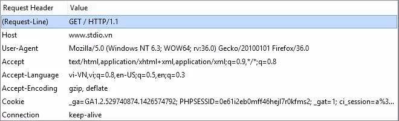

### 1.1 Request-Line
Bắt đầu của HTTP Request sẽ là dòng **Request-Line** bao gồm 3 thông tin đó là:
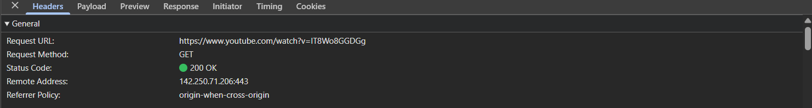
- `Method`: là phương thức mà HTTP Request này sử dụng, thường là GET, POST, ngoài ra còn một số phương thức khác như HEAD, PUT, DELETE, OPTION, CONNECT. Trong ví dụ trên là GET
- `URI`: là địa chỉ định danh của tài nguyên. Trong tường hợp này URI là / - tức request cho tài nguyên gốc, nếu request không yêu cầu một tài nguyên cụ thể, URI có thể là dấu *.
- `HTTP version`: là phiên bản HTTP đang sử dụng, ở đây là HTTP 1.1.
### 1.2 Request-header
Tiếp theo là các trường **request-header**, cho phép client gửi thêm các thông tin bổ sung về thông điệp HTTP request và về chính client. Một số trường thông dụng như:
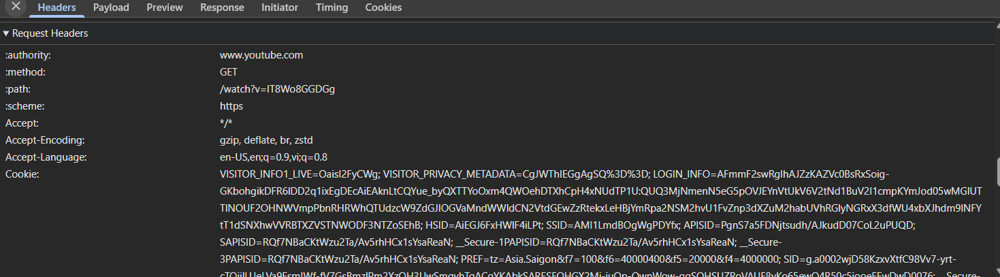
- `Accept`: loại nội dung có thể nhận được từ thông điệp response. Ví dụ: text/plain, text/html…
- `Accept-Encoding`: các kiểu nén được chấp nhận. Ví dụ: gzip, deflate, xz, exi…
- `Connection`: tùy chọn điều khiển cho kết nối hiện thời. Ví dụ: keep-alive, Upgrade…
- `Cookie`: thông tin HTTP Cookie từ server.
- `User-Agent`: thông tin về user agent của người dùng.
### 1.3 Request-body
Cho phép client gừi đến yêu cầu bổ sung cần server thực hiện như: tạo mới hoặc cập nhật dữ liệu mà không thể truyền trên Header Parameters.

Request body thường được sử dụng trong các phương thức **Post**, **Put**, **Patch**.
## 2. HTTP Respone
Cấu trúc HTTP response gần giống với HTTP request, chỉ khác nhau là thay vì Request-Line, thì HTTP có response có Status-Line. Và giống như Request-Line, Status-Line cũng có ba phần như sau:

- **HTTP-versio**n: phiên bản HTTP cao nhất mà server hỗ trợ.
- **Status-Code**: mã kết quả trả về.
- **Reason-Phrase**: mô tả về Status-Code.
### 2.1 HTTP Status Codes
Một số loại Status-Code thông dụng mà server trả về cho client như sau:

**1xx: information Message**: các status code này chỉ có tính chất tạm thời, client có thể không quan tâm.

**2xx Successful**: khi đã xử lý thành công request của client, server trả về status dạng này:

- 200 OK: request thành công.
- 202 Accepted: request đã được nhận, nhưng không có kết - quả nào trả về, thông báo cho client tiếp tục chờ đợi.
- 204 No Content: request đã được xử lý nhưng không có - thành phần nào được trả về.
- 205 Reset: giống như 204 nhưng mã này còn yêu câu client - reset lại document view.
- 206 Partial Content: server chỉ gửi về một phần dữ liệu, - phụ thuộc vào giá trị range header của client đã gửi.
- 3xx Redirection: server thông báo cho client phải thực - hiện thêm thao tác để hoàn tất request:

- 301 Moved Permanently: tài nguyên đã được chuyển hoàn - toàn tới địa chỉ Location trong HTTP response.
- 303 See other: tài nguyên đã được chuyển tạm thời tới địa - chỉ Location trong HTTP response.
- 304 Not Modified: tài nguyên không thay đổi từ lần cuối - client request, nên client có thể sử dụng đã lưu trong - cache.

**4xx Client error**: lỗi của client:
 
- 400 Bad Request: request không đúng dạng, cú pháp.
- 401 Unauthorized: client chưa xác thực.
- 403 Forbidden: client không có quyền truy cập.
- 404 Not Found: không tìm thấy tài nguyên.
- 405 Method Not Allowed: phương thức không được server hỗ - trợ.

**5xx Server Error**: lỗi của server:
 
- 500 Internal Server Error: có lỗi trong quá trình xử lý - của server.
- 501 Not Implemented: server không hỗ trợ chức năng client - yêu cầu.
- 503: Service Unavailable: Server bị quá tải, hoặc bị lỗi xử lý.

# API là gì, RestAPI là gì ?
## 1. REST API là gì ?
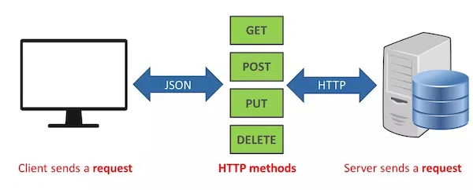
**REST API** (còn được biết với tên gọi **RESTful API**) là một giao diện lập trình ứng dụng (**API**) tuân thủ các ràng buộc và quy ước kiến trúc **REST** được sử dụng trong việc giao tiếp giữa client và server. **REST** là viết tắt của **RE**presentational **S**tate **T**ransfer, nó được tạo ra bởi nhà khoa học máy tính **Roy Fielding**.

**REST API** thường vẫn sử dụng giao thức **HTTP/1** kèm theo các định nghĩa trước đó mà cả client và server cần tuân thủ.

Hiện tại, các REST API dùng **JSON** rất phổ biến. Một ít có thể vẫn còn dùng **XML**.
### 1.1 Hai thành phần trong RESTful API
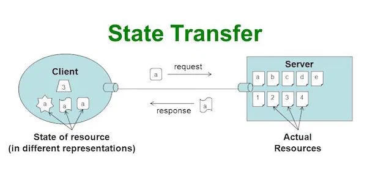

**REST** (**RE**presentational **S**tate **T**ransfer) là một đại diện cho sự chuyển đổi dữ liệu. Trong kiến trúc này client và server **hoàn toàn độc lập**, chúng không biết gì về nhau. Mỗi một request REST API đều không mang theo trạng thái trước đó (**stateless**).

Như vậy để đôi bên trao đổi **state**, chúng sẽ phải thông qua các **resources**. Các resource này chính là phần đại diện cho sự thay đổi dữ liệu.

API (Application Programming Interface) là giao diện lập trình ứng dụng. Giao diện này không dành cho người dùng cuối mà dành cho các nhà phát triển (developer).

## 2. Request và Response trong REST API
### 2.1 Methods: Phương thức
Như đã đề cập ở trên, để trao đổi state chúng sẽ cần giao tiếp resource thông qua việc gởi các request response thông qua HTTP/1. Cụ thể việc giao tiếp này là thế nào thì chúng cần chỉ định các method tương ứng bao gồm:

- **GET**: Trả về một Resource hoặc một danh sách Resource.
- **POST**: Tạo mới một Resource.
- **PUT**: Cập nhật thông tin cho Resource (toàn bộ resource).
- **PATCH**: Cật nhật thông tin cho resourse (một phần - resource).
- **DELETE**: Xoá một Resource.

Nếu bạn từng nghe qua **CRUD** APIs thì chúng đại diện cho - **C**reate, **R**ead, **U**pdate và **D**elete một resource nào đó.

### 2.2 Header: Authentication và quy định kiểu dữ liệu trả về
Hãy nhớ rằng REST API là **stateless**. Mỗi một request không hề biết bất kỳ thông tin gì trước đó. Khác với khi chúng ta truy cập web, trình duyệt sẽ có session và cookie để hỗ trợ phân biệt request đấy là của ai, thông tin trước đó là gì.

Trong REST, nếu một request cần xác thực quyền truy cập, chúng sẽ phải dùng thêm thông tin trong header. Ví dụ như thông tin **Authorization** sẽ mang theo một user token. Hiện có 3 cơ chế Authentication chính:

- HTTP Basic
- JSON Web Token (JWT)
- OAuth2
Ngoài ra Header còn giúp client chỉ định được loại content cần trả về từ server – content type. Việc này được thực hiện thông qua phần Accept trong header. Giá trị của nó thường là **MIME** type:

- image — image/png, image/jpeg, image/gif
- audio — audio/wav, audio/mpeg
- video — video/mp4, video/ogg
- application — application/json, application/pdf, - application/xml, application/octet-stream
Ví dụ request lấy danh sách bài viết:
```js
GET /v1/posts
Accept: application/json
```

### 2.3  Status Code trong RESTful API
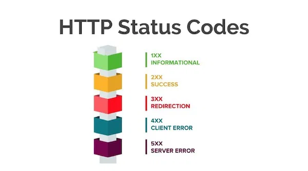

Một số status phổ biến:

- **200 OK** – Trả về thành công cho những phương thức GET, PUT, PATCH hoặc DELETE.
- **201 Created** – Trả về khi một Resouce vừa được tạo thành công.
- **204 No Content** – Trả về khi Resource xoá thành công.
- **304 Not Modified** – Client có thể sử dụng dữ liệu cache, resource server không đổi gì.
- **400 Bad Request** – Request không hợp lệ
- **401 Unauthorized** – Request cần có xác thực.
- **403 Forbidden** – bị từ chối không cho phép.
- **404 Not Found** – Không tìm thấy resource từ URI
- **405 Method Not Allowed** – Phương thức không cho phép với user hiện tại.
- **410 Gone** – Resource không còn tồn tại, Version cũ đã không còn hỗ trợ.
- **415 Unsupported Media Type** – Không hỗ trợ kiểu Resource này.
- **422 Unprocessable Entity** – Dữ liệu không được xác thực
- **429 Too Many Requests** – Request bị từ chối do bị giới hạn
### 2.4 Hỗ trợ version của REST API
Thông thường REST API sẽ có version như **/v1**, **/v2** để hỗ trợ các phiên bản dữ liệu cũ hơn. Việc này đặc biệt quan trọng khi chúng ta nâng cấp API lên các version cao hơn, sự nâng cấp này có thể khác biệt rất to lớn: thay đổi URL, cách thức xác thực người dùng hoặc cả resource name và cấu trúc của nó.

## 3. Cách thiết kế REST API theo convention
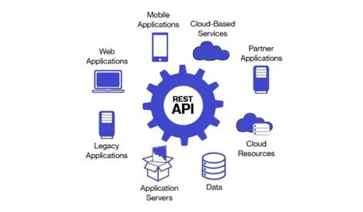

Mặc dù các ràng buộc và quy ước trên các nhà phát triển không cần tuân thủ. Tuy nhiên nếu làm “đúng”, chúng sẽ mang lại rất nhiều lợi ích.

### 3.1 Thiết kế REST API URI
Mình đã từng thấy rất nhiều REST API thiết kế viết đại khái như sau:

```Bash

POST /create_post (tạo bài viết)
GET /list_posts (lấy danh sách bài viết)
POST /feature_posts (danh sách bài viết nổi bật)
POST /edit_post/:post_id (edit bài viết với post_id)
```
Các **REST API** chưa được thiết kế tốt cho lắm
Những REST API này vẫn hoạt động tốt, không vấn đề gì cả!! Có điều chúng không theo **convention** mà thôi.

Việc này dẫn đến một rắc rối cho người làm document (hoặc chính người thiết kế ra) phải rà soát lại cái URL có chính xác không. Phía sử dụng API cũng phải thiết lập một danh sách API đúng như vậy luôn.

***Các bạn hãy so sánh với thiết kế URL như sau:***
```Bash
POST /v1/posts (tạo mới một bài viết)
GET /v1/posts (lấy danh sách bài viết)
GET /v1/posts/:post_id (lấy chi tiết bài viết với post_id cụ thể)
PUT /v1/posts/:post_id (update bài viết với post_id cụ thể)
DELETE /posts/:post_id (delete bài viết với post_id cụ thể)
```

Cách thiết kế này các bạn sẽ thấy rằng có một nguyên tắc rất rõ ràng sử dụng các method request để nói lên được nhiệm vụ của API. Phần URI có thể giống nhau, không cần cứ phải chứa các động từ như: create, get, update, delete nữa. Resource name sẽ ở dạng số nhiều (plural).

***Một số ví dụ khác:***
```Bash

GET /v1/posts/:post_id/liked-users (lấy danh sách user đã like bài viết với post_id cụ thể)
POST /v1/posts/:post_id/liked-users (like bài viết với post_id cụ thể)
GET /v1/posts?page=2&limit=50 (hãy dùng query string để filter hoặc phân trang nhé)
```
### 3.2 Các quy ước khác bạn cần chú ý
- Sử dụng đúng **Status Code**. Nếu API trả về lỗi, các bạn hãy dùng đúng status nhé, tránh luôn trả về status 2xx khi mà trong body là error message (cái này nhiều bạn đang làm sai lắm).
- Đừng dùng **underscore (_)**, hãy dùng **hyphen (-)** trong URI
- Trong URI đều là chữ viết thường (**lowercase**)
- Đừng nên sử dụng đuôi file (**extension**) trong URI (VD: .html, .xml, .json).

Chi tiết toàn bộ convention REST API: https://restfulapi.net/resource-naming
# Design pattern : DI, IOC
## 1. DI


### 1.1 Quản lý phụ thuộc hiệu quả (Effective Dependency Management)

Quản lý phụ thuộc hiệu quả là yếu tố thiết yếu để xây dựng các hệ thống có khả năng mở rộng và dễ bảo trì. Mẫu thiết kế **Dependency Injection (DI)** là một trong những chiến lược đã trở nên rất phổ biến. Về cơ bản, **Dependency Injection** là một phương pháp xử lý cách các thành phần (components) hoặc đối tượng (objects) được tạo ra và cách chúng nhận các phụ thuộc cần thiết để hoạt động đúng.

### 1.2 Dependency Injection Design Pattern là gì?

Trong lập trình hướng đối tượng, **Dependency Injection (DI)** là một kỹ thuật giúp giảm sự phụ thuộc chặt chẽ giữa các thành phần của hệ thống, khiến mã trở nên **modular (mô-đun hóa), dễ kiểm thử và dễ bảo trì** hơn.  
Trong các chương trình thông thường, các lớp thường phụ thuộc vào những lớp khác để thực hiện chức năng của mình.

**Ví dụ:**  
Lớp `Car` có thể phụ thuộc vào lớp `Engine` để hoạt động.  
Nếu không có DI, lớp `Car` sẽ tự tạo hoặc quản lý đối tượng `Engine` bên trong mã của nó, khiến hai lớp bị **ràng buộc chặt chẽ** (tightly coupled).  
Điều này gây khó khăn khi cần kiểm thử, mở rộng hoặc chỉnh sửa trong tương lai.

**Dependency Injection** giải quyết vấn đề này bằng cách **"tiêm" (inject)** các phụ thuộc (như `Engine` trong ví dụ `Car`) từ bên ngoài vào, thay vì để lớp tự tạo ra chúng.

Nói đơn giản hơn: DI cho phép bạn **truyền vào (inject)** những gì một lớp cần (các dependency) từ bên ngoài, thay vì để chính lớp đó tự quản lý.

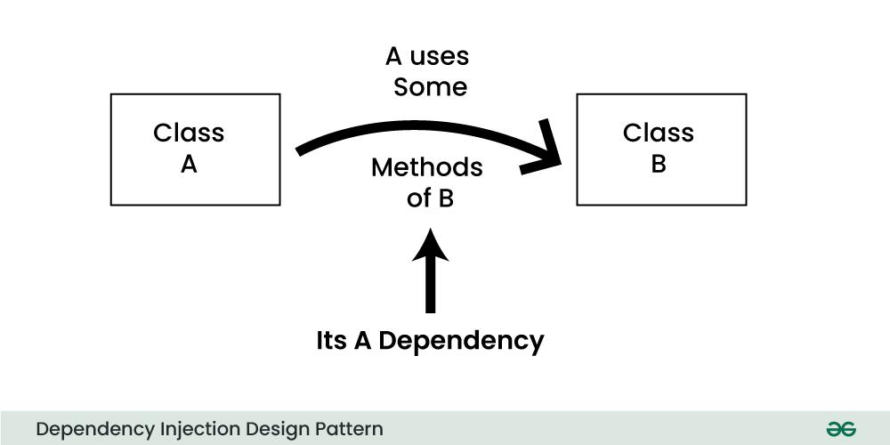

### 1.3 Bốn vai trò của Dependency Injection

Trong DI, các phụ thuộc của một lớp được cung cấp từ bên ngoài, thay vì lớp đó tự tạo hoặc quản lý chúng bên trong.  
Mẫu thiết kế này có **4 vai trò chính**:
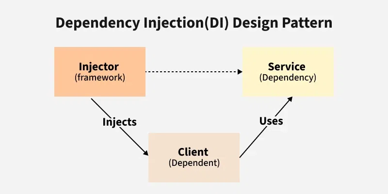
#### 1️⃣ Client  
- Là thành phần hoặc lớp **phụ thuộc vào** các dịch vụ (services) do lớp khác cung cấp.  
- Client **không tự cung cấp** phụ thuộc, mà **nhận chúng từ Injector**.

#### 2️⃣ Service  
- Là lớp hoặc thành phần **cung cấp chức năng cụ thể** mà Client cần.  
- Nó tập trung vào việc cung cấp chức năng riêng và **độc lập với Client**.

####  3️⃣ Injector  
- **Tạo và cung cấp** (inject) các instance của Service vào Client.  
- **Hiểu rõ các phụ thuộc** của Client và cung cấp các service cần thiết trong runtime.

####  4️⃣ Interface  
- **Định nghĩa hợp đồng (contract)** hoặc tập phương thức mà Service phải thực hiện.  
- Client **phụ thuộc vào interface**, không phụ thuộc vào implementation cụ thể → giúp linh hoạt hơn.


### 1.4 Khi nào nên dùng Dependency Injection Design Pattern?

Các trường hợp nên áp dụng DI:

- **Giảm liên kết (Loose Coupling) & Tái sử dụng (Reusability):**  
  Các đối tượng không tự tạo phụ thuộc của mình, giúp giảm sự gắn kết và tăng tính độc lập.

- **Dễ kiểm thử (Testability):**  
  Có thể **inject các mock/test doubles**, giúp kiểm thử từng phần độc lập mà không cần phụ thuộc vào hệ thống bên ngoài.

- **Dễ bảo trì & linh hoạt (Maintainability & Flexibility):**  
  Framework DI giúp quản lý phụ thuộc, theo dõi và cấu hình dễ dàng hơn.

- **Mở rộng dễ dàng (Scalability & Extensibility):**  
  Trong ứng dụng lớn, DI giúp quản lý đồ thị phụ thuộc phức tạp.

- **Các chức năng cắt ngang (Cross-Cutting Concerns):**  
  Có thể inject các service như logging, bảo mật, cache,... để tránh lặp mã và thống nhất cách triển khai.


### 1.5 Khi nào **không nên** dùng Dependency Injection Design Pattern?

Không nên áp dụng DI trong các trường hợp sau:

- **Ứng dụng nhỏ, đơn giản:** DI có thể làm phức tạp hóa không cần thiết.  
- **Hiệu năng:** Framework DI có thể tạo overhead, ảnh hưởng đến tốc độ.  
- **Ít phụ thuộc:** Nếu chỉ có vài dependency đơn giản, tự inject thủ công có thể đơn giản hơn.  
- **Hệ thống cũ (Legacy):** Việc refactor sang DI có thể tốn thời gian và rủi ro.  
- **Không cần linh hoạt:** Nếu phụ thuộc hầu như không thay đổi, DI là dư thừa.

---

### 1.6. Ví dụ về Dependency Injection Design Pattern

Giả sử bạn xây dựng một hệ thống gửi thông báo cho người dùng (email, SMS,...).  
Bạn muốn có khả năng thay đổi nhà cung cấp dịch vụ mà không cần sửa logic chính.

#### ❌ Mã **không sử dụng DI:**

```java
public class NotificationService {
    private EmailProvider emailProvider = new EmailProvider(); // Tightly coupled to email

    public void sendNotification(String message, String recipient) {
        emailProvider.sendEmail(message, recipient);
    }
}
```

**Vấn đề:**
- **Liên kết chặt chẽ:** `NotificationService` bị ràng buộc với `EmailProvider`.  
- **Khó kiểm thử:** Không thể test độc lập `NotificationService`.

---

#### ✅ Mã **sử dụng DI:**

```java
// Interface for different notification providers
public interface NotificationProvider {
    void sendNotification(String message, String recipient);
}

// Concrete implementations
public class EmailProvider implements NotificationProvider {
    @Override
    public void sendNotification(String message, String recipient) {
        // Send email logic
    }
}

public class SMSProvider implements NotificationProvider {
    @Override
    public void sendNotification(String message, String recipient) {
        // Send SMS logic
    }
}

// Refactored NotificationService with dependency injection
public class NotificationService {
    private NotificationProvider notificationProvider;

    public NotificationService(NotificationProvider notificationProvider) { // Inject dependency
        this.notificationProvider = notificationProvider;
    }

    public void sendNotification(String message, String recipient) {
        notificationProvider.sendNotification(message, recipient);
    }
}
```

**Lợi ích:**
- **Giảm liên kết:** Không phụ thuộc vào `EmailProvider`.  
- **Dễ kiểm thử:** Có thể inject các mock provider.  
- **Linh hoạt:** Dễ thay đổi provider tại runtime.  
- **Dễ bảo trì:** Code rõ ràng, tách biệt phụ thuộc.

---

### 1.7 Các loại Dependency Injection

Có **3 loại DI chính**:

| Loại | Mô tả |
|------|--------|
| **Constructor Injection** | Tiêm phụ thuộc thông qua constructor |
| **Setter Injection** | Tiêm phụ thuộc thông qua setter method |
| **Interface Injection** | Tiêm phụ thuộc qua interface riêng biệt |


#### 🔹 1.7.1 Constructor Injection

```java
class Engine {
    public void start() {
        System.out.println("Engine started");
    }
}

class Car {
    private Engine engine;

    public Car(Engine engine) { // Constructor Injection
        this.engine = engine;
    }

    public void drive() {
        engine.start();
        System.out.println("Car is driving");
    }
}

public class Main {
    public static void main(String[] args) {
        Engine engine = new Engine();
        Car car = new Car(engine);
        car.drive();
    }
}
```

**Kết quả:**
```
Engine started
Car is driving
```


### 🔹 1.7.2 Setter Injection

```java
class Car {
    private Engine engine;

    public void setEngine(Engine engine) { // Setter Injection
        this.engine = engine;
    }

    public void drive() {
        engine.start();
        System.out.println("Car is driving");
    }
}
```

**Ưu điểm:** Linh hoạt — có thể thay đổi dependency sau khi tạo object.


### 🔹 1.7.3 Interface Injection

```java
interface EngineInjector {
    void injectEngine(Engine engine);
}

class Car implements EngineInjector {
    private Engine engine;

    @Override
    public void injectEngine(Engine engine) {
        this.engine = engine;
    }

    public void drive() {
        engine.start();
        System.out.println("Car is driving");
    }
}
```

**Ưu điểm:** Giúp tách biệt và linh hoạt, nhưng ít dùng hơn trong Java.

---

### 1.8 Lợi ích của Dependency Injection Design Pattern

- **Tăng tính mô-đun (Modularity) và bảo trì (Maintainability)**  
- **Cải thiện khả năng kiểm thử (Testability)**  
- **Giảm sự phụ thuộc chặt chẽ (Loose Coupling)**  
- **Tăng khả năng tái sử dụng (Reusability)**  
- **Hợp tác dễ hơn (Collaboration):** Lập trình viên tập trung vào logic chính, không lo phụ thuộc.


### 1.9. Thách thức khi sử dụng Dependency Injection

- **Tăng độ phức tạp:** Đặc biệt với dự án nhỏ.  
- **Lỗi runtime:** Nếu cấu hình DI sai.  
- **Hiệu năng:** Framework DI có thể tạo overhead.  
- **Khó kiểm thử cấu hình DI:** Việc test chính hệ thống DI phức tạp hơn so với code gắn kết chặt.


👉 Tóm lại, **Dependency Injection** là một kỹ thuật cực kỳ mạnh giúp tách biệt các phần của hệ thống, làm cho mã dễ hiểu, dễ bảo trì và dễ kiểm thử — nhưng cũng cần được áp dụng đúng ngữ cảnh để tránh phức tạp không cần thiết.

## 2. IOC(Inversion of Control)
### 2.1 Giới thiệu
**Spring IoC Container** là **lõi (core)** của **Spring Framework**.
Nó có nhiệm vụ **tạo và quản lý các đối tượng (beans)**, **tiêm (inject) các dependency**, và **quản lý vòng đời (lifecycle)** của chúng.

Spring IoC sử dụng **Dependency Injection (DI)** dựa trên cấu hình từ:

* **Tệp XML**,
* **Cấu hình Java-based**,
* **Annotations**,
* hoặc **POJO (Plain Old Java Object)**.

Vì **container**, chứ **không phải lập trình viên**, chịu trách nhiệm tạo và liên kết các đối tượng, nên cơ chế này được gọi là **Inversion of Control (IoC)** – tức là “Đảo ngược quyền điều khiển”.


### 2.2 Types of IoC Containers (Các loại IoC Container)

Spring cung cấp **hai loại IoC Container** chính:

1. **BeanFactory**
2. **ApplicationContext**


#### 1️⃣ BeanFactory

* Là **phiên bản cơ bản nhất** của IoC Container.
* Cung cấp các chức năng **cơ bản** như Dependency Injection và quản lý vòng đời của Bean.
* Phù hợp cho **ứng dụng nhẹ (lightweight)**, không yêu cầu các tính năng nâng cao.


#### 2️⃣ ApplicationContext

* Là **mở rộng của BeanFactory**, bổ sung thêm nhiều tính năng hướng doanh nghiệp như:

  * Truyền sự kiện (**Event propagation**)
  * Quốc tế hóa (**Internationalization**)
  * Hỗ trợ tích hợp với Spring AOP, MessageSource, Resource loading, v.v.
* Là **lựa chọn được khuyến nghị** cho hầu hết các ứng dụng Spring hiện nay vì có **nhiều khả năng nâng cao hơn**.


### 2.3 🔑 Key Features of IoC Container (Các tính năng chính của IoC Container)

| Tính năng                     | Mô tả                                                                                                                |
| ----------------------------- | -------------------------------------------------------------------------------------------------------------------- |
| **Dependency Injection (DI)** | Tự động inject các dependency vào class của chúng ta.                                                                |
| **Lifecycle Management**      | Quản lý toàn bộ vòng đời của bean: từ khởi tạo, khởi động, đến hủy.                                                  |
| **Configuration Flexibility** | Hỗ trợ cấu hình bằng **XML** hoặc **Annotation**.                                                                    |
| **Loose Coupling**            | Giúp giảm liên kết chặt giữa các thành phần — tách biệt việc **triển khai (implementation)** và **sử dụng (usage)**. |

---

## 3. So sánh Spring IoC và Spring DI
| **Spring IoC (Inversion of Control)**                                                                                                                                                                                               | **Spring Dependency Injection (DI)**                                                                                                                                                 |
| ----------------------------------------------------------------------------------------------------------------------------------------------------------------------------------------------------------------------------------- | ------------------------------------------------------------------------------------------------------------------------------------------------------------------------------------ |
| **Spring IoC Container** là **lõi (core)** của **Spring Framework**. Nó chịu trách nhiệm **tạo các đối tượng (beans)**, **cấu hình và liên kết (assemble) các dependency**, và **quản lý toàn bộ vòng đời (life cycle)** của chúng. | **Spring Dependency Injection (DI)** là **cơ chế tiêm phụ thuộc** cho các thành phần của framework thông qua hai hình thức chính: **Constructor Injection** và **Setter Injection**. |
| Spring giúp **tạo và quản lý đối tượng, cấu hình, và liên kết** nhờ vào nguyên lý **IoC (Inversion of Control)**.                                                                                                                   | Spring Framework giúp **xây dựng các ứng dụng có liên kết lỏng lẻo (loosely-coupled)** nhờ sử dụng **Dependency Injection**.                                                         |
| **Spring IoC được thực hiện thông qua Dependency Injection.**                                                                                                                                                                       | **Dependency Injection** là **phương thức** để cung cấp các dependency — còn **Inversion of Control** là **kết quả đạt được** sau khi áp dụng Dependency Injection.                  |
| **IoC** là một **nguyên lý thiết kế (design principle)** trong đó **dòng điều khiển (control flow)** của chương trình được **đảo ngược** — từ developer sang framework.                                                             | **Dependency Injection** là **một kiểu triển khai cụ thể** của nguyên lý **Inversion of Control**.                                                                                   |
| **Aspect-Oriented Programming (AOP)** cũng là **một cách khác** để triển khai **Inversion of Control**.                                                                                                                             | Khi **yêu cầu nghiệp vụ thay đổi**, **không cần chỉnh sửa mã nguồn** — chỉ cần thay đổi cấu hình hoặc inject dependency khác.                                                        |


✅ **Tóm lại:**

* **IoC** là **nguyên lý (principle)** — “framework kiểm soát thay vì lập trình viên”.
* **DI** là **cách thức (mechanism)** — “framework tự động cung cấp dependency cho object”.
  Nói cách khác, **Dependency Injection là cách mà Spring thực hiện nguyên lý Inversion of Control.**
