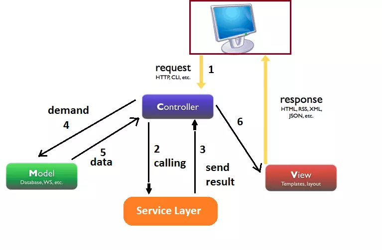
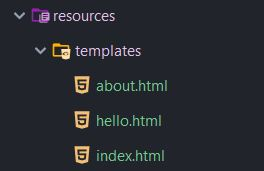
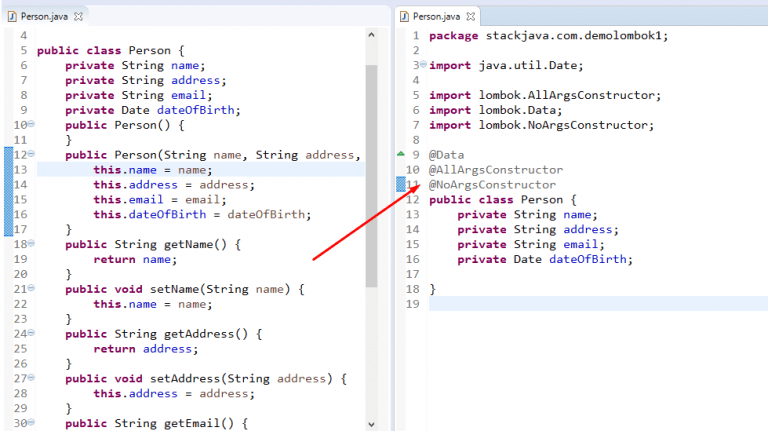
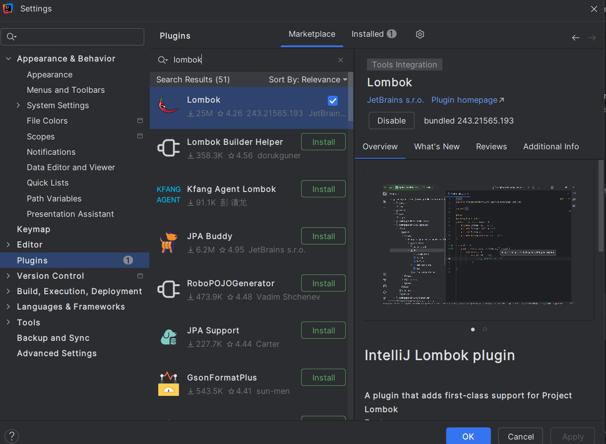
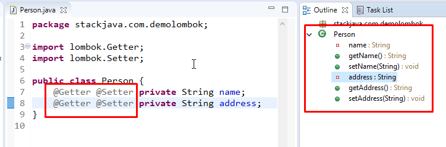
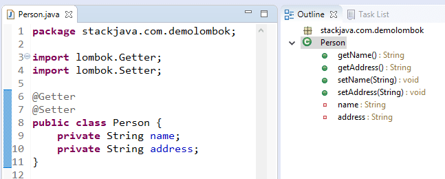
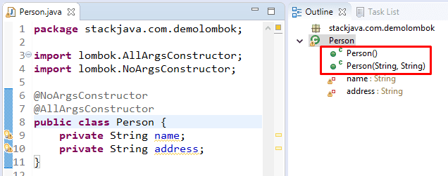
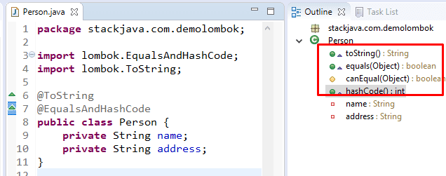
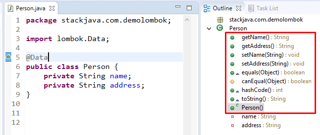

# [KHÓA SPRING BOOT CƠ BẢN]
# [BUỔI 2] SPRING MVC
# Nội dung cần chuẩn bị.
# Khởi tạo dự án SpringBoot
## Spring 
# Bean trong SpringBoot: Bean là gì, BeanFactory là gì, vòng đời của 1 Bean ở trong SpringBoot
## 1. Bean là gì
Trong documentation của Spring framework, thì **bean** được định nghĩa như sau:
>In Spring, the objects that form the backbone of your application and that are managed by the Spring IoC container are called beans. A bean is an object that is instantiated, assembled, and otherwise managed by a Spring IoC container.

Nói một cách đơn giản, bean là những module chính của chương trình, được tạo ra và quản lý bởi Spring IoC container.
### 1.1 Cách tạo bean
1. Dùng **@Component**, **@Repository**, **@Service**, **@Controller**

2. Dùng **@Bean** trong class có annotation **@Configuration**

- **@Configuration**:

    - Là một Annotation đánh dấu trên một class, cho biết rằng class đó chứa các thông tin cấu hình cho ứng dụng.

    - Spring Boot sẽ tìm và quét các class được đánh dấu **@Configuration** để tạo và quản lý các beans.

**@Bean**:

Là một Annotation đánh dấu trên một method trong class được đánh dấu **@Configuration**.

Nó cho biết rằng method đó tạo và trả về một bean, và Spring Boot nên quản lý bean đó trong ứng dụng.
- Cách 1:
```java
@Component
public class EmailService implements MessageService {
    @Override
    public void sendMessage(String message){
        System.out.println("Email send:" + message);
    }
}
```
- Cách 2:
```java
@Configuration
public class AppConfig {

    @Bean
    public Boy boy(){
        return new Boy();
    }

    @Bean
    public ObjectMapper objectMapper(){
        return new ObjectMapper();
    }
}
```
## 2. BeanFaBeanFactory là gì
`BeanFactory` là interface gốc trong Spring để quản lý **IoC container** (Inversion of Control container).
Nó chịu trách nhiệm tạo, quản lý, và cung cấp (**inject**) các **bean**.

```java
BeanFactory factory = new XmlBeanFactory(new ClassPathResource("beans.xml"));
MyService service = (MyService) factory.getBean("myService");
```
- **BeanFactory** chỉ cung cấp những chức năng cơ bản nhất: tạo bean, quản lý scope, dependency injection.

- Nhưng nó thiếu nhiều tính năng cao cấp mà ứng dụng Spring hiện nay cần (như internationalization, event handling, AOP...).
### 2.1 ApplicationContext
`ApplicationContext` mở rộng `BeanFactory`, tức là bao gồm toàn bộ chức năng của `BeanFactory` + thêm nhiều tính năng nâng cao như:
| Tính năng                              | Có trong `BeanFactory` | Có trong `ApplicationContext` |
| -------------------------------------- | ---------------------- | ----------------------------- |
| Dependency Injection cơ bản            | ✅                      | ✅                             |
| Bean lifecycle management              | ✅                      | ✅                             |
| Internationalization (i18n)            | ❌                      | ✅                             |
| Event publication                      | ❌                      | ✅                             |
| Bean auto-detection (`@ComponentScan`) | ❌                      | ✅                             |
| Integration với Spring AOP             | ❌                      | ✅                             |

- Cách dùng
```java
//Khởi tạo bean
@Component
public class EmailService implements MessageService {
    @Override
    public void sendMessage(String message){
        System.out.println("Email send:" + message);
    }
}
```
```java
@SpringBootApplication
public class NhapMonSpingbootApplication {

	public static void main(String[] args) {
        //Khởi tạo context quản lý bean
		ApplicationContext context =  SpringApplication.run(NhapMonSpingbootApplication.class, args);
		EmailService emailService = context.getBean(EmailService.class);
		emailService.sendMessage("abc");
	}
}
```

Như ở ví dụ trên ta đã tạo 1 ApplicationContext để quản lý các bean(Được khởi tạo bằng @Component) do đó ta không cần khởi tạo đối tượng mới khi dùng mà trực tiếp lấy ra từ IOC container
## 3. Vòng đời của 1 Bean ở trong SpringBoot
Vòng đời (life cycle) của bean được hiểu là từ khi bean được tạo ra cho tới khi chết đi, sẽ có những sự kiện (event) khác nhau xảy ra. Về vòng đời của bean có thể mô tả bởi sơ đồ sau.


Nhìn có vẻ dài và khó hiểu, nhưng đại loại sẽ gồm các bước sau:

- IoC container tạo bean bằng cách gọi constructor (có thể inject các bean dependency vào đây)
- Gọi các setter method để inject các bean vào bằng setter based injection
- Các method khởi tạo khác được gọi (không cần quan tâm nhiều)
- `@PostConstructor` được gọi
- Init method được gọi

Sau đó bean sẽ sẵn sàng hoạt động. Nếu sau đó bean không dùng nữa thì nó sẽ được hủy:

- Gọi @PreDestroy
- Hủy bean như các object thông thường
### 3.1 @PostConstructor và @PreDestroy
Đây là hai event khá quan trọng với bean, bạn có thể hook một method vào đó để thực thi khi event xảy ra:

- `@PostConstruct` là sau khi bean đã khởi tạo xong
- `@PreDestroy` là trước khi bean bị phá hủy
Chúng ta dùng hai annotation trên đánh dấu lên method nào đó, method đó sẽ được tự động gọi khi sự kiện bean xảy ra.
```java
class Car {
    @Autowired
    private final Engine engine;
    
    @PostConstruct
    public void testRun() {
        engine.run();
        engine.stop();
    }
    
    @PreDestroy
    public void stopEngine() {
        engine.stop();
    }
}
```
Như code ví dụ trên, mình gắn `@PostConstruct` cho method `testRun()`. Method này được gọi khi bean `Car` được tạo ra và khởi tạo hoàn chỉnh. Và trước khi `Car` bị phá hủy, thì cần gọi `stopEngine` tương tự như trên.

Dùng trong thực tế thì hai annotation trên làm các nhiệm vụ như:

- `@PostConstruct` dùng để thực hiện một số task khi khởi tạo bean
- `@PreDestroy `thực hiện các task để dọn dẹp bean sau khi dùng xong
### 3.2 2. Các loại bean
Nói đúng hơn thì gọi là các scope, phân loại dựa trên số lượng bean được tạo ra. Bean gồm có 5 scope:

- Singleton (mặc định): IoC container chỉ tạo đúng duy nhất 1 object từ class bean này
- Prototype: return một bean object riêng biệt cho mỗi lần sử dụng.
- Request: tạo mỗi bean cho mỗi request
- Session: tạo mỗi bean cho mỗi session
- Global session: tạo mỗi bean cho mỗi global session (cái này không hiểu lắm)
- Trong 5 scope trên chúng ta chỉ quan tâm tới hai scope đầu. Thường thì các bạn sẽ ít đụng tới prototype bean, nhưng mình cũng viết ra tại đây luôn.

Đối với singleton bean thì khỏi cần đánh dấu gì hết, nó là mặc định rồi. Còn nếu muốn chỉ định một class là prototype bean thì dùng `@Scope` như sau.
```java
@Component
@Scope("prototype")
class PrototypeBean {
    ...
}
```
Nói rõ hơn về prototype bean, ví dụ bean X được sử dụng bởi hai bean khác là A, B:

- Nếu X là singleton bean, thì chỉ có một object X được tạo ra. A và B dùng chung X.
- Nếu X là prototype bean, thì có 2 X được tạo ra cho 2 bean khác sử dụng là X cho A và X cho B.
# String MVC : @Controller, Thymeleaf
## 1. @Controller
Để xây dựng một trang web với Spring Boot, bạn sẽ cần tuân theo quy trình như hình dưới đây:


`@Controller` là nơi tiếp nhận các thông tin request từ phía người dùng. Nó có nhiệm vụ đón nhận các yêu cầu (kèm theo thông tin request) và chuyển các yêu cầu này xuống cho tầng `@Serivce` xử lý logic.

### 1.1 HTML
Để tạo ra một trang Web, bạn sẽ cần tạo ra các trang html để trả về cho người dùng.

Mặc định trong Spring Boot, các file html này sẽ được lưu trữ trong thư mục resources/templates như sau:

**Spring Boot** + **Thymeleaf** sẽ tìm kiếm các file này theo tên.

ví dụ "index" sẽ tương ứng với "index.html".
### 1.3 Ví dụ
Ta có WebController như sau:
```java
import org.springframework.stereotype.Controller;
import org.springframework.ui.Model;
import org.springframework.web.bind.annotation.GetMapping;
import org.springframework.web.bind.annotation.RequestParam;

// Đánh dấu đây là một Controller
// Nơi tiếp nhận các reqquest từ phía người dùng
@Controller
public class WebController {

    // Đón nhận request GET
    @GetMapping("/") // Nếu người dùng request tới địa chỉ "/"
    public String index() {
        return "index"; // Trả về file index.html
    }

    @GetMapping("/about") // Nếu người dùng request tới địa chỉ "/about"
    public String about() {
        return "about"; // Trả về file about.html
    }

    @GetMapping("/hello")
    public String hello(
            // Request param "name" sẽ được gán giá trị vào biến String
            @RequestParam(name = "name", required = false, defaultValue = "") String name,
            // Model là một object của Spring Boot, được gắn vào trong mọi request.
            Model model
    ) {
        // Gắn vào model giá trị name nhận được
        model.addAttribute("name", name);

        return "hello"; // trả về file hello.html cùng với thông tin trong object Model
    }
}
```

*index.html*
```html
<!DOCTYPE html>
<html>
<head>
  <title>Hello World</title>
</head>
<body>

<h1>Đây là một trang web</h1>

<a href="/about">About</a>

<form method="get" action="/hello">
  <input type="input" name="name">
  <button type="submit">Submit</button>
</form>
</body>
</html>
```
*about.html*

```java
<!DOCTYPE html>
<html>
<head>
  <title>Hello World</title>
</head>
<body>

<h1>Loda</h1>

<a href="https://loda.me">Website</a>
<a href="https://github.com/loda-kun/spring-boot-learning">Github</a>

</body>
</html>
```
*hello.html*
```html
<!DOCTYPE html>
<html lang="en" xmlns:th="http://www.thymeleaf.org">
<head>
  <title>Hello World</title>
</head>
<body>

<h1 th:text="'Hello, ' + ${name}"></h1>

<a href="/">Trang chủ</a>

</body>
</html>
```
*App.java*
```java
import org.springframework.boot.SpringApplication;
import org.springframework.boot.autoconfigure.SpringBootApplication;

@SpringBootApplication
public class App {
    public static void main(String[] args) {
        SpringApplication.run(App.class, args);
    }
}

```

# 1 số Annotation trong SpingBoot: @SpringBootApplication, @Component, @Bean, @Autowired
## 1. @SpringBootApplication
- Đây là annotation chính cho một ứng dụng Spring Boot.
- Nó là một tổ hợp của ba annotation khác:
   - `@Configuration`: Đánh dấu lớp này là một lớp cấu hình có thể chứa định nghĩa bean.
   - `@EnableAutoConfiguration`: Cho phép Spring Boot tự động cấu hình ứng dụng dựa trên các dependency trong classpath.
   - `@ComponentScan`: Quét các thành phần trong gói ứng dụng và các gói con để đăng ký bean. 
## @Component
Chú thích này được sử dụng trên các lớp để chỉ ra một thành phần Spring. Chú thích `@Component` đánh dấu lớp Java là một thành phần bean hoặc say để cơ chế quét thành phần của Spring có thể thêm vào ngữ cảnh ứng dụng.

Ví dụ:
```java
```
# @Bean
Chú thích này được sử dụng ở cấp phương pháp. Chú thích `@Bean` hoạt động với`@Configuration` để tạo Spring bean. Như đã đề cập trước đó, `@Configuration` sẽ có các phương thức để khởi tạo và cấu hình các phần phụ thuộc. Các phương thức như vậy sẽ được chú thích bằng `@Bean`. Phương thức được chú thích với chú thích này hoạt động như là bean ID và nó tạo và trả về bean thực.
Đây là một ví dụ:
```java
@Configuration
public class AppConfig{
  @Bean
  public Person person(){
    return new Person(address());
  }
  @Bean
  public Address address(){
    return new Address();
  }
}
```
# @Autowired
Chú thích này được áp dụng trên các trường, phương thức setter và hàm tạo. Chú thích @Autowired mong muốn đưa sự phụ thuộc vào đối tượng một cách ngầm định.

Khi bạn sử dụng @Autowired trên các trường và chuyển các giá trị cho các trường bằng tên thuộc tính, Spring sẽ tự động gán các trường với các giá trị được truyền vào.

Bạn thậm chí có thể sử dụng @Autowired trên các thuộc tính riêng tư, như được hiển thị bên dưới. (Đây là một ví dụ rất tệ!)
```java
public class Customer {
    @Autowired                               
    private Person person;                   
    private int type;
}
```
Khi bạn sử dụng `@Autowired` trên các phương thức setter, Spring sẽ cố gắng thực hiện tự động tạo by Type trên phương thức. Bạn đang hướng dẫn Spring rằng nó nên khởi tạo thuộc tính này bằng cách sử dụng phương thức setter, nơi bạn có thể thêm mã tùy chỉnh của mình, giống như khởi tạo bất kỳ thuộc tính nào khác với thuộc tính này.

```java
public class Customer {                                                                                         
    private Person person;
    @Autowired                                                                                                      
    public void setPerson (Person person) {
     this.person=person;
    }
}
```
**LƯU Ý**: Kể từ Spring 4.3, `@Autowired` đã trở thành tùy chọn trên các lớp có một hàm tạo duy nhất. Trong ví dụ trên, Spring vẫn sẽ đưa vào một phiên bản của lớp Person nếu bạn bỏ qua chú thích @Autowired mong muốn.
## @ ComponentScan
Chú thích này được sử dụng với chú thích `@Configuration` để cho phép Spring biết các gói để quét các thành phần được chú thích. `@ComponentScan` cũng được sử dụng để chỉ định các gói cơ sở bằng cách sử dụng các thuộc tính **basePackageClasses** hoặc **basePackage** để quét. Nếu các gói cụ thể không được xác định, quá trình quét sẽ xảy ra từ gói của lớp khai báo chú thích này.

## @Lazy
Chú thích này được sử dụng trên các lớp thành phần. Theo mặc định, tất cả các phụ thuộc tự động mong muốn được tạo và định cấu hình khi khởi động. Nhưng nếu bạn muốn khởi tạo bean một cách lười biếng, bạn có thể sử dụng chú thích `@Lazy` trên lớp. Điều này có nghĩa là bean sẽ chỉ được tạo và khởi tạo khi nó được yêu cầu lần đầu tiên. Bạn cũng có thể sử dụng chú thích này trên các lớp `@Configuration`. Điều này chỉ ra rằng tất cả các phương thức `@Bean` trong `@Configuration` đó phải được khởi tạo một cách lười biếng.

@Value
# Lombok: @Getter, @Setter, @ToString, @Data, @Builder, @Constructior
## 1. Lombok là gì?
Lombok là một thư viện Java giúp tự sinh ra các hàm setter/getter, hàm khởi tạo, toString… và tinh gọn chúng.

Thực tế thì hầu hết các IDE hiện này đều hỗ trợ sinh code tự động ví dụ như trên eclipse ta click chuột phải vào file cần sinh code và chọn Source và chọn các method cần sinh 
Tuy nhiên với những class có nhiều thuộc tính thì việc hiển thị các hàm getter/setter hay các hàm toString sẽ khiến cho class bị rối. Lombok sinh ra chính là để khắc phục những điểm đó.

Ví dụ class không sử dụng lombok và class có sử dụng lombok:

## 2. Cài đặt Lombok
Để sử dụng các annotation của Lombok ta cần sử dụng thư viện lombok:

Sử dụng maven:
```java
<dependency>
    <groupId>org.projectlombok</groupId>
    <artifactId>lombok</artifactId>
    <version>1.16.20</version>
    <scope>provided</scope>
</dependency>
```
**Cài đặt plugin lombok cho IDE**

Với Intellij: vào File/Settings/Plugins và nhập lombok ở ô tìm kiếm và click install.

## 3. Các annotation trong lombok
Đầu tiên là với annotion **@Getter** **@Setter** sẽ giúp sinh ra các  method getter/setter


Ngoài cách dùng annotation **@Getter** **@Setter** trước các field ta có thể dùng trước class để áp dụng cho tất cả các field

Annotation **@AllArgsConstructor** và **@NoArgsConstructor** giúp tạo ra các hàm khởi tạo với tất cả các tham số và hàm khởi tạo không tham số

Annotation **@ToString** **@EqualsAndHashCode** giúp tạo ra các hàm equal và toString theo tất cả các thuộc tính.


Nếu bạn chỉ muốn equal hay toString cho một số field thì có thể dùng thêm thuộc tính exclude:

Ví dụ mình chỉ muốn toString trả về name, và hàm equal theo name:
```java
@ToString(exclude="address")
@EqualsAndHashCode(exclude="address")
public class Person {
  @Getter @Setter private String name;
  @Getter @Setter private String address;
}
```

Annotation **@Data** sẽ tương đương với annotation **@Getter** + **@Setter** + **@ToString** + **@EqualsAndHashCode** + **@NoArgsConstructor**


**@Builder**
Chức năng:
Tạo ra pattern Builder cho class — cho phép bạn tạo đối tượng linh hoạt hơn mà không cần constructor dài dòng.
Ví dụ
```java
import lombok.Builder;
import lombok.ToString;

@Builder
@ToString
public class User {
    private String name;
    private int age;
    private String email;
}

public class Main {
    public static void main(String[] args) {
        User user = User.builder()
                        .name("Long")
                        .age(20)
                        .email("long@example.com")
                        .build();

        System.out.println(user);
    }
}
```
```java
public static UserBuilder builder() { return new UserBuilder(); }
```
`UserBuilder` có các method `name()`,` age()`, `email() `tương ứng với các `field`.

Cuối cùng `.build()` sẽ trả về một User.

Giúp bạn tạo object mà không cần nhớ thứ tự tham số trong constructor, rất hữu ích khi có nhiều trường.
# Log trong SpringBoot : Log4j là gì và Antotation @Slf4j
# 1) Tổng quan: SLF4J, Logback, Log4j2 là gì?

* **SLF4J** (Simple Logging Facade for Java) là **“mặt nạ/facade”**: code của bạn gọi `Logger` qua SLF4J, còn **backend** thật sự ghi log có thể là **Logback** hoặc **Log4j2**.
* **Spring Boot (mặc định)** dùng **Logback** làm backend (qua starter `spring-boot-starter-logging`).
* **Log4j** (1.x) đã **lỗi thời**. **Log4j2** là thế hệ mới: nhanh hơn (Async Logger/Disruptor), linh hoạt hơn.
* **Lombok `@Slf4j`**: tạo sẵn một logger SLF4J tên `log` cho class — giúp viết log gọn hơn, không cần tự tạo `Logger`.

> Kết luận: Bạn **viết log qua SLF4J** (`log.info(...)`), còn backend chọn **Logback** (mặc định) hoặc **Log4j2** (nếu muốn).

---

# 2) `@Slf4j` (Lombok) dùng thế nào?

```java
import lombok.extern.slf4j.Slf4j;
import org.springframework.stereotype.Service;

@Slf4j // Lombok injects: private static final Logger log = LoggerFactory.getLogger(ThisClass.class);
@Service
public class PaymentService {

    public void pay(String userId, long amount) {
        log.info("Start payment: userId={}, amount={}", userId, amount); // parameterized (no string concat)

        try {
            // ... do payment
        } catch (Exception e) {
            log.error("Payment failed for userId={}, amount={}", userId, amount, e); // include stacktrace
        }
    }
}
```

### Lưu ý khi dùng `@Slf4j`

* **Dùng placeholder `{}`** thay cho cộng chuỗi → tránh tốn CPU khi log level không bật.
* **Ghi exception đúng cách**: truyền `Throwable` là tham số cuối (`log.error("...", e)`).
* Không log **PII/mật khẩu/token**. Dùng **masking** hoặc bỏ qua.
* Tạo log theo **cấp độ** hợp lý: `trace`/`debug` (dev), `info` (business flow), `warn` (bất thường có thể phục hồi), `error` (lỗi cần chú ý).

---

# 3) Cấu hình log cơ bản trong Spring Boot (Logback mặc định)

## `application.properties`/`application.yml`

```properties
# Global level
logging.level.root=INFO

# Set level per package
logging.level.com.yourapp=DEBUG
logging.level.org.springframework.web=INFO

# Console pattern
logging.pattern.console=%d{yyyy-MM-dd HH:mm:ss.SSS} [%thread] %-5level %logger{36} - %msg%n

# File output (simple)
logging.file.name=logs/app.log
# Or rolling by policy requires logback-spring.xml (khuyến nghị)
```

> Với cấu hình file/rolling “xịn” (theo dung lượng/ngày, giữ N file,…), hãy dùng **`logback-spring.xml`**.

## Ví dụ `logback-spring.xml` (Rolling file + console)

```xml
<configuration>
    <property name="LOG_DIR" value="logs"/>

    <appender name="CONSOLE" class="ch.qos.logback.core.ConsoleAppender">
        <encoder>
            <pattern>%d{HH:mm:ss.SSS} %-5level [%thread] %logger{36} - %msg%n</pattern>
        </encoder>
    </appender>

    <appender name="FILE" class="ch.qos.logback.core.rolling.RollingFileAppender">
        <file>${LOG_DIR}/app.log</file>
        <rollingPolicy class="ch.qos.logback.core.rolling.TimeBasedRollingPolicy">
            <fileNamePattern>${LOG_DIR}/app-%d{yyyy-MM-dd}.%i.log.gz</fileNamePattern>
            <timeBasedFileNamingAndTriggeringPolicy
                    class="ch.qos.logback.core.rolling.SizeAndTimeBasedFNATP">
                <maxFileSize>50MB</maxFileSize>
            </timeBasedFileNamingAndTriggeringPolicy>
            <maxHistory>14</maxHistory>
            <totalSizeCap>5GB</totalSizeCap>
        </rollingPolicy>
        <encoder>
            <pattern>%d{yyyy-MM-dd HH:mm:ss.SSS} %-5level %logger{36} - %msg%n</pattern>
        </encoder>
    </appender>

    <root level="INFO">
        <appender-ref ref="CONSOLE"/>
        <appender-ref ref="FILE"/>
    </root>

    <logger name="com.yourapp" level="DEBUG"/>
</configuration>
```

---

# 4) Dùng **Log4j2** với Spring Boot (thay cho Logback)

## Bước 1: Thay dependency

**Maven**

```xml
<dependencies>
    <!-- Remove spring-boot-starter-logging (comes transitively) -->
    <dependency>
        <groupId>org.springframework.boot</groupId>
        <artifactId>spring-boot-starter</artifactId>
        <exclusions>
            <exclusion>
                <groupId>org.springframework.boot</groupId>
                <artifactId>spring-boot-starter-logging</artifactId>
            </exclusion>
        </exclusions>
    </dependency>

    <!-- Add Log4j2 starter -->
    <dependency>
        <groupId>org.springframework.boot</groupId>
        <artifactId>spring-boot-starter-log4j2</artifactId>
    </dependency>
</dependencies>
```

**Gradle (Kotlin DSL)**

```kotlin
configurations.all {
    exclude(group = "org.springframework.boot", module = "spring-boot-starter-logging")
}

dependencies {
    implementation("org.springframework.boot:spring-boot-starter-log4j2")
}
```

## Bước 2: Tạo `log4j2-spring.xml` trong `src/main/resources`

```xml
<Configuration status="WARN" monitorInterval="60">
    <Properties>
        <Property name="LOG_DIR">logs</Property>
        <Property name="LOG_PATTERN">%d{yyyy-MM-dd HH:mm:ss.SSS} %-5level [%t] %logger{36} - %msg%n</Property>
    </Properties>

    <Appenders>
        <Console name="Console" target="SYSTEM_OUT">
            <PatternLayout pattern="${LOG_PATTERN}"/>
        </Console>

        <RollingFile name="File" fileName="${LOG_DIR}/app.log"
                     filePattern="${LOG_DIR}/app-%d{yyyy-MM-dd}-%i.log.gz">
            <PatternLayout pattern="${LOG_PATTERN}"/>
            <Policies>
                <TimeBasedTriggeringPolicy interval="1"/>
                <SizeBasedTriggeringPolicy size="50 MB"/>
            </Policies>
            <DefaultRolloverStrategy max="14"/>
        </RollingFile>
    </Appenders>

    <Loggers>
        <Logger name="com.yourapp" level="debug" additivity="false">
            <AppenderRef ref="Console"/>
            <AppenderRef ref="File"/>
        </Logger>

        <Root level="info">
            <AppenderRef ref="Console"/>
            <AppenderRef ref="File"/>
        </Root>
    </Loggers>
</Configuration>
```

## Bật **Async Logger** (tăng hiệu năng)

Thêm dependency Disruptor:

```xml
<dependency>
  <groupId>com.lmax</groupId>
  <artifactId>disruptor</artifactId>
  <version>3.4.4</version>
</dependency>
```

Và trong `log4j2.component.properties`:

```
Log4jContextSelector=org.apache.logging.log4j.core.async.AsyncLoggerContextSelector
```

> Async Logger giảm “blocking I/O” khi ghi log nặng.

---

# 5) Nâng cao & Best practices

### (a) MDC (Mapped Diagnostic Context)

Gắn metadata (requestId, userId) vào **mọi log trong cùng request**.

```java
import org.slf4j.MDC;

public void handle(String userId) {
    MDC.put("userId", userId);        // set context
    log.info("Processing request");
    MDC.clear();                       // remember to clear!
}
```

**Pattern** (Logback/Log4j2) thêm `%X{userId}` để in ra:

```
%d %-5level [%thread] %logger{36} [user=%X{userId}] - %msg%n
```

### (b) Logging JSON (dễ ship đến ELK, Loki,…)

* Logback: dùng `logstash-logback-encoder` để output JSON.
* Log4j2: dùng `JsonLayout`.

### (c) Đo đạc hiệu năng log

* Tránh log “quá nhiều” ở `INFO`.
* Dùng `if (log.isDebugEnabled())` cho block xử lý nặng.
* **Không** cộng chuỗi khi log: dùng `{}`.

### (d) Bảo mật & tuân thủ

* Không log **token/secret/password**.
* Mask số thẻ: `**** **** **** 1234`.
* Log đủ để **truy vết** (who/when/what) nhưng không vi phạm dữ liệu cá nhân.


