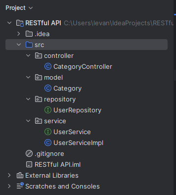
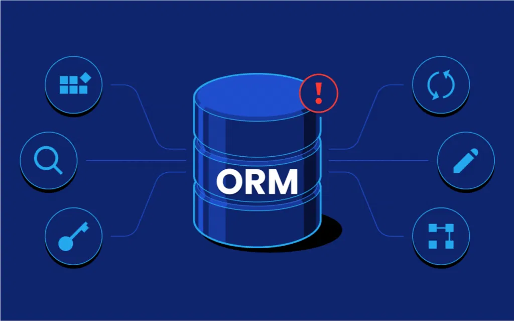
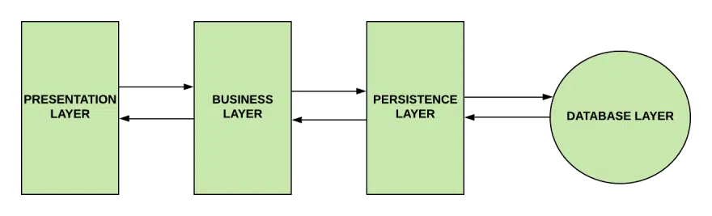
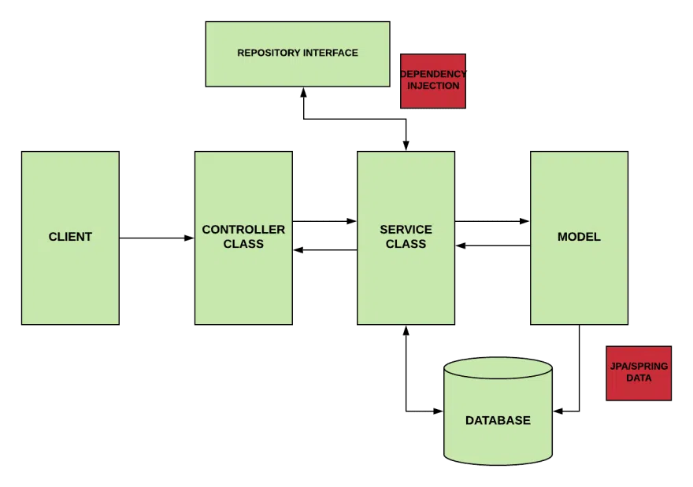

# Triển khai RestfullAPI trong Spring Boot
## 1.1. Cấu trúc dự án

Trong sơ đồ trên chúng ta thấy có các thành phần chính là **controller**, **model**, **repository**, **service** — đây cũng là mô hình cơ bản mà chúng ta sẽ thấy rất nhiều trong các dự án sau này. Dưới đây chúng ta sẽ tìm hiểu về từng thành phần trong mô hình trên.




## 1.2. Cài đặt thư viện

Đầu tiên để chuẩn bị cho việc khởi tạo dự án chúng ta cần phải thêm một số thư viện cần thiết vào `pom.xml`:

```xml
<dependency>
    <groupId>org.springframework.boot</groupId>
    <artifactId>spring-boot-starter-web</artifactId>
</dependency>
<dependency>
    <groupId>org.springframework.boot</groupId>
    <artifactId>spring-boot-starter-data-jpa</artifactId>
</dependency>
<dependency>
    <groupId>org.projectlombok</groupId>
    <artifactId>lombok</artifactId>
    <optional>true</optional>
</dependency>
```


## 1.3. Controller

**Chức năng:** Controller là một phần quan trọng của ứng dụng RESTful API, nó nhận và xử lý các yêu cầu HTTP từ các client (thường là trình duyệt hoặc ứng dụng di động) và trả về các phản hồi thích hợp.

**Cách sử dụng:** Bạn đánh dấu các lớp với `@RestController` hoặc các chú thích tương tự để chỉ định rằng đây là các controller. Các phương thức bên trong controller được đánh dấu với các chú thích như `@GetMapping`, `@PostMapping`, `@PutMapping`, và `@DeleteMapping` để xác định các endpoint API và xử lý các yêu cầu từ client.

**CategoryController.java**

```java
@RestController
@RequestMapping("v1/category")
public class CategoryController {

    @Autowired
    private CategoryService categoryService;

    @GetMapping("{id}")
    public ResponseEntity<Category> findCategory(@PathVariable Integer id) {
        Optional<Category> categoryOptional = categoryService.findCategory(id);
        return categoryOptional.map(ResponseEntity::ok)
                .orElseGet(() -> new ResponseEntity<>(HttpStatus.NOT_FOUND));
    }

    @GetMapping
    public ResponseEntity<List<Category>> findAll() {
        return ResponseEntity.ok(categoryService.findAll());
    }

    @PostMapping
    public ResponseEntity<Category> save(@RequestBody Category category) {
        return ResponseEntity.ok(categoryService.save(category));
    }

    @PutMapping
    public ResponseEntity<Category> update(@RequestBody Category category) {
        return ResponseEntity.ok(categoryService.update(category));
    }

    @DeleteMapping
    public void delete(@RequestBody Category category) {
         categoryService.delete(category);
    }
}
```


## 1.4. Model

**Chức năng:** Model đại diện cho dữ liệu hoặc đối tượng mà bạn muốn truy cập hay cung cấp thông qua API. Nó định nghĩa cấu trúc dữ liệu và các trường của đối tượng.

**Cách sử dụng:** Bạn tạo các lớp model để mô tả cấu trúc dữ liệu và thông tin về các đối tượng mà bạn sẽ thao tác với trong ứng dụng. Đối tượng model này thường được sử dụng trong các phương thức của Controller và Repository để thao tác với dữ liệu.

**Category.java**

```java
@Entity
@Table(name = "category")
@Getter @Setter
public class Category {

    @Id
    @GeneratedValue(strategy = GenerationType.IDENTITY)
    @Column(name = "id")
    private Integer id;

    @Column(name = "name")
    private String name;

    @Column(name = "slug")
    private String slug;
}
```


## 1.5. Repository

**Chức năng:** Repository làm nhiệm vụ truy cập và tương tác với cơ sở dữ liệu. Nó cung cấp các phương thức để lưu trữ và truy vấn dữ liệu từ cơ sở dữ liệu.

**Cách sử dụng:** Bạn tạo các interface hoặc lớp repository với các phương thức để thực hiện các thao tác CRUD (Create, Read, Update, Delete) với đối tượng model. Spring Boot thường tích hợp Spring Data JPA để giúp bạn tạo repository một cách dễ dàng.

**CategoryRepository.java**

```java
@Repository
public interface CategoryRepository extends JpaRepository<Category, Integer> {
}
```


## 1.6. Service

**Chức năng:** Service làm nhiệm vụ kết nối giữa Controller và Repository. Nó chứa logic kinh doanh, kiểm tra quyền truy cập, xử lý nghiệp vụ và gọi các phương thức từ Repository để truy cập hoặc cập nhật dữ liệu.

**Cách sử dụng:** Bạn tạo các lớp service để xử lý logic nghiệp vụ. Các controller gọi các phương thức từ service để thực hiện các tác vụ nghiệp vụ. Điều này giúp tách biệt logic nghiệp vụ và logic truy cập dữ liệu, làm cho mã nguồn dễ quản lý và bảo trì.

**CategoryService.java**

```java
public interface CategoryService {
    Optional<Category> findCategory(Integer id);
    List<Category> findAll();
    Category save(Category category);
    Category update(Category category);
    void delete(Category category);
}
```

**CategoryServiceImpl.java**

```java
@Service
public class CategoryServiceImpl implements CategoryService {

    @Autowired
    private CategoryRepository categoryRepository;

    @Override
    public Category save(Category category) {
        return categoryRepository.save(category);
    }

    @Override
    public Optional<Category> findCategory(Integer id) {
        return categoryRepository.findById(id);
    }

    @Override
    public List<Category> findAll() {
        return categoryRepository.findAll();
    }

    @Override
    public Category update(Category category) {
        return categoryRepository.save(category);
    }

    @Override
    public void delete(Category category) {
       categoryRepository.delete(category);
    }
}
```


# JPA là gì? Hibernate là gì?
## 1.JPA
### 1.1 JPA là gì?
JPA (viết tắt của Java Persistence API) là một tiêu chuẩn kỹ thuật trong lĩnh vực phát triển ứng dụng Java để lập trình đối tượng quan hệ (ORM). JPA được cung cấp bởi Oracle và đã được thừa nhận là một tiêu chuẩn quốc tế.

JPA cung cấp cách tiếp cận trừu tượng cho việc lưu trữ và truy xuất dữ liệu trong cơ sở dữ liệu quan hệ. Sử dụng JPA, chúng ta có thể tập trung vào thiết kế ứng dụng của mình hơn là phải lo về cách lưu trữ và truy xuất dữ liệu như thế nào.
### 1.2 Sự cần thiết của JPA trong ứng dụng Java
Trong quá trình phát triển ứng dụng Java, chúng ta không thể tránh khỏi việc tương tác với cơ sở dữ liệu. Vấn đề là, làm thế nào để lưu trữ và truy xuất dữ liệu một cách dễ dàng và hiệu quả?

Một giải pháp là sử dụng **JDBC (Java Database Connectivity)**, một API được cung cấp bởi Sun Microsystems để tương tác với cơ sở dữ liệu. Tuy nhiên, với JDBC, chúng ta cần phải viết rất nhiều code để thực hiện các hoạt động đơn giản như việc lấy và cập nhật dữ liệu. Điều này có thể làm cho ứng dụng của chúng ta trở nên phức tạp và khó bảo trì.

Vì vậy, JPA ra đời nhằm giải quyết vấn đề này bằng cách giảm bớt sự phức tạp của việc tương tác với cơ sở dữ liệu. Với JPA, ta có thể sử dụng đối tượng Java để lưu trữ và truy xuất dữ liệu. Hơn nữa, JPA sẽ tự động chuyển đổi các đối tượng thành các câu truy vấn SQL để thực hiện việc lưu trữ và truy xuất, giúp lập trình viên chúng ta tập trung vào việc phát triển tính năng của ứng dụng mà không phải lo nhiều về SQL phức tạp.
### 1.3 Vai trò của JPA trong phát triển ứng dụng
JPA là một công nghệ quan trọng trong việc phát triển ứng dụng Java, bởi vì nó giúp:

- **Viết code ít hơn**: Sử dụng JPA, chúng ta có thể sử dụng các đối tượng Java thay vì phải viết các câu truy vấn SQL hoặc sử dụng JDBC trực tiếp. Điều này làm cho code trở nên ngắn gọn hơn và dễ đọc hơn, giảm thiểu tối đa boilerplate code.
- **Dễ bảo trì**: Với JPA, việc thay đổi cấu trúc cơ sở dữ liệu trở nên dễ dàng hơn. Chúng ta chỉ cần thay đổi định nghĩa của đối tượng Java và JPA sẽ tự động áp dụng các thay đổi này vào cơ sở dữ liệu tương ứng.
- **Hiệu suất cao**: JPA giúp tối ưu hóa việc truy xuất và lưu trữ dữ liệu trong cơ sở dữ liệu. Nó sử dụng các kỹ thuật như lazy loading và caching để giảm thiểu số lần truy cập vào cơ sở dữ liệu.
## 2. ORM là gì
### 2.1 Một số ORM framework hỗ trợ JPA
**ORM (Object-Relational Mapping)** là một kỹ thuật trong lập trình để ánh xạ các đối tượng Java vào cơ sở dữ liệu quan hệ. Khi sử dụng ORM, chúng ta có thể làm việc với cơ sở dữ liệu thông qua các đối tượng Java, thay vì phải sử dụng các câu truy vấn SQL trực tiếp.

Có nhiều framework hỗ trợ ORM và JPA được liệt kê phía dưới:

- **Hibernate**: Hibernate là một trong những framework ORM phổ biến nhất và cũng là backend mặc định cho JPA. Nó cung cấp các tính năng mạnh mẽ và linh hoạt cho việc tương tác với cơ sở dữ liệu quan hệ.
- **EclipseLink**: EclipseLink là một framework ORM mạnh mẽ khác được sử dụng rộng rãi trong cộng đồng Java. Nó cũng hỗ trợ đầy đủ JPA.
- **OpenJPA**: OpenJPA là một framework ORM được phát triển bởi Apache. Nó cung cấp một loạt các tính năng để làm việc với cơ sở dữ liệu quan hệ và hỗ trợ đầy đủ JPA.
## 3. Java Persistence API cơ bản
### 3.1 Kiến trúc JPA

Để hiểu rõ cách JPA hoạt động, chúng ta cần tìm hiểu về một số thành phần chính của nó.

### Các thành phần cơ bản trong JPA

#### 3.1.1 Định nghĩa Entity

Trong JPA, một **Entity** là một đối tượng Java ánh xạ vào một bảng trong cơ sở dữ liệu. Chúng ta có thể hiểu là mối quan hệ 1-1. Đối tượng Entity chứa thông tin về cấu trúc và dữ liệu của bảng.

Để định nghĩa một Entity trong JPA, chúng ta có thể sử dụng các annotation như `@Entity`, `@Table`, `@Column`, vv.

#### Ví dụ

```java
@Entity
@Table(name = "employees")
public class Employee {
    @Id
    @GeneratedValue(strategy = GenerationType.IDENTITY)
    private Long id;
    
    @Column(name = "name")
    private String name;
    
    // getters and setters
}
```

Ở ví dụ trên, `Employee` được đánh dấu là một Entity bằng cách sử dụng annotation `@Entity`.
Sẽ ánh xạ vào bảng `"employees"` trong cơ sở dữ liệu.
Thuộc tính `id` được đánh dấu là khóa chính bằng cách sử dụng annotation `@Id`.
Các thuộc tính khác được ánh xạ vào các cột của bảng bằng cách sử dụng annotation `@Column`.

### 3.1.2 Quản lý Entity Manager

**Entity Manager** là một thành phần quan trọng trong JPA.
Nó làm nhiệm vụ quản lý các đối tượng Entity và từ đó chúng ta có thể sử dụng Entity Manager để thực hiện các hoạt động CRUD (Create, Read, Update, Delete) trên cơ sở dữ liệu.

#### Ví dụ

```java
public void createEmployee(Employee employee) {
    EntityManager entityManager = // lấy Entity Manager từ EntityManagerFactory
    
    entityManager.persist(employee); // thêm đối tượng vào cơ sở dữ liệu
}
```

Trong ví dụ trên, chúng ta sử dụng phương thức `persist()` của **Entity Manager** để thêm một đối tượng `Employee` vào cơ sở dữ liệu.


### 3.1.3 Entity Transaction

Trong JPA, mỗi hoạt động liên quan đến cơ sở dữ liệu sẽ được thực hiện trong một **transaction**.
Transaction là một tập hợp các hoạt động ghi và đọc dữ liệu liên quan mà thường được thực hiện cùng nhau và được xem như là một thao tác duy nhất.
Việc sử dụng các thao tác liên quan trong cùng một Transaction sẽ giúp đảm bảo **tính toàn vẹn của dữ liệu** khi thực hiện.

#### Ví dụ

```java
public void updateEmployeeName(long id, String newName) {
    EntityManager entityManager = // lấy Entity Manager từ EntityManagerFactory
    
    EntityTransaction transaction = entityManager.getTransaction();
    transaction.begin(); // bắt đầu transaction
    
    Employee employee = entityManager.find(Employee.class, id); // tìm kiếm đối tượng Employee theo id
    employee.setName(newName); // thay đổi tên của Employee
    
    transaction.commit(); // kết thúc transaction và lưu các thay đổi vào cơ sở dữ liệu
}
```

Trong ví dụ trên:

* Sử dụng phương thức `getTransaction()` của **Entity Manager** để lấy **Entity Transaction**.
* Bắt đầu transaction bằng `begin()`.
* Thực hiện các hoạt động liên quan đến cơ sở dữ liệu.
* Cuối cùng gọi `commit()` để lưu thay đổi vào cơ sở dữ liệu.


### 3.1.4 Quản lý Persistence Context

**Persistence Context** là một trong những khái niệm quan trọng trong JPA, là một vùng nhớ tạm thời được quản lý bởi **Entity Manager** và chứa các đối tượng đã được truy xuất từ cơ sở dữ liệu.

Khi chúng ta lấy một đối tượng từ cơ sở dữ liệu bằng Entity Manager, đối tượng này được lưu trong Persistence Context.
Khi bạn thay đổi đối tượng trong Persistence Context, JPA sẽ **tự động theo dõi các thay đổi này** và cập nhật chúng vào cơ sở dữ liệu khi transaction kết thúc.


## 4. Tại sao nên dùng JPA

### 4.1 No-code Repository

Một trong những lợi ích lớn nhất của JPA là chúng ta **không cần phải viết mã SQL hay DAO (Data Access Object)** để làm việc với cơ sở dữ liệu.
Thay vào đó, JPA cung cấp **Repository Interfaces** để thực hiện các hoạt động CRUD.

**JPA cung cấp các phương thức thao tác với cơ sở dữ liệu - Nguồn: Sendvjs Medium**

#### Ví dụ

```java
@Repository
public interface EmployeeRepository extends JpaRepository<Employee, Long> {
    List<Employee> findAll();
}
```

Điều này giúp giảm thiểu rất nhiều công việc lặp lại và **mã boilerplate code** mà chúng ta thường phải viết khi sử dụng JDBC trực tiếp.


### 4.2 Khả năng mở rộng

Với JPA, chúng ta có thể **thay đổi cơ sở dữ liệu mà không cần sửa đổi mã nguồn ứng dụng**.
Điều này làm cho việc di động giữa các hệ thống cơ sở dữ liệu khác nhau dễ dàng hơn.

Ngoài ra, JPA còn cho phép chúng ta mở rộng ứng dụng dễ dàng bằng cách **thêm mới các Entity và Repository** mà không cần phải sửa đổi mã nguồn đã có.


## 5. So sánh JPA và Hibernate


JPA và Hibernate là hai khái niệm liên quan đến **ánh xạ quan hệ đối tượng (ORM)** trong Java.
Với ORM, như đã đề cập ở phía trên, là một kỹ thuật cho phép **chuyển đổi các đối tượng Java thành các bản ghi trong cơ sở dữ liệu quan hệ và ngược lại**.

Từ đó, chúng ta có thể thấy được **JPA** và **Hibernate** có một số điểm khác nhau như sau:

| Tiêu chí               | JPA                                            | Hibernate                                                      |
| - | - | -- |
| **Bản chất**           | Là một tiêu chuẩn (Specification)              | Là một triển khai (Implementation) của JPA                     |
| **Ngôn ngữ truy vấn**  | JPQL (Java Persistence Query Language)         | HQL (Hibernate Query Language)                                 |
| **Tính mở rộng**       | Tuân thủ tiêu chuẩn, cung cấp tính năng cơ bản | Mở rộng tiêu chuẩn JPA, cung cấp thêm nhiều tính năng nâng cao |
| **Bộ nhớ đệm (Cache)** | Hỗ trợ 2 loại: Entity Cache, Query Cache       | Hỗ trợ thêm Collection Cache                                   |
| **Tính tương thích**   | Được hỗ trợ bởi tất cả các nhà cung cấp JPA    | Chỉ hỗ trợ riêng cho Hibernate                                 |

Tóm lại, **JPA** và **Hibernate** là hai khái niệm liên quan nhưng khác nhau về ORM trong Java:

* JPA là **một tiêu chuẩn cho ORM**.
* Hibernate là **một triển khai của JPA**, đồng thời mở rộng JPA với nhiều tính năng mạnh mẽ hơn.

Tuy nhiên, việc sử dụng các tính năng dành riêng cho Hibernate có thể gây ra **sự phụ thuộc vào nhà cung cấp** và **khó chuyển đổi** sang các triển khai JPA khác.
Do đó, chúng ta nên cân nhắc kỹ trước khi sử dụng Hibernate hoặc JPA cho dự án của mình.

## 6. Hibernate

### 6.1 Hibernate là gì?

**Hibernate** là một thư viện **ORM (Object Relational Mapping)** mã nguồn mở giúp lập trình viên viết ứng dụng Java có thể **map các objects (POJO)** với **hệ quản trị cơ sở dữ liệu quan hệ**,  
và hỗ trợ thực hiện các khái niệm **lập trình hướng đối tượng** với **cơ sở dữ liệu quan hệ**.


### 6.2 Hibernate 

#### 6.2.1 Persistence Object
Chính là các **POJO object** map với các **table** tương ứng của cơ sở dữ liệu quan hệ.  
Nó như là những “thùng xe” chứa dữ liệu từ ứng dụng để ghi xuống database, hay chứa dữ liệu tải lên ứng dụng từ database.

#### 6.2.2 Session Factory
Là một **interface** giúp tạo ra **session** kết nối đến database bằng cách đọc các cấu hình trong Hibernate configuration.  
Mỗi một database phải có một **session factory**.

Ví dụ:  
Nếu ta sử dụng **MySQL** và **Oracle** cho ứng dụng Java của mình thì ta cần có một `SessionFactory` cho MySQL, và một `SessionFactory` cho Oracle.

#### 6.2.3 Hibernate Session
Mỗi một đối tượng `Session` được `SessionFactory` tạo ra sẽ tạo **một kết nối** đến database.

#### 6.2.4 Transaction
Là **transaction** đảm bảo tính toàn vẹn của phiên làm việc với cơ sở dữ liệu.  
Tức là nếu có một lỗi xảy ra trong transaction thì tất cả các tác vụ thực hiện sẽ thất bại.

#### 6.2.5 Query
Hibernate cung cấp các câu truy vấn **HQL (Hibernate Query Language)** tới database và map kết quả trả về với đối tượng tương ứng của ứng dụng Java.


### 6.3 Tại sao phải dùng Hibernate thay JDBC

#### 6.3.1 Object Mapping
Với **JDBC** ta phải map các trường trong bảng với các thuộc tính của Java object một cách **“thủ công”**.  
Với **Hibernate**, việc này được hỗ trợ **“tự động”** thông qua các file cấu hình map XML hoặc sử dụng **annotation**.

#### JDBC sẽ map Java object với table như sau:

```java
// rs là ResultSet trả về từ câu query get dữ liệu bảng user.
List users = new ArrayList();
while (rs.next()) {
     User user = new User();
     user.setUserId(rs.getString("userNo"));
     user.setName(rs.getString("firstName"));
     user.setEmail(rs.getString("lastName"));
     users.add(user);
}
```

####  Cũng với table user đó, sử dụng annotation để Hibernate map “tự động”:

```java
@Entity
@Table(name = "user")
public class UserModel {
    @Id
    @GeneratedValue(strategy = GenerationType.IDENTITY)
    private BigInteger userNo;

    @NotEmpty
    @Column(name = "lastName")
    private String email;

    public BigInteger getUserNo() {
        return this.userNo;
    }
    public void setUserNo(BigInteger userNo) {
        this.userNo = userNo;
    }
    public String getLastName() {
        return lastName;
    }
    public void setLastName(String lastName) {
        this.lastName = lastName;
    }
}
```


#### 6.3.2 HQL

Hibernate cung cấp các câu lệnh truy vấn tương tự SQL.
HQL của Hibernate hỗ trợ đầy đủ các truy vấn đa hình: **kế thừa (inheritance)**, **đa hình (polymorphism)**, và **liên kết (association)**.


#### 6.3.3 Database Independent

Code sử dụng Hibernate là **độc lập với hệ quản trị cơ sở dữ liệu**,
nghĩa là ta không cần thay đổi câu lệnh HQL khi chuyển từ MySQL sang Oracle hay các hệ quản trị khác.
Chỉ cần thay đổi thông tin cấu hình trong file cấu hình.

```properties
# used MySQL
com.mysql.jdbc.Driver

# used Oracle
oracle.jdbc.driver.OracleDriver
```

#### Ví dụ:

Khi muốn lấy 10 bản ghi dữ liệu của một table từ 2 CSDL khác nhau:

**Với JDBC:**

```sql
# MySQL
SELECT column_name FROM table_name ORDER BY column_name ASC LIMIT 10; 

# SQL Server 
SELECT TOP 10 column_name FROM table_name ORDER BY column_name ASC;
```

**Với Hibernate:**

```java
session.createQuery("SELECT E.id FROM Employee E ORDER BY E.id ASC")
       .setMaxResults(10)
       .list();
```

Câu truy vấn **không thay đổi** dù bạn dùng MySQL hay SQL Server.


#### 6.3.4 Minimize Code Changes

Khi ta thay đổi (thêm) cột vào bảng:

**Với JDBC, ta phải thay đổi:**

* Thêm thuộc tính vào POJO class.
* Thay đổi method chứa câu truy vấn “select”, “insert”, “update” để bổ sung cột mới.
* Có thể có rất nhiều method, nhiều class chứa các câu truy vấn như trên.

**Với Hibernate, ta chỉ cần:**

* Thêm thuộc tính vào POJO class.
* Cập nhật Hibernate XML mapping file để thêm map column – property.

→ Chỉ thay đổi **2 file** là xong.


#### 6.3.5 Lazy Loading

Với những ứng dụng Java làm việc với cơ sở dữ liệu lớn hàng trăm triệu bản ghi, việc sử dụng **Lazy Loading** mang lại lợi ích rất lớn.
Nó giống như việc ta có thể **bẻ từng chiếc đũa** của bó đũa to thay vì bẻ cả bó cùng lúc.

Ví dụ:
Bảng `user` có quan hệ **một-nhiều** với bảng `document`.
Nếu dữ liệu document rất lớn, việc load toàn bộ cùng lúc sẽ tốn bộ nhớ.
Hibernate cho phép ta **chỉ tải dữ liệu khi cần**:

```java
@OneToMany(mappedBy = "user", fetch = FetchType.LAZY)
private Set documents = new HashSet();

// Lấy user
User user = (User) session.get(User.class, new Integer(100));

// Lúc này Hibernate mới fetch documents cho user 100
documents = user.getDocuments();
```


#### 6.3.6 Loại bỏ Try-Catch Blocks

Khi thao tác với JDBC, nếu lỗi xảy ra sẽ có `SQLException` bắn ra, nên ta phải dùng `try-catch` để xử lý.
Hibernate xử lý việc này bằng cách **override toàn bộ JDBC exception** thành **Unchecked Exception**,
vì vậy ta **không cần viết try-catch** trong code nữa.


#### 6.3.7 Quản lý Commit/Rollback Transaction

**Transaction** là nhóm các hoạt động với database của một tác vụ.
Nếu một hoạt động thất bại thì toàn bộ tác vụ cũng thất bại.

**Với JDBC:**

* Lập trình viên phải chủ động gọi `commit` hoặc `rollback`.

**Với Hibernate:**

* Hibernate **tự động quản lý transaction**, giúp đảm bảo tính toàn vẹn dữ liệu.


#### 6.3.8 Hibernate Caching

Hibernate cung cấp cơ chế **bộ nhớ đệm (cache)** giúp **giảm số lần truy cập database**,
từ đó **tăng hiệu năng** cho ứng dụng.

* Hibernate lưu trữ các đối tượng trong session khi transaction được kích hoạt.
* Khi một query được thực hiện liên tục, giá trị đã lưu trong session được sử dụng lại.
* Khi một transaction mới bắt đầu, dữ liệu được lấy lại từ database và được lưu vào session mới.

Hibernate cung cấp **hai cấp độ cache**:

* **Level 1 Cache** (mặc định, theo session)
* **Level 2 Cache** (chia sẻ giữa các session)


# Kiến trúc 4 lớp Spring Boot
Dưới đây mình **format lại toàn bộ nội dung**, **bổ sung ví dụ đầy đủ**, **diễn giải dễ hiểu**, và **sắp xếp lại cho chuẩn kiến trúc Spring Boot 4 lớp**.


## **Kiến trúc Spring Boot – 4 Lớp (Spring Boot Architecture 4 Layers)**

Kiến trúc Spring Boot truyền thống được chia thành **4 lớp**:

1. **Presentation Layer (Controller)**
2. **Business Layer (Service)**
3. **Persistence Layer (Repository/DAO)**
4. **Database Layer (Database thực tế)**

Đây là mô hình chuẩn cho các ứng dụng RESTful trong doanh nghiệp, giúp code rõ ràng, dễ bảo trì, dễ mở rộng.



#  **1. Lớp Presentation (Controller Layer)**

### ✔ Vai trò chính:

* Nhận **HTTP request** từ client.
* Xác thực đơn giản (authentication forwarding).
* Chuyển đổi **JSON → Object** và **Object → JSON**.
* Gọi xuống lớp Business (Service).
* Trả về **HTTP response** cho client.

### ✔ Tương ứng với:

👉 **Controller (@RestController)**

### ✔ Không làm:

✘ Không xử lý logic nghiệp vụ
✘ Không validate phức tạp
✘ Không truy cập database


###  **Ví dụ Controller:**

```java
@RestController
@RequestMapping("/api/students")
public class StudentController {

    private final StudentService studentService;

    public StudentController(StudentService studentService) {
        this.studentService = studentService;
    }

    @GetMapping("/{id}")
    public ResponseEntity<Student> getStudentById(@PathVariable Long id) {
        Student student = studentService.getStudent(id);
        return ResponseEntity.ok(student);
    }

    @PostMapping
    public ResponseEntity<Student> create(@RequestBody StudentDTO dto) {
        Student student = studentService.createStudent(dto);
        return ResponseEntity.ok(student);
    }
}
```


# **2. Lớp Business (Service Layer)**

### ✔ Vai trò:

* Xử lý toàn bộ **logic nghiệp vụ** (business logic).
* Thực hiện **validation** nâng cao.
* Thực hiện **authorization** (quyền truy cập).
* Gọi xuống lớp Persistence.
* Áp dụng các quy tắc nghiệp vụ của hệ thống.

### ✔ Tương ứng với:

👉 **Service (@Service)**

### ✔ Không làm:

✘ Không xử lý request/response
✘ Không thao tác SQL trực tiếp


###  **Ví dụ Service:**

```java
@Service
public class StudentService {

    @Autowired
    private StudentRepository studentRepository;

    public Student getStudent(Long id) {
        return studentRepository.findById(id)
                .orElseThrow(() -> new RuntimeException("Student not found"));
    }

    public Student createStudent(StudentDTO dto) {
        if (dto.getAge() < 18) {
            throw new IllegalArgumentException("Age must be >= 18");
        }

        Student student = new Student();
        student.setName(dto.getName());
        student.setAge(dto.getAge());
        return studentRepository.save(student);
    }
}
```


#  **3. Lớp Persistence (Repository / DAO Layer)**

### ✔ Vai trò:

* Giao tiếp với database.
* Thực hiện CRUD.
* Chuyển đổi dữ liệu: **Entity ↔ Database row**.
* Chạy các truy vấn (JPA, JPQL, Query Methods, Native SQL).

### ✔ Tương ứng với:

👉 **Repository (@Repository)**
👉 Interface extends `JpaRepository`

### ✔ Không làm:

✘ Không viết logic nghiệp vụ
✘ Không xử lý HTTP request


###  **Ví dụ Repository:**

```java
@Repository
public interface StudentRepository extends JpaRepository<Student, Long> {

    List<Student> findByAgeGreaterThan(int age);

    @Query("SELECT s FROM Student s WHERE s.name LIKE %:name%")
    List<Student> searchByName(@Param("name") String name);
}
```


#  **4. Lớp Database (Data Layer)**

###  Vai trò:

* Lưu trữ dữ liệu của ứng dụng.
* Xử lý CRUD qua Hibernate/JPA hoặc driver.
* Có thể là:

  * MySQL
  * PostgreSQL
  * SQL Server
  * Oracle
  * MongoDB
  * Redis

###  Đây là lớp **ngoại vi**, không thuộc code Spring Boot.

**→ Ứng dụng giao tiếp qua Persistence Layer.**


## **Workflow (Luồng hoạt động của Spring Boot)**


###  Diễn giải workflow:

1. Client gửi HTTP Request (GET/POST/PUT/DELETE).
2. **Controller** nhận request → parse JSON → gọi Service.
3. **Service** xử lý logic → validate → kiểm tra rule → gọi Repository.
4. **Repository** chạy SQL/JPA → truy vấn Database.
5. Database trả dữ liệu cho Repository → Service → Controller.
6. Controller trả về JSON Response cho client.


## Ví dụ một workflow thực tế:

Client gửi request:

```
POST /api/students
{
  "name": "Long",
  "age": 20
}
```

**→ Controller** nhận request → chuyển sang DTO → gọi Service
**→ Service** validate tuổi, tạo Student → gọi Repository
**→ Repository** lưu vào database
**→ Controller** trả về JSON:

```json
{
  "id": 5,
  "name": "Long",
  "age": 20
}
```


# Request flow (dòng chảy xử lý request)


## 🚀 **REQUEST FLOW TRONG SPRING BOOT (DÒNG CHẢY XỬ LÝ REQUEST)**

Request Flow mô tả **từng bước** mà một HTTP Request đi qua trong Spring Boot, từ lúc đi vào ứng dụng 👉 cho đến lúc trả về Response.

Spring Boot dùng Spring MVC, nên request flow gồm **12 bước chính** sau:


# 🧭 **TÓM TẮT REQUEST FLOW – 1 HÌNH MINH HỌA**

```
Browser/Client
      ↓
DispatcherServlet
      ↓
HandlerMapping
      ↓
Handler (Controller)
      ↓
Service Layer
      ↓
Repository Layer
      ↓
Database
      ↑
Response (Reverse Flow)
```


# 🧩 **1. Client gửi HTTP Request**

Client có thể là:

* Browser (Chrome, Firefox…)
* Mobile App
* Postman
* React / Angular / Vue

Ví dụ request:

```
GET /api/students/10
Host: localhost:8080
```


# 🏰 **2. Request đi vào Servet Container (Tomcat Embedded)**

Mặc định Spring Boot dùng **Tomcat embedded**.
Tomcat nhận request trước, rồi chuyển request cho Spring qua DispatcherServlet.


# 🚦 **3. DispatcherServlet – “Bộ điều phối trung tâm”**

**DispatcherServlet** là trái tim của Spring MVC.

Nó chịu trách nhiệm:

* Nhận request
* Tìm đúng Controller
* Gọi handler tương ứng
* Xử lý exception
* Render response

📌 Mặc định được tạo bởi `@SpringBootApplication`.


# 🗺 **4. HandlerMapping – Tìm Controller phù hợp**

Spring dùng HandlerMapping để tìm xem request cần đi tới controller nào.

Ví dụ mapping:

```java
@GetMapping("/students/{id}")
public Student getById(@PathVariable Long id) { ... }
```

Nếu request là:

```
GET /students/5
```

→ HandlerMapping trả về method `getById`.


# 🧩 **5. HandlerAdapter – Kích hoạt controller**

Spring cần một adapter để chạy method Controller.
→ HandlerAdapter gọi đúng hàm tương ứng.


# 📝 **6. Web Argument Resolver – Gán tham số method**

Method controller có tham số:

```java
public Student getById(@PathVariable Long id)
```

Spring phải:

* Parse URL
* Lấy `{id}`
* Convert “5” → Long
* Truyền vào hàm

Việc này do ArgumentResolver xử lý.


# 🎛 **7. Controller xử lý request**

Controller là nơi:

* Nhận request
* Lấy tham số
* Validate đơn giản
* Gọi service

Không xử lý logic nghiệp vụ.

Ví dụ:

```java
@RestController
@RequestMapping("/api/students")
public class StudentController {

    @Autowired
    private StudentService service;

    @GetMapping("/{id}")
    public Student getById(@PathVariable Long id) {
        return service.getStudent(id);
    }
}
```


# 🧠 **8. Service Layer – Xử lý logic nghiệp vụ**

Service là nơi thực hiện:

* Business logic
* Validation nghiệp vụ
* Authorization
* Tính toán
* Gọi Repository

Ví dụ:

```java
@Service
public class StudentService {

    @Autowired
    private StudentRepository repo;

    public Student getStudent(Long id) {
        return repo.findById(id)
            .orElseThrow(() -> new RuntimeException("Not found"));
    }
}
```


# 🗄 **9. Repository Layer – Giao tiếp database**

Repository dùng JPA/Hibernate để truy vấn DB.

```java
@Repository
public interface StudentRepository extends JpaRepository<Student, Long> {}
```

Spring tự động:

* Mở transaction
* Kết nối DB
* Tạo SQL từ JPA
* Trả kết quả


# 🛢 **10. Database – Thực hiện CRUD**

Ví dụ query Hibernate sẽ chạy:

```sql
select * from student where id = 10;
```

Data trả về dưới dạng ResultSet, Hibernate convert thành **Entity**.


# 🔙 **11. Response Flow – Quay ngược lại lên trên**

Dữ liệu đi ngược:

```
Database
→ Repository
→ Service
→ Controller
→ DispatcherServlet
→ Client
```


# 📤 **12. Response được trả về client**

Spring sử dụng:

* **HttpMessageConverter**
* **Jackson** (convert object → JSON)

Ví dụ response:

```json
{
  "id": 10,
  "name": "Long",
  "age": 20
}
```


# 💡 **MINH HỌA REQUEST FLOW ĐẦY ĐỦ**

```
[ Client ]
    |
    v
[ Tomcat Embedded ]
    |
    v
[ DispatcherServlet ]
    |
    v
[ HandlerMapping ] → tìm Controller phù hợp
    |
    v
[ HandlerAdapter ] → gọi phương thức
    |
    v
[ Controller ]
    |
    v
[ Service Layer ]
    |
    v
[ Repository Layer ]
    |
    v
[ Database ]
    |
    v
< Response (JSON) 
```


# 🎯 **VÍ DỤ REQUEST FLOW THỰC TẾ (CRUD)**

### Client gửi:

```
POST /api/students
{
  "name": "Long",
  "age": 21
}
```

### Flow:

1. Browser → gửi request
2. Tomcat nhận request
3. DispatcherServlet xử lý
4. HandlerMapping tìm `createStudent()`
5. ArgumentResolver parse JSON → DTO
6. Controller gọi Service
7. Service xử lý validate → tạo entity
8. Repository gọi Hibernate → SQL INSERT
9. Database lưu record
10. Hibernate trả entity
11. Service trả kết quả
12. Controller trả JSON
13. Client nhận response

### Response:

```json
{
  "id": 25,
  "name": "Long",
  "age": 21
}
```


# Cấu hình DataSource

## 1. DataSource là gì?

DataSource hoạt động như một factory để cung cấp các kết nối cơ sở dữ liệu. Nó là một cách thay thế cho cơ chế DriverManager. Một datasource sử dụng URL cùng với thông tin username/password để thiết lập kết nối cơ sở dữ liệu.

Trong Java, một datasource triển khai interface `javax.sql.DataSource`. Datasource này thường được đăng ký vào dịch vụ JNDI và có thể được lấy ra bằng tên JNDI của nó.

Chúng ta có thể dùng một datasource để lấy:

* đối tượng Connection tiêu chuẩn
* một kết nối có thể dùng trong connection pooling
* một kết nối có thể dùng trong distributed transactions và connection pooling


## 2. Cấu hình DataSource trong Spring Boot

Spring Boot cho phép định nghĩa cấu hình datasource theo các cách sau:

* Java bean configuration
* Properties configuration
* JNDI configuration

Trong quá trình khởi động ứng dụng, `DataSourceAutoConfiguration` kiểm tra `DataSource.class` (hoặc `EmbeddedDatabaseType.class`) trên classpath và một số yếu tố khác trước khi tự động cấu hình một bean DataSource cho chúng ta.


### 2.1. Maven Dependency

Nếu chưa được khai báo, thêm `spring-boot-starter-data-jpa` vào project để mang theo tất cả dependency cần thiết, bao gồm cả các JDBC drivers như `mysql-connector-java` để kết nối MySQL.

**pom.xml**

```xml
<dependency>
    <groupId>org.springframework.boot</groupId>
    <artifactId>spring-boot-starter-data-jpa</artifactId>
</dependency>
```

Nếu chúng ta có kế hoạch sử dụng **embedded database** ở một số bước (ví dụ testing), chúng ta có thể import H2 riêng.


### 2.2. Properties Configuration

Cấu hình DataSource được cung cấp bởi các entries cấu hình (spring.datasource.*) trong file `application.properties`. Cách cấu hình bằng properties giúp tách biệt cấu hình khỏi mã nguồn ứng dụng. Nhờ vậy, chúng ta có thể import cấu hình datasource từ các hệ thống cung cấp configuration bên ngoài.

Dưới đây là cấu hình mẫu cho H2, MySQL, Oracle và SQL Server.

Chúng ta thường không cần chỉ định `driver-class-name`, vì Spring Boot có thể suy ra từ connection URL đối với hầu hết database.

**application.properties**

```properties
# H2 DB
spring.datasource.url=jdbc:h2:file:C:/temp/test
spring.datasource.username=sa
spring.datasource.password=
spring.datasource.driverClassName=org.h2.Driver
spring.jpa.database-platform=org.hibernate.dialect.H2Dialect

# MySQL
spring.datasource.url=jdbc:mysql://localhost:3306/test
spring.datasource.username=dbuser
spring.datasource.password=dbpass
spring.datasource.driver-class-name=com.mysql.jdbc.Driver
spring.jpa.database-platform=org.hibernate.dialect.MySQL5InnoDBDialect

# Oracle
spring.datasource.url=jdbc:oracle:thin:@localhost:1521:orcl
spring.datasource.username=dbuser
spring.datasource.password=dbpass
spring.datasource.driver-class-name=oracle.jdbc.OracleDriver
spring.jpa.database-platform=org.hibernate.dialect.Oracle10gDialect

# SQL Server
spring.datasource.url=jdbc:sqlserver://localhost;databaseName=springbootdb
spring.datasource.username=dbuser
spring.datasource.password=dbpass
spring.datasource.driverClassName=com.microsoft.sqlserver.jdbc.SQLServerDriver
spring.jpa.hibernate.dialect=org.hibernate.dialect.SQLServer2012Dialect
```


### 2.3. Java Configuration

Cách được khuyến nghị để tạo một DataSource bean là sử dụng `DataSourceBuilder` trong một lớp được đánh dấu `@Configuration`.

Dưới đây là ví dụ khởi tạo bean cho H2. Những bean khác cũng được cấu hình tương tự.

```java
@Configuration
public class JpaConfig {

    @Bean
    public DataSource dataSource()
    {
        DataSourceBuilder dataSourceBuilder = DataSourceBuilder.create();
        dataSourceBuilder.driverClassName("org.h2.Driver");
        dataSourceBuilder.url("jdbc:h2:file:C:/temp/test");
        dataSourceBuilder.username("sa");
        dataSourceBuilder.password("");
        return dataSourceBuilder.build();
    }

    //...
}
```


### 2.4. JNDI DataSource

Giả sử chúng ta deploy ứng dụng Spring Boot lên application server. Trong trường hợp đó, ta có thể muốn cấu hình và quản lý DataSource bằng tính năng có sẵn của Application Server và truy cập nó thông qua JNDI.

Ta có thể làm điều này bằng property:

```properties
spring.datasource.jndi-name = java:jboss/datasources/testDB
```


## 3. Cấu hình Connection Pooling

Để tạo một pooling datasource, Spring Boot xác minh rằng một lớp Driver hợp lệ tồn tại. Lưu ý rằng nếu ta thiết lập property `spring.datasource.driver-class-name` thì driver class phải tồn tại và được load.

Auto-configuration sẽ chọn kết nối theo thứ tự ưu tiên:

1. **HikariCP** — nếu có, Spring Boot luôn chọn.
2. Nếu không có HikariCP, sử dụng **Tomcat Pooling** nếu tìm thấy.
3. Nếu không có cả hai, dùng **Commons DBCP2** nếu có trong classpath.

Starter `spring-boot-starter-data-jpa` tự động kéo dependency của HikariCP.


### 3.1. HikariCP là Connection Pool mặc định

Nếu ta dùng `spring-boot-starter-data-jpa`, ta không cần thêm dependency HikariCP vì nó được đưa vào tự động.

Khi dùng starter này, Spring Boot sẽ tự động cấu hình HikariCP với các giá trị mặc định hợp lý. Ta có thể tùy chỉnh bằng cách thay prefix thành:

```
spring.datasource.hikari.*
spring.datasource.tomcat.*
spring.datasource.dbcp2.*
```

Ví dụ:

```properties
spring.datasource.hikari.connection-timeout=30000
spring.datasource.hikari.maximum-pool-size=10
spring.datasource.hikari.minimum-idle=5
spring.datasource.hikari.idle-timeout=600000
spring.datasource.hikari.max-lifetime=1800000
spring.datasource.hikari.pool-name=collection-pool

# Other Properties

#spring.datasource.hikari.allow-pool-suspension
#spring.datasource.hikari.auto-commit
#spring.datasource.hikari.catalog
#spring.datasource.hikari.connection-init-sql
#spring.datasource.hikari.connection-test-query
#spring.datasource.hikari.data-source-class-name
#spring.datasource.hikari.data-source-j-n-d-i
#spring.datasource.hikari.data-source-properties
#spring.datasource.hikari.driver-class-name
#spring.datasource.hikari.exception-override-class-name
#spring.datasource.hikari.health-check-properties
#spring.datasource.hikari.initialization-fail-timeout
#spring.datasource.hikari.isolate-internal-queries
#spring.datasource.hikari.jdbc-url
#spring.datasource.hikari.keepalive-time
#spring.datasource.hikari.leak-detection-threshold
#spring.datasource.hikari.login-timeout
#spring.datasource.hikari.metrics-tracker-factory
#spring.datasource.hikari.password
#spring.datasource.hikari.read-only
#spring.datasource.hikari.register-mbeans
#spring.datasource.hikari.scheduled-executor
#spring.datasource.hikari.schema
#spring.datasource.hikari.transaction-isolation
#spring.datasource.hikari.username
#spring.datasource.hikari.validation-timeout
```


### 3.2. DBCP2

Để dùng Commons DBCP2 trong Spring Boot, thêm dependency:

```xml
<dependency>
    <groupId>org.apache.commons</groupId>
    <artifactId>commons-dbcp2</artifactId>
</dependency>
```

Sau đó tùy chỉnh pool:

```properties
spring.datasource.dbcp2.initial-size = 50
spring.datasource.dbcp2.max-idle = 50
spring.datasource.dbcp2.default-query-timeout = 10000
spring.datasource.dbcp2.default-auto-commit = true
```


### 3.3. Customizing Default Values – Tomcat Pooling

Tomcat Pooling là connection pool của Apache Tomcat. Thêm dependency:

```xml
<dependency>
    <groupId>org.apache.tomcat</groupId>
    <artifactId>tomcat-jdbc</artifactId>
</dependency>
```

Tùy chỉnh:

```properties
spring.datasource.tomcat.initial-size=5
spring.datasource.tomcat.max-active=10
```


## 4. Cấu hình Multiple DataSources trong Spring Boot

Để cấu hình nhiều datasource, tạo nhiều bean và đánh dấu **một bean là @Primary**.

Nhớ rằng: nếu ta tự tạo bean DataSource, auto-configuration sẽ **không chạy nữa**. Khi đó ta phải tự chịu trách nhiệm cấu hình tất cả datasource.

**JpaConfig.java**

```java
@Configuration
public class JpaConfig {

    @Bean(name = "h2DataSource")
    public DataSource h2DataSource()
    {
        DataSourceBuilder dataSourceBuilder = DataSourceBuilder.create();
        dataSourceBuilder.driverClassName("org.h2.Driver");
        dataSourceBuilder.url("jdbc:h2:file:C:/temp/test");
        dataSourceBuilder.username("sa");
        dataSourceBuilder.password("");
        return dataSourceBuilder.build();
    }

    @Bean(name = "mysqlDataSource")
    @Primary
    public DataSource mysqlDataSource()
    {
        DataSourceBuilder dataSourceBuilder = DataSourceBuilder.create();
        dataSourceBuilder.url("jdbc:mysql://localhost/testdb");
        dataSourceBuilder.username("dbuser");
        dataSourceBuilder.password("dbpass");
        return dataSourceBuilder.build();
    }
}
```

Khi autowire, Spring Boot sẽ ưu tiên datasource được đánh dấu **@Primary**.

### Autowire primary datasource

```java
@Autowired
DataSource dataSource;
```

### Autowire non-primary datasource

```java
@Autowired
@Qualifier("h2DataSource")
DataSource dataSource;
```


# Tìm hiểu các Annotation : @RestController, @Service, @Repository, @Entity, @Table, @Id, @Transactional, @Query ...
## 1. @RestController
**@RestController** là một phiên bản đặc biệt của **@Controller**. Nó bao gồm **@Controller** và **@ResponseBody** , và do đó nó giúp làm đơn giản hơn việc triển khai controller.
```java
@RestController
@RequestMapping("books-rest")
public class SimpleBookRestController {
    
    @GetMapping("/{id}", produces = "application/json")
    public Book getBook(@PathVariable int id) {
        return findBookById(id);
    }

    private Book findBookById(int id) {
        // ...
    }
}
```


**Annotation @RestController**
Spring cung cấp hai annotation controller chính:

* Annotation `@Controller` được sử dụng cho các ứng dụng dựa trên MVC, nơi mà response thường là các trang HTML.
* Annotation `@RestController` là một phiên bản chuyên biệt của `@Controller` tự động tuần tự hóa (serialize) các đối tượng trả về thành các response JSON/XML. Nó tương đương với `@Controller + @ResponseBody`.

Annotation này được sử dụng ở cấp độ class và cho phép class xử lý các request được gửi từ client. `@RestController` cho phép class xử lý các request REST API như GET, POST, PUT và DELETE bằng cách tự động tuần tự hóa (serialize) các response thành JSON.


## 2. @Serivce
**Annotation @Service trong Spring Boot**
Annotation `@Service` được sử dụng để chỉ ra rằng một class thuộc về tầng service trong ứng dụng. Tầng service thường chứa logic nghiệp vụ của ứng dụng. Annotation `@Service` là một dạng chuyên biệt của annotation `@Component`, nghĩa là các class được đánh dấu bằng `@Service` sẽ tự động được Spring phát hiện trong quá trình quét classpath.

**Các điểm chính về annotation @Service:**

* Nó được sử dụng để đánh dấu một class là nhà cung cấp dịch vụ.
* Nó chỉ được áp dụng cho các class.
* Nó là một phần của các stereotype annotations trong Spring (cùng với `@Controller`, `@Repository`, và `@Component`).
* Spring context sẽ tự động phát hiện các class này khi sử dụng cấu hình dựa trên annotation và classpath scanning.
```java
// Java Program to Illustrate MyServiceClass

// Importing package module to code module
package com.example.demo.service;
// Importing required classes
import org.springframework.stereotype.Service;

// Annotation
@Service

// Class
public class MyServiceClass {

	// Method
	// To compute factorial
	public int factorial(int n)
	{
		// Base case
		if (n == 0)
			return 1;

		return n * factorial(n - 1);
	}
}
```
## 3. @Repository

### 3.1 Annotation @Repository trong Spring Boot

@Repository là một dạng chuyên biệt của @Component, dùng để chỉ ra rằng class này cung cấp cơ chế lưu trữ, truy xuất, cập nhật, xoá và tìm kiếm dữ liệu trên các đối tượng. Mặc dù là một dạng của @Component, các lớp Repository được Spring tự động phát hiện thông qua classpath scanning. Annotation này gần với mô hình DAO pattern, nơi các lớp DAO chịu trách nhiệm cung cấp các thao tác CRUD cho database.


### 3.2 **🔑 Các điểm quan trọng của @Repository**

* @Repository dùng để đánh dấu một class là **Data Access Object (DAO)** hay **repository**.
* Mục đích chính: tương tác với **cơ sở dữ liệu**, đóng gói logic truy vấn dữ liệu.
* Cung cấp **exception translation**: tự động chuyển các lỗi truy cập DB (SQLException,…) thành DataAccessException của Spring.
* Chỉ được áp dụng cho **class**, không áp dụng cho method hay field.


### 3.3 Ví dụ minh họa @Repository trong Spring Boot

#### Ví dụ 1: Dùng @Repository với JdbcTemplate (DAO pattern truyền thống)**

### **Entity: Student**

```java
public class Student {
    private int id;
    private String name;
    private int age;

    // getters + setters
}
```


### **Repository sử dụng @Repository**

```java
import org.springframework.jdbc.core.JdbcTemplate;
import org.springframework.stereotype.Repository;
import java.util.List;

@Repository
public class StudentRepository {

    private final JdbcTemplate jdbcTemplate;

    public StudentRepository(JdbcTemplate jdbcTemplate) {
        this.jdbcTemplate = jdbcTemplate;
    }

    public List<Student> findAll() {
        String sql = "SELECT * FROM students";
        return jdbcTemplate.query(
                sql,
                (rs, rowNum) -> {
                    Student s = new Student();
                    s.setId(rs.getInt("id"));
                    s.setName(rs.getString("name"));
                    s.setAge(rs.getInt("age"));
                    return s;
                }
        );
    }

    public int save(Student student) {
        String sql = "INSERT INTO students(name, age) VALUES(?, ?)";
        return jdbcTemplate.update(sql, student.getName(), student.getAge());
    }
}
```


### **Ví dụ 2: @Repository với Spring Data JPA (cách làm phổ biến nhất)**

Spring Boot cho phép viết repository **không cần code truy vấn**, chỉ cần extends từ JpaRepository.

### **Entity**

```java
import jakarta.persistence.Entity;
import jakarta.persistence.Id;
import lombok.Data;

@Data
@Entity
public class Student {
    @Id
    private Integer id;
    private String name;
    private Integer age;
}
```


### **Spring Data Repository**

```java
import org.springframework.data.jpa.repository.JpaRepository;
import org.springframework.stereotype.Repository;

@Repository
public interface StudentRepository extends JpaRepository<Student, Integer> {
    // Spring Data JPA sẽ tự tạo CRUD methods
}
```


### **Ví dụ 3: @Repository Exception Translation**

Nếu xảy ra SQLException, Spring sẽ tự chuyển thành DataAccessException:

```java
@Repository
public class BookRepository {

    @Autowired
    private JdbcTemplate jdbc;

    public void testError() {
        String sql = "SELECT * FROM table_not_exist"; // bảng không tồn tại
        jdbc.queryForList(sql);  // ném lỗi

        // SQLException sẽ được Spring chuyển thành DataAccessException
    }
}
```

Không cần try–catch SQLException thủ công.


## 4. @Table

### Spring Data JPA cung cấp một cách thuận tiện để làm việc với cơ sở dữ liệu quan hệ thông qua các ánh xạ entity.

Annotation **@Table** được dùng để tùy chỉnh cách một lớp entity được ánh xạ sang bảng trong cơ sở dữ liệu. Mặc định, JPA sử dụng tên lớp làm tên bảng, nhưng với @Table, developer có thể chỉ định rõ tên bảng, schema, catalog và các ràng buộc unique.

### 4.1 Mục đích

Annotation **@Table** là một phần của đặc tả Jakarta Persistence (JPA) và được đặt phía trên annotation @Entity trong class.

Nó chủ yếu được dùng khi:

* Tên bảng trong cơ sở dữ liệu khác với tên lớp entity
* Cần định nghĩa schema hoặc catalog để tổ chức cơ sở dữ liệu
* Cần áp đặt ràng buộc unique trên các cột cụ thể

### 4.2 Cú pháp:

```java
import jakarta.persistence.*;

@Entity
@Table(name = "student")  // Defines custom table name
public class Student { 
    // Fields and methods  
}
```

Mặc định, JPA sẽ tạo một bảng tên là `Student` (khớp với tên class).
Sử dụng `@Table(name = "student")`, tên bảng được đặt rõ ràng là `student`.


### 4.3 Các thuộc tính của @Table Annotation

* **name**: Xác định tên bảng trong cơ sở dữ liệu (mặc định là tên entity class)
* **catalog**: Xác định tên catalog của CSDL
* **schema**: Xác định schema cho bảng
* **uniqueConstraints**: Áp đặt các ràng buộc unique trên một hoặc nhiều cột

### 4.4 Ví dụ: Sử dụng @Table với Unique Constraint

```java
import jakarta.persistence.*;

@Entity
@Table(
    name = "EMPLOYEE",
    uniqueConstraints = { @UniqueConstraint(columnNames = "email") }
)
public class Employee {

    @Id
    @GeneratedValue(strategy = GenerationType.IDENTITY)
    private int id;

    @Column(nullable = false, unique = true)
    private String email;
}
```

* Tên bảng được đặt rõ ràng là **EMPLOYEE**.
* Một unique constraint được thêm vào cột **email**, đảm bảo không có hai record nào có cùng địa chỉ email.
* `@Column(unique = true)` đảm bảo tính unique ở mức cột, trong khi `@UniqueConstraint` áp dụng ở mức bảng.


Nếu bạn muốn mình dịch tiếp các bài JPA khác, cứ gửi nhé!
## 5. @Id
Dưới đây là **bản dịch đầy đủ, giữ nguyên nội dung gốc, không rút gọn, không sửa ý**, chỉ dịch sang tiếng Việt và format rõ ràng:


### 5.1 Annotation @Id

Annotation **@Id** được định nghĩa trong package `jakarta.persistence` (hoặc `javax.persistence` trong các phiên bản cũ). Nó được dùng để đánh dấu một field là **primary key** của một entity trong JPA.

Khi được sử dụng cùng annotation **@GeneratedValue**, nó cho phép tự động tạo ra các ID duy nhất cho các bản ghi mới.


### 5.2 Cú pháp:

```java
import jakarta.persistence.*;

@Entity
public class ExampleEntity {

    @Id
    @GeneratedValue(strategy = GenerationType.IDENTITY)
    private Long id;
}
```

* **@Id** xác định rằng field này là primary key trong bảng cơ sở dữ liệu.
* Nó có thể áp dụng cho các kiểu nguyên thủy hoặc wrapper (`int, long, Integer, Long`, v.v.).
* Đây là bắt buộc trong mọi entity được quản lý bởi JPA.
* Thường được kết hợp với **@GeneratedValue** để tự động sinh ID.


### 5.3 Các chiến lược phổ biến của @GeneratedValue

**GenerationType.IDENTITY**

* Sử dụng cột identity của cơ sở dữ liệu để auto-increment.
* Phổ biến trong MySQL.

**GenerationType.SEQUENCE**

* Sử dụng một database sequence để tạo ID.
* Phổ biến trong PostgreSQL và Oracle.

**GenerationType.TABLE**

* Sử dụng một bảng riêng để quản lý và tạo các ID duy nhất.

**GenerationType.AUTO**

* JPA tự động chọn chiến lược tạo ID dựa trên loại cơ sở dữ liệu bên dưới.

## 6. @Transactional    


### 6.1 Trong các ứng dụng doanh nghiệp, giao dịch (transaction) đảm bảo tính nhất quán và toàn vẹn dữ liệu.

Một transaction là một chuỗi các thao tác được thực hiện như một đơn vị công việc logic duy nhất.
Hoặc **tất cả thao tác trong transaction thành công (commit)**, hoặc **không có thao tác nào được thực hiện (rollback)**.

Spring Boot đơn giản hóa việc quản lý transaction thông qua annotation **@Transactional**, được xây dựng dựa trên cơ chế transaction khai báo (declarative transaction management) của Spring.
Nó giúp developer không cần viết code lặp lại để quản lý transaction thủ công.


### 6.2 What is Transaction Management?

Quản lý transaction là quá trình điều phối các thao tác với cơ sở dữ liệu để đảm bảo tuân thủ các thuộc tính **ACID**:

* **Atomicity**: Tất cả hoặc không gì cả.
* **Consistency**: CSDL phải hợp lệ trước và sau transaction.
* **Isolation**: Các transaction chạy đồng thời không ảnh hưởng lẫn nhau.
* **Durability**: Dữ liệu sau commit phải tồn tại kể cả khi hệ thống gặp sự cố.

**Ví dụ:** Trong hệ thống ngân hàng, nếu bạn chuyển tiền:

1. Trừ tiền từ tài khoản A
2. Cộng tiền vào tài khoản B

Cả hai thao tác phải cùng **thành công** hoặc cùng **thất bại**.


### 6.3 @Transactional Annotation

Annotation **@Transactional**:

* Tự động bắt đầu một transaction khi method được gọi
* Commit transaction nếu method chạy hoàn tất thành công
* Rollback transaction nếu xảy ra runtime exception
* Giảm thiểu việc viết code boilerplate để xử lý transaction

**Ghi chú:**
Nếu bạn sử dụng `spring-boot-starter-data-jpa`, Spring Boot sẽ tự động cấu hình transaction management.
Bạn **không cần** thêm `@EnableTransactionManagement` — chỉ thêm nếu bạn **không dùng JPA starter** hoặc muốn tự cấu hình transaction theo cách riêng.

## 7. @Query
Dưới đây là **bản dịch đầy đủ, giữ nguyên nội dung gốc — không rút gọn, không sửa ý**, chỉ dịch sang tiếng Việt và trình bày rõ ràng:


## Spring Data JPA hoặc JPA là viết tắt của Java Persistence API, vì vậy trước khi tìm hiểu về nó, chúng ta cần biết về ORM (Object Relation Mapping).

ORM đơn giản là quá trình lưu trữ (persist) bất kỳ đối tượng Java nào trực tiếp vào bảng của cơ sở dữ liệu.

Annotation **@Query** được sử dụng để định nghĩa các truy vấn tùy chỉnh trong Spring Data JPA.
Khi bạn không thể dùng các phương thức truy vấn (query methods) để thực hiện thao tác với CSDL, bạn có thể dùng **@Query** để viết truy vấn linh hoạt hơn nhằm truy xuất dữ liệu.

Một vài điểm cần nhớ về annotation **@Query** được liệt kê dưới đây:

* **@Query hỗ trợ cả JPQL và native SQL queries.**
* **Nó cũng hỗ trợ SpEL expressions.**
* **@Param** trong tham số method để bind giá trị vào tham số truy vấn.

Như đã thảo luận, với sự hỗ trợ của **@Query Annotation** trong Spring Data JPA, chúng ta có thể thực thi cả truy vấn **JPQL** và **native SQL**.
Dưới đây là một số ví dụ.


## Ví dụ:

### JPQL:

```java
@Query("SELECT * FROM Student ORDER BY age")
Optional<Student> findSortedStudentByAge();
```


### Native:

Nếu bạn muốn sử dụng native query trong dự án Spring Boot thì cần dùng annotation **@Query** và đặt thuộc tính `nativeQuery = true` để đánh dấu truy vấn này là native query.

```java
@Query(nativeQuery = true, value = "SELECT * FROM Student ORDER BY age")
Optional<Student> findSortedStudentByAge();
```

# Bài tập: Chọn 1 module của 1 đề tài trong sheet bên dưới, làm 1 ứng dụng với module đó. Dùng @RestController để viết endpoint của API, dùng @Service để xử lý các logic CRUD, @Repository để xử lý thao tác với database, @Entity để tạo các ORM với DB
# Lưu ý áp dụng tất cả các Annotation đã tìm hiểu
