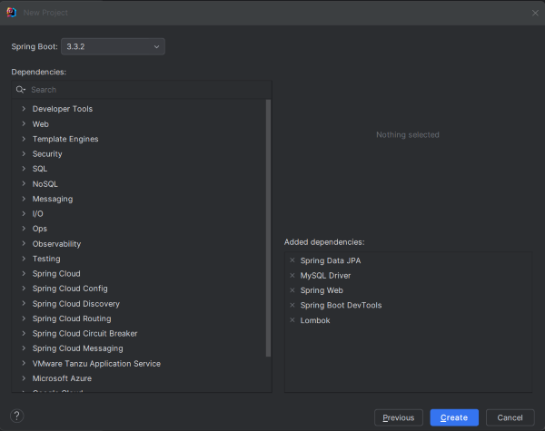
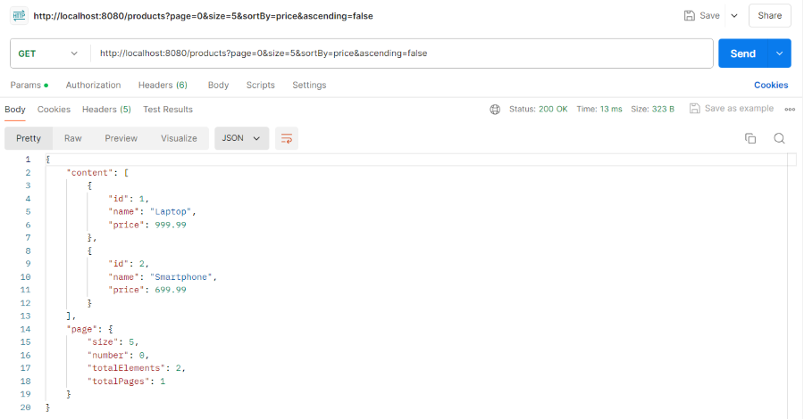

BUỔI 5 Tối ưu JPA, Validation và Exception handling
Nội dung cần chuẩn bị.
Các phương pháp tối ưu JPA
# Lazy / Eager initialization

## Tải Tạm Hoãn (Lazy Loading) so với Tải Nhanh (Eager Loading)

Cả **Tải Tạm Hoãn (Lazy Loading)** và **Tải Nhanh (Eager Loading)** đều là các chiến lược để quản lý cách dữ liệu được truy xuất từ cơ sở dữ liệu hoặc API trong quá trình phát triển ứng dụng, đặc biệt là trong Thiết kế Hệ thống. Tải Tạm Hoãn trì hoãn việc tải dữ liệu liên quan cho đến khi nó thực sự được truy cập, trong khi Tải Nhanh truy xuất tất cả dữ liệu cần thiết chỉ trong một truy vấn duy nhất.

Các chủ đề chúng ta sẽ khám phá:

-----

## Tải Tạm Hoãn (Lazy Loading) là gì?

Tải Tạm Hoãn có nghĩa là các thực thể liên quan chỉ được tìm nạp khi chúng được truy cập lần đầu tiên. Hibernate sử dụng các đối tượng proxy để đạt được hành vi này.

  * Là **mặc định** cho các mối quan hệ `@OneToMany` và `@ManyToMany`.
  * Việc tìm nạp xảy ra theo yêu cầu, giảm bộ nhớ ban đầu và tải cơ sở dữ liệu.

**Ví dụ:**

```java
@Entity
public class Department {
    @Id
    @GeneratedValue(strategy = GenerationType.IDENTITY)
    private int id;

    private String name;

    @OneToMany(mappedBy = "department", fetch = FetchType.LAZY)
    private List<Employee> employees;
}
```

**Giải thích:**

`fetch = FetchType.LAZY` yêu cầu Hibernate **không** tải danh sách nhân viên (`employees`) cho đến khi phương thức `getEmployees()` được gọi.

### Lợi ích của Tải Tạm Hoãn

  * Chỉ dữ liệu cần thiết được tải, cải thiện hiệu suất khởi động của ứng dụng.
  * Bộ nhớ chỉ được tiêu thụ khi dữ liệu được truy cập, làm cho nó tối ưu cho các bộ dữ liệu lớn.
  * Chỉ dữ liệu cần thiết được truyền đi, giảm việc sử dụng băng thông.

### Hạn chế của Tải Tạm Hoãn

  * Khi dữ liệu cuối cùng được yêu cầu, nó có thể gây ra độ trễ vì dữ liệu bổ sung cần được tải.
  * Có thể dẫn đến nhiều lệnh gọi cơ sở dữ liệu, làm tăng tổng số yêu cầu.
  * Yêu cầu logic phức tạp hơn để xử lý việc tải dữ liệu bị trì hoãn.

-----

## Tải Nhanh (Eager Loading) là gì?

Tải Nhanh là một chiến lược trong đó tất cả dữ liệu cần thiết, bao gồm cả dữ liệu liên quan, được tải ngay từ đầu trong một yêu cầu duy nhất, đảm bảo truy cập tức thì vào tất cả thông tin cần thiết.

  * Là **mặc định** cho các mối quan hệ `@ManyToOne` và `@OneToOne`.
  * Hibernate thực hiện các truy vấn `join` hoặc các truy vấn bổ sung để tìm nạp dữ liệu liên kết.

**Ví dụ:**

```java
@Entity
public class Employee {
    @Id
    @GeneratedValue(strategy = GenerationType.IDENTITY)
    private int id;

    private String name;

    @ManyToOne(fetch = FetchType.EAGER)
    @JoinColumn(name = "department_id")
    private Department department;
}
```

**Giải thích:**

`fetch = FetchType.EAGER` đảm bảo rằng phòng ban (`department`) được tải ngay lập tức cùng với đối tượng Nhân viên (`Employee`).

### Lợi ích của Tải Nhanh

  * Tất cả dữ liệu cần thiết được tải ngay từ đầu, đảm bảo không có độ trễ khi truy cập dữ liệu liên quan.
  * Thường có thể giảm số lượng truy vấn cơ sở dữ liệu bằng cách tìm nạp tất cả dữ liệu trong một lần.
  * Tất cả dữ liệu có sẵn ngay lập tức, không cần logic phức tạp để tải dữ liệu liên quan sau này.

### Hạn chế của Tải Nhanh

  * Việc tải tất cả dữ liệu cùng một lúc có thể dẫn đến thời gian khởi động ứng dụng hoặc tải trang chậm hơn.
  * Việc tìm nạp tất cả dữ liệu liên quan cùng một lúc có thể tiêu thụ nhiều bộ nhớ hơn.
  * Truy xuất nhiều dữ liệu hơn mức cần thiết, dẫn đến lãng phí trong xử lý dữ liệu và băng thông.

-----

## Các Trường Hợp Sử Dụng

### Tải Tạm Hoãn (Lazy Loading)

  * **Bảng tin Mạng xã hội:** Tải bảng tin của người dùng và chỉ tìm nạp hình ảnh hoặc video khi họ cuộn hoặc nhấp vào bài đăng.
  * **Trang web nặng nội dung:** Các trang tin tức hoặc cửa hàng thương mại điện tử nơi các chi tiết sản phẩm, đánh giá hoặc hình ảnh bổ sung được tìm nạp khi người dùng tương tác với nội dung.

### Tải Nhanh (Eager Loading)

  * **Bảng điều khiển nhiều dữ liệu (Data-Dense Dashboards):** Các ứng dụng như hệ thống CRM hoặc bảng điều khiển phân tích cần tất cả dữ liệu có sẵn ngay từ đầu để hiển thị nhiều thực thể liên quan.
  * **Hệ thống Báo cáo:** Các báo cáo tài chính hoặc kinh doanh kéo tất cả dữ liệu liên quan để hiển thị ngay lập tức, đảm bảo không cần truy vấn bổ sung nào sau đó.

-----

##  Sự Khác Biệt Giữa Tải Tạm Hoãn và Tải Nhanh

| Tải Tạm Hoãn (Lazy Loading) | Tải Nhanh (Eager Loading) |
| :--- | :--- |
| Dữ liệu chỉ được tải khi được truy cập. | Dữ liệu được tải ngay từ đầu với yêu cầu ban đầu. |
| Tải ban đầu nhanh hơn. | Tải ban đầu chậm hơn. |
| Chỉ sử dụng bộ nhớ cho dữ liệu được truy cập. | Sử dụng bộ nhớ cao hơn do tìm nạp tất cả dữ liệu. |
| Có thể dẫn đến nhiều truy vấn. | Thông thường ít truy vấn hơn. |
| Yêu cầu mã phức tạp hơn để tải trì hoãn. | Mã đơn giản hơn vì tất cả dữ liệu có sẵn ngay từ đầu. |
| Sử dụng ít băng thông hơn ban đầu. | Có thể sử dụng nhiều băng thông hơn nếu tìm nạp dữ liệu không cần thiết. |
| Ứng dụng với việc tìm nạp dữ liệu có điều kiện. | Ứng dụng nơi cần tất cả dữ liệu ngay từ đầu. |
# Pagination

## Tổng Quan về Phân trang và Sắp xếp với Spring Data JPA

Khi ứng dụng của bạn phải làm việc với các tập dữ liệu lớn, việc tải tất cả các bản ghi cùng một lúc là **không hiệu quả** và có thể gây ảnh hưởng tiêu cực đến **hiệu suất** và trải nghiệm người dùng. **Spring Data JPA** cung cấp các công cụ mạnh mẽ, tích hợp sẵn để xử lý Phân trang (Pagination) và Sắp xếp (Sorting) một cách dễ dàng.

### 1\. Phân trang (Pagination)

Phân trang là kỹ thuật chia một tập dữ liệu lớn thành các "trang" nhỏ hơn, dễ quản lý hơn, chỉ lấy từng trang một khi cần.

  * **Ví dụ:** Thay vì tải 1.000 hồ sơ khách hàng, bạn có thể tải 10 hồ sơ cho mỗi trang.
  * **Lợi ích:** Giảm tải bộ nhớ, tăng tốc độ phản hồi API, và cải thiện trải nghiệm người dùng bằng cách hiển thị dữ liệu theo từng phần.

### 2\. Sắp xếp (Sorting)

Sắp xếp cho phép bạn sắp xếp các bản ghi theo thứ tự tăng dần (ascending) hoặc giảm dần (descending) dựa trên một hoặc nhiều trường dữ liệu.

  * **Ví dụ:** Sắp xếp danh sách sản phẩm theo tên (A-Z) hoặc theo giá (thấp đến cao).
  * **Lợi ích:** Cải thiện khả năng trình bày dữ liệu và giúp người dùng tìm kiếm thông tin hiệu quả hơn.

### Các Class/Interface quan trọng trong Spring Data JPA:

  * **`Pageable`**: Một interface đại diện cho thông tin phân trang (số trang, kích thước trang) và sắp xếp.
  * **`PageRequest`**: Một lớp triển khai của `Pageable`, dùng để tạo đối tượng phân trang với các tham số cụ thể.
  * **`Sort`**: Một lớp đại diện cho thông tin sắp xếp (trường sắp xếp, hướng sắp xếp).
  * **`Page<T>`**: Một interface được trả về bởi các phương thức phân trang của Repository. Nó chứa danh sách các phần tử (dữ liệu của trang hiện tại), cùng với siêu dữ liệu (metadata) về phân trang như tổng số trang, tổng số phần tử, số trang hiện tại, v.v.

-----

## Triển Khai: Phân trang và Sắp xếp trong Spring Data JPA

Dưới đây là các bước chi tiết để triển khai Phân trang và Sắp xếp trong dự án Spring Boot của bạn.

### Bước 1: Tạo Dự án Spring Boot

Tạo một dự án Spring Boot mới (ví dụ: `spring-sorting-pagination-demo`).

### Bước 2: Thêm các Dependencies (Phụ thuộc)

Thêm các phụ thuộc cần thiết vào file `pom.xml` (nếu dùng Maven):

  * `spring-boot-starter-data-jpa`: Hỗ trợ JPA và Spring Data.
  * `spring-boot-starter-web`: Xây dựng RESTful API.
  * `mysql-connector-j` (hoặc driver cơ sở dữ liệu khác): Kết nối với MySQL.
  * `lombok`: Giúp giảm mã boilerplate (tùy chọn).

<!-- end list -->

```xml
<dependency>
    <groupId>org.springframework.boot</groupId>
    <artifactId>spring-boot-starter-data-jpa</artifactId>
</dependency>
<dependency>
    <groupId>org.springframework.boot</groupId>
    <artifactId>spring-boot-starter-web</artifactId>
</dependency>
<dependency>
    <groupId>com.mysql</groupId>
    <artifactId>mysql-connector-j</artifactId>
    <scope>runtime</scope>
</dependency>
<dependency>
    <groupId>org.projectlombok</groupId>
    <artifactId>lombok</artifactId>
    <optional>true</optional>
</dependency>
```

### Bước 3: Cấu hình Application Properties

Cấu hình thông tin kết nối cơ sở dữ liệu và cài đặt JPA/Hibernate trong file `application.properties`:

```properties
spring.application.name=spring-sorting-pagination-demo
spring.datasource.url=jdbc:mysql://localhost:3306/product_db
spring.datasource.username=root
spring.datasource.password=mypassword
spring.datasource.driver-class-name=com.mysql.cj.jdbc.Driver

# Cấu hình Hibernate
spring.jpa.hibernate.ddl-auto=update
spring.jpa.show-sql=true
spring.jpa.properties.hibernate.dialect=org.hibernate.dialect.MySQL8Dialect
```

### Bước 4: Tạo Lớp Entity (`Product.java`)

Định nghĩa mô hình dữ liệu (Entity) cho sản phẩm:

```java
package com.gfg.springsortingpaginationdemo;

import jakarta.persistence.*;
import lombok.*;

@Entity
@Data // Tạo getters, setters, toString, equals, hashCode (sử dụng Lombok)
@NoArgsConstructor
@AllArgsConstructor
@Table(name = "products") // Đặt tên bảng rõ ràng hơn (tùy chọn)
public class Product {
    @Id
    @GeneratedValue(strategy = GenerationType.IDENTITY)
    private Long id;
    private String name;
    private Double price;
}
```

### Bước 5: Tạo Interface Repository (`ProductRepository.java`)

Repository là nơi giao tiếp với cơ sở dữ liệu.

  * **Lưu ý quan trọng:** Interface **`JpaRepository`** kế thừa từ **`PagingAndSortingRepository`**, vì vậy chỉ cần mở rộng `JpaRepository` là bạn đã có sẵn các phương thức Phân trang và Sắp xếp (như `findAll(Pageable pageable)`).

<!-- end list -->

```java
package com.gfg.springsortingpaginationdemo;

import org.springframework.data.jpa.repository.JpaRepository;
import org.springframework.stereotype.Repository;

@Repository
public interface ProductRepository extends JpaRepository<Product, Long> {
    // Các phương thức phân trang và sắp xếp được kế thừa từ JpaRepository
}
```

### Bước 6: Tạo Lớp Service (`ProductService.java`)

Lớp Service chứa logic nghiệp vụ. Nó sử dụng Repository để truy vấn dữ liệu.

```java
package com.gfg.springsortingpaginationdemo;

import org.springframework.data.domain.*;
import org.springframework.stereotype.Service;

@Service
public class ProductService {

    private final ProductRepository productRepository;

    public ProductService(ProductRepository productRepository) {
        this.productRepository = productRepository;
    }

    /**
     * Tìm tất cả sản phẩm theo thông tin Phân trang và Sắp xếp được cung cấp.
     * * @param pageable đối tượng Pageable chứa số trang, kích thước trang và sắp xếp.
     * @return một đối tượng Page<Product> chứa dữ liệu trang và metadata.
     */
    public Page<Product> findAll(Pageable pageable) {
        return productRepository.findAll(pageable);
    }
}
```

### Bước 7: Tạo Lớp Controller (`ProductController.java`)

Controller xử lý các yêu cầu HTTP và chuẩn bị đối tượng `Pageable` dựa trên các tham số truy vấn (query parameters).

```java
package com.gfg.springsortingpaginationdemo;

import org.springframework.data.domain.*;
import org.springframework.web.bind.annotation.*;

@RestController
@RequestMapping("/products")
public class ProductController {

    private final ProductService productService;

    public ProductController(ProductService productService) {
        this.productService = productService;
    }

    @GetMapping
    public Page<Product> getAllProducts(
            @RequestParam(defaultValue = "0") int page, // Trang mặc định là 0
            @RequestParam(defaultValue = "5") int size, // Kích thước trang mặc định là 5
            @RequestParam(defaultValue = "id") String sortBy, // Sắp xếp mặc định theo trường 'id'
            @RequestParam(defaultValue = "true") boolean ascending) { // Mặc định là tăng dần

        // 1. Tạo đối tượng Sort
        Sort sort = ascending 
                    ? Sort.by(sortBy).ascending() 
                    : Sort.by(sortBy).descending();
        
        // 2. Tạo đối tượng Pageable
        Pageable pageable = PageRequest.of(page, size, sort);
        
        // 3. Gọi Service và trả về kết quả
        return productService.findAll(pageable);
    }
}
```

### Bước 8: Lớp Main Class

Lớp ứng dụng chính, nơi ứng dụng được khởi chạy.

  * Sử dụng `@EnableSpringDataWebSupport` để cho phép Spring tự động chuyển đổi các tham số HTTP thành đối tượng `Pageable` (mặc dù trong ví dụ này ta đang tự làm thủ công trong Controller, đây là một thực hành tốt).

<!-- end list -->

```java
package com.gfg.springsortingpaginationdemo;

import org.springframework.boot.SpringApplication;
import org.springframework.boot.autoconfigure.SpringBootApplication;
import org.springframework.data.web.config.EnableSpringDataWebSupport;

@SpringBootApplication
@EnableSpringDataWebSupport(pageSerializationMode = EnableSpringDataWebSupport.PageSerializationMode.VIA_DTO)
public class SpringSortingPaginationDemoApplication {

    public static void main(String[] args) {
        SpringApplication.run(SpringSortingPaginationDemoApplication.class, args);
    }

}
```

-----

## Kiểm tra Endpoint

Sau khi chạy ứng dụng (ví dụ: trên cổng 8080), bạn có thể kiểm tra các trường hợp phân trang và sắp xếp khác nhau.

**Giả sử bạn đã có một số dữ liệu mẫu trong bảng `products`.**

| URL Request | Mô tả |
| :--- | :--- |
| `http://localhost:8080/products` | Mặc định: Lấy **trang 0**, **5 bản ghi/trang**, sắp xếp theo **id** (tăng dần). |
| `http://localhost:8080/products?page=1&size=10` | Lấy **trang 1**, **10 bản ghi/trang**, sắp xếp mặc định theo id. |
| `http://localhost:8080/products?page=0&size=5&sortBy=price&ascending=false` | Lấy **trang 0**, **5 bản ghi/trang**, sắp xếp theo **giá** (giảm dần). |
| `http://localhost:8080/products?sortBy=name` | Sắp xếp theo **tên** (tăng dần), sử dụng kích thước trang và số trang mặc định. |

### Ví dụ về Output (Định dạng `Page<Product>`)

Khi gọi API, bạn sẽ nhận được một đối tượng JSON có dạng:

```json
{
    "content": [
        // Danh sách các đối tượng Product (dữ liệu thực tế của trang)
        { "id": 6, "name": "Laptop X", "price": 1200.0 },
        { "id": 7, "name": "Mouse Y", "price": 25.0 }
    ],
    "pageable": {
        // Thông tin phân trang yêu cầu
        "pageNumber": 1,
        "pageSize": 5,
        "sort": { /* ... */ }
    },
    "totalPages": 20,          // Tổng số trang có thể có
    "totalElements": 100,      // Tổng số bản ghi trong DB
    "last": false,             // Có phải trang cuối cùng không
    "size": 5,                 // Kích thước trang
    "number": 1,               // Số trang hiện tại (bắt đầu từ 0)
    "first": false,            // Có phải trang đầu tiên không
    "numberOfElements": 5,     // Số phần tử trong trang hiện tại
    "empty": false
}
```

-----

# Caching


## A. Caching là gì?

**Caching** là một kỹ thuật trong lập trình máy tính được sử dụng để **lưu trữ tạm thời** các dữ liệu, kết quả của các phép toán, hoặc các tài nguyên có thể được truy cập một cách **nhanh chóng**. Mục tiêu của caching là **giảm thời gian truy cập dữ liệu**, tăng cường hiệu suất và giảm gánh nặng cho hệ thống.

Khi một ứng dụng yêu cầu dữ liệu, trước hết nó sẽ kiểm tra xem dữ liệu đã được lưu trong **bộ nhớ cache** hay chưa.

  * Nếu dữ liệu đã tồn tại trong cache (**Cache Hit**), ứng dụng sẽ lấy nhanh chóng từ đó thay vì phải truy cập vào nơi lữu trữ gốc (ví dụ: cơ sở dữ liệu, API, hoặc tệp tin).
  * Nếu dữ liệu không có trong cache (**Cache Miss**), ứng dụng sẽ lấy từ nơi lưu trữ gốc và sau đó lưu vào cache để sử dụng cho các lần truy cập sau.

Caching thường được sử dụng để giảm độ trễ, tăng tốc độ xử lý, và giảm tải cho nguồn lực hệ thống. Các kỹ thuật caching có thể áp dụng cho nhiều loại dữ liệu và tài nguyên, bao gồm dữ liệu cơ sở dữ liệu, kết quả của phương thức tính toán, tệp tin tĩnh, và nhiều hơn nữa.

### Ví dụ trong thực tế: Quán Cà phê Muối

Giả sử bạn là chủ nhân của một quán cà phê nổi tiếng. Thức uống phổ biến nhất là "Cà phê muối".

Thay vì mỗi lần khách hàng order, bạn phải vào bếp pha chế từ đầu, bạn tạo ra một khu vực nhỏ trên quầy để lưu trữ sẵn một số lượng Cà phê muối đã được chuẩn bị sẵn. Điều này giống như một **"khu vực nhớ" (bộ nhớ cache)** nơi bạn lưu trữ dữ liệu thường xuyên được sử dụng.

  * Khi khách hàng đặt Cà phê muối, bạn kiểm tra khu vực nhớ trước.
  * **Nếu có sẵn (Cache Hit):** Bạn lấy ra và phục vụ ngay lập tức.
  * **Nếu không có sẵn (Cache Miss):** Bạn pha chế từ đầu (từ nơi lưu trữ gốc) và sau đó lưu vào khu vực nhớ cho các lần sau.

Quy trình này giúp tiết kiệm thời gian và đảm bảo sự phục vụ nhanh chóng.

-----

## B. Ưu điểm của Caching

Caching được sử dụng bởi hầu hết các ứng dụng vì những ưu điểm vượt trội sau:

1.  **Tăng hiệu suất**
    Caching giảm thời gian truy cập dữ liệu từ nơi lưu trữ gốc, giúp ứng dụng hoạt động nhanh chóng hơn từ đó góp phần rất lớn giúp cho ứng dụng của bạn tăng hiệu suất làm việc.

      * *Ví dụ:* Một trang web sử dụng caching để lưu trữ tạm thời hình ảnh và tệp CSS, giảm thời gian tải trang cho người dùng.

2.  **Giảm Gánh Nặng Cho Cơ Sở Dữ Liệu**
    Caching giảm số lượng truy vấn trực tiếp đến cơ sở dữ liệu (DB), giảm áp lực lên DB và cải thiện hiệu suất hệ thống. Trong các ứng dụng lớn với hàng trăm, hàng ngàn query vào cơ sở dữ liệu mỗi giây, caching là một giải pháp cứu cánh.

      * *Ví dụ:* Một ứng dụng di động sử dụng caching để lưu trữ kết quả từ API và tránh việc gửi yêu cầu đến máy chủ mỗi lần người dùng mở ứng dụng.

3.  **Cải Thiện Trải Nghiệm Người Dùng**
    Caching giúp cung cấp trải nghiệm người dùng mượt mà hơn và giảm độ trễ vì kết quả được trả về nhanh hơn từ bộ nhớ cache.

4.  **Cải Thiện Độ Ổn Định Hệ Thống**
    Caching giúp cải thiện độ ổn định của hệ thống bằng cách giảm độ trễ và gánh nặng xử lý, giúp hệ thống chạy mượt mà hơn, đặc biệt trong các tình huống tải cao.

      * *Ví dụ:* Một ứng dụng trò chơi trực tuyến sử dụng caching để lưu trữ thông tin về người chơi và giảm độ trễ (latency) trong quá trình chơi game.

-----

## C. Những lưu ý khi sử dụng Caching

Quản lý dữ liệu cache là phần khó khăn nhất để đảm bảo caching mang lại hiệu quả. Dưới đây là những lưu ý quan trọng:

1.  **Rủi Ro Dữ Liệu Lỗi Thời (Stale Data)**
    Nếu dữ liệu trong cache không được cập nhật thường xuyên, nó có thể dẫn đến việc sử dụng dữ liệu lỗi thời (stale).

      * *Ví dụ:* Một trang web tin tức không cập nhật cache đúng cách, dẫn đến việc hiển thị tin tức cũ cho người đọc.
      * **Giải pháp:** Cần kiểm tra và cập nhật dữ liệu trong cache thường xuyên hoặc sử dụng các cơ chế xóa/loại bỏ cache (eviction).

2.  **Quản Lý Thời Gian Sống (Time-to-Live - TTL) Cẩn Thận**
    Thiết lập thời gian sống (TTL) phù hợp với tính chất của dữ liệu và mức độ thay đổi. Cần tính toán kỹ lưỡng để tránh dữ liệu lỗi thời hoặc re-fresh (tải lại) quá nhiều khiến việc cache trở nên vô nghĩa.

      * *Ví dụ:* Dữ liệu về tỷ giá hối đoái nên có TTL ngắn (vài phút), trong khi thông tin sản phẩm ít thay đổi có thể có TTL dài hơn (vài giờ).

3.  **Quản Lý Bộ Nhớ Hiệu Quả**
    Caching có thể làm tăng tiêu tốn bộ nhớ (RAM), đặc biệt là khi lưu trữ lượng dữ liệu lớn. Cần kiểm soát lượng bộ nhớ sử dụng cho caching để tránh tình trạng chiếm dụng bộ nhớ quá mức.

4.  **Xác Định Rõ Mục Tiêu và Áp dụng chiến lược hợp lý**
    Đặt rõ mục tiêu bạn muốn đạt được với caching (tăng tốc độ, giảm áp lực DB, cải thiện trải nghiệm) từ đó lựa chọn chiến lược caching (như **Cache-Aside**, **Read-Through**, **Write-Through**) phù hợp với yêu cầu và tính chất của ứng dụng.

-----

## D. Các phương pháp caching dữ liệu trong Java Spring Boot

Có nhiều cách để caching dữ liệu, thường được chia thành các loại sau:

### 1\. Spring Cache Abstraction

Đây là một API trừu tượng của Spring Framework giúp bạn dễ dàng tích hợp với các trình quản lý cache thực tế (như EhCache, Caffeine, Redis) mà không cần quan tâm đến việc thực hiện cụ thể.

#### a. Làm việc với Spring Cache Abstraction

  * **`@Cacheable`**: Đánh dấu một phương thức để cache kết quả. Nếu dữ liệu đã có trong cache, nó được trả về ngay lập tức (Cache Hit).
  * **`@CacheEvict`**: Dùng để loại bỏ dữ liệu khỏi cache (xóa một mục cụ thể hoặc toàn bộ cache).
  * **`@CachePut`**: Luôn thực hiện phương thức và cập nhật kết quả mới vào cache, hữu ích khi cần cập nhật dữ liệu.
  * **`@Caching`**: Cho phép gộp nhiều hoạt động cache (ví dụ: `@Cacheable` và `@CachePut`) vào một phương thức.
  * **`@CacheConfig`**: Dùng để chia sẻ các thuộc tính cache giữa các phương thức trong một lớp.

#### b. Tính linh hoạt và cấu hình

Spring Cache linh hoạt, hỗ trợ cả **cache in-memory** (EhCache, Caffeine) và **cache phân tán** (Redis, Hazelcast). Nếu không cấu hình trình quản lý cụ thể, Spring Boot sẽ tạo ra một **`SimpleCacheManager`** với **`ConcurrentMapCache`** mặc định, là một giải pháp **in-memory** cơ bản.

#### c. Ví dụ sử dụng

**Bước 1: Thêm Dependencies**
Thêm `spring-boot-starter-cache` vào `pom.xml`:

```xml
<dependency>
    <groupId>org.springframework.boot</groupId>
    <artifactId>spring-boot-starter-cache</artifactId>
</dependency>
```

**Bước 2: Kích hoạt Caching**
Thêm `@EnableCaching` vào một class cấu hình Java:

```java
import org.springframework.cache.annotation.EnableCaching;
import org.springframework.context.annotation.Configuration;

@Configuration
@EnableCaching
public class CacheConfig {
    // Mặc định, Spring Boot sử dụng SimpleCacheManager
}
```

**Bước 3: Sử Dụng Caching trong Service**
Sử dụng `@Cacheable` để cache kết quả của phương thức:

```java
import org.springframework.cache.annotation.Cacheable;
import org.springframework.stereotype.Service;

@Service
public class BookService {

    @Cacheable("books") // Tên cache là "books"
    public Book getBookByIsbn(String isbn) {
        // ... (Phương thức tốn kém thời gian để thực hiện)
        return findBookInDatabase(isbn);
    }
}
```

**Tùy chỉnh Cache Key và Eviction:**

```java
import org.springframework.cache.annotation.CacheEvict;
import org.springframework.cache.annotation.CachePut;

@Service
public class BookService {
    
    @Cacheable(value = "books", key = "#isbn")
    public Book getBookByIsbn(String isbn) { /* ... */ return findBookInDatabase(isbn); }

    @CachePut(value = "books", key = "#book.isbn")
    public Book updateBook(Book book) { /* ... */ return updateBookInDatabase(book); }

    @CacheEvict(value = "books", allEntries = true)
    public void evictAllBooksCache() {
        // Phương thức này sẽ xóa tất cả các mục trong cache 'books'
    }
}
```

### 2\. In-Memory Cache

**In-Memory Cache** là hình thức caching trong đó dữ liệu được lưu trữ trực tiếp trong bộ nhớ chính (**RAM**) của máy chủ, cho tốc độ truy xuất nhanh nhất.

#### a. Đặc điểm và công cụ

  * **Đặc điểm:** Tốc độ nhanh, nhưng dữ liệu bị mất khi ứng dụng tắt, bộ nhớ (RAM) có giới hạn.
  * **Công cụ phổ biến:**
      * **`HashMap`** hoặc **`ConcurrentHashMap`**: Đơn giản nhất, nhưng không hỗ trợ các tính năng quản lý cache tự động (TTL, eviction).
      * **Caffeine**: Một thư viện caching mạnh mẽ, hiệu suất cao với các cơ chế quản lý cache như **evictions** (loại bỏ theo kích thước, TTL) và **loading**.
      * **Guava Cache**: Tiền thân của Caffeine, cung cấp các tính năng tương tự.

#### b. Ví dụ sử dụng HashMap (Thủ công)

```java
import java.util.HashMap;
import java.util.Map;

public class DataCacheExample {

    private Map<String, String> dataCache = new HashMap<>();

    public String fetchData(String key) {
        String result = dataCache.get(key);

        if (result == null) {
            result = fetchDataFromSource(key); // Lấy từ nguồn
            dataCache.put(key, result); // Lưu vào cache
        }
        return result;
    }

    private String fetchDataFromSource(String key) {
        // Giả lập logic đọc từ database/API
        return "Data for key: " + key;
    }
    // ... main method để test
}
```

#### c. Ví dụ sử dụng Caffeine Cache

Caffeine Cache thường được tích hợp thông qua Spring Cache Abstraction.

**Bước 1: Thêm Dependency**
Thêm dependency Caffeine (ví dụ cho Maven):

```xml
<dependency>
    <groupId>com.github.ben-manes.caffeine</groupId>
    <artifactId>caffeine</artifactId>
    <version>3.0.0</version> </dependency>
```

**Bước 2: Cấu Hình Caffeine Cache**
Cấu hình trong `application.properties`:

```properties
# Cấu hình cho Caffeine Cache
spring.cache.caffeine.spec=maximumSize=100,expireAfterWrite=5m
```

  * `maximumSize=100`: Tối đa 100 mục trong cache.
  * `expireAfterWrite=5m`: Mỗi mục hết hạn sau 5 phút kể từ khi được viết vào cache.

Hoặc cấu hình bằng code:

```java
import org.springframework.cache.caffeine.CaffeineCacheManager;
import com.github.benmanes.caffeine.cache.Caffeine;
import java.util.concurrent.TimeUnit;

@Configuration
@EnableCaching
public class CacheConfig {

    @Bean
    public CacheManager cacheManager() {
        CaffeineCacheManager cacheManager = new CaffeineCacheManager();
        cacheManager.setCaffeine(caffeineCacheBuilder());
        return cacheManager;
    }

    Caffeine<Object, Object> caffeineCacheBuilder() {
        return Caffeine.newBuilder()
            .expireAfterWrite(10, TimeUnit.MINUTES) // TTL
            .maximumSize(100) // Kích thước tối đa
            .recordStats();
    }
}
```

### 3\. Distributed Cache

**Distributed Cache** là hệ thống cache hoạt động trên **nhiều máy chủ/nút** trong mạng. Đây là lựa chọn hàng đầu cho các ứng dụng **phân tán** (Microservices), giúp tăng khả năng mở rộng (Scalability) và chịu lỗi (Fault Tolerance).

#### a. Đặc điểm và công cụ

  * **Đặc điểm:** Dữ liệu phân tán giữa nhiều nút, cần đồng bộ hóa/sao chép, tăng khả năng mở rộng ngang, chịu lỗi cao hơn.
  * **Công cụ phổ biến:**
      * **Redis**: Cơ sở dữ liệu key-value nhanh, hỗ trợ cấu trúc dữ liệu phức tạp, thường được dùng làm cache phân tán.
      * **Memcached**: Hệ thống caching phân tán nhẹ, tập trung vào lưu trữ key-value đơn giản.
      * **Hazelcast**: Một in-memory data grid, cung cấp các cấu trúc dữ liệu phân tán và hỗ trợ transaction.

#### b. Ví dụ sử dụng Redis

(Phần chi tiết về Redis bị thiếu trong nội dung gốc, nhưng nó thường được tích hợp với Spring Cache Abstraction bằng cách thêm dependency `spring-boot-starter-data-redis` và cấu hình kết nối Redis server).

### 4\. Một vài phương pháp caching dữ liệu khác

  * **Cache with Database (2nd Level Cache):**
      * **EhCache**: Có thể sử dụng độc lập hoặc như một phần của JPA/Hibernate để caching các truy vấn và đối tượng.
  * **HTTP Caching:** Caching tại tầng HTTP bằng cách sử dụng các headers như `Cache-Control`, `Etag`, và `Last-Modified` để client/Proxy server lưu trữ kết quả.
  * **Web Browser Caching:** Tận dụng cache của trình duyệt để lưu trữ các tài nguyên tĩnh (CSS, JS, images).
  * **CDN (Content Delivery Network):** Sử dụng mạng lưới máy chủ phân tán toàn cầu để cache nội dung tĩnh và động, giúp tăng tốc độ phân phối nội dung dựa trên vị trí địa lý của người dùng.
  * **Database Caching:** Một số cơ sở dữ liệu (như MySQL) có cơ chế caching query results của riêng họ.
  * **Custom Caching Strategies:** Tùy chỉnh logic caching riêng dựa trên nhu cầu cụ thể của ứng dụng.
# Manual / Native query
## Sử Dụng Native Queries trong Spring Data JPA

**Native Queries** (Truy vấn gốc) trong JPA là cách linh hoạt và mạnh mẽ nhất để truy xuất dữ liệu, cho phép chúng ta sử dụng tất cả các tính năng độc quyền được hỗ trợ bởi cơ sở dữ liệu (RDBMS) đang sử dụng. Spring Data JPA giúp việc định nghĩa và thực thi Native Queries trở nên dễ dàng hơn.

### 1\. Định Nghĩa Native Queries

Trong JPA thuần hoặc Hibernate, việc định nghĩa và thực hiện một native query đòi hỏi nhiều bước cấu hình. Annotation **`@Query`** của Spring Data giúp loại bỏ hầu hết mã boilerplate đó.

Để định nghĩa một native query, chúng ta chú thích phương thức Repository với **`@Query`**, thiết lập thuộc tính **`nativeQuery=true`**, và cung cấp câu lệnh SQL gốc làm giá trị:

```java
@Repository
public interface AuthorRepository extends CrudRepository<Author, Long>, PagingAndSortingRepository<Author, Long> {
 
    @Query(value="select * from author a where a.first_name= :firstName", nativeQuery=true)
    List<Author> getAuthorsByFirstName(String firstName);
   
}
```

  * **Thực thi:** Chỉ cần inject Repository và gọi phương thức. Spring Data JPA sẽ thực thi câu lệnh SQL gốc được cung cấp và ánh xạ kết quả trở lại các Entity Java.

<!-- end list -->

```java
List<Author> authors = authorRepository.getAuthorsByFirstName("Janssen");
```

### 2\. Viết Thao Tác Ghi (DELETE, UPDATE) dưới dạng Native Queries

Các thao tác ghi (Write operations) như `UPDATE` hoặc `DELETE` cũng có thể được định nghĩa bằng Native Queries.

Để thực hiện thao tác ghi, chúng ta cần:

1.  Sử dụng annotation **`@Query`** với **`nativeQuery=true`**.
2.  Bổ sung annotation **`@Modifying`** để báo cho Spring Data biết đây là một thao tác sửa đổi dữ liệu.

<!-- end list -->

```java
@Repository
public interface AuthorRepository extends CrudRepository<Author, Long>, PagingAndSortingRepository<Author, Long> {
 
    // Xóa
    @Modifying
    @Query(value="delete from author a where a.last_name= :lastName", nativeQuery = true)
    void deleteAuthorByLastName(@Param("lastName") String lastName);
     
    // Cập nhật
    @Modifying
    @Query(value="update author set last_name= :lastName where first_name = :firstName", nativeQuery=true)
    void updateAuthorByFirstName(String firstName, String lastName);

}
```

-----

## 3\. Hạn Chế của Native Queries

Mặc dù mạnh mẽ, việc sử dụng Native Queries trong Spring Data JPA có ba hạn chế đáng chú ý:

1.  **Không Tự Điều Chỉnh Ngôn Ngữ SQL:**

      * Spring Data JPA và Persistence Provider (Hibernate) **không tự động điều chỉnh** truy vấn theo cú pháp SQL của một cơ sở dữ liệu cụ thể (ví dụ: cú pháp Oracle khác với MySQL).
      * **Yêu cầu:** Chúng ta phải tự đảm bảo câu lệnh SQL được cung cấp tương thích với **tất cả** các RDBMS mà ứng dụng hỗ trợ.

2.  **Yêu Cầu `countQuery` khi Phân Trang (Pagination):**

      * Đối với truy vấn **JPQL** thông thường, Spring Data JPA tự động tạo câu lệnh `COUNT` để xác định tổng số bản ghi khi sử dụng tham số `Pageable`.
      * Đối với **Native Query**, Spring Data JPA không thể tự động tạo câu lệnh `COUNT`. Chúng ta phải cung cấp câu lệnh `count query` để trả về tổng số bản ghi bằng cách sử dụng thuộc tính **`countQuery`** trong annotation `@Query`.

    <!-- end list -->

    ```java
    @Repository
    public interface AuthorRepository extends CrudRepository<Author, Long>, PagingAndSortingRepository<Author, Long> {
         
        @Query(value="select * from author a where a.last_name= ?1", 
                countQuery = "select count(id) from author a where a.last_name= ?1", // Bắt buộc phải cung cấp
                nativeQuery = true)
        Page<Author> getAuthorsByLastName(String lastname, Pageable page);
    }
    ```

      * **Trường hợp Named Native Query:** Nếu tham chiếu đến `named native query`, cần bổ sung một `named native query` riêng để đếm tổng số bản ghi và thêm hậu tố **`.count`** vào tên của nó.

    <!-- end list -->

    ```java
    @NamedNativeQuery(name = "Author.getAuthorsByLastName", 
                        query = "select * from author a where a.last_name= ?1", 
                        resultClass = Author.class)
    @NamedNativeQuery(name = "Author.getAuthorsByLastName.count", 
                        query = "select count(id) from author a where a.last_name= ?1")
    @Entity
    public class Author { ... }
    ```

3.  **Không Hỗ Trợ Sắp Xếp Động (Dynamic Sorting):**

      * Với JPQL, chúng ta có thể thêm tham số kiểu **`Sort`** hoặc **`Pageable`** vào phương thức Repository, và Spring Data sẽ tự động tạo mệnh đề `ORDER BY` dựa trên tham số đó.
      * **Native Query không hỗ trợ** tính năng sắp xếp động này. Lý do là việc phân tích cú pháp câu lệnh SQL gốc và tạo mệnh đề `ORDER BY` theo cách an toàn kiểu (type-safe) là một hoạt động phức tạp, chưa được Spring Data JPA hỗ trợ.
      * **Giải pháp:** Nếu cần sắp xếp, bạn phải tự bổ sung mệnh đề `ORDER BY` vào câu lệnh SQL gốc. Điều này làm giảm tính linh động của truy vấn.

-----

## 4\. Kết Luận Chung

Native Queries là một công cụ mạnh mẽ, mang lại sự linh hoạt tối đa khi cần tận dụng các tính năng của cơ sở dữ liệu gốc. Tuy nhiên, việc sử dụng chúng đòi hỏi nhiều công sức hơn so với **Derived Query** hoặc **Custom JPQL Query** và đi kèm với các đánh đổi quan trọng:

| Tính năng | JPQL Query | Native Query |
| :--- | :--- | :--- |
| **Linh hoạt** | Giới hạn bởi chuẩn JPA | Tối đa, sử dụng toàn bộ tính năng DB |
| **Phân trang** | Tự động tạo `COUNT` | **Cần cung cấp `countQuery` thủ công** |
| **Sắp xếp động** | Hỗ trợ tự động (`Sort`/`Pageable`) | **Không hỗ trợ** (phải tự viết `ORDER BY`) |
| **Khả năng tương thích DB** | Tương thích cao giữa các DB | **Không tương thích**, yêu cầu kiểm tra thủ công |


# Dynamic query

## Tạo Truy Vấn Động (Dynamic Queries) trong Spring Data JPA

Khi phát triển ứng dụng với Spring Data, việc xây dựng các truy vấn động dựa trên nhiều tiêu chí lựa chọn là rất phổ biến để lấy dữ liệu từ cơ sở dữ liệu.

Hướng dẫn này sẽ khám phá ba phương pháp tiếp cận chính để tạo truy vấn động trong Spring Data JPA: **Query by Example**, **Query by Specification**, và **Query by Querydsl**.

<br>

## 1\. Thiết Lập Kịch Bản Mẫu

Chúng ta sẽ sử dụng hai Entity là **`School`** và **`Student`**, với mối quan hệ **Một-Nhiều** (One-to-Many): một `School` có thể có nhiều `Student`.

### Entity School

```java
@Entity
@Table
public class School {
    @Id
    @GeneratedValue(strategy = GenerationType.IDENTITY)
    @Column
    private Long id;

    @Column
    private String name;

    @Column
    private String borough;

    @OneToMany(mappedBy = "school")
    private List<Student> studentList;

    // constructor, getters and setters
}
```

### Entity Student

```java
@Entity
@Table
public class Student {
    @Id
    @GeneratedValue(strategy = GenerationType.IDENTITY)
    @Column
    private Long id;

    @Column
    private String name;

    @Column
    private Integer age;

    @ManyToOne
    private School school;

    // constructor, getters and setters
}
```

### Repository

Định nghĩa Repository cho Entity `Student`:

```java
public interface StudentRepository extends JpaRepository<Student, Long> {
}
```

### Dữ liệu Mẫu

| Bảng | id | name | age | school\_id | borough |
| :--- | :--- | :--- | :--- | :--- | :--- |
| **School** | 1 | University of West London | | | Ealing |
| | 2 | Kingston University | | | Kingston upon Thames |
| **Student** | 1 | Emily Smith | 20 | 2 | |
| | 2 | James Smith | 20 | 3 | |
| | 3 | Maria Johnson | 22 | 1 | |
| | 4 | Michael Brown | 21 | 1 | |
| | 5 | Sophia Smith | 22 | 1 | |

Trong các phần sau, chúng ta sẽ tìm các bản ghi theo tiêu chí sau bằng ba phương pháp:

  * **`Student`** có tên kết thúc bằng **`Smith`**, **VÀ**
  * **`Student`** có **`age`** là **`20`**, **VÀ**
  * **`Student`** có **`school`** nằm ở quận **`Ealing`**.

-----

## 2\. Phương pháp Query by Example

**Query by Example** là cách đơn giản nhất trong Spring Data để tạo truy vấn dựa trên một **Entity mẫu**. Ý tưởng là tạo một đối tượng Entity, đặt các tiêu chí tìm kiếm vào các trường của nó, và sử dụng đối tượng này để tìm kiếm các thực thể khớp.

### Triển khai

Repository **`JpaRepository`** đã kế thừa interface **`QueryByExampleExecutor`**, nên không cần phải mở rộng thêm.

1.  **Tạo Entity Example:**
    Tạo một đối tượng `Student` và `School` mẫu để đưa vào ba tiêu chí lọc:

    ```java
    School schoolExample = new School();
    schoolExample.setBorough("Ealing");

    Student studentExample = new Student();
    studentExample.setAge(20);
    studentExample.setName("Smith");
    studentExample.setSchool(schoolExample);

    // Tạo Example cơ bản (chỉ hỗ trợ khớp chính xác)
    Example example = Example.of(studentExample);
    ```

2.  **Sử dụng `ExampleMatcher` cho Lọc phức tạp:**
    Nếu muốn tìm sinh viên có tên **kết thúc bằng** `"Smith"` (thay vì khớp chính xác), chúng ta cần tùy chỉnh chiến lược khớp bằng **`ExampleMatcher`**:

    ```java
    ExampleMatcher customExampleMatcher = ExampleMatcher.matching()
      .withMatcher("name", ExampleMatcher.GenericPropertyMatchers.endsWith().ignoreCase()); // Tên kết thúc bằng và không phân biệt chữ hoa/thường

    Example<Student> example = Example.of(studentExample, customExampleMatcher);
    ```

3.  **Thực hiện Truy vấn:**
    Gọi phương thức `findAll(Example)` của Repository:

    ```java
    List<Student> studentList = studentRepository.findAll(example);
    ```

### Ưu điểm & Hạn chế

  * **Ưu điểm:** Đơn giản, dễ hiểu và dễ triển khai.
  * **Hạn chế:** Chỉ hỗ trợ khớp chính xác (hoặc sử dụng `ExampleMatcher` cho một số kiểu khớp chuỗi đơn giản như `startsWith`, `endsWith`). **Không hỗ trợ** các điều kiện phức tạp hơn như "lớn hơn", "nhỏ hơn" (`greater than`, `less than`).

-----

## 3\. Phương pháp Query by Specification

**Query by Specification** cho phép tạo các truy vấn động dựa trên một tập hợp các điều kiện bằng cách sử dụng interface **`Specification`**. Phương pháp này linh hoạt hơn và hữu ích cho các yêu cầu truy vấn phức tạp hoặc cần điều chỉnh động khi runtime.

### Triển khai

1.  **Mở rộng Repository:**
    Repository phải mở rộng interface **`JpaSpecificationExecutor`** để kích hoạt chức năng này:

    ```java
    public interface StudentRepository extends JpaRepository<Student, Long>, JpaSpecificationExecutor<Student> {
    }
    ```

2.  **Định nghĩa các `Specification`:**
    Định nghĩa các phương thức tĩnh trả về `Specification<Student>` cho mỗi điều kiện lọc. Chúng ta sử dụng **`CriteriaBuilder`** để xây dựng các điều kiện lọc (Predicates).

    ```java
    public class StudentSpecification {
        // 1. Tên kết thúc bằng, không phân biệt chữ hoa/thường (LIKE)
        public static Specification<Student> nameEndsWithIgnoreCase(String name) {
            return (root, query, criteriaBuilder) ->
              criteriaBuilder.like(criteriaBuilder.lower(root.get("name")), "%" + name.toLowerCase());
        }

        // 2. Tuổi bằng (EQUAL)
        public static Specification<Student> isAge(int age) {
            return (root, query, criteriaBuilder) -> criteriaBuilder.equal(root.get("age"), age);
        }

        // 3. Quận của Trường (Sử dụng JOIN)
        public static Specification<Student> isSchoolBorough(String borough) {
            return (root, query, criteriaBuilder) -> {
                // Thực hiện JOIN từ Student sang School
                Join<Student, School> scchoolJoin = root.join("school"); 
                return criteriaBuilder.equal(scchoolJoin.get("borough"), borough);
            };
        }
    }
    ```

      * **`CriteriaBuilder`**: Giúp xây dựng các truy vấn động trong JPA theo lập trình (như `equal(...)`, `like(...)`).
      * **`Root.join(...)`**: Dùng để tham gia (JOIN) một bảng bổ sung thông qua mối quan hệ.

3.  **Thực hiện Truy vấn:**
    Kết hợp các `Specification` bằng các toán tử logic như **`.where()`** và **`.and()`** (hoặc `.or()`):

    ```java
    Specification<Student> studentSpec = Specification
      .where(StudentSpecification.nameEndsWithIgnoreCase("smith"))
      .and(StudentSpecification.isAge(20))
      .and(StudentSpecification.isSchoolBorough("Ealing"));
      
    List<Student> studentList = studentRepository.findAll(studentSpec);
    ```

### Ưu điểm & Hạn chế

  * **Ưu điểm:** Rất linh hoạt, hỗ trợ đầy đủ các biểu thức SQL (`JOIN`, `LESS THAN`, `GREATER THAN`), và cho phép kết hợp các điều kiện một cách dễ dàng.
  * **Hạn chế:** Cú pháp có thể trở nên dài dòng và khó đọc khi có nhiều điều kiện phức tạp.

-----

## 4\. Phương pháp Query by QueryDSL

**QueryDSL** giải quyết hạn chế về độ dài dòng và tính dễ đọc của `Specification` bằng cách cung cấp một framework tạo truy vấn động **an toàn kiểu (type-safe)**, trực quan và dễ đọc hơn.

### Triển khai

1.  **Thêm Dependencies và Plugin:**
    Thêm dependencies cho **`querydsl-jpa`** và **`querydsl-apt`** (Annotation Processor Tool) vào `pom.xml`. Lưu ý sử dụng classifier `jakarta` nếu dùng JPA 3.0 trở lên:

    ```xml
    <dependency>
        <groupId>com.querydsl</groupId>
        <artifactId>querydsl-jpa</artifactId>
        <version>5.1.0</version>
        <classifier>jakarta</classifier>
    </dependency>
    <dependency>
        <groupId>com.querydsl</groupId>
        <artifactId>querydsl-apt</artifactId>
        <version>5.1.0</version>
        <classifier>jakarta</classifier>
        <scope>provided</scope>
    </dependency>
    ```

    Cấu hình plugin để tự động sinh ra **lớp meta-model** (`QStudent`, `QSchool`):

    ```xml
    <plugin>
        <groupId>com.mysema.maven</groupId>
        <artifactId>apt-maven-plugin</artifactId>
        <version>1.1.3</version>
        <executions>
            <execution>
                <phase>generate-sources</phase>
                <goals>
                    <goal>process</goal>
                </goals>
                <configuration>
                    <outputDirectory>target/generated-sources</outputDirectory>
                    <processor>com.mysema.query.apt.jpa.JPAAnnotationProcessor</processor>
                </configuration>
            </execution>
        </executions>
    </plugin>
    ```

    Sau khi biên dịch, các lớp meta-model **`QStudent`** và **`QSchool`** sẽ được tạo ra.

2.  **Mở rộng Repository:**
    Repository phải mở rộng interface **`QuerydslPredicateExecutor`**:

    ```java
    public interface StudentRepository extends JpaRepository<Student, Long>, QuerydslPredicateExecutor<Student>{
    }
    ```

3.  **Thực hiện Truy vấn:**
    Sử dụng các lớp meta-model (`QStudent`) để tạo các điều kiện lọc (Predicates):

    ```java
    QStudent qStudent = QStudent.student;

    BooleanExpression predicate = qStudent.name.endsWithIgnoreCase("smith") // Tên kết thúc bằng
      .and(qStudent.age.eq(20)) // Tuổi bằng
      .and(qStudent.school.borough.eq("Ealing")); // Quận của Trường (tự động xử lý JOIN)
      
    List studentList = (List) studentRepository.findAll(predicate);
    ```

### Ưu điểm & Hạn chế

  * **Ưu điểm:** An toàn kiểu (type-safe), cú pháp trực quan, dễ đọc, và giảm thiểu lỗi do sai tên trường (vì sử dụng các trường của lớp Q-class). Tự động xử lý các mối quan hệ (JOIN) một cách rõ ràng.
  * **Hạn chế:** Cần thêm các dependency và cấu hình plugin phức tạp (mặc dù chỉ cần làm một lần).

-----

## 5\. Kết Luận

| Phương pháp | Phù hợp nhất cho | Đặc điểm chính |
| :--- | :--- | :--- |
| **Query by Example** | Các truy vấn đơn giản, khớp chính xác. | Đơn giản, sử dụng Entity mẫu, không hỗ trợ điều kiện phức tạp. |
| **Query by Specification** | Các truy vấn phức tạp vừa phải. | Hỗ trợ đầy đủ các biểu thức SQL (`JOIN`, `GREATER THAN`), sử dụng **`CriteriaBuilder`** nhưng cú pháp có thể dài dòng. |
| **Query by QueryDSL** | Các truy vấn phức tạp cao. | **An toàn kiểu**, cú pháp trực quan, dễ đọc, sử dụng các lớp meta-model **`QEntity`**. |
# Phòng tránh N + 1 query


## Vấn Đề N+1 Select: Tại Sao Nó Xảy Ra?

Chúng ta bắt đầu với vai trò của **ORM (Object-Relational Mapping)** là cầu nối giữa các **Entity** (đối tượng trong mã nguồn) và các đối tượng **Schema** (bảng) trong cơ sở dữ liệu quan hệ (RDBMS).

Trong RDBMS, chúng ta mô hình các mối quan hệ giữa các bảng thông qua **Foreign Key** (Khóa ngoại). Ví dụ, bảng `equipment` có tham chiếu khóa ngoại đến bảng `manufacturer` và bảng `equipment_items`.

### 1\. Mô hình Quan hệ trong Code và DB

Quan hệ trong cơ sở dữ liệu được ánh xạ sang các mối quan hệ logic trong code (ví dụ: JPA/Hibernate):

  * **`equipment` (N) $\rightarrow$ `manufacturer` (1):** Mối quan hệ **N:1** (Many-to-One).
  * **`equipment` (1) $\rightarrow$ `equipment_items` (N):** Mối quan hệ **1:N** (One-to-Many).

### 2\. Sự Cố Phát Sinh từ Tải Dữ liệu Lười (Lazy Loading)

Khi chúng ta truy vấn một thực thể (entity) cơ bản, ORM thường chỉ lấy dữ liệu của thực thể đó.

**Truy vấn ban đầu (1 SELECT):**

```sql
SELECT e.* FROM equipment e WHERE e.id = ?
```

Sau truy vấn này, ta chỉ có thông tin của `equipment`. Thông tin từ các bảng liên quan (`manufacturer`, `equipment_items`) chưa được tải vào ứng dụng.

Để tối ưu hiệu suất, nhiều ORM sử dụng tính năng **Tải Lười (Lazy Loading)**. Tính năng này hoãn việc tải dữ liệu của các mối quan hệ cho đến khi chúng thực sự được truy cập trong mã nguồn.

  * Nếu cần thông tin `manufacturer`, ORM sẽ tự động gửi thêm một truy vấn:
    ```sql
    SELECT m.* FROM manufacturer m INNER JOIN equipment e ON e.manufacturer_id = m.id WHERE e.id = ?
    ```
  * Nếu cần danh sách `equipment_items`, ORM sẽ gửi thêm một truy vấn khác:
    ```sql
    SELECT ei.* FROM equipment_item ei WHERE ei.equipment_id = ?
    ```

### 3\. Tái Hiện "Vấn Đề N+1 Select"

Trong ví dụ trên, để tải hoàn chỉnh thực thể `equipment` và **tất cả** các mối quan hệ của nó, chúng ta đã phải thực hiện:

$$1 (\text{truy vấn chính}) + 2 (\text{truy vấn cho các mối quan hệ}) = 3 \text{ truy vấn}$$

  * **Vấn đề N+1 Select** mô tả tình huống khi chúng ta tải một thực thể bằng **1** truy vấn `SELECT`, và sau đó là **N** truy vấn `SELECT` bổ sung để tải các mối quan hệ (dependencies) của nó.

Vấn đề này dẫn đến **hiệu suất ứng dụng kém** vì mỗi truy vấn phải chịu **chi phí không thể tránh khỏi** của chuỗi trừu tượng sau:

  * Mã ứng dụng (Application code)
  * JDBC driver
  * Mạng (Network latency)
  * Phân tích cú pháp, lập lịch và thực thi truy vấn cơ sở dữ liệu

Thay vì 3 truy vấn riêng lẻ, chúng ta **có thể** đạt được kết quả tương đương chỉ trong **1 truy vấn duy nhất** bằng cách sử dụng `JOIN`:

```sql
SELECT * FROM equipment e
LEFT JOIN manufacturer m ON e.manufacturer_id = m.id
LEFT JOIN equipment_item ei ON ei.equipment_id = e.id
WHERE e.id = ?
```

Việc thực hiện một truy vấn duy nhất với các `JOIN` **nhanh hơn đáng kể** so với việc phát hành nhiều truy vấn riêng lẻ.

-----

## Giải Pháp Cho Vấn Đề N+1

Cần hiểu rõ rằng vấn đề không phải do bản thân **Tải Lười (Lazy Loading)**. Lazy Loading rất hữu ích khi chúng ta **chỉ cần** thực thể `equipment` mà không cần các mối quan hệ của nó (khi đó 1 truy vấn `SELECT` đơn giản là đủ).

Vấn đề chỉ xảy ra khi chúng ta **cần** thực thể cùng với **một số hoặc tất cả** các mối quan hệ của nó.

Về mặt lý thuyết, giải pháp rất đơn giản: **phát hành các câu lệnh SQL khác nhau cho từng kịch bản cụ thể.**

  * Nếu chỉ cần `equipment`: Query bảng `equipment`.
  * Nếu cần `equipment` với `manufacturer`: Query `equipment` với `JOIN` đến `manufacturer`.

Bằng cách này, chúng ta vẫn hưởng lợi từ Lazy Loading trong trường hợp đơn giản và không bị ảnh hưởng bởi N+1 khi cần tải đầy đủ.

### Cơ chế Hỗ trợ trong ORM

May mắn thay, các framework ORM lớn đều hỗ trợ cơ chế này:

  * **JPA/Hibernate (từ JPA 2.1):** Chúng ta có thể sử dụng **EntityGraph** để chỉ định rõ những mối quan hệ nào cần được tải **ngay lập tức (eagerly)** trong một truy vấn cụ thể.
  * **C\# Entity Framework:** Sử dụng phương thức **`Include`** để tải các mối quan hệ lười (lazy associations) một cách **háo hức (eagerly)** khi cần.

-----

## Kết Luận

Vấn đề **N+1 Select** là một cạm bẫy hiệu suất phổ biến trong ORM, phát sinh khi các mối quan hệ lười (Lazy) được truy cập và kích hoạt nhiều truy vấn bổ sung (N truy vấn) sau truy vấn ban đầu (1 truy vấn). Giải pháp là sử dụng các tính năng của ORM (như **EntityGraph** hoặc **Include**) để chuyển từ tải lười (Lazy Loading) sang **tải háo hức (Eager Loading)** **theo yêu cầu** bằng cách sử dụng các lệnh `JOIN` hiệu quả.
# Tìm hiểu về Validation

## Sử Dụng Spring Boot Validation Starter

Spring Boot cung cấp hỗ trợ **Bean Validation** thông qua `validation starter`.

Để thêm vào dự án (sử dụng Gradle):

```gradle
implementation('org.springframework.boot:spring-boot-starter-validation')
```

Tuy nhiên, nếu bạn đã bao gồm `web starter`, `validation starter` sẽ được tự động thêm vào:

```gradle
implementation('org.springframework.boot:spring-boot-starter-web')
```

**Lưu ý:** `validation starter` thực chất chỉ thêm dependency tới một phiên bản tương thích của **Hibernate Validator**, đây là triển khai được sử dụng rộng rãi nhất của đặc tả Bean Validation.

-----

## Kiến Thức Cơ Bản về Bean Validation

Về cơ bản, **Bean Validation** hoạt động bằng cách định nghĩa các **ràng buộc (constraints)** cho các trường (field) của một class bằng cách chú thích chúng với các **annotations** nhất định.

### Các Validation Annotations Thường Dùng

| Annotation | Mô tả |
| :--- | :--- |
| **`@NotNull`** | Trường không được là `null`. |
| **`@NotEmpty`** | Trường là một Collection hoặc Array không được rỗng. |
| **`@NotBlank`** | Trường là String không được rỗng (phải có ít nhất một ký tự không phải khoảng trắng). |
| **`@Min`** / **`@Max`** | Trường số phải lớn hơn hoặc nhỏ hơn một giá trị nhất định. |
| **`@Pattern`** | Trường String phải khớp với một biểu thức chính quy (regex) nhất định. |
| **`@Email`** | Trường String phải là một địa chỉ email hợp lệ. |

**Ví dụ về Entity:**

```java
class Customer {

  @Email
  private String email;

  @NotBlank
  private String name;
  
  // ...
}
```

### Validator

Để kiểm tra xem một đối tượng có hợp lệ hay không, chúng ta truyền nó vào một **`Validator`**, đối tượng này sẽ kiểm tra các ràng buộc:

```java
Set<ConstraintViolation<Input>> violations = validator.validate(customer);
if (!violations.isEmpty()) {
  throw new ConstraintViolationException(violations);
}
```

-----

## `@Validated` và `@Valid`

Trong nhiều trường hợp, Spring tự động thực hiện validation. Thay vì tạo đối tượng `Validator` thủ công, chúng ta sử dụng các annotations sau:

  * **`@Validated`**: Là annotation cấp class, dùng để báo cho Spring biết cần validate các tham số được truyền vào một phương thức của class được chú thích.
  * **`@Valid`**: Đặt trên tham số phương thức hoặc trường (field) để báo cho Spring biết đối tượng hoặc trường đó cần được validate.

-----

## Validation Input cho Spring MVC Controller

Trong một request HTTP đến controller, có ba loại input chính chúng ta có thể validate:

1.  **Request Body** (Phần thân của yêu cầu)
2.  **Path Variables** (Biến đường dẫn)
3.  **Request Parameters** (Tham số truy vấn)

### 1\. Validating Request Body

Trong các yêu cầu POST và PUT, dữ liệu JSON/XML thường được truyền trong Request Body và được Spring tự động ánh xạ sang đối tượng Java.

**Lớp Input:**

```java
class Input {

  @Min(1)
  @Max(10)
  private int numberBetweenOneAndTen;

  @Pattern(regexp = "^[0-9]{1,3}\\.[0-9]{1,3}\\.[0-9]{1,3}\\.[0-9]{1,3}$")
  private String ipAddress;
  
  // ...
}
```

**Sử dụng `@Valid` trong Controller:**
Chúng ta chú thích tham số `@RequestBody` với **`@Valid`**:

```java
@RestController
class ValidateRequestBodyController {

  @PostMapping("/validateBody")
  ResponseEntity<String> validateBody(@Valid @RequestBody Input input) {
    return ResponseEntity.ok("valid");
  }
}
```

  * **Sử dụng `@Valid` trên các Loại phức tạp:** Nếu lớp `Input` chứa một trường là một loại phức tạp khác cần được validate, trường đó cũng cần được chú thích bằng **`@Valid`**.
  * **Xử lý Lỗi:** Nếu validation thất bại, nó sẽ kích hoạt **`MethodArgumentNotValidException`**. Mặc định, Spring dịch lỗi này thành HTTP status **400 (Bad Request)**.

### 2\. Validating Path Variables và Request Parameters

Đối với các kiểu dữ liệu nguyên thủy (`int`, `String`, v.v.) trong biến đường dẫn hoặc tham số truy vấn, cách validate hơi khác:

  * **Chú thích cấp Class:** Controller phải được chú thích bằng **`@Validated`** (cấp class).
  * **Chú thích cấp Tham số:** Các ràng buộc (ví dụ: `@Min`) được đặt trực tiếp trên tham số phương thức.

<!-- end list -->

```java
@RestController
@Validated // Bắt buộc phải có để validate tham số phương thức
class ValidateParametersController {

  @GetMapping("/validatePathVariable/{id}")
  ResponseEntity<String> validatePathVariable(
      @PathVariable("id") @Min(5) int id) { // Ràng buộc trực tiếp trên tham số
    return ResponseEntity.ok("valid");
  }
  
  @GetMapping("/validateRequestParameter")
  ResponseEntity<String> validateRequestParameter(
      @RequestParam("param") @Min(5) int param) { // Ràng buộc trực tiếp trên tham số
    return ResponseEntity.ok("valid");
  }
}
```

  * **Xử lý Lỗi:** Nếu validation thất bại, nó kích hoạt **`ConstraintViolationException`** (khác với `MethodArgumentNotValidException` của Request Body).
  * **Tùy chỉnh Xử lý Lỗi:** Theo mặc định, `ConstraintViolationException` gây ra HTTP status **500 (Internal Server Error)**. Để trả về status **400 (Bad Request)**, chúng ta cần thêm một `ExceptionHandler`:
    ```java
    @ExceptionHandler(ConstraintViolationException.class)
    @ResponseStatus(HttpStatus.BAD_REQUEST)
    ResponseEntity<String> handleConstraintViolationException(ConstraintViolationException e) {
      return new ResponseEntity<>("not valid due to validation error: " + e.getMessage(), HttpStatus.BAD_REQUEST);
    }
    ```

-----

##  Validating Input cho Spring Service Method

Chúng ta có thể validate input cho bất kỳ Spring Component nào (ví dụ: Service) bằng cách kết hợp **`@Validated`** (cấp class) và **`@Valid`** (trên tham số):

```java
@Service
@Validated // Bắt buộc phải có trên class
class ValidatingService{

    void validateInput(@Valid Input input){ // @Valid trên tham số
      // do something    
    }
}
```

  * Nếu validation thất bại, nó sẽ ném ra **`ConstraintViolationException`**.

-----

## Validating JPA Entities

Lớp phòng thủ cuối cùng cho validation là tầng persistence (JPA Entities).

  * **Hibernate** (được sử dụng bởi Spring Data) hỗ trợ Bean Validation ngay từ đầu.
  * Chỉ cần thêm các annotation ràng buộc vào các trường của Entity:

<!-- end list -->

```java
@Entity
public class Input {

  @Id
  @GeneratedValue
  private Long id;

  @Min(1)
  @Max(10)
  private int numberBetweenOneAndTen;

  @Pattern(regexp = "^[0-9]{1,3}\\.[0-9]{1,3}\\.[0-9]{1,3}\\.[0-9]{1,3}$")
  private String ipAddress;
  
  // ...  
}
```

  * Bất cứ khi nào Repository được sử dụng để lưu trữ một đối tượng vi phạm ràng buộc, nó sẽ ném ra **`ConstraintViolationException`**.
  * **Lưu ý:** Bean Validation chỉ được kích hoạt bởi Hibernate khi **`EntityManager`** được **flush** (được thực hiện tự động trong một số trường hợp, nhưng đôi khi cần thực hiện thủ công, ví dụ trong Integration Test).
  * **Tắt Validation:** Có thể tắt Bean Validation trong Spring Data repositories bằng cách đặt thuộc tính: `spring.jpa.properties.javax.persistence.validation.mode` thành `none`.

-----

##  Custom Validator với Spring Boot

Nếu các annotation có sẵn không đủ, bạn có thể tạo custom validator riêng.

### 1\. Tạo Custom Constraint Annotation (`@IpAddress`)

Một custom annotation phải có các thuộc tính sau:

  * `message`: Chỉ đến key trong `ValidationMessages.properties` để giải quyết thông báo lỗi.
  * `groups`: Cho phép định nghĩa nhóm validation (sẽ nói sau).
  * `payload`: Cho phép định nghĩa payload (ít dùng).
  * **`@Constraint(validatedBy = IpAddressValidator.class)`**: Chỉ đến lớp triển khai `ConstraintValidator`.

<!-- end list -->

```java
@Target({ FIELD })
@Retention(RUNTIME)
@Constraint(validatedBy = IpAddressValidator.class)
@Documented
public @interface IpAddress {
  String message() default "{IpAddress.invalid}";
  Class<?>[] groups() default { };
  Class<? extends Payload>[] payload() default { };
}
```

### 2\. Triển khai Validator (`IpAddressValidator`)

Lớp validator phải triển khai interface **`ConstraintValidator<A, T>`** (trong đó `A` là annotation, `T` là kiểu dữ liệu của trường).

```java
class IpAddressValidator implements ConstraintValidator<IpAddress, String> {

  @Override
  public boolean isValid(String value, ConstraintValidatorContext context) {
    // Logic kiểm tra IP (bao gồm kiểm tra octet > 255)
    // ...
    try {
      // ... kiểm tra regex và giá trị octet ...
      return true; // Hợp lệ
    } catch (Exception e) {
      return false; // Không hợp lệ
    }
  }
}
```

Sau đó, bạn có thể sử dụng `@IpAddress` như bất kỳ annotation ràng buộc nào khác.

-----

##  Validating Programmatically (Thủ công)

Nếu bạn không muốn dựa vào hỗ trợ tích hợp sẵn của Spring, bạn có thể gọi API Bean Validation trực tiếp.

### 1\. Tạo Validator thủ công (Không cần Spring)

```java
class ProgrammaticallyValidatingService {
  
  void validateInput(Input input) {
    ValidatorFactory factory = Validation.buildDefaultValidatorFactory();
    Validator validator = factory.getValidator();
    Set<ConstraintViolation<Input>> violations = validator.validate(input);
    if (!violations.isEmpty()) {
      throw new ConstraintViolationException(violations);
    }
  }
}
```

### 2\. Sử dụng Validator được Inject bởi Spring

Spring Boot cung cấp một instance **`Validator`** đã được cấu hình sẵn, bạn có thể inject nó vào Service:

```java
@Service
class ProgrammaticallyValidatingService {

  private Validator validator;

  // Spring tự động inject Validator vào constructor
  ProgrammaticallyValidatingService(Validator validator) { 
    this.validator = validator;
  }

  void validateInputWithInjectedValidator(Input input) {
    Set<ConstraintViolation<Input>> violations = validator.validate(input);
    if (!violations.isEmpty()) {
      throw new ConstraintViolationException(violations);
    }
  }
}
```

-----

## Sử Dụng Validation Groups

**Validation Groups** là tính năng cho phép bạn định nghĩa các quy tắc validation chỉ được kích hoạt trong các trường hợp sử dụng (use case) cụ thể (ví dụ: "Create" và "Update").

### 1\. Định nghĩa Marker Interfaces

Tạo các interface trống (marker interfaces) để đại diện cho các nhóm validation:

```java
interface OnCreate {}
interface OnUpdate {}
```

### 2\. Áp dụng Groups cho Constraint Annotations

Sử dụng thuộc tính `groups` trong constraint annotation:

```java
class InputWithGroups {

  @Null(groups = OnCreate.class) // Phải là NULL khi Tạo
  @NotNull(groups = OnUpdate.class) // Không được NULL khi Cập nhật
  private Long id;
  
  // ...  
}
```

### 3\. Kích hoạt Group bằng `@Validated`

Sử dụng `@Validated` (cấp class) và chỉ định nhóm validation cần kích hoạt trong `@Validated` (cấp phương thức):

```java
@Service
@Validated // Bắt buộc trên class
class ValidatingServiceWithGroups {

    @Validated(OnCreate.class) // Kích hoạt nhóm OnCreate
    void validateForCreate(@Valid InputWithGroups input){
      // do something    
    }

    @Validated(OnUpdate.class) // Kích hoạt nhóm OnUpdate
    void validateForUpdate(@Valid InputWithGroups input){
      // do something    
    }
}
```

**Lưu ý về Validation Groups:** Việc sử dụng groups có thể trở thành **anti-pattern** vì nó trộn lẫn các mối quan tâm (concerns): entity phải biết các quy tắc validation cho tất cả các use case mà nó được sử dụng.

-----

##  Xử Lý Lỗi Validation

Khi validation thất bại, chúng ta nên trả về một cấu trúc dữ liệu lỗi có ý nghĩa, chứa chi tiết về từng lỗi cho client.

### 1\. Định nghĩa Cấu trúc Lỗi

```java
public class ValidationErrorResponse {
  private List<Violation> violations = new ArrayList<>();
  // ... getter/setter/constructor
}

public class Violation {
  private final String fieldName;
  private final String message;
  // ... constructor/getter
}
```

### 2\. Tạo Global Exception Handler (`@ControllerAdvice`)

Sử dụng **`@ControllerAdvice`** để xử lý tập trung các ngoại lệ validation:

```java
@ControllerAdvice
class ErrorHandlingControllerAdvice {

  // Xử lý lỗi cho Path Variables, Request Params, Service (ConstraintViolationException)
  @ExceptionHandler(ConstraintViolationException.class)
  @ResponseStatus(HttpStatus.BAD_REQUEST)
  @ResponseBody
  ValidationErrorResponse onConstraintValidationException(
      ConstraintViolationException e) {
    ValidationErrorResponse error = new ValidationErrorResponse();
    for (ConstraintViolation violation : e.getConstraintViolations()) {
      error.getViolations().add(
        new Violation(violation.getPropertyPath().toString(), violation.getMessage()));
    }
    return error;
  }

  // Xử lý lỗi cho Request Body (MethodArgumentNotValidException)
  @ExceptionHandler(MethodArgumentNotValidException.class)
  @ResponseStatus(HttpStatus.BAD_REQUEST)
  @ResponseBody
  ValidationErrorResponse onMethodArgumentNotValidException(
      MethodArgumentNotValidException e) {
    ValidationErrorResponse error = new ValidationErrorResponse();
    for (FieldError fieldError : e.getBindingResult().getFieldErrors()) {
      error.getViolations().add(
        new Violation(fieldError.getField(), fieldError.getDefaultMessage()));
    }
    return error;
  }
}
```

`@ControllerAdvice` làm cho các phương thức xử lý ngoại lệ này khả dụng trên toàn cầu cho tất cả các controllers trong ứng dụng, đọc thông tin lỗi từ các exception và ánh xạ chúng vào cấu trúc `ValidationErrorResponse`.
# Tìm hiểu về Exception handling

##  Xử Lý Ngoại Lệ Tập Trung trong Spring Boot REST API

Xử lý ngoại lệ (Exception handling) là một phần thiết yếu trong phát triển ứng dụng, đặc biệt là khi xây dựng các **Restful API** trong **Spring Boot**. Mục tiêu là thay vì trả về một lỗi hệ thống (như HTTP Status 500) không thân thiện, chúng ta sẽ trả về một phản hồi lỗi có cấu trúc, dễ hiểu cho người dùng/client.

### 1\. Giới Thiệu các Annotation Chính

Spring Framework cung cấp một cơ chế mạnh mẽ để xử lý ngoại lệ trên toàn bộ ứng dụng bằng cách sử dụng các Annotation cấp lớp và phương thức.

| Annotation | Loại | Phạm vi | Mục đích |
| :--- | :--- | :--- | :--- |
| **`@ControllerAdvice`** | Cấp Class | Toàn cục | Định nghĩa một lớp chứa các phương thức xử lý ngoại lệ áp dụng cho **tất cả các `@Controller`** trong ứng dụng. |
| **`@RestControllerAdvice`** | Cấp Class | Toàn cục | Tương tự như `@ControllerAdvice`, nhưng kết hợp sẵn với `@ResponseBody`. Thường dùng cho **RESTful API** để trả về lỗi dưới dạng JSON/XML. |
| **`@ExceptionHandler`** | Cấp Method | Trong lớp `@Controller`/`@ControllerAdvice` | Đánh dấu một phương thức là trình xử lý cho một loại ngoại lệ cụ thể (ví dụ: `IndexOutOfBoundsException.class`). |
| **`@ResponseStatus`** | Cấp Method hoặc Class | Trong trình xử lý | Định nghĩa **HTTP status code** mà bạn muốn trả về cho client. |

-----

## Triển Khai Demo

Chúng ta sẽ xây dựng một ví dụ đơn giản để minh họa việc xử lý ngoại lệ `IndexOutOfBoundsException` khi truy cập một đối tượng không tồn tại.

### Bước 1: Thêm Dependency

Thêm dependency cần thiết cho Spring Boot Web vào file `pom.xml`:

```xml
<dependency>
    <groupId>org.springframework.boot</groupId>
    <artifactId>spring-boot-starter-web</artifactId>
</dependency>
```

### Bước 2: Tạo Model

Tạo hai đối tượng đơn giản: `Todo` (dữ liệu chính) và `ErrorMessage` (cấu trúc phản hồi lỗi):

```java
import lombok.Data;
import lombok.AllArgsConstructor;

// Đối tượng dữ liệu chính
@Data
@AllArgsConstructor
public class Todo {
    private String title;
    private String detail;
}

// Đối tượng phản hồi lỗi tùy chỉnh
@Data
@AllArgsConstructor
public class ErrorMessage {
    private int statusCode;
    private String message;
}
```

### Bước 3: Tạo Rest Controller (`RestApiController.java`)

Controller giả lập một danh sách `Todo` có sẵn. Phương thức `getTodo` sẽ ném ra `IndexOutOfBoundsException` nếu `todoId` không tồn tại trong danh sách.

```java
import org.springframework.web.bind.annotation.*;
import javax.annotation.PostConstruct;
import java.util.List;
import java.util.stream.Collectors;
import java.util.stream.IntStream;

@RestController
@RequestMapping("/api/v1")
public class RestApiController {

    private List<Todo> todoList;

    @PostConstruct
    public void init() {
        // Khởi tạo danh sách 10 đối tượng (index 0 đến 9)
        todoList = IntStream.range(0, 10)
                 .mapToObj(i -> new Todo("title-" + i, "detail-" + i))
                 .collect(Collectors.toList());
    }

    @GetMapping("/todo/{todoId}")
    public Todo getTodo(@PathVariable(name = "todoId") Integer todoId) {
        // Nếu todoId > 9, IndexOutOfBoundsException sẽ bị ném ra
        return todoList.get(todoId); 
    }
}
```

### Bước 4: Tạo Exception Handler Tập Trung (`ApiExceptionHandler.java`)

Sử dụng `@RestControllerAdvice` để áp dụng Handler này cho tất cả các Rest Controller:

```java
import org.springframework.web.bind.annotation.ExceptionHandler;
import org.springframework.web.bind.annotation.ResponseStatus;
import org.springframework.web.bind.annotation.RestControllerAdvice;
import org.springframework.web.context.request.WebRequest;
import org.springframework.http.HttpStatus;

@RestControllerAdvice
public class ApiExceptionHandler {

    /**
     * Xử lý ngoại lệ IndexOutOfBoundsException
     */
    @ExceptionHandler(IndexOutOfBoundsException.class)
    @ResponseStatus(value = HttpStatus.BAD_REQUEST) // Định nghĩa HTTP Status 400
    public ErrorMessage todoException(Exception ex, WebRequest request) {
        // Tùy chỉnh ErrorMessage được trả về
        return new ErrorMessage(10100, "Đối tượng không tồn tại");
    }
    
    // Có thể thêm nhiều @ExceptionHandler khác tại đây
}
```

  * **`@RestControllerAdvice`**: Đảm bảo rằng Spring sẽ quét class này để tìm các phương thức xử lý ngoại lệ.
  * **`@ExceptionHandler(IndexOutOfBoundsException.class)`**: Chỉ định rằng phương thức này sẽ xử lý mọi `IndexOutOfBoundsException` xảy ra trong bất kỳ Controller nào.
  * **`@ResponseStatus(value = HttpStatus.BAD_REQUEST)`**: Đặt HTTP Status code của phản hồi là **400 Bad Request**.

### Bước 5: Chạy Thử và Kiểm tra

Chạy ứng dụng Spring Boot và gửi một request với `todoId` không hợp lệ (ví dụ: `11`):

```bash
GET http://localhost:8080/api/v1/todo/11
```

**Kết quả nhận được (HTTP Status 400 Bad Request):**

```json
{
"statusCode": 10100,
"message": "Đối tượng không tồn tại"
}
```

-----

##  Tóm Lược

Việc sử dụng `@RestControllerAdvice` (hoặc `@ControllerAdvice`) kết hợp với `@ExceptionHandler` cho phép bạn tạo ra một cơ chế xử lý ngoại lệ **tập trung và đồng nhất**. Điều này giúp mã nguồn của bạn sạch sẽ hơn (bằng cách loại bỏ các khối `try-catch` lặp lại trong Controller) và cung cấp trải nghiệm người dùng/client tốt hơn bằng cách trả về các phản hồi lỗi có cấu trúc và ý nghĩa.

Bạn muốn tìm hiểu thêm về cách xử lý các loại ngoại lệ khác (ví dụ: `MethodArgumentNotValidException` trong Bean Validation) hay muốn tùy chỉnh phản hồi lỗi phức tạp hơn bằng cách sử dụng `ResponseEntity` không?
# Override default fetch plan với join fetch / entity graph

## 1\. Lý Thuyết: Tại Sao Cần Ghi Đè Chiến Lược Fetch?

### 1.1. Chiến Lược Fetch Mặc Định (Lazy vs Eager)

Trong JPA, các mối quan hệ giữa các Entity được định nghĩa với một chiến lược tải (fetch strategy) mặc định:

  * **Tải Lười (**`LAZY`**):** Dữ liệu của mối quan hệ sẽ **chưa** được tải cùng với Entity gốc. Chúng chỉ được tải khi bạn **thực sự truy cập** chúng (ví dụ: gọi phương thức `get` trong mã code). Đây là mặc định cho các mối quan hệ **1:N** (`@OneToMany`) và **N:M** (`@ManyToMany`).
  * **Tải Háo hức (**`EAGER`**):** Dữ liệu của mối quan hệ sẽ **luôn** được tải cùng với Entity gốc trong một truy vấn duy nhất. Đây là mặc định cho các mối quan hệ **N:1** (`@ManyToOne`) và **1:1** (`@OneToOne`).

### 1.2. Vấn Đề N+1 Select

Vấn đề N+1 Select thường xảy ra khi bạn lặp qua một tập hợp các Entity và truy cập một mối quan hệ **`LAZY`** của chúng.

1.  **1** truy vấn được thực hiện để lấy danh sách các Entity gốc (ví dụ: 100 đối tượng `Student`).
2.  Sau đó, một truy vấn **`SELECT`** mới được thực hiện cho mỗi lần bạn truy cập mối quan hệ `LAZY` của mỗi Entity (ví dụ: lấy `School` của từng `Student`).
3.  Tổng cộng: $1 + N$ (100) truy vấn.

Để giải quyết vấn đề này, chúng ta cần **ghi đè** chiến lược `LAZY` mặc định và buộc JPA tải các mối quan hệ cần thiết một cách **háo hức** thông qua một `JOIN` ngay trong truy vấn ban đầu.

-----

## 2\. Phương Pháp 1: Sử Dụng JOIN FETCH (JPQL)

**`JOIN FETCH`** là một cú pháp trong **JPQL (Java Persistence Query Language)** cho phép bạn chỉ định các mối quan hệ nào cần được tải ngay lập tức bằng cách sử dụng `JOIN` trong câu lệnh SQL gốc.

### Lý thuyết:

  * **Mục đích:** Buộc Persistence Provider (Hibernate) sử dụng câu lệnh `JOIN` để kéo dữ liệu của các Entity liên quan vào kết quả trả về của truy vấn chính.
  * **Cú pháp:** `SELECT e FROM Entity e JOIN FETCH e.relationship`.

### Ví dụ Code Chi tiết

Giả sử Entity **`Student`** có mối quan hệ **`@ManyToOne`** lười (lazy) với **`School`**:

```java
// Entity
@Entity
public class Student {
    // ...
    @ManyToOne(fetch = FetchType.LAZY) // Mặc định là LAZY, hoặc bạn cố tình đặt LAZY
    private School school;
    // ...
}

// Repository
public interface StudentRepository extends JpaRepository<Student, Long> {

    // 1. Ghi đè Fetch Plan với JOIN FETCH
    // Buộc tải eager mối quan hệ 'school'
    @Query("SELECT s FROM Student s JOIN FETCH s.school WHERE s.id = :studentId")
    Optional<Student> findByIdWithSchoolJoinFetch(@Param("studentId") Long studentId);

    // 2. Xử lý One-to-Many với DISTINCT (Cần thiết để tránh lặp lại dữ liệu)
    @Query("SELECT DISTINCT s FROM Student s JOIN FETCH s.school")
    List<Student> findAllStudentsWithSchoolEagerly();
}
```

### Ưu điểm:

  * **Kiểm soát trực tiếp:** Bạn có toàn quyền kiểm soát cấu trúc câu lệnh `JOIN` (dùng `INNER JOIN` hay `LEFT JOIN`).
  * **Không cần cấu hình Entity:** Không cần thêm annotation vào Entity.

### Hạn chế:

  * **Không tái sử dụng:** Phải viết lại cú pháp `JOIN FETCH` cho mỗi truy vấn cần ghi đè fetch plan.

-----

## 3\. Phương Pháp 2: Sử Dụng @EntityGraph (JPA Standard)

**`@EntityGraph`** là cơ chế được giới thiệu trong JPA 2.1, cho phép bạn định nghĩa các **"đồ thị thực thể"** (Entity Graphs) – các tập hợp thuộc tính cần được tải **eagerly** – và áp dụng chúng cho các phương thức Repository.

### Lý thuyết:

  * **Mục đích:** Tách biệt định nghĩa truy vấn với định nghĩa fetch plan. Bạn chỉ cần đặt tên cho EntityGraph hoặc mô tả nó, và JPA sẽ xử lý việc tạo câu lệnh `JOIN` (hoặc `SELECT` thứ cấp) phù hợp.
  * **Vị trí:** Có thể được định nghĩa trên Entity (`@NamedEntityGraph`) hoặc trực tiếp trên phương thức Repository (`@EntityGraph(attributePaths = {...})`).

### Ví dụ Code Chi tiết

#### Bước 1: Định nghĩa Graph (Tùy chọn)

Định nghĩa Graph trên Entity `Student` (chỉ rõ mối quan hệ `school` cần tải):

```java
@Entity
@NamedEntityGraph(
    name = "student-with-school", // Tên của Entity Graph
    attributeNodes = {
        @NamedAttributeNode("school") // Tải eagerly mối quan hệ 'school'
    }
)
public class Student {
    // ...
    @ManyToOne(fetch = FetchType.LAZY)
    private School school; 
    // ...
}
```

#### Bước 2: Áp dụng Graph vào Repository

Áp dụng `@EntityGraph` lên phương thức Repository để ghi đè fetch plan:

```java
public interface StudentRepository extends JpaRepository<Student, Long> {

    // 1. Áp dụng EntityGraph đã đặt tên
    @EntityGraph(value = "student-with-school", type = EntityGraph.EntityGraphType.LOAD)
    List<Student> findAll(Sort sort); 
    // Ghi đè: Khi gọi findAll, mối quan hệ 'school' sẽ được tải eagerly.
    
    // 2. Định nghĩa EntityGraph ẩn danh (thường dùng)
    @EntityGraph(attributePaths = {"school"}) 
    Optional<Student> findById(Long id);
    // Ghi đè: Khi gọi findById, mối quan hệ 'school' sẽ được tải eagerly.
    
    // 3. EntityGraph cho mối quan hệ lồng nhau
    @EntityGraph(attributePaths = {"school", "school.address"})
    List<Student> findAllWithSchoolAndAddress();
}
```

### Các Kiểu EntityGraph (`EntityGraphType`)

Kiểu `EntityGraph` ảnh hưởng đến cách JPA xử lý các thuộc tính **không** được chỉ định trong đồ thị:

  * **`EntityGraphType.FETCH` (Mặc định):** Các thuộc tính được chỉ định trong `@EntityGraph` là **EAGER**. Các thuộc tính **Lazy** khác **vẫn là Lazy**. Các thuộc tính **Eager** khác **vẫn là Eager**.
  * **`EntityGraphType.LOAD`:** Các thuộc tính được chỉ định trong `@EntityGraph` là **EAGER**. Các thuộc tính còn lại sẽ sử dụng chiến lược **mặc định** đã được định nghĩa trên Entity (ví dụ: nếu bạn đặt `@OneToMany(fetch = EAGER)`, nó sẽ được tôn trọng).

### Ưu điểm:

  * **Tách biệt (Separation of Concerns):** Tách biệt định nghĩa truy vấn với fetch plan.
  * **Tái sử dụng cao:** Có thể áp dụng Entity Graph cho nhiều truy vấn khác nhau.
  * **Tiêu chuẩn JPA:** Là cơ chế chuẩn, tương thích tốt hơn.

### Hạn chế:

  * **Cần cấu hình Entity:** Nếu sử dụng `@NamedEntityGraph`, cần thêm annotation vào Entity.

-----

## 4\. Tổng Kết và Khuyến Nghị

Để ghi đè fetch plan và tránh Vấn đề N+1 Select, cả hai cơ chế đều hiệu quả.

| Cơ chế | Cú pháp | Khi nào sử dụng |
| :--- | :--- | :--- |
| **`JOIN FETCH`** | `@Query("SELECT s FROM ... JOIN FETCH ...")` | Khi bạn cần **kiểm soát chính xác** câu lệnh JPQL hoặc khi EntityGraph không giải quyết được các truy vấn phức tạp. |
| **`@EntityGraph`** | `@EntityGraph(attributePaths = {...})` | **Là phương pháp ưu tiên.** Khi bạn cần sự rõ ràng, dễ bảo trì và khả năng tái sử dụng cao cho các fetch plan. |

**Khuyến nghị:** Luôn ưu tiên sử dụng **`@EntityGraph`** để ghi đè fetch plan, vì nó giúp Repository của bạn rõ ràng, không bị trộn lẫn giữa logic truy vấn và logic tải dữ liệu.
