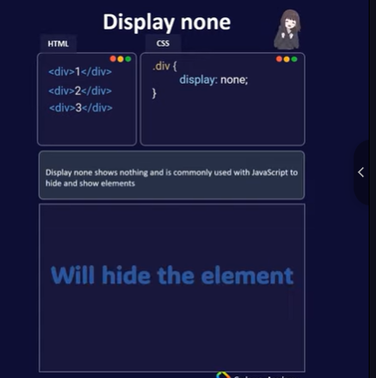

- [CSS selectors: Khái niệm, cú pháp](#css-selectors-khái-niệm-cú-pháp)
  - [Khái niệm](#khái-niệm)
  - [8 Loại CSS selectors](#8-loại-css-selectors)
    - [1. Basic CSS Selectors](#1-basic-css-selectors)
    - [2. Descendant CSS Selectors](#2-descendant-css-selectors)
    - [3. Multiple CSS Selector](#3-multiple-css-selector)
    - [4. Combination CSS Selectors](#4-combination-css-selectors)
    - [5. Sibling CSS Selectors](#5-sibling-css-selectors)
    - [6. Pseudo CSS Selectors](#6-pseudo-css-selectors)
    - [7. Pseudo CSS Selectors (link và input)](#7-pseudo-css-selectors-link-và-input)
    - [8. Attribute CSS Selectors](#8-attribute-css-selectors)
- [3 kiểu chèn CSS](#3-kiểu-chèn-css)
    - [a. Inline CSS:](#a-inline-css)
    - [b. Internal CSS:](#b-internal-css)
    - [c. External CSS:](#c-external-css)
  - [Thứ tự ưu tiên](#thứ-tự-ưu-tiên)
    - [1.Inernal, External -\> Cái nào có trước thì ưu tiên](#1inernal-external---cái-nào-có-trước-thì-ưu-tiên)
    - [2.Inline -\> 1000](#2inline---1000)
    - [3.id -\> 100](#3id---100)
    - [4.class -\> 10](#4class---10)
    - [5.tag -\> 1](#5tag---1)
    - [Equal specificity](#equal-specificity)
    - [Universal selector and inherited ?](#universal-selector-and-inherited-)
- [Colors, Backgrounds, Height, Width, Z-index, Overflow, Opacity](#colors-backgrounds-height-width-z-index-overflow-opacity)
  - [Colors](#colors)
    - [1. Cách khai báo màu:](#1-cách-khai-báo-màu)
    - [2. Áp dụng cho:](#2-áp-dụng-cho)
  - [Backgrounds](#backgrounds)
    - [1.`background-color` – Màu nền](#1background-color--màu-nền)
    - [2. `background-image` – Hình nền](#2-background-image--hình-nền)
    - [3. `background-repeat`](#3-background-repeat)
    - [4. `background-size`](#4-background-size)
    - [5. `background-position`](#5-background-position)
    - [6. background-attachment](#6-background-attachment)
    - [7. background-clip](#7-background-clip)
    - [8. background-origin](#8-background-origin)
  - [Height và Width](#height-và-width)
    - [1. Đơn vị:](#1-đơn-vị)
    - [2. Thuộc tính:](#2-thuộc-tính)
    - [3. min-width, max-width, min-height, max-height](#3-min-width-max-width-min-height-max-height)
  - [Z-index](#z-index)
    - [Dùng để xếp chồng phần tử (chỉ hoạt động với phần tử position khác static)](#dùng-để-xếp-chồng-phần-tử-chỉ-hoạt-động-với-phần-tử-position-khác-static)
  - [Overflow](#overflow)
    - [Các giá trị:](#các-giá-trị)
  - [Opacity](#opacity)
- [Box Model, Borders, Padding, Margins](#box-model-borders-padding-margins)
  - [1. Content](#1-content)
  - [2. Padding](#2-padding)
  - [3. Border](#3-border)
    - [Một số style](#một-số-style)
  - [4. Margin](#4-margin)
- [Text, Fonts, Icons, List, Table](#text-fonts-icons-list-table)
  - [1. TEXT - Thẻ văn bản trong HTML](#1-text---thẻ-văn-bản-trong-html)
    - [Các thẻ HTML thông dụng](#các-thẻ-html-thông-dụng)
  - [2. CSS Text Formatting](#2-css-text-formatting)
    - [Thuộc tính CSS thường dùng để định dạng văn bản:](#thuộc-tính-css-thường-dùng-để-định-dạng-văn-bản)
  - [3. Fonts](#3-fonts)
    - [CSS Font-family và các thuộc tính liên quan:](#css-font-family-và-các-thuộc-tính-liên-quan)
  - [4. Icons (biểu tượng)](#4-icons-biểu-tượng)
    - [Dùng Font Awesome (rất phổ biến)](#dùng-font-awesome-rất-phổ-biến)
  - [5. List - Danh sách](#5-list---danh-sách)
    - [Các loại danh sách](#các-loại-danh-sách)
  - [6. Table](#6-table)
    - [Các thẻ cơ bản tạo bảng](#các-thẻ-cơ-bản-tạo-bảng)
    - [Thuộc tính của `<table>`](#thuộc-tính-của-table)
    - [Thuộc tính của `<tr>`, `<td>`, `<th>`](#thuộc-tính-của-tr-td-th)
      - [`<tr>` (table row):](#tr-table-row)
      - [`<td>` và `<th>`:](#td-và-th)
    - [Ví dụ](#ví-dụ)
- [Display (inline, block, none)](#display-inline-block-none)
  - [Inline](#inline)
  - [Inline-Block](#inline-block)
  - [Block](#block)
  - [None](#none)
- [Position (static, fixed, realative, absolute, sticky, ...)4](#position-static-fixed-realative-absolute-sticky-4)
  - [Relative](#relative)
  - [Absolute](#absolute)
  - [Static](#static)
  - [Fixed](#fixed)
  - [Sticky](#sticky)
- [Combinator selectors](#combinator-selectors)
  - [Descendant Combinator](#descendant-combinator)
  - [Child Combinator (\>)](#child-combinator-)
  - [Next Sibling Combinator (+)](#next-sibling-combinator-)
  - [Subsequent-sibling Combinator (~)](#subsequent-sibling-combinator-)
- [Pseudo-elements](#pseudo-elements)
  - [`::before` pseudo-element](#before-pseudo-element)
  - [`::after` pseudo-element](#after-pseudo-element)
  - [`::selection` pseudo-element](#selection-pseudo-element)
  - [`::first-line` pseudo-element](#first-line-pseudo-element)
  - [`::first-letter` pseudo-element](#first-letter-pseudo-element)
- [Pseudo-classes"](#pseudo-classes)
  - [Danh sách](#danh-sách)
  - [Cách sử dụng](#cách-sử-dụng)
  - [Pseudo-classes tác động lên link](#pseudo-classes-tác-động-lên-link)
  - [. Pseudo-classes tác động lên các element trong form](#-pseudo-classes-tác-động-lên-các-element-trong-form)
- [Relative \& Absolute Units (rem, em, cm, px, ...)](#relative--absolute-units-rem-em-cm-px-)
    - [Font Units:](#font-units)
- [!important](#important)
  - [Khi nào bạn nên sử dụng quy tắc CSS!Important?](#khi-nào-bạn-nên-sử-dụng-quy-tắc-cssimportant)
- [Math Functions](#math-functions)
  - [The calc() Function](#the-calc-function)
  - [The max() Function](#the-max-function)
  - [The min() Function](#the-min-function)
- [Variables, Box Sizing, Reset CSS](#variables-box-sizing-reset-css)
  - [Variables](#variables)
    - [Khai báo](#khai-báo)
    - [Cách sử dụng](#cách-sử-dụng-1)
  - [Box Sizing](#box-sizing)
    - [Khi không có thuộc tính box-sizing của CSS](#khi-không-có-thuộc-tính-box-sizing-của-css)
    - [Với thuộc tính box-sizing của CSS](#với-thuộc-tính-box-sizing-của-css)
  - [Reset CSS](#reset-css)
    - [Tạo reset css như nào ?](#tạo-reset-css-như-nào-)
    - [Sử dụng CSS Reset:](#sử-dụng-css-reset)


# CSS selectors: Khái niệm, cú pháp 
## Khái niệm
- Hiểu đơn giản CSS Selector là thứ cho phép bạn nhắm mục tiêu tới các phần tử HTML để áp dụng các thuộc tính CSS cho chúng.

- CSS Selector giống như là đường đẫn, chỉ định để cho CSS biết bạn đang muốn điều chỉnh, tạo kiểu cho phần tử HTML nào vậy.
## 8 Loại CSS selectors
### 1. Basic CSS Selectors
- Bộ chọn CSS cơ bản (Basic CSS Selector) sử dụng chọn element / class / id.
- Chúng được sử dụng thường xuyên nhất và dễ nhớ nhất.
```html
<div id="app">
  <div class="container">
    <p class="hello">Hello</p>
    <p class="hola">Hola</p>
  </div>
  <div class="other">
    I am left behind...
  </div>
</div>
```
- Element Selector: `Element`. Nó chọn bất kỳ phần tử nào đó.

```css
p { color: blue; }
div { color: magenta; }
```

- `Class Selector`: .class. Nó chọn tất cả các phần tử có `class` đã cho.
```css
.hello {
  color: red;
}
```
- ID Selector: `#id`. Nó chọn tất cả các phần tử có `id` đã cho.
```css
#app {
  color: red;
}
```
- Universal selector: `*`. Nó chọn tất cả các phần tử.
```css
* {
  color: yellow;
}
```
### 2. Descendant CSS Selectors
- Đây là các **CSS Selector để chọn hậu duệ** của bất kỳ phần tử nào.

```html
<div class="container">
  <div class="paragraph-container">
    <p id="hola-id" class="hola-class">Hola World</p>
    <p class="hello-class">Hello World</p>
    <p class="hello-class again-class">Hello Again World</p>
  </div>
</div>
```
- Any descendant selector: `A B`. Chọn bất kỳ phần tử B nào là hậu duệ của A. Hậu duệ có thể được lồng rất sâu.
```css
.container .hello-class {
  color: red;
}
```
- Chúng ta có thể kết hợp với `*` để chọn tất cả các phần tử hậu duệ:
```css
.paragraph-container * {
  color: blue;
}
``` 
- CSS Selector trên chọn mọi phần tử bên trong `.paragraph-container`
- Child Selector: `A > B`. Không giống như *Any Descendant CSS Selector, CSS Selector này* chỉ chọn hậu duệ trực tiếp.

```css
.paragraph-container > .hello-class {
  color: blue;
}
```
- Trong khi đó, CSS Selector bên dưới sẽ không hoạt động vì class .`hello-class `trong HTML này không phải là hậu duệ trực tiếp.
```css
.container > .hello-class {
  color: blue;
}
```
### 3. Multiple CSS Selector
- Multiple CSS Selector cho phép chúng ta chọn nhiều phần tử không liên quan với nhau.
```html
<div class="container">
  <div class="paragraph-container">
    <p id="hola-id" class="hola-class">Hola world</p>
    <p class="hello-class">Hello world</p>
    <p class="hello-class again-class">Hello again world</p>
  </div>
  <p class="outside-class">I'm outside</p>
</div>
```
- Multiple CSS Selector: `A, B, C, D ... .` Để chọn nhiều phần tử / class / id.
```css
.outside-class, .again-class, .hola-class {
  color: purple;
}
```
### 4. Combination CSS Selectors
- Conbination CSS Selector cho phép bạn chọn thành phần rất cụ thể bằng nhiều tham chiếu.

- Trường hợp sử dụng phổ biến nhất là hiệu ứng làm nổi bật button khi được di chuột (hovered) / nhấp (clicked) bằng cách cung cấp cho chúng một class .active.
```html
<div class="container">
  <div class="paragraph-container">
    <p id="hola-id" class="hola-class">Hola world</p>
    <p class="hello-class">Hello world</p>
    <p class="hello-class active">Hello again world</p>
  </div>
  <p class="outside-class">I'm outside</p>
</div>
```
- Combination CSS Selector: AB. Cho phép chọn phần tử chứa cả A và B. Cú pháp trông giống như Descendant CSS Selector, ngoại trừ phần này không có khoảng trắng.
```css
p.active {
  color: yellow;
}
```
- Chúng ta có thể kết hợp nhiều thứ, không phải chỉ có class. (Nhớ là để chúng sát với nhau)
```css
p#hola-id {
  color: blue;
}
.hello-class.active {
  color: red;
}
```
### 5. Sibling CSS Selectors
- **Sibling CSS Selector** nhắm chọn các phần tử anh chị em.
```html
<div class="container">
  <div class="paragraph-container">
    <p id="hola-id" class="hola-class">Hola world</p>
    <p class="hello-class">Hello world</p>
    <p class="hello-class again-class">Hello again world</p>
  </div>
  <p class="outside-class">I'm outside</p>
</div>
```
- Bộ chọn Anh / Chị / Em liền kề (Nghiêm ngặt): `A + B`. Nhắm mục tiêu một phần tử anh chị em được đặt ngay sau phần tử đó.
```css
#hola-id + .hello-class {
  color: blue;
}
```
- Bộ chọn Anh / Chị / Em liền kề (Không nghiêm ngặt): A ~ B. Giống như bộ chọn bên trên nhưng không giới hạn 1 phần tử đầu tiên.
```css
#hola-id ~ .hello-class {
  color: purple;
}
```
- Bạn thấy không, nó chọn cả thẻ p bên dưới vì chúng là phần tử anh chị em với nhau và có class là .hello-class

- Lưu ý: Bộ chọn này không hoạt động ngược lại.

- Thế nên CSS bên dưới không hoạt động.
```css
.again-class ~ #hola-id {
  color: red
}
```
### 6. Pseudo CSS Selectors
```html
<div class="container">
  <div class="paragraph-container">
    <p id="hola-id" class="hola-class">Hola world</p>
    <p class="hello-class">Hello world</p>
    <p class="hello-class again-class">Hello again world</p>
  </div>

  <p class="outside-class">I'm outside</p>

  <ul id="list-id" class="list-class">
    <li class="list-item-class">First</li>
    <li class="list-item-class">Second</li>
    <li class="list-item-class">Third</li>
    <li class="list-item-class">Fourth</li>
    <li class="list-item-class">Fifth</li>
  </ul>

  <div class="single-paragraph-container">
    <p>I'm the only child of this span</p>
  </div>
</div>
```
- Chọn phần tử đầu tiên: `A:first-child`. Nó chọn đến phần tử con đầu tiên. (A phải có cha mẹ).
```css

li:first-child {
  color: blue;
}
```
- Chọn phần tử con cuối cùng: A:`last-child`. Hoạt động như A:`first-child`, ngoại trừ thay vì chọn phần tử con đầu tiên, nó chọn phần tử con cuối cùng.
```css
li:last-child {
  color: purple;
}
```
- Chỉ chọn phần tử con: A:`only-child`. Chọn tất cả A là con duy nhất của cha mẹ nó. Tương tự như bộ chọn phần tử con đầu tiên (A:first-child) và phần tử con cuối cùng (A:last-child). Ngoại trừ mục tiêu không được có anh chị em nào.
```css
p:only-child {
  color: red;
}
```
- Bộ chọn phần tử con thứ N: A:`nth-child(n)`. Nó chọn từng mục tiêu là con thứ n của cha mẹ nó.
```css
li:nth-child(2) {
  color: red;
}
```
- Bộ chọn con thứ N cuối cùng: A:`nth-last-child(n)`. Nó tương tự như bộ chọn con thứ N, ngoại trừ nó được tính từ cuối cùng.
```css
li:nth-last-child(2) {
  color: red;
}
```
- Không chọn: A:`not(B)`. Chọn tất cả các phần tử A mà không phải B.
```css
p:not(.outside-class) {
  color: blue;
}
```

- Bộ chọn loại đầu tiên: A:`first-of-type`. Nó chọn phần tử đầu tiên thuộc loại này trong số các phần tử anh chị em của nó.
```css
li:first-of-type {
  color: blue;
}
```
- Bộ chọn loại cuối cùng: A:last-of-type. Giống như trên, nhưng ngược lại.
```css
li:last-of-type {
  color: blue;
}
```
- Bộ chọn loại thứ N: A:`nth-of-type(n)`. Cũng giống như hai bộ chọn trên, nhưng nó chọn phần tử thứ N.
```css
li:nth-of-type(2) {
  color: blue;
}
```
- Bộ chọn Only type: A:only-of-type. Chọn phần tử chỉ có loại đó, không có Anh / Chị / Em.
```css
p:only-of-type {
  color: purple;
}
```
### 7. Pseudo CSS Selectors (link và input)
- Dưới đây là danh sách các pesudo selector khác. Chúng thường được liên kết với các liên kết (a) (mặc dù chúng có thể hoạt động với các phần tử không liên kết non-link).
```css
<div id="app">
  <a class="cheesyLink" href="#">I like cheese</a>
  <a class="sweetLink" href="#">I like donut</a>
  <div class="burger">I like cheezburger</div>
  <div class="container">
    <form onsubmit="event.preventDefault()">
      <input class="myinput"type="text" />
      <input class="mysubmit" type="submit" />
    </form>
  </div>
</div>
```
- Hover Selector: `A:hover`. Chọn phần tử được hover. Thường được sử dụng để làm nổi bật các liên kết.
```css
a:hover {
  color: red;
}

.burger:hover {
  color: red;
}
```
- Focus Selector: A:focus. Chọn phần tử bạn đang tập trung vào nó. Thường được sử dụng với input.
```css
input:focus {
  background: red;
}
```
- Active Selector: `A:active`. Chọn phần tử đang có trạng thái active.
```css
.cheesyLink:active {
  background: red;
}
```
- Lưu ý khi bạn click vào nó, nền (background) sẽ thay đổi.


- Link Selector: `A:link`. Nó chọn tất cả các link chưa được click.
```css
a:link {
  background: blue;
}
```
### 8. Attribute CSS Selectors
- Bộ chọn thuộc tính CSS (Attribute CSS Selector) sử dụng để chọn thuộc tính HTML (HTML Attributes).
```html
  <div for="chocolate">Chocolate</div>
  <div for="peanut">Peanut</div>
  <div for="butter">Butter</div>
  <div>Jelly</div>
```
- 
Bộ chọn thuộc tính cơ bản: `A[B]`. Chọn tất cả các phần tử `A` có thuộc tính `B`.
```css
div[for] {
  color: red;
}
```
- Bộ chọn thuộc tính cụ thể: `A[B="C"]`. Chọn các phần tử A có thuộc tính B với giá trị là C.
```css
div[for="chocolate"]{
  color: blue;
}
```
- Bộ chọn thuộc tính cụ thể (Bắt đầu với ...): `A[B^="C"]`. Chọn tất cả các phần tử `A` có thuộc tính `B` với giá trị bắt đầu là `C`. Ký tự `^` là ký tự thể hiện chuỗi bắt đầu (trong **Biểu thức chính quy** (Regex)).
```css
div[for^="cho"] {
  color: magenta;
}
```
- Bộ chọn thuộc tính cụ thể (Kết thúc với ...): `A[B$="C"]`. Chọn tất cả các phần tử`A` có thuộc tính `B` với giá trị kết thúc là `C`. Ký tự `$` là ký tự thể hiện chuỗi kết thúc trong (Biểu thức chính quy (Regex)).
```css
div[for$="er"] {
  color: yellow;
}
```
- 
Bộ chọn thuộc tính cụ thể (Chứ ký tự ...): `A[B*="C"]`. Chọn tất cả phần tử `A` với thuộc tính `B` chứa giá trị `C`.
```css
div[for*="ut"]{
  color: cyan;
}
```
# 3 kiểu chèn CSS
### a. Inline CSS: 
- Đây là cách thêm css trực tiếp trên thẻ html cần định dạng. Tập hợp các style css được khai báo bên trong thuộc tính style của thẻ.

- **Ưu điểm** của Internal CSS: Chỉ một trang ảnh hưởng bởi stylesheet Classes và IDs có thể được dùng bởi internal stylesheet. Không cần phải upload nhiều files. HTML và CSS có thể là một file.

- **Nhược điểm** của Internal CSS: Tăng thời gian load time. Nó ảnh hưởng tới một trang – không hữu dụng nếu bạn sử dụng cùng một CSS cho nhiều trang.
```html
<p style="color: red; font-size: 18px;">Đây là đoạn văn có màu đỏ và kích thước 18px.</p>
```
### b. Internal CSS:
- Bạn có thể đặt CSS trực tiếp trong phần của tệp HTML bằng cách sử dụng thẻ `<style>`

- **Ưu điểm** của External CSS: Kích thước trang HTML nhỏ hơn cấu trúc gọn hơn. Tốc độ load trang nhanh hơn. Một file .css có thể được dùng cho nhiều.

- **Nhược điểm** của External CSS: Cho tới khi external CSS được load lên, trang của bạn sẽ không được tải hoàn toàn.
```html
<head>
  <style>
    p {
      color: red;
      font-size: 18px;
    }
  </style>
</head>
<body>
  <p>Đây là đoạn văn có màu đỏ và kích thước 18px.</p>
</body>
```
### c. External CSS: 
- Bạn có thể tạo một tệp CSS riêng biệt (ví dụ: styles.css) và sau đó liên kết tệp CSS đó vào tệp HTML bằng thẻ .

- **Ưu điểm** của Inline CSS: Hữu dụng nếu bạn muốn test hoặc xem trước thay đổi. Hữu dụng để sửa nhanh. Số requests HTTP ít hơn.

- **Nhược điểm** của Inline CSS: Inline CSS phải được áp dụng cho mỗi element.

```html
<head>
  <link rel="stylesheet" href="styles.css">
</head>
<body>
  <p>Đây là đoạn văn có áp dụng CSS từ tệp styles.css.</p>
</body>
```

## Thứ tự ưu tiên
### 1.Inernal, External -> Cái nào có trước thì ưu tiên
### 2.Inline -> 1000
### 3.id -> 100
### 4.class -> 10
### 5.tag -> 1
### Equal specificity
### Universal selector and inherited ?

# Colors, Backgrounds, Height, Width, Z-index, Overflow, Opacity
## Colors
### 1. Cách khai báo màu:
- **Tên màu**: color: red;
- **Mã HEX**: color: #ff0000;
- **RGB**: color: rgb(255, 0, 0);
- **RGBA** (có độ trong suốt): color: rgba(255, 0, 0, 0.5);
- **HSL**: color: hsl(0, 100%, 50%);
- **HSLA**: color: hsla(0, 100%, 50%, 0.5);

### 2. Áp dụng cho:
- `color`: màu chữ

- `background-color`: màu nền

- `border-color`, `outline-color`
```css
p {
  color: white;
  background-color: black;
}
```
##  Backgrounds
### 1.`background-color` – Màu nền
```css
div {
  background-color: lightblue;
}
```
### 2. `background-image` – Hình nền
```css
div {
  background-image: url("image.jpg");
}
```
### 3. `background-repeat`
- `repeat` (mặc định)

- `no-repeat`

- `repeat-x` / `repeat-y`
```css
div {
  background-repeat: no-repeat;
}
```
### 4. `background-size`
- `cover`: bao phủ toàn bộ

- `contain`: chứa toàn bộ ảnh

- Hoặc kích thước cụ thể: 100px 200px

```css
div {
  background-size: cover;
}
```
### 5. `background-position`
```css
div {
  background-position: center top;
}
```
### 6. background-attachment
- `scroll`, `fixed`, `local`
```css
div {
  background-attachment: fixed;
}
```

### 7. background-clip
https://www.w3schools.com/cssref/playdemo.php?filename=playcss_background-clip
### 8. background-origin
https://www.w3schools.com/cssref/css3_pr_background-origin.php

## Height và Width
### 1. Đơn vị:
- px, em, %, vw, vh
### 2. Thuộc tính:
```css
div {
  width: 300px;
  height: 200px;
}
```
### 3. min-width, max-width, min-height, max-height
```css
img {
  max-width: 100%;
  height: auto;
}
```
## Z-index
### Dùng để xếp chồng phần tử (chỉ hoạt động với phần tử position khác static)
```css
div {
  position: absolute;
  z-index: 10;
}
```
- Số càng lớn thì nằm trên
- Âm được chấp nhận
## Overflow
- Quản lý nội dung tràn ra ngoài vùng hiển thị:
```css
div {
  width: 200px;
  height: 100px;
  overflow: hidden;
}
```
### Các giá trị:
- `visible` (mặc định): không cắt

- `hidden`: ẩn phần tràn ra

- `scroll`: luôn có thanh cuộn

- `auto`: có thanh cuộn nếu cần

```css
div {
  overflow: auto;
}
```
## Opacity
Điều chỉnh độ trong suốt từ 0 đến 1:
```css
div {
  opacity: 0.5; /* 50% trong suốt */
}
```
> Lưu ý: `opacity` ảnh hưởng toàn bộ phần tử và con của nó.

Nếu chỉ muốn màu nền trong suốt mà chữ không bị mờ, dùng `rgba()` hoặc `hsla()`:

```css
div {
  background-color: rgba(0, 0, 0, 0.5);
}
```

# Box Model, Borders, Padding, Margins

## 1. Content
- **Là phần "ruột" chính** của một phần tử HTML.
- Đây là nơi hiển thị **nội dung thực tế**, như: văn bản, hình ảnh, video,...
- Kích thước được xác định bằng các thuộc tính như `width` và `height`.

## 2. Padding
- **Là khoảng cách bên trong**, nằm giữa nội dung (content) và đường viền (border).
- Tạo khoảng trắng **bên trong phần tử**, giúp "nội dung không bị dính vào viền".
- Màu nền (`background-color`) **áp dụng cả cho padding**.
- Padding **hoàn toàn trong suốt** (không che nội dung khác).

```css
padding: 20px; /* Padding 20px cho cả 4 phía */
padding: 10px 15px; /* Trên-dưới 10px, trái-phải 15px */
padding: 10px 15px 5px /*Trẻn trái-phải dưới*/
padding: 5px 10px 15px 20px/*trên -> phải -> dưới -> trái
```
## 3. Border
- Là đường viền bao quanh padding và nội dung.

- Có thể tùy chỉnh độ dày, kiểu viền, màu sắc,...

- Có thể có hoặc không tùy ý (nếu không khai báo sẽ không hiển thị).
```css
border: 2px solid black; /* Viền 2px, kiểu solid, màu đen */
```
### Một số style
- `dotted` - Defines a dotted border
- `dashed` - Defines a dashed border
- `solid` - Defines a solid border
- `double` - Defines a double border
- `groove` - Defines a 3D grooved border. The effect depends on the border-color value
- `ridge` - Defines a 3D ridged border. The effect depends on the border-color value
- `inset` - Defines a 3D inset border. The effect depends on the border-color value
- `outset` - Defines a 3D outset border. The effect depends on the border-color value
- `none` - Defines no border
- `hidden` - Defines a hidden border
## 4. Margin
- Là khoảng cách bên ngoài border, tạo không gian giữa phần tử này và phần tử khác.

- Không có màu (hoàn toàn trong suốt).

- Không ảnh hưởng tới màu nền hay border của phần tử.

```css
margin: 20px; /* Margin 20px cho cả 4 phía */
margin: 10px auto; /* Trên-dưới 10px, trái-phải tự căn giữa */
```

# Text, Fonts, Icons, List, Table

---

##  1. TEXT - Thẻ văn bản trong HTML

###  Các thẻ HTML thông dụng

| Thẻ       | Chức năng                                | Ví dụ HTML                         |
|-----------|-------------------------------------------|------------------------------------|
| `<p>`     | Đoạn văn                                 | `<p>Đây là đoạn văn.</p>`          |
| `<h1>`~`<h6>` | Tiêu đề, từ lớn (h1) đến nhỏ (h6)     | `<h2>Tiêu đề phụ</h2>`             |
| `<span>`  | Thẻ nội dòng, dùng để bọc đoạn nhỏ       | `<span style="color:red">Hello</span>` |
| `<strong>`| In đậm (nhấn mạnh ngữ nghĩa)              | `<strong>Quan trọng</strong>`     |
| `<b>`     | In đậm (chỉ để làm nổi bật, không nhấn nghĩa)| `<b>In đậm</b>`                 |
| `<em>`    | In nghiêng (nhấn mạnh ngữ nghĩa)          | `<em>Ghi chú</em>`                 |
| `<i>`     | In nghiêng (không nhấn mạnh)              | `<i>Ví dụ</i>`                     |
| `<mark>`  | Bôi vàng                                 | `<mark>Chữ được đánh dấu</mark>`  |
| `<small>` | Nhỏ lại                                   | `<small>Chữ nhỏ</small>`          |
| `<del>`   | Gạch ngang văn bản                        | `<del>Giá cũ</del>`               |
| `<ins>`   | Gạch dưới (được chèn vào)                 | `<ins>Giá mới</ins>`              |

>  **Lưu ý**:
- Dùng `<strong>` và `<em>` ưu tiên hơn `<b>` và `<i>` vì có giá trị **ngữ nghĩa**, tốt cho SEO và đọc màn hình.
- `<p>` không được lồng `<p>` bên trong.

---

##  2. CSS Text Formatting

###  Thuộc tính CSS thường dùng để định dạng văn bản:

```css
selector {
  color: red;                     /* Màu chữ */
  font-size: 18px;                /* Cỡ chữ (px, em, rem, %, vw) */
  font-weight: bold;             /* Độ đậm: normal | bold | 100~900 */
  font-style: italic;            /* Kiểu chữ: normal | italic | oblique */
  text-align: center;            /* Căn lề: left | right | center | justify */
  text-decoration: underline;   /* Gạch chân, line-through, none */
  text-transform: uppercase;     /* Viết hoa: capitalize | lowercase | uppercase */
  letter-spacing: 2px;           /* Giãn chữ */
  line-height: 1.5;              /* Giãn dòng */
}
```
> **Lưu ý**:

- `font-size` dùng rem giúp responsive tốt hơn `px`.

- `text-align`: justify để căn đều hai bên như báo.

- `text-transform` hữu ích khi muốn auto viết hoa toàn bộ tiêu đề.
## 3. Fonts
### CSS Font-family và các thuộc tính liên quan:
```css
body {
  font-family: 'Roboto', Arial, sans-serif; /* Font chính, rồi fallback */
  font-size: 16px;
  font-weight: 400;
  font-style: normal;
}
```

> **Lưu ý**:
- Dùng Google Fonts dễ dàng với:

```html
<link href="https://fonts.googleapis.com/css2?family=Roboto&display=swap" rel="stylesheet">
```
## 4. Icons (biểu tượng)
### Dùng Font Awesome (rất phổ biến)
```html
<!-- CDN -->
<link rel="stylesheet" href="https://cdnjs.cloudflare.com/ajax/libs/font-awesome/6.5.0/css/all.min.css">
```
```html
<i class="fa-solid fa-user"></i>
<i class="fa-brands fa-github"></i>
<i class="fa-regular fa-heart"></i>
```
> Lưu ý:

- `fa-solid`, `fa-regular`, `fa-brands` là kiểu icon (đặc, viền, thương hiệu).

- Có thể style icon bằng CSS:
```css
i {
  color: red;
  font-size: 24px;
}
```
## 5. List - Danh sách
### Các loại danh sách
| Thẻ    | Mô tả                           | Ví dụ                    |
| ------ | ------------------------------- | ------------------------ |
| `<ul>` | Danh sách không thứ tự (bullet) | `<ul><li>Item</li></ul>` |
| `<ol>` | Danh sách có thứ tự (1,2,3...)  | `<ol><li>Item</li></ol>` |
| `<li>` | Mỗi phần tử trong danh sách     | `<li>Phần tử</li>`       |
```css
ul {
  list-style-type: square; /* disc | circle | square | none */
  margin-left: 20px;
  padding-left: 0;
}
```
- Có thể dùng `list-style-image: url(icon.png);` để thay bullet bằng hình ảnh.

## 6. Table

###  Các thẻ cơ bản tạo bảng

| Thẻ     | Chức năng |
|---------|-----------|
| `<table>` | Tạo bảng |
| `<tr>`    | Tạo hàng (table row) |
| `<td>`    | Ô dữ liệu (table data cell) |
| `<th>`    | Ô tiêu đề (table header cell) |
| `<thead>` | Phần đầu bảng |
| `<tbody>` | Phần thân bảng |
| `<tfoot>` | Phần chân bảng |
| `<caption>` | Tiêu đề của bảng (hiển thị ở trên bảng) |
| `<colgroup>`, `<col>` | Nhóm cột / định dạng từng cột |

---

###  Thuộc tính của `<table>`

| Thuộc tính      | Ý nghĩa | Ví dụ |
|------------------|--------|--------|
| `border`         | Viền bảng (HTML cũ, nên dùng CSS) | `<table border="1">` |
| `cellspacing`    | Khoảng cách giữa các ô | `<table cellspacing="5">` |
| `cellpadding`    | Khoảng cách trong ô (padding nội bộ) | `<table cellpadding="5">` |
| `width`          | Chiều rộng bảng | `<table width="100%">` |
| `height`         | Chiều cao bảng | `<table height="200px">` |
| `align`          | Căn bảng (left/center/right – đã lỗi thời) | `<table align="center">` |
| `bgcolor`        | Màu nền bảng (HTML cũ) | `<table bgcolor="#f0f0f0">` |
| `style`          | Viết CSS trực tiếp | `<table style="border:1px solid">` |

> **Lưu ý**: Các thuộc tính như `border`, `cellpadding`, `bgcolor`, `align` là **HTML cổ điển (deprecated)** → nên dùng **CSS** thay thế.

---

### Thuộc tính của `<tr>`, `<td>`, `<th>`

####  `<tr>` (table row):

| Thuộc tính | Ý nghĩa | Ví dụ |
|------------|--------|--------|
| `align`    | Căn lề nội dung hàng | `<tr align="center">` |
| `bgcolor`  | Màu nền hàng | `<tr bgcolor="lightblue">` |

####  `<td>` và `<th>`:

| Thuộc tính | Ý nghĩa | Ví dụ |
|------------|--------|--------|
| `colspan`  | Gộp cột | `<td colspan="2">Gộp 2 cột</td>` |
| `rowspan`  | Gộp hàng | `<td rowspan="3">Gộp 3 hàng</td>` |
| `align`    | Căn lề ngang | `<td align="right">` |
| `valign`   | Căn lề dọc (`top`, `middle`, `bottom`) | `<td valign="top">` |
| `width`    | Đặt độ rộng ô | `<td width="150px">` |
| `height`   | Đặt độ cao ô | `<td height="50px">` |
| `bgcolor`  | Màu nền ô | `<td bgcolor="#ffeeee">` |

> **Lưu ý**:
- `<th>` mặc định **chữ in đậm** và **căn giữa**
- Dùng `colspan`/`rowspan` để tạo bảng phức tạp (bảng lưới, thống kê...)

---

### Ví dụ 
```html
<table table boder="1" cellpadding="8" cellspacing="0" style="border-collapse: collapse; width: 100%;">
  <caption>📅 Thời khoá biểu</caption>
  <thead style="background-color: #f0f0f0;">
    <tr>
      <th>Thứ</th>
      <th>Tiết 1</th>
      <th>Tiết 2</th>
      <th>Tiết 3</th>
    </tr>
  </thead>
  <tbody>
    <tr>
      <td>Thứ 2</td>
      <td>Toán</td>
      <td>Lý</td>
      <td>Hóa</td>
    </tr>
    <tr>
      <td>Thứ 3</td>
      <td colspan="2">Văn (double)</td>
      <td>Thể dục</td>
    </tr>
    <tr>
      <td rowspan="2">Thứ 4</td>
      <td>GDCD</td>
      <td>Toán</td>
      <td>Lý</td>
    </tr>
    <tr>
      <td>Hóa</td>
      <td>Văn</td>
      <td>Sử</td>
    </tr>
  </tbody>
</table>
```
# Display (inline, block, none)
## Inline

## Inline-Block

## Block

## None

# Position (static, fixed, realative, absolute, sticky, ...)4

- **Static**: Đây được xem là giá trị hiển thị Position trong css một cách mặc định (default), các thành phần sẽ nằm theo thứ tự của văn bản. 

- **Relative**: Định vị trí tuyệt đối cho các thành phần, không gây ảnh hưởng tới vị trí ban đầu hay các thành phần khác.

- **Absolute**: Giá trị này sẽ giúp định vị trí tuyệt đối cho thành phần theo thành phần bao ngoài, hoặc ít nhất là theo cửa sổ trình duyệt. Fixed: Định vị trí tương đối cho thành phần theo cửa sổ trình duyệt.

- **Fixed**: Định vị và giúp cho phần tử luôn cố định một chỗ, ví dụ như khi bạn scroll trình duyệt chẳng hạn, phần tử sẽ không thay đổi.
## Relative
- Thuộc tính `position: relative` trong CSS giúp Định vị trí tuyệt đối cho các thành phần. Ví dụ:

`selector{position: relative;}`

- Nếu bạn sử dụng thuộc tính này thì sẽ phải sử dụng kèm theo với các thuộc tính căn chỉnh tọa độ của thành phần (lưu ý: các giá trị của các thẻ này là chính là đơn vị đo như px). **Top**: là cách trên, **Bottom**: là cách dưới, **Left**: là cách trái, **Right**: là cách phải. Hãy cùng nhìn qua đoạn code ví dụ sau đây:
```html
<html>
<head>
    <meta charset="utf-8">
    <meta http-equiv="X-UA-Compatible" content="IE=edge">
    <title>Thuộc tính position trong CSS</title>
</head>
<style type="text/css" media="screen">
    div {
        padding: 40px;
        margin: 20px;
        width: 320px;
        border: 2px solid red;
    }
</style>
<body>
    <div>TopDev tuyen dung IT hang dau.</div>
    <div class="relative">TopDev tuyen dung IT hang dau.</div>
    <div>TopDev tuyen dung IT hang dau.</div>
</body>
</html>
```
```css
.relative {position: relative;
   /Cách bên trái 260px/
    left: 260px;
    /Cách bên trên 290px/ 
    top: 290px; 
    background-color: #e1ab22; 
}
```
- Lưu ý, khi bạn bù một vị trí phần tử với `position: relative`, không gian nó chiếm không di chuyển, vị trí hiện tại của nó sẽ khiến đổi bố cục xung quanh vị trí đó không thay đổi…Tưởng tượng như thế này, `position: relative` giống như nhân vật có khả năng di chuyển tự do, nhưng luôn luôn liên quan đến nơi ban đầu.


## Absolute
- Như đã nói ở trên thuộc tính `position: absolute`trong CSS có tác dụng giúp định vị trí tuyệt đối cho thành phần theo thành phần bao ngoài, hoặc ít nhất là theo cửa sổ trình duyệt. Cụ thể hơn, thuộc tính absolute xác định định tọa độ của thành phần theo một thẻ cha relative (nếu có), Nếu không có thẻ cha thì nó sẽ đi theo body của toàn trang web. Cách sử dụng cũng tương tự như `relative.`

- Dưới đây là ví dụ tương tự như bên trên thay vào đó là thẻ absolute. Các bạn sẽ thấy rõ rằng khi chúng ta di chuyển các thành phần bằng absolute thì các thẻ tiếp theo sẽ được đưa lên vị trí mặc định. Bạn có thể thử ngay nhé.
```css
.absolute {
    position: absolute;
    /Cách bên trái 260px/
    left: 260px;
    /Cách bên trên 290px/
    top: 290px;
    background-color: #e1ab22;
}
```
## Static
- Thuộc tính `position: static` được xem là giá trị mặc định (default) của position. Đây là các giá trị mà dù bạn có khai báo chúng hay không khai báo thì các phần tử (element) sẽ tự được sắp xếp vị trí một cách như bình thường trên trang web. Bạn có thể nhìn vào ví dụ sau
```html
<body>

   <div class="box-red"></div>

   <div class="box-green"></div>

</body>
```
```css
// Đây là khi bạn không khai báo position
.box-orange {          

  background: Green;

  height: 250px;

  width: 250px;       

}

.box-blue {

  background: grey;

  height: 250px;

  width: 250px;

  position: static;   
}
//*Sau khi bạn đã khai báo static
```
## Fixed
- Thuộc tính thường được các lập trình viên dùng để định vị một thành phần so với window hiển thị của các trình duyệt. Bạn có thể thấy ví dụ này, khi vào một website nào đó và bạn thử scroll browser, bạn sẽ thấy menu hay button cứ đứng yên một chỗ không thay đổi thì đó chính là position fixed. Giá trị này hoàn toàn không phụ thuộc vào phần tử cha, khi nào scroll trình duyệt là nó hoạt động thôi. Bạn có thể thử tham khảo ví dụ sau đây:
```css
.header {
    margin-top: 0px;
    text-align: center;
    position: fixed;
    top: 0px;
    width: 100%;
    background: #e1ab22;
}
```
## Sticky
- Đây là một thuộc tính khá tương đồng với fixed, bạn có thể xem nó như một sự kết hợp “lưỡng long nhất thể” của **relative** và **fixed**. Vì có sự lai tạo này nên nó cũng không được hỗ trợ quá nhiều trong cộng đồng làm web. Nó cũng không sử dụng được trên trình duyệt Internet Explorer cũng như một số phiên bản đầu của Edge nên sẽ dễ gây lỗi. Không khuyến khích các lập trình viên sử dụng


# Combinator selectors
There are four different combinators in CSS:

- Descendant combinator (space)
- Child combinator (>)
- Next sibling combinator (+)
- Subsequent-sibling combinator (~)
## Descendant Combinator
- The descendant combinator matches all elements that are descendants of a specified element.

- The following example selects all `<p>` elements inside `<div>` elements: 
```css
div p {
  background-color: yellow;
}
```
## Child Combinator (>)
- The child combinator selects all elements that are the children of a specified element.

- The following example selects all `<p>` elements that are children of a `<div>` element:
```css
div > p {
  background-color: yellow;
}
```
## Next Sibling Combinator (+)
- The next sibling combinator is used to select an element that is directly after another specific element.

- Sibling elements must have the same parent element, and "adjacent" means "immediately following".

- The following example selects the first `<p>` element that are placed immediately after `<div>` elements:
```css
div + p {
  background-color: yellow;
}
```
## Subsequent-sibling Combinator (~)
- The subsequent-sibling combinator selects all elements that are next siblings of a specified element.

- The following example selects all `<p>` elements that are next siblings of `<div>` elements:
```css
div ~ p {
  background-color: yellow;
}
```
# Pseudo-elements 
- Pseudo-Elements có thể dịch nôm na là **phần tử giả** , được sử dụng để tạo một số style đặc biệt của element được chọn.
- Cú pháp
```css
selector::pseudo-element {
   property:value;
}
```
## `::before` pseudo-element
- Đây có lẽ là pseudo-element được sử dụng nhiều và thông dụng nhất. `pseudo-element` thường được sử dụng để thêm text, hình ảnh hay bất kỳ nội dung gì phía trước nội dung của phần tử được chọn.

Ví dụ dưới đây mô tả việc dùng ::before để tạo 1 arrow icon có màu xanh lá đơn giản cho thẻ h1 mà không cần dùng image hay icon bằng hình ảnh nào.
```html
<h1>This is a heading</h1>
<p>The ::before pseudo-element inserts content before the content of an element.</p>
```
```css
h1 {
  position: relative;
  padding-left: 20px;
}
h1::before {
  position: absolute;
  content: "";
  left: 0;
  top: 8px;
  border-top: 10px solid transparent;
  border-bottom: 10px solid transparent;
  border-left: 10px solid green;
}
```
## `::after` pseudo-element
- Tương tự như `::before`, `::after` cũng được sử dụng để thêm nội dung nhưng là vào phía sau phần tử được chọn.

- Ví dụ dưới đây mô tả cho việc dùng `::after` để thêm 1 đoạn text sau phần tử được chọn và thêm 1 số style css
```html
<span class="ribbon">Look at the orange box after this text. </span>
```
```css
.ribbon {
  background-color: #5BC8F7;
}

.ribbon::after {
  content: "This is a fancy orange box.";
  background-color: #FFBA10;
  border-color: black;
  border-style: dotted;
}
```
## `::selection` pseudo-element
- Pseudo-element này được dùng để style cho một vùng văn bản được người dùng chọn (hay còn gọi là "**bôi đen"**). Chỉ có một số thuộc tính css khả dụng với `::selection` là color, background, curso, và outline.

- Ví dụ dưới đây mô tả khi người dùng bôi đen thì đoạn văn bản đó sẽ có màu đỏ và nền vàng
```html
<h1>Select some text on this page:</h1>

<p>This is a paragraph.</p>
<div>This is some text in a div element.</div>

<p><strong>Note:</strong> ::selection is not supported in Internet Explorer 8 and earlier versions.</p>
<p><strong>Note:</strong> Firefox supports an alternative, the ::-moz-selection property.</p>
```
```css
::-moz-selection { /* Code for Firefox */
    color: red;
    background: yellow;
}

::selection {
    color: red;
    background: yellow;
}
```

## `::first-line` pseudo-element
```html
<p>You can use the ::first-line pseudo-element to add a special effect to the first line of a text. Some more text. And even more, and more, and more, and more, and more, and more, and more, and more, and more, and more, and more, and more.<br/>You can use the ::first-line pseudo-element to add a special effect to the first line of a text. Some more text. And even more, and more, and more, and more, and more, and more, and more, and more, and more, and more, and more, and more.<br/>You can use the ::first-line pseudo-element to add a special effect to the first line of a text. Some more text. And even more, and more, and more, and more, and more, and more, and more, and more, and more, and more, and more, and more.</p>
```
```css
p::first-line {
    color: #ff0000;
    text-transform: uppercase;
}
```
-**Lưu ý**: `::first-line` chỉ có thể được áp dụng cho các phần tử html là block.

Các thuộc tính css sau áp dụng cho `::first-line` pseudo-element:

- font properties
- color properties
- background properties
- word-spacing
- letter-spacing
- text-decoration
- vertical-align
- text-transform
- line-height
- clear
## `::first-letter` pseudo-element
- `::first-letter` được sử dụng để thêmstyle đặc biệt vào chữ cái đầu tiên của văn bản.

Ví dụ sau định dạng chữ cái đầu tiên của văn bản trong tất cả các phần tử <p>:
```html
<p>You can use the ::first-letter pseudo-element to add a special effect to the first character of a text!</p>
```
```css
p::first-letter {
    color: #ff0000;
    font-size: xx-large;
}
```
- Tương tự như `::first-line` thì `::first-letter` cũng chỉ có thể áp dụng được cho các phần tử html là block

Các thuộc tính css sau áp dụng cho `::first-letter` pseudo-element:

- font properties
- color properties
- background properties
- margin properties
- padding properties
- border properties
- text-decoration
- vertical-align (only if "float" is "none")
- text-transform
- line-height
- float
- clear
# Pseudo-classes"
- Hiểu một cách đơn giản thì peseudo-classes được dùng để xác định 1 trạng thái đặc biệt nào đó của 1 element. Ví dụ, trạng thái chúng ta hay sử dụng nhất đó là **:hover**, **:check**
- Cú pháp
```css
selector:pseudo-class {
   thuộc tính: giá trị;
}
```
- Ví dụ
```css
a {
    color: blue;
    transition: color 0.2s;
}

a:hover {
    color: red;
}
```
## Danh sách
Cú pháp để viết như sau
| Pseudo-classes      | Pseudo-classes          | Pseudo-classes      |
|----------------------|---------------------------|---------------------------|
| :active              | :host                    | :only-child               |
| :link                | :host()                  | :only-of-type             |
| :blank               | :host-context()          | :optional                 |
| :checked             | :hover                   | :out-of-range             |
| :current             | :indeterminate           | :past                     |
| :default             | :in-range                | :placeholder-shown        |
| :defined             | :invalid                 | :read-only                |
| :dir()               | :is()                    | :read-write               |
| :disabled            | :lang()                  | :required                 |
| :drop                | :last-child              | :right                    |
| :empty               | :last-of-type            | :root                     |
| :enabled             | :left                    | :scope                    |
| :first               | :link                    | :target                   |
| :first-child         | :local-link              | :target-within            |
| :first-of-type       | :not()                   | :user-invalid             |
| :fullscreen          | :nth-child()             | :valid                    |
| :future              | :nth-col()               | :visited                  |
| :focus               | :nth-last-child()        | :where()                  |
| :focus-visible       | :nth-last-col()          |                           |
| :focus-within        | :nth-last-of-type()      |                           |
| :has()               | :nth-of-type()           |                           |
## Cách sử dụng
| Pseudo-class            | Ví dụ                         | Mô tả chi tiết |
|-------------------------|-------------------------------|----------------|
| `:link`                 | `a:link`                      | Chọn tất cả các liên kết chưa được click. |
| `:hover`                | `a:hover`                     | Thay đổi trạng thái khi rê chuột qua `<a>`. |
| `:active`               | `a:active`                    | Thay đổi trạng thái của `<a>` khi click vào nó. |
| `:visited`              | `a:visited`                   | Chọn tất cả link đã truy cập. |
| `:checked`              | `input:checked`               | Chọn mỗi phần tử `<input>` đã được chọn (checkbox, radio). |
| `:disabled`             | `input:disabled`              | Chọn mỗi phần tử `<input>` bị vô hiệu hóa (`disabled`). |
| `:empty`                | `li:empty`                    | Chọn mỗi phần tử `<li>` không có nội dung con nào. |
| `:enabled`              | `input:enabled`               | Chọn mỗi phần tử `<input>` đang được bật (không `disabled`). |
| `:first-child`          | `li:first-child`              | Chọn phần tử `<li>` là con đầu tiên của phần tử cha. |
| `:first-of-type`        | `li:first-of-type`            | Chọn phần tử `<li>` đầu tiên trong số các phần tử `<li>` cùng cấp. |
| `:focus`                | `input:focus`                 | Chọn phần tử `<input>` khi đang được focus (được chọn để nhập). |
| `:invalid`              | `input:invalid`               | Chọn các `<input>` có giá trị không hợp lệ theo form validation. |
| `:last-child`           | `li:last-child`               | Chọn phần tử `<li>` là con cuối cùng của phần tử cha. |
| `:last-of-type`         | `li:last-of-type`             | Chọn phần tử `<li>` cuối cùng trong số các `<li>` cùng cấp. |
| `:not(selector)`        | `:not(li)`                    | Chọn tất cả phần tử không phải là `<li>`. |
| `:nth-child(n)`         | `li:nth-child(2)`             | Chọn phần tử `<li>` là con thứ `n` của phần tử cha (ở đây là thứ 2 từ trên xuống). |
| `:nth-child(2n)`        | `li:nth-child(2n)`            | Chọn các phần tử `<li>` ở vị trí chẵn. |
| `:nth-child(2n+1)`      | `li:nth-child(2n+1)`          | Chọn các phần tử `<li>` ở vị trí lẻ. |
| `:nth-last-child(n)`    | `li:nth-last-child(2)`        | Chọn phần tử `<li>` là con thứ `n` từ dưới lên trong phần tử cha. |
| `:nth-last-of-type(n)`  | `li:nth-last-of-type(2)`      | Chọn phần tử `<li>` thứ `n` từ dưới lên trong số các `<li>` cùng cấp. |
| `:nth-of-type(n)`       | `li:nth-of-type(2)`           | Chọn phần tử `<li>` thứ `n` trong số các `<li>` cùng cấp. |
| `:only-of-type`         | `li:only-of-type`             | Chọn phần tử `<li>` nếu nó là phần tử `<li>` duy nhất trong phần tử cha. |
| `:only-child`           | `li:only-child`               | Chọn phần tử `<li>` nếu nó là con duy nhất của phần tử cha. |
| `:optional`             | `input:optional`              | Chọn các `<input>` không có thuộc tính `required`. |
| `:read-only`            | `input:read-only`             | Chọn các `<input>` có thuộc tính `readonly`. |
| `:read-write`           | `input:read-write`            | Chọn các `<input>` có thể ghi được (không có `readonly`). |
| `:required`             | `input:required`              | Chọn các `<input>` có thuộc tính `required`. |
## Pseudo-classes tác động lên link
```css
/* unvisited link */
a:link {
color: #FF0000;
}

/* visited link */
a:visited {
color: #00FF00;
}

/* mouse over link */
a:hover {
color: #FF00FF;
}

/* selected link */
a:active {
color: #0000FF;
}
```
- Một điều chú ý ở đây là các bạn phải viết theo đúng thứ tự như trên thì css mới nhận do độ ưu tiên trong css. Nếu khi chúng ta tráo đổi vị trí như đưa **a:hover** lên trước **a:link** và **a:visited** thì khi ta rê chuột vào link nó sẽ không đổi màu, tương tự với việc nếu chúng ta đảo vị trí của **a:active** với **a:hover**.

- Thực chất pseudo-class **:hover** có thể sử dụng có các element khác chứ không chỉ sử dụng riêng cho `<a>` như 2 pseudo-classes **a:link**và **a:visited**.
## . Pseudo-classes tác động lên các element trong form

- Những pseudo-class có tác dụng với các element trong form như **:focus, :checked, :active, :read-only, :disable, :require, :invalid, :optional, :read-write**.
# Relative & Absolute Units (rem, em, cm, px, ...)
### Font Units:
| Unit  | Ý nghĩa            | Ví dụ                   |
| ----- | ------------------ | ----------------------- |
| px    | Cố định            | `font-size: 16px;`      |
| em    | Theo phần tử cha   | `1em = cỡ cha`          |
| rem   | Theo root (`html`) | `1rem = html font-size` |
| %     | Theo phần tử cha   | `font-size: 120%;`      |
| vw/vh | Theo viewport      | `font-size: 2vw;`       |
# !important
- Important CSS được sử dụng để thay đổi thứ tự ưu tiên của CSS, khi một quy luật nào đó được gán lệnh Important thì đồng nghĩa với việc nó sẽ có mức ưu tiên cao nhất, cho dù thành phần đó có khai báo CSS cục bộ hay CSS nội tuyến.
## Khi nào bạn nên sử dụng quy tắc CSS!Important?
- Important CSS được sử dụng phổ biến kể từ khi nó xuất hiện cho đến nay. Đặc biệt, công cụ này thực sự hữu ích và phát huy hiệu quả tối đa khi giao dịch với CSS nước ngoài, hiểu đơn giản thì CSS nước ngoài là bất kỳ CSS nào mà bạn không có khả năng trực tiếp thay đổi hoặc cải thiện bản thân. Dưới đây là hai trường hợp thực tế của CSS nước ngoài được sử dụng phổ biến nhất:

# Math Functions
- The CSS math functions allow mathematical expressions to be used as property values. Here, we will explain the calc(), max() and min() functions.
## The calc() Function
- Cú pháp
```css
calc(expression)
```
- Dùng để tính toán
```css
#div1 {
  position: absolute;
  left: 50px;
  width: calc(100% - 100px);
  border: 1px solid black;
  background-color: yellow;
  padding: 5px;
}
```
## The max() Function
- Cú pháp
```css
max(value1, value2, ...)
```
- Dùng để tìm giá trị lớn nhất
```css
#div1 {
  background-color: yellow;
  height: 100px;
  width: max(50%, 300px);
}
```
## The min() Function
- Cú pháp
```css
min(value1, value2, ...)
```
- Dùng để tìm giá trị nhỏ nhất
```css
#div1 {
  background-color: yellow;
  height: 100px;
  width: min(50%, 300px);
}
```
# Variables, Box Sizing, Reset CSS
## Variables
- Biến (variables) là một trong những khái niệm cơ bản trong lập trình chắc hẳn ai cũng đã biết. Trong CSS cũng vậy, các biến được khai báo trong CSS selector để xác đinh phạm vi của nó. - - Các trang web phức tạp hiện nay có số lượng CSS rất lớn, thường có rất nhiều giá trị lặp lại, CSS variables có khả năng làm giảm sử lặp lại đó bằng cách cho phép lưu trữ giá trị biến ở 1 nơi và sau đó được tham chiếu ở một nơi khác.
### Khai báo

- Để khai báo một biến, trước tiên bạn cần quyết định phạm vi của biến đó sẽ tồn tại. Đối với global scope bạn có thể sử dụng :root, hoặc bạn cũng có thể tạo các biến cục bộ, tên biến phải bắt đầu bằng 2 dấu gạch ngang (--) và được phân biệt chữ hoa và chữ thường,
```css
:root {
  --main-color: #ffeead;
  --main-background: #ff0000;
}
```
### Cách sử dụng
```css
.title {
  color: var(--main-color);
  background-color:  var(--main-background);
}
```
- Có thể kết hợp với calc()
```css
:root {
  --default-font-size: 1.1rem;
}

h1 {
  font-size: calc(var(--default-font-size) * 5); /* 5.5rem */
}
``` 
## Box Sizing
- Thuộc tính CSS `box-sizing` cho phép chúng ta bao gồm phần đệm và đường viền vào tổng chiều rộng và chiều cao của phần tử.
### Khi không có thuộc tính box-sizing của CSS
- Theo mặc định, chiều rộng và chiều cao của một phần tử được tính như sau:

width + padding + border = chiều rộng thực tế của một phần tử
height + padding + border = chiều cao thực tế của một phần tử

- Điều này có nghĩa là: Khi bạn đặt chiều rộng/chiều cao của một phần tử, phần tử đó thường xuất hiện lớn hơn mức bạn đã đặt (vì đường viền và phần đệm của phần tử được thêm vào chiều rộng/chiều cao đã chỉ định của phần tử đó).
### Với thuộc tính box-sizing của CSS
- Thuộc tính này `box-sizing` cho phép chúng ta bao gồm phần đệm và đường viền vào tổng chiều rộng và chiều cao của phần tử.

- Nếu bạn thiết lập `box-sizing`: border-box;trên một phần tử, phần đệm và đường viền sẽ được bao gồm trong chiều rộng và chiều cao:
```html
<div class = "box1"> box1</div>
<div class = "box2"> box2</div>

```
```css
.div1 {
  width: 300px;
  height: 100px;
  border: 1px solid blue;
  box-sizing: border-box;
}

.div2 {
  width: 300px;
  height: 100px;
  padding: 50px;
  border: 1px solid red;
  box-sizing: border-box;
}
```
## Reset CSS
- CSS Reset là một loại các rules của CSS giúp thiết lập các style của tất cả đối tượng HTML (element) theo một chuẩn nhất định. Nói đơn giản thì nó là môn võ và bạn sẽ cần tới trong tất cả các dự án có liên quan tới frontend web và application.

- Bạn là một lập trình viên và phải xử lý việc giao diện hiển thị giống hệt nhau (hoặc khác nhau rất ít) trên các trình duyệt web, thì rõ ràng việc viết 1 đoạn code mà hoạt động trên tất cả trình duyệt tốt hơn là dùng các file style khác nhau cho mỗi trình duyệt chuẩn chưa?

- Sử dụng CSS Reset, bạn luôn nắm thế chủ động - bạn như ông chủ, yêu cầu những trình duyệt sử dụng chung các thuộc tính CSS do bạn quy định, sau đó bạn có thể chỉnh sửa theo ý thích của mình. Quá trình làm việc cross-browser lúc này dễ dàng hơn hẳn.
### Tạo reset css như nào ?
- Là ta định đạng các đối thương trong HTML về một kiểu nào đó chung thường thì dưa các thẻ có định dạng margin, padding bằng 0, viền các đối tượng là none, dạng danh sách ul, ol … list-style là none, có thể qui định thêm kiểu chữ hoặc cỡ chữ tùy vào ý đồ của bạn, tuy nhiên cỡ chữ thường người cho cho 100% rồi sau đó chúng ta định dạng lại trong phần thiết kế giao diện sau đó. Ví dụ:
```css
*{ 
  margin: 0;
  padding: 0;
  border: 0;
  font-size: 100%;
 }
```
- Ta cũng có thể liệt kê các thẻ html rồi định dạng lại:

```css
html, body, div, span, applet, object, iframe,h1, h2, h3, h4, h5, h6, p{
  margin: 0;
  padding: 0;
  border: 0;
  font-size: 100%;
}
ol, ul {
  list-style: none;
}
````
- Tuy nhiên để tiện lợi cũng như tạo cho phần reset css được chặc chẽ và chính xác hơn mình giới thiệu những bộ reset css được nhiều người sử dụng nhất đó là do những người lập trình css trên thế giới tạo ra và chia sẻ, hiển nhiên là được update thường xuyên.
### Sử dụng CSS Reset:
- CSS Reset luôn đặt đầu tiên trong các file CSS

- CSS Reset luôn xử lý các `element HTML`

Điều này được hiểu là CSS Reset sẽ tác động tới các `elemen`t như: `<a>`, `` chứ không phải `<a class=”link”>` hay ``. Tức là, nhiệm vụ của CSS Reset là làm việc với các element trực tiêp chứ không phải các class hay ID nào cả. Lý do thì là bởi nó làm việc với trình duyệt, mà các trình duyệt cũng làm cách tương tự để áp đặt các style mặc định vào.

-**Custom CSS Style phải gọi vào các class/ID hoặc có parent element**
.button thay vì a.button.
.list li thay vì ul li hay ul.list li