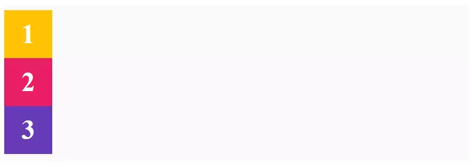
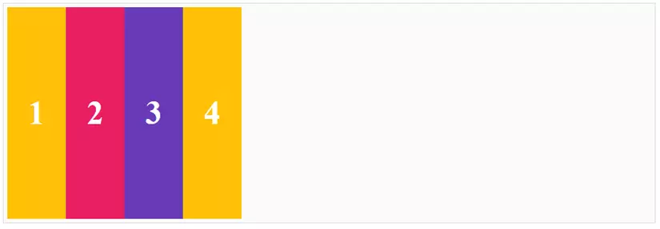
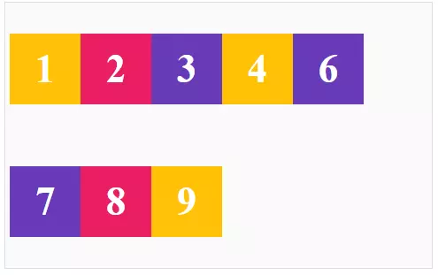
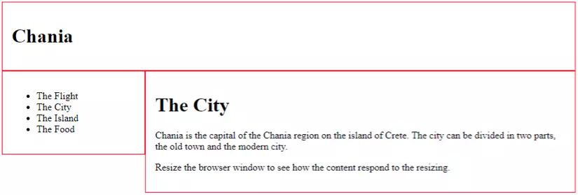

- [Phần 1: Flex, Grid Layout:](#phần-1-flex-grid-layout)
- [Flexbox, Flex Attribute: direction, wrap, flow,...](#flexbox-flex-attribute-direction-wrap-flow)
  - [Flexbox](#flexbox)
    - [Khái niệm](#khái-niệm)
    - [Cách hoạt động](#cách-hoạt-động)
    - [Các thuộc tính](#các-thuộc-tính)
      - [Không sử dụng flexbox](#không-sử-dụng-flexbox)
      - [Dùng display để áp dụng flexbox](#dùng-display-để-áp-dụng-flexbox)
      - [flex-direction](#flex-direction)
      - [flex-direction: row-reverse](#flex-direction-row-reverse)
      - [flex-direction: column](#flex-direction-column)
      - [flex-direction: column-reverse](#flex-direction-column-reverse)
      - [flex-wrap](#flex-wrap)
      - [flex-flow](#flex-flow)
      - [justified-content](#justified-content)
      - [align-items](#align-items)
      - [align-content](#align-content)
- [Grid, GridView,...](#grid-gridview)
  - [1. Kích hoạt Grid](#1-kích-hoạt-grid)
  - [2. Định nghĩa Hàng và Cột](#2-định-nghĩa-hàng-và-cột)
  - [3. Lặp với repeat()](#3-lặp-với-repeat)
  - [4. Tạo khoảng cách giữa ô](#4-tạo-khoảng-cách-giữa-ô)
  - [5. Vị trí phần tử (Item Positioning)](#5-vị-trí-phần-tử-item-positioning)
  - [6. Tự động xếp ô: auto-fill, auto-fit](#6-tự-động-xếp-ô-auto-fill-auto-fit)
  - [7. Căn chỉnh trong Grid](#7-căn-chỉnh-trong-grid)
  - [8. Đặt tên vùng – Grid Area](#8-đặt-tên-vùng--grid-area)
  - [9. Grid Responsive](#9-grid-responsive)
  - [Grid view](#grid-view)
    - [Building a Responsive Grid-View - Xây dựng chế độ xem lưới](#building-a-responsive-grid-view---xây-dựng-chế-độ-xem-lưới)
- [Z-index, Overflow, Align, Justify](#z-index-overflow-align-justify)
- [Phần 2: Responsive:](#phần-2-responsive)
  - [Viewport](#viewport)
    - [Setting the Viewport - Thiết lập chế độ xem](#setting-the-viewport---thiết-lập-chế-độ-xem)
    - [Size Content to The Viewport - Kích thước nội dung cho khung nhìn](#size-content-to-the-viewport---kích-thước-nội-dung-cho-khung-nhìn)
- [Media Query](#media-query)
    - [Một số ví dụ về sử dụng Media Queries](#một-số-ví-dụ-về-sử-dụng-media-queries)
- [Phần 3: Style 1 số thành phần cơ bản](#phần-3-style-1-số-thành-phần-cơ-bản)
- [Dropdowns](#dropdowns)
- [Forms](#forms)
# Phần 1: Flex, Grid Layout:
# Flexbox, Flex Attribute: direction, wrap, flow,...
## Flexbox
### Khái niệm
- CSS flexbox là một one-dimensional(hay còn gọi là 1D) layout pattern, một trong những pattern giúp bạn dễ dàng thiết kế layout một cách linh hoạt và hiệu quả. Phân chia không gian giữa các items và kiểm soát căn chỉnh chúng trong container flex layout(vùng chứa). Với flexbox, chúng ta có thể dễ dàng sắp xếp các items từ trái sang phải, từ trên xuống dưới, đồng thời kiểm soát khoảng cách và thứ tự của các items trong container.
### Cách hoạt động
- Trước khi đi vào tìm hiểu sâu hơn về Flexbox, chúng ta cần nắm qua cấu trúc của Flexbox là như thế nào đã:


Trong flexbox thì chủ yếu có hai thành phần chính là: thùng chứa cha (flex container) và các phần tử con nằm bên trong (flex items).
Ngoài ra chúng ta cũng cần quan tâm tới một số thuộc tính sau:

- **main start, main end, cross start, cross end**: Điểu bắt đầu của container theo main axis được gọi là main start, điểm kết thúc của container theo main axis gọi là main end, với cross start và cross cũng tương tự nhưng dựa theo cross axis.
- **main axis**: Trục này chính là hướng của các item hiển thị, mặc định thì sẽ chạy từ trái qua phải.
- **cross axis**: Trục này vuông góc với main axis, chạy từ trên xuống dưới.
main size: Là kích thước của mỗi item dựa theo trục main axis.
cross size: Là kích thước của mỗi item dựa theo trục cross axis.
### Các thuộc tính
Dưới đây là một số thuộc tính có thể sử dụng đối với flex container:
- display
- flex-direction
- flex-wrap
- flex-flow
- justified-content
- align-items
- align-content
#### Không sử dụng flexbox
```html
<div class="box">
    <div class="box-item">1</div>
    <div class="box-item">2</div>
    <div class="box-item">3</div>
</div>
```

#### Dùng display để áp dụng flexbox
Chúng ta cần phải sử dụng thuộc tính `display`. Đây là cách mà chúng ta định nghĩa một flex container, và cũng là việc bắt buộc nếu bạn làm việc với flexbox.
```html
<style>
.box {
    display: flex;
}
</style>
<div class="box">
    <div class="box-item">1</div>
    <div class="box-item">2</div>
    <div class="box-item">3</div>
</div>
```

#### flex-direction
`flex-direction` dùng để chỉ định hướng hiển thì của các item, việc thay đổi hướng hiển thị flex cũng thể có thể cho phép ta thay đổi vị trí của các flex item.

**flex-direction: row**
`flex-direction: row` là giá trị mặc định khi sử dụng flexbox, không thực hiện bất kỳ thay đổi nào, chỉ đặt các item từ trái qua phải theo trục chính.
```html
<style>
.box {
    display: flex;
    flex-direction: row;
}
</style>
<div class="box">
    <div class="box-item">1</div>
    <div class="box-item">2</div>
    <div class="box-item">3</div>
</div>
```

#### flex-direction: row-reverse
Giống với tên gọi, `flex-direction: row-reverse` ngược lại với `row`, các item sẽ được đặt từ phải qua trái.
```html
<style>
.box {
    display: flex;
    flex-direction: row-reverse;
}
</style>
<div class="box">
    <div class="box-item">1</div>
    <div class="box-item">2</div>
    <div class="box-item">3</div>
</div>
```

#### flex-direction: column
Khi chúng ta xét `flex-direction: column`, lúc này trục chính sẽ đi từ trên xuống dưới vậy nên giờ đây các items sẽ được xếp chồng lên nhau.
```html
<style>
.box {
    display: flex;
    flex-direction: column;
}
</style>
<div class="box">
    <div class="box-item">1</div>
    <div class="box-item">2</div>
    <div class="box-item">3</div>
</div>
```

#### flex-direction: column-reverse
Khi đó các items sẽ được xếp chống lên nhau nhưng theo chiều ngược lại. Hay để ý sẽ thấy ở ví dụ trên (1) sẽ ở trên cùng, nhưng khi sử dụng column-reverse (1) sẽ ở dưới cùng.
```css
<style>
.box {
    display: flex;
    flex-direction: column-reverse;
}
</style>
<div class="box">
    <div class="box-item">1</div>
    <div class="box-item">2</div>
    <div class="box-item">3</div>
</div>
```

#### flex-wrap
`flex-wrap` dùng để kiểm soát việc bọc các items nằm gọn trong container. Nếu chúng ta giảm chiều rộng của trình duyệt, chúng ta có thể không nhìn thấy một số item trên cùng một dòng. Thuộc tính `flex-wrap` có thể giải quyết vấn đề đó:

- nowrap (mặc định): Không có gì thay đổi
- wrap: các items sẽ được bọc trọn trong container
- wrap-reverse
```html
<style>
.box {
    display: flex;
    flex-wrap: nowrap;
}
</style>
<div class="box">
    <div class="box-item">1</div>
    <div class="box-item">2</div>
    <div class="box-item">3</div>
    <div class="box-item">4</div>
    <div class="box-item">5</div>
    <div class="box-item">6</div>
    <div class="box-item">7</div>
    <div class="box-item">8</div>
    <div class="box-item">9</div>
</div>
```
nowrap

wrap

wrap-reverse

#### flex-flow
`flex-flow` là cách viết rút gọn của `flex-direction` và `flex-wrap`. Trong `flex-flow` giá trị đầu tiên là `flex-direction` và thứ 2 là `flex-wrap`
```html
<style>
.box {
  display: flex;
  flex-flow: row-reverse wrap;
}
</style>
<div class="box">
    <div class="box-item">1</div>
    <div class="box-item">2</div>
    <div class="box-item">3</div>
    <div class="box-item">4</div>
    <div class="box-item">5</div>
    <div class="box-item">6</div>
    <div class="box-item">7</div>
    <div class="box-item">8</div>
    <div class="box-item">9</div>
</div>
```

#### justified-content

`justified-content` dùng để căn chỉnh vị trí của các items so với trục chính(main axis). Có 6 giá trị có thể dùng đối với thuộc tính `justified-content`:

- flex-start: sẽ đặt item bắt đầu từ main start (và đây cũng là giá trị mặc định)
- flex-end:sẽ đặt item bắt đầu từ main end
- center: sẽ đặt tất cả item ở giữa trục main axis
- space-between: sẽ chia đều khoảng cách thừa và thêm nó vào giữa các item
- space-around: sẽ chia khoảng cách ở đầu và cuối. Khoảng cách ở đầu và cuối sẽ bằng 1 nửa khoảng cách ở giữa 2 item với nhau
- space-evenly: sẽ chia khoảng cách đều khoảng cách giữa các item với item, item và main start, item với main end bằng nhau
```html

<style>
.box {
  display: flex;
  justify-content: flex-start;
}
</style>
<div class="box">
    <div class="box-item">1</div>
    <div class="box-item">2</div>
    <div class="box-item">3</div>
    <div class="box-item">4</div>
</div>
```
flex-start

flex-end

center

space-between

space-around

space-evenly

#### align-items
Thuộc tính `align-items` dùng để xác định cách mà các flex item được đặt trong container dọc theo chiều cross axis.

- `align-items: stretch`: Chiều dài của item sẽ bằng chiều dài của cross axis.
- `align-items: flex-start`: Item được đặt ở điểm bắt đầu của cross start(trên cùng bên trái), và kích thước item không bị thay đổi.
- `align-items: flex-end`: Item được đặt ở điểm bắt đầu của cross end(dưới cùng bên trái)
- `align-items: center`: Item được đặt ở giữa điểm bắt đầu của cross start và điểm bắt đầu của cross end (ở giữa bên trái)
- `align-items: baseline`: Item sẽ được đặt dữ theo các ký tự thuộc item đó. Mục đích chính là căn chỉnh dữa liệu dòng văn bản của các item.
```html
<style>
.box {
  height: 300px;
  display: flex;
  align-items: stretch;
}
</style>
<div class="box">
    <div class="box-item">1</div>
    <div class="box-item">2</div>
    <div class="box-item">3</div>
    <div class="box-item">4</div>
</div>
```
align-items: stretch

align-items: flex-start

align-items: flex-end

align-items: center

align-items: baseline

#### align-content
Tương tự như `justify-content` chỉ khác một chỗ là thay vì căn theo trục main axis thì `align-content` căn theo trục cros axis.

- `align-content: stretch`
- `align-content: flex-start`
- `align-content: flex-end-`
- `align-content: center`
- `align-content: space-between`
- `align-content: space-around`
```html
<style>
.box {
  height: 300px;
  display: flex;
  flex-wrap: wrap;
  align-content: stretch;
}
</style>
<div class="box">
    <div class="box-item">1</div>
    <div class="box-item">2</div>
    <div class="box-item">3</div>
    <div class="box-item">4</div>
</div>
```
align-content: stretch

align-content: flex-start

align-content: flex-end

align-content: center

align-content: space-between

align-content: space-around

# Grid, GridView,...
CSS Grid là hệ thống bố cục 2 chiều (hàng và cột), mạnh mẽ và hiện đại nhất của CSS.

## 1. Kích hoạt Grid

```css
.container {
  display: grid;
}
```
## 2. Định nghĩa Hàng và Cột
➤ `grid-template-columns`
Tạo các cột:


```css
.container {
  grid-template-columns: 200px 100px auto;
}
```
- Sử dụng đơn vị:

   - `px`, `em`, `%`

   - `fr`: phần chia đều (fractional unit – cực mạnh!)

   - `auto`: kích thước tự động theo nội dung


```css
grid-template-columns: 1fr 2fr 1fr; /* 4 phần chia đều */
```
➤ `grid-template-rows`
Tương tự như `columns`, dùng cho các hàng:


```css
grid-template-rows: 100px auto 50px;
```
## 3. Lặp với repeat()

```css
grid-template-columns: repeat(3, 1fr);
/* Tương đương với: 1fr 1fr 1fr */
```
##  4. Tạo khoảng cách giữa ô

```css
grid-gap: 10px; /* deprecated */
gap: 10px;
```
- `row-gap`: khoảng cách theo hàng

- `column-gap`: khoảng cách theo cột

## 5. Vị trí phần tử (Item Positioning)

```html
<div class="container">
  <div class="item a">A</div>
  <div class="item b">B</div>
  <div class="item c">C</div>
</div>
```
```css
.a {
  grid-column: 1 / 3; /* chiếm từ cột 1 đến trước cột 3 */
  grid-row: 1 / 2;
}
```
Cách viết ngắn:


```css
.a {
  grid-area: 1 / 1 / 2 / 3;
  /* row-start / column-start / row-end / column-end */
}
```
##  6. Tự động xếp ô: auto-fill, auto-fit

```css
.container {
  grid-template-columns: repeat(auto-fill, minmax(150px, 1fr));
}
```
- `auto-fill`: lấp đầy hàng bằng càng nhiều cột càng tốt, ngay cả khi cột trống.

- `auto-fit`: như auto-fill nhưng các cột trống bị "co" lại (co giãn linh hoạt).

## 7. Căn chỉnh trong Grid
➤ Căn toàn bộ lưới:

```css
.container {
  justify-items: start | center | end | stretch;
  align-items: start | center | end | stretch;
}
```
➤ Căn chỉnh toàn lưới (container):

```css
.container {
  justify-content: start | center | space-between | space-around;
  align-content: start | center | stretch;
}
```
➤ Căn chỉnh từng phần tử:

```css
.item {
  justify-self: center;
  align-self: end;
}
```
## 8. Đặt tên vùng – Grid Area

```css
.container {
  display: grid;
  grid-template-areas:
    "header header"
    "sidebar content"
    "footer footer";
  grid-template-columns: 1fr 3fr;
}
```
```css
.header { grid-area: header; }
.sidebar { grid-area: sidebar; }
.content { grid-area: content; }
.footer { grid-area: footer; }
```
## 9. Grid Responsive

```css
@media (max-width: 768px) {
  .container {
    grid-template-columns: 1fr;
    grid-template-areas:
      "header"
      "content"
      "sidebar"
      "footer";
  }
}
```
## Grid view
Grid View - chế độ xem dạng lưới, có nghĩa là trang web được chia ra thành các cột.

Thông thường chế độ Grid View có 12 cột và tổng chiều rộng là 100%, đồng thời sẽ thu nhỏ hay mở rộng khi bạn thay đổi kích thước cửa sổ trình duyệt.
### Building a Responsive Grid-View - Xây dựng chế độ xem lưới

Trước tiên, hãy đảm bảo rằng tất cả các phần tử HTML có thuộc tính `box-sizing` được đặt thành `border-box`. Điều này đảm bảo rằng phần đệm và đường viền được bao gồm trong tổng chiều rộng và chiều cao của các phần tử.
```css
* {
  box-sizing: border-box;
}
```
```html
<div class="header">
  <h1>Chania</h1>
</div>

<div class="menu">
  <ul>
    <li>The Flight</li>
    <li>The City</li>
    <li>The Island</li>
    <li>The Food</li>
  </ul>
</div>

<div class="main">
  <h1>The City</h1>
  <p>Chania is the capital of the Chania region on the island of Crete. The city can be divided in two parts, the old town and the modern city.</p>
  <p>Resize the browser window to see how the content respond to the resizing.</p>
</div>
```
**CSS code**
```css
.header {
  border: 1px solid red;
  padding: 15px;
}
.menu {
  width: 25%;
  float: left;
}
.main {
  width: 75%;
  float: left;
}
```
Ta sẽ có 1 trang web đơn giản với bố cục như hình dưới đây:


Ví dụ trên sẽ tốt nếu trang web chỉ chứa hai cột.

Tuy nhiên, chúng ta muốn sử dụng grid-view với 12 cột, để có thể kiểm soát nhiều hơn các bố cục khác của trang web. Đầu tiên ta phải tính phần trăm cho một cột: 100% / 12 = 8.33%. Sau đó, ta tạo các class cho từng cột trong tổng số 12 cột, các class class="col-" và tỉ lệ tương ứng cho từng class đó.
```css
.col-1 {width: 8.33%;}
.col-2 {width: 16.66%;}
.col-3 {width: 25%;}
.col-4 {width: 33.33%;}
.col-5 {width: 41.66%;}
.col-6 {width: 50%;}
.col-7 {width: 58.33%;}
.col-8 {width: 66.66%;}
.col-9 {width: 75%;}
.col-10 {width: 83.33%;}
.col-11 {width: 91.66%;}
.col-12 {width: 100%;}
```
Tất cả các cột này phải luôn định dạng nằm bên trái và có padding là 15px:

```css
[class*="col-"] {
  float: left;
  padding: 15px;
  border: 1px solid red;
}
```
Mỗi hàng nên được đóng gói trong một <div>. Số cột bên trong một hàng tối đa 12 cột. Ví dụ:
```html
<div class="row">
  <div class="col-3">...</div> <!-- 25% -->
  <div class="col-9">...</div> <!-- 75% -->
</div>
```
Để ngăn chặn việc nội dung của các row dưới có thể bị nhảy lên trên khi cột bên trên khi các thành phần bên trong row không đủ 12 cột, do các cột có thuộc tính float: left, ta thêm đoạn CSS dưới đây để giúp các row luôn độc lập với nhau:
```css
.row::after {
  content: "";
  clear: both;
  display: table;
}
```
Bây giờ, ta có thể sửa đoạn HTML trên bằng việc sử dụng các class của grid-view mà chúng ta đã xây dựng như sau:
```html
<div class="header">
  <h1>Chania</h1>
</div>

<div class="row">
    <div class="col-3 menu">
      <ul>
        <li>The Flight</li>
        <li>The City</li>
        <li>The Island</li>
        <li>The Food</li>
      </ul>
    </div>
    
    <div class="col-9">
      <h1>The City</h1>
      <p>Chania is the capital of the Chania region on the island of Crete. The city can be divided in two parts, the old town and the modern city.</p>
      <p>Resize the browser window to see how the content respond to the resizing.</p>
    </div>
</div>
```
Cần thêm 1 vài đoạn code css cho các thành phần trong trang để trang web trông đẹp hơn.
```css
.header {
  background-color: #9933cc;
  color: #ffffff;
  padding: 15px;
}
.menu ul {
  list-style-type: none;
  margin: 0;
  padding: 0;
}
.menu li {
  padding: 8px;
  margin-bottom: 7px;
  background-color :#33b5e5;
  color: #ffffff;
  box-shadow: 0 1px 3px rgba(0,0,0,0.12), 0 1px 2px rgba(0,0,0,0.24);
}
.menu li:hover {
  background-color: #0099cc;
}
```
<a href ="https://www.w3schools.com/cSS/tryit.asp?filename=tryresponsive_styles">Kết quả </a>
# Z-index, Overflow, Align, Justify
# Phần 2: Responsive:
Responsive Web Design (RWD) là làm cho trang web của bạn có thể xem tốt trên tất cả các thiết bị. Responsive Web Design chỉ sử dụng HTML và CSS. Responsive Web Design không phải là một chương trình hoặc đoạn mã JavaScript

## Viewport
- Viewport - chế độ xem, là vùng hiển thị của người dùng trên một trang web.
- Chế độ xem thay đổi theo thiết bị và sẽ nhỏ hơn trên điện thoại di động so với màn hình máy tính.
Chú ý: Để kiểm tra một trang web có RWD đạt chất lượng cao hay không có thể dùng công cụ PageSpeed Insignts của Google để kiểm tra. Nếu đạt tối đa 100 điểm thì có nghĩa trang web của bạn thật tuyệt vời với mọi thiết bị.
### Setting the Viewport - Thiết lập chế độ xem
HTML5 giới thiệu một phương pháp để cho phép các nhà thiết kế web kiểm soát viewport, thông qua thẻ `<meta>`. Bạn có thể thiết lập meta viewport bằng cách đặt vào trong cặp thẻ `<head>` như sau:
```html
<meta name="viewport" content="width=device-width, initial-scale=1.0">
```
- Thẻ `<meta>` viewport thiết lập cho trang web hiển thị tương ứng với kích thước của từng thiết bị khác nhau.
- `width=device-width`: đặt chiều rộng của trang web theo chiều rộng màn hình của thiết bị (sẽ thay đổi tuỳ theo thiết bị).
- `initial-scale=1.0`: thiết lập mức độ phóng ban đầu khi trang được trình duyệt tải lần đầu tiên, người dùng sẽ không thể zoom khi thuộc tính này có giá trị bằng 1.
So sánh ví dụ dưới đây khi trang web có meta viewport và không có meta viewport:


### Size Content to The Viewport - Kích thước nội dung cho khung nhìn
Hầu hết các trang web người dùng sử dụng bằng cách cuộn màn hình theo chiều dọc, chứ không phải chiều ngang. Vì vậy nếu người dùng buộc phải cuộn theo chiều ngang hoặc thu nhỏ/phóng to để xem toàn bộ trang web, điều đó dẫn đến trải nghiệm người dùng kém.

Một số quy tắc cần phải tuân theo:

- *KHÔNG* sử dụng các phần tử có chiều rộng cố định: Ví dụ: nếu một hình ảnh đươc hiển thị ở với chiều rộng lớn hơn khung nhìn, nó có thể khiến khung nhìn phải cuộn theo chiều ngang. Hãy nhớ điều đỉnh nội dung này để vừa với chiều rộng của khung nhìn.
- *Sử dụng icon SVG thay cho các icon bằng hình ảnh thông thường (PNG, JPG,...)*: Các icon, hình ảnh dạng SVG sẽ không bị mờ khi thu phóng ở bất kỳ kích thước nào, điều này sẽ giúp nội dung của trang web hiển thị tốt nhất trên các thiết bị như phone, tablet,...
- *Sử dụng CSS media queries để style cho từng thiết bị có chiều rộng khác nhau*: Không nên sử dụng các giá trị tuyệt đối như px, pt cho các phần tử mang tính bao quát trong trang, điều này sẽ làm cho nội dung của trang web sẽ bị tràn khi xem ở thiết bị có chiều rộng nhỏ hơn giá trị đã thiết lập. Thay vì vậy, hãy sử dụng các giá trị mang tính tương đối như %, ví dụ như width: 100%.- 
# Media Query
Media Queries - truy vấn phương tiện là một kỹ thuật được giới thiệu trong CSS3. Nó sử dụng `@media` để bao gồm một khối thuộc tính CSS chỉ khi một điều kiến nhất định là đúng.

**Ví dụ**: nếu màn hình có kích thước là 600px hoặc nhỏ hơn, màu nền sẽ là màu xanh:

```css
@media screen and (max-width: 600px) {
  body {
    background-color: green;
  }
}
```
**Thêm Breakpoint** Trước đó, trong series này chúng ta đã tạo một trang web với các hàng và cột và cũng đã có responsive. Tuy nhiên, trên các màn hình nhỏ thì lại chưa đáp ứng tốt cho người dùng.

Media Queries có thể giúp ta làm điều đó. Chúng ta có thể thêm các breakpoint, trong đó mỗi thành phần nhất định của trang web sẽ hiển thị khác nhau ở từng breakpoint khác nhau.

Ví dụ: Sử dụng Media Queries để định nghĩa breakpoint cho thiết bị có kích thước nhỏ hơn 768px:
```css
/* For desktop: */
.col-1 {width: 8.33%;}
.col-2 {width: 16.66%;}
.col-3 {width: 25%;}
.col-4 {width: 33.33%;}
.col-5 {width: 41.66%;}
.col-6 {width: 50%;}
.col-7 {width: 58.33%;}
.col-8 {width: 66.66%;}
.col-9 {width: 75%;}
.col-10 {width: 83.33%;}
.col-11 {width: 91.66%;}
.col-12 {width: 100%;}

@media only screen and (max-width: 768px) {
    /* For mobile phones: */
    [class*="col-"] {
        width: 100%;
    }
}
```
*Ở đoạn code trên ta đã thêm vào cuối một đoạn CSS Media Query để định nghĩa khi kích thước màn hình (cửa sổ trình duyệt) nhỏ hơn 768px, mỗi cột luôn có chiều rộng là100%. Điều này có nghĩa là một khi gặp màn hình có kích thước <768px thì các thành phần HTML trong trang web chứa các class trên sẽ tự động full 100% màn hình để hiển thị tốt hơn nội dung cho người dùng.*

**Mobile First** và **Desktop First** Có 2 cách để tạo RWD, **Mobile First** là thiết kế cho màn hình điện thoại di động trước, rồi sau đó tạo Media Queries thiết kế cho các màn hình khác (Điều này sẽ làm cho trang web hiển thị nhanh hơn trên các thiết bị nhỏ hơn). **Desktop First** là ngược lại, thiết kế cho màn hình Desktop trước. Ví dụ cho Mobile First:
```css
/* For mobile phones: */
[class*="col-"] {
    width: 100%;
}
@media only screen and (min-width: 768px) {
    /* For desktop: */
    .col-1 {width: 8.33%;}
    .col-2 {width: 16.66%;}
    .col-3 {width: 25%;}
    .col-4 {width: 33.33%;}
    .col-5 {width: 41.66%;}
    .col-6 {width: 50%;}
    .col-7 {width: 58.33%;}
    .col-8 {width: 66.66%;}
    .col-9 {width: 75%;}
    .col-10 {width: 83.33%;}
    .col-11 {width: 91.66%;}
    .col-12 {width: 100%;}
}
```
**Các breakpoint thông dụng** hiện nay Có rất nhiều màn hình và thiết bị với chiều cao và chiều rộng khác nhau nên khó có thể tạo ra một breakpoint chính xác cho mỗi thiết bị. Tuy nhiên, đơn giản nhất thì sẽ có các breakpoint thông dụng sau đây:
```css
/* Extra small devices (phones, 600px and down) */
@media only screen and (max-width: 600px) {...} 

/* Small devices (portrait tablets and large phones, 600px and up) */
@media only screen and (min-width: 600px) {...} 

/* Medium devices (landscape tablets, 768px and up) */
@media only screen and (min-width: 768px) {...} 

/* Large devices (laptops/desktops, 992px and up) */
@media only screen and (min-width: 992px) {...} 

/* Extra large devices (large laptops and desktops, 1200px and up) */
@media only screen and (min-width: 1200px) {...}
```
### Một số ví dụ về sử dụng Media Queries

```css
/* If the screen size is 600px wide or less, hide the element */
@media only screen and (max-width: 600px) {
  div.example {
    display: none;
  }
}
```
Hoặc có thể thay đổi kích thước font chữ trên trang web tương ứng với từng kích thước màn hình khác nhau chẳng hạn.
```css
/* If the screen size is 601px or more, set the font-size of <div> to 80px */
@media only screen and (min-width: 601px) {
  div.example {
    font-size: 80px;
  }
}

/* If the screen size is 600px or less, set the font-size of <div> to 30px */
@media only screen and (max-width: 600px) {
  div.example {
    font-size: 30px;
  }
}
```
# Phần 3: Style 1 số thành phần cơ bản
# Dropdowns
# Forms
