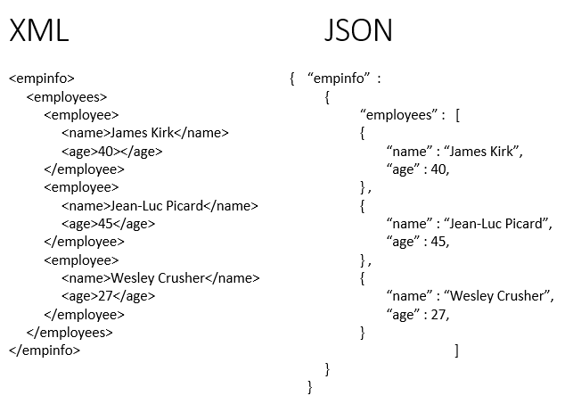

- [PHẦN 1: JS ASYNC, API](#phần-1-js-async-api)
- [JS ASYNC](#js-async)
- [JSON](#json)
  - [JSON là gì?](#json-là-gì)
  - [Định nghĩa](#định-nghĩa)
  - [Cấu trúc chuỗi JSON](#cấu-trúc-chuỗi-json)
    - [Object là gì?](#object-là-gì)
    - [Nên sử dụng JSON khi nào](#nên-sử-dụng-json-khi-nào)
- [JS Async: Callback Hell, Promise, Async, Await](#js-async-callback-hell-promise-async-await)
  - [Callbacks](#callbacks)
  - [Callback hell](#callback-hell)
  - [Promise](#promise)
    - [Asynchronous Chaining](#asynchronous-chaining)
  - [Async/Await](#asyncawait)
  - [Error handling với async/await](#error-handling-với-asyncawait)
- [FETCH API:](#fetch-api)
  - [Fetch API là gì?](#fetch-api-là-gì)
    - [FETCH API](#fetch-api-1)
    - [REST API](#rest-api)
    - [POST MAN](#post-man)
  - [Phần 2: STORAGE](#phần-2-storage)
    - [Storing Data](#storing-data)
    - [Token (Access Token, Refresh Token)](#token-access-token-refresh-token)

# PHẦN 1: JS ASYNC, API
# JS ASYNC
# JSON
## JSON là gì?
**JSON** là viết tắt của **J**ava**S**cript **O**bject **N**otation, là một kiểu định dạng dữ liệu tuân theo một quy luật nhất định mà hầu hết các ngôn ngữ lập trình hiện nay đều có thể đọc được. `JSON` là một tiêu chuẩn mở để trao đổi dữ liệu trên web.

## Định nghĩa
Định dạng JSON sử dụng các cặp `key` – `value` để dữ liệu sử dụng. Nó hỗ trợ các cấu trúc dữ liệu như đối tượng và mảng. Ví dụ một tập tin có tên `topdev_info.json` với nội dung như ở dưới đây sử dụng format kiểu JSON để lưu trữ thông tin:
```js
{
    "name" : "TopDev",
    "title" : "Việc làm IT cho Top Developers",
    "description" : "là hệ sinh thái bao gồm cộng đồng các Top Developers."
}
```
Ta có thể thấy cú pháp của JSON có 2 phần đó là `key` và `value`:

- Chuỗi JSON được bao lại bởi dấu ngoặc nhọn {}
- Các `key`, `value` của JSON bắt buộc phải đặt trong dấu nháy kép {“}, nếu bạn đặt nó trong dấu nháy đơn thì đây không phải là một chuỗi JSON đúng chuẩn. Nếu trường hợp trong `value` của bạn có chứa dấu nháy kép `"` thì hãy dùng dấu () để đặt trước nó, ví dụ  `"json là gì"`.
- Nếu có nhiều dữ liệu thì dùng dấu phẩy `,` để ngăn cách.
- Các `key` của JSON bạn nên đặt chữ cái không dấu hoặc số, dấu _ và không có khoảng trắng., ký tự đầu tiên không nên đặt là số.
File json có thể được lưu với bất kỳ phần mở rộng nào, tuy nhiên thông thường thì nó được lưu dưới phần mở rộng là `.json` hoặc `.js`.

><h4>JSON ban đầu được phát triển để dành phục vụ cho ứng dụng viết bằng JavaScript. Tuy nhiên vì JSON là một định dạng dữ liệu nên nó có thể được sử dụng bởi bất cứ ngôn ngữ nào mà không bị giới hạn. </h4>
Giá trị key trong JSON có thể là chuỗi (string), số (numner), rỗng (null), mảng (array), hoặc đối tượng (object).
## Cấu trúc chuỗi JSON
### Object là gì?
**Object** trong Json được thể hiện bằng dấu ngoặc nhọn {}. Khái niệm Object trong Json cũng khá tương đồng với Object trong Javascript. Tuy nhiên, Object trong Json vẫn có những giới hạn như:

- **Key**: phải luôn nằm trong dấu ngoặc kép, không được phép là biến số.
- **Value**: Chỉ cho phép các kiểu dữ liệu cơ bản: numbers, String, Booleans, arrays, objects, null. Không cho phép function, date, undefined.
- Không cho phép dấy phẩy cuối cùng như Object trong Javascript.
Kiểu OBJECT
<h4 >KIỂU OBJECT</h4>

```js
var nhat = {
   "firstName" : "Nhat",
   "lastName" : "Nguyen",
   "age" :  "34"
};
```
<h4>Kiểu OBJECT IN ARRAY</h4>

```js
var employees = [{
   "name" : "Binh",
   "age" :  "38",
   "gender" : "male"
 
},
{
   "name" : "Nhat",
   "age" : "34",
   "gender" : "male"
 
},
{
   "name" : "Nhu",
   "age" : "25",
   "gender" : "female"
}];
```

<h4>Kiểu NEST OBJECT</h4>

```js
var employees = {
  "hieu" : {
  "name" : "Hieu",
  "age" :  "29",
  "gender" : "male" 
},
 
"nhat" : {
  "name" : "Nhat",
  "age" : "34",
  "gender" : "male"
},
 
"nhu" : {
  "name" : "Nhu",
  "age" : "25",
  "gender" : "female"
}
}
```
### Nên sử dụng JSON khi nào
Đó là khi bạn muốn lưu trữ dữ liệu đơn thuần dưới dạng metadata ở phía server. Chuỗi JSON sẽ được lưu vào database và sau đó khi cần dữ liệu thì sẽ được giải mã. Ví dụ với PHP, nó cung cấp các hàm liên quan đến JSON để mã hóa hoặc giải mã là **json_encode và json_decode**.

Một trường hợp khá phổ biến trong JavaScript mà dữ liệu được định dạng theo format JSON xuất hiện đó là trong các AJAX request.

Ví dụ bạn tạo tập tin `topdev_info.json` ở thư mục gốc của server (để khi request vào URL `http://localhost/topdev_info.json` thì server trả về nội dung của tập tin này) và sau đó bạn tạo một tập tin `topdev_ajax.html` với nội dung như sau:
```html
<html>
<head>
    <script src="https://ajax.googleapis.com/ajax/libs/jquery/3.1.2/jquery.min.js"></script>
</head>
<body>
<script type="text/javascript">
    $.ajax(
        type: 'GET',
        url: "http://localhost/topdev_info.json",
        success: function(response) {
            console.log("Data type: " + (typeof response));
            console.log("Application name: " + response.name);
        },
    );
</script>
</body>
</html>
```

Đoạn code trên sử dụng `$.ajax()` để gửi AJAX request lên server lấy về nội dung file `topdev_info.json`. Sau khi lấy về nội dung tập tin này thành công, dữ liệu sẽ được chuyển vào biến response.

Nếu bạn mở developer console của trình duyệt lên (nhấn phím F12) bạn sẽ thấy kiểu dữ liệu của biến `response` này được JavaScript object với các thuộc tính như `name`, `title`, `decription`.
# JS Async: Callback Hell, Promise, Async, Await
Để bắt đầu, hãy xem đoạn code sau:
```js
result1 = doSomething1();
result2 = doSomething2(result1);
```
Hầu hết ngôn ngữ lập trình đều xử lý từng dòng một cách đồng bộ. Dòng đầu tiên chạy và trả về kết quả, sau đó dòng thứ 2 chỉ chạy khi dòng thứ 1 chạy xong (và cho ra kết quả).

JavaScript chạy trên một thread. Khi trình duyệt thực thi một sự kiện nào đó thì mọi thứ khác bị ngừng lại, người dùng sẽ khó mà phát hiện vì quá trình xử lý cực kỳ nhanh. Chẳng hạn JavaScript detect một click vào button, tính toán, update DOM. Mỗi khi xong thì trình duyệt sẽ xử lý item kế tiếp trong hàng đợi.
## Callbacks
Vậy vấn đề ở đây là gì? Tưởng tượng khi JavaScript gọi một process mất cực kỳ nhiều thời gian như Ajax hoặc xử lý database? Thao tác này có thể mất nhiều giây, hoặc thậm chí cả phút. Và trình duyệt sẽ bị khóa khi nó đang chờ `response`, tức là không thể xử lý thêm request của người dùng trong khoảng thời gian đó.

Giải pháp ở đây là xử lý bất đồng bộ. Trong JavaScript, khi một thao tác bất đồng bộ có kết quả (kết quả này có thể là dữ liệu trả về hoặc lỗi xảy ra khi thao tác), nó sẽ gọi một function mỗi khi kết quả sẵn sàng, function này được gọi là "callback". Trong khi đó JavaScript tiếp tục thực thi bình thường. Bạn có thể thấy các framework thường có APIs mà bạn có thể thêm callback function để thực thi sau khi gọi. Đăng ký một `event listener` trong browser với `addEventListener`, đọc nội dung file với `fs.readFile `hoặc đăng ký middleware trong express web server với `server.use` là ví dụ của những APIs mà sử dụng callback.

Đây là ví dụ lấy dữ liệu từ một URL sử dụng module request:

```js
const request = require(‘request’);
request('https://www.somepage.com', function (error, response, body) {
  if(error){
    // Handle error.
  }
  else {
    // Successful, do something with the result.
  }
});
```
Ta có thể viết lại nó như sau:
```js
const request = require(‘request’);
function handleResponse(error, response, body){
    if(error){
        // Handle error.
    }
    else {
        // Successful, do something with the result.
    }
}
request('https://www.somepage.com', handleResponse);
```
Như bạn thấy, `request` lấy function `handleResponse` làm tham số cuối cùng. Function này không được thực thi ngay. Nó được lưu lại và sẽ thực thi khi thao tác lấy dữ liệu từ url hoàn thành.
## Callback hell
Xem đoạn code sau:
```js
fs.readdir(source, function (err, files) {
  if (err) {
    console.log('Error finding files: ' + err)
  } else {
    files.forEach(function (filename, fileIndex) {
      console.log(filename)
      gm(source + filename).size(function (err, values) {
        if (err) {
          console.log('Error identifying file size: ' + err)
        } else {
          console.log(filename + ' : ' + values)
          aspect = (values.width / values.height)
          widths.forEach(function (width, widthIndex) {
            height = Math.round(width / aspect)
            console.log('resizing ' + filename + 'to ' + height + 'x' + height)
            this.resize(width, height).write(dest + 'w' + width + '_' + filename, function(err) {
              if (err) console.log('Error writing file: ' + err)
            })
          }.bind(this))
        }
      })
    })
  }
})
```
Khi ta có `callback` lồng trong `callback` như thế này, đoạn code trở nên khó đọc và rất loạn, nó được gọi là `callback hell`. Điều này xảy ra khi nhiều người muốn viết JavaScript theo cách xử lý tuần tự từ trên xuống dưới, tuy nhiên đó lại là sai lầm dẫn đến đoạn code rất rối.
## Promise
Vậy làm sao để xử lý khi gặp callback hell? ES2015 (ES6) giới thiệu Promises. Callbacks vẫn được sử dụng, nhưng Promises cung cấp một cú pháp rõ ràng hơn để `chain` các câu lệnh bất đồng bộ.

Để tạo một Promise, ta dùng đoạn code sau:
```js
const myPromise = new Promise(function(resolve, reject) {
  
  // code here
  
  if (codeIsFine) {
    resolve('fine')
  } else {
    reject('error')
  }
})
myPromise
  .then(function whenOk(response) {
    console.log(response)
    return response
  })
  .catch(function notOk(err) {
    console.error(err)
  })
```
Hãy phân tích đoạn code trên:

- Một promise được khởi tạo với một function có câu lệnh `resolve` hoặc `reject`
- Đặt đoạn code bất đồng bộ trong function Promise `resolve` khi mọi thứ xảy ra như mong muốn Nếu không thì `reject`
- Khi `resolve` được chạy thì đoạn code trong `.then` sẽ thực thi Khi `reject` được chạy thì `.catch` sẽ được `trigger-`
### Asynchronous Chaining
Thay vì lồng `callback` trong `callback` như trên (`callback hell`), bạn có thể dùng `.then` để chain, tạo thành đoạn code dễ đọc và dễ follow hơn. Mỗi `.then` nên trả về một Promise. Và một điều quan trọng cần nhớ là dù chúng ta gọi nhiều request bất đồng bộ thì cũng chỉ có một `.catch` để xử lý toàn bộ error. Lý do là nếu một lỗi xảy ra thì đoạn Promise chain sẽ ngừng thực thi và nhảy vào `.catch`.
```js
asyncDBconnect('http://localhost:1234')
  .then(asyncGetSession)      // passed result of asyncDBconnect
  .then(asyncGetUser)         // passed result of asyncGetSession
  .then(asyncLogAccess)       // passed result of asyncGetUser
  .then(result => {           // non-asynchronous function
    console.log('complete');  //   (passed result of asyncLogAccess)
    return result;            //   (result passed to next .then())
  })
  .catch(err => {             // called on any reject
    console.log('error', err);
  });
```
Một lưu ý là dù trông dễ đọc hơn thì bản chất của nó vẫn là thao tác bất đồng bộ. Đoạn code được thực thi khi request hoàn thành - tức là đoạn gọi `.then()` tuần tự ấy - được đặt trong vòng lặp sự kiện cũng giống như `callback`. Tóm lại nghĩa là bạn không thể truy xuất biến được truyền hoặc khai báo trong Promise chain ngoài phạm vi Promise. Điều này cũng đúng cho `error handling`. Bạn phải có ít nhất một `.catch()` ở cuối Promise chain để bắt lỗi. Nếu không thì bất kỳ lỗi nào xảy ra đều sẽ bị bỏ qua.

Hơi khó hiểu nhỉ, hãy xem đoạn code sau nhé, bắt lỗi kiểu này là sai:
```js
try{
    axios.get(‘http://www.somepage.com')
    .then(function response {
        // Handle response
    })
} catch (error){
    // Dù đoạn Promise chain ở phía trên có lỗi thì cũng không bao giờ vào đây
}
```
## Async/Await
Promises có thể hơi khó nhằn, nên ES2017 giới thiệu `async` và `await`, nó giúp Promise trông đơn giản hơn, tránh được chain `.then()` dài dằng dặc.

Async/Await là bước kế tiếp trong công cuộc xử lý thao tác bất đông bộ trong JavaScript. Nó cho bạn 2 từ khóa mới là: `async` và `await`. `Async` sẽ thông báo rằng function sẽ xử lý bất đồng bộ, và `await` sẽ được dùng để báo chúng ta muốn đợi kết quả của thao tác bất đồng bộ trong một function có đánh dấu `async`.
Ví dụ cơ bản:
```js
async function getSomeAsyncData(value){
    const result = await fetchTheData(someUrl, value);
    return result;
}
```
Lưu ý là chỉ dùng được `await` trong function có từ khóa `async` ở phía trước:
```js
function justANormalFunction(value){
    // function này sẽ sinh lỗi cú pháp vì thiếu khai báo từ khóa `async`
    const result = await fetchTheData(someUrl, value);
    return result;
}
```
Ta chỉ await được những function trả về một Promise hoặc nó có khai báo `async`.
```js
function fetchTheData(someValue){
    return new Promise(function(resolve, reject){
        getData(someValue, function(error, result){
            if(error){
                reject(error);
            }
            else{
                resolve(resutl);
            }
        })
    });
}
async function getSomeAsyncData(value){
    const result = await fetchTheData(value);
    return result;
}
```
Và giờ đây, ta có thể dùng await để viết code trông dễ đọc hơn. Thay vì

```js
function printAll(){
  printString("A")
  .then(() => printString("B"))
  .then(() => printString("C"))
}
printAll()

```
ta có thể tận dụng await như sau:

```js
async function printAll(){
  await printString("A")
  await printString("B")
  await printString("C")
}
printAll()
```
Nhớ là phải khai báo `async` trước function `printAll()`.
## Error handling với async/await
Bạn còn nhớ đoạn code mà tôi bảo là không trong phạm vi của Promise chain thì ta không thể bắt lỗi không? Với `async/await` thì trong phạm vi của function được khai báo `async`, bạn có thể dùng `try/catch` để bắt lỗi.
```js
async function getSomeData(value){
    try {
        const result = await fetchTheData(value);
        return result;
    }
    catch(error){
        // Handle error
    }
}
```
Và cũng lưu ý luôn là chỉ cần một `.catch()` là đủ, dù bạn có gọi nhiều await trong block `try` đi chăng nữa, chẳng hạn:
```js
async function fetchTheFirstData(value){
    return await get("someUrl", value);
}
async function fetchTheSecondData(value){
    return await getFromDatabase(value);
}
async function getSomeData(value){
    try {
    const firstResult = await fetchTheFirstData(value);
        const result = await fetchTheSecondData(firstResult.someValue);
        return result;
    }
    catch(error){
        // error của bất cứ await nào cũng sẽ vào đây
    }
}
```
Async/await có thể giúp đoạn code bất đồng bộ trông có vẻ như là "đồng bộ", nhưng thực tế nó vẫn thực thi tương tự như cách ta sử dụng `callback` hay `promise`. Đó là vì `async` và `await` chỉ là cách viết gọn hơn để tạo, trả về và resolve Promise mà thôi. Thế nên trước khi sử dụng`async/await`, hãy tìm hiểu về `callback` và `promise` trước đã thì tốt hơn.

# FETCH API:
## Fetch API là gì?
**Fetch API** là một giao diện lập trình trong JavaScript, được sử dụng để thực hiện các yêu cầu HTTP đến các máy chủ web. Đây là một phần của tiêu chuẩn **JavaScript ES6** và được tích hợp trực tiếp trong các trình duyệt hiện đại. Fetch JS cung cấp một cách thức đơn giản và mạnh mẽ để thực hiện các thao tác    (fetch) từ các nguồn bên ngoài, ví dụ như lấy dữ liệu từ máy chủ hoặc API, đồng thời hỗ trợ các thao tác như **GET, POST, PUT, DELETE, v.v.**

Điểm mạnh của Fetch fetch Javascript API là nó thay thế cho công nghệ cũ hơn là **XMLHttpRequest** và cung cấp cú pháp **hứa hẹn (Promise-based)**, giúp lập trình viên quản lý các yêu cầu bất đồng bộ (asynchronous) dễ dàng hơn.

Fetch trong JS sử dụng cú pháp **Promise**, có nghĩa là nó không chặn (non-blocking), cho phép xử lý các yêu cầu và phản hồi mà không cần phải dừng các thao tác khác của chương trình. Khi thực hiện một yêu cầu HTTP thông qua Fetch API, nó trả về một **Promise**, và bạn có thể xử lý kết quả của yêu cầu bằng cách sử dụng .then() và .catch().
### FETCH API
**1,API**

API (Application Programming Interface) là cổng giao tiếp giữa các ứng dụng — ví dụ: giữa frontend và backend.

Ví dụ:
```http
GET https://example.com/api/users/42?status=active
```
+ Đây là một API lấy thông tin người dùng có `id = 42` và trạng thái `active`.

**2,Params**
Parmas là phần nằm trong đường dẫn (URL), thường có dạng `:id`,`usedId`...

Ví dụ cụ thể:
```http
GET /api/users/42
```
ở đây: 42 là Params, cụ thể là id=42
Trong code (giả sử bạn dùng Node.js/Express ở backend):
```js
app.get('/api/users/:id', (req, res) => {
  const userId = req.params.id; // lấy "42"
});
```
**3,Query**
Query là phần sau dấu ? trong URL, thường được dùng để lọc dữ liệu hoặc truyền thêm tùy chọn.

Ví dụ:
```http
GET /api/users/42?status=active&sort=name
```
status=active và sort=name là query parameters

**4,Body**
Body là dữ liệu gửi kèm trong request, chỉ dùng với POST,PUT,PATCH
Ví dụ cụ thể:
```http
POST /api/users
Content-Type: application/json

{
  "name": "Long",
  "age": 20
}

name và age là dữ liệu nằm trong body
```
**5,Fetch**
Fetch là hàm tích hợp trong JavaScript để gọi API

Ví dụ cụ thể:
Dùng fetch để gọi API
Mục tiêu của ví dụ: gửi POST tạo người dùng mới

```js
fetch('https://example.com/api/users'.{
    method:'Post',
    headers:{
      'Content-Type': 'application/json'
    },
    body: JSON.stringify({ name: 'Toan', age: 20 })
  })
  .then(response => response.json())
  .then(data => {
    console.log('Success:', data);
  })
  .catch((error) => {
    console.error('Error:', error);
  });
```
### REST API
1. Khái niệm
REST (REpresentational State Transfer) là một kiến trúc xây dựng API cho phép frontend (JS) gọi tới server để tạo, đọc, cập nhật, xóa dữ liệu — gọi tắt là CRUD.

2. Các hành động chính trong Rest API (CRud)

|Tên gọi|	HTTP Method	|Ý nghĩa|	Ví dụURL|
|-------|--------------|-------|----------|
|Create|	POST|	Tạo mới dữ liệu|	/api/users|
|Read	|GET|	Lấy dữ liệu	|/api/users hoặc |/api/users/42|
|Update|	PUT hoặc PATCH|	Cập nhật dữ liệu|	/api/users/42|
|Delete|	DELETE|	Xóa dữ liệu|	/api/users/42|

3. Cách Js (trình duyệt) gọi Rest API bằng Fetch

Ví dụ:

**A,Tạo dữ liệu mới - POST**
```js
fetch('https://example.com/api/users'.{
    method:'Post',
    headers:{
      'Content-Type': 'application/json'
    },
    body: JSON.stringify({ name: 'Toan', age: 20 })
  })
  .then(response => response.json())
  .then(data => {
    console.log('Success:', data);
  })
  .catch((error) => {
    console.error('Error:', error);
  });
```
gửi dữ liệu mới trong body
sever nhận vào tạo user mới

**B,Lấy danh sách dữ liệu - GET**
```js
fetch('https://example.com/api/users')
  .then(res => res.json())
  .then(users => console.log('Danh sách user:', users));
```
Dùng để đọc dữ liệu không có body.

**C, lấy dữ liệu cụ thể - GET/users/:id**

```js
fetch('https://example.com/api/users/42')
  .then(res => res.json())
  .then(users => console.log('Danh sách user:', users));
```
Lấy 1 user có ID là 42
42 ở đây là params(được gắn vào URL)

**D, Cập nhật dữ liệu PUT or PATCH**
```js
fetch('https://example.com/api/users/42', {
  method: 'PUT',
  headers: {
    'Content-Type': 'application/json'
  },
  body: JSON.stringify({
    name: 'Toàn Updated',
    age: 21
  })
})
  .then(res => res.json())
  .then(data => console.log('Đã cập nhật:', data));
```
cập nhật user có id là 42

**E, Xóa dữ liệu-DELETE**
```js
fetch('https://example.com/api/users/42', {
  method: 'DELETE'
})
  .then(res => res.json())
  .then(data => console.log('Đã xoá:', data));
```
gửi lệnh xóa user có id là 42

### POST MAN
Postman là một phần mềm giúp chúng ta:
+ Gửi yêu cầu HTTP (GET,POST,PUT,DELETE) tới API sever
+ Gửi dữ liệu dạng params,query,body
+ Kiểm tra phản hổi(response)
+ Dùng thử API trước khi viết code

=> Nó giúp bạn kiểm tra API trước khi bạn viết hoặc trong khi viết JavaScrpt.

## Phần 2: STORAGE
### Storing Data
1,Cookie:
+ là dữ liệu nhỏ được lưu trên trình duyệt , nhưng tự động gửi kèm mỗi lần trình duyệt gọi đến server.
+ Dùng cho xác thực , lưu đăng nhập, tracking

Có thể được gửi kém theo HTTP request
Ví dụ:
```js
document.cookie = "username=Long; expires=Fri, 31 Dec 2025 23:59:59 UTC; path=/";
```
Gửi cookie tới server (tự động khi gọi API nếu withCredentials = true)
Ưu điểm:
+ Có thể truy cập từ cả JS (client) lẫn server
+ Gửi tự động trong request → thích hợp cho xác thực truyền thống

Nhược điểm:
+ Dung lượng rất nhỏ (~4KB)

+ Dễ bị tấn công XSS nếu không bảo vệ kỹ

+ Phải xử lý phức tạp hơn

2,Local Storage
+ Lưu trữ dữ liệu vĩnh viễn trên trình duyệt (trừ khi người dùng xoá thủ công hoặc gọi clear).

Ví dụ:
```js
localStorage.setItem("theme", "dark");
console.log(localStorage.getItem("theme")); // "dark"
localStorage.removeItem("theme");
```

**Đặc điểm:**
+ Không tự gửi lên server

+ Dung lượng lớn hơn cookie (~5MB)

+ Dữ liệu vẫn tồn tại kể cả khi tắt máy, mở lại

**Ưu điểm:**
+ Đơn giản, nhanh

+ Dùng tốt để lưu cấu hình người dùng (theme, ngôn ngữ,...)

**Nhược điểm:**
+ Không bảo mật: Dễ bị truy cập bởi JS

+ Không thích hợp để lưu token bảo mật
3,Session Storage
Giống localStorage, nhưng chỉ tồn tại trong một session/tab.
Ví dụ:
```js
sessionStorage.setItem("temp", "123");
sessionStorage.getItem("temp"); // "123"
```
**Đặc điểm:**
Mất dữ liệu khi đóng tab/trình duyệt

Không tự gửi lên server

**Dùng khi:**
Cần lưu dữ liệu tạm thời, như dữ liệu đang nhập trong form chưa gửi, hoặc trạng thái khi mở 1 tab mới

### Token (Access Token, Refresh Token)
Token là một chuỗi ký tự đại diện cho quyền truy cập của người dùng.
|	Loại token|	Tác dụng|		Hạn dùng|	
|-|-|-|
|	Access Token|		Gửi lên API để chứng minh bạn đã đăng nhập	|	Ngắn hạn (vài phút - vài giờ)
|	Refresh Token|		Dùng để xin Access Token mới|		Dài hạn (vài ngày - vài tuần)

Lưu Token ở đâu?:
| Lựa chọn              | Ưu điểm                           | Nhược điểm               | Dùng khi                          |
| --------------------- | --------------------------------- | ------------------------ | --------------------------------- |
| **Cookie (HttpOnly)** | Bảo mật tốt, chống XSS            | Phải cấu hình thêm       | **Bảo mật cao, web truyền thống** |
| **localStorage**      | Dễ dùng                           | Dễ bị XSS tấn công       | SPAs, demo, app nhỏ               |
| **sessionStorage**    | Hạn chế XSS + tự hết khi đóng tab | Mất dữ liệu khi đóng tab | Tạm thời, bảo mật nhẹ             |

Ví dụ:
```js
localStorage.setItem('access_token', 'abc123');
fetch('/api/profile', {
  headers: {
    'Authorization': 'Bearer ' + localStorage.getItem('access_token')
  }
});
```
