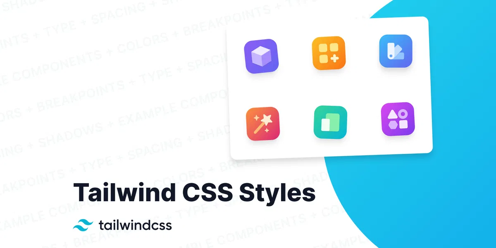
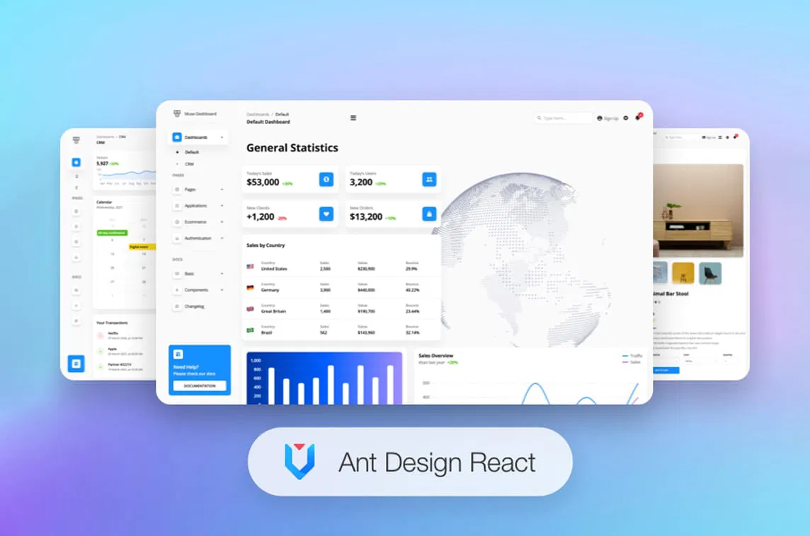
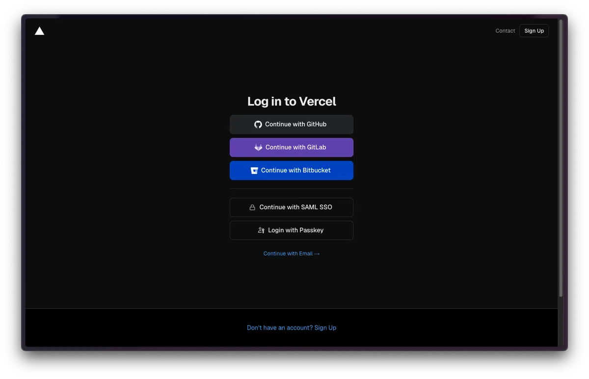
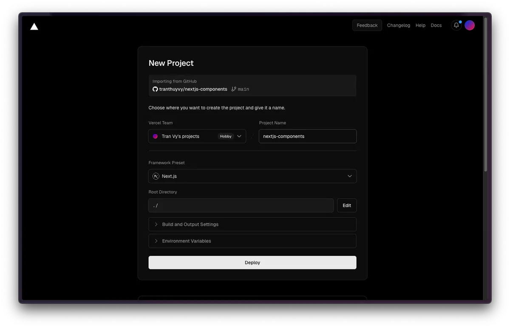
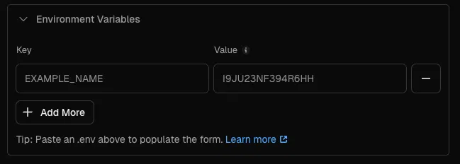
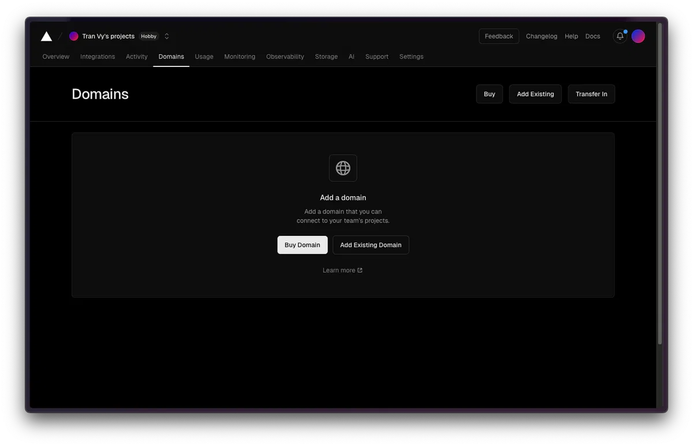
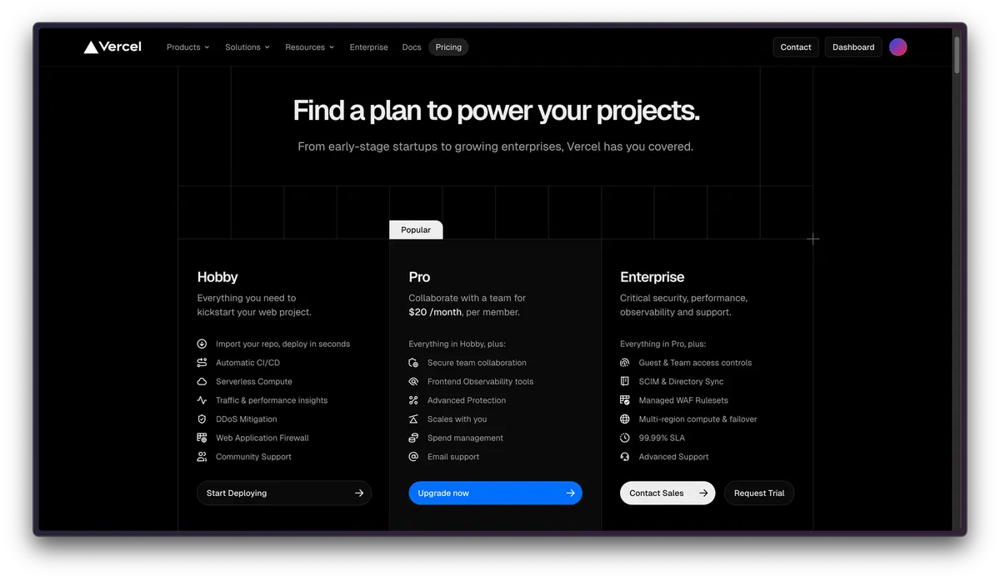

- [PHẦN 4: STYLING:](#phần-4-styling)
- [TailwindCSS, SCSS (Cơ bản)](#tailwindcss-scss-cơ-bản)
  - [1. Tailwind CSS là gì?](#1-tailwind-css-là-gì)
  - [1.1 Tại sao nên sử dụng Tailwind CSS?](#11-tại-sao-nên-sử-dụng-tailwind-css)
  - [1.2 Ưu điểm của Tailwind CSS](#12-ưu-điểm-của-tailwind-css)
  - [1.3 Nhược điểm của Tailwind CSS](#13-nhược-điểm-của-tailwind-css)
  - [2. Sử dụng Tailwind CSS thông qua CDN](#2-sử-dụng-tailwind-css-thông-qua-cdn)
  - [3. Hướng dẫn cài đặt Tailwind CSS](#3-hướng-dẫn-cài-đặt-tailwind-css)
  - [3.2 Thông qua Yarn](#32-thông-qua-yarn)
    - [Bước 1: Cài đặt Tailwind bằng lệnh](#bước-1-cài-đặt-tailwind-bằng-lệnh)
    - [Bước 2, 3, 4, 5](#bước-2-3-4-5)
    - [Bước 6: Xây dựng CSS](#bước-6-xây-dựng-css)
    - [Ví dụ: Thay màu nền khi di chuột với Tailwind CSS](#ví-dụ-thay-màu-nền-khi-di-chuột-với-tailwind-css)
  - [3.3 Cấu hình file `tailwind.config`](#33-cấu-hình-file-tailwindconfig)
    - [Cấu trúc cơ bản](#cấu-trúc-cơ-bản)
    - [Giải thích các phần chính](#giải-thích-các-phần-chính)
      - [🔹 Purge (Content)](#-purge-content)
      - [🔹 Theme (Tùy chỉnh)](#-theme-tùy-chỉnh)
      - [🔹 Extend](#-extend)
      - [🔹 Variants](#-variants)
      - [🔹 Plugins](#-plugins)
  - [Dark Mode trong Tailwind](#dark-mode-trong-tailwind)
  - [Kết luận](#kết-luận)
  - [Extension tailwind css intellisense](#extension-tailwind-css-intellisense)
  - [Cách cài trên trang chủ](#cách-cài-trên-trang-chủ)
- [Lib UI: (ShadCN, Antd,...) (Cơ bản)](#lib-ui-shadcn-antd-cơ-bản)
  - [1. Shadcn UI là gì và tại sao nó đặc biệt?](#1-shadcn-ui-là-gì-và-tại-sao-nó-đặc-biệt)
  - [2. Vai trò của Shadcn UI trong phát triển frontend](#2-vai-trò-của-shadcn-ui-trong-phát-triển-frontend)
    - [2.1 Trước khi có Shadcn UI](#21-trước-khi-có-shadcn-ui)
    - [2.2 Với Shadcn UI](#22-với-shadcn-ui)
    - [2.3 Những lợi ích chính](#23-những-lợi-ích-chính)
  - [3. Các tính năng cốt lõi của Shadcn UI](#3-các-tính-năng-cốt-lõi-của-shadcn-ui)
    - [3.1 Kiến trúc “Copy-Paste” tiên tiến](#31-kiến-trúc-copy-paste-tiên-tiến)
    - [3.2 Hệ thống theming mạnh mẽ](#32-hệ-thống-theming-mạnh-mẽ)
    - [3.4. Accessibility tích hợp sẵn](#34-accessibility-tích-hợp-sẵn)
  - [4. Cài đặt và sử dụng Shadcn UI](#4-cài-đặt-và-sử-dụng-shadcn-ui)
    - [4.1 Cài đặt trong dự án Next.js](#41-cài-đặt-trong-dự-án-nextjs)
    - [4.2 Thêm components vào dự án](#42-thêm-components-vào-dự-án)
    - [4.3 Sử dụng component trong code](#43-sử-dụng-component-trong-code)
  - [5. Xây dựng ứng dụng demo với Shadcn UI](#5-xây-dựng-ứng-dụng-demo-với-shadcn-ui)
    - [5.1 Thêm các components cần thiết](#51-thêm-các-components-cần-thiết)
    - [5.2 Tạo form đăng nhập](#52-tạo-form-đăng-nhập)
    - [5.3 Tùy biến component theo nhu cầu](#53-tùy-biến-component-theo-nhu-cầu)
  - [6. Khi nào nên và không nên dùng Shadcn](#6-khi-nào-nên-và-không-nên-dùng-shadcn)
- [Ant Design (AntD) — Tổng quan \& Hướng dẫn nhanh](#ant-design-antd--tổng-quan--hướng-dẫn-nhanh)
  - [1) Ant Design là gì?](#1-ant-design-là-gì)
  - [2) Tại sao nên dùng Ant Design?](#2-tại-sao-nên-dùng-ant-design)
  - [3) Các components thường dùng (kèm ví dụ)](#3-các-components-thường-dùng-kèm-ví-dụ)
    - [3.1 Button](#31-button)
    - [3.2 Input](#32-input)
    - [3.3 Form \& Form.Item (kèm validation)](#33-form--formitem-kèm-validation)
    - [3.4 Layout, Menu, Breadcrumb](#34-layout-menu-breadcrumb)
    - [3.5 Modal](#35-modal)
    - [3.6 Table](#36-table)
  - [4) Custom Theme (ConfigProvider)](#4-custom-theme-configprovider)
  - [5) Lưu ý khi dùng AntD](#5-lưu-ý-khi-dùng-antd)
    - [5.1 Giảm kích thước bundle](#51-giảm-kích-thước-bundle)
    - [5.2 Kết hợp với React Hook Form](#52-kết-hợp-với-react-hook-form)
    - [5.3 Layout Responsive (Grid)](#53-layout-responsive-grid)
    - [5.4 Icons](#54-icons)
  - [6) Lời khuyên thực tế](#6-lời-khuyên-thực-tế)
- [PHẦN 5: Deploy dự án (Vercel, Railway,...), CICD](#phần-5-deploy-dự-án-vercel-railway-cicd)
- [Vercel — Tổng quan, Tính năng \& Hướng dẫn Deploy](#vercel--tổng-quan-tính-năng--hướng-dẫn-deploy)
  - [1) Vercel là gì?](#1-vercel-là-gì)
  - [2) Tại sao nên sử dụng Vercel?](#2-tại-sao-nên-sử-dụng-vercel)
  - [3) Các tính năng nổi bật của Vercel](#3-các-tính-năng-nổi-bật-của-vercel)
    - [3.1 Serverless Functions](#31-serverless-functions)
    - [3.2 Preview Deployments](#32-preview-deployments)
    - [3.3 Rollbacks](#33-rollbacks)
    - [3.4 Aliases (đặt bí danh URL)](#34-aliases-đặt-bí-danh-url)
    - [3.5 Redirects \& Rewrites (Next.js)](#35-redirects--rewrites-nextjs)
    - [3.6 Password Protection (bảo vệ preview)](#36-password-protection-bảo-vệ-preview)
  - [4) So sánh Vercel với các nền tảng khác](#4-so-sánh-vercel-với-các-nền-tảng-khác)
  - [5) Hướng dẫn deploy dự án lên Vercel](#5-hướng-dẫn-deploy-dự-án-lên-vercel)
    - [B1: Đăng ký/đăng nhập tài khoản](#b1-đăng-kýđăng-nhập-tài-khoản)
    - [B2: Push code lên Git](#b2-push-code-lên-git)
    - [B3: Kết nối Vercel với repo](#b3-kết-nối-vercel-với-repo)
    - [B4: Cấu hình dự án](#b4-cấu-hình-dự-án)
    - [B5: Thêm biến môi trường (.env) nếu cần](#b5-thêm-biến-môi-trường-env-nếu-cần)
    - [B6: Quản lý domain](#b6-quản-lý-domain)
  - [6) Lưu ý trước khi chọn Vercel](#6-lưu-ý-trước-khi-chọn-vercel)
  - [7) Vercel Pricing (tóm tắt)](#7-vercel-pricing-tóm-tắt)
    - [7.1 **Hobby (Free)**](#71-hobby-free)
    - [7.2 **Pro ($20/người/tháng)**](#72-pro-20ngườitháng)
    - [7.3 **Enterprise (liên hệ)**](#73-enterprise-liên-hệ)
    - [Kết luận](#kết-luận-1)
- [CI/CD là gì? Lợi ích của việc thành thạo CI/CD trong DevOps](#cicd-là-gì-lợi-ích-của-việc-thành-thạo-cicd-trong-devops)
  - [Mục lục](#mục-lục)
  - [1. CI/CD là gì?](#1-cicd-là-gì)
  - [2. CI là gì?](#2-ci-là-gì)
    - [2.1 Định nghĩa CI](#21-định-nghĩa-ci)
    - [2.2 Những bước cơ bản trong CI](#22-những-bước-cơ-bản-trong-ci)
    - [2.3 Lợi ích của việc thiết lập CI](#23-lợi-ích-của-việc-thiết-lập-ci)
  - [3. CD là gì?](#3-cd-là-gì)
    - [3.1 Định nghĩa CD](#31-định-nghĩa-cd)
    - [3.2 Những bước cơ bản trong CD](#32-những-bước-cơ-bản-trong-cd)
    - [3.3 Lợi ích của việc thiết lập CD](#33-lợi-ích-của-việc-thiết-lập-cd)
  - [4. Lợi ích của việc thành thạo CI/CD trong DevOps](#4-lợi-ích-của-việc-thành-thạo-cicd-trong-devops)
  - [5. Kết luận](#5-kết-luận)
- [Thử Deploy 1 dự án React (setup biến environment, các bản development - production,...)](#thử-deploy-1-dự-án-react-setup-biến-environment-các-bản-development---production)
# PHẦN 4: STYLING:
# TailwindCSS, SCSS (Cơ bản)
## 1. Tailwind CSS là gì?

Tailwind CSS là một framework CSS utility-first giúp tạo kiểu nhanh chóng và hiệu quả cho website mà không cần viết CSS thủ công. Thay vì cung cấp các thành phần (component) hoặc kiểu thiết kế mặc định, Tailwind cung cấp một loạt các lớp tiện ích (utility classes) mà bạn có thể kết hợp linh hoạt để xây dựng giao diện tùy chỉnh.
## 1.1 Tại sao nên sử dụng Tailwind CSS?

Chúng ta thường lựa chọn những framework nhanh, dễ học để ứng dụng vào dự án. Tailwind CSS sẽ là một trợ thủ đắc lực hỗ trợ bạn, vì chúng được tích hợp sẵn rất nhiều tính năng và kiểu dáng để người dùng lựa chọn.

Bên cạnh đó, chúng cũng giúp tạo giao diện người dùng đẹp mắt và hiện đại. Tailwind CSS tạo các tiện ích nhỏ và dễ dàng tích hợp trực tiếp các class hiện có vào HTML code.
## 1.2 Ưu điểm của Tailwind CSS
- Tùy biến cao, hiệu suất cao. Không giống như Bootstrap cung cấp những class gần như đồng gọi sẵn, chỉ cần gọi ra là dùng. Tailwind giúp bạn định nghĩa những phần phù hợp với dự án của bạn mà không bị gò bó.
- Cho phép xây dựng responsive layout phức tạp.
- Responsive và phát triển dễ dàng.
- Tạo thành phần dễ dàng.
- Hỗ trợ cài đặt với nhiều framework front-end khác như react, vuejs,…
## 1.3 Nhược điểm của Tailwind CSS
- Thiếu tiêu đề và thành phần điều hướng (navigation).
- Cần có thời gian để làm quen, tìm hiểu và nhớ tên các class.
- Có kiến thức về CSS thì mới sử dụng tốt được.
## 2. Sử dụng Tailwind CSS thông qua CDN
```html
<link href=”https://unpkg.com/tailwindcss@^1.0/dist/tailwind.min.css” rel=”stylesheet”>
```

**Lưu ý**: Có một số hạn chế khi sử dụng CDN.

- Không thể sử dụng tùy chỉnh chủ đề mặc định của Tailwind
- Không thể sử dụng các lệnh như @apply, @variants,...
- Không thể cài đặt plugin của bên thứ ba
- Tốc độ tải trang của trang web phụ thuộc vào tốc độ kết nối internet của người dùng và khoảng cách đến máy chủ CDN. Nếu kết nối internet chậm hoặc khoảng cách đến máy chủ CDN quá xa, thời gian tải trang sẽ mất nhiều thời gian.
- Bạn cần phải trả phí để sử dụng các tính năng, dịch vụ CDN cao cấp.
- Bạn không thể kiểm soát việc lưu trữ tệp CSS của bạn trên máy chủ CDN. Điều này có thể ảnh hưởng đến việc kiểm soát và bảo mật dữ liệu của bạn.
- Vì vậy, trước khi sử dụng CDN, bạn nên cân nhắc các hạn chế này để đảm bảo rằng việc sử dụng CDN là phù hợp với nhu cầu của mình.  
Ví dụ:
```html
<!DOCTYPE html>
<html lang="en">

<head>
    <meta charset="UTF-8">

    <!-- Tailwind CSS CDN link -->
    <link href="https://unpkg.com/tailwindcss@^2/dist/tailwind.min.css" rel="stylesheet">
</head>

<body class="m-4">
    <h1 class="text-green-500 text-4xl font-bold">
        200Lab
    </h1>
    <strong>Learn Deep, Go Different</strong>
    <p>
        200Lab tin rằng để trở thành một lập trình viên giỏi đến từ việc hiểu bản chất của công nghệ chứ không đơn thuần chỉ biết code.

    </p>

</body>

</html>
```
## 3. Hướng dẫn cài đặt Tailwind CSS

**Bước 1:** Tailwind có sẵn trên npm và bạn có thể cài đặt nó bằng lệnh sau:
```bash
npm install tailwindcss postcss autoprefixer
```
**Bước 2**: Tạo tệp cấu hình Tailwind CSS bằng lệnh sau:
```bash
npx tailwindcss init
```
**Bước 3:** Tạo một `postcss.config.js` file trong thư mục gốc của thư mục dự án và thêm nội dung sau:
```js
module.exports = {
  plugins: [
    require('tailwindcss'),
    require('autoprefixer'),
  ],
}
```
**Bước 4:** Sau đó, tạo một `styles.css` file trong thư mục dự án của bạn `src` (hoặc bất kỳ thư mục nào khác mà bạn thích) và thêm nội dung sau:
```css
@tailwind base;
@tailwind components;
@tailwind utilities;
```
**Bước 5:** Ở thao tác này, bạn sẽ nhập các kiểu cơ sở, thành phần (components) và utilities styles từ Tailwind CSS.

Cuối cùng, thêm tập lệnh vào `package.json` file của bạn để tạo CSS:
```json
"scripts": {
  "build": "postcss src/styles.css -o dist/styles.css"
}
```
Tập lệnh này sẽ biên dịch `src/styles.css` file của bạn và xuất nó thành một `dist/styles.css` file.

Bước 6: Chạy lệnh sau để xây dựng CSS của bạn:
```bash
npm run build
```
Dưới đây mình đã chuyển toàn bộ phần hướng dẫn của bạn sang **Markdown** để dễ đọc và dễ dùng hơn:

---

## 3.2 Thông qua Yarn

### Bước 1: Cài đặt Tailwind bằng lệnh

```bash
yarn add tailwindcss postcss autoprefixer
```

### Bước 2, 3, 4, 5

Làm tương tự như cách cài đặt Tailwind CSS thông qua **npm**.

### Bước 6: Xây dựng CSS

```bash
yarn build
```

---

### Ví dụ: Thay màu nền khi di chuột với Tailwind CSS

```html
<!DOCTYPE html>
<html lang="en">

<head>
  <meta charset="UTF-8">
  <!-- Tailwind CSS CDN link -->
  <link href="https://unpkg.com/tailwindcss@^2/dist/tailwind.min.css" rel="stylesheet">
</head>

<body>
  <div class="h-full border-2 border-gray-200 border-opacity-60 rounded-lg overflow-hidden">
    <div class="p-6 hover:bg-green-600 hover:text-white transition duration-300 ease-in">
      <h1 class="text-2xl font-semibold mb-3">
        Hover
      </h1>
    </div>
  </div>
</body>

</html>
```

**Output:**
👉 Khi di chuột, background đổi sang màu xanh lá và chữ thành màu trắng.

---

## 3.3 Cấu hình file `tailwind.config`

Sau khi cài đặt, bạn sẽ thấy file `tailwind.config.js` hoặc `tailwind.config.ts`.

### Cấu trúc cơ bản

```javascript
module.exports = {
  content: [
    "./src/**/*.{html,js}", // chỉ định các file Tailwind sẽ xem xét
  ],
  theme: {
    extend: {},
  },
  plugins: [],
}
```

---

### Giải thích các phần chính

#### 🔹 Purge (Content)

* Giúp tối ưu kích thước CSS bằng cách loại bỏ class không dùng.
* Tailwind chỉ áp dụng trong những file bạn khai báo ở `content`.

Ví dụ:

```javascript
content: [
  "./src/**/*.{js,jsx,ts,tsx,html}",
],
```

#### 🔹 Theme (Tùy chỉnh)

Có thể custom màu sắc, font, spacing, fontSize,...

```javascript
theme: {
  extend: {
    colors: {
      primary: '#1DA1F2',
      secondary: '#14171A',
    },
    fontFamily: {
      sans: ['Roboto', 'sans-serif'],
    },
    spacing: {
      '128': '32rem',
      '144': '36rem',
    },
    fontSize: {
      xs: '.75rem',
      sm: '.875rem',
      tiny: '.875rem',
      base: '1rem',
      lg: '1.125rem',
      xl: '1.25rem',
      '2xl': '1.5rem',
      '3xl': '1.875rem',
      '4xl': '2.25rem',
      '5xl': '3rem',
      '6xl': '4rem',
      '7xl': '5rem',
    }
  },
},
```

👉 Sau khi cấu hình, bạn có thể dùng:
`bg-primary`, `text-secondary`, `font-sans`, `p-128`, `text-xs`

#### 🔹 Extend

Mở rộng giá trị mặc định mà **không ghi đè hoàn toàn**.

#### 🔹 Variants

Cấu hình các trạng thái như `hover`, `focus`, `responsive`.

```javascript
variants: {
  extend: {
    opacity: ['disabled'],
    backgroundColor: ['hover', 'focus', 'active'],
  },
}
```

#### 🔹 Plugins

Thêm plugin để mở rộng khả năng.
Ví dụ với **Typography**:

```bash
npm install @tailwindcss/typography
```

```javascript
plugins: [
  require('@tailwindcss/typography'),
],
```

Sử dụng:

```html
<article class="prose">
  <h1>Bài Viết Với Typography</h1>
  <p>Đây là một đoạn văn bản mẫu sử dụng plugin Typography.</p>
</article>
```

---

## Dark Mode trong Tailwind

Có 2 chế độ:

1. **Media** → theo hệ điều hành.
2. **Class** → thêm `dark` vào `html` hoặc `body`.

Ví dụ:

```html
<div class="bg-white text-black dark:bg-gray-800 dark:text-white">
  200Lab Tailwind Dark Mode
</div>
```

---

## Kết luận

File `tailwind.config.js` cho phép bạn:

* Tối ưu dung lượng CSS.
* Custom màu, font, spacing, kích thước.
* Thêm variant cho hover, focus, active.
* Cấu hình Dark Mode.
* Thêm plugin như Typography, Forms, Aspect Ratio.

Hiểu rõ file này giúp bạn tận dụng **tối đa sức mạnh Tailwind CSS**.

---

## Extension tailwind css intellisense
## Cách cài trên trang chủ 
 https://tailwindcss.com/docs/installation/using-vite
Nó là extension VS Code giúp bạn **viết Tailwind nhanh–đúng–ít sai**. Cụ thể:

- **Tự động gợi ý class** khi gõ `bg-`, `flex`, `hover`:, `sm`:… kể cả custom theme trong `tailwind.config.js` và class từ plugin.

- **Preview khi hover**: hiện màu, shadow, spacing, và CSS kết quả của class.

- **Cảnh báo & sửa lỗi**: báo class sai/typo, class không tồn tại, biến thể viết sai, v.v.

- **Jump to definition**: Ctrl/⌘-click vào token (vd: `text-brand-600`) để nhảy tới chỗ khai báo trong `tailwind.config.js`.

- **Hoàn thành trong CSS**: gợi ý cho `@apply`, `theme()`, `config()`, và `arbitrary values` như `w-[72px]`, `bg-[rgba(...)]`.

- Hiểu các chỉ thị `@tailwind,` `@layer`… (đỡ bị lằn vàng khó chịu).

- (Kèm đề xuất) Dùng chung với Prettier Plugin Tailwind để tự sắp xếp class gọn gàng.
Dưới đây là bản **Markdown sạch** (có code block) tổng hợp và chỉnh lý nội dung bạn đưa — kèm thêm ví dụ **loop** và **if** trong SCSS, và vài lưu ý hiện đại hóa (`@use/@forward` thay cho `@import`):

---

# CSS Preprocessor là gì?

**CSS Preprocessors** là các ngôn ngữ tiền xử lý giúp bạn viết CSS theo phong cách lập trình (biến, hàm, import, vòng lặp, điều kiện…). Mã sẽ được **biên dịch** (compile) về CSS thuần. Lợi ích:

* Viết nhanh hơn, **tái sử dụng** tốt.
* Cấu trúc rõ ràng, **dễ bảo trì** và mở rộng.

Các Preprocessor phổ biến: **Sass/SCSS**, **LESS**, **Stylus**.

---

# SASS/SCSS là gì?

**Sass/SCSS** là CSS preprocessor. Bạn viết bằng Sass/SCSS → trình biên dịch tạo ra **CSS**.

* **Sass** (cú pháp không dùng `{}` và `;`, dựa vào **thụt dòng**). Phần mở rộng: `.sass`
* **SCSS** (cú pháp **giống CSS** có `{}` và `;`). Phần mở rộng: `.scss`

  > SCSS ra đời sau, dễ làm quen hơn nếu bạn đã biết CSS.

## Ví dụ cú pháp

### Sass (indent-based, `.sass`)

```sass
.header
  color: #f3f3f3

.header__inner
  border: 1px solid #f3f3f3
```

### SCSS (giống CSS, `.scss`)

```scss
.header {
  color: #f3f3f3;
}

.header__inner {
  border: 1px solid #f3f3f3;
}
```

---

# Các tính năng cơ bản của SCSS

## 1) Xếp chồng (Nesting)

**HTML mẫu**

```html
<div class="container">
  <div class="row">
    <div class="navbar col-14">
      <a class="brand">TopDev</a>
      <ul class="menu">
        <li><a href="#">Menu 1</a></li>
        <li><a href="#">Menu 2</a></li>
      </ul>
    </div>
  </div>
</div>
```

**SCSS**

```scss
.navbar {
  ul.menu {
    list-style: none;

    li {
      padding: 3px;

      a {
        text-decoration: none;
      }
    }
  }
}
```

**CSS biên dịch**

```css
.navbar ul.menu {
  list-style: none;
}
.navbar ul.menu li {
  padding: 3px;
}
.navbar ul.menu li a {
  text-decoration: none;
}
```

> Lưu ý: Đừng lồng quá sâu (quy tắc 2–3 cấp là hợp lý) để tránh selector quá “nặng”.

---

## 2) Biến (Variables)

```scss
$redColor: #ff0000; // tên biến phân biệt hoa-thường

.navbar {
  ul.menu {
    list-style: none;

    li {
      padding: 3px;

      a {
        text-decoration: none;
        color: $redColor;
      }
    }
  }
}
```

---

## 3) Mixin

**Mixin** giống “hàm CSS” có thể tái sử dụng, có tham số:

```scss
@mixin colorVsStyle($color, $fontStyle) {
  color: $color;
  font-style: $fontStyle;
}

.navbar {
  ul.menu {
    list-style: none;

    li {
      padding: 5px;

      a {
        text-decoration: none;
        @include colorVsStyle(#000, italic);
      }
    }
  }
}
```

---

## 4) Kế thừa (`@extend`)

```scss
.title-box {
  color: #2efec8;
  text-shadow: 0 0 10px #6e6e6e;
  display: inline-block;
  text-transform: uppercase;
}

.navbar {
  ul.menu {
    list-style: none;

    li {
      padding: 4px;

      a {
        text-decoration: none;
        @extend .title-box;
      }
    }
  }
}
```

> Dùng `@extend` cẩn trọng vì nó **gộp selector** có thể làm CSS phình không như ý. Với component-based, nhiều team **ưu tiên mixin** hơn.

---

## 5) Import/Module: `@use` & `@forward` (khuyên dùng)

Trước đây hay viết:

```scss
// (cũ - hạn chế dùng)
@import 'variables';
@import 'mixins';
```

Hiện đại (Dart Sass): **`@use`** & **`@forward`**

```scss
// _variables.scss
$primary: #4f46e5;
$spacing: 8px;

// _mixins.scss
@mixin center-flex {
  display: flex;
  align-items: center;
  justify-content: center;
}

// styles.scss
@use 'variables';
@use 'mixins';

.button {
  padding: variables.$spacing * 2;
  background: variables.$primary;
  @include mixins.center-flex;
}
```

> Quy ước file “partial” bắt đầu bằng `_` (vd: `_variables.scss`) và được import **không kèm** dấu gạch dưới.

---

## 6) Vòng lặp (Loops)

### `@for`

```scss
// Tạo util spacing .m-1 ... .m-5
@for $i from 1 through 5 {
  .m-#{$i} { margin: $i * 4px; }
}
```

### `@each`

```scss
$colors: (primary: #4f46e5, success: #16a34a, danger: #dc2626);

@each $name, $val in $colors {
  .text-#{$name} { color: $val; }
  .bg-#{$name}   { background-color: $val; }
}
```

### `@while` (ít dùng)

```scss
$i: 0;
@while $i < 3 {
  .w-#{$i} { width: $i * 25%; }
  $i: $i + 1;
}
```

---

## 7) Điều kiện (`@if`, `@else if`, `@else`)

```scss
$theme: dark;

.button {
  @if $theme == dark {
    background: #111;
    color: #fff;
  } @else if $theme == light {
    background: #fff;
    color: #111;
  } @else {
    background: gray;
    color: white;
  }
}
```

---

# Tổ chức mã SCSS “đẹp”

```
styles/
├─ _variables.scss
├─ _mixins.scss
├─ base/
│  ├─ _reset.scss
│  └─ _typography.scss
├─ components/
│  ├─ _button.scss
│  └─ _card.scss
├─ pages/
│  └─ _home.scss
└─ styles.scss   // file chính, @use các partial ở trên
```

`styles.scss`:

```scss
@use 'variables';
@use 'mixins';
@use 'base/reset';
@use 'base/typography';
@use 'components/button';
@use 'components/card';
@use 'pages/home';
```

---

# Dùng SCSS với Vite + React + Tailwind

1. Cài trình biên dịch Sass:

   ```bash
   npm i -D sass   # hoặc yarn add -D sass / pnpm add -D sass
   ```
2. Tạo `src/styles/styles.scss` và import ở `src/main.tsx` **hoặc** trong `index.css`:

   ```ts
   // main.tsx
   import './styles/styles.scss';
   ```
3. Với **Tailwind**, bạn vẫn để file Tailwind (v4: `@import "tailwindcss";` hoặc plugin vite). SCSS có thể dùng song song cho phần cấu trúc/phần bạn muốn tái sử dụng:

   ```scss
   /* styles.scss */
   @use 'variables';

   .card {
     @apply rounded-xl shadow p-4; // Tailwind utility (nếu bật @apply)
     background: white;
     color: #111;
   }
   ```

---

# Mẹo & lưu ý

* **Giới hạn nesting** (≤ 3 cấp) để tránh specificity “quá tay”.
* **Dùng `@use/@forward`** thay `@import` cho dự án mới.
* **Ưu tiên mixin** cho tái sử dụng, cân nhắc khi dùng `@extend`.
* **Biến & map** giúp bạn thống nhất màu sắc/spacing/typography.
* Khi đi với **Tailwind**, để Tailwind lo phần utility nhanh; SCSS cho logic lặp, theme, mixin… → kết hợp hai bên sẽ rất mạnh.

---

Nếu bạn muốn, mình có thể **gắn đoạn này trực tiếp** vào README của dự án todo (mục “Styling”) và thêm ví dụ thực tế: một `Button` component dùng **Tailwind + SCSS mixin**.

  # Lib UI: (ShadCN, Antd,...) (Cơ bản)
  ## 1. Shadcn UI là gì và tại sao nó đặc biệt?
Shadcn UI là một bộ components UI mã nguồn mở ngày càng được ưa chuộng trong cộng đồng frontend. Nhưng khác với các thư viện UI truyền thống như Material UI, Bootstrap hay Chakra UI, Shadcn UI không phải là một "thư viện" theo nghĩa thông thường.

**Điều gì khiến Shadcn UI khác biệt?** Thay vì cài đặt một package và import components từ đó, Shadcn UI cho phép bạn sao chép code của components trực tiếp vào dự án của mình. Đây là cách tiếp cận "copy-paste" nhưng được tự động hóa thông qua CLI.


Hãy tưởng tượng đơn giản như sau:

- **Thư viện UI thông thường**: Như việc thuê một căn nhà được thiết kế sẵn. Bạn có thể sử dụng nhưng không thể thay đổi cấu trúc.
- **Shadcn UI**: Giống như mua bản thiết kế nhà đẹp, nhưng bạn có quyền sở hữu bản thiết kế và có thể tùy ý sửa đổi.

```bash
# Thay vì cài đặt thư viện như thông thường
npm install some-ui-library

# Với Shadcn UI, bạn thêm từng component vào dự án
npx shadcn-ui@latest add button
```

Sau khi chạy lệnh trên, bạn sẽ thấy một file `button.tsx` xuất hiện trong thư mục `components` của dự án. File này chứa toàn bộ code của Button component, và bạn có thể **tự do chỉnh sửa** nó.

---

## 2. Vai trò của Shadcn UI trong phát triển frontend

Shadcn UI giải quyết một vấn đề cốt lõi mà nhiều developers gặp phải: **làm sao để vừa phát triển nhanh, vừa có toàn quyền kiểm soát giao diện?**

### 2.1 Trước khi có Shadcn UI

Trước đây, developers thường phải lựa chọn một trong hai cách:

```jsx
// Cách 1: Dùng thư viện UI (phát triển nhanh, ít kiểm soát)
import { Button } from 'ui-library';

function App() {
  return <Button color="primary">Click me</Button>;
  // Nhưng khi cần tùy biến đặc biệt? Phải override CSS hoặc hack!
}
```

```jsx
// Cách 2: Tự xây dựng mọi thứ (kiểm soát tối đa, nhưng chậm)
function CustomButton({ children, ...props }) {
  return (
    <button 
      className="px-4 py-2 bg-blue-500 text-white rounded hover:bg-blue-600" 
      {...props}
    >
      {children}
    </button>
  );
}
```

### 2.2 Với Shadcn UI

Bạn có được **sự cân bằng hoàn hảo**:

```tsx
// components/ui/button.tsx - File này được tạo bởi Shadcn UI CLI
// Nhưng bạn có thể chỉnh sửa nó theo ý muốn!
import * as React from "react";
import { cva } from "class-variance-authority";

// Định nghĩa variants và styles
const buttonVariants = cva(
  "inline-flex items-center justify-center rounded-md text-sm font-medium",
  {
    variants: {
      variant: {
        default: "bg-primary text-primary-foreground hover:bg-primary/90",
        // Thêm một variant mới? Dễ dàng!
        custom: "bg-gradient-to-r from-purple-500 to-pink-500 text-white",
      },
      // ...còn nhiều tùy chọn khác
    },
  }
);

// Sử dụng trong ứng dụng
// (giả sử bạn export Button dùng các variants ở trên)
```

```tsx
import { Button } from "@/components/ui/button";

function App() {
  return <Button variant="custom">Beautiful Button</Button>;
}
```

### 2.3 Những lợi ích chính

* **Sở hữu code:** Bạn hoàn toàn kiểm soát mỗi component.
* **Tùy biến không giới hạn:** Không còn hack CSS hay override phức tạp.
* **Bundle size tối ưu:** Chỉ dùng những components bạn cần.
* **Không lo dependency hell:** Hạn chế xung đột phiên bản.
* **Dễ bảo trì:** Cập nhật từng component độc lập.

---

## 3. Các tính năng cốt lõi của Shadcn UI

### 3.1 Kiến trúc “Copy-Paste” tiên tiến

Shadcn UI hoạt động dựa trên nguyên tắc “copy-paste cấp cao”. Nó **không** phải package được cài qua npm, mà là **bộ code chất lượng cao** được đưa trực tiếp vào dự án của bạn thông qua CLI.

```bash
# Khi bạn chạy lệnh này
npx shadcn-ui@latest add dialog

# CLI sẽ tạo các file trong thư mục components/ui của dự án
# - dialog.tsx
# - dialog-content.tsx
# - dialog-description.tsx
# Và bạn hoàn toàn sở hữu những file này!
```

Shadcn UI kết hợp những công nghệ tốt nhất trong hệ sinh thái frontend:

* **Tailwind CSS:** Cung cấp styling linh hoạt và hiệu quả
* **Radix UI:** Đảm bảo accessibility và behavior đúng đắn
* **class-variance-authority (CVA):** Quản lý variants dễ dàng
* **TypeScript:** Type-safety cho developer experience tốt hơn

### 3.2 Hệ thống theming mạnh mẽ

Shadcn UI sử dụng **CSS variables** thông qua Tailwind CSS, cho phép bạn dễ dàng tạo và chuyển đổi giữa các theme.

```css
/* globals.css */
@tailwind base;
@tailwind components;
@tailwind utilities;
 
@layer base {
  :root {
    /* Light theme colors */
    --background: 0 0% 100%;
    --foreground: 240 10% 3.9%;
    --primary: 240 5.9% 10%;
    /* ...các biến khác */
  }
 
  .dark {
    /* Dark theme colors */
    --background: 240 10% 3.9%;
    --foreground: 0 0% 98%;
    --primary: 0 0% 98%;
    /* ...các biến khác */
  }
}
```

Mọi component trong Shadcn UI đều sử dụng các biến này, vì vậy việc thay đổi theme **toàn cục** trở nên cực kỳ đơn giản.

### 3.4. Accessibility tích hợp sẵn

Mỗi component của Shadcn UI đều được xây dựng với accessibility là ưu tiên hàng đầu, nhờ vào nền tảng **Radix UI primitives**. Điều này đảm bảo các components của bạn:

* Hoạt động chính xác với **keyboard navigation**
* Tương thích với **screen readers**
* Tuân thủ **WAI-ARIA patterns**
* Có **độ tương phản (contrast)** đạt chuẩn

> *(Lưu ý: mục đánh số “3.4” giữ nguyên theo bản gốc.)*

---

## 4. Cài đặt và sử dụng Shadcn UI

### 4.1 Cài đặt trong dự án Next.js

```bash
# Tạo dự án Next.js mới (nếu chưa có)
npx create-next-app@latest my-app

# Di chuyển vào thư mục dự án
cd my-app

# Khởi tạo Shadcn UI
npx shadcn-ui@latest init
```

Trong quá trình khởi tạo, CLI sẽ hỏi một số câu hỏi cấu hình:

```txt
Would you like to use TypeScript? Yes
Which style would you like to use? Default
Which color would you like to use as base color? Slate
Where is your global CSS file? app/globals.css
Would you like to use CSS variables? Yes
Where would you like to install the components? components/ui
Configure the import alias for components? Yes
```

### 4.2 Thêm components vào dự án

```bash
# Thêm một component
npx shadcn-ui@latest add button

# Thêm nhiều components cùng lúc
npx shadcn-ui@latest add card form input label
```

### 4.3 Sử dụng component trong code

```tsx
// app/page.tsx
import { Button } from "@/components/ui/button";

export default function Home() {
  return (
    <div className="flex flex-col items-center justify-center min-h-screen">
      <h1 className="text-3xl font-bold mb-4">Shadcn UI Demo</h1>
      
      <div className="space-y-4">
        <Button variant="default">Default Button</Button>
        <Button variant="destructive">Destructive Button</Button>
        <Button variant="outline">Outline Button</Button>
        <Button variant="ghost">Ghost Button</Button>
        <Button variant="link">Link Button</Button>
      </div>
    </div>
  );
}
```

---

## 5. Xây dựng ứng dụng demo với Shadcn UI

Hãy cùng xây dựng một **form đăng nhập** đơn giản để thấy Shadcn UI hoạt động trên thực tế.

### 5.1 Thêm các components cần thiết

```bash
npx shadcn-ui@latest add card
npx shadcn-ui@latest add input
npx shadcn-ui@latest add label
npx shadcn-ui@latest add button
```

### 5.2 Tạo form đăng nhập

```tsx
// components/LoginForm.tsx
"use client";

import { useState } from "react";
import { Card, CardContent, CardDescription, CardFooter, CardHeader, CardTitle } from "@/components/ui/card";
import { Input } from "@/components/ui/input";
import { Label } from "@/components/ui/label";
import { Button } from "@/components/ui/button";

export default function LoginForm() {
  const [email, setEmail] = useState("");
  const [password, setPassword] = useState("");
  
  const handleSubmit = (e: React.FormEvent<HTMLFormElement>) => {
    e.preventDefault();
    console.log("Login attempted with:", { email, password });
    // Xử lý đăng nhập ở đây
  };

  return (
    <Card className="w-[350px]">
      <CardHeader>
        <CardTitle>Đăng nhập</CardTitle>
        <CardDescription>Đăng nhập để tiếp tục sử dụng ứng dụng.</CardDescription>
      </CardHeader>
      <form onSubmit={handleSubmit}>
        <CardContent className="space-y-4">
          <div className="space-y-2">
            <Label htmlFor="email">Email</Label>
            <Input 
              id="email" 
              type="email" 
              placeholder="your-email@example.com"
              value={email}
              onChange={(e) => setEmail(e.target.value)}
              required
            />
          </div>
          <div className="space-y-2">
            <Label htmlFor="password">Mật khẩu</Label>
            <Input 
              id="password" 
              type="password" 
              value={password}
              onChange={(e) => setPassword(e.target.value)}
              required
            />
          </div>
        </CardContent>
        <CardFooter>
          <Button type="submit" className="w-full">Đăng nhập</Button>
        </CardFooter>
      </form>
    </Card>
  );
}
```

### 5.3 Tùy biến component theo nhu cầu

Giả sử bạn muốn thêm một **variant mới** cho Button component để sử dụng trong form đăng nhập. Bạn có thể dễ dàng sửa đổi file `button.tsx`:

```tsx
// components/ui/button.tsx (chỉnh sửa file đã được tạo bởi CLI)
import * as React from "react";
import { cva } from "class-variance-authority";

// Thêm variant login-button vào buttonVariants
const buttonVariants = cva(
  "inline-flex items-center justify-center rounded-md text-sm font-medium...",
  {
    variants: {
      variant: {
        default: "bg-primary text-primary-foreground hover:bg-primary/90",
        destructive: "bg-destructive text-destructive-foreground hover:bg-destructive/90",
        outline: "border border-input hover:bg-accent hover:text-accent-foreground",
        // Thêm variant mới
        "login-button": "bg-blue-600 text-white hover:bg-blue-700 transition-colors",
      },
      // ...các variants khác
    },
  }
);

// Ví dụ dùng trong LoginForm.tsx
// <Button type="submit" variant="login-button" className="w-full">
//   Đăng nhập
// </Button>
```

Đây chính là sức mạnh của Shadcn UI — bạn có thể **tùy biến mọi thứ** theo nhu cầu của mình!

---

## 6. Khi nào nên và không nên dùng Shadcn

**Nên chọn Shadcn UI khi:**

* Bạn cần **kiểm soát hoàn toàn** về code của components
* Dự án cần **nhiều tùy biến** đặc biệt
* Bạn muốn **tối ưu bundle size**
* Bạn đã **quen Tailwind CSS**
* Bạn cần xây dựng **design system riêng** dựa trên nền tảng vững chắc

**Cân nhắc thư viện khác khi:**

* Bạn cần một giải pháp **“plug and play”** hoàn chỉnh
* Dự án cần triển khai nhanh với **ít tùy biến**
* Team **không quen** quản lý code components
* Bạn cần **components rất phức tạp** mà không muốn tự xây lại

---
# Ant Design (AntD) — Tổng quan & Hướng dẫn nhanh

## 1) Ant Design là gì?

**Ant Design (AntD)** là một **design system** hoàn chỉnh cho web (đặc biệt mạnh trong hệ sinh thái React), do Ant Financial (Alibaba Group) phát triển. Ban đầu dùng nội bộ để xây ứng dụng phức tạp (nhiều form, bảng dữ liệu, tương tác), sau đó **open-source** và nhanh chóng được cộng đồng ưa chuộng.

**Điểm nổi bật:**

* 50+ components: từ cơ bản (*Button, Input, …*) đến phức tạp (*Form, Table, TreeSelect, DatePicker, …*).
* **Tuỳ biến theme** (màu, font, kích thước, token).
* **Tài liệu chi tiết**, ví dụ phong phú; cộng đồng lớn.
* Tương thích tốt với **React Hooks, Redux, Next.js, …**

---

## 2) Tại sao nên dùng Ant Design?

**Khi nào hợp lý?**
Các ứng dụng **quản trị, dashboard, hệ thống nội bộ**: CRM, quản lý bán hàng, phân tích dữ liệu, …

**Ưu điểm:**

* Component phong phú: **Table** (sort/filter/pagination), **Form** (validation), **Modal / Drawer / Notification**, …
* **Tiết kiệm thời gian** triển khai UI, ít phải viết CSS từ đầu.
* **Docs rõ ràng**, dễ tra cứu lỗi/ví dụ.
* **Dễ custom** màu sắc, font, kích thước → thống nhất brand.

**Nhược điểm (nhỏ):**

* **Bundle nặng** nếu import ồ ạt → khắc phục bằng **tree-shaking**.
* Style mặc định hơi “cứng” → cần **tùy biến theme** nhiều nếu muốn “phá cách”.

---

## 3) Các components thường dùng (kèm ví dụ)

### 3.1 Button

```jsx
import { Button } from 'antd';

function ExampleButtons() {
  return (
    <div>
      <Button type="primary">Primary</Button>
      <Button>Default</Button>
      <Button type="dashed">Dashed</Button>
      <Button type="text">Text</Button>
      <Button type="link">Link</Button>
    </div>
  );
}
```

**Button + icon + loading:**

```jsx
import { Button } from 'antd';
import { SearchOutlined } from '@ant-design/icons';

function ExampleIconButton() {
  return (
    <Button type="primary" icon={<SearchOutlined />} loading>
      Tìm kiếm
    </Button>
  );
}
```

---

### 3.2 Input

```jsx
import { Input } from 'antd';

function ExampleInputs() {
  return (
    <div>
      <Input placeholder="Nhập nội dung..." style={{ width: 200 }} />
      <Input
        addonBefore="http://"
        addonAfter=".com"
        defaultValue="mysite"
        style={{ width: 300 }}
      />
      <Input.Password placeholder="Nhập mật khẩu" style={{ width: 200 }} />
    </div>
  );
}
```

---

### 3.3 Form & Form.Item (kèm validation)

```jsx
import { Form, Input, Button } from 'antd';

function ExampleForm() {
  const [form] = Form.useForm();

  const onFinish = (values) => {
    console.log('Form data:', values);
  };

  return (
    <Form form={form} onFinish={onFinish} layout="vertical" style={{ width: 300 }}>
      <Form.Item
        name="username"
        label="Tên đăng nhập"
        rules={[{ required: true, message: 'Vui lòng nhập tên đăng nhập!' }]}
      >
        <Input />
      </Form.Item>

      <Form.Item
        name="password"
        label="Mật khẩu"
        rules={[{ required: true, message: 'Vui lòng nhập mật khẩu!' }]}
      >
        <Input.Password />
      </Form.Item>

      <Form.Item>
        <Button type="primary" htmlType="submit">Đăng nhập</Button>
      </Form.Item>
    </Form>
  );
}
```

---

### 3.4 Layout, Menu, Breadcrumb

```jsx
import { Layout, Menu } from 'antd';
const { Header, Content, Footer, Sider } = Layout;

function ExampleLayout() {
  return (
    <Layout style={{ minHeight: '100vh' }}>
      <Sider>
        <div style={{ color: '#fff', textAlign: 'center', padding: '20px 0' }}>Logo</div>
        <Menu
          theme="dark"
          mode="inline"
          items={[
            { key: '1', label: 'Trang chủ' },
            { key: '2', label: 'Người dùng' },
            { key: '3', label: 'Cài đặt' },
          ]}
        />
      </Sider>
      <Layout>
        <Header style={{ background: '#fff', paddingLeft: 20 }}>Header</Header>
        <Content style={{ margin: 20, background: '#fff', padding: 20 }}>
          Nội dung chính
        </Content>
        <Footer style={{ textAlign: 'center' }}>
          Ant Design ©2023 Created by Ant UED
        </Footer>
      </Layout>
    </Layout>
  );
}
```

**Breadcrumb:**

```jsx
import { Breadcrumb } from 'antd';

function ExampleBreadcrumb() {
  return (
    <Breadcrumb style={{ margin: '16px 0' }}>
      <Breadcrumb.Item>Trang chủ</Breadcrumb.Item>
      <Breadcrumb.Item>Danh sách</Breadcrumb.Item>
      <Breadcrumb.Item>Chi tiết</Breadcrumb.Item>
    </Breadcrumb>
  );
}
```

---

### 3.5 Modal

```jsx
import { useState } from 'react';
import { Modal, Button } from 'antd';

function ExampleModal() {
  const [open, setOpen] = useState(false);

  return (
    <>
      <Button onClick={() => setOpen(true)}>Mở Modal</Button>
      <Modal
        title="Thông báo"
        open={open}
        onOk={() => setOpen(false)}
        onCancel={() => setOpen(false)}
      >
        <p>Nội dung trong Modal</p>
      </Modal>
    </>
  );
}
```

---

### 3.6 Table

```jsx
import { Table } from 'antd';

const columns = [
  { title: 'Tên', dataIndex: 'name', key: 'name', sorter: (a, b) => a.name.localeCompare(b.name) },
  { title: 'Tuổi', dataIndex: 'age', key: 'age' },
  { title: 'Địa chỉ', dataIndex: 'address', key: 'address' },
];

const data = [
  { key: 1, name: 'Vy', age: 23, address: 'VietNam' },
  { key: 2, name: '200Lab', age: 100, address: '70 Huỳnh Văn Bánh, Phú Nhuận' },
  { key: 3, name: 'Thanh', age: 22, address: 'HCM' },
];

function ExampleTable() {
  return <Table columns={columns} dataSource={data} />;
}
```

---

## 4) Custom Theme (ConfigProvider)

```jsx
import { ConfigProvider } from 'antd';

function ThemedApp() {
  return (
    <ConfigProvider
      theme={{
        token: {
          colorPrimary: '#1DA57A',
          borderRadius: 4,
        },
      }}
    >
      <App />
    </ConfigProvider>
  );
}
```

> Tất cả `Button`, `Input`, `Form`, … sẽ nhận **primary color** là `#1DA57A`. Có thể đổi **font**, **size**, … bằng token.

---

## 5) Lưu ý khi dùng AntD

### 5.1 Giảm kích thước bundle

**Chỉ mang vào những gì cần dùng** (tree-shaking). Có thể dùng plugin:

```json
// .babelrc
{
  "plugins": [
    ["import", { "libraryName": "antd", "style": true }]
  ]
}
```

> Sau đó `import { Button } from 'antd';` vẫn gọn gàng.

### 5.2 Kết hợp với React Hook Form

```jsx
import React from 'react';
import { useForm, Controller } from 'react-hook-form';
import { Input, Button, Form } from 'antd';

function ExampleHookForm() {
  const { handleSubmit, control } = useForm({
    defaultValues: { username: '', password: '' }
  });

  const onSubmit = (data) => {
    console.log('Dữ liệu từ form:', data);
  };

  return (
    <Form layout="vertical" style={{ width: 300 }} onFinish={handleSubmit(onSubmit)}>
      <Form.Item label="Tên đăng nhập" required>
        <Controller
          name="username"
          control={control}
          rules={{ required: 'Vui lòng nhập tên đăng nhập!' }}
          render={({ field, fieldState }) => (
            <>
              <Input {...field} placeholder="Nhập tên đăng nhập" />
              {fieldState.error && (
                <div style={{ color: 'red' }}>{fieldState.error.message}</div>
              )}
            </>
          )}
        />
      </Form.Item>

      <Form.Item label="Mật khẩu" required>
        <Controller
          name="password"
          control={control}
          rules={{ required: 'Vui lòng nhập mật khẩu!' }}
          render={({ field, fieldState }) => (
            <>
              <Input.Password {...field} placeholder="Nhập mật khẩu" />
              {fieldState.error && (
                <div style={{ color: 'red' }}>{fieldState.error.message}</div>
              )}
            </>
          )}
        />
      </Form.Item>

      <Form.Item>
        <Button type="primary" htmlType="submit">Đăng nhập</Button>
      </Form.Item>
    </Form>
  );
}

export default ExampleHookForm;
```

### 5.3 Layout Responsive (Grid)

```jsx
import { Row, Col } from 'antd';

function ResponsiveExample() {
  return (
    <Row gutter={[16, 16]}>
      <Col xs={24} sm={12} md={8} lg={6}>Cột 1</Col>
      <Col xs={24} sm={12} md={8} lg={6}>Cột 2</Col>
      <Col xs={24} sm={12} md={8} lg={6}>Cột 3</Col>
      <Col xs={24} sm={12} md={8} lg={6}>Cột 4</Col>
    </Row>
  );
}
```

### 5.4 Icons

```jsx
import { SmileOutlined } from '@ant-design/icons';

function IconExample() {
  return <SmileOutlined style={{ fontSize: 24, color: '#08c' }} />;
}
```

---

## 6) Lời khuyên thực tế

* **Đọc tài liệu chính chủ:** [https://ant.design/components/overview/](https://ant.design/components/overview/) — nhiều ví dụ rõ ràng.
* **Xác định layout & component sớm:** sidebar, header, footer, breadcrumb, …
* **Ưu tiên theme token** để đồng bộ; **hạn chế override CSS** thủ công.
* **Tối ưu build:** tree-shaking, `babel-plugin-import` (hoặc cấu hình tương đương).

---


  # PHẦN 5: Deploy dự án (Vercel, Railway,...), CICD
  # Vercel — Tổng quan, Tính năng & Hướng dẫn Deploy

## 1) Vercel là gì?

**Vercel** (trước đây là **Zeit**) là nền tảng đám mây giúp developer **deploy ứng dụng tĩnh và serverless** nhanh chóng, an toàn và hiệu quả. Vercel hỗ trợ nhiều framework phổ biến: **Next.js, React, Vue.js, Angular, Svelte, …**

**Điểm mạnh**: tối ưu hiệu năng & UX nhờ **CDN toàn cầu** và **Serverless Functions**.
Ví dụ, bạn có dự án nhỏ và muốn public: Vercel giúp bạn đưa lên internet chỉ trong **vài bước đơn giản**.

> *vercel deploy product* (minh họa)

---

## 2) Tại sao nên sử dụng Vercel?

* **Dễ triển khai**: vài thao tác là deploy xong, hầu như **không cần cấu hình** phức tạp.
* **Hiệu suất cao**: **CDN toàn cầu** phân phối nội dung từ máy chủ gần người dùng.
* **Serverless Functions**: viết code phía server **không cần quản lý server**.
* **Tích hợp Git**: push lên GitHub/GitLab/Bitbucket → **tự động build & deploy**.
* **Miễn phí cho dự án cá nhân**: đủ xài cho MVP / side project.
* **Tự động hoá hạ tầng**: SSL, bảo mật, tối ưu, scaling… **Vercel lo**.
* **Đa framework**: Next.js, React, Vue, Svelte, Nuxt, …
* **Quản lý nhóm**: tích hợp công cụ dev/monitoring, tối ưu quy trình làm việc.

---

## 3) Các tính năng nổi bật của Vercel

### 3.1 Serverless Functions

* Viết logic backend dạng **hàm kích hoạt theo request/sự kiện** thay vì duy trì server.
* Dùng **JS/TS** (và các ngôn ngữ khác) tùy nhu cầu.
* Ghép nhiều function thành **workflow**: nhận input → gọi API phân tích → trả kết quả/lưu DB.
* **Tối ưu chi phí**: chỉ trả tiền khi có request thực thi.
* Không cần cấu hình server, SSL, hệ điều hành… → **tập trung code & UX**.

### 3.2 Preview Deployments

Mỗi lần mở **pull request** hoặc **push** lên branch mới:

* Vercel tạo **một URL preview** riêng cho nhánh đó, ví dụ:
  `https://my-vercel-app-git-feature-new-ui-your-username.vercel.app`
* Dễ **share** cho team/khách hàng để **review** trước khi merge.

### 3.3 Rollbacks

Phát hiện lỗi sau khi deploy?

* Vào **Dashboard → Deployments**, chọn version muốn quay lại → **Rollback**.

### 3.4 Aliases (đặt bí danh URL)

* Trong **Deployments**, chọn bản deploy → **Aliases** → thêm alias mong muốn.

### 3.5 Redirects & Rewrites (Next.js)

```js
// next.config.js
module.exports = {
  async redirects() {
    return [
      {
        source: '/old-page',
        destination: '/new-page',
        permanent: true,
      },
    ];
  },
};
```

### 3.6 Password Protection (bảo vệ preview)

* **Project Settings → Password Protection**: đặt mật khẩu cho môi trường preview.

---

## 4) So sánh Vercel với các nền tảng khác

| Tiêu chí             | **Vercel**                              | **Netlify**                            | **Heroku**                              |
| -------------------- | --------------------------------------- | -------------------------------------- | --------------------------------------- |
| Hỗ trợ Framework     | Next.js, React, Vue, Angular, Svelte, … | Gatsby, React, Vue, Angular, Svelte, … | Không giới hạn (Node, Ruby, Python, …)  |
| Serverless Functions | Có (**Edge Functions** hiệu suất cao)   | Có (**Netlify Functions**)             | Có (Dynos, cần cấu hình)                |
| Tối ưu cho           | Frontend, đặc biệt **Next.js**          | Website tĩnh & **JAMstack**            | Ứng dụng **backend / API**              |
| Tích hợp Git         | GitHub, GitLab, Bitbucket               | GitHub, GitLab, Bitbucket              | GitHub, GitLab, Bitbucket               |
| CDN toàn cầu         | Có                                      | Có                                     | Không                                   |
| Triển khai tự động   | Có                                      | Có                                     | Có (thường cần cấu hình thêm)           |
| Chi phí              | Free + trả phí theo nhu cầu             | Free + trả phí                         | Free giới hạn + trả phí theo tài nguyên |
| Quản lý database     | Không (dùng dịch vụ bên thứ ba)         | Không                                  | Có (Heroku Postgres, add-ons)           |
| SSL tự động          | Có                                      | Có                                     | Có                                      |
| Custom Domain        | Có                                      | Có                                     | Có                                      |

**Chọn gì?**

* **Next.js + SSR + Serverless** → **Vercel**.
* **Site tĩnh (Gatsby/Hugo)** → **Netlify**.
* **Backend + DB** cần chủ động quản trị → **Heroku**.

---

## 5) Hướng dẫn deploy dự án lên Vercel

### B1: Đăng ký/đăng nhập tài khoản

* Vào trang chủ Vercel, đăng ký miễn phí (có thể dùng **GitHub/GitLab/Bitbucket**).

> *vercel login page* (minh họa)

### B2: Push code lên Git

* Tạo repository (ví dụ GitHub) và **push** code.
* Ví dụ ứng dụng Next.js đơn giản:

```js
// pages/index.js
export default function Home() {
  return (
    <div>
      <h1>Chào mừng bạn đến với website của tôi!</h1>
    </div>
  );
}
```

### B3: Kết nối Vercel với repo

* Trong Vercel, chọn **Add Project** → kết nối tài khoản Git → chọn repo **my-vercel-app** → **Import**.

### B4: Cấu hình dự án

* Vercel tự nhận diện framework.
* Kiểm tra:

  * **Framework Preset**: Next.js
  * **Root Directory**: (chỉ định nếu dự án nằm trong thư mục con)
  * **Build Command**: `npm run build`
  * **Output Directory**: `.next`

> *add new project in vercel* (minh họa)

### B5: Thêm biến môi trường (.env) nếu cần

Ví dụ sử dụng biến môi trường **HOST\_API**:

```js
// pages/index.js
export default function Home() {
  return <h1>API Host: {process.env.HOST_API}</h1>;
}
```

* Trong **Environment Variables**:

  * Name: `HOST_API`
  * Value: `https://api.example.com`
* Nhấn **Deploy** để bắt đầu build & deploy.

### B6: Quản lý domain

* Dashboard → **Domains** → **Add** → nhập domain (vd: `www.yourdomain.com`).
* Làm theo hướng dẫn **DNS**:

  * Bản ghi **A** trỏ IP Vercel (nếu yêu cầu).
  * Bản ghi **CNAME** trỏ `cname.vercel-dns.com`.
* Quay lại Vercel → **Verify**.

> *domain custom in vercel* (minh họa)

---

## 6) Lưu ý trước khi chọn Vercel

* **Phù hợp nhất**: ứng dụng **tĩnh/front-end**. Backend/database nên dùng dịch vụ khác (hoặc tích hợp qua serverless/edge + bên thứ ba).
* Cần hiểu **các công nghệ hiện đại** để tối ưu (build, edge, cache, env, …).
* Dù deploy nhanh, bạn vẫn cần **lưu trữ source** ở Git và **kết hợp** dịch vụ backend/DB/CDN khác tùy kiến trúc.
* Nếu muốn **“all-in-one”** quản trị hạ tầng backend phức tạp, cân nhắc **AWS/Heroku**.
* Phù hợp với dev/team **sẵn sàng custom** và **kết hợp nhiều services**.

---

## 7) Vercel Pricing (tóm tắt)



### 7.1 **Hobby (Free)**

Phù hợp **cá nhân/portfolio/MVP**.

* **Băng thông**: 100 GB/tháng
* **Edge Middleware**: 1.000.000 lần
* **Serverless compute**: 100 GB-giờ
* **Timeout serverless**: 10s/hàm
* **Build time**: 6.000 phút
* **Image Optimization**: 1.000 ảnh

> Đủ hào phóng cho dev cá nhân thử nghiệm & học tập.

### 7.2 **Pro (\$20/người/tháng)**

Phù hợp **team nhỏ/startup/website thương mại**.

* **Băng thông**: 1 TB/tháng (vượt mức: **\$40/100GB**)
* **Edge middleware**: 1.000.000 lần
* **Serverless compute**: 1.000 GB-giờ
* **Timeout serverless**: 60s/hàm
* **Build time**: 24.000 phút
* **Image Optimization**: 5.000 ảnh
* Mua thêm **build concurrency**: \$50/luồng

### 7.3 **Enterprise (liên hệ)**

Cho **tổ chức lớn** cần **tùy biến cao**:

* Hạn mức **custom** theo thỏa thuận
* **Timeout serverless** lên tới **900s/hàm**
* Hỗ trợ kỹ thuật chuyên sâu, hiệu suất & bảo mật cấp doanh nghiệp

---

### Kết luận

**Vercel** là lựa chọn **xuất sắc** cho ứng dụng **frontend/Next.js**, nơi bạn cần **deploy nhanh**, **hiệu năng cao**, **preview dễ dàng**, và **serverless/edge** để mở rộng logic. Với dự án có backend & database phức tạp, hãy kết hợp thêm dịch vụ chuyên dụng để đạt **kiến trúc tối ưu**.
# CI/CD là gì? Lợi ích của việc thành thạo CI/CD trong DevOps

> **Tóm tắt:** CI/CD là một tập hợp các phương pháp và công cụ giúp **tự động hóa phát triển – kiểm thử – triển khai** phần mềm, nhằm tăng tốc phát hành, giảm lỗi và nâng cao độ ổn định.

---

## Mục lục

1. [CI/CD là gì?](#1-cicd-là-gì)
2. [CI là gì?](#2-ci-là-gì)
   2.1 [Định nghĩa CI](#21-định-nghĩa-ci)
   2.2 [Những bước cơ bản trong CI](#22-những-bước-cơ-bản-trong-ci)
   2.3 [Lợi ích của việc thiết lập CI](#23-lợi-ích-của-việc-thiết-lập-ci)
3. [CD là gì?](#3-cd-là-gì)
   3.1 [Định nghĩa CD](#31-định-nghĩa-cd)
   3.2 [Những bước cơ bản trong CD](#32-những-bước-cơ-bản-trong-cd)
   3.3 [Lợi ích của việc thiết lập CD](#33-lợi-ích-của-việc-thiết-lập-cd)
4. [Lợi ích của việc thành thạo CI/CD trong DevOps](#4-lợi-ích-của-việc-thành-thạo-cicd-trong-devops)
5. [Kết luận](#5-kết-luận)

---

## 1. CI/CD là gì?

**CI/CD (Continuous Integration / Continuous Delivery/Deployment)** là tập hợp các thực hành và công cụ để **tự động hóa** quy trình phát triển, kiểm thử và triển khai phần mềm.
Mục tiêu: **đẩy nhanh tốc độ phát hành**, **giảm lỗi**, **tăng tính ổn định** của các bản phát hành.

---

## 2. CI là gì?

### 2.1 Định nghĩa CI

**Continuous Integration (CI)** là quá trình **liên tục tích hợp và kiểm tra** code mới vào nhánh chính. Mỗi thay đổi (commit/push) sẽ kích hoạt các **bài kiểm tra tự động**, giúp phát hiện lỗi sớm trước khi ảnh hưởng hệ thống.

### 2.2 Những bước cơ bản trong CI

* **Functional tests:** Kiểm tra tính năng có hoạt động đúng mong đợi (ví dụ: thêm sản phẩm vào giỏ và thanh toán).
* **Security scans:** Quét lỗ hổng bảo mật (SQL Injection, XSS, …).
* **Code quality scans:** Kiểm tra quy tắc chất lượng code (đặt tên, format, độ dài hàm, …).
* **Performance tests:** Đo hiệu năng (thời gian đáp ứng, khả năng chịu tải).
* **License scanning:** Kiểm tra giấy phép của thư viện/phụ thuộc để tránh rủi ro pháp lý.
* **Fuzz testing:** Bơm dữ liệu bất thường để phát hiện crash/hành vi không mong muốn.

### 2.3 Lợi ích của việc thiết lập CI

* **Phát hiện lỗi sớm** → sửa nhanh, rẻ và ít ảnh hưởng lan tỏa.
* **Minh bạch tiến độ/chất lượng** cho toàn đội: Dev, QA, PM, Security, UX đều nắm tình trạng build & test theo thời gian thực.
* **Giảm nợ kỹ thuật** nhờ kiểm tra liên tục và chuẩn hóa chất lượng.

---

## 3. CD là gì?

### 3.1 Định nghĩa CD

* **Continuous Delivery:** Sau khi vượt qua CI, bản build luôn ở trạng thái **sẵn sàng triển khai** (deploy thủ công khi muốn).
* **Continuous Deployment:** **Tự động triển khai** vào production **ngay khi** vượt qua tất cả kiểm tra (không cần thao tác tay).

### 3.2 Những bước cơ bản trong CD

* **Build:** Biên dịch/đóng gói (C/C++/Java/… hoặc bundle web).
* **Deploy:** Triển khai (đẩy image Docker, chạy IaC/CLI, cloud deploy…). Có thể tự động hoặc thủ công theo thiết lập.

> *Ví dụ:* Hoàn thành tính năng giỏ hàng → pipeline CD kiểm tra, đóng gói và triển khai lên môi trường thật để người dùng sử dụng.

### 3.3 Lợi ích của việc thiết lập CD

* **Release thường xuyên, ít rủi ro** nhờ quy trình lặp lại, có kiểm soát.
* **Đa môi trường:** preview/review, staging, production → kiểm chứng ổn định trước khi phát hành chính thức.
* **Phản hồi nhanh từ người dùng** giúp cải tiến liên tục.

---

## 4. Lợi ích của việc thành thạo CI/CD trong DevOps

* **Tăng tốc độ phát triển & triển khai:** Tự động hóa giúp đưa tính năng/bản vá ra thị trường nhanh, không gián đoạn.
* **Giảm lỗi & rủi ro:** Kiểm tra sau mỗi commit giúp phát hiện và sửa sớm.
* **Tăng cường phối hợp nhóm:** Mọi vai trò đều thấy trạng thái build/test/deploy, phối hợp hiệu quả hơn.
* **Đảm bảo tính nhất quán:** Mọi bản build tuân thủ quy trình chuẩn → chất lượng ổn định.
* **Hỗ trợ mở rộng hệ thống phức tạp:** Tự động hóa giảm tải vận hành, giúp hệ thống ổn định và dễ mở rộng.
* **Tối ưu chi phí:** Giảm thao tác thủ công, tiết kiệm thời gian/nhân lực và chi phí do lỗi phát sinh.

---

## 5. Kết luận

CI/CD là một bước tiến quan trọng trong phát triển phần mềm hiện đại, **liên kết chặt chẽ** giữa phát triển – kiểm thử – triển khai. Thành thạo CI/CD giúp đội DevOps **ra mắt nhanh hơn**, **an toàn hơn** và **ổn định hơn**, đồng thời tạo nền tảng cho **cải tiến liên tục** và **mở rộng quy mô** sản phẩm.

  # Thử Deploy 1 dự án React (setup biến environment, các bản development - production,...) 