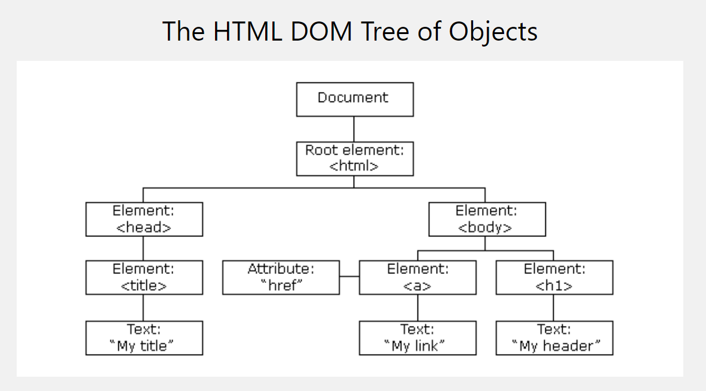
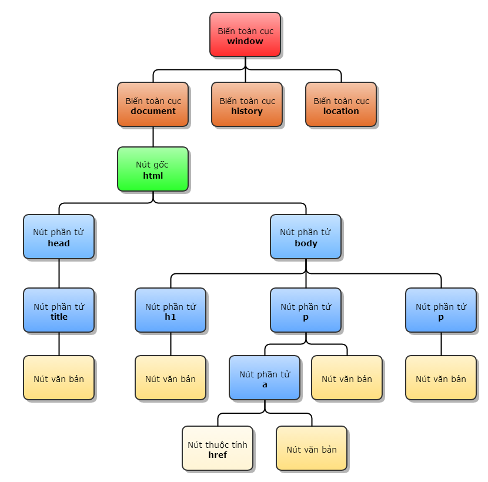

# BUỔI 4: JAVASCRIPT (PHẦN 1)

# Phần 1: Syntax cơ bản JS

## Khai báo dữ liệu: Biến, Toán tử

### Biến

#### Cách khai báo

#### Khai báo biến trong JavaScript bằng từ khóa var

Từ khóa var trong JavaScript được sử dụng để khai báo các biến có phạm vi hàm (function) hoặc toàn cục (global). Trước ES6, var là từ khóa duy nhất để khai báo mà không có phạm vi khối (block) như let và const.

Hiện nay, các lập trình viên thường khuyên bạn nên sử dụng **let** hoặc const khi làm việc cùng JavaScript thay vì **var**. Bởi vì **let** và **const** cung cấp phạm vi khối (**block scope**) và tránh được một số lỗi phổ biến liên quan đến việc khai báo biến.

Cú pháp cơ bản của var như sau:

```js
var variableName = valueOfVar;
```

Khi bạn khai báo một biến bằng var, biến đó sẽ được **“hoisted”** và khởi tạo trong bộ nhớ là **undefined** trước khi mã được thực thi. Vì vậy, bạn có thể truy cập biến trước khi khai báo, nhưng kết quả trả về sẽ là **undefined**.

Khi quá trình thực thi được bắt đầu và đến dòng nơi biến được khai báo, nó sẽ thay thế giá trị trong bộ nhớ bằng giá trị của biến. Ví dụ như:

```js
var strawberry;
console.log(strawberry); // undefined
strawberry = "🍓";
console.log(strawberry); // 🍓
```

Với ví dụ trên, bạn có thể sử dụng biến strawberry trước khi khai báo, nhưng kết quả sẽ trả về undefined. Điều này sẽ khiến chương trình chạy mà không có lỗi, tuy nhiên trong một số trường hợp có thể dẫn đến kết quả không muốn

#### Khai báo biến trong JavaScript bằng từ khóa let

Từ khóa **let** trong JavaScript được sử dụng để tạo các biến có phạm vi khối (**block scope**) mà chúng được khai báo. Sau khi đã sử dụng let để định nghĩa một biến, bạn không thể khai báo lại biến đó trong cùng một khối. Điều quan trọng là phải khai báo các biến let trước khi sử dụng chúng.

```js
let variable_name = value;
```

Ví dụ như:

```js
let x = 5;
let y = 6;
let z = x + y;
document.getElementById("demo").innerHTML = "The value of z is: " + z;
```

Kết quả hiển thị:


Ví dụ khác về phạm vi khối của let, biến num có phạm vi khối và không thể truy cập bên ngoài khối. Nếu bạn cố gắng truy cập biến bên ngoài khối, nó sẽ ném ra kết quả lỗi tham chiếu.

```
{
    let num = 10;
    console.log(num)
}
console.log(num)
```

Kết quả hiển thị:


#### Khai báo biến trong JavaScript bằng từ khóa const

Từ khóa const trong JavaScript được sử dụng để định nghĩa các biến không thể thay đổi sau khi chúng được gán giá trị. Điều này sẽ ngăn chặn sự sửa đổi đối với giá trị của biến. Ngoài ra, const không cho phép khai báo lại cùng một biến trong cùng một khối và nó cung cấp phạm vi khối (block scope), được giới thiệu trong ES2015 để tạo các biến không thể thay đổi.

Cú pháp cơ bản của từ khóa const như sau:

```js
onst const_name;
const x;

const fruit = “apple”;

const flower = “rose”;
```

Ngoài ra, không thể gán lại giá trị cho biến được khai báo bằng const. Nếu bạn cố tình gán lại giá trị, chúng sẽ gây ra lỗi “Assignment to constant variable”

```js
const x = 12;
x = 13;
x += 1;
```

Kết quả hiển thị khi gán lại giá trị const:


Một ví dụ mô tả const chứa trong block scope như sau:

```js
const x = 22;
{
  const x = 90;
  console.log(x);
  {
    const x = 77;
    console.log(x);
  }
  {
    const x = 45;
    console.log(x);
  }
}
console.log(x);
```

Kết quả hiển thị:


### Toán tử

#### 1. Arithmetic operators

Các phép toán số học trong JS tương tự các ngôn ngữ khác, gồm:

Toán tử một ngôi: +x, lấy số đối -x, tăng ++x, x++, giảm --x, x--.
Toán tử hai ngôi: cộng a + b, trừ a - b, nhân a \* b, chia nguyên a / b, chia dư a & b.
Ngoài ra từ phiên bản ES6 trở đi có phép lũy thừa a \*\* b để tính số mũ.

```js
var number = 6;
console.log(++number); //=> 7
console.log(number++); //=> 7
var output = a++ + --a; //=> 3+3= 6
console.log(output); //=>6
```

#### 2. Assignment operators

Toán tử gán x = 5 tương tự các ngôn ngữ khác. Ngoài ra JS cũng hỗ trợ các phép gán rút gọn như x += 5, x /= 5,...

Đặc biệt, JS cho phép gán nhiều giá trị cùng lúc, ví dụ như a = b = c = 5 thì cả 3 biến a, b, c đều mang giá trị 5.

```js
var a = 1;
b = 1;
if (a == b) {
  console.log("Dung");
} else {
  console.log("Sai");
} //=Dung
// != => ko bằng
```

#### 3. Comparison operators

Gồm các phép so sánh bằng x == 5, khác x != 10 lớn bé, lớn hơn hoặc bằng, bé hơn hoặc bằng như trong các ngôn ngữ khác.

Các toán tử comparison luôn trả về kết quả boolean.

Ngoài ra JS còn có hai phép so sánh mới là strict comparison x === 10 và x !== 10. Điểm khác biệt ở chỗ strict comparison yêu cầu hai vế phải cùng kiểu dữ liệu thì mới so sánh, nếu khác kiểu thì kết quả là false. Trong khi đó loose comparison x == 10 sẽ tự động convert kiểu phù hợp rồi mới so sánh.

```js
var a = 1;
b = 1;
if (a == b) {
  console.log("Dung");
} else {
  console.log("Sai");
} //=Dung
// != => ko bằng
```

#### 4. Logical operators

Dùng cho các toán hạng boolean. Gồm and a && b, or a || b và not !a.

```js
*1. &&-And
*2.|| - or
*3 ! - Not */
```

#### 5. Bitwise operators

Dùng cho các phép thao tác bit, gồm hai dạng.

Dạng 1 dùng biến đổi bit, gồm 3 toán tử hai ngôi (and x & y, or x | y, xor x ^ y) và một toán tử một ngôi (not !x).

Chú ý các phép trên chỉ sử dụng một dấu, thay vì hai dấu như comparison.

Loại thứ 2 dùng dịch chuyển bit (bit shifting), gồm left shift (zero fill) x << n, signed right shift x >> n và zero fill right shift x >>> n.

Trong JS thì thao tác bit ít dùng.

#### 6. Type operators

Gồm hai toán tử là typeof (lấy kiểu của dữ liệu) và instanceof (kiểm tra instance).

```js
typeof 5; // return string
typeof 5;
a instanceof Array; // return boolean
```

#### 7. Special operators

JS có một toán tử khá lạ, gọi là comma operator (toán tử dấu phẩy). Cú pháp của nó như sau.

```js
let x = (10, 20, 30, 15); // x = 15
```

## Array, Object, String

### Number

JavaScript không giống như nhiều ngôn ngữ lập trình khác, nó không có kiểu dữ liệu dành cho số như: `integer`, `short`, `long`, `float`, `double`, ... mà nó chỉ có mỗi kiểu `number`.

Đối với số nguyên trong JavaScript nó có độ chính xác đến 15 con số, cụ thể như sau:

```js
let a = 999999999999999; // Giá trị của a lúc này là à 999999999999999
let b = 9999999999999999;
// Đối với giá trị vượt quá 15 số thì b lúc này là 10000000000000000
```

Ngoài ra, số thập phân cũng có giới hạn của nó là 17 số. Tuy nhiên việc tính toán với số thập phân trong JavaScript không phải lúc nào cũng chính xác, cụ thể như sau:

```js
let a = 0.1 + 0.2;
//--> Bạn nghĩ rằng a = 0.3
//--> Output: a = 0.30000000000000004
```

Để khắc phục vấn đề này ta có thể nhân số thập phân với số nguyên rồi mới thực hiện phép tính, cụ thể như sau:

```js
let total = (0.1 * 10 + 0.2 * 10) / 10;
//-->Output: total = 0.3
```

**Lưu ý**: Trong JavaScript, việc cộng 2 số với nhau tất nhiên sẽ cho kết quả là số, tuy nhiên cộng số với chuỗi thì JavaScript sẽ tự động convert số thành chuỗi và cộng 2 chuỗi với nhau, kết quả cuối cùng sẽ là một chuỗi đó nhé 🤭. Do đó trước khi tính toán, chúng ta cần convert hết qua thành số rồi làm gì thì làm nhé 😁.

#### 1. Convert number to string.

Nếu muốn chuyển đổi từ kiểu `number` sang `string`, ta có thể sử dụng phương thức `toString()`, cụ thể như sau:

```js
let num = 2021;
num.toString();
//-->Output: "2021"
```

Ngoài ra ta còn có thể convert từ `number` sang `string` ở dạng _nhị phân, bát phân, thập phân và thập lục phân_ đó 😉

```js
let num = 240;

//Nhị phân
num.toString(2); //-->Output: "11110000"

//Bát phân
num.toString(8); //-->Output: "360"

//Thập phân
num.toString(10); //-->Output: "240"

//Thập lục phân
num.toString(16); //-->Output: "f0"
```

#### 2. Infinity - Dương vô cực.

`Infinity` hay dương vô cực cũng thuộc kiểu dữ liệu `number`. Khi một biến chứa giá trị mà vượt mức lưu trữ cho phép thì biến đó có giá trị là `Infinity`. Nó cũng là một giá trị nên ta có đem đi so sánh được.

```js
typeof Infinity; //--> Output: "number"

let a = 5 / 0;
//--> Output a = Infinity

let num = 5;
while (num != Infinity) {
  num = num * num;
  console.log(num);
}
//--> Output:
/*
25
625
390625
152587890625
2.3283064365386964e+22
5.421010862427523e+44
2.9387358770557196e+89
8.636168555094449e+178
Infinity
*/
```

Vậy âm vô cực thì sao??? Thì là `-Infinity` đó 😁

```js
let num = 4 / 0;
//--> Output: -Infinity
```

#### 3. NaN - Not a Number.

`NaN` là một giá trị có trong JavaScript, nó dùng để xác định một số không phải là số hợp lệ. Nếu bạn thực hiện các phép tính với `number` mà bằng cách nào đó nó vi phạm quy tắc tính toán của JavaScript thì nó sẽ trả về kết quả là `NaN`.

```js
let total = 200 / "Hai trăm";
//-->Output: NaN

typeof NaN; //--> Output: "number"
```

Để kiểm tra một biến có phải là `NaN` hay không ta sử dụng phương thức `isNaN()`, nếu đúng thì return `true` ngược lại return `false`.

```js
let x = 199 / "Not a number";

isNaN(x); //--> Output: true
```

#### 4. Ép kiểu sang number.

Khi làm việc với JavaScript chắc chắn sẽ có lúc có data bạn cần phải convert từ kiểu `string` sang kiểu `number`, lúc này ta có 3 cách để ép kiểu:

- `Number()`: Chuyển đổi giá trị về kiểu number.
- `parseInt()`: Chuyển đổi giá trị sang số nguyên.
- `parseFloat()`: Chuyển đổi giá trị sang số thập phân.

```js
Number("200"); //--> 200
Number(2.2);   //--> 2.2
Number(2,2);   //--> NaN
Number(2 2);   //--> NaN
Number("Alice"); //--> NaN
Number(true);  //--> 1
Number(false); //--> 0
```

```js
parseInt("123"); //--> 123
parseInt("9.33"); //--> 9
parseInt("10 20 30"); //--> 10
parseInt("100 years"); //--> 100
parseInt("years 10"); //--> NaN
```

```js
parseFloat("10"); //--> 10
parseFloat("10.33"); //--> 10.33
parseFloat("10 20 30"); //--> 10
parseFloat("10 years"); //--> 10
parseFloat("years 10"); //--> NaN
```

#### 5. Làm tròn số.

Đôi khi những tính toán cho kết quả không mong muốn như cho ra kết quả dạng tập phân và bạn muốn làm tròn con số đó lên, trong JavaScript bạn có thể sử dụng phương thức `toFixed()` để làm tròn các con số đó.

```js
let x = 9.6;
x.toFixed(0); //--> 10
x.toFixed(2); //--> 9.60
x.toFixed(4); //--> 9.6000
x.toFixed(6); //--> 9.600000
```

### II. String.

`String `là một loại dữ liệu khá phổ biến trong JavaScript, một biến chứa các giá trị là các ký tự và được đặt trong dấu nhấy đơn `''` hay dấu nháy kép `""`.

```js
let mess = "Welcome to 200Lab";
let say = "Hello!";
```

Một lưu ý cho các bạn, khi trong chuỗi bắt buộc có dấu nhấy đơn hoặc nhấy kép thì bạn phải thêm ký tự \ ở trước dấu nhấy đó, như ví dụ bên dưới.

```js
let txt =
  '"200Lab Education" Học viện đào tạo kỹ sư phần mềm chuyên sâu qua dự án thực tế';
```

Ngoài ra trong chuỗi còn có các dấu, support cho các vấn đề khác mà bạn có thể quan tâm như:
| **Code** | **Kết quả** |
|------|---------|
| \' | single quote - Dấu nháy đơn |
| \" | double quote - Dấu nháy kép |
| \\\ | backslash - Dấu chéo ngược |
| \n | new line - Xuống dòng mới |
| \r | carriage return |
| \t | tab |
| \b | backspace - Tạo khoảng trống |
| \f | form feed |

#### 1. Lấy độ dài của chuỗi.

Ta có thể lấy độ dài của một chuỗi bằng phương thức `length.

```js
let text = "200Lab";
console.log(text.length); //--> 6
```

#### 2. Tìm kiếm chuỗi con trong một chuỗi.

Ta có thể sử dụng hàm `indexOf()` để tìm một chuỗi con trong một chuỗi lớn.

- Nếu tìm thấy, nó sẽ trả về vị trí đầu tiên của ký tự có trong chuỗi con.
- Nếu không tìm thấy, nó sẽ trả về `-1`

```js
let mess = "JS is a programming language";

console.log(mess.indexOf("pro")); //--> 8
console.log(mess.indexOf("200")); //--> -1
```

Ngoài ra, nếu bạn muốn tìm vị trí cuối cùng của chuỗi con thì bạn có thể sử dụng `lastIndexOf()`

```js
let mess = "JS is a programming language pro";

console.log(mess.lastIndexOf("pro")); //--> 29
```

#### 3. Tách chuỗi.

Làm việc với chuỗi thì chắc chắn bạn sẽ phải không ít thì nhiều lần phải tách một chuỗi thành nhiều chuỗi theo mục đích của mình. Trong JavaScript, nó có 3 cách để tách chuỗi.

- Sử dụng hàm `slice(start, end)`, nó sẽ tách chuỗi từ vị trí `start` đến `end-1`

```js
let mess = "JS is a programming language pro";

console.log(mess.slice(8, 19)); //--> "programming"

// Nếu tham số là số âm thì nó sẽ đếm từ phía cuối chuỗi đến đầu chuỗi
console.log(mess.slice(-25, -13)); //--> "programming"

// Nếu không có tham số end thì nó sẽ tính từ start đến hết chuỗi
console.log(mess.slice(8)); //--> "programming language pro"
console.log(mess.slice(-25)); //--> "programming language pro"
```

- Sử dụng `subString()`, nó giống với `slice()`, tuy nhiên lại không chơi với giá trị âm.

```js
let mess = "JS is a programming language pro";

console.log(mess.substring(8, 19)); //--> "programming"
```

- `substr()` cũng tương tự như `slice()` nhưng không có tham số `end`, tham số thứ hai là độ dài của chuỗi bạn muốn cắt. Nó cũng nhận tham số bắt đầu là số âm, nếu không xác định độ dài chuỗi muốn cắt thì nó sẽ tính từ vị trí bắt đầu ta truyền vào cho đến hết chuỗi.

```js
let mess = "JS is a programming language pro";

console.log(mess.substr(8, 11)); //--> "programming"
console.log(mess.substr(8)); //--> "programming language pro"
console.log(mess.substr(-3)); //--> "pro"
```

#### 4. Thay thế chuỗi.

Trong quá trình taho tác với chuỗi, nếu muốn thay thế một đoạn chuỗi nhỏ nào đó trong một chuỗi lớn thì ta có thể dùng hàm `replace()`.

```js
var str = "Please visit Microsoft and Microsoft!";

var n1 = str.replace("Microsoft", "W3Schools");
var n2 = str.replace(/Microsoft/g, "W3Schools");

console.log(n1); //--> "Please visit W3Schools and Microsoft!"
console.log(n2); //--> "Please visit W3Schools and W3Schools!"
```

#### 5. Chuyển sang chuỗi hoa hoặc chuỗi thường.

Để chuyển đoạn chuỗi sang chuỗi in hoa ta sử dụng phương thức `toUpperCase()`, in thường dùng `toLowerCase()`.

```js
var text = "Hello World!";

var textUp = text1.toUpperCase(); //--> "HELLO WORLD!"
var textLow = text1.toLowerCase(); //--> "hello world!"
```

#### 6. Nối chuỗi.

Để nối chuỗi ta sử dụng hàm `concat()`:

```js
let text1 = "Hello";
let text2 = "World";

let merText = text1.concat(" ", text2); //--> "Hello World"
```

Ngoài ra còn một cách đơn giản là ta sử dụng dấu `+`.

```js
let text1 = "Hello";
let text2 = "World";

let merText = text1 + " " + text2; //--> "Hello World"
```

#### 7. Xóa khoảng trắng hai bên chuỗi.

Để xóa khoảng trắng hai bên chuỗi ta dùng hàm `trim()`. Thường ta có thể dùng phương thức để xóa các khoảng trống mà người dùng nhập thừa đấy

```js
let str = "         200Lab       ";

let newStr = str.trim(); //--> "200Lab"
```

#### 8. Cách lấy từng giá trị trong chuỗi.

Một chuỗi thì chung quy lại nó cũng chỉ là một mảng chứa các ký tự, do đó để lấy các giá trị trong chuỗi ta dùng `[]` hoặc hàm `charAt()`.

```js
let str = "200Lab";

str.charAt(0); //--> "2"
str[3]; //--> "L"
```

#### 9. Lấy UTF-16 code tại vị trí bất kì trong chuỗi.

Để lấy bất kỳ các code UTF-16 tại các vị trí bất kỳ trong chuỗi ta dùng hàm `charCodeAt()`.

```js
let str = "JS basic!";

str.charCodeAt(0); //--> 74
```

#### 10. Chuyển chuỗi sang mảng.

Để chuyển một chuỗi sang dạng mảng ta sử dụng hàm `split()`, tham số đầu vào của hàm là một chuỗi để ngăn cách.

```js
let str = "200lab Education",
  str1 = "a,b,c,d,e,f,g,h";

let arrStr1 = str1.split(",");
//--> ["a", "b", "c", "d", "e", "f", "g", "h"]

// Nếu tham số là rỗng thì sẽ return về mảng từng ký tự
let arrStr = str.split("");
//--> ["2", "0", "0", "l", "a", "b", " ", "E", "d", "u", "c", "a", "t", "i", "o", "n"]
```

### III. Array.

Array hay mảng là một tập hợp các phần tử, mỗi phần tử sẽ được đánh dấu thứ tự bằng chỉ mục hay index và index bắt đầu từ `0`.

#### 1. Lấy độ dài của mảng

Tương tự chuỗi, để lấy độ dài của mảng ta dùng phương thức `length`.

```js
let arr = [1, 2, 3, 4, 5];

arr.length; //--> 5
```

#### 2. Kiểm tra biến có chứa dữ liệu dạng mảng hay không.

Để check xem một biến có chứa data dạng mảng hay không, ta dùng hàm `isArray()` hoặc `instanceof`.

```js
const fruits = ["Banana", "Orange", "Apple", "Mango"];

Array.isArray(fruits); //--> true
fruits instanceof Array; //--> true
```

#### 3. Chuyển mảng sang chuỗi.

Để chuyển một mảng sang một chuỗi ta dùng hàm `toString()` hoặc `join()`

```js
const cars = ["Honda", "Hyundai", "Ford", "Toyota"];

const str1 = cars.toString(); //--> "Honda,Hyundai,Ford,Toyota"
const str2 = cars.join("-"); //--> "Honda-Hyundai-Ford-Toyota"
```

#### 4. Thêm phần tử vào cuối mảng.

Add một phần tử mới vào mảng ta sử dụng hàm `push()`, ngoài add thêm phần tử vào mảng nó còn `return` lại độ dài của mảng mới.

```js
const cars = ["Honda", "Hyundai", "Ford", "Toyota"];

const x = cars.push("Suzuki"); //--> 5
console.log(cars); //--> ["Honda", "Hyundai", "Ford", "Toyota", "Suzuki"]
```

#### 5. Xóa phần tử ở cuối mảng.

Để xóa một phần tử ở cuối mảng, ta dùng hàm `pop()` và nó return lại giá trị mà nó vừa xóa.

```js
const cars = ["Honda", "Hyundai", "Ford", "Toyota"];

const x = cars.pop(); //--> "Toyota"
console.log(cars); //--> ["Honda", "Hyundai", "Ford"]
```

#### 6. Thêm phần tử vào đầu mảng.

`unshift()` cho phép ta thêm 1 phần tử mới vào đầu mảng và `return` lại chiều dài mảng mới.

```js
const cars = ["Honda", "Hyundai", "Ford", "Toyota"];

const x = cars.unshift("Suzuki"); //--> 5
console.log(cars); //--> ["Suzuki", "Honda", "Hyundai", "Ford", "Toyota"]
```

#### 7. Xóa phần tử ở đầu mảng.

Với hàm `shift()` ta có thể xóa phần tử đầu tiên của mảng và đồng thời `return` lại phần tử vừa xóa.

```js
const cars = ["Honda", "Hyundai", "Ford", "Toyota"];

const x = cars.shift(); //--> "Honda"
console.log(cars); //--> ["Hyundai", "Ford", "Toyota"]
```

**Lưu ý**: ta cũng có thể dùng `delete` operator để xóa bất kỳ phần tử nào có trong mảng. Tuy nhiên chỉ giá trị của phần tử được xóa nên lại để lại một khoảng trống trong mảng. Khi ta truy xuất đến khoảng trống này, ta nhận được giá trị của nó là `undefined`.

```js
const cars = ["Honda", "Hyundai", "Ford", "Toyota"];

delete cars[0];
console.log(cars); //--> [empty, "Hyundai", "Ford", "Toyota"]
console.log(cars[0]); //--> undefined
```

#### 8. Thêm hoặc xóa nhiều phần tử trong 1 mảng.

Với hàm `splice()`, ta có thể thêm hoặc xóa nhiều phần tử trong mảng và return lại mảng với các phần tử mà ta đã xóa.

cú pháp của nó như sau: `splice(vị trí thêm, số lượng cần xóa, … phần tử thêm)`

```js
const cars = ["Honda", "Hyundai", "Ford", "Toyota"];

//Thêm vào vị trí thứ 2
const x = cars.splice(2, 0, "Suzuki", "Isuzu");
console.log(x); //--> []: Vì ta không xóa nên mảng sẽ là rỗng
console.log(cars);
//--> ["Honda", "Hyundai", "Suzuki", "Isuzu", "Ford", "Toyota"]
```

```js
const cars = ["Honda", "Hyundai", "Ford", "Toyota"];

// Xóa 1 phần tử tại vị trí số 0
const x = cars.splice(0, 1);
console.log(x); //--> [ "Honda" ]
console.log(cars); //--> ["Hyundai", "Ford", "Toyota"]
```

#### 9. Ghép mảng.

Hàm `concat()` cũng có thể ghép 2 mảng lại với nhau.

```js
const myGirls = ["Alice Rondo", "Luminous Valentine"];
const myBoys = ["Diablo", "Guy Crimson", "Leon Cromwell"];
const myChildren = myGirls.concat(myBoys);
//--> ["Alice Rondo", "Luminous Valentine", "Diablo", "Guy Crimson", "Leon Cromwell"]
```

#### 10. Tách mảng

Muốn tách mảng thì ta sử dụng hàm `slice()`, với cú pháp:

`slice(vị trí bắt đầu, vị trí kết thúc)`

```js
const cars = ["Honda", "Hyundai", "Ford", "Toyota"];

//Tách từ vị trí đầu đến hết mảng.
const x = cars.slice(1);
console.log(x); //--> ["Hyundai", "Ford", "Toyota"]

//tách ra 1 mảng mới bắt đầu tại vị trí 1 đến 2 (3-1)
const y = cars.slice(1, 3);
console.log(y); //--> ["Hyundai", "Ford"]
```

#### 11. Spread operator.

Đây là một khái niệm mới đây, được ra mắt từ **ES6 (ES2015)**, nó phân rã mảng (object) thành từng phần tử nhỏ ( ví dụ: [1,2,3] => 1,2,3).

```js
const nums_1 = [1, 2, 3];
const nums_2 = [3, 4, 5];

// Nối mảng
const newNums = [...nums_1, ...nums_2]; //--< [ 1, 2, 3, 3, 4, 5 ]

// Tạo thành 1 mảng mới
const num_3 = [...nums_2]; // [3, 4, 5]
console.log(cars1 !== cars3); //--> true
```

Hiện nay Spread operator được sử dụng thương xuyên trong lập trình và thao tác với mảng

#### 12. Lặp mảng.

Lặp mảng hay duyệt mảng thì đây là cách thức ta thường phải sử dụng để thao tác với mảng, ngoài `for` thông thường, ta còn có `forEach()`, `map()`, `filter()`, `find()`, `findIndex()`, `every()`, `some()`. Cùng nhau tìm hiểu từng loại một nhé 😁.

`forEach()`: Lặp qua từng phần tử có trong mảng. Tham số truyền vào `forEach` là một callback function với 3 đối số gồm:

- Giá trị phần tử.
- Index của phần tử.
- Mảng đang thực hiện.

```js
let numbers = [1, 2, 3, 4, 5];
let newNumbers = [];

numbers.forEach((value, index, array) => {
  newNumbers.push(value);
});
console.log(newNumbers); //--> [1, 2, 3, 4, 5]
```

**map()**: cho phép tạo một mảng mới bằng cách thực hiện tính toán trên mỗi phần tử, `map()` không làm thay đổi mảng cũ.

```js
let numbers = [1, 2, 3, 4, 5];

let newNumbers = numbers.map((value, index, array) => {
  return value * 2;
});
console.log(newNumbers); //--> [2, 4, 6, 8, 10]
```

**filter()**: cho phép tạo một mảng mới với những phần tử nào thỏa điều kiện ta đặt ra. Hàm này thường được dùng để tìm kiếm phần tử trong mảng.

```js
let numbers = [1, 2, 3, 4, 5];

let newNumbers = numbers.filter((value, index, array) => {
  return value >= 3;
});
console.log(newNumbers); //--> [3, 4, 5]
```

**find()**: Hàm này trả về phần tử thỏa điều kiện đầu tiên, nếu không có sẽ `return undefined`. Thường dùng hàm này để tìm kiếm phần tử trong mảng.

```js
let numbers = [1, 2, 3, 4, 5];

let result = numbers.find((value, index, array) => {
  return value > 1;
});
console.log(result); //--> 2

let resultUn = numbers.find((value, index, array) => {
  return value > 5;
});
console.log(resultUn); //--> undefined
```

**findIndex()**: Hàm này trả về index của phần tử thỏa điều kiện đầu tiên, nếu không có sẽ `return -1`.

```js
const cars = ["Suzuki", "Toyota", "Hyundai"];

const result = cars.findIndex((value, index, array) => {
  return value === "Toyota";
});
console.log(result); //--> 1

const resultUn = cars.findIndex((value, index, array) => {
  return value === "Yamaha";
});
console.log(resultUn); //--> -1
```

`every()`: Nếu mọi phần tử thỏa điều kiện sẽ return true, còn không sẽ return false, đơn giản vậy thôi .

```js
const numbers = [1, 2, 3, 4, 5];

const checkF = numbers.every((value, index, array) => {
  return value > 2;
});
console.log(checkF); //--> false

const checkT = numbers.every((value, index, array) => {
  return value >= 1;
});
console.log(checkT); //--> true
```

`some()`: Nếu có một phần tử bất kỳ nào thỏa điều kiện thì sẽ return true, còn không thì sẽ return false.

```js
const numbers = [1, 2, 3, 4, 5];

const check = numbers.some((value, index, array) => {
  return value > 2;
});
console.log(check); //--> true
```

#### 13. Lấy index của phần tử mảng.

Để lấy giá trị `index` của phần tử có trong mảng ta dùng hàm `indexOf()` và truyền vào giá trị mà bạn muốn lấy index.

```js
const cars = ["Honda", "Hyundai", "Ford", "Toyota"];

let index = cars.indexOf("Ford");
console.log(index); //--> 2
```

#### 14. Kiểm tra phần tử có trong mảng hay không.

Để check xem phần tử nào đó có trong mảng hay không ta dùng hàm `includes()` và truyền vào giá trị bạn muốn tìm. Nếu có nó sẽ `return true` không thì `return false`

```js
const numbers = [1, 2, 3, 4, 5];
const check = numbers.includes(5); //--> true
```

### IV. Object.

**Entry** của object là cặp `key`, `value` tương ứng, entry còn được coi như là property (thuộc tính) của object.

**Key** của object luôn là `string` hoặc `number`.

**Value** của object thì có thể thuộc bất cứ kiểu dữ liệu nào kể cả là function.

**Method** hay phương thức là những thuộc tính mà value của nó là function

#### 1. prototype object

Prototype là một cơ chế của JavaScript, giúp object thừa kế các tính năng của object khác.

Ngoài các kiểu dữ liệu trong JavaScript mà ta đã biết thì nó cũng như bao ngôn ngữ lập trình khá còn có các object kiểu dữ liệu như `Number`, `String`, `Boolean`. Mảng là một object dạng `Array` còn function là một object `Function`.

```js
let str = "String"; // str là string, cha nó là String.prototype

// nhân đôi chuỗi đưa vào
String.prototype.duplicate = function () {
  return this + this;
};

console.log(str.duplicate()); // Tìm thấy hàm duplicate trong prototype
```

```js
// object thông thường
const person = {
  firstName: "Alice",
  lastName: "Rondo",
  showName: function () {
    console.log(this.firstName + " " + this.lastName);
  },
};
//--> object person có prototype là Object.prototype
```

```js
// Constructor Function
function Person(firstName, lastName) {
  this.firstName = firstName;
  this.lastName = lastName;
  this.showName = function () {
    console.log(this.firstName + " " + this.lastName);
  };
}

let Person_1 = new Person("Alice", "Rondo");
/* 
	- object này có prototype là Person.prototype
	- Prototype mới: Person.prototype được tạo ra
	- Person.prototype kế thừa Object.prototype
*/
```

Thử thêm một phương thức vào object được tạo từ một **constructor function**

```js
// STEP 0: tạo ra 1 hàm và khởi tạo một object s1 bằng toán tử new
function Student(name, age) {
  this.name = name;
  this.age = age;
}

const s1 = new Student("Alice Rondo", 9);

// STEP 1: thêm một hàm saySomeThing() cho Student như sau:
Student.saySomeThing = function () {
  console.log("Hello");
};

// STEP 2: thêm 1 hàm showName() cho prototype của Student như sau:
Student.prototype.showName = function () {
  console.log("My name is: ", this.name);
};

// STEP 3: Gọi lần lượt hai hàm trên từ object s1:
s1.sayHello(); //--> Lỗi, vì s1 không có hàm saySomeThing, hàm này chỉ thuộc Student thôi.

s1.showName(); //--> 'My name is: Alice Rondo'

Student.sayHello(); //-->'Hello'
```

Ta có thể edit prototype của một function thông qua object được tạo từ function đó bằng `__proto__` như sau:

```js
s1.__proto__.study = function () {
  console.log(`Tôi là ${this.name}, tôi đang học.`);
};

const s2 = new Student("Milim Nava", 20);
s2.study(); //--> "Tôi là Milim Nava, tôi đang học."
```

#### 2. Truy xuất, thêm, xóa, sửa thuộc tính của object.

```js
const person = {
  name: "Alice Rondo",
};

// Lấy giá trị của thuộc tính name
person.name;

// Thêm thuộc tính vào person
person.age = 12;

// Sửa thuộc tính name
person.name = "Rimuru Tempest";

// Xóa thuộc tính name
delete person.name;
```

#### 3. Merge object.

Để merge 2 object lại với nhau ta dùng phương thức `Object.assign()`.

```js
const person = {
  name: "Rimuru Tempest",
  position: ["King of Jura Tempest Federation"],
};
const person2 = Object.assign(person, { position: ["King of Monsters"] });
console.log(person2);
/*
    {
        name: 'Rimuru Tempest',
        positon: ['King of Monsters']
    }
*/
```

**Spread operator** cũng có thể dùng để shallow copy hoặc merge object lại

```js
const person = {
  name: "Rimuru Tempest",
  position: ["King of Jura Tempest Federation"],
};
const person2 = { ...person, position: ["King of Monsters"] };
console.log(person2);
/*
    {
        name: 'Rimuru Tempest',
        positon: ['King of Monsters']
    }
*/
```

#### 4. Lấy các key của object.

Để lấy tất cả các **key** của một object ta dùng phương thức `Object.keys()`, nó sẽ return một mảng chứa tất cả các **key** của object đó.

```js
const person = {
  name: "Remuru Tempest",
  age: 24,
};
console.log(Object.keys(person));
//--> [ "name", 'age" ]
```

#### 5. Lấy các value của object.

Để lấy tất cả các **value** của một object ta dùng phương thức `Object.values()`, nó sẽ return một mảng chứa tất cả các **value** của object đó.

```js
const person = {
  name: "Remuru Tempest",
  age: 24,
};
console.log(Object.values(person));
//--> ["Remuru Tempest", 24]
```

## Vòng lặp

### For loop

Đầu tiên hẳn sẽ là loop phổ biến nhất và có phần lớn trong các ngôn ngữ lập trình : **for**

Với vòng lặp **for** ta sẽ khởi tạo biến đếm, kiểm tra điều kiện và tăng hoặc giảm biến được thực hiện trên cùng một dòng, do đó khá dễ dàng cho những người mới tiếp cận để debug và cũng giảm khả năng sinh ra lỗi

**Cú pháp**:

```js
for ([initialization];[condition];[final-expression]){
   Block of code
}
```

```js
for (var i = 0; i < 10; i++) {
  console.log(i);
}
```

### While loop

Bên cạnh **for** thì **while** cũng là một trong những vòng lặp tương đối basic. Câu lệnh while tạo ra một vòng lặp thực thi một khối lệnh (block of code) cho đến khi điều kiện vẫn đúng.

**Cú pháp**

```js
while (condition) {
  Block of code
}
```

```js
var i = 0;
while (i < 10) {
  console.log(i);
  i++;
}
```

### Do ... While

**do-while** về cơ bản khá giống với **while**, chúng chỉ khác nhau duy nhất. Đối với **Do While** dù điều kiện lặp như thế nào thì đoạn code vẫn được chạy ít nhất 1 lần còn nếu điều kiện thỏa mãn thì sẽ tương tự như **While** : tạo ra thêm vòng lặp

**Cú pháp**

```js
do {
    Block of code
 }
while (condition);
```

```js
var i = 10;
do {
  console.log(i);
  i++;
} while (i > 10 && i < 12);
```

#### forEach()

Hàm này thì có vẻ đã không quá còn basic như những hàm phía trên nữa. **forEach** sẽ lặp lại từng phần tử trong mảng theo thứ tự index và thực thi **function** được truyền vào. Lưu ý rằng **forEach** sẽ không thực thi **function** đầu vào cho các phần tử không có giá trị

**Cú pháp**

```js
arrayName.forEach(function(currentValue, index, array){
    function body
})
```

Hàm được truyền vào **forEach** sẽ nhận tối đa 3 đối số đầu vào:

- currentValue: Giá trị đang được vòng lặp xử lý
- index: Chí số của giá trị (**currentValue**) trong mảng
- array: toàn bộ array đang gọi đến **forEach**

```js
var arr = [10, 20, "hi", , {}];

arr.forEach(function (item, index) {
  console.log(" arr[" + index + "] is " + item);
});
```

**Lưu ý** rằng bạn không nhất thiết phải truyền toàn bộ 3 đối số vào, chỉ truyền vào những đối số cần thiết.

Nhìn qua thì thấy **forEach** khá là đem lại nhiều điều đơn giản cho lập trình viên, không cần quan tâm đến khởi tạo biến đếm, điều kiện dừng .... Tuy nhiên trong đó cũng tiềm tàng khá nhiều điều hay ho mà mình sẽ trình bày trong phần tiếp theo của series

#### Map

Tiếp tục là một hàm sẽ giúp bạn loop các phần tử của một Array. Tuy nhiên **map** sẽ tạo ra một mảng mới chứ không phải thực thi với mảng gọi đến nó như **forEach**.

**Cú pháp**

```js
var newArray = oldArray.map(function (currentValue, index, array) {
  //Return element for the newArray
});
```

Tương tự như **forEach, map** cũng lấy 3 tham số đầu vào

- currentValue: Giá trị đang được vòng lặp xử lý
- index: Chí số của giá trị (**currentValue**) trong mảng
- array: toàn bộ array đang gọi đến **forEach**

```js
var num = [1, 5, 10, 15];
var doubles = num.map(function (x) {
  return x * 2;
});
```

### For...in

Vòng lặp này có đôi chút khác biệt với các hàm phía trên, **For ... in** mục đích chủ yếu được dùng để loop trong một **object** chứ không phải **array** . Số lượng vòng lặp sẽ tương ứng với số lượng thuộc tính của **object**

Mỗi **array** cũng là một object đặc biệt, do đó ta vẫn có thể sử đụng **for...in** cho **array**, tuy nhiên key sẽ tương ứng với giá trị **index** của từng phần tử

<h3>Cú pháp</h3>

```js
for (variableName in object) {
    Block of code
}
```

<h3>Ví dụ</h3>

```js
var obj = { a: 1, b: 2, c: 3 };
for (var prop in obj) {
  console.log("obj." + prop + "=" + obj[prop]);
}
```

<h3>Kết quả</h3>

```js
obj.a = 1;
obj.b = 2;
obj.c = 3;
```

**for...in** không được khuyến khích sử dụng với những mảng mà thứ tự index của nó quan trọng.

```js
var arr = [];
arr[2] = 2;
arr[3] = 3;
arr[0] = 0;
arr[1] = 1;
```

Với ví dụ trên được loop bởi **forEach** thì kết quả sẽ theo thứ tự là 0, 1, 2, 3 còn với **for...in** thì sẽ không đảm bảo như vậy.

Thêm một điều nữa, với **for...in**, nó sẽ duyệt qua cả những thuộc tính kế thừa của object . Do đó nếu muốn chỉ duyệt qua thuộc tính riêng của object thì cú pháp cần thay đổi một chút

```js
for(var prop in obj){
   if(obj.hasOwnProperty(prop)){
       Code block here
   }
}
```

### for...of

Vòng lắp được ra mắt trong phiên bản ES6. Hàm này có thể sử dụng để duyệt phần lớn các đối tượng từ Array, String, Map, WeakMap, Set ,...

<h3>Cú pháp</h3>

```js
for (variable of iterable) {
  Block of code
}

```

<h3>Ví dụ</h3>

```js
var str = "paul";
for (var value of str) {
  console.log(value);
}
```

<h3>Kết quả</h3>

```js
"p";
"a";
"u";
"l";
```

## Function: Các loại Funtion, Sự khác biệt.

### 1. Function là gì?

- Function (hàm, chức năng), gọi chung là subprogram (chương trình con) có thể được gọi ở bên ngoài hoặc bên trong chính nó.
- Nó bao gồm tập hợp các câu lệnh gọi là function body. Các giá trị có thể truyền đến một hàm, và một hàm có thể trả về giá trị. Bây giờ, với các ứng dụng hiện đại, các function có thể là một chương trình hoàn chỉnh, chứ không phải là k

### 2. Function không có tham số và không trả về bất cứ giá trị gì.

```js
function sayHello() {
  console.log("Hello !");
}
sayHello();
```

- Function ở trên không có một tham số nào, và không trả về một giá tri.

### 3. Arrow function

```js
const sayHello = () => {
  console.log("Hello !");
};
sayHello();
```

- Một arrow function có cú pháp ngắn hơn cú pháp function bình thường, nó có thể không có đối số, super hoặc new.target của nó. Những function này phù hợp nhất cho các non-method function và chúng không thể sử dụng như các constructor. Có điều gì khi tôi nói, function ở trên không trả về giá trị gì?
- Nếu tôi cố gắng để lưu trữ kết quả của function được gọi ở trên vào một biến nó sẽ nhận giá trị "undefined".

### 4. Anonymous functions

```js
var showDomain = function () {
  alert("Học Javascript tại Freetuts.net");
};
showDomain();
```

- Anonymous functions hay còn gọi là hàm ẩn danh, là một hàm được sinh ra đúng vào thời điểm chạy của chương trình. Thông thường khi bạn khai báo một hàm thì trình biên dịch sẽ lưu lại trong bộ nhớ nên bạn có thể gọi ở trên hay dưới vị trí khai báo hàm đều được, nhưng với anonymous functions thì nó sẽ được sinh ra khi trình biên dịch xử lý tới vị trí của nó.
- Anonymous functions được khai báo bằng cách sử dụng toán tử thay vì sử dụng cú pháp định nghĩa hàm thông thường.

### 5. Function có một tham số và trả về một giá trị cụ thể

```js
function square(number) {
 return number * number;
}
console.log(square(2));
# 4
```

### 6. Function có thể có nhiều đối số (thực tế có thể có 'n' đối số)

- Làm thế nào để viết một function có thể truyền vào 'n' đối số?
- Viết một function có tên là sum() có thể truyền 'n' đối số và trả về tổng của các đối đã truyền đó

```js
####### Cách 1

const sum = function () {
  let result = 0;
  for(let i = 0; i < arguments.length; i++) {
    result += arguments[i];
  }
  return result;
}

console.log(sum(1,2));
console.log(sum(1,2,3,4));
console.log(sum(1,3,5,7,9));
```

- Nó hoạt động như thế nào?
- Nếu bạn nhìn vào function sum, nó không cần một tham số rõ ràng nào. Bây giờ, hãy tưởng tượng bạn đang thực hiện function sum() này một cách rõ ràng, điều gì là khó khăn để xác định các tham số trước đó. Nếu bạn không biết hãy nhìn các kết quả khi gọi function sum().
  Nếu truyền vào 1 tham số tương ứng như sum(1) nó sẽ trả về 1.
- Nếu truyền vào 2 tham số tương ứng như sum(1,2) nó sẽ trả về 3.
- Nếu truyền vào 100 tham số tương ứng như sum(1,2,3,4..,99,100) nó sẽ trả về 5050.
- Vì vậy, JavaScript đã cung cấp một object bí mật là "arguments", nó chứa toàn bộ tham số và có thể sử dụng trong bất kỳ function nào.
- Lưu ý, object "arguments" không phải là một Array mà là một Array like object(kay: "value"). Có nghĩa là bạn không thể gọi bất kỳ phương thức áp dụng cho mảng trên đối tượng arguments (Nếu bạn tò mò, hãy nghiên cứu thêm về vấn đề này).

```js
########### Cách 2

const sum = function (...args) {
  let result = 0;
  for(let i = 0; i < args.length; i++) {
    result += args[i];
  }
  return result;
}
```

- ...args là 1 "REST parameters"
- ...args lấy mọi tham số truyền vào cho function và làm cho nó tồn tại dưới một mảng. Hãy nhớ rằng arguments là một đối tượng (array like object) còn ...args là một mảng.

### 7. Function lấy function như một tham số(callback funtion)

```js
function dispatch(fn) {
  fn();
}

//Cách 1: khai báo một function để làm tham số.
var fn = () => {
  console.log("Hello !");
};
// gọi function dispatch()
dispatch(fn); // Outputs "Hello !"

//Cách 2:  Khai báo một anonymous function bên trong
dispatch(function () {
  console.log("Hello !");
});

//METHOD 3:  Định nghĩa một arrow function bên trong
dispatch(() => {
  console.log("Hello !");
});
```

- Callback phải là một function Callback là một function nên bạn nhất định phải truyền vào là một function, nếu bạn truyền một type khác thì bạn sẽ nhận được error notice: "Callback is function" trong console.
- Từ khóa this trong callback Như đã nói ở trên thì callback là một hàm bình thường nên khi sử dụng từ khóa this trong hàm thì nó sẽ hiểu this lúc này chính là đối tượng Window, nếu bạn dùng debuger trong hàm callback rồi vào console gõ this, thì sẽ được Window {external: Object, chrome: Object, result: undefined,...... Vì vậy cho dù bạn định nghĩa hàm callback nằm trong một object thì không thể truy cập đến dữ liệu của object thông qua từ khóa this.

## Array Method: Map, Reduce, Filter, Includes, Group, Some, Every

Ở phần array trên

## Callback và HighOrder Function

- **Higher-order** là hàm có hoạt động dựa trên một hàm khác, tức là: nó có thể nhận hàm làm tham số đầu vào, hoặc sẽ trả về một hàm khác. Một trong hai điều kiện đó xảy ra thì được gọi là hàm **Higher-order**.
- **Callback** là hàm được truyền vào một _hàm khác_ như một tham số đầu vào, sau đó sẽ được gọi kích hoạt bên trong _hàm khác_ này.

```js
function mapArrayString2Length(array, countLength) {
  var newArray = [];
  var i;
  var length = array.length;
  for (i = 0; i < length; i++) {
    newArray.push(countLength(array[i]));
  }
  return newArray;
}

function countLength(str) {
  return str.length;
}
```

Như ta thấy được, `hàm mapArrayString2Length()` có nhận một tham số là hàm (`countLength()`), như vậy hàm mapArrayString2Length() được gọi là hàm **Higher-order**. Ngoài ra hàm `countLength()` được truyền và sử dụng trong hàm **mapArrayString2Length()**, nên được gọi là hàm **Callback**.

```js
var arrName = ["Leesin", "Master Yi", "Yasuo"];
var arrLength = mapArrayString2Length(arrName, countLength);

// [6, 9, 5]
```

Ngoài ra, đây là một ví dụ của **Higher-order** có trả về một hàm khác:

```js
function makeMultiplier(multNum) {
  return function (num) {
    return multNum * num;
  };
}

// Truyền "hệ số nhân" tuỳ ý để tạo ra các hàm khác nhau
var doubler = makeMultiplier(2); // Hệ số nhân là 2
var _3x2_ = doubler(3); // 6
var _4x2_ = doubler(4); // 8
```

### Callback hoạt động như thế nào?

Sự khác biệt khi ta gọi đến định nghĩa của một hàm và khi ta gọi để thực thi hàm đó là cặp dấu ngoặc `()`. Giả sử ta có hàm sau

```js
function doSomething() {
  // Do something
}
```

Khi ta gọi `doSomething`, tức là ta đang gọi đến định nghĩa của hàm, còn khi ta gọi `doSomething()` nghĩa là ta đang gọi để thực thi hàm đó. Vì thế, trong **Higher-order**, khi ta truyền vào đối số là một hàm, ta chỉ truyền vào định nghĩa của hàm (không có dấu ngoặc). Khi có định nghĩa của hàm rồi, thì **Higher-order** muốn sử dụng **Callback** lúc nào cũng được (bằng cách gọi hàm có cặp dấu ngoặc).

# Phần 2: JS6:

## let, var, const: Định nghĩa, phân biệt

### var

#### Scope của var

**Scope** hiểu cơ bản thì nó có nghĩa là nơi các biến này có sẵn để sử dụng. Khi ta khai báo **var**, thì biến đó có thể là global scope hoặc function/local scope.

Biến sẽ là global scope khi một biến **var** được khai báo bên ngoài một function. Điều này có nghĩa là bất kỳ biến nào được khai báo bằng **var** bên ngoài một function thì có thể dùng được ở mọi nơi.

Biến sẽ là function scope khi nó được khai báo bên trong một function. Điều này có nghĩa là biến đó sẽ có sẵn và chỉ dùng được ở trong function đó.

Dưới đây là một ví dụ:

```js
var greeter = "hey hi";

function newFunction() {
  var hello = "hello";
}
```

Ở đây, **greeter** là một biến có global scope bởi vì nó được khai báo bên ngoài một function trong khi **hello** là một function scope. Chính vì vậy, chúng ta sẽ không thể truy cập **hello** ở bên ngoài function. Nếu chúng ta làm như này:

#### Biến var có thể khai báo lại và update

Điều này có nghĩa là chúng ta có thể khai báo lại một biến đã được khai báo trong cùng một scope mà không bị lỗi.

```js
var greeter = "hey hi";
var greeter = "say Hello instead";
```

```js
var greeter = "hey hi";
greeter = "say Hello instead";
```

#### Hoisting của var

Hoisting là một cơ chế của Javascript, khi mà ta khai báo một biến hoặc function thì chúng sẽ được đẩy lên đầu scope của chúng trước khi mã được thực thi. Dưới đây là ví dụ:

```js
console.log(greeter);
var greeter = "say hello";
```

Nó sẽ là như thế này:

```js
var greeter;
console.log(greeter); // greeter is undefined
greeter = "say hello";
```

Ở đây biến **var** đã được đẩy lên đầu scope của nó và khởi tạo với một giá trị là **undefined**.

#### Vấn đề của var

Có một điểm yếu khi chúng ta sử dụng **var**. Dưới đây sẽ là một ví dụ giải thích:

```js
var greeter = "hey hi";
var times = 4;

if (times > 3) {
  var greeter = "say Hello instead";
}

console.log(greeter); // "say Hello instead"
```

Do **times > 3** trả về true, **greeter** được khai báo lại thành "say Hello instead". Đây sẽ không phải là vấn đề nếu bạn cố ý muốn **greeter** được khai báo lại, nó sẽ là một vấn đề khi bạn quên rằng một biến **greeter** đã được khai báo trước đó. Và điều này sẽ gây ra nhiều vấn đề và bạn sẽ ngạc nhiên khi thấy output mà bạn nhận được.

Đây cũng là lý do tại sao **let** và ra đời.

### let

**let** gần như là "meta" trong nhiều năm nay. Điều này là khá là bình thường vì nó là một sự cải tiến đối với cách khai báo cũ là **var**. Nó giải quyết vấn đề của **var** mà chúng ta vừa đề cập.

#### Scope của let

Scope của let là block scope. Block là một đoạn mã được giới hạn bởi {}. Một block nằm trong một dấu ngoặc nhọn. Bất kỳ thứ gì trong dấu ngoặc nhọn đều là một block.

Chính vì vậy, một biến được khai báo trong một block bằng **let** chỉ có thể được sử dụng trong block đó. Dưới đây là ví dụ:

```js
let greeting = "say Hi";
let times = 4;

if (times > 3) {
  let hello = "say Hello instead";
  console.log(hello); // "say Hello instead"
}
console.log(hello); // hello is not defined
```

Có thể thấy rằng khi ta cố **console.log(hello)** thì nó sẽ trả về lỗi. Đó là do **hello** có block scope.

#### let có thể update nhưng không thể khai báo lại

Cũng giống **var**, một biến được khai báo bằng **let** có thể update được trong scope của nó. Nhưng điều khác biệt ở đây là một biến khai báo bằng **let** không thể khai báo lại được trong scope của nó. Dưới đây là ví dụ:

```js
let greeting = "say Hi";
greeting = "say Hello instead";
```

Làm như này sẽ lỗi:

```js
let greeting = "say Hi";
let greeting = "say Hello instead"; // error: Identifier 'greeting' has already been declared
```

Tuy nhiên, nếu cùng một biến nhưng lại được khai báo trong các scope khác nhau thì không có vấn đề gì:

```js
let greeting = "say Hi";
if (true) {
  let greeting = "say Hello instead";
  console.log(greeting); // "say Hello instead"
}
console.log(greeting); // "say Hi"
```

Đó chính là lý do tại sao **let** lại là meta hiện tại. Khi sử dụng **let**, bạn sẽ không phải bận tâm nếu trước đó bạn đã khai báo một biến có trùng tên vì biến **let** sẽ chỉ tồn tại trong phạm vi của nó.

#### Hoisting của let

Cũng giống **var**, khi ta khai báo một biến **let** thì nó cũng sẽ được đẩy lên đầu. Nhưng lưu ý, không giống **var**, khi khởi tạo thì **var** sẽ có giá trị là **undefined**. let không như vậy, nên nếu bạn cố dùng let trước khi khai báo, bạn sẽ gặp lỗi tham chiếu (**Reference Error**).

### const

Các biến được khai báo bằng **const** sẽ có giá trị không đổi. Cách khai báo này có một số điểm tương đồng với **let**.

#### Scope của const

Cũng giống **let**, scope của **const** là block scope.

#### const không thể update hoặc khai báo lại

Điều này có nghĩa là giá trị của một biến được khai báo bằng **const** sẽ không thay đổi trong scope của nó. **const** không thể update hoặc khai báo lại. Dưới đây là ví dụ:

```js
const greeting = "say Hi";
greeting = "say Hello instead"; // error: Assignment to constant variable.
```

hoặc

```js
const greeting = "say Hi";
const greeting = "say Hello instead"; // error: Identifier 'greeting' has already been declared
```

Chính vì thế, mọi khai báo bằng **const** đều phải được khởi tạo tại thời điểm khai báo.

Nhưng khi chúng ta khai báo các đối tượng với **const**, sẽ có một chút khác biệt. Một đối tượng **const** sẽ không thể update, nhưng các thuộc tính của nó thì lại có thể update. Dưới đây là ví dụ:

```js
const greeting = {
  message: "say Hi",
  times: 4,
};
```

Chúng ta sẽ không thể làm như sau:

```js
greeting = {
  words: "Hello",
  number: "five",
}; // error:  Assignment to constant variable.
```

Thay vào đó

```js
greeting.message = "say Hello instead";
```

Bằng cách này chúng ta có thể update giá trị của greeting.message mà không bị lỗi.

#### Hoisting của const

Cũng giống như let, khi khai báo const chúng sẽ được đưa lên đầu nhưng không được khởi tạo.

## Tổng kết

1. **var** có global scope trong khi **let** và **const** có block scope.
2. Các biến **var** có thể update và khai báo lại trong scope của nó; **let** có thể update nhưng không khai báo lại được; Các biến **const** không thể update cũng như không thể khai báo lại.
3. **Cả ba cách khai báo đều sở hữu cơ chế hoisting**. Nhưng các biến var được khởi tạo với giá trị **undefined**, **let** và **const** không như vậy, chúng không được khởi tạo.
4. **var** và **let** có thể khai báo mà không cần khởi tạo, **const** phải được khởi tạo trong quá trình khai báo.

## Arrow function, từ khóa this
### Arrow function
#### 1. Arrow Function là gì?
Arrow Function là cú pháp rút gọn để khai báo function trong ES6:
```js
// Function thường:
function sum(a, b) {
  return a + b;
}

// Arrow Function:
const sum = (a, b) => a + b;
```
####  2. Tính năng nổi bật của Arrow Function:
| Đặc điểm                           | Arrow Function             |
| ---------------------------------- | -------------------------- |
| **Tự động `return`** nếu 1 dòng    | ✅ Có                       |
| **Không có `this` riêng**          | ✅ Dùng `this` của ngữ cảnh |
| **Không có `arguments`**           | ✅ Không có                 |
| **Không dùng làm constructor**     | ✅ Không `new Arrow()`      |
| **Không có `super`, `new.target`** | ✅ Không dùng được          |

#### 3. Cách hoạt động của this trong Arrow Function
 *Arrow Function không có this riêng*.
Nó "kế thừa" `this` từ ngữ cảnh nơi nó được định nghĩa, không phải nơi nó được gọi.

#### 4. So sánh chi tiết this thường vs arrow:
**Ví dụ với function thường:**
```js
const obj = {
  name: 'Long',
  sayHello: function () {
    console.log(this.name);
  }
};
obj.sayHello(); // Long
```
 **Ví dụ với arrow function:**
 ```js
 const obj = {
  name: 'Long',
  sayHello: () => {
    console.log(this.name);
  }
};
obj.sayHello(); // undefined, vì `this` không trỏ về `obj`
```
>Trong arrow function, **this** sẽ không trỏ đến **obj** mà trỏ đến ngữ cảnh bên ngoài, thường là **window** (trình duyệt) hoặc **undefined** (nếu dùng "**use strict**").
#### 5. Arrow function KHÔNG nên dùng trong các trường hợp sau:
**❌ Dùng làm method của object:**
```js
const obj = {
  name: 'Long',
  hello: () => {
    console.log(this.name);
  }
};
```
✅ Dùng function thường để có this đúng:
```js
const obj = {
  name: 'Long',
  hello: function () {
    console.log(this.name); // ✅ Long
  }
};
```
#### 6. Arrow function cực hữu ích trong callback (nơi this cần giữ nguyên)
**Ví dụ trong class:**
```js
class Timer {
  constructor() {
    this.seconds = 0;
  }

  start() {
    setInterval(() => {
      this.seconds++;
      console.log(this.seconds); // ✅ this vẫn là Timer
    }, 1000);
  }
}

const timer = new Timer();
timer.start();
```
→ Dùng arrow trong `setInterva`l giúp giữ được `thi`s là `Timer`.
#### 7. Không có arguments trong arrow function:
```js
function normal() {
  console.log(arguments); // ✅ Có arguments
}

const arrow = () => {
  console.log(arguments); // ❌ Error: arguments is not defined
}
```
Muốn dùng `arguments` trong arrow function → phải lấy từ scope bên ngoài.


## Template Literals
### Giới thiệu
Trong phiên bản ES6 2015 đã thêm các template literals (kí tự chuỗi) vào JavaScript. Template literals là một hình thức tạo chuỗi mới trong JavaScript, bổ sung nhiều tính năng mới mạnh mẽ, chẳng hạn như tạo chuỗi nhiều dòng dễ dàng hơn và sử dụng placeholders để nhúng biểu thức vào trong chuỗi. Ngoài ra, một tính năng nâng cao được gọi là tagged template literals cho phép bạn thực hiện các thao tác trên các biểu thức trong một chuỗi. Tất cả các tính năng này làm tăng thêm các tùy chọn để thao tác chuỗi, cho phép bạn dễ dàng tạo các chuỗi động có thể được sử dụng cho URL hoặc các chức năng tùy chỉnh ở các thành phần HTML.

Trong bài viết này, bạn sẽ tìm hiểu sự khác biệt giữa single/double quote(dấu nháy đơn/kép) và template literals, các cách khác nhau để khai báo các chuỗi có hình dạng khác nhau, bao gồm các chuỗi nhiều dòng và chuỗi động thay đổi tùy thuộc vào giá trị của một biến hoặc biểu thức. Sau đó, bạn sẽ tìm hiểu về các tagged template literals và xem một số ví dụ thực tế về các dự án sử dụng chúng.
### 2. Khởi tạo chuỗi
Trong JavaScript, một chuỗi có thể được viết bằng dấu nháy đơn (' ') hoặc nháy kép (" ") như sau :
```js
const single = 'This is singe quote.'
const double = "This is double quote."
```
Không có sự khác biệt lớn về JavaScript giữa các chuỗi sử dụng nháy đơn hoặc kép, không giống như các ngôn ngữ khác có thể cho phép nội suy trong một loại chuỗi nhưng không phải là chuỗi khác. Trong ngữ cảnh này, phép nội suy đề cập đến việc đánh giá một placeholder như là một phần động của chuỗi.

Việc sử dụng các chuỗi single/double quote chủ yếu tùy thuộc vào sở thích và quy ước cá nhân, nhưng chúng có thể được sử dụng kết hợp, mỗi loại chuỗi chỉ cần thoát khỏi loại quote riêng của mình:
```js
// Escaping a single quote in a single-quoted string
const single = '"We don\'t make mistakes. We just have happy accidents." - Bob Ross'

// Escaping a double quote in a double-quoted string
const double = "\"We don't make mistakes. We just have happy accidents.\" - Bob Ross"

console.log(single)
console.log(double)

=> Result:
"We don't make mistakes. We just have happy accidents." - Bob Ross
"We don't make mistakes. We just have happy accidents." - Bob Ross
```
Mặt khác, các template literals được viết bằng cách bao quanh chuỗi có dấu trọng âm (`):

```js
const template = `Find freedom on this canvas.`
```
Các template literals có thể làm mọi thứ mà các chuỗi thông thường có thể, vì vậy bạn có thể thay thế tất cả các chuỗi trong dự án của bạn bằng chúng và có cùng chức năng. Tuy nhiên, quy ước phổ biến nhất là chỉ sử dụng các template khi sử dụng các khả năng bổ sung của các template đó và nhất quán sử dụng dấu ngoặc đơn hoặc dấu ngoặc kép cho tất cả các chuỗi đơn giản khác. Theo tiêu chuẩn này sẽ giúp code của bạn dễ đọc hơn nếu được kiểm tra bởi các dev khác.

Bây giờ bạn đã thấy cách khai báo chuỗi bằng dấu ngoặc đơn, dấu ngoặc kép và backticks, bạn có thể chuyển sang lợi thế đầu tiên của template literals: viết chuỗi nhiều dòng.
### 3. Multi-line Strings
Trong phần này, trước tiên bạn sẽ chạy qua cách các multi-line string được khai báo trước ES6, sau đó xem cách các template literals làm cho việc này dễ dàng hơn.

Ban đầu, nếu bạn muốn viết một chuỗi multi-line, bạn sẽ sử dụng concatenation operator (toán tử nối). Tuy nhiên, đây không phải lúc nào cũng là một quá trình đơn giản. Ví dụ :
```js
const address = 'Homer J. Simpson' + '742 Evergreen Terrace' + 'Springfield'
```
Điều này có thể cho phép bạn chia chuỗi thành các dòng nhỏ hơn và đưa nó qua nhiều dòng trong trình soạn thảo, nhưng nó không có tác dụng đối với đầu ra của chuỗi. Trong trường hợp này, tất cả các chuỗi sẽ nằm trên một dòng và không được phân tách bằng dấu xuống dòng hoặc dấu cách. Nếu bạn đã đăng nhập địa chỉ vào console, bạn sẽ nhận được những điều sau đây:
```js
Homer J. Simpson742 Evergreen TerraceSpringfield
```
Ký tự dấu gạch chéo ngược () có thể được sử dụng để tiếp tục chuỗi trên nhiều dòng:
```js
const address =
  'Homer J. Simpson\
  742 Evergreen Terrace\
  Springfield'
```
Điều này sẽ giữ lại bất kỳ thụt lề nào dưới dạng khoảng trắng, nhưng chuỗi vẫn sẽ nằm trên một dòng trong đầu ra:
```js
Homer J. Simpson  742 Evergreen Terrace  Springfield
```
Sử dụng ký tự dòng mới (\ n), bạn có thể tạo một chuỗi multi-line thực sự:
```js
const address = 'Homer J. Simpson\n' + '742 Evergreen Terrace\n' + 'Springfield'
```
Mở console lên bạn sẽ thấy :
```js
Homer J. Simpson
742 Evergreen Terrace
Springfield
```
Tuy nhiên, sử dụng các ký tự xuống dòng mới để chỉ định các chuỗi multi-line có thể phản tác dụng. Ngược lại, việc tạo một chuỗi multi-line với các template literals có thể đơn giản hơn nhiều. Không cần nối, sử dụng các ký tự dòng mới hoặc sử dụng dấu gạch chéo ngược. Chỉ cần nhấn enter và viết chuỗi trên nhiều dòng hoạt động theo mặc định:
```js
const address = `Homer J. Simpson
742 Evergreen Terrace
Springfield`
```
### 4. Biểu thức nội suy
Trước ES6, nối chuỗi được sử dụng để tạo chuỗi động với các biểu thức hoặc biến :
```js
const method = 'concatenation'
const dynamicString = 'This string is using ' + method + '.'
```
Với template literals, một biểu thức có thể được nhúng trong một placeholder. Một placeholder được biểu thị bằng $ {}, với bất kỳ thứ gì trong dấu ngoặc nhọn được coi là JavaScript và mọi thứ nằm ngoài dấu ngoặc được coi là một chuỗi:
```js
const method = 'interpolation'
const dynamicString = `This string is using ${method}.`
//Console
This string is using interpolation.
```
### 5. Tagged Template Literals

Tính năng nâng cao của Template Literals là sử dụng Tagged Template Literals, đôi khi được gọi là template tags (thẻ mẫu). Template tags bắt đầu bằng chức năng phân tích cú pháp template, cho phép bạn kiểm soát nhiều hơn đối với thao tác và trả về chuỗi động.

Trong ví dụ này, bạn sẽ tạo một hàm template để sử dụng làm hàm hoạt động trên một mẫu được gắn thẻ. Các chuỗi ký tự là tham số đầu tiên của hàm, các chuỗi được đặt tên ở đây và bất kỳ biểu thức nào được nội suy trong chuỗi được đóng gói vào tham số thứ hai bằng các tham số còn lại. Bạn có thể điều khiển tham số để xem chúng sẽ chứa gì:
```js
function tag(strings, ...expressions) {
  console.log(strings)
  console.log(expressions)
}
```
## Destructuring, Rest Parameter, Spread
### Destructuring javascript là gì?
Destructuring là một cú pháp cho phép bạn gán các thuộc tính của một Object hoặc một Array. Điều này có thể làm giảm đáng kể các dòng mã cần thiết để thao tác dữ liệu trong các cấu trúc này. Có hai loại Destructuring: **Destructuring Objects** và **Destructuring Arrays**
#### Destructuring Objects 
Destructuring Objects cho phép bạn tạo ra một hay nhiều  **new variables**  sử dụng những property của một Objects. Xem ví dụ dưới đây:
```js
const note = {
  	id: 1,
  	website: 'anonystick.com',
  	date: '17/07/2014',
}
```
Theo cách truyền thống thì chúng ta sẽ lấy ra những giá trị như cú pháp sau:
```js
const id = note.id
const website = note.website
const date = note.date

console.log(id)
console.log(website)
console.log(date)
```
Nhưng với việc sử dụng **object destructuring** chỉ với một dòng code , chúng ta có thể get được những giá trị ấy miễn là trùng tên của thuộc tính trong object là được:
```js
// Destructure properties into variables
const { id, website, date } = note

console.log(id)
console.log(website)
console.
```
#### Destructuring Arrays 
Array destructuring cho phép bạn tạo ra một **new variables**bằng cách sử dụng giá trị mỗi index của Array. 
```js
const date = ['2014', '17', '07']

// Create variables from the Array items
const year = date[0]
const month = date[1]
const day = date[2]
```
Nhưng giờ đây với việc sử dụng Array Destructuring thì công việc sẽ trở nên dế dàng hơn nhiều
```js
// Destructure Array values into variables
const [year, month, day] = date

console.log(year) // 2014
console.log(month) // 17
console.log(day) // 07
```
### Spread operator là gì?
Spread operator là ba dấu chấm ( ...), có thể chuyển đổi một mảng thành một chuỗi các tham số được phân tách bằng dấu phẩy. Nói cho dễ hiểu, nó giống như một cái xương và một cái xương sườn vậy, chia nhỏ một phần tử lớn thành những phần tử nhỏ riêng lẻ.
#### Spread with Arrays 
```js
// Create an Array
const tools = ['hammer', 'screwdriver']
const otherTools = ['wrench', 'saw']

// Concatenate tools and otherTools together
const allTools = tools.concat(otherTools)

console.log(allTools);

(4) [
"hammer",
"screwdriver",
"wrench",
"saw"
]
```
```js
// Unpack the tools Array into the allTools Array
const allTools = [...tools, ...otherTools]

console.log(allTools)
```
```js
const ocean = ['🐙', '🦀'];

const aquarium = [...ocean, '🐡']; // Add a single value
const sushi = [...ocean, '🐡', '🍚']; // Add multiple values

aquarium; // ['🐙', '🦀', '🐡']
sushi; // ['🐙', '🦀', '🐡', '🍚']

// Original Array Not Affected
ocean; // ['🐙', '🦀']
```
#### Spread with Objects 
Khi sử dụng Spread thì chúng ta có thể copy và update một object như những gì mà `Object.assign()` đã làm

```js
// Create an Object and a copied Object with Object.assign()
const originalObject = { enabled: true, darkMode: false }
const secondObject = Object.assign({}, originalObject)

console.log(secondObject);//{enabled: true, darkMode: false}
```
Sử dụng Spread syntax thì sao? ez game.

```js
// Create an object and a copied object with spread
const originalObject = { enabled: true, darkMode: false }
const secondObject = { ...originalObject }

console.log(secondObject);//{enabled: true, darkMode: false}
```
#### Spread with Function Calls 
Giả sử chúng ta có một function như thế này

```js
// Create a function to multiply three items
function multiply(a, b, c) {
  return a * b * c
}
```
Nếu bình thường thì sao, thì add từng paramsx zô chứ sao:

```js
multiply(1, 2, 3) ;// 6
```
Nhưng khi sử dụng Spread trong function calls thì rất đơn giản

```js
const numbers = [1, 2, 3]

multiply(...numbers);//6
```
### Rest Parameters là gì?
Tính năng cuối cùng bạn sẽ tìm hiểu trong bài viết này đó là Rest Parameters. Cú pháp này giống như Spread Syntax (...) nhưng có tác dụng ngược lại. Ví dụ Ví dụ, trong hàm restTest, nếu chúng ta muốn args là một mảng bao gồm một số lượng đối số không xác định, chúng ta có thể có:
```js
function restTest(...args) {
  console.log(args)
}

restTest(1, 2, 3, 4, 5, 6);// [1, 2, 3, 4, 5, 6]
```
## Module

# Phần 3: DOM

## JS DOM:
### DOM là gì?
DOM là viết tắt của chữ Document Object Model, dịch tạm ra là mô hình các đối tượng trong tài liệu HTML.  Như các bạn biết trong mỗi thẻ HTML sẽ có những thuộc tính (Properties) và có phân cấp cha - con với các thẻ HTML khác. Sự phân cấp và các thuộc tính của thẻ HTML này ta gọi là **selector** và trong DOM sẽ có nhiệm vụ xử lý các vấn đề như đổi thuộc tính của thẻ, đổi cấu trúc HTML của thẻ,... DOM được dùng để truy xuất các tài liệu dạng HTML và XML, có dạng một cây cấu trúc dữ liệu, và thông thường mô hình DOM độc lập với hệ điều hành và dựa theo kỹ thuật lập trình hướng đối tượng để mô tả tài liệu.

Bạn có thể tham khảo hình vẽ dưới đây để hiểu rõ hơn về DOM.


Chúng ta có thể thấy tất cả các thẻ HTML sẽ được quản lý trong đối tượng **document**, thẻ cao nhất là thẻ html, tiếp theo là phân nhánh **body** và **head**. Bên trong head thì có những thẻ như **style**, **title**, ... và bên trong **body** thì là vô số các thẻ HTML khác. Như vậy trong **Javascript**, để thao tác với các thẻ HTML ta phải thông qua đối tượng **document**, để cho nóng thì các bạn xem ví dụ bên dưới trước khi tìm hiểu tiếp nhé :D 
```html
<html>
  <body>
    <h1 id="main-content"></h1>
    <script language="javascript">
      document.getElementById("main-content").innerHTML = "Chào mừng các bạn đến với website học lập trình online codelearn.io"
    </script>
  </body>
</html>
```
```js
document.getElementById("main-content").innerHTML = "Chào mừng các bạn đến với website học lập trình online codelearn.io"
```
Và đoạn code này có ý nghĩa rằng tìm thẻ có `id="main-content"`và gán nội dung HTML bên trong của thẻ này là dòng chữ "Chào mừng các bạn đến với website học lập trình online codelearn.io".

Với DOM, JavaScript được tất cả sức mạnh cần thiết để tạo ra HTML động:

- JavaScript có thể thay đổi tất cả các phần tử HTML trong trang
- JavaScript có thể thay đổi tất cả các thuộc tính HTML trong trang
- JavaScript có thể thay đổi tất cả các phong cách CSS trong trang
- JavaScript có thể loại bỏ các yếu tố HTML và thuộc tính hiện tại
- JavaScript có thể thêm các yếu tố HTML mới và các thuộc tính
- JavaScript có thể phản ứng với tất cả các sự kiện HTML hiện trong trang
- JavaScript có thể tạo ra các sự kiện HTML mới trong trang
## HTML Dom
HTML DOM là một chuẩn mô hình object và programming interface cho HTML. nó định nghĩa:

-   HTML elements như là objects
-   properties của tất cả HTML elements
-   methods để truy cập đến tất cả HTML elements
-   events cho tất cả HTML elements
HTML DOM là một tiêu chuẩn cho phép bạn thực hiện những công việc thao tác với bất kì một trang web: get, change, add, or delete các thành phần của HTML.

### Cây cấu trúc DOM
#### Nút
Đối với HTML DOM, cấu trúc dạng cây gọi là DOM Tree có nghĩa là mọi thành phần đều được xem là 1 nút (node), được biểu diễn trên 1 cây . Các phần tử khác nhau sẽ được phân loại nút khác nhau nhưng quan trọng nhất là 3 loại: nút gốc (document node), nút phần tử (element node), nút văn bản (text node).

- **Nút gốc**: chính là tài liệu HTML, thường được biểu diễn bởi thẻ <html>.
- **Nút phần tử**: biểu diễn cho 1 phần tử HTML.
- **Nút văn bản**: mỗi đoạn kí tự trong tài liệu HTML, bên trong 1 thẻ HTML đều là 1 nút văn bản. Đó có thể là tên trang web trong thẻ `<title>`, tên đề mục trong thẻ `<h1>`, hay một đoạn văn trong thẻ `<p>`.
- Ngoài ra còn có nút thuộc tính (attribute node) và nút chú thích (comment node).
#### Quan hệ giữa các nút
- Nút gốc (document) luôn là nút đầu tiên.
- Tất cả các nút không phải là nút gốc đều chỉ có 1 nút cha (parent).
- Một nút có thể có một hoặc nhiều con, nhưng cũng có thể không có con nào.
- Những nút có cùng nút cha được gọi là các nút anh em (siblings).
- Trong các nút anh em, nút đầu tiên được gọi là con cả (firstChild) và nút cuối cùng là con út (lastChild).




- Nút gốc là `<html>`.
- 2 nút anh em `<head>` và `<body>` là anh em vì đều là nút con của `<html>`.
- Nút `<body>` có 3 con, trong đó `<h1>` là con cả và thẻ `<p>` thứ 2 là con út.
- Nút phần tử `<a>` có 2 con, trong đó có 1 nút văn bản và 1 nút thuộc tính.
## DOM API
OM (Document Object Model) là giao diện cho phép JavaScript tương tác với HTML:
- Truy cập, thay đổi cấu trúc, nội dung và style của trang web.

---
## DOM Document Object
`document` là đối tượng gốc đại diện cho toàn bộ tài liệu HTML.

### Một số thuộc tính & phương thức:
| Thuộc tính / Phương thức              | Mô tả |
|---------------------------------------|------|
| `document.title`                      | Lấy/đặt tiêu đề trang |
| `document.URL`                        | URL của tài liệu |
| `document.body`, `document.head`     | Truy cập `<body>`, `<head>` |
| `document.getElementById()`          | Lấy phần tử theo ID |
| `document.getElementsByClassName()`  | Lấy danh sách phần tử theo class |
| `document.querySelector()`           | Lấy phần tử đầu tiên khớp với CSS selector |
| `document.querySelectorAll()`        | Lấy tất cả phần tử khớp selector (NodeList) |

---
## DOM attribute
```js
const el = document.getElementById('myDiv');

el.getAttribute('class');               // Lấy thuộc tính
el.setAttribute('data-role', 'user');   // Gán thuộc tính
el.removeAttribute('title');            // Xóa thuộc tính
el.hasAttribute('src');                 // Kiểm tra thuộc tính
```

---
## DOM CSS
```js
const box = document.querySelector('.box');

box.style.color = 'red';                 // Gán trực tiếp
box.style.fontSize = '18px';

const computed = getComputedStyle(box); // Lấy style tính toán
console.log(computed.margin);
```

## DOM Events
```js
element.addEventListener('click', function (e) {
  alert('Clicked!');
});
```

### Một số sự kiện phổ biến:
- **Mouse**: `click`, `dblclick`, `mouseenter`, `mouseleave`, `mousemove`
- **Keyboard**: `keydown`, `keypress`, `keyup`
- **Form**: `submit`, `change`, `input`, `focus`, `blur`
- **Window**: `load`, `resize`, `scroll`, `beforeunload`

---
## InnerText, textContent, innerHTML

| Thuộc tính     | Nội dung        | Bảo toàn HTML | Bị ảnh hưởng bởi CSS |
|----------------|------------------|---------------|------------------------|
| `innerText`    | Văn bản hiển thị | ❌            | ✅ (ẩn sẽ không lấy)   |
| `textContent`  | Văn bản thuần    | ❌            | ❌                    |
| `innerHTML`    | HTML bên trong   | ✅            | ❌                    |

---
## PreventDefault, StopPropagation
Ngăn hành vi mặc định (ví dụ: không submit form, không mở link):
```js
e.preventDefault();
```
Ngăn sự kiện lan truyền đến phần tử cha:
```js
e.stopPropagation();
```
## Get Element methods
| Phương thức                        | Mô tả                               | Trả về        |
|-----------------------------------|--------------------------------------|----------------|
| `getElementById(id)`              | Lấy phần tử theo id                 | Element        |
| `getElementsByClassName(class)`  | Lấy các phần tử theo class          | HTMLCollection |
| `getElementsByTagName(tag)`      | Lấy các phần tử theo tag            | HTMLCollection |
| `querySelector(selector)`        | Lấy phần tử đầu tiên khớp selector | Element        |
| `querySelectorAll(selector)`     | Lấy tất cả phần tử khớp selector   | NodeList       |

---

## Event Listener
### Cú pháp:
```js
element.addEventListener(event, handler, options);
```

### Tùy chọn (`options`):
- `once: true` – chỉ chạy 1 lần
- `capture: true` – xử lý trong giai đoạn capture
- `passive: true` – không gọi `preventDefault()`

### Gỡ bỏ listener:
```js
function handler(e) {}
element.addEventListener('click', handler);
element.removeEventListener('click', handler);
```
