- [PHẦN 1: CÀI ĐẶT MÔI TRƯỜNG, KIẾN THỨC CƠ BẢN VỀ REACT](#phần-1-cài-đặt-môi-trường-kiến-thức-cơ-bản-về-react)
- [Giới thiệu về React](#giới-thiệu-về-react)
  - [Giới thiệu](#giới-thiệu)
  - [Lợi ích của React](#lợi-ích-của-react)
    - [Ưu điểm](#ưu-điểm)
    - [Nhược điểm](#nhược-điểm)
  - [Cài đặt môi trường React](#cài-đặt-môi-trường-react)
- [Vite và sự khác biệt so với React](#vite-và-sự-khác-biệt-so-với-react)
  - [1. Vite.JS là gì?](#1-vitejs-là-gì)
  - [2. Thiết lập ứng dụng React bằng Vite](#2-thiết-lập-ứng-dụng-react-bằng-vite)
  - [3. Các trường hợp sử dụng Vite](#3-các-trường-hợp-sử-dụng-vite)
  - [4. Ưu điểm của Vite.JS](#4-ưu-điểm-của-vitejs)
  - [5. Create-React-App là gì?](#5-create-react-app-là-gì)
  - [6. Thiết lập ứng dụng React bằng CRA](#6-thiết-lập-ứng-dụng-react-bằng-cra)
  - [7. Các trường hợp sử dụng CRA](#7-các-trường-hợp-sử-dụng-cra)
  - [8. Ưu điểm của CRA](#8-ưu-điểm-của-cra)
  - [9. Sự khác biệt chính giữa Vite và Create-React-App](#9-sự-khác-biệt-chính-giữa-vite-và-create-react-app)
- [CLI Tools](#cli-tools)
      - [Create React App (CRA)](#create-react-app-cra)
      - [Vite CLI](#vite-cli)
      - [Lưu ý khi dùng CLI Tools](#lưu-ý-khi-dùng-cli-tools)
- [Create React App](#create-react-app)
- [Vite](#vite)
- [(Yêu cầu cài đặt, khởi chạy được cả 2)](#yêu-cầu-cài-đặt-khởi-chạy-được-cả-2)
- [JSX](#jsx)
  - [2. Cú pháp JSX](#2-cú-pháp-jsx)
    - [3. Tại sao lại nên dùng JSX](#3-tại-sao-lại-nên-dùng-jsx)
  - [4. Nhúng Biểu thức trong JSX](#4-nhúng-biểu-thức-trong-jsx)
  - [5. JSX cũng là biểu thức](#5-jsx-cũng-là-biểu-thức)
  - [6.Thuộc tính chỉ định với JSX](#6thuộc-tính-chỉ-định-với-jsx)
  - [7. Chỉ định children với JSX](#7-chỉ-định-children-với-jsx)
- [Class Component, Function Component](#class-component-function-component)
  - [2. Functional (Stateless) Components](#2-functional-stateless-components)
  - [3. Class (Stateful) Components](#3-class-stateful-components)
  - [4. Tạo Component](#4-tạo-component)
  - [Gọi một component như thế nào?](#gọi-một-component-như-thế-nào)
- [List, Key (Danh sách và Key)](#list-key-danh-sách-và-key)
  - [Rendering Multiple Components (Render nhiều component)](#rendering-multiple-components-render-nhiều-component)
  - [Basic List Component (Component danh sách cơ bản)](#basic-list-component-component-danh-sách-cơ-bản)
  - [Keys](#keys)
    - [Quy tắc chọn key](#quy-tắc-chọn-key)
  - [Extracting Components with Keys (Tách component với Key)](#extracting-components-with-keys-tách-component-với-key)
  - [Keys Must Only Be Unique Among Siblings](#keys-must-only-be-unique-among-siblings)
  - [Embedding map() in JSX](#embedding-map-in-jsx)
- [Giải thích dễ hiểu](#giải-thích-dễ-hiểu)
- [Props, State](#props-state)
  - [1.Props](#1props)
  - [2. State](#2-state)
- [Handling Event](#handling-event)
  - [Xử lý sự kiện trong React](#xử-lý-sự-kiện-trong-react)
    - [Ví dụ](#ví-dụ)
    - [Khác biệt về `preventDefault`](#khác-biệt-về-preventdefault)
    - [Không cần `addEventListener`](#không-cần-addeventlistener)
  - [Ví dụ với class component](#ví-dụ-với-class-component)
  - [Chú ý về `this` trong JSX callback](#chú-ý-về-this-trong-jsx-callback)
  - [Cách tránh phải bind thủ công](#cách-tránh-phải-bind-thủ-công)
    - [1. Dùng **public class fields**](#1-dùng-public-class-fields)
    - [2. Dùng arrow function trong callback](#2-dùng-arrow-function-trong-callback)
  - [Truyền tham số vào event handler](#truyền-tham-số-vào-event-handler)
- [Conditional Rendering](#conditional-rendering)
  - [Element Variables](#element-variables)
  - [Inline If với toán tử `&&`](#inline-if-với-toán-tử-)
  - [Inline If-Else với toán tử điều kiện `? :`](#inline-if-else-với-toán-tử-điều-kiện--)
  - [Ngăn component render](#ngăn-component-render)
- [PHẦN 2: LIFE CYCLE](#phần-2-life-cycle)
- [Life Cycle (Tham khảo: https://www.freecodecamp.org/news/react-component-lifecycle-methods/ )](#life-cycle-tham-khảo-httpswwwfreecodecamporgnewsreact-component-lifecycle-methods-)
- [Vòng đời của Component trong React](#vòng-đời-của-component-trong-react)
  - [](#)
  - [1. Component Mounting Phase](#1-component-mounting-phase)
    - [**`constructor()` lifecycle method**](#constructor-lifecycle-method)
    - [**`render()` lifecycle method**](#render-lifecycle-method)
    - [**`getDerivedStateFromProps()` lifecycle method**](#getderivedstatefromprops-lifecycle-method)
    - [**`componentDidMount()` lifecycle method**](#componentdidmount-lifecycle-method)
  - [2. Component Updating Phase](#2-component-updating-phase)
  - [](#-1)
    - [**`shouldComponentUpdate()`**](#shouldcomponentupdate)
    - [**`componentWillUpdate()`** (đã deprecated, chỉ dùng cho React cũ)](#componentwillupdate-đã-deprecated-chỉ-dùng-cho-react-cũ)
    - [**`componentDidUpdate()`**](#componentdidupdate)
    - [**`getSnapshotBeforeUpdate()`**](#getsnapshotbeforeupdate)
  - [3. Component Unmounting Phase](#3-component-unmounting-phase)
  - [](#-2)
    - [**`componentWillUnmount()`**](#componentwillunmount)
- [Hooks:](#hooks)
- [📌 Hooks trong React](#-hooks-trong-react)
  - [1. **State Hooks**](#1-state-hooks)
  - [2. **Context Hooks**](#2-context-hooks)
  - [3. **Ref Hooks**](#3-ref-hooks)
  - [4. **Effect Hooks**](#4-effect-hooks)
    - [Hai biến thể ít dùng của `useEffect`:](#hai-biến-thể-ít-dùng-của-useeffect)
  - [5. **Performance Hooks**](#5-performance-hooks)
    - [Để bỏ qua tính toán và re-render không cần thiết:](#để-bỏ-qua-tính-toán-và-re-render-không-cần-thiết)
    - [Khi **không thể bỏ qua** re-render:](#khi-không-thể-bỏ-qua-re-render)
  - [6. **Other Hooks** (Ít dùng)](#6-other-hooks-ít-dùng)
- [📌 Vì sao lại có Hooks?](#-vì-sao-lại-có-hooks)
  - [1. Trước khi có Hooks](#1-trước-khi-có-hooks)
  - [2. Sự ra đời của Hooks](#2-sự-ra-đời-của-hooks)
- [🛠 Các Hooks cơ bản: `useState` và `useEffect`](#-các-hooks-cơ-bản-usestate-và-useeffect)
  - [1. `useState` – Quản lý State trong Function Component](#1-usestate--quản-lý-state-trong-function-component)
  - [2. `useEffect` – Xử lý Tác vụ Phụ (Side Effects)](#2-useeffect--xử-lý-tác-vụ-phụ-side-effects)
- [🚀 5 Hooks Quan Trọng Nhất Trong React](#-5-hooks-quan-trọng-nhất-trong-react)
  - [1. `useState` – Quản lý trạng thái (State Management)](#1-usestate--quản-lý-trạng-thái-state-management)
  - [2. `useEffect` – Xử lý tác vụ phụ (Side Effects)](#2-useeffect--xử-lý-tác-vụ-phụ-side-effects-1)
  - [3. `useRef` – Tham chiếu \& lưu giá trị không trigger re-render](#3-useref--tham-chiếu--lưu-giá-trị-không-trigger-re-render)
  - [4. `useMemo` – Ghi nhớ giá trị tính toán](#4-usememo--ghi-nhớ-giá-trị-tính-toán)
  - [5. `useCallback` – Ghi nhớ hàm](#5-usecallback--ghi-nhớ-hàm)
  - [📊 Bảng so sánh nhanh](#-bảng-so-sánh-nhanh)
- [📦 PHẦN 3: COMPONENT VÀ QUẢN LÝ CẤU TRÚC THƯ MỤC TRONG DỰ ÁN REACT](#-phần-3-component-và-quản-lý-cấu-trúc-thư-mục-trong-dự-án-react)
  - [1. Quản lý Component trong React](#1-quản-lý-component-trong-react)
    - [1.1. Component là gì?](#11-component-là-gì)
    - [1.2. Quy tắc đặt tên và tổ chức Component](#12-quy-tắc-đặt-tên-và-tổ-chức-component)
    - [1.3. Các loại component](#13-các-loại-component)
    - [1.4. Ví dụ một Component đơn giản](#14-ví-dụ-một-component-đơn-giản)
    - [1.5. Component tái sử dụng (Reusable Component)](#15-component-tái-sử-dụng-reusable-component)
  - [2. Cấu trúc dự án React](#2-cấu-trúc-dự-án-react)
    - [2.1. Cấu trúc cơ bản (mặc định create-react-app)](#21-cấu-trúc-cơ-bản-mặc-định-create-react-app)
    - [2.2. Cấu trúc tối ưu cho dự án vừa và lớn](#22-cấu-trúc-tối-ưu-cho-dự-án-vừa-và-lớn)
    - [2.3. Nguyên tắc quản lý thư mục](#23-nguyên-tắc-quản-lý-thư-mục)
    - [2.4. Ví dụ import với alias](#24-ví-dụ-import-với-alias)

# PHẦN 1: CÀI ĐẶT MÔI TRƯỜNG, KIẾN THỨC CƠ BẢN VỀ REACT
# Giới thiệu về React


##  Giới thiệu
React (còn được gọi là Reactjs hay React.js) là một Thư viện javascript được tạo ra bởi sự cộng tác giữa Facebook và Instagram. Nó cho phép những nhà phát triển web tạo ra giao diện người dung nhanh chóng. Phần Views của Reactjs thường được hiển thị bằng việc chủ yếu dung các component mà chứa các component cụ thể hoặc các thẻ HTML. Một trong những đặc trưng duy nhất của Reactjs là việc render dữ liệu không những có thể thực hiện ở tầng server mà còn ở tầng client.

Nó cũng sử dụng khái niệm là Virtual DOM (DOM ảo). Virtual DOM tạo ra bản cache cấu trúc dữ liệu của ứng dụng trên bộ nhớ. Sau đó, ở mỗi vòng lặp, nó liệt kê những thay đổi và sau đó là cập nhật lại sự thay đổi trên DOM của trình duyệt một cách hiệu quả. Điều này cho phép ta viết các đoạn code như thể toàn bộ trang được render lại dù thực tế là Reactjs chỉ render những component hay subcomponent nào thực sự thay đổi.
##  Lợi ích của React
### Ưu điểm
- Reactjs cực kì hiệu quả: Reactjs tạo ra cho chính nó DOM ảo – nơi mà các component thực sự tồn tại trên đó. Điều này sẽ giúp cải thiện hiệu suất rất nhiều. Reactjs cũng tính toán những thay đổi nào cần cập nhật len DOM và chỉ thực hiện chúng. Điều này giúp Reactjs tránh những thao tác cần trên DOM mà nhiều chi phí. Chúng ta có thể viết một ví dụ đơn giản về ReactJS như sau.
```js
<title>Hello React</title>
    <script src="https://fb.me/react-0.13.2.js"></script>
    <script src="https://fb.me/JSXTransformer-0.13.2.js"></script>
    <script src="https://code.jquery.com/jquery-2.1.3.min.js"></script>     <div id="content"></div>
    <script type="text/jsx">
      var Hoge = React.createClass({
        getInitialState(){
          return{
            style:{
              color: "#ccc",
              width: 200,
              height: 100
            }
          };
        },
        onChange(){
          var style = _.clone(this.state.style);
          style.color = "#ddd";
          this.setState({ style: style});
        },
        render(){
          return(
            <div style={this.state.style} onClick={this.onChange}>xxx</div>
          );
        }
      }
      React.render(
        <Hoge />,
        document.getElementById('content')
      );
    </script>
```

- Ở ví dụ trên, chúng ta đã định nghĩa một component Hoge, bằng method React.createClass(...), sau đó render ra View:

React.render(, document.getElementById('content'));

Khi đó ta có thể viết các methods, các funtions tác động lên component Hoge (thay đổi Model data), View sẽ lập tức được cập nhật cho dù ta không phải động chạm trực tiếp gì vào phần tử DOM trên View.

- Reactjs giúp việc viết các đoạn code JS dễ dàng hơn: Nó dung cú pháp đặc biệt là JSX (Javascript mở rộng) cho phép ta trộn giữa code HTML và Javascript. Ta có thể them vào các đoạn HTML vào trong hàm render mà không cần phải nối chuỗi. Đây là đặc tính thú vị của Reactjs. Nó sẽ chuyển đổi các đoạn HTML thành các hàm khởi tạo đối tượng HTML bằng bộ biến đổi JSX.

- Nó có nhiều công cụ phát triển: Khi bạn bắt đầu Reactjs, đừng quên cài đặt ứng dụng mở rộng của Chrome dành cho Reactjs. Nó giúp bạn debug code dễ dàng hơn. Sau khi bạn cài đặt ứng dụng này, bạn sẽ có cái nhìn trực tiếp vào virtual DOM như thể bạn đang xem cây DOM thông thường.

- Render tầng server: Một trong những vấn đề với các ứng dụng đơn trang là tối ưu SEO và thời gian tải trang. Nếu tất cả việc xây dựng và hiển thị trang đều thực hiện ở client, thì người dung sẽ phải chờ cho trang được khởi tạo và hiển thị lên. Điều này thực tế là chậm. Hoặc nếu giả sử người dung vô hiệu hóa Javascript thì sao? Reactjs là một thư viện component, nó có thể vừa render ở ngoài trình duyệt sử dụng DOM và cũng có thể render bằng các chuỗi HTML mà server trả về.

- Làm việc với vấn đề test giao diện: Nó cực kì dễ để viết các test case giao diện vì virtual DOM được cài đặt hoàn toàn bằng JS.

- Hiệu năng cao đối với các ứng dụng có dữ liệu thay đổi liên tục, dễ dàng cho bảo trì và sửa lỗi.
### Nhược điểm
Nhược điểm chính của reactjs đó là:

- Reactjs chỉ phục vụ cho tầng View. React chỉ là View Library nó không phải là một MVC framework như những framework khác. Đây chỉ là thư viện của Facebook giúp render ra phần view. Vì thế React sẽ không có phần Model và Controller, mà phải kết hợp với các thư viện khác. React cũng sẽ không có 2-way binding hay là Ajax

- Tích hợp Reactjs vào các framework MVC truyền thống yêu cầu cần phải cấu hình lại.

- React khá nặng nếu so với các framework khác React có kích thước tương tương với Angular (Khoảng 35kb so với 39kb của Angular). Trong khi đó Angular là một framework hoàn chỉnh

- Khó tiếp cận cho người mới học Web
## Cài đặt môi trường React
1. Đầu tiên các bạn cần cài đặt Node.js để tạo môi trường chạy React, việc cài đặt rất đơn giản và nhanh chóng.
2. Tạo 1 folder để chứa project React, vào trong folder đè shift nhấn chuột phải và chọn như hình.


3. Tiếp theo gõ các dòng lệnh sau để tạo project
```html
npm install -g create-react-app
create-react-app my-app 
```

NPM sẽ tự động tạo cho ta 1 project tên là my-app và install các module và lib cần thiết cho chúng ta.

4. Vào thư mục src xóa hết các file trong đây, lưu ý không xóa cả thư src mà chỉ xóa các file ở trong đó.

5. Sau đó tạo mới 2 file, **Index.js** và **App.js**,.
Trong **App.js** các bạn code như sau: import React from 'react';
```js
class App extends React.Component {
   render() {
      return (
         <div>
            Hello World!!!
         </div>
      );
   }
}
export default App;
```

Đây là React component đầu tiên của chúng ta, chúng ta sẽ tìm hiểu component là gì ở các bài sau, component này là App sẽ render Hello World ra màn hình. Tiếp theo trong **index.js** ta code:
```js
import React from 'react';
import ReactDOM from 'react-dom';
import App from './App.jsx';

ReactDOM.render(<App />, document.getElementById('root'));
```

Bạn thắc mắc không biết Id root ở đâu? Bạn để ý trong project mình có 1 thư mục là public, bạn mở nó ra thấy 1 file index.html mở nó ra và bạn sẽ thấy 1 div với id root như hình:

Đây là file HTML chính của ta, tất cả component sẽ được render ra đây.

6. Running the Server:
Các bạn mở cmd lên và gõ lệnh: npm start.
# Vite và sự khác biệt so với React
Create React App (CRA) là tùy chọn mặc định để phát triển ứng dụng React. Bên cạnh tính dễ sử dụng, công cụ xây dựng này còn mang lại nhiều lợi ích. Tuy nhiên, vẫn còn một số đối thủ cạnh tranh đáng gờm từ các công cụ mới. 

Mặc dù việc xây dựng các ứng dụng cơ bản với CRA cho các dự án lớn khá dễ dàng, một công ty phát triển React có thể lựa chọn các công cụ xây dựng linh hoạt hơn trong bộ công nghệ của mình. Vite là một trong những công cụ xây dựng đó. Các mô-đun ES gốc của nó rất hữu ích trong việc đẩy nhanh quá trình phát triển phần mềm . 
## 1. Vite.JS là gì? 
Vite là một công cụ phát triển front-end được xây dựng dựa trên nền tảng Vue nhằm khắc phục những hạn chế của các công cụ xây dựng hiện có. Được phát triển bằng ngôn ngữ lập trình Go, Vite là một trình đóng gói JavaScript nhanh hơn từ 10 đến 100 lần so với các công cụ tương tự khác. 

Vì là công cụ độc lập với nền tảng, Vite có thể hỗ trợ các framework JavaScript phổ biến như Vanilla JS, Preact, Svelte, React, v.v. để phát triển các ứng dụng JavaScript và TypeScript. 

Vite chủ yếu được sử dụng cho các dự án vừa và nhỏ và được tối ưu hóa về tốc độ. Hơn nữa, máy chủ phát triển của nó được tối ưu hóa về hiệu suất để mang lại thời gian xây dựng nhanh hơn.

## 2. Thiết lập ứng dụng React bằng Vite
Sau đây là hình ảnh minh họa quá trình phát triển Vite:


Bạn có thể tạo một ứng dụng React với Vite chỉ với vài bước đơn giản. Trước hết, hãy bắt đầu một dự án Vite mới bằng cách triển khai lệnh:
```js
npm init @vitejs/app demo-react-app --template react
```
Lệnh này cho phép bạn tận dụng mẫu React để tạo một dự án Vite mới. Chỉ cần đặt tên cho ứng dụng của bạn thay vì "Ứng dụng React Demo". Sau khi hoàn tất, hãy vào Thư mục Dự án và chuyển đến thư mục dự án bằng lệnh sau: 
```js
cd demo-react-app
```
Tiếp theo, sử dụng yarn hoặc npm để cài đặt các phụ thuộc của dự án như hiển thị bên dưới: 
```js
npm install
# or
yarn
```
After that, you need to start the development server by running the following code:
```js
npm run dev
# or
yarn dev
```
Chạy lệnh này sẽ khởi động máy chủ, cho phép ứng dụng React của bạn có thể truy cập tại http://localhost:3000. Trong trường hợp bạn cần sửa đổi mã, tính năng hot-reloading từ Vite sẽ đảm nhiệm việc nâng cấp ứng dụng. 

Bây giờ, để tạo ứng dụng React cho sản xuất, hãy thực thi đoạn mã sau:
```js
npm run build
# or
yarn build
```
Trong thư mục dist, bạn sẽ có bản dựng sản xuất được tối ưu hóa. 
## 3. Các trường hợp sử dụng Vite
Các nhà phát triển mong muốn phát triển ứng dụng nhanh chóng với các tính năng hiện đại có thể lựa chọn Vite. Nền tảng này cung cấp phản hồi nhanh chóng trong suốt quá trình phát triển, là giải pháp lý tưởng cho các dự án, ứng dụng và nguyên mẫu vừa và nhỏ. 

## 4. Ưu điểm của Vite.JS
Những lợi ích khi sử dụng Vite để phát triển ứng dụng bao gồm: 

- **Tốc độ**: Thay vì webpack, Vite sử dụng Rollup được cấu hình sẵn. Do đó, nó cung cấp thời gian xây dựng nhanh hơn cho các ứng dụng sản xuất. 
- **Hỗ trợ**: Vite là một công cụ độc lập với nền tảng, hỗ trợ nhiều framework như React, Svelte, v.v. Công cụ này cũng cung cấp hỗ trợ TypeScript ngay khi cài đặt. 
- **Plugin**: Chức năng của công cụ này có thể được mở rộng hơn nữa bằng cách sử dụng nhiều loại plugin khác nhau. Vì Vite có khả năng tương thích cao, việc kết nối với một số plugin mạnh mẽ khá khó khăn. 
- **Hiệu suất được cải thiện**: Vite đóng gói sẵn tất cả các phần phụ thuộc vào một tệp duy nhất và chỉ gửi một yêu cầu cũng như cải thiện hiệu suất của nó.
## 5. Create-React-App là gì?
Create React App (CRA), đúng như tên gọi, là một công cụ xây dựng giúp bạn thiết lập dự án React. Đây là một Boilerplate được nhóm React hỗ trợ, CRA được xây dựng dựa trên Babel và Webpack. Các nhà phát triển có thể tận dụng CRA để xây dựng các ứng dụng React với các tập lệnh, dependency và tệp cấu hình cần thiết. 

Trong điều kiện bình thường, **các nhà phát triển phải quản lý cấu hình phần mềm** theo cách thủ công. Tuy nhiên, Create React App cung cấp một môi trường phát triển được cấu hình sẵn, giúp các nhà phát triển giảm bớt gánh nặng này. Nó cho phép họ tập trung vào việc viết mã sạch và dễ bảo trì. 
## 6. Thiết lập ứng dụng React bằng CRA
Nếu đây là lần đầu tiên bạn sử dụng CRA để phát triển ứng dụng, **Webpack** sẽ tạo một cây các phụ thuộc từ tất cả các mô-đun của dự án bằng cách sử dụng tệp **index.js** của ứng dụng làm điểm vào. 

Tiếp theo, nó sử dụng **Babel** để biên dịch mã. Sau đó, mã được đóng gói và phục vụ thông qua máy chủ web Express. Cuối cùng, nó thiết lập các socket để quản lý **Hot Module Replacement**. 

**CRA** áp dụng phương pháp tiếp cận nhanh chóng để bạn có đủ thời gian làm việc với mã. Tuy nhiên, phương pháp này có một nhược điểm: mỗi khi có thay đổi trong mã, webpack sẽ lặp lại quy trình xây dựng. 

Khi mã nguồn của bạn phát triển theo thời gian, hệ thống sẽ chậm lại. Điều này cũng làm tăng thời gian phát triển dự án Create React App của bạn. Hình ảnh minh họa quá trình phát triển CRA được hiển thị trong hình bên dưới:


## 7. Các trường hợp sử dụng CRA
Nếu bạn là **người mới bắt đầu** hoặc là một nhà phát triển đang tìm kiếm một **giải pháp thiết lập đơn giản** cho các dự án vừa và nhỏ, thì CRA là lựa chọn phù hợp. Nó cho phép bạn xây dựng các ứng dụng một trang mà **không cần sử dụng các cấu hình build phức tạp**. Create React App là một trong những lựa chọn đáng tin cậy và đáng tin cậy nhất hiện có để phát triển ứng dụng. 
## 8. Ưu điểm của CRA
Bằng cách sử dụng CRA để tạo ứng dụng React, bạn có thể đạt được những lợi ích sau: 

- **Khởi động nhanh**: Việc thiết lập do CRA cung cấp rất dễ dàng với cấu hình tối thiểu. Nó cho phép bạn xây dựng một ứng dụng React mới chỉ với một lệnh duy nhất. Nó được cấu hình sẵn với Babel, Webpack và một máy chủ phát triển. 
- **Kiểm thử tích hợp**: CRA cung cấp khả năng kiểm thử hiệu quả bằng các công cụ mặc định như Thư viện kiểm thử React và Jest. Chúng giúp bạn viết và chạy thử nghiệm cho các thành phần của mình. 
Cộng đồng lớn: Công cụ này được hỗ trợ bởi một cộng đồng lớn đã đóng góp vào hệ sinh thái của nó nhiều nguồn lực, đảm bảo sự hỗ trợ mạnh mẽ. 
- **Biến Môi trường**: CRA cho phép bạn định nghĩa các biến môi trường cụ thể mà không cần bất kỳ thiết lập bổ sung nào. Điều này giúp đơn giản hóa việc quản lý các biến này trong dự án của bạn.
## 9. Sự khác biệt chính giữa Vite và Create-React-App

| Mục                                | Nội dung                                                                                                                                                                                                                                                              | So sánh / Ý chính                                                                                               |
| ---------------------------------- | --------------------------------------------------------------------------------------------------------------------------------------------------------------------------------------------------------------------------------------------------------------------- | --------------------------------------------------------------------------------------------------------------- |
| **9.1 Cấu hình (Configurability)** | - CRA: Cấu hình tối giản, chỉ cần 1 lệnh để tạo app, nhưng khi dự án lớn thì cần thêm cấu hình, dễ gây quá tải cho dev.<br>- Vite: Hỗ trợ nhiều plugin từ hệ sinh thái Rollup, cấu hình đơn giản hơn, nhiều thành phần được cấu hình sẵn, không cần cấu hình ban đầu. | - CRA: Dễ bắt đầu nhưng kém linh hoạt khi dự án lớn.<br>- Vite: Linh hoạt, dễ mở rộng với plugin, cấu hình nhẹ. |
| **9.2 Hỗ trợ (Support)**           | - Vite: Hỗ trợ nhiều framework (React, Vue, Svelte, SolidJS, Vanilla JS, Lit…).<br>- CRA: Chỉ hỗ trợ React.<br>- Vite hỗ trợ full JavaScript thuần, không cần Babel hay TypeScript transpiler.<br>- CRA cần Babel/TypeScript transpiler.                              | - Vite: Đa nền tảng, hỗ trợ JS thuần.<br>- CRA: Chỉ React, phụ thuộc Babel/TypeScript.                          |
| **9.3 Tính năng (Features)**       | - CRA: Có sẵn Babel settings, ESLint, script build production, dev server.<br>- Vite: Chỉ có tính năng cơ bản, muốn thêm phải dùng plugin.                                                                                                                            | - CRA: Nhiều tính năng sẵn.<br>- Vite: Cơ bản, mở rộng qua plugin.                                              |
| **9.4 Hiệu năng (Performance)**    | - CRA: Dùng webpack dev server → khởi động & build chậm hơn.<br>- Vite: Dùng native ES modules dev server → khởi động & build nhanh hơn, không bị delay.                                                                                                              | - Vite: Nhanh hơn rõ rệt.<br>- CRA: Chậm do webpack.                                                            |
| **10. Kết luận**                   | - Cả hai đều hữu ích cho phát triển React.<br>- CRA: Phù hợp nếu muốn cấu trúc truyền thống, khởi động nhanh.<br>- Vite: Phù hợp nếu cần tăng tốc build.<br>- Chọn công cụ tùy vào yêu cầu dự án, sở thích, kinh nghiệm dev.                                          | —                                                                                                               |
| **FAQ - Khác biệt chính**          | - CRA: webpack, chỉ React, code splitting tự động.<br>- Vite: ES modules, đa framework, code splitting thủ công.                                                                                                                                                      | —                                                                                                               |
| **Nhược điểm Vite**                | - Tương thích trình duyệt hạn chế (dùng JS hiện đại).<br>- Cộng đồng còn nhỏ (công cụ mới).                                                                                                                                                                           | —                                                                                                               |
| **Lý do CRA bị “deprecate”**       | - Hiệu năng kém, phương pháp nặng, dependency lỗi thời, xuất hiện nhiều công cụ mới mạnh hơn.                                                                                                                                                                         | —                                                                                                               |
| **Lý do chọn Vite**                | - Build nhanh, tích hợp mượt, debug tốt, dễ dùng kể cả với dự án lớn.                                                                                                                                                                                                 | —                                                                                                               |

# CLI Tools
**CLI Tools** (Command Line Interface Tools) giúp khởi tạo, cấu hình và quản lý dự án React nhanh chóng mà không phải thiết lập thủ công.

#### Create React App (CRA)

* Công cụ chính thức của Facebook để khởi tạo dự án React.
* Cài đặt và sử dụng trực tiếp qua `npx create-react-app`.
* Tự động cấu hình Webpack, Babel, ESLint...
* Dùng cho người mới hoặc dự án cũ cần tương thích.

**Ví dụ khởi tạo CRA (JavaScript)**

```bash
npx create-react-app my-app
cd my-app
npm start
```

Truy cập `http://localhost:3000` để xem kết quả.

**Ví dụ khởi tạo CRA (TypeScript)**

```bash
npx create-react-app my-app-ts --template typescript
cd my-app-ts
npm start
```

#### Vite CLI

* Công cụ thế hệ mới, nhanh hơn CRA nhờ esbuild và Rollup.
* Khởi tạo bằng `npm create vite@latest` hoặc `yarn create vite`.
* Dễ tuỳ chỉnh cấu hình và hỗ trợ nhiều framework khác ngoài React.

**Ví dụ khởi tạo Vite (JavaScript)**

```bash
npm create vite@latest my-vite-app -- --template react
cd my-vite-app
npm install
npm run dev
```

Truy cập `http://localhost:5173` để xem kết quả.

**Ví dụ khởi tạo Vite (TypeScript)**

```bash
npm create vite@latest my-vite-ts -- --template react-ts
cd my-vite-ts
npm install
npm run dev
```

#### Lưu ý khi dùng CLI Tools

* **npx**: chạy package mà không cần cài toàn cục.
* **npm init** / **yarn create**: các lệnh tương đương.
* Nên cập nhật Node & npm để tránh lỗi.
* Có thể dùng `--template` để chọn cấu hình sẵn (vd: `--template typescript`).

# Create React App
# Vite
# (Yêu cầu cài đặt, khởi chạy được cả 2)
# JSX
chúng ta xét khai báo biến như sau :

```jsx
const element = <h1>Hello, world!</h1>;
```
Cú pháp thẻ này không phải là một chuỗi hay là HTML. Nó được gọi là **JSX**, và nó là một cú pháp mở rộng cho JavaScript. Facebook sử dụng **JSX** để biểu thị UI components


- **JSX = Javascript + XML**. Nó transform cú pháp dạng gần như XML về thành Javascript. Giúp người lập trình có thể code ReactJS bằng cú pháp của XML thay vì sử dụng Javascript. Các XML elements, attributes và children được chuyển đổi thành các đối số truyền vào **React.createElement**.

- **XML** là viết tắt của từ **eXtensible Markup Language**, hay còn gọi là ngôn ngữ đánh dấu mở rộng do W3C đề nghị với mục đích tạo ra các ngôn ngữ đánh dấu khác. Đây là một tập hợp con đơn giản có thể mô tả nhiều loại dữ liệu khác nhau nên rất hữu ích trong việc chia sẻ dữ liệu giữa các hệ thống. Điển hình nhất là ngôn ngữ đánh dấu siêu văn bản HTML sử dụng cú pháp của XML để tạo nên và nó có các bộ phần tử và thuộc tính không mềm dẻo nên chỉ có tác dụng trong việc trình bày dữ liệu trên trình duyệt Browser

Cú pháp của tài liệu XML XML được xây dựng dựa vào cấu trúc NODE lồng nhau, mỗi node sẽ có một thẻ mở và một thẻ đóng như sau:

```jsx
<nodename>nội dung</nodename>
```

Trong đó:

- `<nodename>` là thẻ mở, tên của thẻ này do bạn tự định nghĩa.
- `</nodename>` là thẻ đóng, tên của thẻ này phải trùng với tên của thẻ mở.
- `content` là nội dung của thẻ này
## 2. Cú pháp JSX
Cú pháp của JSX cũng tương tự như XML.

Ta có thẻ mở tag:
```jsx
<JSXElementName JSXAttributesopt>
```
Đóng tag:
```jsx
</JSXElementName>
```
Ở đây lưu ý tên của thẻ mở tag và đống tag phải giống nhau. ví dụ :
```jsx
   <MyButton color="blue" shadowSize={2}>
      Click Me
    </MyButton>
```
Ngoài ra JSX cũng có SelfClosingElement:
```jsx
<JSXElementName JSXAttributes/>
```
ví dụ:
```jsx
<div className="sidebar" />
```

**chú ý** : JSX không phải là HTML do đó bạn nên cẩn thận kẻo nhầm với cú pháp của HTML nhé.

Ví dụ trong một div element, ta định nghĩa một Class container thì ta không viết là:
```jsx
<div class="container">...</div> 
mà phải viết là 
<div className="container">...</div>
```
(vì class là keyword của Javascript). Hoặc for trong label element thì phải viết thành htmlfor, ....

Ngoài ra HTML tag không cần đóng cũng được nhưng JSX cần thiết phải đóng tag nhé.

```jsx
<JSXElementName JSXAttributesopt>

# something here

</JSXElementName>
``` 

### 3. Tại sao lại nên dùng JSX
Việc sử dụng JSX trong ReactJS là **không bắt buộc**. Bạn có thể sử dụng chỉ JS thuần thôi. Nhưng có rất nhiều lý do cho việc nên sử dụng JSX trong ReactJS đấy.

- Thứ nhất, **JSX với cú pháp gần giống XML**, cấu trúc cây khi biểu thị các attributes, điều đó giúp ta dễ dàng định nghĩa, quản lý được các component phức tạp, thay vì việc phải định nghĩa và gọi ra nhiều hàm hoặc object trong javascript. Khi nhìn vào cấu trúc đó cũng dễ dàng đọc hiểu được ý nghĩa của các component. Code JSX ngắn hơn, dễ hiểu hơn code JS.
- Thứ 2, JSX **không làm thay đổi ngữ nghĩa** của Javascript
- Thứ 3, với cách viết gần với các thẻ HTML, nó giúp những developers thông thường (ví dụ như các designer) có thể hiểu được một cách dễ dàng, từ đó có thể viết hoặc sửa code mà không gặp nhiều khó khăn. Ví du với đoạn code JSX như sau:
```jsx
<div className="red">Children Text</div>;
<MyCounter count={3 + 5} />;

var gameScores = {
  player1: 2,
  player2: 5
};
<DashboardUnit data-index="2">
  <h1>Scores</h1>
  <Scoreboard className="results" scores={gameScores} />
</DashboardUnit>;
```
Code Javascipt tương đương sẽ là:

```js
React.createElement("div", {className: "red"}, "Children Text");
React.createElement(MyCounter, {count: 3 + 5});

React.createElement(DashboardUnit, {"data-index": "2"},
  React.createElement("h1", null, "Scores"),
  React.createElement(Scoreboard, {className: "results", scores: gameScores})
);
```
## 4. Nhúng Biểu thức trong JSX

Bạn có thể nhúng bất kỳ biểu thức JavaScript nào trong JSX bằng cách đóng nó trong dấu ngoặc nhọn. Ví dụ: 2 + 2, user.firstName, và formatName (user) là tất cả các biểu thức hợp lệ:
```jsx
function formatName(user) {
  return user.firstName + ' ' + user.lastName;
}

const user = {
  firstName: 'Harper',
  lastName: 'Perez'
};

const element = (
  <h1>
    Hello, {formatName(user)}!
  </h1>
);

ReactDOM.render(
  element,
  document.getElementById('root')
);
```
## 5. JSX cũng là biểu thức

Sau khi biên dịch, biểu thức JSX trở thành các đối tượng JavaScript thông thường. Điều này có nghĩa là bạn có thể sử dụng JSX bên trong các câu lệnh if và cho các vòng lặp, gán nó cho các biến, chấp nhận nó như các đối số, và trả về nó từ các hàm:
```jsx
function getGreeting(user) {
  if (user) {
    return <h1>Hello, {formatName(user)}!</h1>;
  }
  return <h1>Hello, Stranger.</h1>;
}
```

## 6.Thuộc tính chỉ định với JSX
Bạn có thể sử dụng dấu ngoặc kép để xác định chuỗi literals như các thuộc tính:

```jsx
const element = <div tabIndex="0"></div>;
```
Bạn cũng có thể sử dụng dấu ngoặc nhọn để nhúng một biểu thức JavaScript trong một thuộc tính:
```jsx
const element = </img>;
```

Không đặt dấu ngoặc kép quanh dấu ngoặc nhọn khi nhúng một biểu thức JavaScript trong một thuộc tính. Nếu không, JSX sẽ coi thuộc tính là một chuỗi chữ chứ không phải là một biểu thức. Bạn nên sử dụng dấu ngoặc kép (cho giá trị chuỗi) hoặc dấu ngoặc nhọn (cho các biểu thức), nhưng không phải cả hai trong cùng một thuộc tính.
## 7. Chỉ định children với JSX
Nếu một thẻ trống, bạn có thể đóng nó lại ngay lập tức với />, như XML:
```jsx
const element = ;
```
JSX có thể chứa children
```jsx
const element = (
  <div>
    <h1>Hello!</h1>
    <h2>Good to see you here.</h2>
  </div>
);
```
# Class Component, Function Component

>1 component là một block code độc lập, có thể tái sử dụng, nó chia UI thành nhiều phần nhỏ. Mặt khác, có thể nghĩ đơn giản các components như một khối các blocks LEGO. Tương tự, cấu trúc LEGO được tạo từ nhiều blocks LEGO nhỏ, như tạo một web page hoặc UI từ nhiều block code(components).


Tất nhiên chúng ta không muốn có hàng ngàn dòng code trong cùng một file. Việc maintain code cũng gặp khó khăn khi project càng ngày càng lớn lên.

Việc chia source code thành các components giúp ta rất nhiều. Mỗi component có code JS và CSS riêng, chúng có thể tái sử dụng, dễ đọc, dễ viết, dễ test.

React có 2 loại component: **Funtional (Stateless)** và **Class (Stateful)**.

## 2. Functional (Stateless) Components
**1 functional component là một hàm Javascript (hoặc ES6) trả về 1 phần tử/1 element React**. Theo official docs của React, hàm dưới đây là một component React hợp lệ:
```jsx
function Welcome(props) {
  return <h1>Hello, {props.name}</h1>;
  
}

```
>Function này là một component React hợp lệ vì nó nhận một "props" (viết tắt của properties) làm tham số và trả về 1 React element - reactjs.org

Vì vậy mình có thể định nghĩa 1 component như **1 JS Function**:
```jsx
function Example() {
  return ( <h1>I'm a functional component!</h1> );
};
```
hoặc như ES6 **arrow function**:
```jsx
const Example = () => {
  return ( <h1>I'm a functional component!</h1> );
};
```

Cả hai functions đều là **React component** hợp lệ. Chúng có thể nhận props làm tham số(nếu nó cần), nhưng chúng **bắt buộc** phải trả về **React element**.

>**QUAN TRỌNG: Functional components cũng được nói với một cái tên là stateless components** bởi vì chúng ta không thể làm nhiều thứ phức tạp như quản lý React State (data) hoặc phương thức life-cycle trong functional components.
## 3. Class (Stateful) Components
**Các Class components là những class ES6**. Chúng phức tạp hơn functional components ở chỗ nó còn có: phương thức khởi tạo, life-cycle, hàm render() và quản lý state (data). Ví dụ dưới đây là class component:
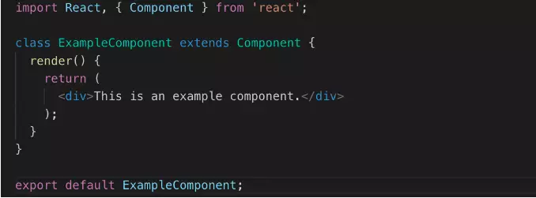

Bạn có thể thấy, **class ExampleComponent** kế thừa **Component**, vì vậy React hiểu class này là một component, và nó renders (returns) 1 React Element.

Vì vậy, một React class component là:

- là một class ES6, nó sẽ là một component khi nó "kế thừa" React **component**.
- có thể nhận **props** (trong hàm khởi tạo) nếu cần.
- có thể maintain data của nó với **state**
- phải có 1 method **render()** trả về 1 React element (JSX), or null
## 4. Tạo Component
Các bước mình sẽ tạo component:

- Mình sẽ tạo 1 **class** component, như component **cha**.
- Và một **functional** component như component **con**.
- Rồi mình sẽ gọi **con** trong component **cha**.
- Cuối cùng, mình gọi component **cha** trong **file root (app.js)**

Bắt đầu với việc tạo components cha và con. Đầu tiên, chúng ta tạo một file tên là **parentComponent** và file khác cho con (**firstChild**) với phần mở rộng .js hoặc .jsx

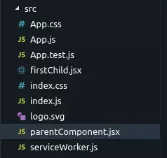

OK, bây giờ trong file **parentComponent**, đầu tiên chúng ta import React và Component (vậy thì React hiểu class này là 1 component), rồi định nghĩa 1 class như dưới:

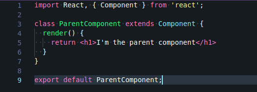

Vậy **ParentComponent** bây giờ là 1 **class component** và sẵn sàng để sử dụng.

Xong, bây giờ trong file **firstChild**, chúng ta import React rồi định nghĩa một function ES6 như sau:
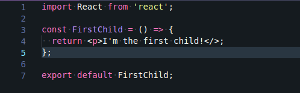

Component này sẽ return element

, nhưng để thấy đc thẻ `<p>` này đc render, nó cần được gọi ở đâu đó.
## Gọi một component như thế nào?
Một component được gọi như 1 thẻ HTML vậy, nhưng chỉ khác là chúng sẽ bắt đầu bằng chữ hoa, hay được hiểu là theo kiểu **PascalCase**
```jsx
<FirstChild />
```
Bây giờ, chúng ta gọi component con ở trong component cha:

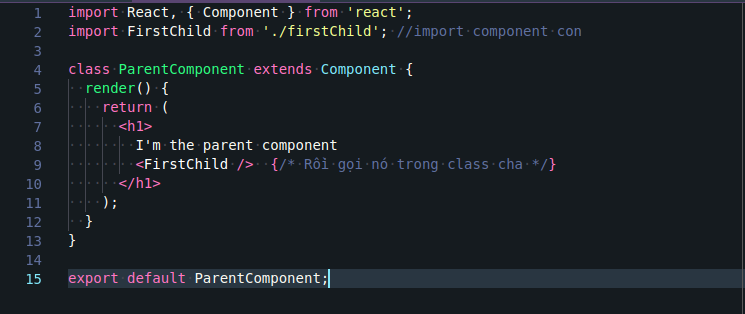
Cuối cùng, gọi component cha trong root (App) function:
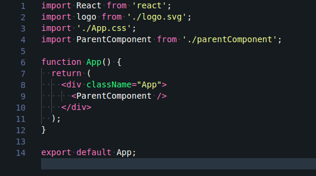

Bây giờ, **root file** renders **parentComponent**, bao gồm tất cả mọi thứ trong đó. Hãy cùng xem kết quả:

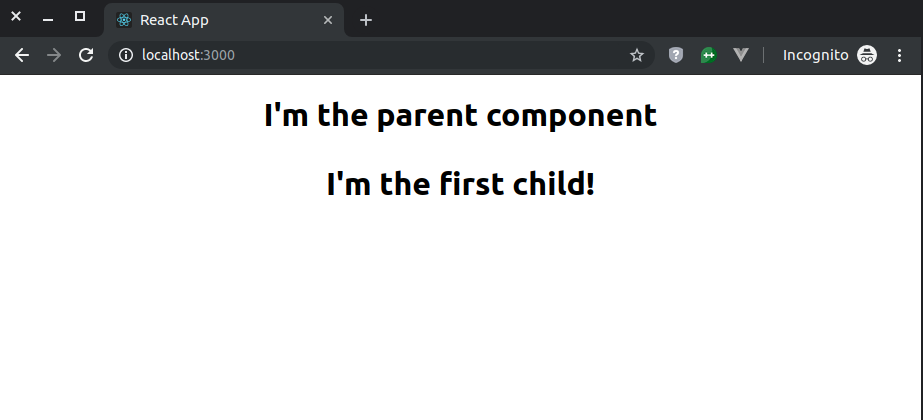

---

# List, Key (Danh sách và Key)

Đoạn mã dưới đây, chúng ta sử dụng hàm `map()` để lấy một mảng số và **tăng gấp đôi giá trị** của chúng. Mảng mới trả về bởi `map()` được gán cho biến `doubled` và log ra:

```jsx
const numbers = [1, 2, 3, 4, 5];
const doubled = numbers.map((number) => number * 2);
console.log(doubled);
```

Đoạn code này sẽ log ra: `[2, 4, 6, 8, 10]`.

Trong React, việc biến đổi mảng thành danh sách các phần tử gần như giống hệt.

---

## Rendering Multiple Components (Render nhiều component)

Bạn có thể tạo tập hợp các phần tử và **đưa chúng vào JSX** bằng cách sử dụng dấu ngoặc nhọn `{}`.

Ví dụ: lặp qua mảng `numbers` bằng `map()` và trả về 1 phần tử `<li>` cho mỗi item. Sau đó gán vào `listItems`:

```jsx
const numbers = [1, 2, 3, 4, 5];
const listItems = numbers.map((number) =>
  <li>{number}</li>
);
```

Rồi đưa cả mảng `listItems` này vào trong một `<ul>`:

```jsx
<ul>{listItems}</ul>
```

---

## Basic List Component (Component danh sách cơ bản)

Thông thường, bạn sẽ render danh sách bên trong một component.

```jsx
function NumberList(props) {
  const numbers = props.numbers;
  const listItems = numbers.map((number) =>
    <li>{number}</li>
  );
  return (
    <ul>{listItems}</ul>
  );
}

const numbers = [1, 2, 3, 4, 5];
const root = ReactDOM.createRoot(document.getElementById('root'));
root.render(<NumberList numbers={numbers} />);
```

Khi chạy, bạn sẽ thấy **cảnh báo cần có key** cho từng item.

---

## Keys

**Key** giúp React biết item nào đã thay đổi, thêm hoặc xóa. Mỗi phần tử trong mảng render ra phải có key **ổn định và duy nhất**:

```jsx
function NumberList(props) {
  const numbers = props.numbers;
  const listItems = numbers.map((number) =>
    <li key={number.toString()}>
      {number}
    </li>
  );
  return <ul>{listItems}</ul>;
}
```

### Quy tắc chọn key

* Tốt nhất: dùng **ID** từ dữ liệu.

```jsx
const todoItems = todos.map((todo) =>
  <li key={todo.id}>{todo.text}</li>
);
```

* Nếu không có ID: có thể dùng **index** (nhưng chỉ khi chắc chắn mảng không thay đổi thứ tự).

```jsx
const todoItems = todos.map((todo, index) =>
  <li key={index}>{todo.text}</li>
);
```

👉 Tránh dùng index khi danh sách có thể sắp xếp lại → dễ gây bug.

---

## Extracting Components with Keys (Tách component với Key)

**Sai lầm thường gặp:** đặt key **bên trong component con** thay vì ngay chỗ `map()`.

**Sai:**

```jsx
function ListItem(props) {
  return <li key={props.value}>{props.value}</li>;
}

function NumberList(props) {
  const listItems = props.numbers.map((n) =>
    <ListItem value={n} />
  );
  return <ul>{listItems}</ul>;
}
```

**Đúng:**

```jsx
function ListItem(props) {
  return <li>{props.value}</li>;
}

function NumberList(props) {
  const listItems = props.numbers.map((n) =>
    <ListItem key={n.toString()} value={n} />
  );
  return <ul>{listItems}</ul>;
}
```

---

## Keys Must Only Be Unique Among Siblings

Keys chỉ cần **duy nhất trong cùng một danh sách**.
Bạn có thể dùng lại key ở danh sách khác.

```jsx
function Blog(props) {
  const sidebar = (
    <ul>
      {props.posts.map((post) =>
        <li key={post.id}>{post.title}</li>
      )}
    </ul>
  );

  const content = props.posts.map((post) =>
    <div key={post.id}>
      <h3>{post.title}</h3>
      <p>{post.content}</p>
    </div>
  );

  return (
    <div>
      {sidebar}
      <hr />
      {content}
    </div>
  );
}
```

👉 Key không truyền xuống component con. Nếu muốn truyền ID, hãy truyền bằng prop riêng (`id={post.id}`).

---

## Embedding map() in JSX

Bạn có thể viết thẳng `map()` trong JSX thay vì tạo biến phụ:

```jsx
function NumberList(props) {
  return (
    <ul>
      {props.numbers.map((n) =>
        <ListItem key={n.toString()} value={n} />
      )}
    </ul>
  );
}
```

---

# Giải thích dễ hiểu

* **map()**: biến đổi mảng dữ liệu → mảng phần tử JSX.
* **Key**: giúp React nhận diện phần tử nào thay đổi để update DOM chính xác, tránh render lại toàn bộ.
* **Đặt key đúng chỗ**: trong vòng lặp `map()`, trên phần tử được lặp.
* **Tránh dùng index** nếu danh sách có thể thay đổi vị trí item.

📌 Nói ngắn gọn: *“Muốn render danh sách trong React → dùng map() → mỗi item cần có key duy nhất.”*

---

# Props, State
## 1.Props

- **Khái niệm** : là 1 từ viết ngắn gọn của `properties` , nhưng lại là 1 khái niệm trong ReactJS. `props` là 1 đối tượng, nó lưu trữ các giá trị của các attribute (thuộc tính) của một thẻ (Tag).Là cách mà component có thể nhận được các giá trị của thuộc tính truyền vào từ bên ngoài vào, và là cách mà các component có thể nói chuyện với nhau.
Ví dụ:
```jsx
function Welcome(props) {
  return <h1>Hello, {props.name}</h1>;
}

const element = <Welcome name="ReactJS" />;
ReactDOM.render(
  element,
  document.getElementById('root')
);
```
Trong đó, `name` ở `{props.name}` là property, `Welcome` là Component. Mỗi `property` của Component sẽ tương ứng với 1 attribute của thẻ, giá trị của attribute sẽ được truyền vào property của Component.

- Chúng ta sử dụng `props` để truyền gửi dữ liệu đến các component.
- Mọi component được gọi là hàm javascript thuần khiết (pure function).
- `props` tương ứng với tham số của pure function javascript .
- Không thể thay đổi dữ liệu của `props` .

Với ví dụ trên, dòng `<Welcome name="ReactJS" />` tạo ra một Component `Welcome` và `attribute` có value là `ReactJS`, ở bên trên chúng ta có 1 function component trả về `Hello, {props.name}` và như vậy, {props.name} sẽ cho chúng ta giá trị là `ReactJS` mà Component `Welcome` truyền vào, và cuối cùng thì khi `render` sẽ ra đoạn : Hello, `ReactJS`. Giống như là 1 cách gọi hàm trong `javascript` đúng không nhỉ 😄

- Không nên thay đổi `props`: bạn có thể thay đổi props bằng cách sử dụng `setProps` hay `replaceProps` nhưng không được React khuyến khích ==( Props are Read-Only)== - React tuân theo 1 rule đó là pure function: không làm thay đổi giá trị đầu vào và luôn trả về 1 kiểu định dạng.

Chúng ta hãy cùng thử xem ví dụ (mình lấy từ trang chủ của React):

```jsx
function Clock(props) {
 return (
   <div>
     <h1>Hello, world!</h1>
     <h2>It is {props.date.toLocaleTimeString()}.</h2>
   </div>
 );
}

function tick() {
 ReactDOM.render(
   <Clock date={new Date()} />,
   document.getElementById('root')
 );
}

setInterval(tick, 1000);
```

Có thể thấy `Clock` component vẫn phải phụ thuộc vào function `tick()` để update data.Để `Clock` component sẽ hoạt động độc lập và tự update chính nó thì chúng ta sẽ sử dụng `State`.
## 2. State

- Khái niệm: Cũng giống như `props` , state cũng lưu trữ thông tin về component, nhưng là lưu trữ dữ liệu động của một component.
- `State` là dữ liệu động , nó cho phép một component theo dõi thông tin thay đổi giữa các kết xuất (`render`) và làm cho nó có thể tương tác.
- `State` chỉ có thể được sử dụng ở trong một component sinh ra nó.
- Nếu dự đoán được một component cần quản lý state, thì nó nên được tạo ở trong một ==class== chứ không phải là một `function component`.
Và với ví dụ trên thì chúng ta bắt đầu thử sử dụng `state` thay cho `props` xem sao nhé 

`1. Thay thế this.props.date bằng this.state.date ở render() method.`

```jsx
class Clock extends React.Component {
  render() {
    return (
      <div>
        <h1>Hello, world!</h1>
        <h2>It is {this.state.date.toLocaleTimeString()}.</h2>
      </div>
    );
  }
}
```
`2. Thêm class contructor().`

```jsx
class Clock extends React.Component {
 constructor(props) {
   super(props);
   this.state = {date: new Date()};
 }

 render() {
   return (
     <div>
       <h1>Hello, world!</h1>
       <h2>It is {this.state.date.toLocaleTimeString()}.</h2>
     </div>
   );
 }
}
```
`3. Xóa date prop từ <Clock /> element.`
```jsx
ReactDOM.render(
  <Clock />,
  document.getElementById('root')
);
```

Có vẻ như vẫn đang thấy hơi sai sai vì `Clock` chỉ update khi F5, để giải quyết được bài toán đó thì chúng ta cần thêm các method đặc biệt gọi là `lifecycle methods`, và ở ví dụ này chúng ta thêm 2 function:

- `componentDidMount()`: đây là nơi chúng ta khởi tạo Timer

- `componentWillUnmount()`: đây là nơi chúng ta clear Timer

Và cuối cùng để update state chúng ta sử dụng `this.setState()`, full code :

```jsx
class Clock extends React.Component {
  constructor(props) {
    super(props);
    this.state = {date: new Date()};
  }

  componentDidMount() {
    this.timerID = setInterval(
      () => this.tick(),
      1000
    );
  }

  componentWillUnmount() {
    clearInterval(this.timerID);
  }

  tick() {
    this.setState({
      date: new Date()
    });
  }

  render() {
    return (
      <div>
        <h1>Hello, world!</h1>
        <h2>It is {this.state.date.toLocaleTimeString()}.</h2>
      </div>
    );
  }
}

ReactDOM.render(
  <Clock />,
  document.getElementById('root')
);
```
Đoạn code sẽ hoạt động như sau:

- Component khởi tạo và khởi tạo luôn State với date = current time
- Sau khi Compnent khởi tạo với giá trị state được khởi tạo thì `componentDidMount` sẽ chạy và khởi tạo interval và gán nó cho `this.Timer`
- Sau khi interval chạy thì sẽ update `State` mỗi giây bằng method `this.setState()`
- State thay đổi sẽ raise sự kiện change và render sẽ update UI mới nhất.
- Trước khi chúng ta rời khởi page thì function `componentWillUnmount()` sẽ chạy và clear interval
Và chúng ta có một chút so sánh giữa `state` và `props`

| Đặc điểm | Props | State |
|----------|-------|-------|
| Có thể nhận giá trị ban đầu từ component cha | Yes | Yes |
| Có thể thay đổi bởi component cha | Yes | No |
| Có thể set giá trị mặc định bên trong component | Yes | Yes |
| Có thể thay đổi bên trong component | No | Yes |
| Có thể set giá trị ban đầu cho các component con | Yes | Yes |
| Có thể thay đổi trong các component con | Yes | No |


# Handling Event


## Xử lý sự kiện trong React

Việc xử lý sự kiện với các phần tử React khá giống với việc xử lý sự kiện trên các phần tử DOM.  
Tuy nhiên, có một số khác biệt về cú pháp:

- **Tên sự kiện trong React** được viết theo kiểu `camelCase` thay vì chữ thường.
- Với JSX, bạn **truyền một hàm** làm event handler thay vì một chuỗi.

---

### Ví dụ
HTML:
```html
<button onclick="activateLasers()">
  Activate Lasers
</button>
```

React:

```jsx
<button onClick={activateLasers}>
  Activate Lasers
</button>
```

---

### Khác biệt về `preventDefault`

Bạn **không thể** trả về `false` để ngăn hành vi mặc định trong React.
Bạn phải gọi **`preventDefault()`** một cách tường minh.

**HTML thuần**:

```html
<form onsubmit="console.log('You clicked submit.'); return false">
  <button type="submit">Submit</button>
</form>
```

**React**:

```jsx
function Form() {
  function handleSubmit(e) {
    e.preventDefault();
    console.log('You clicked submit.');
  }

  return (
    <form onSubmit={handleSubmit}>
      <button type="submit">Submit</button>
    </form>
  );
}
```

Ở đây, `e` là một **synthetic event**. React định nghĩa các sự kiện này theo chuẩn W3C, nên bạn không cần lo về vấn đề tương thích giữa các trình duyệt. Tuy nhiên, React events không hoạt động hoàn toàn giống native events.

---

### Không cần `addEventListener`

Khi dùng React, bạn thường **không cần** gọi `addEventListener` để gắn sự kiện sau khi phần tử được tạo. Thay vào đó, chỉ cần cung cấp listener ngay khi render phần tử.

---

## Ví dụ với class component

```jsx
class Toggle extends React.Component {
  constructor(props) {
    super(props);
    this.state = { isToggleOn: true };

    // Cần bind để `this` hoạt động trong callback
    this.handleClick = this.handleClick.bind(this);
  }

  handleClick() {
    this.setState(prevState => ({
      isToggleOn: !prevState.isToggleOn
    }));
  }

  render() {
    return (
      <button onClick={this.handleClick}>
        {this.state.isToggleOn ? 'ON' : 'OFF'}
      </button>
    );
  }
}
```


## Chú ý về `this` trong JSX callback

Trong JavaScript, **class methods không được bind mặc định**. Nếu bạn quên bind `this.handleClick` và truyền nó vào `onClick`, thì `this` sẽ là `undefined` khi hàm được gọi.

Điều này **không phải** là hành vi riêng của React, mà là cách hàm hoạt động trong JavaScript. Nếu bạn truyền một method mà không có `()`, như `onClick={this.handleClick}`, bạn cần bind method đó.

---

## Cách tránh phải bind thủ công

### 1. Dùng **public class fields**

```jsx
class LoggingButton extends React.Component {
  // Đảm bảo `this` được bind bên trong handleClick
  handleClick = () => {
    console.log('this is:', this);
  };
  render() {
    return (
      <button onClick={this.handleClick}>
        Click me
      </button>
    );
  }
}
```

Cú pháp này được bật mặc định trong Create React App.

---

### 2. Dùng arrow function trong callback

```jsx
class LoggingButton extends React.Component {
  handleClick() {
    console.log('this is:', this);
  }

  render() {
    // Đảm bảo `this` được bind bên trong handleClick
    return (
      <button onClick={() => this.handleClick()}>
        Click me
      </button>
    );
  }
}
```

Nhược điểm: mỗi lần render, một callback mới được tạo.
Điều này **thường không sao**, nhưng nếu callback được truyền xuống các component con, chúng có thể render lại không cần thiết. Vì vậy, nên **bind trong constructor** hoặc dùng **class fields** để tránh vấn đề hiệu năng.

---

## Truyền tham số vào event handler

Trong vòng lặp, thường bạn sẽ muốn truyền thêm tham số cho event handler. Ví dụ, nếu `id` là ID của dòng:

```jsx
<button onClick={(e) => this.deleteRow(id, e)}>Delete Row</button>
<button onClick={this.deleteRow.bind(this, id)}>Delete Row</button>
```

Hai cách trên **tương đương**:

* Dùng arrow function.
* Dùng `Function.prototype.bind`.

Trong cả hai trường hợp, đối số `e` (React event) sẽ được truyền như **tham số thứ hai** sau `id`.
Với arrow function, bạn phải truyền nó rõ ràng, còn với `bind`, các tham số còn lại sẽ được tự động truyền tiếp.


# Conditional Rendering

Ok, mình đã dịch toàn bộ nội dung này sang tiếng Việt và format bằng Markdown để dễ đọc và học:

````markdown
# Conditional Rendering trong React

Trong React, bạn có thể tạo các **component riêng biệt** để đóng gói hành vi mà bạn cần.  
Sau đó, bạn có thể **chỉ render một số component** tùy thuộc vào **state** của ứng dụng.

Việc render có điều kiện (conditional rendering) trong React hoạt động giống hệt như điều kiện trong JavaScript.  
Bạn có thể dùng **if** hoặc **toán tử điều kiện** để tạo các element phù hợp với state hiện tại và để React cập nhật UI tương ứng.

---

## Ví dụ cơ bản

```jsx
function UserGreeting(props) {
  return <h1>Welcome back!</h1>;
}

function GuestGreeting(props) {
  return <h1>Please sign up.</h1>;
}

function Greeting(props) {
  const isLoggedIn = props.isLoggedIn;
  if (isLoggedIn) {
    return <UserGreeting />;
  }
  return <GuestGreeting />;
}

const root = ReactDOM.createRoot(document.getElementById('root')); 
root.render(<Greeting isLoggedIn={false} />);
````

Ví dụ này sẽ hiển thị một lời chào khác nhau tùy vào giá trị `isLoggedIn` nhận từ **props**.

---

## Element Variables

Bạn có thể lưu **element** vào biến và render có điều kiện một phần của component trong khi các phần còn lại không thay đổi.

```jsx
function LoginButton(props) {
  return (
    <button onClick={props.onClick}>Login</button>
  );
}

function LogoutButton(props) {
  return (
    <button onClick={props.onClick}>Logout</button>
  );
}

class LoginControl extends React.Component {
  constructor(props) {
    super(props);
    this.state = { isLoggedIn: false };
    this.handleLoginClick = this.handleLoginClick.bind(this);
    this.handleLogoutClick = this.handleLogoutClick.bind(this);
  }

  handleLoginClick() {
    this.setState({ isLoggedIn: true });
  }

  handleLogoutClick() {
    this.setState({ isLoggedIn: false });
  }

  render() {
    const isLoggedIn = this.state.isLoggedIn;
    let button;
    if (isLoggedIn) {
      button = <LogoutButton onClick={this.handleLogoutClick} />;
    } else {
      button = <LoginButton onClick={this.handleLoginClick} />;
    }

    return (
      <div>
        <Greeting isLoggedIn={isLoggedIn} />
        {button}
      </div>
    );
  }
}

const root = ReactDOM.createRoot(document.getElementById('root')); 
root.render(<LoginControl />);
```

---

## Inline If với toán tử `&&`

Bạn có thể chèn các biểu thức trong JSX bằng cách đặt chúng trong `{}`. Điều này bao gồm toán tử `&&` trong JavaScript.

```jsx
function Mailbox(props) {
  const unreadMessages = props.unreadMessages;
  return (
    <div>
      <h1>Hello!</h1>
      {unreadMessages.length > 0 &&
        <h2>
          You have {unreadMessages.length} unread messages.
        </h2>
      }
    </div>
  );
}

const messages = ['React', 'Re: React', 'Re:Re: React'];

const root = ReactDOM.createRoot(document.getElementById('root')); 
root.render(<Mailbox unreadMessages={messages} />);
```

📌 Trong JavaScript:

* `true && expression` → trả về `expression`
* `false && expression` → trả về `false`

Nên nếu điều kiện đúng, element sau `&&` sẽ được render; nếu sai, React bỏ qua.

Lưu ý: Nếu trả về một giá trị falsy (vd: `0`) thì React vẫn render giá trị đó. Ví dụ:

```jsx
render() {
  const count = 0;
  return (
    <div>
      {count && <h1>Messages: {count}</h1>}
    </div>
  );
}
```

Sẽ render `<div>0</div>`.

---

## Inline If-Else với toán tử điều kiện `? :`

```jsx
render() {
  const isLoggedIn = this.state.isLoggedIn;
  return (
    <div>
      The user is <b>{isLoggedIn ? 'currently' : 'not'}</b> logged in.
    </div>
  );
}
```

Hoặc dùng cho cả element:

```jsx
render() {
  const isLoggedIn = this.state.isLoggedIn;
  return (
    <div>
      {isLoggedIn
        ? <LogoutButton onClick={this.handleLogoutClick} />
        : <LoginButton onClick={this.handleLoginClick} />
      }
    </div>
  );
}
```

💡 Khi điều kiện phức tạp, tốt nhất nên tách thành component riêng.

---

## Ngăn component render

Đôi khi bạn muốn một component **không render gì cả** dù nó được gọi.
Bạn có thể **return `null`** trong hàm `render`.

```jsx
function WarningBanner(props) {
  if (!props.warn) {
    return null;
  }

  return (
    <div className="warning">
      Warning!
    </div>
  );
}

class Page extends React.Component {
  constructor(props) {
    super(props);
    this.state = { showWarning: true };
    this.handleToggleClick = this.handleToggleClick.bind(this);
  }

  handleToggleClick() {
    this.setState(state => ({
      showWarning: !state.showWarning
    }));
  }

  render() {
    return (
      <div>
        <WarningBanner warn={this.state.showWarning} />
        <button onClick={this.handleToggleClick}>
          {this.state.showWarning ? 'Hide' : 'Show'}
        </button>
      </div>
    );
  }
}

const root = ReactDOM.createRoot(document.getElementById('root')); 
root.render(<Page />);
```

📌 `return null` **không** ảnh hưởng đến lifecycle methods. Ví dụ, `componentDidUpdate` vẫn sẽ được gọi.


# PHẦN 2: LIFE CYCLE
# Life Cycle (Tham khảo: https://www.freecodecamp.org/news/react-component-lifecycle-methods/ )
Ok, mình sẽ dịch toàn bộ nội dung bạn đưa sang tiếng Việt, giữ nguyên bố cục và code dưới dạng **Markdown** để bạn dễ đọc và sử dụng.

---

# Vòng đời của Component trong React

Trong React, các component có một vòng đời bao gồm nhiều giai đoạn khác nhau. Mỗi giai đoạn có một tập hợp các phương thức vòng đời (lifecycle methods) được gọi tại những thời điểm cụ thể trong vòng đời của component. Các phương thức này cho phép bạn kiểm soát hành vi của component và thực hiện các hành động cụ thể ở các giai đoạn khác nhau.

Vòng đời của một component có **ba giai đoạn chính**:

1. **Mounting Phase** (Giai đoạn gắn vào DOM)
2. **Updating Phase** (Giai đoạn cập nhật)
3. **Unmounting Phase** (Giai đoạn gỡ bỏ)

* **Mounting Phase** bắt đầu khi một component được tạo và gắn vào DOM.
* **Updating Phase** diễn ra khi `state` hoặc `props` của component thay đổi.
* **Unmounting Phase** diễn ra khi component bị gỡ khỏi DOM.
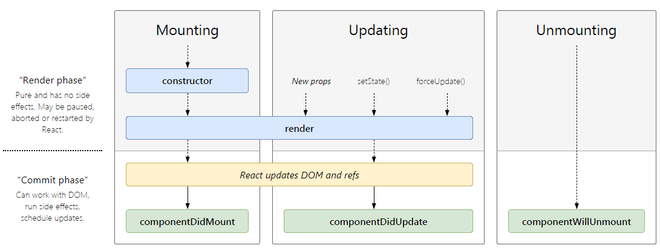
---

## 1. Component Mounting Phase

**Mounting phase** là khoảng thời gian khi một component được tạo và gắn vào DOM.

Trong giai đoạn này, React sẽ gọi một số phương thức vòng đời để lập trình viên cấu hình component, thiết lập state, gắn listener và thực hiện các tác vụ khởi tạo khác.
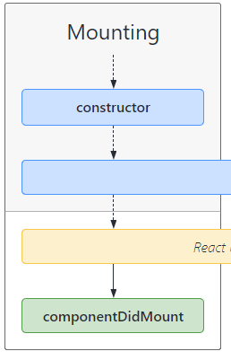
**Các phương thức vòng đời chính trong Mounting Phase**:

---

### **`constructor()` lifecycle method**

`constructor()` được gọi khi component được tạo. Bạn sử dụng nó để khởi tạo state và bind các phương thức vào instance của component.

**Ví dụ:**

```jsx
import React, { Component } from 'react';

class Counter extends Component {
  constructor(props) {
    super(props);
    this.state = {
      count: 0
    };
    this.handleClick = this.handleClick.bind(this);
  }

  handleClick() {
    this.setState(prevState => ({
      count: prevState.count + 1
    }));
  }

  render() {
    return (
      <div>
        <p>Count: {this.state.count}</p>
        <button onClick={this.handleClick}>Increment</button>
      </div>
    );
  }
}

export default Counter;
```

Trong ví dụ này:

* `constructor()` khởi tạo state với `count = 0`.
* Bind `handleClick` vào instance của component.
* Khi nút được bấm → `handleClick` thay đổi state → component re-render.

---

### **`render()` lifecycle method**

`render()` chịu trách nhiệm tạo **virtual DOM** dựa trên `props` và `state`.
Nó được gọi mỗi khi component cần vẽ lại, do thay đổi `state`, `props` hoặc do parent component re-render.

Ví dụ (từ trên):

```jsx
render() {
  return (
    <div>
      <p>Count: {this.state.count}</p>
      <button onClick={this.handleClick}>Increment</button>
    </div>
  );
}
```

* Hiển thị giá trị `count` và nút bấm.
* Khi bấm nút → `setState()` → re-render → cập nhật giá trị hiển thị.

---

### **`getDerivedStateFromProps()` lifecycle method**

`getDerivedStateFromProps()` (React 16.3+) được gọi trong **Mounting** và **Updating phase**.

* Trong Mounting: gọi sau `constructor` và trước `render`.
* Dùng để **cập nhật state dựa trên props** trước khi render.

**Cú pháp:**

```jsx
static getDerivedStateFromProps(props, state)
```

* `props`: props mới của component.
* `state`: state hiện tại.
* Trả về **object** để cập nhật state, hoặc `null` nếu không cần cập nhật.
* Là **static method**, không truy cập được `this`.

**Ví dụ:**

```jsx
import React from 'react';
import ReactDOM from 'react-dom';

class Header extends React.Component {
  constructor(props) {
    super(props);
    this.state = { favoritefood: "rice" };
  }

  componentDidMount() {
    setTimeout(() => {
      this.setState({ favoritefood: "pizza" })
    }, 1000)
  }

  static getDerivedStateFromProps(props, state) {
    return { favoritefood: props.favfod };
  }

  render() {
    return (
      <h1>My Favorite Food is {this.state.favoritefood}</h1>
    );
  }
}

ReactDOM.render(<Header />, document.getElementById('root'));
```

---

### **`componentDidMount()` lifecycle method**

`componentDidMount()` được gọi **sau khi component đã gắn vào DOM**.
Thường dùng để:

* Gắn event listener
* Gọi API / lấy dữ liệu
* Thiết lập timer

**Ví dụ:**

```jsx
import React from 'react';
import ReactDOM from 'react-dom';

class Header extends React.Component {
  constructor(props) {
    super(props);
    this.state = { favoritefood: "rice" };
  }

  componentDidMount() {
    setTimeout(() => {
      this.setState({ favoritefood: "pizza" })
    }, 1000)
  }

  render() {
    return (
      <h1>My Favorite Food is {this.state.favoritefood}</h1>
    );
  }
}

ReactDOM.render(<Header />, document.getElementById('root'));
```

---

## 2. Component Updating Phase

Xảy ra khi `props` hoặc `state` thay đổi.

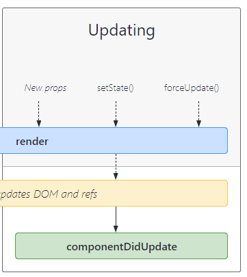
---

### **`shouldComponentUpdate()`**

Được gọi trước khi update.
Nhận 2 tham số `nextProps` và `nextState`, trả về `true` hoặc `false` để quyết định có re-render không.

**Ví dụ:**

```jsx
import React, { Component } from 'react';
import ReactDOM from 'react-dom';

class Header extends Component {
  constructor(props) {
    super(props);
    this.state = { favoriteFood: 'rice' };
  }

  shouldComponentUpdate(nextProps, nextState) {
    return this.state.favoriteFood !== nextState.favoriteFood;
  }

  changeFood = () => {
    this.setState({ favoriteFood: 'Pizza' });
  }

  render() {
    return (
      <div>
        <h1>My Favorite Food is {this.state.favoriteFood}</h1>
        <button type="button" onClick={this.changeFood}>Change food</button>
      </div>
    );
  }
}

ReactDOM.render(<Header />, document.getElementById('root'));
```

---

### **`componentWillUpdate()`** (đã deprecated, chỉ dùng cho React cũ)

Được gọi **trước khi update**, nhận `nextProps`, `nextState`.

**Ví dụ:**

```jsx
import React, { Component } from 'react';
import ReactDOM from 'react-dom';

class MyComponent extends Component {
  state = { count: 0 };

  handleClick = () => {
    this.setState({ count: this.state.count + 1 });
  };

  componentWillUpdate(nextProps, nextState) {
    if (nextState.count !== this.state.count) {
      console.log(`Count is about to update from ${this.state.count} to ${nextState.count}.`);
    }
  }

  render() {
    return (
      <div>
        <h1>Count: {this.state.count}</h1>
        <button onClick={this.handleClick}>Increment</button>
      </div>
    );
  }
}

ReactDOM.render(<MyComponent />, document.getElementById('root'));
```

---

### **`componentDidUpdate()`**

Được gọi **sau khi update và re-render**.
Dùng để chạy side effect sau khi state/props thay đổi.

**Ví dụ:**

```jsx
import React, { Component } from 'react';

class ExampleComponent extends Component {
  constructor(props) {
    super(props);
    this.state = { count: 0 };
  }

  componentDidUpdate(prevProps, prevState) {
    if (prevState.count !== this.state.count) {
      console.log('Count has been updated:', this.state.count);
    }
  }

  handleClick() {
    this.setState(prevState => ({
      count: prevState.count + 1
    }));
  }

  render() {
    return (
      <div>
        <p>Count: {this.state.count}</p>
        <button onClick={() => this.handleClick()}>Increment</button>
      </div>
    );
  }
}

export default ExampleComponent;
```

---

### **`getSnapshotBeforeUpdate()`**

Được gọi **ngay trước khi UI update**.
Dùng để lấy thông tin từ DOM (ví dụ vị trí scroll) trước khi thay đổi.

**Ví dụ:**

```jsx
import React from 'react';
import ReactDOM from 'react-dom';

class Header extends React.Component {
  constructor(props) {
    super(props);
    this.state = { favoritefood: "rice" };
  }

  componentDidMount() {
    setTimeout(() => {
      this.setState({ favoritefood: "pizza" })
    }, 1000)
  }

  getSnapshotBeforeUpdate(prevProps, prevState) {
    document.getElementById("div1").innerHTML =
      "Before the update, the favorite was " + prevState.favoritefood;
  }

  componentDidUpdate() {
    document.getElementById("div2").innerHTML =
      "The updated favorite food is " + this.state.favoritefood;
  }

  render() {
    return (
      <div>
        <h1>My Favorite Food is {this.state.favoritefood}</h1>
        <div id="div1"></div>
        <div id="div2"></div>
      </div>
    );
  }
}

ReactDOM.render(<Header />, document.getElementById('root'));
```

---

## 3. Component Unmounting Phase

Diễn ra khi component bị gỡ khỏi DOM.
Dùng để **cleanup** (xóa timer, bỏ listener, giải phóng tài nguyên).
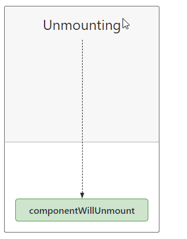
---

### **`componentWillUnmount()`**

Được gọi **trước khi gỡ component khỏi DOM**.

**Ví dụ:**

```jsx
import React, { Component } from 'react';
import ReactDOM from 'react-dom';

class MyComponent extends Component {
  state = { showChild: true };

  handleDelete = () => {
    this.setState({ showChild: false });
  };

  render() {
    return (
      <div>
        {this.state.showChild && <Child />}
        <button onClick={this.handleDelete}>Delete Header</button>
      </div>
    );
  }
}

class Child extends Component {
  componentWillUnmount() {
    alert('The component named Child is about to be unmounted.');
  }

  render() {
    return <h1>Hello World!</h1>;
  }
}

ReactDOM.render(<MyComponent />, document.getElementById('root'));
```

---

Nếu bạn muốn, mình có thể **vẽ một bảng tóm tắt toàn bộ các lifecycle methods** từ bài này để dễ học thuộc hơn. Bạn có muốn mình làm bảng đó không?

# Hooks:
Dưới đây là bản dịch sang tiếng Việt, giữ nguyên cấu trúc và chuyển sang Markdown để dễ đọc:

---

# 📌 Hooks trong React

## 1. **State Hooks**

**State** cho phép một component “ghi nhớ” thông tin như dữ liệu người dùng nhập vào.
Ví dụ:

* Một component form có thể dùng state để lưu giá trị input.
* Một component thư viện ảnh có thể dùng state để lưu chỉ số của ảnh được chọn.

Để thêm state vào component, sử dụng một trong các Hooks sau:

* **`useState`**: khai báo một biến state mà bạn có thể cập nhật trực tiếp.
* **`useReducer`**: khai báo một biến state với logic cập nhật nằm trong một hàm reducer.

```jsx
function ImageGallery() {
  const [index, setIndex] = useState(0);
  // ...
}
```

---

## 2. **Context Hooks**

**Context** cho phép một component nhận thông tin từ các component cha ở xa mà không cần truyền qua props từng cấp.
Ví dụ: Component ở cấp cao nhất của ứng dụng có thể truyền theme UI hiện tại xuống tất cả component con, bất kể sâu bao nhiêu cấp.

* **`useContext`**: đọc và đăng ký lắng nghe một context.

```jsx
function Button() {
  const theme = useContext(ThemeContext);
  // ...
}
```

---

## 3. **Ref Hooks**

**Refs** cho phép một component lưu trữ thông tin **không dùng để render**, ví dụ: DOM node hoặc ID của `setTimeout`.
Khác với state, cập nhật ref **không** khiến component re-render.
Refs là “lối thoát” khỏi mô hình React — hữu ích khi làm việc với hệ thống ngoài React (như API của trình duyệt).

* **`useRef`**: khai báo một ref. Có thể lưu bất kỳ giá trị nào, nhưng thường dùng để giữ DOM node.
* **`useImperativeHandle`**: tùy chỉnh giá trị ref mà component của bạn expose ra (ít dùng).

```jsx
function Form() {
  const inputRef = useRef(null);
  // ...
}
```

---

## 4. **Effect Hooks**

**Effects** cho phép component **kết nối và đồng bộ** với các hệ thống bên ngoài.
Bao gồm: gọi API, thao tác DOM, animation, widget từ thư viện UI khác, hoặc code ngoài React.

* **`useEffect`**: kết nối một component với hệ thống bên ngoài.

```jsx
function ChatRoom({ roomId }) {
  useEffect(() => {
    const connection = createConnection(roomId);
    connection.connect();
    return () => connection.disconnect();
  }, [roomId]);
  // ...
}
```

> 💡 Effects là “lối thoát” khỏi React paradigm.
> Nếu bạn không tương tác với hệ thống bên ngoài, có thể **không cần** dùng Effect.

### Hai biến thể ít dùng của `useEffect`:

* **`useLayoutEffect`**: chạy **trước khi** trình duyệt vẽ lại màn hình — dùng để đo layout.
* **`useInsertionEffect`**: chạy **trước khi** React thay đổi DOM — thường dùng bởi thư viện để chèn CSS động.

---

## 5. **Performance Hooks**

Cách phổ biến để tối ưu re-render là **bỏ qua công việc không cần thiết**.
Ví dụ:

* Có thể yêu cầu React tái sử dụng kết quả tính toán đã cache.
* Hoặc bỏ qua re-render nếu dữ liệu **không thay đổi** so với lần render trước.

### Để bỏ qua tính toán và re-render không cần thiết:

* **`useMemo`**: cache kết quả của phép tính tốn kém.
* **`useCallback`**: cache định nghĩa hàm trước khi truyền xuống component tối ưu hóa.

```jsx
function TodoList({ todos, tab, theme }) {
  const visibleTodos = useMemo(() => filterTodos(todos, tab), [todos, tab]);
  // ...
}
```

### Khi **không thể bỏ qua** re-render:

Có thể cải thiện hiệu suất bằng cách **tách cập nhật chặn UI** (như gõ chữ trong input) và **cập nhật không chặn UI** (như vẽ lại biểu đồ).

* **`useTransition`**: đánh dấu một thay đổi state là **không chặn** và cho phép các cập nhật khác xen vào.
* **`useDeferredValue`**: hoãn cập nhật phần UI không quan trọng để các phần khác được cập nhật trước.

---

## 6. **Other Hooks** (Ít dùng)

Những Hooks này chủ yếu dành cho tác giả thư viện, ít dùng trong code ứng dụng:

* **`useDebugValue`**: tùy chỉnh nhãn hiển thị trên React DevTools cho custom Hook.
* **`useId`**: gán một ID duy nhất cho component (thường dùng với API hỗ trợ truy cập - accessibility).
* **`useSyncExternalStore`**: đăng ký lắng nghe một store bên ngoài.
* **`useActionState`**: quản lý state của các action.

---


Ok, mình sẽ giải thích chi tiết bằng tiếng Việt, có ví dụ minh họa và giữ định dạng Markdown để dễ học.

---

# 📌 Vì sao lại có Hooks?

## 1. Trước khi có Hooks

Trước React 16.8, nếu muốn component có **state** hoặc dùng **lifecycle methods** (`componentDidMount`, `componentDidUpdate`, `componentWillUnmount`...), bạn **bắt buộc** phải dùng **Class Component**.

Điều này dẫn đến một số vấn đề:

* Code **dài và phức tạp**: phải khai báo constructor, gọi `super(props)`, bind `this`.
* **Khó tái sử dụng logic**: muốn chia sẻ logic giữa các component thì phải dùng HOC (Higher-Order Component) hoặc Render Props, dẫn đến code lồng nhau (callback hell của React 😆).
* Class thường khiến người mới học React **khó hiểu** hơn Function Component.

## 2. Sự ra đời của Hooks

React Hooks được giới thiệu ở phiên bản 16.8 với mục tiêu:

* **Dùng state và các tính năng khác của React ngay trong Function Component**.
* **Tái sử dụng logic** dễ dàng hơn thông qua **custom hooks**.
* Giảm bớt sự phức tạp của class, tránh rườm rà.
* Tách biệt rõ ràng **logic** và **UI**.

> 💡 Nói ngắn gọn: Hooks giúp **Function Component** trở nên mạnh mẽ như Class Component, nhưng gọn gàng và dễ quản lý hơn.

---

# 🛠 Các Hooks cơ bản: `useState` và `useEffect`

## 1. `useState` – Quản lý State trong Function Component

**Công dụng:**
Giúp khai báo biến **state** trong function component.

**Cú pháp:**

```jsx
const [state, setState] = useState(giá_trị_khởi_tạo);
```

* `state`: giá trị hiện tại của state.
* `setState`: hàm dùng để thay đổi state.
* `giá_trị_khởi_tạo`: giá trị ban đầu của state.

**Ví dụ:**

```jsx
import { useState } from "react";

function Counter() {
  const [count, setCount] = useState(0); // khởi tạo count = 0

  return (
    <div>
      <p>Bạn đã bấm {count} lần</p>
      <button onClick={() => setCount(count + 1)}>Bấm tôi</button>
    </div>
  );
}

export default Counter;
```

> 💡 Mỗi lần gọi `setCount`, React sẽ **render lại** component với giá trị mới.

---

## 2. `useEffect` – Xử lý Tác vụ Phụ (Side Effects)

**Công dụng:**
Cho phép bạn thực hiện các tác vụ **ngoài React** như:

* Gọi API
* Thao tác DOM
* Thiết lập timer (`setInterval`, `setTimeout`)
* Đăng ký / hủy đăng ký event

**Cú pháp:**

```jsx
useEffect(() => {
  // Code side effect ở đây
  return () => {
    // Cleanup (chạy khi component unmount hoặc dependency thay đổi)
  };
}, [dependency1, dependency2]);
```

* **Callback**: chứa logic side effect.
* **Cleanup function** *(optional)*: dọn dẹp trước khi chạy effect tiếp theo hoặc khi unmount.
* **Dependency array**: mảng các giá trị mà khi thay đổi, effect sẽ chạy lại.

  * `[]`: chỉ chạy một lần khi mount.
  * Không có mảng: chạy mỗi lần render.

**Ví dụ: Đồng hồ chạy giây**

```jsx
import { useState, useEffect } from "react";

function Clock() {
  const [time, setTime] = useState(new Date());

  useEffect(() => {
    const timer = setInterval(() => {
      setTime(new Date());
    }, 1000);

    // Cleanup khi component bị gỡ
    return () => clearInterval(timer);
  }, []); // Chỉ chạy khi mount

  return <h2>Giờ hiện tại: {time.toLocaleTimeString()}</h2>;
}

export default Clock;
```

---

💡 **Tóm tắt nhanh:**

| Hook        | Công dụng          | Khi dùng                                            |
| ----------- | ------------------ | --------------------------------------------------- |
| `useState`  | Quản lý state      | Khi cần lưu trữ và thay đổi dữ liệu trong component |
| `useEffect` | Xử lý side effects | Khi cần chạy code ngoài React (API, timer, DOM...)  |

---


# 🚀 5 Hooks Quan Trọng Nhất Trong React

## 1. `useState` – Quản lý trạng thái (State Management)

**Mục đích:** Lưu trữ và thay đổi giá trị **state** trong Function Component.

**Cú pháp:**

```jsx
const [state, setState] = useState(initialValue);
```

**Ví dụ: Bộ đếm số**

```jsx
import { useState } from "react";

function Counter() {
  const [count, setCount] = useState(0);

  return (
    <div>
      <p>Bạn đã bấm {count} lần</p>
      <button onClick={() => setCount(count + 1)}>Tăng</button>
    </div>
  );
}
```

**Flow hoạt động:**

1. Component render lần đầu → state được gán `initialValue`.
2. Gọi `setState` → React lưu state mới → re-render component.
3. State giữ nguyên khi render lại, chỉ thay đổi khi `setState` được gọi.

---

## 2. `useEffect` – Xử lý tác vụ phụ (Side Effects)

**Mục đích:** Thực hiện các tác vụ ngoài React như gọi API, thao tác DOM, timer.

**Cú pháp:**

```jsx
useEffect(() => {
  // Code side effect ở đây
  return () => {
    // Cleanup (optional)
  };
}, [dependencies]);
```

**Ví dụ: Đồng hồ**

```jsx
import { useState, useEffect } from "react";

function Clock() {
  const [time, setTime] = useState(new Date());

  useEffect(() => {
    const timer = setInterval(() => setTime(new Date()), 1000);
    return () => clearInterval(timer); // cleanup khi unmount
  }, []);
}
```

**Flow hoạt động:**

1. Sau khi React render UI → `useEffect` chạy.
2. Nếu có `dependencies` thay đổi → chạy lại effect.
3. Trước khi chạy lại hoặc khi unmount → chạy `cleanup`.

---

## 3. `useRef` – Tham chiếu & lưu giá trị không trigger re-render

**Mục đích:**

* Truy cập trực tiếp DOM element.
* Lưu trữ giá trị qua các lần render mà **không gây re-render**.

**Cú pháp:**

```jsx
const ref = useRef(initialValue);
```

**Ví dụ: Lấy input DOM**

```jsx
import { useRef } from "react";

function FocusInput() {
  const inputRef = useRef(null);

  const focusInput = () => {
    inputRef.current.focus();
  };

  return (
    <>
      <input ref={inputRef} type="text" />
      <button onClick={focusInput}>Focus</button>
    </>
  );
}
```

**Flow hoạt động:**

1. `useRef` tạo object `{ current: initialValue }`.
2. Object này **giữ nguyên** qua các lần render.
3. Thay đổi `.current` **không làm render lại**.

---

## 4. `useMemo` – Ghi nhớ giá trị tính toán

**Mục đích:** Tránh tính toán lại giá trị tốn kém nếu **dependency không thay đổi**.

**Cú pháp:**

```jsx
const memoValue = useMemo(() => computeValue(a, b), [a, b]);
```

**Ví dụ: Tính toán danh sách lọc**

```jsx
import { useMemo } from "react";

function TodoList({ todos, filter }) {
  const filteredTodos = useMemo(() => {
    console.log("Tính toán lại...");
    return todos.filter(todo => todo.includes(filter));
  }, [todos, filter]);

  return <ul>{filteredTodos.map((t, i) => <li key={i}>{t}</li>)}</ul>;
}
```

**Flow hoạt động:**

1. Render lần đầu → chạy `computeValue`.
2. Nếu dependencies **không đổi** → dùng lại giá trị cũ.
3. Nếu dependencies đổi → tính lại.

---

## 5. `useCallback` – Ghi nhớ hàm

**Mục đích:** Tránh tạo lại hàm mới khi dependencies không thay đổi → tối ưu khi truyền callback xuống component con.

**Cú pháp:**

```jsx
const memoCallback = useCallback(() => {
  // logic
}, [dependencies]);
```

**Ví dụ:**

```jsx
import { useState, useCallback } from "react";

function Parent() {
  const [count, setCount] = useState(0);

  const handleClick = useCallback(() => {
    console.log("Clicked!");
  }, []);

  return (
    <>
      <Child onClick={handleClick} />
      <button onClick={() => setCount(c => c + 1)}>Tăng</button>
    </>
  );
}

function Child({ onClick }) {
  console.log("Child render");
  return <button onClick={onClick}>Child Button</button>;
}
```

**Flow hoạt động:**

1. Nếu dependencies không đổi → `useCallback` trả về **cùng một tham chiếu hàm**.
2. Giúp component con dùng `React.memo` không bị render lại vô ích.

---

## 📊 Bảng so sánh nhanh

| Hook          | Mục đích chính               | Có trigger re-render?     | Dùng khi nào?                             |
| ------------- | ---------------------------- | ------------------------- | ----------------------------------------- |
| `useState`    | Lưu và thay đổi state        | ✅ Có                      | Khi cần dữ liệu thay đổi và render lại UI |
| `useEffect`   | Side effect ngoài React      | ✅ Có (nếu state thay đổi) | API call, DOM event, timer                |
| `useRef`      | Lưu giá trị không render lại | ❌ Không                   | DOM access, lưu biến qua render           |
| `useMemo`     | Cache giá trị tính toán      | ❌ Không                   | Tối ưu hiệu suất, tính toán nặng          |
| `useCallback` | Cache hàm callback           | ❌ Không                   | Tránh tạo hàm mới khi không cần           |

---

Nếu bạn muốn, mình có thể làm thêm **một sơ đồ minh họa vòng đời Hook** để bạn dễ hình dung khi React chạy `useState` và `useEffect`.
Bạn có muốn mình làm sơ đồ đó không?
Ok, mình sẽ viết **PHẦN 3: Component và Quản lý Cấu trúc Thư mục trong Dự án React** theo kiểu tài liệu học, giữ nội dung đầy đủ và có ví dụ minh họa.

---

# 📦 PHẦN 3: COMPONENT VÀ QUẢN LÝ CẤU TRÚC THƯ MỤC TRONG DỰ ÁN REACT

## 1. Quản lý Component trong React

### 1.1. Component là gì?

* **Component** là **khối UI độc lập** trong React, có thể tái sử dụng và quản lý dễ dàng.
* Mỗi component thường đảm nhiệm **một chức năng cụ thể**.
* Có 2 loại chính:

  1. **Function Component** (dùng Hooks).
  2. **Class Component** (dùng lifecycle methods – ít dùng hơn trong React hiện đại).

---

### 1.2. Quy tắc đặt tên và tổ chức Component

* **Tên Component viết PascalCase** (chữ cái đầu mỗi từ viết hoa).
* Mỗi component nằm trong **một file riêng**.
* Tên file trùng tên component.
* Ví dụ: `Button.jsx`, `Header.jsx`, `UserCard.jsx`.

---

### 1.3. Các loại component

| Loại Component          | Mô tả                                      | Ví dụ                           |
| ----------------------- | ------------------------------------------ | ------------------------------- |
| **Presentational (UI)** | Chỉ hiển thị UI, không chứa logic phức tạp | `Button`, `Header`, `Footer`    |
| **Container (Logic)**   | Chứa logic, quản lý state và gọi API       | `UserList`, `ProductPage`       |
| **Layout Component**    | Chứa layout chung cho nhiều trang          | `MainLayout`, `DashboardLayout` |
| **Shared Component**    | Component dùng lại nhiều nơi               | `Modal`, `Input`, `Card`        |

---

### 1.4. Ví dụ một Component đơn giản

```jsx
// src/components/Button.jsx
export default function Button({ label, onClick }) {
  return <button onClick={onClick}>{label}</button>;
}
```

---

### 1.5. Component tái sử dụng (Reusable Component)

* Dùng **props** để truyền dữ liệu.
* Tách phần style riêng (CSS module, SCSS, styled-components).
* Không gắn dữ liệu cụ thể vào UI → giúp tái sử dụng ở nhiều nơi.

Ví dụ:

```jsx
// src/components/UserCard.jsx
export default function UserCard({ name, email }) {
  return (
    <div className="user-card">
      <h3>{name}</h3>
      <p>{email}</p>
    </div>
  );
}
```

---

## 2. Cấu trúc dự án React

### 2.1. Cấu trúc cơ bản (mặc định create-react-app)

```
my-app/
│
├── public/
│   ├── index.html
│   └── favicon.ico
│
├── src/
│   ├── App.js
│   ├── index.js
│   ├── App.css
│   └── ...
│
├── package.json
└── README.md
```

* **Ưu điểm:** Đơn giản, dễ bắt đầu.
* **Nhược điểm:** Khi dự án lớn, khó quản lý component và logic.

---

### 2.2. Cấu trúc tối ưu cho dự án vừa và lớn

```
src/
│
├── assets/           # Chứa hình ảnh, font, CSS global
│   ├── images/
│   └── styles/
│
├── components/       # Component tái sử dụng (UI chung)
│   ├── Button/
│   │   ├── Button.jsx
│   │   └── Button.module.css
│   └── Modal/
│       ├── Modal.jsx
│       └── Modal.module.css
│
├── features/         # Chức năng (feature-based)
│   ├── Auth/
│   │   ├── components/
│   │   ├── pages/
│   │   └── authSlice.js
│   └── Product/
│       ├── components/
│       ├── pages/
│       └── productSlice.js
│
├── layouts/          # Layout chung
│   ├── MainLayout.jsx
│   └── DashboardLayout.jsx
│
├── pages/            # Các trang chính
│   ├── Home/
│   ├── About/
│   └── Contact/
│
├── hooks/            # Custom Hooks
│   └── useAuth.js
│
├── services/         # API services
│   └── productService.js
│
├── utils/            # Hàm tiện ích (helpers)
│   └── formatDate.js
│
├── App.jsx
└── index.js
```

---

### 2.3. Nguyên tắc quản lý thư mục

1. **Nhóm theo chức năng (feature-based)** thay vì nhóm theo loại file.
2. **Component riêng cho từng feature** để dễ bảo trì.
3. **CSS module hoặc styled-components** để tránh trùng class.
4. **Tránh import chéo lộn xộn** → dùng alias (`@components`, `@hooks`, …).
5. **Giữ cho component nhỏ gọn** → mỗi file dưới 200 dòng là hợp lý.

---

### 2.4. Ví dụ import với alias

`jsconfig.json`:

```json
{
  "compilerOptions": {
    "baseUrl": "src",
    "paths": {
      "@components/*": ["components/*"],
      "@hooks/*": ["hooks/*"],
      "@services/*": ["services/*"]
    }
  }
}
```

Sử dụng:

```jsx
import Button from "@components/Button/Button";
import useAuth from "@hooks/useAuth";
```

---

📌 **Kết luận:**

* Component nên tách nhỏ, tái sử dụng, đặt tên rõ ràng.
* Cấu trúc thư mục nên nhóm theo chức năng để dự án dễ mở rộng.
* Dùng alias để import ngắn gọn, tránh “đường dẫn spaghetti”.

---
