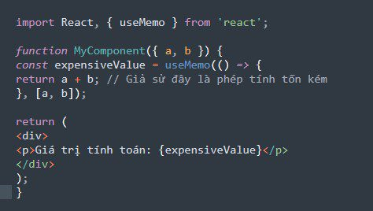

# PHẦN 1: HOOKS - P2
# (Trình bày mức cơ bản):
# useRef
## Khái niệm
- Hook Useref là một hàm trả về một đối tượng ref có thể thay đổi có thuộc tính .current được khởi tạo thành đối số được chuyển (initValue). Đối tượng được trả về sẽ tồn tại trong suốt vòng đời đầy đủ của thành phần.
- Cú pháp: 
```jsx
const refContainer = useRef(initialValue);
```
Các trường hợp phổ biến khi cần phải truy cập tới các thành phần con trong DOM đó là làm việc với input:
```jsx
function TextInputWithFocusButton() {
  const inputEl = useRef(null);
  const onButtonClick = () => {
    // `current` points to the mounted text input element
    inputEl.current.focus();
  };
  return (
    <>
      <input ref={inputEl} type="text" />
      <button onClick={onButtonClick}>Focus the input</button>
    </>
  );
}
```
- Về cơ bản, useRef giống như một "box", dùng để lưu các giá trị của một element sử dụng thuộc tính **.current**. Bạn có thể quen thuộc với ref chủ yếu như một cách để truy cập DOM. Nếu bạn chuyển một đối tượng ref cho React với `<div ref = {myRef} />`, React sẽ đặt thuộc tính .current của nó tới node DOM tương ứng bất cứ khi nào node đó thay đổi.

- Tuy nhiên, **useRef ()** hữu ích hơn nhiều so với thuộc tính ref. Nếu bạn đã quen thuộc với Class Component, bạn có thể nhận thấy rằng Fuction Component là component không có khả năng render function. Mọi thứ được định nghĩa trong phần thân của hàm là hàm kết xuất trả về JSX cuối cùng. Điều này có nghĩa là bất cứ khi nào có thay đổi về state thì tất cả các đoạn code trong function component sẽ được thực thi. Điều này chỉ ra rằng nếu chúng ta có một biến đối tượng bên trong function component thì với mỗi render, điều này sẽ được khởi tạo với giá trị mặc định. Chúng ta hãy chứng minh điều này. Chúng ta có một biến đếm tổng mỗi lần component đc render. Đầu tiên chúng tôi sẽ viết một cái gì đó như dưới đây :

```jsx
import React, {useState} from 'react';
const child = {
  padding: '25px',
  margin: '25px',
  border: '2px solid blue'
};

const Child = (prop) => {
  console.log("fuction called....");
  let counter = 0;
  let [myState, setMyState] = useState("A");

  let updateState = () => {
    counter++;
    setMyState(myState + "-u-");
    console.log("counter: "+ counter);
  }

  return (
    <div style={child}>
      <div>
        <div>MyState : {myState}</div>
        <input type="button" onClick = {() => updateState()} value="Update State"></input>
      </div>
    </div>
  );
}

export default Child;
```
Nhưng, Ở đây chúng ta thấy một vấn đề mà mọi giá trị đếm stateChage là 1 và lý do rất đơn giản mỗi lần render thì biến counter được gán lại.


Yêu cầu ở đây là Nó sẽ được tăng lên với mỗi khi thay đổi trạng thái. Bây giờ chúng ta hãy sửa đổi biến thể hiện này được tạo bằng useRef. Với ref, một object được trả về và tồn tại trong suốt vòng đời của component
```jsx
import React, {useState, useRef} from 'react';
const child = {
  padding: '25px',
  margin: '25px',
  border: '2px solid blue'
};

const Child = (prop) => {
  console.log("fuction called....");
  let counter = useRef(0);
  let [myState, setMyState] = useState("A");

  let updateState = () => {
    // Now we can update the current property of Referenced object as below.
    counter.current++;
    setMyState(myState + "-u-");
    console.log("counter: "+ counter.current);
  }

  return (
    <div style={child}>
      <div>
        <div>MyState : {myState}</div>
        <input type="button" onClick = {() => updateState()} value="Update State"></input>
      </div>
    </div>
  );
}

export default Child;
```
Bây giờ, cuối cùng chúng tôi nhận được kết quả mong đợi.

## Khi nào sử dụng thuộc tính Ref???
Nhưng nó không phải luôn luôn là một ý tưởng tốt để sử dụng thuộc tính ref. Nguyên tắc chung là tránh nó. Tài liệu React chính thức đề cập đến khi nào bạn có thể sử dụng nó vì bạn không có lựa chọn nào khác.

```jsx
- Managing focus, text selection, or media playback.
- Integrating with third-party DOM libraries.
- Triggering imperative animations.
```
Đầu tiên, bạn có thể sử dụng thuộc tính ref để truy cập API DOM (API là gì?). Bạn có thể nhận được giá trị của một phần tử đầu vào nhưng bạn cũng có thể kích hoạt các phương thức focus(). Ví dụ, nó cung cấp cho bạn quyền kiểm soát API DOM để sử dụng các thành phần media.
Thứ hai, bạn có thể sử dụng nó để tích hợp với các thư viện của bên thứ ba dựa vào DOM. D3.js là một trường hợp sử dụng như vậy, bởi vì nó phải nối vào DOM và nó có API thao tác DOM riêng. Chẳng hạn, bạn có thể muốn tích hợp một thành phần D3 trong hệ thống phân cấp thành phần React của bạn. Do đó, bạn có thể sử dụng thuộc tính ref làm điểm vào cho thành phần D3. Bạn rời khỏi thế giới React và truy cập vào thế giới D3.
Cuối cùng nhưng không kém phần quan trọng, bạn có thể kích hoạt hình ảnh động bắt buộc trên các element của bạn. Đây là những trường hợp tiêu biểu bạn nên sử dụng thuộc tính ref để truy cập đến React DOM của mình.
# useMemo

## useMemo là gì?
`useMemo` là một hook trong React được sử dụng để ghi nhớ kết quả của một phép tính tốn kém (expensive calculation) và chỉ thực hiện lại phép tính đó khi các dependencies thay đổi. Hook này giúp tối ưu hóa hiệu suất bằng cách tránh việc thực hiện lại các phép tính không cần thiết mỗi khi component re-render.
## Cú pháp sử dụng useMemo
```jsx
const memoizedValue = useMemo(() => computeExpensiveValue(a, b), [a, b]);
```
**Trong đó:**
- computeExpensiveValue: Hàm tính toán mà bạn muốn ghi nhớ kết quả.
- [a, b]: Danh sách các dependencies. Kết quả được ghi nhớ sẽ chỉ được tính lại khi một trong các dependencies này thay đổi.
Ví dụ:


Trong ví dụ này, giá trị `expensiveValue` sẽ chỉ được tính toán lại khi giá trị của `a` hoặc `b` thay đổi. Điều này giúp tối ưu hóa hiệu suất của component bằng cách tránh các tính toán lại không cần thiết.

## Khi nào sử dụng useMemo
>Khi có những tính toán để lấy giá trị khá mất công, chúng ta lưu kết quả tính lại cho tiết kiệm thời gian tính toán.
# useCallBack

## Định nghĩa & Cú pháp

```jsx
import { useCallback } from 'react';

const memoizedFn = useCallback(fn, [dep1, dep2, ...]);
```

`useCallback` giúp **cache** (ghi nhớ) một **định nghĩa hàm** giữa các lần re-render. React **trả về** chính hàm bạn đưa vào (không tự gọi nó). Ở lần render sau, nếu **dependencies** không đổi (so với lần trước theo `Object.is`), bạn sẽ nhận **cùng một tham chiếu hàm** như trước.

---

## Ví dụ nhanh

```jsx
import { useCallback } from 'react';

export default function ProductPage({ productId, referrer, theme }) {
  const handleSubmit = useCallback((orderDetails) => {
    post('/product/' + productId + '/buy', {
      referrer,
      orderDetails,
    });
  }, [productId, referrer]);

  // ...
}
```

---

## Tham số (Parameters)

* **`fn`**: Hàm bạn muốn cache. Có thể nhận bất kỳ đối số và trả về bất kỳ giá trị nào.

  * Lần render đầu: React **trả về** chính `fn` mà bạn truyền vào.
  * Các lần render sau: nếu deps **không đổi**, React **trả lại cùng hàm** trước đó; nếu deps **đổi**, React **trả về** hàm mới bạn vừa truyền và lưu nó lại cho những lần sau.

* **`dependencies`**: Mảng **mọi giá trị “reactive”** được tham chiếu bên trong `fn`: props, state, và các biến/hàm **khai báo trong thân component**.

  * Viết inline, số phần tử **cố định**: `[dep1, dep2, dep3]`.
  * So sánh bằng thuật toán **`Object.is`**.
  * Linter (nếu bật rule React Hooks) sẽ nhắc bạn liệt kê **đủ** dependencies.

---

## Giá trị trả về (Returns)

* **Lần đầu**: trả về đúng `fn` bạn truyền.
* **Các lần sau**:

  * Nếu deps **không đổi** → trả về **hàm đã cache** từ lần trước.
  * Nếu deps **đổi** → trả về **hàm mới** (và cache lại hàm này).

---

## Lưu ý (Caveats)

* `useCallback` là **Hook** → chỉ gọi ở **top-level** của component hoặc custom Hook (không đặt trong vòng lặp, điều kiện, hay hàm lồng). Cần logic điều kiện? Hãy **tách component**.
* React **không** vứt bỏ cache trừ khi có lý do:

  * **Dev mode**: khi bạn **sửa file** component, React có thể bỏ cache.
  * **Mount lần đầu bị suspend**: cũng có thể bỏ cache.
  * **Tương lai**: một số tính năng (ví dụ virtualized lists tích hợp) có thể chủ động bỏ cache khi phần tử “ra khỏi viewport”.
* Nếu bạn **không tối ưu hiệu năng** dựa vào tham chiếu hàm **ổn định**, cân nhắc dùng **state** hoặc **ref** thay vì `useCallback`.

---

## Sử dụng (Usage)

### 1) Bỏ qua re-render không cần thiết ở component con

Khi tối ưu hiệu năng, bạn thường cần truyền hàm xuống component con **đã được memo hóa**. Muốn `React.memo` hoạt động, **props phải giữ nguyên tham chiếu** — bao gồm cả **hàm callback**.

**Không dùng `useCallback` → luôn tạo hàm mới → phá memo:**

```jsx
function ProductPage({ productId, referrer, theme }) {
  // Mỗi lần theme đổi, đây là một function MỚI
  function handleSubmit(orderDetails) {
    post('/product/' + productId + '/buy', {
      referrer,
      orderDetails,
    });
  }

  return (
    <div className={theme}>
      {/* onSubmit thay đổi mỗi lần → ShippingForm vẫn re-render */}
      <ShippingForm onSubmit={handleSubmit} />
    </div>
  );
}

import { memo } from 'react';
const ShippingForm = memo(function ShippingForm({ onSubmit }) {
  // ...
});
```

**Dùng `useCallback` → giữ tham chiếu ổn định khi deps không đổi → `React.memo` phát huy tác dụng:**

```jsx
import { useCallback, memo } from 'react';

function ProductPage({ productId, referrer, theme }) {
  const handleSubmit = useCallback((orderDetails) => {
    post('/product/' + productId + '/buy', {
      referrer,
      orderDetails,
    });
  }, [productId, referrer]); // Chỉ đổi khi productId/referrer đổi

  return (
    <div className={theme}>
      {/* Props không đổi → ShippingForm có thể skip re-render */}
      <ShippingForm onSubmit={handleSubmit} />
    </div>
  );
}

const ShippingForm = memo(function ShippingForm({ onSubmit }) {
  // ...
});
```

**Tóm tắt:** `useCallback` **cache** định nghĩa hàm **giữa các lần render** *cho đến khi* dependencies **thay đổi**. Điều này **hữu ích** khi bạn truyền callback vào component con được bọc bằng `React.memo`, hoặc vào các Hook/library phụ thuộc vào **tham chiếu hàm ổn định**.

---

## Khi nào NÊN/ KHÔNG NÊN dùng

* ✅ **NÊN** dùng khi:

  * Props truyền xuống component con **memoized**.
  * Callback là dependency của `useEffect`, `useMemo`, hoặc lib bên ngoài cần **stable reference**.
* ⚠️ **KHÔNG bắt buộc** bọc mọi hàm trong `useCallback`. Chỉ dùng khi có **lý do cụ thể về hiệu năng**/ổn định tham chiếu.

---

## Ghi nhớ nhanh

* `useCallback(fn, deps)` ≈ “Hãy trả lại **cùng một** `fn` giữa các lần render **nếu** `deps` không đổi.”
* So sánh deps bằng `Object.is`.
* Đặt đủ **mọi giá trị reactive** dùng trong `fn` vào mảng deps.
* Kết hợp tốt với `React.memo` để **skip re-render** con.

# Quản lý Global State - useContext, useReducer
**Thông thường chúng ta sẽ dùng một nhà kho để chứa dữ liệu state như Redux, một component container bọc ở nút đầu tiên trong app, các component con bên trong có thể truy xuất và cập nhập các dữ liệu một cách dễ dàng**

Với các API mới được React bổ sung là `useState`, `createContext`, `useContext` chúng ta có thêm một lựa chọn để làm nhà kho mà ko cần dùng đến Redux

Ví dụ chúng ta có 3 dữ liệu như bên dưới
```jsx
const teamMembersNames = ["John", "Mary", "Jason", "David"];

const [sharing, setSharing] = React.useState([]);
const [help, setHelp] = React.useState([]);
const [pairing, setPairing] = React.useState(teamMembersNames);
```
Câu hỏi là làm sao chúng ta đưa dữ liệu vào nhà kho. Chúng ta sẽ dùng API `createContext`

Khi sử dụng `React.createContext` chúng ta sẽ nhận về 2 component là `Provider`và `Consumer`.
```jsx
// ./src/utils/store.js
export const StoreContext = React.createContext(null);

export default ({ children }) => {
  // các em đã vào nhà kho
  const teamMembersNames = ["John", "Mary", "Jason", "David"];

  const [sharing, setSharing] = React.useState([]);
  const [help, setHelp] = React.useState([]);
  const [pairing, setPairing] = React.useState(teamMembersNames);

  const store = {
    sharing: [sharing, setSharing],
    help: [help, setHelp],
    pairing: [pairing, setPairing]
  };

  return (
    <StoreContext.Provider value={store}>{children}</StoreContext.Provider>
  );
};
```
Để các component bên trong `<App/>` đều dùng được `<Consumer />`

```jsx
// ./index.js
import React from "react";
import ReactDOM from "react-dom";

import App from "./App";
import StoreProvider from "./utils/store";

ReactDOM.render(
  <StoreProvider>
    <App />
  </StoreProvider>,
  document.getElementById("root")
);
```
Với bất kỳ component nào muốn sử dụng, để lấy được dữ liệu trong store, chúng ta sử dụng `useContext`

```jsx
import React from "react";
import { StoreContext } from "../utils/store";

const SomeComponent = () => {
  // dữ liệu dùng chung
  const { sharing } = React.useContext(StoreContext);
};
```
Hoặc nếu thích dùng cách viết render props, có thể dùng luôn component `<Consumer/>`
```jsx
<StoreContext.Consumer>
  {store => <InputComponent store={store} />}
</StoreContext.Consumer>
```
## Ứng dụng làm useAuth
Một trong những ví dụ dễ thấy, phần dữ liệu nên đưa vào nhà kho chung là phần thông tin user đang đăng nhập

Chúng ta sẽ cần 3 phần

1. Khai báo một nhà kho bằng `createContext`
2. Bộ `reducer` làm nhiệm vụ cập nhập xử lý state
3. Một hook tùy biến `useAuth` cung cấp các API cần thiết để tương tác với nhà kho chung đã khai báo
4. **AuthProvider.js** Khai báo nhà kho (bản rút gọn)
```jsx
// AuthProvider.js
import authReducer from "authReducer";

export const AuthContext = React.createContext(null);

export const AuthProvider = ({ children }) => {
  // khởi tạo
  const [state, dispatch] = useReducer(authReducer, {});
  return (
    <AuthContext.Provider value={[state, dispatch]}>
      {children}
    </AuthContext.Provider>
  );
};
```
2. **authReducer.js** (bản rút gọn)
```jsx
// authReducer.js
function authReducer(state, action) {
  switch (action.type) {
    case "login":
      const { authResult, user } = action;
      const expiresAt = authResult.expiresIn * 1000 + new Date().getTime();
      localStorage.setItem("expires_at", JSON.stringify(expiresAt));
      localStorage.setItem("user", JSON.stringify(user));
      return { user, expiresAt };
    case "logout":
      localStorage.removeItem("expires_at");
      localStorage.removeItem("user");
      return { user: {}, expiresAt: null };
    default:
      return state;
  }
}
```
3. Một hook tùy biến `**useAuth**`
```jsx
// useAuth.js
import { AuthProvider } from "AuthProvider";

export const useAuth = () => {
    const { state, dispatch } = userContext(AuthContext);
    const login = () => {
        // làm gì đó ở đây
    }
    const logout = () => {
        // làm gì đó ở đây
        dispatch({ type: "logout" })
    }
    // ...  còn một số thức khác
    const isAuthenticated = () => {
        return state.expiresAt && new Date().getTime() < state.expiresAt;
    };
    // ...  còn một số thức khác
    return {
        isAuthenticated,
        user: state.user,
        userId: state.user ? state.user : null;
        login,
        logout,
        handleAuthentication
    }
}
```
Với cách làm này, bất kỳ component nào sử dụng `useAuth` đều sẽ truy xuất đến một kho dữ liệu chung
```jsx
import useAuth from "useAuth";

const MyCom = () => {
  const {
    /* quá trời thứ linh tinh trả về */
  } = useAuth();
  //...
};
```


## PHẦN 0: useContext & useReducer (nên học sau Router)

### 0.1 Khái niệm

* **useContext**: Chia sẻ dữ liệu (theme, user, config) xuống cây component **mà không phải props drilling**.
* **useReducer**: Quản lý state phức tạp bằng **reducer(state, action) → state mới**, giúp logic **dễ test** và **dễ mở rộng** hơn `useState` khi có nhiều nhánh cập nhật.
* Kết hợp **Context + useReducer** → mini store thuần React cho app nhỏ/vừa.

### 0.2 Cú pháp nhanh

```jsx
// Context
const MyContext = createContext(defaultValue);
const value = useContext(MyContext);

// useReducer
const [state, dispatch] = useReducer(reducer, initialState);
```

### 0.3 Ví dụ đầy đủ (Context + Reducer)


```jsx
// app-state.js
import { createContext, useContext, useReducer } from 'react';

const initial = { user: null, theme: 'light', cartCount: 0 };

function reducer(state, action) {
  switch (action.type) {
    case 'login':       return { ...state, user: action.payload };
    case 'logout':      return { ...state, user: null };
    case 'toggleTheme': return { ...state, theme: state.theme === 'light' ? 'dark' : 'light' };
    case 'setCartCount':return { ...state, cartCount: action.payload };
    default:            return state;
  }
}

const StateCtx = createContext(undefined);
const DispatchCtx = createContext(undefined);

export function AppStateProvider({ children }) {
  const [state, dispatch] = useReducer(reducer, initial);
  return (
    <StateCtx.Provider value={state}>
      <DispatchCtx.Provider value={dispatch}>{children}</DispatchCtx.Provider>
    </StateCtx.Provider>
  );
}

export const useAppState = () => {
  const ctx = useContext(StateCtx);
  if (ctx === undefined) throw new Error('useAppState must be used within AppStateProvider');
  return ctx;
};

export const useAppDispatch = () => {
  const ctx = useContext(DispatchCtx);
  if (ctx === undefined) throw new Error('useAppDispatch must be used within AppStateProvider');
  return ctx;
};
```

**Khi nào dùng**

* App nhỏ → chỉ cần Context + Reducer là đủ.
* Khi bắt đầu thấy cần memo hóa selector, devtools, persist… → cân nhắc **Zustand** hoặc **Redux**.

---

## PHẦN 2: REACT ROUTER (v6+)

### 2.1 Giới thiệu

* Thư viện điều hướng SPA: ánh xạ **URL → UI**.
* Hai cách cấu hình:

  * **JSX Router**: `<BrowserRouter><Routes>...</Routes></BrowserRouter>`
  * **Data Router**: `createBrowserRouter([...])` + `<RouterProvider />` (hỗ trợ loader/action, errorElement, redirect…)

### 2.2 Cài đặt

```bash
npm i react-router-dom
```

### 2.3 BrowserRouter, Routes, Route, Link, Outlet, NavLink, Navigate

```jsx
import {
  BrowserRouter as Router,
  Routes, Route,
  Link, NavLink,
  Navigate, Outlet,
} from 'react-router-dom';

function Layout() {
  return (
    <>
      <nav>
        <NavLink to="/" end className={({isActive}) => isActive ? 'active' : ''}>Home</NavLink>
        <NavLink to="/about" className={({isActive}) => isActive ? 'active' : ''}>About</NavLink>
      </nav>
      <Outlet /> {/* where child routes render */}
    </>
  );
}

export default function App() {
  return (
    <Router>
      <Routes>
        <Route element={<Layout />}>
          <Route index element={<Home />} />
          <Route path="about" element={<About />} />
        </Route>

        {/* Component-based redirect */}
        <Route path="/old" element={<Navigate to="/" replace />} />
        
        {/* 404 */}
        <Route path="*" element={<NotFound />} />
      </Routes>
    </Router>
  );
}
```

**Ghi nhớ**

* v6 dùng `element={<Comp />}` (không còn `component`/`render` như v5).
* `Routes` thay cho `Switch`.
* Không cần `exact` cho route lá (leaf) trong v6.

### 2.4 Index Routes

```jsx
<Route path="/dashboard" element={<DashboardLayout />}>
  <Route index element={<DashboardHome />} /> {/* /dashboard */}
  <Route path="reports" element={<Reports />} />
</Route>
```

### 2.5 Dynamic Routes

```jsx
<Route path="/users/:userId" element={<UserDetail />} />

function UserDetail() {
  const { userId } = useParams();
  return <div>User ID: {userId}</div>;
}
```

### 2.6 Hash Router (hay dùng ở static host để tránh 404 server)

```jsx
import { HashRouter } from 'react-router-dom';

<HashRouter>
  <Routes>
    {/* ... */}
    <Route path="*" element={<NotFound />} />
  </Routes>
</HashRouter>
```

> Nếu server **không** cấu hình rewrite (VD GitHub Pages), dùng HashRouter. Nếu có rewrite (Vercel/Netlify/Nginx), nên dùng BrowserRouter (URL đẹp hơn).

### 2.7 Hooks của React Router: `useParams`, `useNavigate` (kèm bonus)

```jsx
import { useParams, useNavigate, useLocation, useSearchParams } from 'react-router-dom';

function Example() {
  const { id } = useParams();
  const navigate = useNavigate();
  const location = useLocation(); // read pathname/search/hash
  const [sp, setSp] = useSearchParams();

  const goHome = () => navigate('/', { replace: true });
  const page = sp.get('page') ?? '1';

  return (
    <>
      <div>id: {id}</div>
      <div>current: {location.pathname}</div>
      <button onClick={goHome}>Go Home</button>
      <button onClick={() => setSp({ page: String(Number(page)+1) })}>Next Page</button>
    </>
  );
}
```

### 2.8 Protected Route (Private Route)

**Cách A: Wrapper + `<Navigate />`**

```jsx
import { Navigate, Outlet, useLocation } from 'react-router-dom';
import { useAuthStore } from './store/auth'; // Zustand/Redux/Context đều OK

function RequireAuth() {
  const user = useAuthStore(s => s.user);
  const location = useLocation();
  if (!user) return <Navigate to="/login" state={{ from: location }} replace />;
  return <Outlet />;
}

<Routes>
  <Route element={<RequireAuth />}>
    <Route path="/app" element={<AppLayout />}>
      <Route index element={<AppHome />} />
      <Route path="settings" element={<Settings />} />
    </Route>
  </Route>
  <Route path="/login" element={<Login />} />
</Routes>
```

**Cách B: Data Router + `redirect` trong `loader`**

```jsx
import { createBrowserRouter, RouterProvider, redirect } from 'react-router-dom';

const router = createBrowserRouter([
  {
    path: '/app',
    loader: () => {
      const user = JSON.parse(localStorage.getItem('user'));
      if (!user) throw redirect('/login');
      return null;
    },
    element: <AppLayout />,
    children: [
      { index: true, element: <AppHome /> },
      { path: 'settings', element: <Settings /> },
    ],
  },
  { path: '/login', element: <Login /> },
  { path: '*', element: <NotFound /> },
]);

export default function Root() {
  return <RouterProvider router={router} />;
}
```

### 2.9 Route Object

* **Cách 1**: `useRoutes(routes)` trong `BrowserRouter` (khai báo route bằng object)

```jsx
import { BrowserRouter, useRoutes } from 'react-router-dom';

const routes = [
  { path: '/', element: <Home /> },
  { path: '/about', element: <About />, children: [
    { index: true, element: <AboutIntro /> },
    { path: 'team', element: <Team /> },
  ]},
  { path: '*', element: <NotFound /> },
];

function AppRoutes() { return useRoutes(routes); }

export default function App() {
  return (
    <BrowserRouter>
      <AppRoutes />
    </BrowserRouter>
  );
}
```

* **Cách 2**: Data Router `createBrowserRouter([...])` + `<RouterProvider />` (đã minh hoạ ở trên).

---

## PHẦN 3: STATE MANAGEMENT — ZUSTAND, REDUX TOOLKIT, …

### 3.0 Khái niệm & Phân loại state

* **Local state**: dùng trong vài component → `useState`/`useReducer`.
* **Global client state**: dùng ở nhiều nơi (auth, theme, cart…) → **Zustand/Redux/Context**.
* **Server state**: dữ liệu từ API (cache, refetch, sync) → **React Query** hoặc **RTK Query** (đừng tự quản thủ công nếu không cần).

### 3.1 Khi nào cần Global State?

* Dữ liệu được **nhiều** component sử dụng và cần đồng bộ.
* Cần **selector** để component chỉ re-render khi phần state liên quan thay đổi.
* Cần **devtools/persist/middleware**.

---

### 3.2 Zustand (cơ bản)

**Ưu điểm**: gọn nhẹ, API tối giản, selector mượt → ít re-render; tích hợp persist/devtools dễ.

**Cài đặt**

```bash
npm i zustand
```

**Tạo store & sử dụng**

```jsx
// store/auth.js
import { create } from 'zustand';
import { persist, devtools } from 'zustand/middleware';

export const useAuthStore = create(
  devtools(
    persist(
      (set, get) => ({
        user: null,
        login: (user) => set({ user }),
        logout: () => set({ user: null }),
        isLoggedIn: () => !!get().user,
      }),
      { name: 'auth' } // localStorage key
    )
  )
);
```

```jsx
// components/Header.jsx
import { useAuthStore } from '../store/auth';

export default function Header() {
  const user = useAuthStore(s => s.user);
  const logout = useAuthStore(s => s.logout);
  return (
    <div>
      {user ? (
        <>
          <span>Hi, {user.name}</span>
          <button onClick={logout}>Logout</button>
        </>
      ) : <a href="/login">Login</a>}
    </div>
  );
}
```

**Mẹo hiệu năng**

```jsx
import { shallow } from 'zustand/shallow';
const { a, b } = useAuthStore(s => ({ a: s.user, b: s.isLoggedIn() }), shallow);
```

**Chia slice cho store lớn**

```jsx
// store/index.js
import { create } from 'zustand';

const authSlice = (set, get) => ({ /* user, login, logout... */ });
const cartSlice = (set, get) => ({ /* items, addItem, removeItem... */ });

export const useStore = create((set, get) => ({
  ...authSlice(set, get),
  ...cartSlice(set, get),
}));
```

**Async & derived**

```jsx
// async action example
const useTodos = create((set) => ({
  todos: [],
  fetchTodos: async () => {
    const res = await fetch('/api/todos');
    set({ todos: await res.json() });
  },
}));

// derived via get() inside actions or compute in selector
const completedCount = useTodos(s => s.todos.filter(t => t.done).length);
```

**Khi dùng Zustand**

* App nhỏ/vừa; cần DX nhanh, ít boilerplate.
* Client state là chủ yếu; server state dùng React Query/RTK Query.

---

### 3.3 Redux Toolkit (cực kì chi tiết)

**Khái niệm**

* **Redux** tổ chức state global thành một **store** duy nhất, cập nhật qua **action** và **reducer** (bất biến).
* **Redux Toolkit (RTK)** là cách **chuẩn** để dùng Redux: giảm boilerplate, tích hợp **Immer** (cho phép viết mutate mà vẫn bất biến), có **createSlice**, **configureStore**, **createAsyncThunk**, và **RTK Query**.

**Khi nào dùng Redux**

* Ứng dụng trung/bự, team lớn; cần **tooling** mạnh (devtools, time-travel), **quy ước rõ ràng**, nhiều môi trường.
* Cần **RTK Query** để quản server state: caching, invalidation, refetch policy.

**Cài đặt**

```bash
npm i @reduxjs/toolkit react-redux
```

**Thiết lập cơ bản**

```jsx
// store/appSlice.js
import { createSlice } from '@reduxjs/toolkit';

const appSlice = createSlice({
  name: 'app',
  initialState: { user: null, theme: 'light', cartCount: 0 },
  reducers: {
    login: (state, action) => { state.user = action.payload; },
    logout: (state) => { state.user = null; },
    toggleTheme: (state) => { state.theme = state.theme === 'light' ? 'dark' : 'light'; },
    setCartCount: (state, action) => { state.cartCount = action.payload; },
  },
});

export const { login, logout, toggleTheme, setCartCount } = appSlice.actions;
export default appSlice.reducer;
```

```jsx
// store/index.js
import { configureStore } from '@reduxjs/toolkit';
import appReducer from './appSlice';

export const store = configureStore({
  reducer: { app: appReducer },
});

// selectors (keep them small & focused)
export const selectUser = (s) => s.app.user;
export const selectTheme = (s) => s.app.theme;
export const selectCartCount = (s) => s.app.cartCount;
```

```jsx
// main.jsx
import { Provider } from 'react-redux';
import { store } from './store';

<Provider store={store}>
  <App />
</Provider>
```

```jsx
// App.jsx
import { useDispatch, useSelector } from 'react-redux';
import { selectTheme, toggleTheme, selectCartCount } from './store';

function Header() {
  const theme = useSelector(selectTheme);
  const dispatch = useDispatch();
  return <button onClick={() => dispatch(toggleTheme())}>{theme}</button>;
}

function CartIcon() {
  const count = useSelector(selectCartCount);
  return <span>{count}</span>;
}
```

**Async với `createAsyncThunk`**

```jsx
// store/userSlice.js
import { createAsyncThunk, createSlice } from '@reduxjs/toolkit';

export const fetchUser = createAsyncThunk('user/fetch', async (id, { rejectWithValue }) => {
  const res = await fetch(`/api/users/${id}`);
  if (!res.ok) return rejectWithValue(await res.json());
  return await res.json();
});

const userSlice = createSlice({
  name: 'user',
  initialState: { data: null, status: 'idle', error: null },
  reducers: {},
  extraReducers: (b) => {
    b.addCase(fetchUser.pending,   (s) => { s.status = 'loading'; s.error = null; })
     .addCase(fetchUser.fulfilled, (s, a) => { s.status = 'succeeded'; s.data = a.payload; })
     .addCase(fetchUser.rejected,  (s, a) => { s.status = 'failed'; s.error = a.payload || a.error.message; });
  }
});

export default userSlice.reducer;
```

> Đừng quên thêm `userSlice.reducer` vào `configureStore`.

**RTK Query (quản server state)**

```jsx
// services/api.js
import { createApi, fetchBaseQuery } from '@reduxjs/toolkit/query/react';

export const api = createApi({
  reducerPath: 'api',
  baseQuery: fetchBaseQuery({ baseUrl: '/api' }),
  tagTypes: ['User'],
  endpoints: (build) => ({
    getUser: build.query({
      query: (id) => `users/${id}`,
      providesTags: (res, err, id) => [{ type: 'User', id }],
    }),
    updateUser: build.mutation({
      query: ({ id, body }) => ({ url: `users/${id}`, method: 'PUT', body }),
      invalidatesTags: (res, err, { id }) => [{ type: 'User', id }],
    }),
  }),
});

export const { useGetUserQuery, useUpdateUserMutation } = api;
```

```jsx
// store/index.js (bổ sung)
import { configureStore } from '@reduxjs/toolkit';
import appReducer from './appSlice';
import { api } from '../services/api';

export const store = configureStore({
  reducer: { app: appReducer, [api.reducerPath]: api.reducer },
  middleware: (gDM) => gDM().concat(api.middleware),
});
```

```jsx
// component
function Profile({ id }) {
  const { data, isLoading, refetch } = useGetUserQuery(id);
  const [updateUser, { isLoading: isUpdating }] = useUpdateUserMutation();

  if (isLoading) return 'Loading...';
  return (
    <>
      <pre>{JSON.stringify(data, null, 2)}</pre>
      <button onClick={() => updateUser({ id, body: { name: 'New' } })} disabled={isUpdating}>
        Update
      </button>
      <button onClick={() => refetch()}>Refetch</button>
    </>
  );
}
```

**Entity Adapter & Selectors (tối ưu danh sách lớn)**

```jsx
import { createSlice, createEntityAdapter } from '@reduxjs/toolkit';

const todosAdapter = createEntityAdapter({
  selectId: (todo) => todo.id,
  sortComparer: (a, b) => a.title.localeCompare(b.title),
});

const todosSlice = createSlice({
  name: 'todos',
  initialState: todosAdapter.getInitialState(),
  reducers: {
    todoAdded: todosAdapter.addOne,
    todoUpdated: todosAdapter.updateOne,
    todoRemoved: todosAdapter.removeOne,
    todosSet: todosAdapter.setAll,
  }
});

export const { todoAdded, todoUpdated, todoRemoved, todosSet } = todosSlice.actions;
export default todosSlice.reducer;

// Memoized selectors
export const todosSelectors = todosAdapter.getSelectors((s) => s.todos);
// usage: const all = useSelector(todosSelectors.selectAll);
```

**Best practices (Redux)**

* Chia **slice theo domain** (auth/cart/ui…).
* Selectors nhỏ, cụ thể → hạn chế re-render.
* Đừng đưa **server state** thuần vào slice → dùng **RTK Query**.
* Dùng `createAsyncThunk` cho side-effects đơn giản; logic phức tạp có thể cân nhắc middleware khác nếu cần.

---

## 4) Chọn công cụ nào?

* **App nhỏ/vừa, cần nhanh gọn** → **Zustand** cho client state, **React Query/RTK Query** cho server state.
* **App lớn/team**, cần tooling & conventions → **Redux Toolkit** (+ **RTK Query**).
* Chỉ vài biến chung → **Context + useReducer** đủ.

---

## 5) Tích hợp Router + Global State (mẫu)

```jsx
// RequireAuth.jsx
import { Navigate, Outlet, useLocation } from 'react-router-dom';
import { useAuthStore } from './store/auth';

export default function RequireAuth() {
  const user = useAuthStore(s => s.user);
  const loc = useLocation();
  return user ? <Outlet /> : <Navigate to="/login" state={{ from: loc }} replace />;
}
```

```jsx
// routes.jsx
<BrowserRouter>
  <Routes>
    <Route element={<RequireAuth />}>
      <Route path="/app" element={<AppLayout />}>
        <Route index element={<AppHome />} />
        <Route path="settings" element={<Settings />} />
      </Route>
    </Route>
    <Route path="/login" element={<Login />} />
    <Route path="*" element={<NotFound />} />
  </Routes>
</BrowserRouter>
```

---

## 6) Checklist nhanh

* Router: dùng **Nested Routes + Outlet**, **Index Route**, **Navigate** cho redirect; HashRouter nếu host tĩnh.
* State: giữ **local** nếu có thể; tách **client** vs **server**; dùng **selector** để tối ưu render.
* Code-splitting: `React.lazy` + `Suspense` cho route nặng.
* Form/leave warning v6: tự xác nhận khi navigate; `useBeforeUnload` cho reload/close.

---